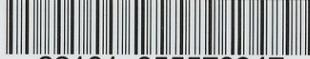
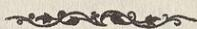
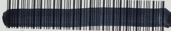

{0}------------------------------------------------

أيضاً إلى حجة

في

شيخ العروة

تأليف

آية الله الشيخ محمد المظفر

للجزء الأول

{1}------------------------------------------------

{2}------------------------------------------------

Princeton University Library

A standard 1D barcode with vertical black bars of varying widths on a white background.

Barcode

32101 055570947

# --- PRINCETON UNIVERSITY LIBRARY ---

*This book is due on the latest date  
stamped below. Please return or renew  
by this date.*

---

|  |  |
|--|--|
|  |  |
|--|--|

{3}------------------------------------------------

{4}------------------------------------------------

Muzaffari

## ايضاح الحجة

في

شرح العروة

تأليف

آية الله الشيخ محمد المظفرى

الجزء الاول

Decorative flourish or separator line

المطبعة العلمية - قم

{5}------------------------------------------------

(RECAP)  
(~~Arab~~)

BP174

.M89

ju 21

اسم الكتاب : ايضاح الحجة في شرح العروة

المؤلف : آية الله الشيخ محمد المظفرى

العدد : ١٠٠٠ نسخة

التاريخ : ذوالحجة الحرام سنة ١٣٠٥

المطبعة : العلمية - قم المقدسة

{6}------------------------------------------------

PRINCETON UNIVERSITY LIBRARY

PAIR

Barcode graphic

32101 018001550

### بِسْمِ اللَّهِ الرَّحْمَنِ الرَّحِيمِ

الحمد لله رب العالمين والصلاة والسلام على خاتم الانبياء وسيد المرسلين  
محمد وآله الطاهرين ولعنة الله على أعدائهم اجمعين من الآن الى قيام يوم الدين  
وبعد فيقول الحقير الفقير الى الله الغنى محمد بن ملا ابراهيم المظفرى القزوينى  
وفقه الله تعالى لمراضيه وجعل مستقبل أمره خيراً من ماضيه ان من من الله تعالى على  
التوفيق للبحث حول العلوم الاسلامية من الفقه والاصول والتفسير والرجال وغيرها منذ  
كنت في النجف الاشرف على ساكنها آلاف التحية والثناء وبعد الرجوع الى الوطن ،  
فلما تم بحثنا الاصولى على محور كفاية الاصول تأليف المرحوم آية الله العظمى  
الشيخ محمد كاظم الخراسانى تعمده الله تعالى برضوانه التمس منى عدة من رواد  
العلم والفضيلة أن أشرع فى الفقه على طبق العروة الوثقى تأليف المرحوم آية الله  
العظمى السيد محمد كاظم اليزدى قدس الله نفسه الشريفة وأبين المراد فيما يحتاج  
الى البيان وأشير الى الصحة او السقم وأشير الى أدلة ذلك كله على قدر فهمى القاصر  
وكانت المخالفة لهم صعباً على فاجبت سؤالهم وشرعت فى البحث بعون الله تعالى  
وكتبت ذلك ليكون ذكراً لى وذخراً ليوم فقرى وفاقى وأسئل الله تعالى أن يوفقنى  
باتمامه ورجائى من الناظرين العفو عن عثراتى والترحم على بعد مماتى وما توفيقى  
الا بالله عليه توكلت واليه انيب .

-٣-

87-854689-1

{7}------------------------------------------------

-٤-

ايضاح الحجة في شرح العروة

ج ١

## الاجتهاد والتقليد والاحتياط

(م - ١) يجب على كل مكلف في عباداته ومعاملاته أن يكون مجتهداً او مقلداً او محتاطاً .

أقول لابد في المقام من التكلم في جهات الاولى في بيان المراد من المكلف والعبادات والمعاملات والثانية في بيان معنى الاجتهاد والتقليد والاحتياط والثالثة في بيان ان الامر هنا هل هو منحصر بالامور الثلاثة او هنا امر رابع ايضاً والرابعة في بيان معنى الوجوب والخامسة في بيان مدرك الامور الثلاثة او الاربعة والسادسة في بيان ان هذه الامور هل هي في عرض واحد أو انها طولية .

اما الجهة الاولى فالمراد من المكلف : من وضع عليه قلم التكليف وهو من بلغ الى حد يمكن توجيه الخطاب اليه شرعاً وهذا يتحقق بأحد امور ثلاثة ، الاول : السن وهو اتمام خمس عشرة سنة للذكر ، وتسع سنة للانثى ، الثاني : خروج المني الذي عبر عنه في الاخبار بالاحتلام الثالث : انبات الشعر الخشن على العانة ، وذكر بعض ان اخضرار الشارب ونبات اللحية ايضا من علامات البلوغ .

ولا شك في اعتبار العقل في التكليف ايضا ويدل على ما ذكرنا عدة روايات (١) منها ما روى انه أتى عمر بامرأة مجنونة قد زنت فأمر برجمها فقال **عليه السلام** : أما علمت ان القلم يرفع عن ثلاثة عن الصبي حتى يحتمل وعن المجنون حتى يفيق وعن النائم حتى يستيقظ (٢) .

والمراد من العبادات : كل ما يعتبر فيه قصد القرابة وبدونه لا يحصل الامتثال كالصلاة والصوم والحج وغير ذلك من التعبدات ومقابلها التوصليات فانه يكفي فيها الاتيان بذات المأمور به بدون قصد القرابة كالغسل بالفتح ورد السلام واداء الدين وغير ذلك من التوصليات .

والمراد من المعاملات هنا كل ما لا يعتبر فيه قصد القرابة سواء كان من المعاملات

(١) الوسائل ج ١ الباب ٣ و ٤ من ابواب مقدمة العبادات

(٢) الباب ٤ من هذه الابواب ح ١١

{8}------------------------------------------------

ج ١

تعريف الاجتهاد والتقليد

-٥-

الاصطلاحية من العقود والايقاعات كالبيع والاجارة ونحوهما ، او من غيرها كالاطعمة والاشربة والصيد والذباحة وغيره فاكأنه قدس سره قال: يجب على كل مكلف في عباداته وغيره فيشمل جميع ابواب الفقه من الطهارة الى الديات كما صرح بما ذكرنا في (م-٤) و(م-٢٩) ويأتي.

واما الجهة الثانية فقد عرف الاجتهاد في كلام جماعة من العامة والخاصة باستفراغ الوسع في تحصيل الظن بالحكم الشرعي وهذا التعريف أصله من العامة وتبعهم في ذلك بعض الخاصة أيضا وهذا التعريف باطل جزماً ، فان الظن لا يغنى من الحق شيئاً . ولعل هذا التعريف أوجب استيحاش الاخبارى عن جواز الاجتهاد وعده من البدع والمحرمات وحينئذ استنكارهم في محله لحرمة العمل بالظن في الاحكام الشرعية بالادلة الاربعة .

والصحيح أن يعرف الاجتهاد باستفراغ الوسع في تحصيل الحجة على الاحكام الشرعية أو تعيين الوظيفة عند عدم الوصول اليها ، والاجتهاد بهذا المعنى مما لا مناص عن الالتزام به للاخبارى والاصولى وانما الاختلاف بينهما في بعض ما يراه الاصولى حجة ولا يراه الاخبارى حجة كبعض القواعد الاصولية وفي بعض ما يراه الاخبارى حجة ولا يراه الاصولى حجة كطلق ما في الكتب الاربعة من الروايات وغير ذلك من موارد الاختلاف بينهما وهذا الاختلاف لا يضر بما اتفقا عليه ومثل هذا الاختلاف قد يكون بين الاصوليين أيضاً كحجية اجماع المنقول والشهرة وغيرهما فكما أن هذا الاختلاف لا يضر بما اتفقوا عليه من جواز الاجتهاد فكذا ما اختلف الاخبارى والاصولى فيه لا يضر بما اتفقا عليه ، والمراد من المجتهد من كان واجداً لملكة الاجتهاد .

والتقليد فقد عرف بتعاريف وسياتي الكلام فيه عند تعرض السيد قدده له في (م-٨) وتحقيق المطلب هناك انشاء الله .

والاحتياط عبارة عن العمل على نحو يدرك به الواقع جزماً والكلام في مشروعيته وعدم مشروعيته يأتي في (م-٢) انشاء الله .

واما الجهة الثالثة من أن الامر في المقام منحصرا في الثلاثة من الاجتهاد

{9}------------------------------------------------

-٦-

ايضاح الحجة في شرح العروة

ج ١

والتقليد والاحتياط أو أن هنا شيئاً آخر أيضاً فالظاهر عدم الانحصار وأن الاتيان بنفس الواقع على ماهو عليه كاف أيضاً وان لم يكن باجتهاد أو تقليد أو احتياط ، أما في التوصليات فواضح واما في التعبدات ففيما اذا تمشى فيه قصد القرية كما اذا كان المكلف قاصراً أو غافلا حين العمل وقصد القرية ثم انكشف مطابقته للواقع أولرأى من يجب عليه تقليده وسيجىء الكلام فيه انشاء الله تعالى في (م٧) و(م١٦)

واما الجهة الرابعة : فالوجوب ، اما نفسى أو مقدمى أو طريقى أو غيرى أو عقلى ، والمراد منه فى المقام هو الوجوب العقلى لا غير .

بيان ذلك أن الوجوب النفسى ما ينشأ من مصلحة ملزمة فى المتعلق كوجوب الصلاة والصوم والحج ونحوها ، ولا شك فى أن الاجتهاد أو التقليد أو الاحتياط ليس كذلك وأنها ليس من العناوين الواجبة شرعاً ، الا بناءً على القول بالوجوب النفسى للتعلم كما عليه المقدس الاردبيلى قدس الله نفسه وتبعه فى ذلك بعض من تأخر عنه ويأتى الكلام فيه فى (م ٢٧) انشاء الله تعالى .

فلو تم هذا لتم فى التقليد بناء على أنه عبارة عن تعلم فتوى المجتهد وسيأتى فى (م ٨) ونبين انشاء الله ان هذا ليس بصحيح بل أصل وجوب التعلم ليس بوجوب نفسى وانما هو مقدمة للعمل كما ورد فى رواية صحيحة عن مسعدة بن زياد قال : سمعت جعفر بن محمد عليه السلام وقد سئل عن قول الله تعالى : فلله الحجة البالغة فقال : اذا كان يوم القيمة قال الله تعالى للعبد : أكنت عالماً ، فان قال نعم قال له : أفلا عملت ، وان قال كنت جاهلاً قال له : أفلا تعلمت حتى تعمل الخ (١) .

فلو كان وجوب التعلم نفسياً لكان فى رتبة العمل ويسئل عنه أولاً وابتداءاً لا بعد العذر من عدم العمل بعدم العلم ، فعلى هذا ليس المراد من الوجوب فى المقام الوجوب النفسى .

واما الوجوب المقدمى فهو ما يقع فى سلسلة علل وجود ذى المقدمة خارجاً

(١) امالى الشيخ المفيد قدس ص ١٧٢ ويأتى فى ص ٧٧ مصادر آخر .

{10}------------------------------------------------

ج ١

اقسام الوجوب

-٧-

وهذا لا يجرى في الاحتياط اصلا فان الاحتياط اما لا يحتاج الى التكرار أم يحتاج اليه وفي صورة عدم الاحتياج الى التكرار فهو نفس الواجب لا أنه مقدمة له ، وفيما اذا أحتاج الى التكرار كما في دوران الامر بين القصر والتمام في بعض الموارد أو في اشتباه القبلة وغيرهما فهو وان كان مقدمة الا أنه لا للواجب بل لاحراز الواجب فيكون مقدمة للعلم لا مقدمة للواجب ، فالوجوب المقدمي في الاحتياط لا يجرى وأما الاجتهاد والتقليد فهما وأن كانا في بعض الموارد مقدمة للواجب كما في الواجبات المركبة من الصلاة والحج وغيرهما فان العمل في هذه الموارد يتوقف على العلم بها اجتهاداً أو تقليداً ، الا انه ليس كذلك في كل مورد فان ذات العمل قد لا يتوقف على العلم بحكمه كالغسل ورد السلام وأداء الامانة وغير ذلك من الموارد ، فالمقدمية على الاطلاق لا يتم فيهما ، على انه يكفي في المنع عدم جريان المقدمية في الاحتياط فان الجامع لابد وأن يكون سارياً في جميع افراده فلا يكون الوجوب الجامع بين الاجتهاد والتقليد والاحتياط وجوبا مقدما .

واما الوجوب الطريقي فهو اما منجز للواقع أو معذر فيما اذا خالف الطريق الواقع والمنجزية لا يكون في الاحتياط بل المنجز للواقع هو العلم الاجمالي بثبوت أحكام الزامية في الشريعة المقدسة أو احتمال ذلك وحيث أن الاصول لا تجرى في أطراف العلم الاجمالي وكذا في الشبهات الحكمية قبل الفحص ولو كان التكليف احتمالياً فيكون العلم الاجمالي بالتكاليف الالزامية أو احتمال ذلك منجزاً لا الاحتياط على أن الاحتياط انما هو في مرحلة العمل والامتثال . والمنجز لابد وأن يكون قبل ذلك وفي مرتبة سابقة عليه .

واما المعذرية فهي انما تتصور فيما اذا خالف الطريق الواقع فيكون شيء آخر معذرا له عند المخالفة ، وبالاحتياط يؤتى بنفس الواقع فلا معنى للمخالفة هنا حتى يكون الاحتياط معذراً .

{11}------------------------------------------------

-٨-

ايضاح الحجة في شرح العروة

ج ١

واما الاجتهاد والتقليد فالمنجزية فيهما ايضا لا يمكن لما مر من أن المنجز هو العلم الاجمالي أو الاحتمال .

نعم المعذرية يمكن فيهما فان الاجتهاد اذا كان مخالفاً للواقع يكون معذراً للمجتهد وكذلك التقليد عند اشتباه مجتهد العامى والمقلد يكون معذراً له ولكن مع ذلك لا يمكن أن يكون المراد من الوجوب الجامع بين الاجتهاد والتقليد والاحتياط وجوبا طريقيا لعدم سريانه في جميع الافراد .

وأما الوجوب الغيرى فهو ما ينشاء من مصلحة في الغير كوجوب الطهارة للصلاة وغيرها مما يعتبر فيه الطهارة فهو وان كان يمكن في الاجتهاد والتقليد في بعض الموارد كما مر الا انه لا يجرى في الاحتياط أصلا فلا يكون الجامع بين الافراد هو الوجوب الغيرى أيضا .

واما الوجوب العقلى فهو اما بملاك لزوم شكر المنعم كما في وجوب معرفة الله تعالى واما بمناط لزوم دفع الضرر المحتمل ويعبر عنه بالوجوب الفطرى والمراد بالوجوب في المقام هو الثانى اى الوجوب العقلى الفطرى بملاك دفع الضرر المحتمل وبيان ذلك أن كل عاقل يدرك أنه ليس كالبهائم في نظر الشارع المقدس و يعلم ان الشارع يطلب منه طلبا الزامياً أشياء فعلا أو تركاً فلو خالفه في شىء منها لاستحق العقاب فيجب عقلا بمناط لزوم دفع الضرر المحتمل تحصيل المؤمن من العقاب وهذا يحصل اما بتحصيل الحجة على الامن كما في الاجتهاد والتقليد و اما باحراز الواقع وهذا يكون في الاحتياط وسيأتى في (م٧) ماله ربط بالمقام .

وأما الجهة الخامسة من أن المدرك في وجوب العمل بالطرق الثلاثة أى شىء فوجوب عمل المجتهد و فتواه برأيه اما عمل بالعلم كما في الموارد التى يحصل العلم له من الاجماع أو تواتر الروايات وغير ذلك فحجية العلم ذاتية ولا تناله يد الجعل نفيا وأثباتا ، واما عمل بالحجة شرعية أو عقلية ، والحجية لابد و أن تثبت بالقطع ، والحجة ان صادفت الواقع فهو والا يكون هو معذورا في ترك الواقع والحجة معذرة له .

{12}------------------------------------------------

ج ١

مدرك وجوب العمل بالطرق الثلاثة

-٩-

وأما وجوب التقليد على العامى فقد ثبت بالسيرة القطعية العقلانية ولم يردع عنها الشارع مضافا الى دلالة عدة من الروايات المعتبرة على ذلك (١) و سيأتى التعرض لها في المباحث الآتية وكذلك تدل عليه بعض الآيات كآية السؤال والنفر (٢) واما وجوب الاحتياط فان العمل بالاحتياط يوجب القطع بالواقع الموجب للامن من العقوبة فالاحتياط ان لم يكن اولى من الاجتهاد والتقليد في تحصيل الامن من العقوبة فلا اقل من كونه في مرتبتهما كما هو الواضح .

واما الجهة السادسة : من ان الامور الثلاثة في عرض واحد أو انها مترتبة وطولية ، الكلام في المقام تارة في تقدم الاجتهاد على التقليد وعدم تقدمه ، وأخرى في تقدمهما على الاحتياط أو بالعكس أو انها في عرض واحد .

اما الكلام في المقام الاول فتارة يفرض الكلام فيمن هو واجد لملكة الاجتهاد وأخرى فيمن هو فاقد للملكة ولكن قادر على تحصيلها .

اما الاول فلا شك في عدم جواز تقليده فلابد له من الاجتهاد والعمل برأيه ، لعدم شمول ادلة التقليد (من السيرة والاطلاقات ) له اما السيرة فلعدم ثبوتها ، و اما الاطلاقات فلانصرافها عمن له ملكة الاجتهاد .

واما الثانى فالظاهر أنه لا اشكال في جواز تقليده ولا يجب عليه تحصيل الملكة للسيرة العقلانية فانها قائمة على رجوع الجاهل الى العالم وان كان الجاهل متمكناً من تحصيل الملكة والاطلاقات ايضاً تشمله ، فعلى هذا له أن يحصل ملكة الاجتهاد ثم يجتهد ويعمل برأيه وله أن يقلد .

و اما الكلام في المقام الثانى ، فالاحتياط تارة يفرض فيما يستلزم الاخلاص بالنظام فلا اشكال في عدم جواز شرعا وعقلا و اخرى فيما يستلزم العسر والحرج فلا يجب اختياره فان ما ينشأ منه العسر والحرج مرفوع في الشريعة المقدسة فهاتان

(١) راجع الوسائل ج ١٨ ص ٩٨ب ١١ من ابواب صفات القاضى

(٢) آية السؤال في سورة النحل ٤٣ وسورة الانبياء ٧ وآية النفر سورة التوبة ١٢٢

{13}------------------------------------------------

-١٠-

ايضاح الحجة في شرح العروة

ج ١

الصورتان خارجتان عن محل الكلام ، وانما الكلام فيما لا يلزم منه محذور الاخلال او العسر والحرج .

فقد يقال ان الاحتياط في طول الاجتهاد والتقليد فان الامتثال التفصيلي ولو كان ظنيا مقدم على الامتثال الاجمالي ولو كان قطعياً.

ولكن هذا غير صحيح ، اما في التوصليات فواضح فان مقصود الشارع فيها الاتيان بذات العمل كيف ما كان وهذا يحصل مع الاحتياط ايضاً ، واما في العبادات فانه لا فرق بينها وبين التوصليات الا اعتبار قصد القرابة في العبادات وهو اضافة العمل الى الله سبحانه والاضافة كما يتحقق بالتفصيل كذلك يتحقق بالاجمال فعلى هذا ليس الاحتياط في طول الاجتهاد والتقليد .

وقد يقال عكس ذلك وهو تقدم الاحتياط على الاجتهاد والتقليد ، وهذا مبني على تقدم الامتثال القطعي ولو كان اجمالياً على الامتثال الظني ولو كان تفصيلياً خصوصاً في غير العبادات .

وهذا ايضاً غير تام فان اطلاقات ادلة اعتبار الامارات يشمل ما اذا كان المكلف متمكناً من تحصيل العلم بالامتثال بالاحتياط وان الامارة في نظر الشارع بمنزلة العلم الوجداني فلا فرق بين تحصيل العلم الوجداني بالامتثال وبين العلم التعبدى ، فظهر أن الاحتياط في عرض الاجتهاد والتقليد ، هذا تمام كلامنا في المسئلة الاولى .

(٢-م) الاقوى جواز العمل بالاحتياط مجتهداً كان او لا، لكن يجب ان يكون عارفاً بكيفية الاحتياط بالاجتهاد او بالتقليد .

اختلف في جواز الاحتياط وعدمه ، قيل بعدم الجواز وذكرفي وجه ذلك أمور الاول - أنه نسب الى المشهور بطلان عبادة تارك طريق الاجتهاد والتقليد فلو كان الاحتياط جائزاً لما ذهب اليه المشهور فيعلم منه عدم جواز الاحتياط (١)

(١) الوسائل ص ٢٩٨ من طبعة رحمة الله .

{14}------------------------------------------------

ج ١

جواز العمل بالاحتياط

-١١-

وفيه اولا النسبة غير صحيحة و ثانياً على فرض الصحة انما هو فيما اذا ترك الواقع من جهة الجهل بموازين الاحتياط وأما اذا كان عالماً وعارفاً بكيفية الاحتياط فلا دليل على بطلان العمل فان الغرض الاتيان بالواقع على ما هو عليه والمفروض انه يحصل بالاحتياط فلا وجه لبطلانه .

الثاني ما عن المتكلمين من انه يعتبر في العبادات قصد الوجه من الوجوب او الندب حين العمل بان يؤتى به تقرباً الى الله سبحانه لوجوبه أولندبه وفي الاحتياط لا يمكن ذلك حين العمل فلا يجوز .

وفيه أنه لا دليل على ذلك لاعتقلا ولا شرعا وانما المعتبر في العبادة قابلية العمل في نفسه للاضافة الى الله سبحانه و اضافته اليه تعالى حين العمل فكما يمكن هذا بالاجتهاد والتقليد كذلك يمكن بالاحتياط والرجاء .

الثالث انه يجب تعلم الاحكام على كل مكلف اما بالاجتهاد واما بالتقليد فمع التمكن من أحدهما لاتصل النوبة الى الاحتياط ، ويشهد على ذلك ما نقل عن السيد الرضى قدس سره من انه سئل أخاه المرتضى قدس سره فقال ان الاجماع واقع على ان من صلى صلاة لا يعلم أحكامها فهي غير مجزية ، والجهل باعداد الركعات جهل بأحكامها فلا تكون مجزية وأجاب المرتضى قدس سره بجواز تغيير الحكم الشرعي بسبب الجهل وان كان الجاهل غير معذور انتهى فالاجماع قائم على بطلان العمل فيما اذا لم يعلم حكمه وفي مورد الاحتياط لا يعلم بالحكم فلا يجوز .

وأما وجوب التعلم فقد ثبت بالكتاب والسنة فمن الكتاب آيتي النفرو السؤال ومن السنة قوله عليه السلام : طلب العلم فريضة على كل مسلم (١) وفي حديث عن الرضا عليه السلام عن آبائه عليهم السلام قال : قال رسول الله صلى الله عليه وآله وسلم : اللهم ارحم خلفائي ثلاث مرات فقيل له يا رسول الله ومن خلفائك قال صلى الله عليه وآله وسلم : الذين يأتون من بعدى ويرون عنى أحاديثى وسنتى فيعلمونها الناس من بعدى (٢) وغير ذلك من الروايات .

(١) الوسائل ج ١٨ ص ب ٤ .

(٢) في المصدر ب ٨ من ابواب صفات القاضى ح ٥٣ .

{15}------------------------------------------------

-١٢-

ايضاح الحجة في شرح العروة

ج ١

وفيه أن وجوب التعلم طريقى ومقدمى والمقصود منه العمل والانيان بالواقع ولاريب أن هذا الغرض يحصل بالاحتياط بنحو أوثق .

الرابع انه قد ثبت بدليل الانسداد بطلان الاحتياط و عليه يتم دليل الانسداد والافلا يتم .

وفيه اولا نحن لانقول بالانسداد ، وثانياً أن الانسداد لا يقول بطلان الاحتياط بل يقول بعدم وجوبه فعلى هذا لا مانع من الاحتياط .

ثم ان المراد من جواز الاحتياط هو الجواز الوضعى اى الصحة دون التكليفى فان المراد من الاحتياط هو احراز الواقع وحصول الامن كما هو الظاهر واما قوله قده : لكن يجب أن يكون عارفاً بكيفية الاحتياط بالاجتهاد او بالتقليد فهو صحيح ومتين فان العلم بكيفية الاحتياط من المقدمات الوجودية له وبدونه لا يمكن الاحتياط .

(م-٣) قد يكون الاحتياط فى الفعل كما اذا احتمل كون الفعل واجباً وكان قاطعاً بعدم حرمته ، وقد يكون فى الترك كما اذا احتمل حرمة فعل وكان قاطعاً بعدم وجوبه ، وقد يكون فى الجمع بين امرين مع التكرار كما اذا لم يعلم أن وظيفته القصر أو التمام .

ما ذكره قده فى المورد الاول من الشبهة الوجوبية والشك فيه تارة يكون فى اصل التكليف كالدعاء عند رؤية الهلال لا اشكال فى جريان البراءة فيه واخرى فى الجزئية والشرطية والقيدية وفى جريان البراءة فيها اشكال ولكن الظاهر جريانها فيها أيضاً كما حقق فى محله .

والمورد الثانى من الشبهة التحريمية والشك فيه أيضاً تارة فى اصل التكليف كشرب التتن واخرى فى المانعة والقاطعية والكلام فى جريان البراءة هنا هو الكلام فى المورد الاول ، هذا بالنسبة الى المجتهد .

{16}------------------------------------------------

ج ١

وجوب التقليد في غير الضروريات واليقينيات

-١٣-

واما من لم يكن مجتهداً ولم يقلد أيضاً واراد العمل بالاحتياط فلابد من الاتيان في المورد الاول والترك في المورد الثاني .

واما المورد الثالث فهو من دوران الامر بين المتباينين وجريان البراءة في كل واحد منهما ينافي العلم الاجمالي بالتكليف المردد بينهما وفي أحدهما دون الآخر ترجيح بالامرجح فلابد من الاحتياط حتى بالنسبة الى المجتهد هذا اذا لم يتم الدليل عنده على أحد الطرفين .

( م - ٤ ) الاقوى جواز الاحتياط ولو كان مستلزماً للتكرار وأمكن

الاجتهاد أو التقليد .

تقدم الكلام في مشروعية أصل الاحتياط في ( م - ٢ ) والكلام في المقام في مشروعيته فيما إذا استلزم التكرار وقد أستشكل في المقام بامور الاول - أن تكرار العمل بالاحتياط مع التمكن من العمل بالتكرار باجتهاد أو تقليد لعب وعبث بأمر المولى ، واللعب والعبث بأمر المولى غير جائز (١) .

وفيه أن اللعب والعبث أمران قصديان والمحتاط لا يقصد بتكرار عمله اللعب والعبث وأنما يقصد به أحراز الواقع جزماً ، وهذا مثل الضرب فانه يمكن أن يكون للتأديب ويمكن ان يكون للتشفى فكما ان هذين يمتاز أحدهما عن الآخر بالقصد كذلك في المقام .

ثم على فرض كونهما من الامور الواقعية لا ينطبقان على الاحتياط مع قصد درك الواقع في نظر العرف وهذا يكفي في صحة الاحتياط فان المعيار في صدق الاطاعة هو نظر العرف .

ثم على فرض تسليم ذلك ايضاً لا مانع من الاحتياط فان اللعب والعبث أنما يكون في كيفية الامتثال لافى نفس الامتثال وهذا لا يضر بنفس الامتثال .

(١) الوسائل ص ٢٩٩ من طبعة رحمة الله .

{17}------------------------------------------------

-١٢-

ايضاح الحجة في شرح العروة

ج ١

الاشكال الثاني أنه يعتبر قصد الامر في صحة الاطاعة والامتثال تفصيلا وهذا لا يمكن في الاحتياط .

وفيه أن الاطاعة والامتثال عرفي فما لم يردع عند الشارع يكون هو المتبع ولاشك في صدق الاطاعة والامتثال عرفاً في المقام ولم يرد من الشارع منع أيضاً فلامانع من تكرار العمل بالاحتياط .

والاشكال الثالث : أنه لابد من كون الامر داعياً الى العمل وفي الاحتياط المستلزم للتكرار يكون الداعي الى العمل هو احتمال الامر لانفسه وهذا لا يكفي . وفيه أن الداعي الى العمل في الاحتياط أيضاً هو الامر لاحتمال الامر كما ان في العلم التفصيلي بالامر يكون الداعي هو الامر لا العلم بالامر ، فظهر أنه لامانع من الاحتياط ولو كان مستلزماً للتكرار .

( م - ٥ ) في مسئلة جواز الاحتياط يلزم أن يكون مجتهداً أو مقلداً لان المسئلة خلافية .

ما ذكره قده صحيح لما يأتي في المسئلة الاتية من عدم الحاجة الى التقليد في الضروريات واليقينيات ومن المعلوم عن مسئلة جواز الاحتياط ليست من الضروريات ولا من اليقينيات فلابد فيها من الاجتهاد أو التقليد .

والوجه في ذلك أنه مع الشك في جواز الاحتياط لا يحصل الامن من محذور مخالفة الواقع فبحكم العقل يجب تحصيل المؤمن من اجتهاد أو تقليد .

( م - ٦ ) في الضروريات لاحاجة الى التقليد كوجوب الصلاة والصوم ونحوهما وكذا في اليقينيات إذا حصل له اليقين وفي غيرهما يجب التقليد أن لم يكن مجتهداً أذالم يمكن الاحتياط وأن امكن تخير بينه وبين التقليد .

ما ذكره قده صحيح فانه اذا علم المكلف بالواقع اما لكونه ضرورياً وبداهياً كما في وجوب الصلاة ونحوه أو لكونه من اليقينيات فلامعنى للتعبد بالامارة سواء

{18}------------------------------------------------

ج ١

عمل العامى بلا تقليد

-١٥-

كانت اجتهاداً أو تقليداً فان حجية الامارة أنما هو بالنسبة الى من جهل بالواقع فمع العلم بالواقع لامعنى للتعبد .

وأما فى غير الضروريات واليقينيات فلابد من تحصيل المؤمن عن العقاب، فان تمكن من كل واحد من الاجتهاد والتقليد والاحتياط يتخير بينها والا يتخير بين اثنين منهما وحيث ان الغالب فى العوام عدم التمكن من الاجتهاد والاحتياط فيتعين التقليد فى حقه ومن له ملكة الاجتهاد يتعين فى حقه الاجتهاد كما تقدم فى ص ٩ .  
(م - ٧) عمل العامى بلا تقليد ولا احتياط باطل .

مراده قده هنا من البطلان هو البطلان العقلى بمعنى أنه لا يجوز الاكتفاء عليه عقلا ما لم ينكشف مطابقته للواقع أولفتوى من يجوز له تقليده كما سيجىء التصريح بذلك منه قده فى (م - ١٦) .

فلو انكشف مطابقة العمل للواقع أول رأى من يجوز له تقليده يحكم بصحته ان كان العمل غير عبادى بلا فرق بين كونه قاصراً او مقصراً ، وأما اذا كان العمل عباديا يحكم بالصحة أيضا فيما اذا تمشى منه قصد القرابة كما فى القاصر بل المقصر أيضا اذا كان غافلا حين العمل وتمشى منه القرابة ، والا فيشكل الحكم بالصحة من جهة اعتبار قصد القرابة فى العبادة ويأتى بعض الكلام فيه فى (م - ١٦) .

وقد يفرق بين مطابقة العمل للواقع وبين مطابقته لرأى من يجوز له تقليده فيحكم بالصحة فى الاول دون الثانى ، وذلك فان فتوى المجتهد من الطرق الظاهرية والطرق الظاهرية انما تفيد بعد الاخذ بها والعمل على طبقها ، والمفروض فى المقام أنه حين العمل لم يكن آخذاً بالطريق الظاهرى فالآخذ بالطريق الظاهرى بعد العمل لا اثر له بالنسبة الى ماضى (١) .

وفيه : أنه ما لم ينكشف مطابقة العمل للواقع أو لرأى من يجب أو يجوز له تقليده يجب بحكم العقل اعادة العمل اما بالاحتياط أو التقليد ، وأما اذا - انكشف مطابقة العمل لرأى من يجوز له تقليده فلا يجب الاعداد فآثر انكشاف المطابقة لرأى

(١) يأتى من الماتن قده فى (م ١٦) عكس ذلك .

{19}------------------------------------------------

-١٦-

ايضاح الحجة في شرح العروة

ج ١

مجتهد انما هو بالنسبة الى الاعداد لا بالنسبة الى ماضى بل قال شيخنا الانصارى قد: وتوهم أن ظن المجتهد وفتواه لا يؤثر في الواقعة السابقة غلط لان مؤدى ظنه نفس الحكم الشرعي الثابت للاعمال الماضية والمستقبلة ، واما ترتيب الاثر على الفعل الماضى فهو بعد الرجوع فان فتوى المجتهد بعدم وجوب السورة كالعلم في ان اثرها قبل العمل عدم وجوب السورة في الصلاة وبعد العمل عدم وجوب اعادة الصلاة الواقعة من غير سورة الرسائل ص ٣٠٧ من طبعه رحمة الله .

نعم يشكل الحكم بالصحة فيما اذا انكشف المطابقة لرأى من يجوز له تقليده حين العمل وكان مخالفاً لرأى من يجوز له تقليده بالفعل فانه بالنسبة الى الاعداد لا يمكن الاخذ بقول المجتهد السابق لعدم حجيته فعلا ومن يكون قوله حجة بالفعل يحكم بلزوم الاعداد نعم لو كان المجتهد السابق ميتاً وكان أعلم من الحي وقد أفتى الحي بجواز البقاء على تقليد الميت يمكن او بوجوبه الحكم بالصحة هنا ايضاً .

(٨-٣) التقليد هو الالتزام بالعمل بقول مجتهد معين وان لم يعمل بعد بل ولو لم يأخذ فتواه ، فاذا أخذ رسالته والتزم بالعمل بما فيها كفى في تحقق التقليد .

قد عرف التقليد في كلمات القوم بتعاريف منها أنه الالتزام بالعمل ومنها العمل بقول الغير ، ومنها التعلم لاجل العمل ومنها الاخذ بقول الغير ومنها العمل المستند الى فتوى الغير وغير ذلك من التعاريف .

التقليد في اللغة هو جعل الغير اذا قلادة وفي مجمع البحرين التقليد من القلادة التي تعلق في العنق ، وقلدته قلادة جعلتها في عنقه وفي حديث الخلافة : فقلدها رسول الله (ص) علياً (ع) أي جعلها في رقبته انتهى .

ومنه التقليد في حيج القران فان المحرم يجعل نعاله في عنق الابل كالقلادة . (١)

(١) الوسائل ج ٨ ص ١٩٨ ب ١٢ من ابواب اقسام الحج .

{20}------------------------------------------------

ج ١

في حقيقة التقليد

-١٧-

الظاهر أن التقليد في المقام ليس له معنى آخر غير معناه اللغوي بل هو بمعناه اللغوي ويشهد على ذلك صحيحة عبدالرحمن بن الحجاج قال : كان أبو عبدالله عليه السلام قاعداً في حلقة ربيعة الرأي وهو ربيعة بن عبدالرحمن المعروف بربيعة الرأي المدني الفقيه عامي استاد مالك بن انس كما يأتي في ص ١٩ - فجاء أعرابي فسأل ربيعة الرأي عن مسألة فأجابه ، فلما سكت قال له الأعرابي أهو في عنقك فسكت عنه ربيعة ولم يرد عليه شيئاً ، فأعاد المسئلة عليه فأجابه بمثل ذلك فقال له الأعرابي : أهو في عنقك فسكت ربيعة فقال أبو عبدالله (ع) : هو في عنقه قال أولم يقل وكل مفت ضامن (١) .

فيعلم من هذه الصحيحة أن ضمان الفتوى على عهدة المفتي وعلى عنقه وقد ورد في كفارات الحج أن من افتى بقلم الظفر فعلم فعلى الذي أفتى شاة (٢) وغير ذلك من الروايات .

وبعد ما علم معنى التقليد لغة وأن المراد منه في المقام أيضاً معناه اللغوي أقول : ان العمل قدينكشف مطابقته لرأي من يجوز له تقليده ويحكم بصحته على ما مر ولكن هذا ليس بتقليد فانه لابد في التقليد من العلم بالفتوى قبل العمل حتى يكون العمل عن تقليد فعلى هذا يمكن ارجاع بعض التعاريف الى بعض آخر وانما الاختلاف في التعبير مثلا : العمل بقول الغير ، والعمل المستند الى فتوى الغير ، والالتزام مع العمل شيء واحد ، وانما الالتزام بالعمل أو قبول قول الغير من دون مطالبة الدليل أو تعلم المسائل لاجل العمل وغير ذلك مما قيل في تعريفه فغير صحيح .

والصحيح أن التقليد هو العمل مستنداً الى فتوى المجتهد كما عليه عدة من الاكابر وقد يقال : ان التقليد لو لم يكن سابقا على العمل يكون العمل الاول بلا تقليد كما ذكره في الكفاية فلابد من كون التقليد غير العمل من الالتزام أو اخذ الفتوى أو غير ذلك والايلاءم الدور فانه بناء على ذلك يكون العمل متوقفا على التقليد والتقليد على

(١) الوسائل ج ١٨ ص ١٦١ ب ٧ من ابواب آداب القاضي ح ٢ .

(٢) الوسائل ج ٩ ص ٢٩٤ ب ١٣ من ابواب بقية كفارات الاحرام .

{21}------------------------------------------------

-١٨-

ايضاح الحجة في شرح العروة

ج ١

العمل وهذا باطل وغير ممكن .

والجواب عن ذلك أن الشرط قد يكون متقدماً على المشروط وقد يكون مقارناً والاستناد الى فتوى المجتهد بالنسبة الى العمل من الشرط المقارن فاذا استند العامى فى العمل الاول الى فتوى مجتهد يتحقق التقليد فيه أيضاً ولا يلزم الدور نعم لابد من العلم بفتوى المجتهد قبل العمل حتى يمكنه الاستناد اليه حين العمل والتعلم ليس بتقليد وانما هو مقدمة له .

ثم ان الماتن قد ذكر أن التقليد هو الالتزام بالعمل بقول مجتهد معين الخ اذا كان المجتهد فى الخارج واحداً لا يحتاج الى التعيين فانه متعين بنفسه واذا كان متعدداً فان كانوا متفقين فى الفتوى أيضاً لا يحتاج الى التعيين فيصح استنادُه الى الكل او الكلى فى المعين لاطلاقات الادلة هذا نظير الروايات المتعددة الدالة على شىء واحد فان المجتهد حين الفتوى لا يحتاج الى تعيين واحد منها حتى يستند اليه .

واما اذا كانوا مختلفين فى الفتوى فلا بد من التعيين فان كان فى البين اعلم يتعين تعيينه والافان امكن الاحتياط فلا بد من الاخذ باحوط الاقوال على ما يأتى وان لم يمكن الاحتياط فان كان فى البين مظنون الاعلمية أو محتمل الاعلمية يتعين تقليده فانه من دوران الامر بين التعيين والتخيير فى الحجية وفيه يتعين ما يحتمل تعيينه والايخير بينهما ويعين من شاء نظير الروايات المتعارضة بالنسبة الى المجتهد بناء على القول بالتخيير فيها .

( م - ٩ ) الاقوى جواز البقاء على تقليد الميت ولا يجوز تقليد

الميت ابتداء .

الكلام فى المقام تارة فى جواز تقليد الميت ابتداء وأخرى فى جواز البقاء على تقليد الميت .

الكلام فى المقام الاول أيضاً يقع تارة فى وظيفة العامى وأخرى فى وظيفة المجتهد بمعنى أنه هل يجوز له أن يفتى بجواز تقليد الميت ابتداء ام لا .

{22}------------------------------------------------

ج ١

في جواز البقاء على تقليد الميت

-١٩-

اما العامى فلا بد له من الرجوع الى العالم فى هذه المسئلة فانه يعلم اجمالا بثبوت التكاليف الواقعية وتنجزها فى حقه بذلك العلم الاجمالى ، ولا يتمكن من استفادة ذلك من الادلة الاجتهادية ولا يمكنه الاحتياط فى جميع المسائل لعدم العلم بكيفيته فى اكثر الموارد فلا بد له من التقليد فى هذه المسئلة وهذا واضح .

وأما المجتهد فهل له أن يفتى بجواز تقليد الميت ابتداء أم لا المسئلة محل خلاف بين المسلمين أما العامة فهم متفقون فى جواز ذلك فلذا يقلدون اشخاصا معينة وهم اربع نفرات عندهم وهم أبوحنيفة ومالك بن أنس ومحمد بن ادريس الشافعى وأحمد بن حنبل وهؤلاء رؤساء المذاهب الاربعة .

ذكر السيد الاجل رضى الدين على بن طاوس طاب ثراه : أن السبب فى احداث المذاهب الاربعة أن الصادق عليه السلام اجتمع عليه فى عصر المنصور أربعة آلاف راوى يأخذون منه العلم من جملتهم أبوحنيفة النعمان بن ثابت ومالك بن أنس فلما رأى المنصور اجتماع الناس على الصادق عليه السلام خاف ميل الناس اليه وأخذ الملك منه فامر أبا حنيفة ومالكا باعتزال الصادق (ع) واحداث مذهب غير مذهبه وجعل لهما ومن تابعهما وقرر عليهما العلوف والادرارات والناس عبيد الدنيا وأمر الحاكم مطاع .

فاعتزل أبوحنيفة عن الصادق (ع) وأحدث مذهبا غير مذهبه وعمل فيه بالرأى والقياس والاستحسانات والاجتهاد فذهب فيه الى أشياء شنيعة ، ثم اعتزل مالك عن الصادق (ع) وكان يقرأ عليه وعلى ربيعة الرأى فاحدث مذهبا غير مذهبهما وغير مذهب أبى حنيفة ، ثم جاء بعدهما الشافعى محمد بن ادريس فقرء على مالك وعلى محمد بن الحسن الشيبانى صاحب أبى حنيفة فاحدث مذهبا غير مذهبهما ثم جاء من بعده أحمد بن حنبل فقراء على الشافعى فاحدث مذهبا غير مذهبه ثم استقرت مذاهب السنة فى الفروع على هذه الاربعة المذاهب الحادثة أيام المنصور ، وبقيت الشيعة الامامية على المذهب الذى كان عليه رسول الله صلى الله عليه وآله والصحابة والتابعون

{23}------------------------------------------------

-٢٠-

ايضاح الحجة في شرح العروة

ج ١

له قبل احداث هذه المذاهب الاربعة (١) .

وأما الخاصة فهم ايضا متفقون على عدم جواز تقليد الميت ابتداء وأن نسب الى الاخبار بين جواز ذلك وكذا الى الميرزا القمي رحمة الله عليه .

الظاهر ان النسبة الى الاخباريين ليست بصحيحة وذلك فانهم ينكرون أصل التقليد حتى بالنسبة الى الاحياء فضلا عن الاموات وأن مرادهم منه جواز العمل بروايات المتقدمين كالكلى والصدوق والشيخ وغيرهم قدس الله أسرارهم وهذا عمل بالرواية وقول المعصوم لا انه تقليد الاموات .

وأما الميرزا القمي قدس سره فهو أيضا لا يقول بجواز تقليد الميت ابتداء وانما هو قائل بالانسداد ونتيجة الانسداد حجية مطلق الظن ولو كان حاصلا من قول مجتهد ميت .

وفيه أن أصل المبنى غير صحيح فان باب العلم وان كان منسداً إلينا الا أن باب العلمى غير منسد لنا لحجية الروايات مع الشرايط وهى بحمد الله كافية فى معظم الفقه والرجوع الى الاصول فى غير المعظم لامحذور فيه ثم على فرض التسليم لا يترتب على الانسداد حجية قول مجتهد واحد من الاموات فان الظن الحاصل من قول المشهور أقوى بمراتب من الظن الحاصل من قول واحد فأصل المبنى والبناء كلاهما باطل .

ومع ذلك فقد يستدل على جواز تقليد الميت ابتداء بامور الاول : اطلالات الكتاب والسنة كآيتى النفر والسؤال وعناوين الفقيه والعالم والعارف بالاحكام وغير ذلك من العناوين المأخوذة فى الروايات فانها مطلقة فيشمل الاموات أيضاً . وفيه انه لا اطلاق فى الايات والروايات حتى يؤخذ به فان الظاهر من الانذار فى الآية أن يكون المنذر حياً حين الانذار بالنسبة الى المنذر بالفتح وان لم يكن حياً حين العمل وكذا السؤال فانه ظاهر فى كون المسؤل حياً حين السؤال عنه

(١) زهر الربيع ج ٢ ص ١٢٠

{24}------------------------------------------------

ج ١

في تقليد الميت

-٢١-

و كذلك العناوين العامة المأخوذة في الروايات فانها ظاهرة في كون الفقيه والعالم والعارف بالاحكام أحياء حين الرجوع اليهم و كذلك الروايات الخاصة التي ارجع فيها الى اشخاص خاصة وهذا واضح .

ثم على فرض تسليم الاطلاق فلا يشمل صورة الاختلاف في الفتوى ولا شك في أن الاموات كالاحياء مختلفون في الفتوى والاطلاقات لاتشمل صورة الاختلاف في الاحياء فضلا عن الاموات .

نعم في صورة الاختلاف بين الاحياء أثبتنا حجية قول الاعلم بدليل آخر وهو السيرة العقلائية المستمرة من زماننا الى زمن المعصومين سلام الله عليهم اجمعين ولم يردع عنهما الشارع كما سيجيء انشاء الله تعالى .

الامر الثاني : السيرة فان العقلاء لايفرقون في رجوع الجاهل الى العالم بين الحي والميت فلذا يراجعون الى كتب الطب وغيرها ويعملون بما فيها فبالسيرة يثبت جواز تقليد الميت ابتداء .

وفيه أن السيرة وان كانت قائمة على ذلك الا ان السيرة انما تكون حجة فيما لم يردع عنها الشارع ، وفي المقام قد منع الشارع عن السيرة .

وبيان ذلك أنا ذكرنا أن الاطلاقات لاتشمل صورة الاختلاف حتى في الاحياء وقد ثبت في الاحياء في صورة الاختلاف لزوم الرجوع الى الاعلم كما ياتي انشاء الله تعالى وهذا غير ممكن في الاموات وذلك فانه مقطوع العدم فان لازم ذلك حجية قول واحد من الفقهاء في الشريعة المقدسة وهو الاعلم من الكل فلنفرضه شيخنا الطوسي قدس سره ولازم ذلك أن يكون الاثمة ثلاثة عشر نفرا لا اثنى عشر وهذا ضروري البطلان وهذا هو الرادع عن السيرة العقلائية في المقام .

الثالث : الاستصحاب : فان رأى الميت كان حجة في زمان حيوته وبعد موته نشك في بقاء حجية رأيه فنستصحب الحجية .

وفيه اولا يمكن أن يكون للرأى والنظر دخلا في الحجية وبالموت يزول

{25}------------------------------------------------

-٢٢-

ايضاح الحجة في شرح العروة

ج ١

الرأى فلاموضوع للاستصحاب كما ذكره صاحب الكفاية قدس الله نفسه الشريف .  
وثانياً أنه يعتبر في جريان الاستصحاب القطع بالثبوت والشك في البقاء ونحن  
لانقطع بثبوت حجية رأى الميت في حقنا حتى نشك في بقائها .

وبيان ذلك: أن المراد من حجية رأى الميت اما الحجية الفعلية واما الحجية  
الشأنية ، أما الاول فمقطوع العدم فانا لم نكن موجوداً في زمان حيوته فضلا عن  
البلوغ حتى يكون رأيه حجة بالفعل في حقنا .

وأما الحجية الشانية فمعناها جعل الحجية لرأيه على نحو القضية الحقيقية يعني  
قوله حجة لكل مكلف سواء كان في زمان حياته أو يوجد بعد ذلك وحينئذ لوشك في  
بقاء حجية قوله يستصحب الحجية ، فلو كان الحجية بهذا المعنى لكان لجريان  
الاستصحاب مجالا على مبنى المشهور .

الا انه لا يقين لنا بالحجية بهذا المعنى فاننا نحتمل أن تكون حجية قوله مختصة  
بالمكلفين في زمان حيوته وأما من يوجد بعد ذلك فلا وح نشك في سعة حجية قوله  
وضيقها والاصل عدم السعة .

بل يجرى استصحاب عدم جعل حجية قوله بالنسبة الى من تاخر عنه فانا  
كنا قاطعين بعدم الجعل حينما لم يكن مجتهداً وبعد ما صار مجتهداً وجعل الحجية  
لقوله بالنسبة الى المكلفين في زمانه نشك في جعلها بالنسبة الى من تاخر عن زمانه  
نستصحب عدم الجعل .

وثالثاً أن الاستصحاب لا يجرى مع وجود الدليل والدليل على عدم حجية  
رأى الميت موجود وهو ما اشرنا اليه من ان الاطلاقات لا تشمل صورة المخالفة  
ولزوم تقليد الاعلم بدليل خاص وتقليد أعلم الاموات مقطوع العدم، هذا تمام كلامنا  
في التقليد الابتدائي .

واستدل على لزوم تقليد الحي وعدم جواز تقليد الميت ابتداء أيضاً بامور .

الاول - الاجماع (في الجواهر ج ٤٠ ص ٣٢٠) كما في كلمات غير واحد ،

{26}------------------------------------------------

ج ١

في تقليد الميت

-٢٣-

فان الخاصة قد أجمعوا على ذلك في مقابل العامة فانهم يجوزون تقليد الميت ابتداء وعملهم أيضاً مستمر على ذلك الى الان كما مر وهذا هو الفارق بين العامة والخاصة في ذلك، ومخالفة الاخبارى والميرزا القمى لا يضر بالاجماع .

وفيه أن الاجماع وان كان محققا حتى أن الاخبارى أيضا لا يخالف في ذلك كما مر بيانه والميرزا القمى ايضا ابنى ذلك على مبنى ولا يتم المبنى ولا البناء وقد مر - الا ان كون الاجماع تعبديا في المقام غير معلوم فانه من المحتمل أن يكون المجمعين قد استندوا في ذلك بأحد الوجهين الاتيين فلا يكون حجة .

الثاني - أن الادلة اللفظية من الكتاب والسنة تدل على لزوم تقليد الحى فان الانذار ظاهر في كون المنذر حيا بالنسبة الى المنذر بالفتح وكذا السؤال لا يكون الا من الحى فيعتبر في المنذر والمسؤل الحياة .

وأما ماورد من أن القرآن منذر كما في قوله تعالى : وهذا كتاب مصدق لسانا عربياً لينذر الذين ظلموا وبشرى للمحسنين (١) .

فلا يضر بما ذكرنا فان القرآن حى لا يموت كما في رواية عبد الرحيم القصير قال أبو جعفر عليه السلام يا عبد الرحيم ان القرآن حى لا يموت والاية حية لا تموت فلو كانت الآية اذ انزلت في الاقوام ماتوا فمات القرآن ولكن هي جارية في الباقين كما جرت في الماضين (٢) .

وايضا روى عبد الرحيم عن أبي عبد الله عليه السلام قال (ع) : ان القرآن : حى لم يمت وأنه يجرى كما يجرى الليل والنهار وكما تجرى الشمس والقمر ويجرى على آخرنا كما تجرى على اولنا (٣) وغير ذلك مما دل على أن القرآن حى لا يموت .

وماورد في حق النبى صلى الله عليه وآله وسلم من أنه منذر كما في قوله تعالى : انما انت منذر (٤) ايضا لا يضرنا فان الانذار هو الاخبار عن تخويف ومنذرية

(١) سورة الاحقاف ١٢ .

(٢ و ٣) تفسير البرهان ج ٢ ص ٢٨١ ح ١٥ .

(٤) سورة الرعد ٧ .

{27}------------------------------------------------

-٢٤-

ايضاح الحجة في شرح العروة

ج ١

رسول الله صلى الله عليه وآله وسلم باعتبار أنه مخبر عن الله تعالى وهو الحي الذي لا يموت .

فعلى هذا يعتبر الحيوة في المنذر بالكسر حين الانذار بالنسبة الى المنذر بالفتح وكذلك يعتبر الحيوة في المسؤل حين السؤال عنه ان تم دلالة آية السؤال فانه يعتبر من كونه من أهل الذكر بالفعل وحين السؤال عنه .

وأما الروايات فهي على طائفتين طائفة بعنوان عام مثل الفقيه والعالم والراوي والعارف بالاحكام وطائفة اخرى بعنوان خاص التي أرجع فيها بعض الاصحاب الى بعض ومن الطائفة الاولى التوقيع الشريف : وأما الحوادث الواقعة فارجعوا فيها الى رواة حديثنا فانهم حجتي عليكم وأنا حجة الله (١)

ومنها ماروى عن أبى محمد العسكرى عليه السلام : فأما من كان من الفقهاء صائناً لنفسه حافظاً لدينه مخالفاً على هواه مطيعاً لامر مولاه فللعوام أن يقلدوه (٢) وغير ذلك من الروايات العامة .

ومن الطائفة الخاصة رواية أحمد بن اسحاق عن أبى الحسن عليه السلام قال : سألتَه وقلت : من أعامل وعمن آخذ وقول من أقبل فقال عليه السلام العمرى ثقة فما أدى اليك عنى فعنى يؤدى وما قال لك عنى فعنى يقول فاسمع له وأطع فانه الثقة المأمون (٣) ومنها رواية شعيب العقرقوفى قال : قلت لأبى عبدالله عليه السلام ربما احتجنا أن نسئل عن الشئ فمن نسأل قال عليه السلام : عليك بالاسدى يعنى أبابصير (٤) .

ومنها رواية المفضل بن عمر : أن أبابعدالله عليه السلام قال للفيض بن المختار فى حديث : فاذا أردت حديثنا فعليك بهذا الجالس وأومى الى رجل من أصحابه فسألت أصحابنا عنه فقالوا : زرارة (٥)

ومنها رواية عبدالله بن ابى يعفور قال قلت لأبى عبدالله عليه السلام أنه ليس

(١) الوسائل ج ١٨ ص ١٠١ ب ١١ من ابواب صفات القاضى ح ٩

(٢) ب ١٠ من هذه الابواب ح ٢٠

(٣) (٤) (٥) ب ١١ من هذه الابواب ح ٤ - ١٥ - ١٩

{28}------------------------------------------------

ج ١

في تقليد الميت

-٢٥-

كل ساعة ألقاك ولا يمكن القدوم ويجب على الرجل من أصحابنا فيسئلني وليس عندي كل ما يسئلني عنه فقال عليه السلام : ما يمنعك من محمد بن مسلم الثقفي الخ (١) .  
ومنها رواية على بن المسيب الهمداني قال : قلت للرضا عليه السلام شقني بعيدة ولست أصل اليك في كل وقت فممن آخذ معالماً ديني قال عليه السلام من زكريا بن آدم القمي المأمون على الدين والدنيا الخ (٢)  
ومنها رواية عبد العزيز بن المهتدي والحسن بن علي بن يقطين جميعاً عن الرضا عليه السلام قال : قلت : لا أكاد أصل اليك أسألك عن كل ما احتاج اليه من معالم ديني أفيونس بن عبد الرحمن ثقة آخذ عنه ما احتاج اليه من معالم ديني؟ فقال : نعم (٣) وغير ذلك من الروايات الدالة على ارجاع الأئمة عليهم السلام إلى أفراد من أصحابهم .

وفيه أن هذه الأدلة اللفظية من الكتاب والسنة وان دلت على جواز تقليد الأحياء إلا أنها لا تدل على الحصر بمعنى جواز تقليد الأحياء وعدم جواز تقليد الأموات .  
نعم في رواية أبي محمد العسكري عليه السلام المتقدمة مفهوم بمكان من الشرطية، وقوله عليه السلام : فأما من كان من الفقهاء كذا وكذا فللعوام أن يقلدوه، بمنزلة أن يقال : فإذا كان من الفقهاء كذا وكذا فللعوام أن يقلدوه ، ومفهومه أنه إذا لم يكن من الفقهاء كذا وكذا فليس للعوام أن يقلدوه، وهذا نظير الآية الشريفة : ولله على الناس حج البيت من استطاع إليه سبيلاً (٤) .

وعنوان الفقيه إنما يصدق إذا كان حياً والميت لا يصدق عليه الفقيه بالفعل وانما كان فقيهاً فدلالة الرواية بمفهومها على عدم جواز تقليد الميت لا بأس بها .  
الآن سند الرواية غير واجد لشروط الحجية فإن الرواية في التفسير المنسوب

(١) ب ١١ من هذه الأبواب ح - ٢٣

(٢) الوسائل ج ١٨ ب ١١ من أبواب صفات القاضي ح ٢٧

(٣) في المصدر ح ٣٣

(٤) سورة آل عمران ٩٧

{29}------------------------------------------------

-٢٦-

ايضاح الحجة في شرح العروة

ج ١

الى أبى محمد العسكرى عليه السلام ، وأحمد بن على بن ابى طالب الطبرسى نقلها فى الاحتجاج عن التفسير المذكور (١) وصاحب الوسائل قدس سره نقل عن الاحتجاج فالأصل هو التفسير نقله محمد بن القاسم الاستر آبادى عن على بن محمد بن سيار ويوسف بن محمد بن زياد عن ابى محمد العسكرى عليه السلام .

محمد بن القاسم الاستر آبادى لم يثبت وثاقته وهو شيخ الصدوق قدس سره وهو ترحم عليه تارة وترضى عليه أخرى وقد اعتمد على رواياته لكن شىء منها لاتدل على وثاقته ، وأما الترحم والترضى فغاية ما يدلان عليه انه كان اماميا واعتماد الصدوق قدس سره على رواية أحد يمكن ان يكون من باب اصالة العدالة كما عليه العلامة قدس سره فالوثاقة لم تثبت ، وأما ضعفه فقد ضعفه ابن الغضائرى والعلامة والمحقق الداماد قدس الله أسرارهم لكن هذا أيضا لم يثبت لعدم ثبوت الكتاب المنسوب الى ابن الغضائرى والعلامة والمحقق الداماد قدس سره قد اعتمدا على الكتاب المذكور فى تضعيف الرجل فلم يثبت ضعف الرجل كما انه لم يثبت وثاقته فهو مجهول الحال .

واما على بن محمد بن سيار ويوسف بن محمد بن زياد فهما ايضا مجهولان الحال فعلى هذا تكون الرواية ساقطة عن الاعتبار ومع ذلك كله الشيخ المحدث النورى قدس سره قد أتعاب نفسه الشريف لاثبات وثاقة الراوى للتفسير فى خاتمة المستدرك (٢) .

الثالث مما أستدل به على لزوم تقليد الحى وعدم جواز تقليد الميت السيرة وهذا هو العمدة فى المقام ، وذلك لما ذكرناه من أن أدلة اعتبار قول المجتهد من الكتاب والسنة لاتشمل صورة الاختلاف لافى الاحياء ولافى الاموات وتسقط بالمعارضة ، والسيرة قائمة على الرجوع الى الأعلم عند الاختلاف فى كل فن وعلم وهذا وان لايفرق فيه بين الاحياء ، والاموات الا أنها فى المقام تختص بالاحياء ،

(١) الاحتجاج - ج ٢ ص ٢٦٣

(٢) المستدرك ج ٣ ص ٦٦١

{30}------------------------------------------------

ج ١ جواز البقاء فيما لم يعلم الاختلاف بين الميت والحى -٢٧-

والمقطوع عدم قيام السيرة على الرجوع الى الاعلم من الاموات فى الاحكام الشرعية (١) كما مر فعلى هذا يجب تقليد الحى ولا يجوز تقليد الميت ابتداء .

واما البقاء على تقليد الميت فالاقوال فيه مختلفة قول بعدم الجواز مطلقا وقول بالجواز مطلقا وقول بالتفصيل والمفصلون أيضا على قولين الجواز فى المسائل التى عمل بهما حال حياة المجتهد دون غيرها والجواز فى المسائل التى كانت فى ذكره سواء عمل بهما حال حياة المجتهد أم لم يعمل دون غيرها وان كان قد عمل بها حال حياة المجتهد .

الكلام فى المقام تارة فيما لم يعلم بالمخالفة فى الفتوى بين المجتهد الميت وبين المجتهد الحى الذى هو المرجع بالفعل ، واخرى فيما يعلم المخالفة بينهما وثالثة فيما يعلم الموافقة بينهما .

اما الكلام فى المقام الاول أى فيما لم يعلم المخالفة بينهما فالظاهر جواز البقاء على تقليد الميت فيه للوجوه الثلاثة المتقدمة فى تقليد الميت ابتداء (٢) من اطلاقات الكتاب والسنة ، والسيرة ، والاستصحاب بناء على جريانه فى الاحكام الكلية الالهية كما عليه المشهور ، وهذا الوجوه وان لم يتم فى تقليد الميت ابتداءاً الا انه لا بأس بها فى المقام لما ذكرناه من اعتبار الحياة فى المجتهد حال انذاره وحال السؤال عنه وحال أخذ معالم دينه عن يونس بن عبدالرحمن مثلا ثم مات يونس يصدق عليه انه أخذ معالم دينه عن يونس بن عبدالرحمن فيجوز العمل به حتى فيما اذا لم يعمل به حال حيوة يونس وكذا يصدق عليه أنه أنذره أو أنه سئل عنه حال حيوته . وأما السيرة فقد ذكرنا أنها جارية فى التقليد الابتدائي ايضا فان العقلاء لا يفرقون فى الرجوع الى العالم فى كل فن بين الحى والميت الا أن هناك كان رادع عنها دون المقام .

(١) تقدم فى ص ٢١

(٢) تقدم فى ص ٢١ وص ٢٢

{31}------------------------------------------------

-٢٨-

ايضاح الحجة في شرح العروة

ج ١

وأما الاستصحاب فـ المراد به في المقام هو استصحاب حجية قول المجتهد  
 لالاحكام الواقعية التي أفتى المجتهد بها حال حيوته من الوجوب أو الحرمة أو غير  
 ذلك من الاحكام التكليفية والوضعية ، فان هذه الاحكام لم تكن معلومة للمقلد  
 لا وجدانا ولا تعبداً لعدم قيام امارة شرعية عليها عنده وانما الثابت عنده حجية قول  
 المجتهد فحجية قول المجتهد كانت متيقنة حال حياته وبعد موته يشك في بقائها لاحتمال  
 اختصاصها على حال حياته فتستصحب لتمامية أركانه من اليقين بالثبوت والشك في  
 البقاء لكن هذا بناء على جريان الاستصحاب في الاحكام الكلية الالهية .

وأما بناء على عدم جريانه في الاحكام الكلية واختصاصه بالشبهات الموضوعية  
 الخارجية فلاتجرى في المقام فان الحجية أيضاً من الاحكام الكلية الالهية غاية الامر  
 من الاحكام الوضعية .

والوجه في عدم جريان الاستصحاب في الاحكام الكليه هو التعارض بين  
 الاستصحابين وادلة الاعتبار لاتشمل صورة المعارضة .

وبيان التعارض بين الاستصحابين : ان مقتضى اليقين السابق بالحجية والشك  
 اللاحق فيهما هو استصحاب بقاء الحجية في المقام ، وايضا قبل جعل الحجية كذا على  
 يقين من عدم حجية قوله رأساً لاحال الحياة ولابعد الممات . فاذا جعلت الحجية لقوله  
 بعدما صار مجتهداً نشك في سعة الجعل حتى يشمل حال الممات ايضاً نستصحب عدم الجعل  
 موسعاً فيتعارض الاستصحابان ويتساقطان والاستصحاب لايجرى في المقام ولكن يكفي  
 في المقام الاطلاقات والمسيرة على مامر

واما الكلام في المقام الثاني وهو ما اذا علم بالمخالفة بينهما في الفتوى فان امكن  
 الاحتياط فلابد منه فانه يدرك الواقع به لكن هذا ليس بتقليد وخارج عن محل الكلام  
 وان لم يمكن الاحتياط اما الضيق الوقت كما اذا افتى احدهما بالتمام في مورد  
 والاخر بالقصر والوقت لايسع الجمع بينهما ، واما لدوران الامر بين المحذورين كما  
 اذا افتى احدهما بالوجوب في مورد والاخر بالحرمة .

{32}------------------------------------------------

ج ١

البقاء فيما علم بالموافقة بين الميت والحى

-٢٩-

فان كان أحدهما اعلم من الآخر يجب تقليده فان كان الاعلم هو الحى يجب تقليده ولا يجوز البقاء على تقليد الميت وان كان الميت اعلم فيجب البقاء والوجه في ذلك ماذكرناه مراراً من ان ادلة اعتبار قول المجتهد لاتشمل صورة التعارض والمخالفة والمرجع فيها هو السيرة والسيرة قائمة على الرجوع الى الاعلم عند المخالفة واما الكلام في المقام الثالث وهو ما اذا علم الموافقة بينهما في الفتوى كما اذا قال الحى ان ما كتب الفلانى في رسالته موافق لرأى فيجوز البقاء في هذه الصورة فانها لاتكون أهون من صورة عدم العلم بالخلاف وقلنا فيها بجواز تقليد كل واحد منهما (الحى والميت) فجواز التقليد هنا بطريق أولى بلا فرق بين كون أحدهما أعلم من الآخر أم لا ويأتى بعض الكلام في (م-١٢) أيضاً .

بقى الكلام في المقام في أنه هل يجب الاستناد الى احدهما المعين حين العمل اولا يجب ذلك بل هما في هذه الجهة كالروايتين المتوافقتين في المدلول في عدم لزوم استناد المجتهد الى احديهما في مقام الافتاء أو العمل لنفسه .

أقول للحجة جهتان جهة منجزية وجهة معذرية ، أما المنجزية وكونها بياناً للواقع فتترتب على وجود الحجة في الخارج لاعلى الاستناد اليها ، ولذلك لاتجرى البراءة الشرعية والعقلية قبل الفحص عن وجود الحجة وهذا مما لاخلاف فيه .

واما المعذرية في صورة المخالفة فللواقع فقد يقال بلزوم الاستناد فيها وصرف وجود الحجة لا يكفي فيها .

ولكن الظاهر أنه لا فرق بين جهتي المنجزية والمعذرية فكما أن وجود الحجة كاف في المنجزية كذلك يكفي في المعذرية بلا احتياج الى الاستناد ، ورأى المجتهدان الموافقين في الفتوى بالنسبة الى المقلد والعامى كروايتين متوافقين في المدلول بالنسبة الى المجتهد فكما لايجب عليه الاستناد الى احديهما المعين في الافتاء فكذلك العامى في مقام العمل لايجب عليه الاستناد الى احدهما المعين ، وهذا نظير ما اذا قامت بينتان على طهارة شىء وعمل معه معاملة الطهارة من دون استناد .

{33}------------------------------------------------

-٣٠-

ايضاح الحجة في شرح العروة

ج ١

والوجه في ذلك أنه لم يبين أن المعذر عند المخالفة هو خصوص ما استند عليه فتجرى البراءة العقليه عن اعتبار الخصوصية فان العقاب فيه عقاب بلا بيان فوجود الحجة يكفي في المعذرية أيضاً .

نعم لو علم بموافقة الحى مع الميت في الفتوى في مورد ولم يكن فيه تقليد الميت جايزاً كما اذا كان التقليد فيه تقليداً ابتدائياً و استند العامى في عمله الى فتوى الميت يكون هذا تشريعاً محرماً كما اذا كان فتوى من يجب على العامى تقليده موافقة لفتوى الشيخ الطوسى قدس سره واستند العامى في عمله الى فتوى الشيخ الطوسى قده فانه قد استند العامى في عمله هذا الى ما ليس بحجة في حقه وجعل غير الحجة حجة وهذا التشريع محرم وان كان عمله صحيحاً لوجود الحجة ولو لم يستند اليها .

بقى الكلام فيما اذا كان البقاء على تقليد الميت جايزاً أو واجباً هل هو مطلقاً أو لابد فيه من تفصيل .

وقد يقال بجواز البقاء في المسائل التى عمل المقلد بها حال حياة المجتهد دون ما لم يعمل به حال حياته وان كان قد أخذ منه وكان في ذكره .

وتوهم في وجه ذلك : أن هذا مبني على القول بان التقليد عبارة عن العمل برأى المجتهد ففيما لم يعمل به لم يتحقق التقليد ، فيكون التقليد فيه تقليداً ابتدائياً وتقليد الميت ابتداء لا يجوز كما مر .

ولكن هذا التوهم فاسد ، فان التقليد بأى معنى كان يحتاج جوازه الى الدليل فان دل الدليل على الجواز نلتزم به والا فلا ، وقد مر ان مقتضى الاطلاقات جواز البقاء ولم يؤخذ فيها عنوان العمل بل المعتبر هو تحقق الانذار او السؤال حال حياة المجتهد أو الاخذ منه سواء عمل به حال حيوته أيضاً أم لم يعمل فيجوز البقاء على تقليده أى يجوز العمل به بعد موته ولو لم يكن عاملاً به حال حيوته وأظهر من الاطلاقات السيرة فان العقلاء لا يفرقون بين صورة العمل حال الحياة والممات كما

{34}------------------------------------------------

ج ١

العدول من الحي الى الميت

-٣١-

اذا أخذ احد نسخة من الطبيب ثم مات الطبيب قبل عمل المريض بالنسخة .  
وقد يقال : ان جواز البقاء مختص بما اذا لم يكن العامى ناسيا لفتوى الميت  
فلو تعلم المسائل حال حياة المجتهد و كانت فى ذكره يجوز العمل بها بعد موت المجتهد  
سواء كان قد عمل بها ايضا حال حياة المجتهد أم لم يعمل ، وأما اذا نسي فتواه فلا  
يجوز البقاء فيما نسي بل لابد فيه من الرجوع الى الحي ، والوجه فى ذلك ان الرجوع  
فيما نسي الى الرسالة او العالم به يكون رجوعاً جديداً ولا فرق بينه وبين الرجوع  
الابتدائى وقد مر أن تقليد الابتدائى غير جائز .

نعم لو نسي مسألة ثم تذكر بتوجه وتفكر من دون رجوع الى الرسالة أو  
العالم بها فلا باس بالبقاء فيها فانه ليس من الرجوع بشيئ حتى يكون من الرجوع  
الابتدائى .

(م - ١٠) اذا عدل عن الميت الى الحي لا يجوز له العود الى الميت .  
ما ذكره قدس سره مبني على ما التزم به فى معنى التقليد من أنه الالتزام بالعمل  
بقول مجتهد معين كما مر فى (م - ٨) وعليه اذا عدل عن الميت الى الحي و التزم  
بالعمل بقول الحي تبطل تقليد الاول فلا يجوز له العدول اليه بعد ذلك فانه يكون  
من الرجوع الابتدائى وهذا غير جائز .

ولكن هذا لا يمكننا المساعدة عليه ، وذلك لما مر آنفا من أن التقليد بأى  
معنى كان يحتاج فى جوازه البقاء الى دليل وقدمر أن الدليل انما دل على جواز  
البقاء فيما اذا علم بالموافقة بين الميت والحي فى الفتوى أولم يعلم بالمخالفة وكانا  
متساويين فى الفضيلة بل ولو كان احدهما أعلم من الآخر .  
وأما لو كان بينهما مخالفة فى الفتوى فان كان الميت أعلم يجب البقاء وان كان  
الحي أعلم فلا يجوز البقاء لقيام السيرة على الرجوع فى هذه الصورة الى الاعلم  
كما مر .

(م - ١١) لا يجوز العدول عن الحي الى الحي الا اذا كان الثانى أعلم  
الكلام فى المقام تارة فيما اذا علم بالاختلاف بين المجتهدين فى الفتاوى

{35}------------------------------------------------

-٣٢-

ايضاح الحجة في شرح العروة

ج ١

وأخرى فيما يعلم الموافقة بينهما في ذلك وثالثة فيما يشك في ذلك .  
أما المقام الاول ففيه تارة يفرض الكلام فيما اذا كان أحدهما المعين أعلم من  
الآخر او محتمل الاعلمية واخرى فيما اذا كانا متساويين في الفضيلة أو اذا احتمل  
الاعلمية في البين يحتمل في كل واحد منهما .

فان كان احدهما المعين أعلم فان كان من قلده أعلم من الآخر فلا يجوز  
العدول ، وان كان الآخر أعلم فيجب العدول لما ذكرناه من عدم شمول أدلة الاعتبار  
من الكتاب والسنة صورة المخالفة والتعارض والسيرة قائمة على الرجوع الى الاعلم  
في هذه الصورة .

وكذا اذا كان أحدهما المعين محتمل الاعلمية فان قوله حجة على كل تقدير  
دون الاخر وأنه من دوران الامر بين التعيين والتخيير (هذا فيما اذا لم يمكن الاحتياط)  
وأما اذا كانا متساويين في الفضيلة أو كان احتمال الاعلمية في كل واحد منهما  
فهل يجوز العدول أم لا .

وقد يستدل على الجواز بالاطلاقات وفيه مامر من عدم شمولها صورة  
الاختلاف فعلى هذا لو قلد واحداً منهما وصار قوله حجة في حقه لا يجوز العدول  
عنه للقطع بحجية قوله والشك في حجية قول الآخر وهو مساوق للقطع بعدم حجيته  
واستدل ايضا على جواز العدول باطلاق مادل على التخيير في المتعارضين من  
الاخبار على ما عليه المشهور فان مقتضاها كما هو التخيير ابتداءً كذلك التخيير استدامة .  
وفيه أنه على فرض تمامية السند والدلالة يختص بتعارض الاخبار فلا يشمل  
المقام واستدل ثالثا على جواز العدول بالاستصحاب فانه كان قبل التقليد مخيراً  
بينهما وبعد تقليد أحدهما نشك في بقاء التخيير وعدمه نستصحب التخيير فيجوز العدول  
وفيه اولا ان الدليل أخص من المدعى وذلك فانه يمكن أن لا يكون للتخيير  
حالة سابقة حتى يستصحب كما اذا قلد مجتهداً وكان أعلم من الآخر ثم وصل الآخر  
الى مرتبته وصار مساوياً له في العلم فلم يكن هنا تخيير حتى يستصحب .

{36}------------------------------------------------

ج ١

في العدول من الحي الى الحي

-٣٣-

وثانياً أن هذا استصحاب في الاحكام الكلية الالهية والشبهة المفهومية ولانقول به كما مرت الاشارة اليه (١) .

وثالثاً أن التخيير في الحجية تارة يفرض بمعنى جعل الجامع بين الامرين واخرى جعل الاختيار بيد المكلف ، والتخيير بالمعنى الاول غير معقول في المقام فان الحجية هو جعل الطريقة والكاشفية وفرض غير العالم عالماً وهذا في المتخالفين والمتناقضين غير ممكن فانه يستلزم الجمع بين النقيضين اذ مرجع ذلك الى فرض المكلف عالما بوجوب شيء وبعدمه أو عالما بحرمة شيء وبعدمها .

نعم هذا يمكن في الواجب التخيري فانه عبارة عن جعل الواجب أحد الامرين أو أحد الامور وهذا جامع بين الفردين أو الافراد اعتباراً وللمكلف أن يطبق هذا باي فرد من الافراد شاء ويكون ذلك الفرد مصداقاً لذلك الجامع الاعتباري .

والمعقول في المقام هو القسم الثاني من جعل الاختيار بيد المكلف وانه مخير في اختيار كل واحد من المتعارضين فاذا اختار يتم عليه الحجة فلا يجوز له العدول بعد ذلك فان هذا الاختيار كان للمتحير ومن لم يقم عنده الحجة فبعد ما أخذ أحدهما يخرج عن التحير ويكون ممن قام عنده الحجة فعلى هذا يتغير الموضوع فلا يجرى الاستصحاب فلا يجوز له العدول .

ونظير هذا جعل أمر الحيض بيد المرأة فيما اذا كانت وظيفتها الرجوع الى الروايات واذا اختارت وقتا من الاوقات وجعلته حيضا لا يجوز لها بعد ذلك تغيير الوقت وقديقال ان جعل التخيير في الحجية للجامع بين المتنافيين وان كان غير ممكن كما ذكر الا انه يمكن بمعنى آخرو هو ان يجعل الحجية لكل واحد منهما مقيداً بعدم الاخذ بالآخر وبهذا يرتفع التناقض .

أقول ان هذا وان كان ممكنا في نفسه كما في الترتب وأن الترتب كما يمكن أن يكون من طرف واحد كما في الاهم والمهم كذلك يمكن أن يكون من الطرفين

(١) تقدم في ص ٢٨

{37}------------------------------------------------

-٣٤-

ايضاح الحجة في شرح العروة

ج ١

كما في انقاذ غريقين اذا لم يمكن انقاذهما معا فان وجوب انقاذ كل واحد منهما مقيد بعدم انقاذ الآخر وأن هذا ليس طلبا للضدين حتى في فرض مخالفة كلا الامرين كما بين في محله .

الا أن هذا في المقام غير ممكن وذلك فان تقييد كل واحد منهما بعدم الاخذ بالآخر يستلزم حجية كلا القولين اذا لم يأخذ بشيء منهما وكون كليهما طريقا الى الواقع وهذا مستحيل ثبوتا والاستحالة في مورد يكفي في عدم امكانه .  
نعم يمكن أن يقيد حجية كل واحد مقيداً بالاخذ به بمعنى أنه بايهما أخذ يكون حجة في حقه وهذا وان كان يمكن ثبوتا الا أنه لادليل عليه اثباتافان أدلة التخيير قاصرة السند والدلالة كما بين في محله على أنه يستلزم عدم حجية شيء منهما اذا لم يأخذ بشيء منهما وهذا باطل .

فعلى هذا لو قلد أحداً لا يجوز له العدول الى غيره في هذه الصورة لتامة الحجة عنده هذا فيما اذا علم بالمخالفة بينهما في الفتوى .

واما اذا علم بالموافقة او لم يعلم المخالفة بينهما فلا مانع من العدول لما ذكرنا في المسئلة التاسعة (١) من أن وجود الحجة يكفي في المعذرية كما يكفي في المنجزية ولا يحتاج الى الاستناد أصلا فلو اسند تارة باحدهما وأخرى بالآخر أيضا لا مانع عنه فان كلا منهما حجة لشمول الاطلاقات للمقام وقيام السيرة على ذلك ايضا حتى لو كان أحدهما أعلم من الآخر .

(٣ - ١٢) يجب تقليد الاعلم مع الامكان على الاحوط ويجب الفحص عنه .

سيأتي بيان المراد من الاعلم في (٣ - ١٧) والكلام في المقام تارة في وظيفة العامى وأخرى في وظيفة المجتهد و أنه هل يجوز له الافتاء بعدم وجوب تقليد الاعلم أم لا .

(١) تقدم في ص ٢٩

{38}------------------------------------------------

ج ١

تقليد الاعلم

-٣٥-

أما العامى فلا اشكال فى أن وظيفته تقليد الاعلم فانه من دوران الامر بين التعيين والتخيير فى الحجية ويتعين فيه ما يحتمل تعيينه وبعبارة أخرى أن الاعلم اما مساو مع غير الاعلم أو مقدم عليه ومتعين فقوله حجة فى حقه على كل تقدير وأما غير الاعلم فحجية قوله على تقدير التساوى وأما على تقدير الاخر فلا فيشك فى حجية قوله والشك فى الحجية مساوق للقطع بعدم الحجية فان الحجية لابد وأن تكون قطعية فما ليس بقطعية ليس بحجة قطعا فانه اذا لم تكن الحجية بقطعية يستقل العقل بعدم حجيتها .

اذا قلد العامى عالماً وهو أفتى بجواز تقليد غير الاعلم فهل يجوز له أن يقلد غير الاعلم ح أم لا ، الظاهر جواز ذلك فانه يقطع بحجية قول الاعلم وكفاية العمل على طبق فتواه ، واذا أفتى هو بجواز تقليد غير الاعلم يقطع بجواز تقليده . وبعبارة اخرى جواز تقليد غير الاعلم وان كان مشكوكا فى حد نفسه الا أنه بعد دلالة مقطوع الحجية على جوازه لا يبقى شك فى جوازه .

ونظير ذلك ما ذكره صاحب الكفاية قده فى حجية الخبر الواحد (١) من ان فى الروايات ما هو مقطوع الحجية لواحد بيته لجميع شرائط الحجية وهو دل على حجية خبر الثقة ولو كان غير امامى فيكون خبر الثقة ايضا حجة فان حجيته مستندة الى مقطوع الحجية ، ومقامنا أيضا كذلك .

ولكن مع ذلك كله ذكر السيد قده فى (م-٤٦) كما يأتى انه يشكل تقليد غير الاعلم وان افتى به الاعلم ، وهذا الاشكال لاوجه له اصلا فان الاعلم افتى بالجواز والمخالف لو كان لكان غير الاعلم وقوله غير حجة .

هذا فيما اذا افتى الاعلم بجواز تقليد غير الاعلم .

و اما اذا افتى غير الاعلم بجواز تقليد غير الاعلم فلا يجوز للعامى الاعتماد عليه لعدم جواز تقليد غير الاعلم على مامر حتى فى هذه المسئلة .

(١) الكفاية ج ٢ ص ٩٧ من طبعة طاهر خوشنويس

{39}------------------------------------------------

-٣٦-

ايضاح الحجة في شرح العروة

ج ١

فلو كان العامى مجتهداً في خصوص مسئلة التقليد ويرى عدم جواز تقليد غير الاعلم لا يجوز له تقليده وان أفتى الاعلم بالجواز فانه يقطع بخطأ الاعلم في هذه المسئلة ، هذا تمام كلامنا في وظيفة العامى .

واما المجتهد فهل له أن يفتى بجواز تقليد غير الاعلم أم لا ، يقع الكلام في المقام تارة فيما يعلم المخالفة بينهما في الفتوى ، وأخرى فيما لا يعلم ذلك أو يعلم الموافقة ، أما الكلام في صورة العلم بالمخالفة فقد استدل على الجواز بامور - الاول - اطلاقات الكتاب والسنة فان عنوان أهل الذكر والعالم والفقيه والعارف بالاحكام كل ذلك يصدق على غير الاعلم أيضاً فيجوز تقليده أيضاً .

وفيه مامر مراراً من أن الاطلاق لا يشمل صورة المخالفة ، فان من شمولها لكل واحد منهما يلزم التناقض ومن شمولها لواحد منهما المعين دون غيره يستلزم الترجيح بلامرجح وأحدهما لابعينه لامصداق له في الخارج فالاطلاقات لاتشمل المقام الثاني - القاعدة ، وبيان ذلك أنه اذا دار الامر بين رفع اليد - عن أصل الدليل وبين رفع اليد عن اطلاقه والحفظ على أصله يتعين رفع اليد عن الاطلاق والحفظ على الاصل ، كما اذا دل دليل على القصر في مسجد الكوفة مثلا ودل دليل آخر على التمام فيه ، فكل من الدليلين نص في جواز مدلوله من القصر والتمام وظاهر في تعيينه وهذا انما هو بالاطلاق ، وحيث نعلم خارجا ان الواجب ليس الا واحداً منهما فيتعارض الاطلاقان فيرفع اليد عن الاطلاقين ويحفظ على الاصلين والنتيجة هو التخيير بين القصر والتمام .

ومقامنا ايضا كذلك فان شمول الاطلاقات لكل واحد من المتعارضين نص في جواز العمل به وظاهر في التعيين وهذا انما هو بالاطلاق فالتعارض انما هو بين الاطلاقين فيرفع اليد عنهما ويحفظ على الاصل وينتج التخيير بينهما فيجوز تقليد غير الاعلم أيضاً .

وفيه أن هذا وان كان صحيحاً بحسب الكبرى الا أنه لا ينطبق على المقام فان شمول الاطلاقات صورة المخالفة والتعارض انما هو بالاطلاق فانها نص فيما اذا

{40}------------------------------------------------

ج ١

تقليد الاعلم

-٣٧-

لم تكن المخالفة وظاهر في صورة المخالفة وهذا انما هو بالاطلاق فدلالته على التعيين  
أيضا بالاطلاق ، ورفع اليد عن الاطلاق الثاني ليس باولى من رفع اليد عن الاطلاق  
الاول فان كل واحد منهما اطلاق فيقع التعارض بين الاطلاقين ويتساقطان فلا بد من  
الرجوع الى دليل آخر وهو في المقام السيرة العقلائية و هم يرجعون الى الاعلم  
عند الاختلاف .

الثالث - أن تحصيل العلم بفتوى الاعلم في جميع الاقطار والامصار يستلزم  
العسر والحرج وهما منفيان في الشريعة المقدسة الاسلامية قال الله تعالى : ما جعل  
عليكم في الدين من حرج (١) وقال سبحانه يريد الله بكم اليسر ولا يريد بكم العسر (٢)  
وغير ذلك من أدلة نفي العسر والحرج ، فتسقط وجوب تحصيل العلم بفتوى الاعلم  
ويجوز تقليد غير الاعلم أيضا .

وفيه اولا أن المفروض ما اذا علم الاعلم وغير الاعلم وعلم المخالفة بينهما  
في الفتوى فالاشكال غير وارد في مفروض كلامنا .

وثانياً ان العسر والحرج المنفي هو العسر والحرج الشخصي لا النوعي ففي  
اي مورد لزم العسر والحرج يسقط وجوب الفحص عن الاعلم لامطلقا فان الضرورات  
تتقدر بقدرها .

و ثالثا ان المحذور لا يلزم في مثل زماننا هذا اصلاً فان وسائل طبع الرسالة  
والارسال موجودة بأسهل وجه فهذا الوجه أيضاً لم يتم .

الرابع - الروايات الواردة في ارجاع الائمة عليهم السلام الى اشخاص خاصة مثل  
زراره وابو بصير ويونس بن عبد الرحمن وزكريا بن آدم وغيرهم و تقدمت (٣)  
فاذا جاز الرجوع اليهم مع حضور الامام عليه السلام ففي زمان الغيبة مع وجود الاعلم

(١) سورة الحج / ٧٨

(٢) سورة البقرة / ١٨١

(٣) ص ٢٤

{41}------------------------------------------------

-٣٨-

ايضاح الحجة في شرح العروة

ج ١

أيضا يجوز الرجوع الى غير الاعلم بطريق اولى .

و فيه أن هذه الروايات انما تدل على جواز الرجوع الى غير الاعلم مع وجود الاعلم فيما اذا علم بالموافقة بينهما فى الفتوى كما كان كذلك فى موارد ارجاع الامام عليه السلام الى غيره من الاشخاص يقينا و يدل على ما ذكرنا صريحاً رواية أحمد بن اسحاق عن أبى الحسن (ع) قال : سألته وقلت من عامل وعمن آخذ وقول من أقبل فقال (ع) : العمرى ثقتى فما أدى اليك عنى فعنى يؤدى وما قال لك عنى فعنى يقول فاسمع له واطع فانه الثقة المأمون ، قال : وسألت أبا محمد (ع) عن مثل ذلك فقال العمرى وابنه ثقتان فما أديا اليك عنى فعنى يؤديان وما قال لك عنى فعنى يقولان فاسمع لهما واطعهما فانهما الثقتان المأمونان الخ (١) .

ولكن الكلام فيما اذا علم بالمخالفة بينهما فى الفتوى فهذا الاستدلال أيضا غير تام .

الخامس - أن الامر يدور بين تعيين قول الاعلم وبين التخيير بينه وبين قول غير الاعلم وخصوصية قول الاعلم مشكوك ترفع الخصوصية بالبرائة فان العقاب على مخالفة قوله عقاب بلا بيان فبقبح العقاب بلا بيان ترفع خصوصية قول الاعلم فيجوز تقليد غير الاعلم أيضا، ونظير ذلك الاطلاق والتقييد فى الاحكام فانه اذا شك فى التقييد يرفع اليد عنه بالبرائة ويثبت الاطلاق .

وفيه أن هذا مبنى على كون الحجة منجزة للواقع وأما اذا كانت معذرة عند المخالفة للواقع فلا وبيان ذلك أنه بناء على المنجزية أن الواقع انما يتنجز على المكلف فيما قامت عليه الحجة والافلا يتنجز ومخالفته لا يستلزم العقاب لان العقاب معه عقاب بلا بيان كما كان الامر فى الاطلاق والتقييد فى الاحكام كذلك ، وحيث أن خصوصية التعيين فى حجية قول الاعلم لم يثبت بدليل ندفعها بالاصل فيثبت التخيير .

(١) الوسائل ج ١٨ ص ١٠٠ ب ١١ من ابواب صفات القاضى ح ٤ - العمرى

بفتح العين و سكون الميم وكسر الراء هو عثمان بن سعيد ابو عمر السمان و ابنه محمد بن عثمان

{42}------------------------------------------------

ج ١

تقليد الاعلم

-٣٩-

وأما بناء على كون جعل الحجية من باب المعذرية فلا يتم هذا فانه بناء على هذا يكون الواقع منجزاً قبل قيام الحجة وانما جعلت الحجة لاجل انه اذا أتى المكلف بمقتضاها وكان مخالفاً للواقع تكون عذراً له ، وعلى هذا لو عمل على طبق فتوى غير الاعلم لا يقطع معه على المعذرية لاحتمال كون المعذر هو قول الاعلم بخلاف العكس فانه اذا عمل بفتوى الاعلم يقطع بالمعذرية لو كان مخالفاً للواقع فانه يعلم بمعذرية قوله اما تعيينا واما تخييراً فلذا قلنا أنه اذا دار الامر بين التعيين والتخيير في الحجية يتعين التعيين .

وبعبارة اخرى أنه بناء على المنجزية يكون الشك في التكليف وهو مجرى البراءة وبناء على المعذرية يكون الشك في المكلف به وهو مجرى الاحتياط .  
فلا بد من تحقيق هذا وأن جعل الحجية هل هو من باب المنجزية أو المعذرية والحق هو الثاني فان التكاليف قد تنجز بالعلم الاجمالي قبل قيام الحجة فان العامى بل كل مكلف يعلم اجمالا بتكاليف الزامية في الشريعة المقدسة الاسلامية والافلا موجب للعامى أن يقلد أو للمجتهد أن يجتهد أو المحتاط أن يحتاط ، وحيث أنه يعلم بالتكاليف اجمالا فلا بد له من الاستناد الى حجة حتى تكون عذراً له عند المخالفة للواقع ، وذكرنا أن معذرية قول الاعلم قطعى بخلاف قول غير الاعلم فلا يجوز له تقليد غير الاعلم .

السادس استصحاب التخيير وبيان ذلك أنه اذا كان مجتهدان متساويين في العلمية كان العامى مخيراً في تقليد أى منهما شاء فاذا صار أحدهما أعلم من الآخر نشك في زوال التخيير فيستصحب بقائه واذا ثبت في هذه الصورة التخيير بالاستصحاب يثبت في غيرها أيضا بعدم القول بالفضل .

وفيه أولا أن هذا استصحاب في الاحكام الكلية الالهية وفيه كلام قد تقدم (١) وثانياً على فرض تسليم جريان الاستصحاب في الاحكام الكلية كما عليه المشهور

(١) في ص ٢٨

{43}------------------------------------------------

-٤٠-

ايضاح الحجة في شرح العروة

ج ١

لامعنى للتخيير في صورة التساوى في الفضيلة حتى يستصحب فيما اذا صار أحدهما أعلم لما مر من عدم شمول الأدلة صورة التعارض والخلاف وفي المقام اختلاف بينهما في الفتوى .

وثالثا على فرض تسليم التخيير لا يجرى الاستصحاب هنا لعدم بقاء الموضوع فان موضوع التخيير انما هو تساوى المجتهدين في العلمية واذا صار أحدهما أعلم من الآخر خرج عن التساوى فتبدل الموضوع وعند تبدل الموضوع لا يجرى الاستصحاب ورابعاً انه على فرض التسليم انما يثبت التخيير في مورد الاستصحاب وأما في غير مورد فلا وعدم القول بالفصل ليس بحجة وهذا بالنسبة الى الاستصحاب من اللوازم العقلية فلا يترتب عليه الابناء على القول بالأصل المثبت ولا نقول به ، نعم لو كان الدليل على ذلك امارة يمكن التعدى من موردها الى غيره فان الملازمة تثبت بالامارة لا بالأصل .

السابع ما ذكره بعض المشايخ من أن وجوب تقليد الأعلم انما هو بناء على الطريقة في جعل حجية قول المجتهد وأما بناء على السببية فلا يجب ذلك ، وذلك فانه بناء على السببية يكون في كل واحد منهما ملاك ولكن لا يكون شئء منهما فعليا أما قول غير الأعلم لمعارضته بمثله أو بأقوى منه وعلى كلا التقديرين لا يكون فعليا ، وأما قول الأعلم فانه وان يحتمل فعلية حججته لاحتمال كونه متعينا وواجب العمل واقعا الا أنه يحتمل عدم فعليته ايضا فانه لـم يدل عليه دليل ولم يثبت بيانه فالعقاب على مخالفته عقاب بلا بيان فبقبح العقاب بلا بيان يسقط فعلية قول الأعلم أيضا ، وحيث أن تفويت كلا الملاكين قبيح عقلا فلا بد من امتثال أحدهما لادراك أحد الملاكين اذا يتخير بينهما .

وفيه اولا ان السببية باطلة بجميع اقسامه حتى السببية العدلية التي ذكرها شيخنا الانصاري قدس الله نفسه في الرسائل في أوائل بحث الظن وسماها بالمصلحة السلوكية .

{44}------------------------------------------------

ج ١

تقليد الاعلم

-٢١-

لاباس بالاشارة الى اقسام السببية - القول الاول : أنه لاحكم في الواقع أصلاً فكلما قام الدليل على شيء يجعل الحكم على طبقه ، وهذا القول نسب الى الاشاعرة وان كان في النسبة تأمل الا ان هذا القول باطل بالضرورة والاجماع والروايات (١) المتضافرة التي دلت على ان الله تعالى في كل واقعة حكماً يشترك فيه العالم والجاهل ، على انه غير معقول في نفسه فانه مستلزم للدور فان قيام الامارة على حكم يستلزم ثبوت حكم في الواقع حتى تخبر هذه الامارة عنه فلو توقف ثبوت الحكم على قيام الامارة يكون دوراً وهذا الايراد نقل عن العلامة قدس الله نفسه وهو في محله .

القول الثاني ما نسب الى المعتزلة من ان في الواقع حكماً فاذا قام الدليل عند احد فان وافق الواقع فهو والا فينقلب الواقع ويجعل الحكم على طبق الامارة وهذا القول وان لم يكن في نفسه غير معقول الا ان الضرورة والاجماع والروايات تدل على بطلانه ايضا .

القول الثالث مذهب اليه بعض الامامية من ان الواقع على حاله الا انه اذا خالفه الطريق يكون في تطبيق العمل على طبق الطريق مصلحة يتدارك به المصلحة الفائتة الواقعية وسعة التدارك وضيقه بسعة قيام الحجة وضيقه ، مثلاً اذا قام الدليل على وجوب الجمعة يوم الجمعة فأتى بها ثم انكشف الخلاف في آخر الوقت ، فالفائت هو مصلحة فضيلة اول الوقت فقط فلا بد من الاتيان بالظهر ويتدارك به مصلحة أصل الوقت وبالجمعة يتدارك مصلحة فضيلة اول الوقت واذا انكشف الخلاف في خارج الوقت فالفائتة انما هي مصلحة فضيلة اول الوقت ومصلحة أصل الوقت واما مصلحة نفس الواجب لم يفت فلا بد من تداركه بالقضاء ولو فرضنا عدم انكشاف الخلاف الى آخر العمر وكان الطريق على خلاف الواقع في علم الله تعالى فالفائت تمام مصلحة الواقع

(١) و قد ادعى شيخنا الانصاري قدس الله نفسه تواتر الاخبار في ذلك راجع

الرسائل ص ٢٧ من طبعة رحمة الله

{45}------------------------------------------------

-٤٢-

ايضاح الحجة في شرح العروة

ج ١

فلا بد من تداركه بتطبيق العمل على طبق الامارة .  
وانما التزموا بهذا القول ردّاً لقول ابن قبة من ان التعبد بالظن يستلزم تحليل  
حرام وتحريم حلال وقالوا بان السببية بهذا المعنى لا يخالط الواقع ولا يستلزم المحذور  
ولكن هذا القول ايضا باطل وذلك فانه يستلزم الفرق بين العالم بالواقع  
وبين من قام عنده الامارة على خلاف الواقع وان الحكم في حق العالم بالواقع  
تعينى وفي حق من خالف امارته الواقع تخييري بين نفس الواقع وبين مؤدى  
الامارة وهذا خلاف مادل عليه الضرورة والاجماع والروايات واطلاقات الاحكام  
من ان الواقع يشترك فيه العالم والجاهل فالقول بالسببية باقسامها باطل .

وثانياً على فرض صحة القول بالسببية السلوكية يكون المقام من باب  
التعارض لا التزام فان كلا من الفتوائين يكذب الاخر فلا يمكن الجعل على طبق  
كل واحد منهما كما اذا أفتى احدهما بالوجوب والاخر بالحرمة أو أفتى أحدهما  
بالطهارة والاخر بالنجاسة، كيف يمكن جعل الوجوب والحرمة او الطهارة والنجاسة  
او الصحة والبطلان بشيء واحد فعلى هذا يكون المقام من باب التعارض وان الملاك  
انما هو في واحد منهما لا في كل منهما حتى يقال بالتخيير لعدم جواز تفويت كلا  
الملاكين بل لابد من مراجعة مرجحات باب التعارض ويمكن ان يكون المرجح  
مع قول الاعلم فلا يجوز تقليد غير الاعلم .

وثالثاً على فرض تسليم كون المقام من باب التزام لا وجه للتمسك بقاعدة  
قبح العقاب بلا بيان فان الاطلاق موجود في المقام ومع وجود الاطلاق لا تصل النوبة  
الى الاصل وسقوط الاطلاقات انما يكون بناء على الطريقة واما بناء على السببية  
فلا وحينئذ لو كان كل واحد من المتزاحمين مثل الاخر وليقيد اطلاق كل واحد منهما  
على عدم امتثال الاخر فيتخيير بينهما وذلك فان الملاك في كل واحد منهما موجود  
والحكم على طبق كل واحد منهما مجعول الا ان المانع انما هو في مرحلة الامتثال  
وهو عدم القدرة على امتثالهما معا فبقاء الاطلاقين على حالهما لا يمكن لعدم القدرة  
على امتثالهما معاً فيرفع اليد عن الاطلاقين ويقيد كل واحد منهما على عدم امتثال

{46}------------------------------------------------

ج ١

تقليد الاعلم

-٣٣-

الآخر كما في غريقين حيث لا يمكن من انقادهما معا .  
وأما اذا كان أحدهما أهم ملاكا من الآخر أو محتمل الاهمية يبقى اطلاق  
دليله على حاله ويقيد اطلاق دليل الآخر على عدم الاتيان بالاهم وهذا هو الترتب  
بناء على صحته كما هو الصحيح وقد قرر في محله فعلى هذا يتعين تقليد الاعلم لا قوائية  
الملاك فيه ولواحتمالا .

ورابعاً على فرض تسليم عدم الاطلاق ووصول النوبة الى الاصل العملى  
يكون مقتضى الاصل فى المقام هو الاشتغال لا البراءة فلابد من تعين قول الاعلم  
وذلك فانه اذا أخذ بقول الاعلم يكون ترك قول غير الاعلم لعذر وهو عدم التمكن  
وأما اذا أخذ بقول غير الاعلم وترك قول الاعلم لا يكون معذوراً فيه فان فيه تفويتاً  
للملاك الزائد وكان هو قادراً بتحصيله ، وكذلك اذا كان أحدهما محتمل الاعلمية  
فان ترك قوله مساوقا لاحتمال العقاب والعقل يستقل بلزوم دفع العقاب المحتمل  
فانه من دوران الامر بين التعيين والتخيير فى المعذرية وقلنا ان الاصل فيه هو التعيين  
فالاصل فى المقام هو الاشتغال لا البراءة .

ثم ان ماذكرناه الى هنا من لزوم تقليد الاعلم فيما اذا كان فتواه مخالفاً لفتوى  
غير الاعلم وعدم تمامية ماذكر للتخيير - فيما اذا كان فتوى الاعلم موافقا - للاحتياط  
او كان فتوى كل واحد منهما موافقا للاحتياط من وجه كما اذا أفتى أحدهما بالوجوب  
والآخر بالحرمة .

واما اذا كان قول غير الاعلم موافقا للاحتياط دون قول الاعلم كما اذا أفتى  
الاعلم بالجواز وأفتى غير الاعلم بالوجوب فلامانع من الاخذ بقول غير الاعلم  
والعمل به الا انه ليس هذا من باب الاخذ بالحجة بل من باب العمل بالاحتياط  
والاتيان به رجاء .

ثم انه اذا علم بالاعلم يجرى فيه ما تقدم من لزوم الاخذ بقوله والعمل به  
وأما اذا لم يكن عالماً به حيث أنا نعلم من الخارج بعدم وجوب الاحتياط يجب  
الفحص عن الاعلم بوجوب ارشادى فان فحص وعلم به فالحكم ماذكرناه .

{47}------------------------------------------------

-٢٢-

ايضاح الحجة في شرح العروة

ج ١

وان فحص ولم يعلم به فان كان الاحتياط ممكنا يجب عليه الاخذ باحوط القولين أو الاقوال سواء ظن بأعلمية واحد معين أو احتمل أو بقى في الشك فان الظن لادليل على اعتباره في المقام فضلا عن الاحتمال ، وذلك فان الواقع منجز عليه فلابد من الاتيان بنفس الواقع أو الاعتماد على الحجة حتى يكون معذورا عند المخالفة وحيث أن الحجة مشبهة على غير الحجة ولم يتميز فلابد من الاحتياط فانه به يدرك الواقع بخلاف العمل بقول مظنون الاعلمية فضلا عن محتملها للشك في حجية قوله والشك في الحجية مساوق للقطع بعدم الحجية .

وقد ظهر بما ذكرناه فيما ذكره الماتن قدس سره في (م-٢١) كما يأتي انشاء الله تعالى من أنه اذا ظن بأعلمية أحد المجتهدين تعيّن تقليده فان هذا في صورة امكان الاحتياط غير صحيح .

وأما اذا لم يمكن الاحتياط فان ظن بأعلمية أحدهما أو احتمل تعيّن تقليده وذلك فانه من دوران الامر بين التعيين والتخيير وفيه يتعين ما يحتمل تعيينه فان التكليف منجز والاحتياط (والاجتهاد) غير ممكن فلابد فيه من التقليد ، ومظنون الاعلمية او محتمل الاعلمية امامساومع الآخر في الفضلية أو اعلم منه وحينئذ اذا قلده اعتمد على الحجة يقينا فيكون قوله معذورا عند المخالفة بخلاف الاخر فان حجية قوله مشكوكة ومع تقليده يحتمل العقاب والعقل مستقل بلزوم دفع الضرر المحتمل ، هذا تمام كلامنا فيما اذا علم بالمخالفة بينهما في الفتوى .

وأما الكلام فيما اذا شك في المخالفة بينهما فهل الوظيفة هنا أيضاً لزوم تقليد الاعلم او يجوز تقليد غير الاعلم ايضا .

فيقع الكلام فيه تارة في مقتضى الاصل العملي وأخرى في مقتضى الاصل اللفظي ، مقتضى الاصل العملي هو لزوم تقليد الاعلم فانه اذا قلده يخرج عن العهدة يقينا بخلاف تقليد غير الاعلم فيدور الامر بين التعيين والتخيير فيتعين ما يحتمل تعيينه على مامر مراراً وهذا لا باس به في نفسه ولكن مع وجود الاصل اللفظي

{48}------------------------------------------------

ج ١

تقليد الاعلم

-٢٥-

لاتصل النوبة الى الاصل العملى فلابد من النظر الى الادلة اللفظيه فان تم دلالتها  
أوقام دليل آخر على لزوم تقليد الاعلم فى هذه الصورة أو على جواز تقليد غير  
الاعلم ايضاً فهو المتبع والافمقتضى الاصل العملى كما ذكرنا .

وقد استدل على لزوم تقليد الاعلم فى هذه الصورة ايضاً بعدة أمور منها مقبولة  
عمر بن حنظله وفيها : الحكم ما حكم به أعدلهما وأفقههما الخ (١) وفيه أولاً أن الرواية  
ضعيفة السند لعدم ثبوت وثاقة عمر بن حنظلة وان كان المشهور مقبولية رواياته فلذا  
سميت بالمقبولة .

نعم ورد رواية فى توثيقه وهى ما رواه الكلينى قده عن على بن ابراهيم عن  
محمد بن عيسى عن يونس عن يزيد بن خليفة قال قلت لأبى عبدالله (ع) ان عمر بن  
حنظلة أتانا عنك بوقت فقال ابو عبدالله (ع) اذا لا يكذب علينا (٢) وهذا نعم التوثيق  
الا أن هذه الرواية أيضاً ضعيفة بيزيد بن خليفة لعدم ثبوت وثاقته ، وقد ورد فى يزيد بن  
خليفة أيضاً رواية أستدل بها على وثاقته وهى ما رواه الكشى بسنده قال دخل على  
ابى عبدالله (ع) رجل يقال له يزيد بن خليفة فقال (ع) له ممن أنت فقال من الحارث  
بن كعب قال قال أبو عبدالله (ع) : ليس أهل بيت الا وفيهم نجيب أو نجيبان وأنت  
نجيب بلحارث بن كعب (٣) .

هذه الرواية أيضاً ضعيفة سنداً ولا أقل من كونها مرفوعة وضعيفة دلالة أيضاً  
فان النجابة غير الوثاقة ، فلم يثبت وثاقة عمر بن حنظلة .

ثم على فرض تسليم السند فى المقبولة لا يتم دلالة فانها واردة فى القضاء ولا شك  
فى عدم اعتبار الاعلمية المطلقة فى القضاء وانما الاعلمية المعتبرة فى القضاء اضافى ونسبى  
وثالثاً على فرض تسليم السند والدلالة أن الرواية واردة فى صورة الاختلاف  
والكلام فعلاً فيما اذا شك فيه فلا تكون الرواية دليلاً فى المقام .

(١) الوسائل ج ١٨ ص ٧٥ ب ٩ من ابواب صفات القاضى ح ١ .

(٢) الكافى ج ٣ ص ٢٧٥ باب وقت الظهر و العصر ح ١

(٣) رجال الكشى ص ٢٨٣ (بلحارث مخفف لبني الحارث)

{49}------------------------------------------------

-٣٦-

ايضاح الحجة في شرح العروة

ج ١

واستدل أيضا بما في عهد أمير المؤمنين (ع) الى مالك الاشتر : قال (ع) : اختر للحكم بين الناس أفضل رعيتك الخ (١) .

وفيه مع الغض عن السند لاتدل على المدعى فانه يختص بباب القضاء بقرينة قوله (ع) : أفضل رعيتك فانه اضافى لامكان افضل منه في غير رعيته .

ومما استدل به أيضا ما روى عن رسول الله ﷺ : من دعى الناس الى نفسه وفيهم من هو اعلم منه لم ينظر الله اليه يوم القيمة (٢) .

ومنها ما روى عن فقه الرضا من قوله (ع) : وأروى من دعى الناس الى نفسه وفيهم من هو اعلم منه فهو مبتدع ضال (٣) .

وهاتان الروايتان مع الغض عن ضعف السند واردتان في الدعوة الى خلافة نفسه مع وجود الاعلم منه وهو الامام المعصوم فلا تشملان المقام .

ومما استدل به أيضا ما روى عن الجواد (ع) أنه قال مخاطبا عمه ياعم انه عظيم عند الله أن تقف غداً بين يديه فيقول لك : لم تفتى عبادي بمالم تعلم وفي الامة من هو أعلم منك (٤) .

وفيه أنه أن لم نستشكل في دلالتها (من جهة الفتوى بغير علم) ضعيفة سنداً للارسال وقد يتوهم أنه ورد عدم جواز الحكم لاحد مع وجود أعلم منه ، ولكن هذا التوهم نشأ من عنوان عنونه صاحب الوسائل قدس سره حيث قال : باب انه لا يجوز للقاضي ان يحكم عند الشك في المسئلة ولا في حضور من هو أعلم منه (٥) ولم يذكر قده رواية بهذا المضمون فيه حتى نرى دلالتها .

- (١) الوسائل ج ١٨ ص ١١٦ باب ١٢ من ابواب صفات القاضي ح ١٨ و في شرح ابن ابي الحديد ج ١٧ ص ٥٨
- (٢) البحار ج ٢ من الطبعة الحديثة ص ١١٠ ح ١٦
- (٣) في المصدر ص ٣٠٨ ح ٦٤
- (٤) البحار ج ٥٠ ص ١٠٠ ح ١٢
- (٥) الوسائل ج ١٨ ص ١٥٨ باب ٤ من ابواب آداب القاضي

{50}------------------------------------------------

ج ١

تقليد الاعلم

-٤٧-

تحصل مما ذكرنا أنه لا يتم شيء مما استدل به على لزوم تقليد الاعلم في هذه الصورة ، والعمدة النظر الى ما استدل به على جواز تقليد غير الاعلم أيضاً فان تم فهو والا فمقتضى الاصل العملي هو تعين تقليد الاعلم كما مر (١) .

واستدل على جواز تقليد غير الاعلم عند الشك في المخالفة بينه وبين الاعلم في الفتوى بامور -الاول- السيرة العقلائية فانهم يرجعون الى العالم في كل فن مع وجود الاعلم منه كما يشاهد ذلك في الاطباء والمهندسين وغيرهم وليس غير الاعلم عاطلا ومعطلا قطعا وهذه السيرة لم يردع عنهما الشارع فتكون حجة .

الثاني - الاطلاقات من الكتاب والسنة فانها تشمل غير الاعلم أيضا ويصدق عليه عناوين الفقيه والعالم والعارف بالاحكام وأهل الذكر .

واستشكل فيه بان التمسك بالعموم أو الاطلاق في الشبهات المصداقية غير جائز والتمسك بالاطلاق في المقام من التمسك به في الشبهة المصداقية فانه قد خصص بالاعلم عند المخالفة في الفتوى ولعل المقام أيضا منها .

وقد يجاب عنه بان هذا فيما اذا كان المخصص لفظيا وأما اذا كان لبيا فلامانع فيه من التمسك بالعموم في الشبهة المصداقية كما عليه صاحب الكفاية قده (الكفاية ج ١ ص ٣٤٣ من طبعة طاهر خوشنويس) وفي المقام لم يتم المخصص اللفظي وانما المخصص هو السيرة العقلائية فلامانع من الاخذ بالاطلاق .

ولكن هذا الجواب لا يتم فان المخصص لفظيا كان أوليا يوجب تعنون العام في الجملة بحيث تشك في شموله للمشكوك المصداقية فلا يجوز التمسك به في الشبهة المصداقية فهذا الجواب لا يدفع الاشكال .

والصحيح في الجواب ان يقال ان المقام ليس من التمسك بالعام في الشبهة المصداقية ، فان احراز المصداق قد يكون بالوجدان وأخرى بالاصل وثالثة بضم الوجدان الى الاصل وفي المقام يحوز الموضوع بضم الوجدان الى الاصل

(١) في ص ٤٤

{51}------------------------------------------------

-٤٨-

تقليد الاعلم

ج ١

فانهما اذا لم يكونا لم يكونا مختلفين فى الفتوى واذا وجدا وصارا مجتهدين نشك فى حصول الاختلاف بينهما نستصحب عدم الاختلاف الازلى فنحرز الموضوع بضم الوجدان الى الاستصحاب فانه عالم وجدانا وغير مخالف مع الاعلم بالاستصحاب ونظير ذلك القرشية فى النساء فانه اذا شك فى ذلك يستصحب عدم القرشية الازلية فيثبت حكم مطلق المرأة عليها وهو التحيض الى خمسين سنة .

بل فى المقام يجرى الاستصحاب النعتى أيضا فانهما كانا موجودين ولم يكونا مجتهدين مختلفين فى الفتوى وبعد ما صارا مجتهدين نشك فى اختلافهما فى الفتوى نستصحب عدم الاختلاف النعتى (١) .

كذا ذكره أستاذنا الاعظم أدام الله ظله العالى وما ذكر مدظله وان كان صحيحاً فى نفسه الا أنه خارج عن محل الكلام فان الكلام فيما اذا شك فى المخالفة بين الاعلم وغير الاعلم فى الفتوى لافيما علم بالموافقة ولو بالاصل وفيما ذكره مدظله قد احرز الموافقة بضم الوجدان الى الاصل .

وقد يستشكل على التمسك بالاطلاق فى المقام باشكال آخر وهوان التمسك بالعموم أو الاطلاق قبل الفحص عن المخصص أو المقيد لا يجوز وفى المقام اذا فحص عن فتوى الاعلم وفتوى غير الاعلم يعلم الحال فان كانا متوافقين فى الفتوى يجوز تقليد كل واحد منهما والا فلا يجوز تقليد غير الاعلم فعلى هذا لا يجوز التمسك بالاطلاق فى المقام لاثبات جواز تقليد غير الاعلم .

وهذا بحسب الكبرى صحيح الا أنه فى الشبهات الحكمية وأما فى الشبهات الموضوعية فالتفحص غير لازم والوجه فى ذلك أن الموجب للزوم الفحص فى الشبهات الحكمية أمران ولا يجرى شىء منهما فى الشبهات الموضوعية . أما الامران فاحدهما أن بناء العقلاء كثيراً على أن يذكروا كلاماً عاماً على

(١) سيأتى انشاء الله بيان الوجود النعتى والعدم النعتى، والوجود المحمولى والعدم

المحمولى فى (٢-٢) من فصل الجارى ص ٨١

{52}------------------------------------------------

ج ١

تقليد الاعلم

-٤٩-

نحو الكلى وقديكون بيات المراد متصلا بالكلام كما اذا قال : اكرم العلماء الا الفساق منهم واخرى يكون منفصلا عن الكلام وحيث أن حججة الظواهر ثبتت ببناء العقلاء ولم يثبت منهم البناء على حججة العام مع احتمال البيان المنفصل فلابد من الفحص بمقدار اللازم، فان وجد البيان فهو والايكون العام كاشفا عن المراد الجدى ويكون ظاهره فى العموم حجة .

والثانى انه مع الغض عن بناء العقلاء علم من الخارج أن ديدن الأئمة الاطهار سلام الله عليهم اجمعين جرت على ذكر الحكم على نحو الكلى كثيراً وعدم بيان المراد فى المجلس اما العدم الامكان لتقية أونحوها واما لمصلحة فى التأخير ثم البيان فى مجلس الآخر وزمان آخر فلذا قيل : ما من عام الا وقد خص منه ، ولذلك قد يوجد العام من أمام ومخصصه من امام آخر متأخر عنه فلذا لا يمكن الاخذ بالعام قبل الفحص عن مخصصه .

وشىء منهما لا يجرى فى الشبهات الموضوعية كما إذا قامت بينة على شىء لا يجب الفحص عن معارضها ولو مع احتمال المعارض ولو فرضنا أنه فحص ووجد المعارض لا يكون المعارض بيانا للمراد من البينة الاولى بل ينافيها ويعارضها . فعلى هذا لا يجرى الوجه الاول فى الشبهات المصداقية وأما عدم جريان الوجه الثانى فواضح فانه لا تقية فى البيان ولا المصلحة فى التأخير فى الفتوى على أن فتوى مجتهد لا يكون بيانا للمراد من فتوى آخر بل فتوى كل واحد نشأ عن نظره ورأيه ولا يرتبط أحدهما بالآخر، وحيث أن المقام من الشبهة المصداقية فلا يجب الفحص ويجوز التمسك بالاطلاقات .

الثالث : ان الأئمة عليهم السلام قد أرجعوا عوام الشيعة الى بعض أصحابهم كما تقدم (١) ومن المعلوم ان العامى الذى وظيفته الرجوع الى الاصحاب قد لا يعلم بموافقة قولهم لقول الامام عليه السلام مع انه يمكنه الرجوع الى الامام نفسه

(١) فى ص ٢٤

{53}------------------------------------------------

-٥٠-

ايضاح الحجة في شرح العروة

ج ١

وتحصيل العلم بالواقع فاطلاق الروايات يشمل المقام أيضاً .  
وهذه الوجوه الثلاثة تدل على جواز تقليد غير الاعلم عند عدم العلم بالمخالفة  
بينهما في الفتوى .

وظهر مما ذكرنا حكم الصورة الثالثه من العلم بالموافقة بينهما في الفتوى  
فانه اذا ثبت جواز تقليد غير الاعلم فيما اذا لم يعلم المخالفة ففيما علم الموافقة  
بطريق اولى ، هذا تمام كلامنا في هذه المسئلة .

(م - ١٣) اذا كان هناك مجتهدان متساويان في الفضيلة يتخير بينهما  
الا اذا كان أحدهما أورع فيختار الاورع .

حكم قده هنا بوجوب اختيار الاورع ولكن يأتي منه قده في (م - ٣٣) ان  
الاولى بل الاحوط اختياره .

الكلام في المتساويين في الفضيلة تقدم في المسئلة السابقة وحاصله انه ان علم  
بالموافقة بينهما في الفتوى أو لم يعلم المخالفة يتخير في تقليد أي منهما شاء وان  
علم بالمخالفة بينهما فان أمكن الاحتياط يجب الاحتياط لعدم شمول أدلة الاعتبار  
صورة المخالفة وحيث أن التكليف منجز فلابد من الخروج عن العهدة بالاحتياط  
وان لم يمكن الاحتياط فلابد من التقليد لانحصار الطريق به اذا يتخير بينهما لعدم  
الترجيح في البين .

وأما اذا كان أحدهما أورع من الآخر

فقد يقع الكلام تارة فيما اذا كانا متساويين في الفتوى أو لم يعلم المخالفة  
بينهما وأخرى فيما اذا علم بالمخالفة بينهما .

أما الصورة الاولى فلااشكال في جواز تقليد كل واحد منهما لما مر في الاعلم  
وغير الاعلم وان الاطلاقات تشمل كل واحد منهما وفي المقام بطريق أولى وكذا  
السيرة قائمة على الرجوع بكل واحد منهما .

{54}------------------------------------------------

ج ١

عدم جواز البقاء على تقليد الميت فى جواز البقاء

-٥١-

واما الصورة الثانية فقد أستدل على تقديم قول الاورع بأمور :  
 الاول : أنه من الدوران بين التعيين والتخيير فى الحجية فيتعين التعيين .  
 وفيه ان الكبرى وان كانت صحيحة الا أنه لا ينطبق على المقام وذلك فان كل  
 شىء له دخل فى فهم الاحكام من أدلتها اذا كان فى أحد المجتهدين تنطبق عليه هذه  
 الكبرى لا كل مزية ولو لم يكن لها دخل فى ذلك مثل السيادة والصباحة والشجاعة  
 والسخاوة وغير ذلك من الاوصاف التى لا دخل لها فى الفهم ، والاورعية من هذا  
 القبيل .

الثانى : الاجماع كما ادعاه بعض ، وفيه أنه منقول ولا نقول بحجيته على أنه  
 موهون بكثرة المخالف مع أنه يحتمل أن يكون المجمعين معتمداً على الاصل  
 المذكور فلا يكون اجماعاً تعدياً .

الثالث : مقبولة عمر بن حنظلة حيث قال عليه السلام : الحكم ما حكم به  
 أعدلهما وأفقههما وأصدقهما فى الحديث وأورعهما ولا يلتفت الى ما يحكم به الآخر  
 الحديث (١) حيث صرح فيها بتقديم الاورع .

وفيه أنها وردت فى القضاء ولا يمكن التعدى منه الى الافتاء مع أنها ضعيفة  
 السند كما مر (٢) فلا يمكن الاعتماد عليها ، فشىء مما ذكر فى المقام لم يتم .  
 والصحيح فى المقام أنه ان أمكن الاحتياط يجب الاخذ بأحوط القولين والا  
 فهو مخيّر فى تقليد أى منهما ، وان كان الاحوط الاستجابى فى صورة عدم امكان  
 الاحتياط تقليد الاورع خروجاً عن مخالفة من قال بالوجوب .

( م - ١٤ ) اذا لم يكن للاعلام فتوى فى مسئلة من المسائل يجوز فى

تلك المسئلة الاخذ من غير الاعلام وان أمكن الاحتياط .

اذا لم يكن للاعلام فتوى فى مسئلة لا تكون فى تلك المسئلة علم بالخلاف

(١) الوسائل ج ١٨ ص ٧٥ ب ٩ من ابواب صفات القاضى ح ١

(٢) تقدم فى ص ٤٥

{55}------------------------------------------------

-٥٢-

ايضاح الحجة في شرح العروة

ج ١

بينه وبين غير الاعلم فالاطلاقات تشمل غير الاعلم بلا كلام ، وانما الكلام فيما اذا امكن الاحتياط فهل يجب العمل بالاحتياط أو يجوز تقليد غير الاعلم في هذه الصورة أيضا .

وقد يقال بلزوم العمل بالاحتياط فان الامتثال القطعي ولو كان اجماليا مقدم على الامتثال الظني ولو كان تفصيلا .

وقدمر (١) أن هذا لا وجه له فان الظن بعد ما قام الدليل على اعتباره يكون بمنزلة العلم الوجداني فعلى هذا يجوز تقليد غير الاعلم ولو كان الاحتياط ممكنا نعم يجب مراعات الاعلم فالاعلم بين بقية المجتهدين ان كان بينهم خلاف والافتخار بينهم .

(م - ١٥) اذا قلد مجتهداً كان يجوز البقاء على تقليد الميت فمات

ذلك المجتهد لا يجوز البقاء على تقليده في هذه المسئلة بل يجب الرجوع الى الحي الاعلم في جواز البقاء وعدمه .

مسئلة جواز البقاء على تقليد الميت ليست من الضروريات ولا من اليقينيات بل المسئلة خلافية بين الفقهاء ايضا ، فعلى هذا لابد للعامى من التقليد فى هذه المسئلة ، ولا يمكن تقليد الميت (ولو بقاء) فى هذه المسئلة فانه يستلزم الدور وذلك فان جواز البقاء على تقليده فى هذه المسئلة متوقف على حجية قوله والمفروض أن حجية قوله ايضا متوقف على جواز البقاء على تقليده فعلى هذا لابد له فى هذه المسئلة من تقليد الحي فان أفتى الحي بالجواز فهو والافلا ، واما المجتهد الحي فهل له الافتاء بجواز البقاء أم لا تقدم الكلام فيه فى (م-٩) وقلنا أنه يجوز له ذلك مع كلام فى بعض الخصوصيات على ما تقدم .

(١) تقدم فى ص ٩

{56}------------------------------------------------

ج ١

العمل بلا اجتهاد ولا تقليد

-٥٣-

(م - ١٦) عمل الجاهل المقصر الملتفت باطل وان كان مطابقا للواقع

وأما الجاهل القاصر أو المقصر الذي كان غافلا حين العمل وحصل منه قصد القرابة فان كان مطابقا لفتوى المجتهد الذي قلده بعد ذلك كان صحيحاً والاحوط مع ذلك مطابقته لفتوى المجتهد الذي كان يجب عليه تقليده حين العمل .

الكلام تارة في بيان الموضوع واخرى في بيان الحكم ، اما الاول : الجاهل اما قاصراً ومقصراً ، والمقصراً ما ملتفت أو غير ملتفت أما القاصر فهو غير ملتفت قبل العمل وحين العمل ، والمقصراً الملتفت هو من كان ملتفتاً قبل العمل وحال العمل ، وعدم تعلمه الحكم من باب التهاوت والتساهل . والمقصراً الغير الملتفت هو من كان ملتفتاً قبل العمل ولم يتعلم الحكم حتى صار غافلاً حين العمل هذا هو الموضوع .

وأما الحكم فقد ذكر الماتن قده أن عمل الجاهل المقصر الملتفت باطل وان كان مطابقاً للواقع ، ظاهر كلامه قده البطلان مطلقاً سواء كان في العبادات أو في المعاملات وسواء وافق لرأى من يجب عليه تقليده أم لا .

وقد مر في (م-٧) أن الحكم بالبطلان هنا عقلي بمعنى أنه مالم ينكشف مطابقة عمله للواقع او لرأى من يجوز له تقليده لا يجوز له أن يكتفي به في نظر العقل وأما اذا كان مطابقاً للواقع او لرأى من يجوز تقليده يحكم بالصحة في المعاملات وفي العبادات أيضاً يحكم بالصحة اذا تمشى منه قصد القرابة .

والحكم بالبطلان هنا مطلقاً مبنياً على كون حجية الطرق من الاجتهاد والتقليد من باب السببية أي وجوب العمل بها وجوب شرطى لا طريقى ولكن هذا فاسد جداً فان معنى حجية الطرق جعلها بمنزلة العلم الوجداني فكما أن العلم الوجداني طريق الى الواقع فكذا الطرق الشرعية ، والاحتياط أيضاً طريق الى الواقع فانه يحرز به الواقع ولو اجمالاً - فعلى هذا لا وجه لما ذكره قده من البطلان حتى

{57}------------------------------------------------

-٥٢-

ايضاح الحجة في شرح العروة

ج ١

لو انكشف المطابقة للواقع بالاختص في المعاملات (ولعل نظره قده في ذلك غير المعاملات) .

والاشكال في العبادات لو كان لكان من جهة اعتبار قصد القرابة فيها فلو فرضنا تمشي قصد القرابة منه يحكم بالصحة في العبادات أيضا لكون العمل واجداً لجميع ما يعتبر فيه وهذا لاشكال فيه .

وانما الكلام في امكان قصد القرابة من المقصر الملتفت وقد يقال بعدم الامكان منه دون القاصر والمقصر الغافل حين العمل فلذلك فصل الماتن قده بينهما وحكم بالبطلان في المقصر الملتفت .

ولكن الظاهر امكان قصد القرابة من المقصر الملتفت أيضا نعم لا يمكنه الجزم بالنية بأن هذا هو الواجب في حقه ولا دليل على اعتبار الجزم بالنية وأما قصد القرابة فامر سهل فانها يحصل باضافة العمل الى المولى باحتمال المطلوبة رجاء كما أن الامر في الاحتياط كذلك فلو فرضنا أنه أتى باحد المحتملات مضافا الى المولى وترك بقية المحتملات يتحقق الاضافة في المأتى به وترك بقية المحتملات لا يضر بذلك فلو انكشف بعد ذلك مطابقته للواقع اول رأى من يجوز له تقليده يحكم بالصحة وبعدم الاحتياج الى الاعداد كما اشرونا اليه في (م-٧) .

وأما القاصر والمقصر الذي كان غافلا حين العمل فقد ذكر السيد قده انه يحكم بالصحة اذا انكشف مطابقة العمل لرأى من يجوز له تقليده ولم يذكر حكم المطابقة للواقع ولكن لا خصوصية في ذلك بين الواقع ورأى مجتهد فيحكم بالصحة في كلتا الصورتين الابداء على السببية في جعل الحجية وهذا غير صحيح كما مر .

ويترتب على الطريقة انه لو انكشف مطابقة العمل لرأى المجتهد ثم انكشف انه مخالف للواقع فلابد من الاعداد فان رأى المجتهد كان طريقا الى الواقع فهو حجة مالم ينكشف الخلاف والافيسقط عن الحجية والمعيار انما هو بالواقع .

واما ماذكره قده من الاحتياط بكون العمل مطابقا لرأى من يجوز له تقليده

{58}------------------------------------------------

ج ١

من هو الأعلم

-٥٥-

حين العمل أيضاً ، فهذا وان كان احتياطاً استحبابياً الا انه لا وجه له اصلا بعد فرض سقوط رأيه عن الحجية وقيام حجة فعلية على الصحة والحجة الفعلية تدل على الصحة وان كان مخالفا لما ليس بحجة فعلا .

(م-١٧) المراد من الاعلم من يكون اعرف بالقواعد والمدارك للمسئلة وأكثر اطلاعا لنظائرها وللأخبار وأجود فهما للأخبار والحاصل أن يكون أجود استنباطا والمرجع في تعيينه أهل الخبرة والاستنباط .

الاعلم من كان أحسن استنباطاً وأمتن استنتاجا فمن كان قوياً في المبادئ وتنقيح المباني ولكن كان ضعيفا في تطبيق الكبريات على المصاديق ليس بأعلم ، وكذا من كان أكثر اطلاعا بالفروع والأقوال بل في الفروع النادرة ولكن كان ضعيفا في المباني (كما يتفق ذلك في بعض نواقل الفتاوى) ليس باعلم .

فالمراد من الاعلم من كان قويا في التطبيق بعد أن كان قويا في المباني وان لم يكن مستحضراً في مسئلة اذا سئل عنها .

والمرجع في تعيينه هو أهل الخبرة والاستنباط كما ذكره الماتن قده وسيأتي في ذيل (م-٢٠) ما يعرف به الاعلمية .

(م - ١٨) الاحوط عدم تقليد المفضول حتى في المسئلة التي توافق فتواه فتوى الافضل .

ما ذكره قده من الاحتياط وجوبي وتقدم منه قده في (م-١٢) ان وجوب تقليد الاعلم مبني على الاحتياط .

وذكرنا هناك انه اذا كان بين الاعلم وغير الاعلم مخالفة في الفتوى لاتشملهما الاطلاقات، والمرجع فيه هو السيرة العقلانية وهي قائمة على الرجوع الى الاعلم فعلى هذا يجب تقليد الاعلم جزماً هذا بالنسبة الى وظيفة المجتهد في الافتاء، وأما وظيفة العامي فواضح فانه من دوران الامر بين التعيين والتخيير فيتعين فيه ما هو محتمل التعيين .

{59}------------------------------------------------

-٥٦-

ايضاح الحجة في شرح العروة

ج ١

وأما اذا لم يعلم المخالفة بينهما في الفتوى فضلا عما علم الموافقة بينهما فلا مانع من شمول الاطلاقات لكل واحد منهما والسيرة ايضا قائمة على الرجوع الى المفضول في هذه الصورة فعلى هذا لا وجه لما ذكره قده الا ما ارسل في بعض الكلمات ارسال المسلمات من عدم جواز تقليد المفضول مع وجود الافضل ، ولكن هذا أهون من الاجماع المنقول لكثرة المخالف على أنه يمكن ان يكون المراد منه صورة الاختلاف بينهما فعلى هذا لا يكون هذا دليلا لما ذكره قده .

(م - ١٩) لا يجوز تقليد غير المجتهد وان كان من اهل العلم كما انه يجب على غير المجتهد التقليد وان كان من اهل العلم .

تقدم في المسئلة الاولى بيان معنى الاجتهاد والمجتهد ، وحاصله ان من كان له ملكة الاجتهاد من قوة تطبيق الكبريات على الصغريات ورد الفروع الى الاصول يجب عليه الاجتهاد ويحرم عليه التقليد ، ومن لم يكن له هذه الملكة يتخير بين التقليد والاحتياط ان امكنه الاحتياط والا يتعين عليه التقليد وان كان هو من اهل العلم ، ومن كان هذا حاله يحرم عليه الافتاء ايضا فانه ليس اهلا له وقد دلت عليه عدة من الروايات منها صحيحة أبى عبيدة قال قال ابو جعفر (ع) : من افتى الناس بغير علم ولا هدى من الله تعالى لعنته ملائكة الرحمان وملائكة العذاب ولحقه وزر من عمل بفتياه (١) .

فعلى هذا لا يكون قوله حجة فلا يجوز للعامى تقليده فانه لا يخرج عن الظن وان الظن لا يغنى من الحق شيئا (٢) وقد ثبت حرمة العمل به بالادلة الاربعة (٣) .

(١) الوسائل ج ١٨ ص ٩ ب ٤ من ابواب صفات القاضى ح ١

(٢) سورة يونس / ٣٦ - و سورة النجم / ٢٨

(٣) و سيأتى في (م - ٤٣) ماله ربط بالمقام و (م - ٢٥) ماله ربط باصل

المسئلة .

{60}------------------------------------------------

ج ١

طرق معرفة الاجتهاد والاعلمية

-٥٧-

(م - ٢٠) يعرف اجتهاد المجتهد بالعلم الوجداني كما اذا كان المقلد من اهل الخبرة وعلم باجتهاد شخص ، و كذا يعرف بشهادة عدلين من أهل الخبرة اذا لم يكن معارضة بشهادة آخرين من أهل الخبرة ينفيان عنه الاجتهاد ، وكذا يعرف بالشياع المفيد للعلم ، وكذا الاعلمية تعرف بالعلم او البينة الغير المعارضة او الشياع المفيد للعلم .

العلم الوجداني طريق وحجة ذاتا ولاتناله يد الجعل نفيا واثباتا ، والعلم حجة من اى سبب حصل ، وفى المقام قد يحصل باجتهاد شخص اذا كان من اهل الخبرة ، وقد يحصل من اشیاء المفيد له .

ويلحق بالعلم فى الحجية الاطمینان فانه علم عادى وبه يدور النظام فاذا حصل الاطمینان من الشياع ايضا يكفى .

والعلم التعبدى ما جعله الشارع حجة ونزله بمنزلة العلم الوجداني ومن جملته البينة وهى شهادة عدلين بلا معارض وفى المقام يعتبر كون الشاهدين من اهل الخبرة ايضا ، والكلام فى حجیة البينة فى الموضوعات يأتى فى (م-٤٤) .

ولا يبعد كفاية شهادة عدل واحد بل شهادة الثقة ايضا فى ثبوت الاجتهاد كما يثبت بشهادة الثقة اعتبار سند الحديث فان المقامين من باب واحد فان الرواية حجة على المجتهد واجتهاد المجتهد ورأيه حجة على العامى وشهادة الثقة تكفى فى ثبوت الحجة ويأتى من الماتن فى (م-٣٦) .

واما تقييد البينة بكون الشاهدين من أهل الخبرة ، فان الموضوعات على قسمين قسم لا يحتاج الى النظر واعمال الفكر كالموضوعات المحسوسة فلا يحتاج فيها كون العدلين من اهل الخبرة وقسم آخر يحتاج الى ذلك كما فى باب التخريص والتقويم ونحوهما ، والعقلاء يعتبرون الخبروية فى الشاهد فى هذا القسم والشارع ايضا أمضى ذلك ، والاجتهاد من القسم الثانى فلابد فيه من كون الشاهد

{61}------------------------------------------------

-٥٨-

ايضاح الحجة في شرح العروة

ج ١

من اهل الخبرة ايضا .

واما تقييده بعدم المعارض فلان ادلة الاعتبار لا تشمل صورة المعارضة والتخيير عند المعارضة انما ثبت في تعارض الخبرين بناء على القول به والافمقتضى القاعدة هو السقوط والرجوع الى دليل آخر ، ولا ثبات حجية البينة وقول الثقة محل آخر (١) واما ما ذكره الماتن قده من كون المقلد من اهل الخبرة ففيه غفلة واضحة فان من يكون من اهل الخبرة كيف يجوز له التقليد فانه في المقام ليس الا المجتهد .

(٣-٢١) اذا كان مجتهدان لا يمكن تحصيل العلم بأعلمية احدهما ولا البينة، فان حصل الظن باعلمية احدهما تعين تقليده بل لو كان في احدهما احتمال الاعلمية يقدم كما اذا علم انهما اما متساويان أو هذا المعين أعلم ولا يحتمل الاعلمية في الاخر فالاحوط تقديم من يحتمل اعلميته .

تقدم الكلام في (م-١٢) في لزوم تقليد الاعلم وحاصله انه ان علم بالموافقة بينهما يتخير بينهما للسيرة واطلاقات الادلة ، بل لوشك في المخالفة بينهما ايضا يتخير بينهما .

واما اذا علم بالمخالفة بينهما في الفتوى يجب تقليد الاعلم للسيرة فان علم به فهو والايجب الفحص عنه بوجوب ارشادى عقلى ، فان فحص ولم يعلم بالاعلم فان امكن الاحتياط فلابد منه ، فان التكاليف قد تنجزت بالعلم الاجمالى فلابد من الخروج عن العهدة ، والمفروض ان الاجتهاد - غير ممكن في حقه وحجية قول كل من المجتهدين مشكوكه فلابد له من الاحتياط وان حصل الظن باعلمية واحد منهما فضلا عن احتمال الاعلمية فان هذا الظن لادليل على اعتباره .

وان لم يمكن الاحتياط يتعين عليه التقليد وتقدم وجهه في (م-١٣) (٢) وحينئذ

(١) الكلام في حجية البينة في الموضوعات الخارجية يأتى في (م-٤٤)

(٢) تقدم في ص ٥٠

{62}------------------------------------------------

ج ١

شرائط المفتى

-٥٩-

ان كان احدهما مظنون الاعلمية او محتمل الاعلمية يجب تقليده فانه ح يكون من دوران الامر بين التعيين والتأخير فيتعين التعيين ظهر مما ذكرنا مافى اطلاق كلام الماتن قده وما ذكره قده انما يتم فيما اذا لم يمكن الاحتياط فى صورة المخالفة لامطلقا .

(م-٢٢) يشترط فى المجتهد امور -١- البلوغ -٢- والعقل -٣- والايمان -٤- والعدالة -٥- والرجولية -٦- والحرية على قول -٧- وكونه مجتهداً مطلقاً فلا يجوز تقليد المتجزى -٨- والحياة فلا يجوز تقليد الميت ابتداء نعم يجوز البقاء كما مر -٩- وان يكون أعلم فلا يجوز على الاحوط تقليد المفضل مع التمكن من الافضل -١٠- وان لا يكون متولداً من الزنا -١١- وان لا يكون مقبلاً على الدنيا وطالبا لها مكباً عليها مجداً فى تحصيلها ، ففي الخبر : من كان من الفقهاء صائنا لنفسه حافظاً لدينه مخالفاً لهواه مطيعاً لامر مولاه فللعوام ان يقلدوه (١)

تعرض قده فى هذه المسئلة لعدة امور تبلغ احد عشر أمراً لابد من التعرض لكل واحد منها .

الكلام تارة فى وظيفة العامى واخرى فى وظيفة المجتهد وانه هل يجوز له ان يفتى بجواز تقليد من كان فاقداً لبعض هذه الامور ام لا .

اما الاول : لاشك فى أنه اذا شك فى جواز تقليده لاحد لاجل فقد ان بعض هذه الشروط يتعين عليه تقليد من كان واجداً للشروط لدوران الامر بين التعيين والتخيير فيتعين عليه التعيين كما مر مراراً .

واما الثانى فلا بد من التكلم فى كل واحد من الامور المذكورة فى المتن .

(١) الوسائل ج ١٨ ص ٩٥ ب ١٠ من ابواب صفات القاضى ح ٢٠

{63}------------------------------------------------

-٦٠-

ابضاح الحجة في شرح العروة

ج ١

الاول : البلوغ ، فهل يجوز تقليد من كان واجداً لجميع ما يعتبر في المجتهد غير البلوغ أم لا بل لابد من البلوغ أيضاً فلا يجوز للمجتهد أن يفتى بجواز تقليد غير البالغ .

استدل على اعتبار البلوغ في المجتهد بامور - الاول - الاجماع ، كما يظهر من كلام شيخنا الانصاري قدس في رسالته المسماة بالاجتهاد والتقليد حيث قال : يعتبر في المجتهد امور : البلوغ والعقل والايمان ولا اشكال في اعتبار هذه الثلاثة ، وجعل اعتبار هذه الثلاثة من ارسال المسلمات ، وقد صرح بالاجماع في كلمات بعض أيضاً وفيه اولا انه اجماع منقول ولا نقول باعتباره ، وثانيا على فرض التسليم ليس باجماع تعبدى لاحتمال كون المجمعين قد اعتمدوا في ذلك باحد الامور الاتية فلا بد من ملاحظة تلك الامور .

الثاني : مارواه الصدوق قدس بسنده عن احمد بن عاثة عن ابي خديجة سالم بن مكرم الجمال قال قال ابو عبدالله جعفر بن محمد الصادق (ع) : اياكم ان يحاكم بعضكم بعضا الى اهل الجور ، ولكن انظروا الى رجل منكم يعلم شيئاً من قضايا فاجعلوه بينكم فاني قد جعلته قاضيا فتحاكموا عليه (١) .

والرواية صحيحة وذكر فيها الرجل فانه في مقابل الغلام فلا بد من كونه بالغاً حتى يصدق عليه الرجل .

وفيه ان الرواية واردة في القضاء ولا ملازمة بين القضاء والافتاء على انه يمكن ان يكون وارداً مورد الغالب كما هو كذلك في كثير من الموارد .

الثالث ما ورد من أن عمد الصبي خطأ كما في صحيحة محمد بن مسلم عن ابي عبدالله (ع) قال : عمد الصبي وخطاه واحد (٢) فدللت الصحيحة على انه لا اثر لفعل الصبي ولو كان عن عمد .

(١) الوسائل ج ١٨ ص ٤ ب ١ من ابواب صفات القاضي ح ٥

(٢) الوسائل ج ١٩ ص ٣٠٧ ب ١١ من ابواب العاقلة ح ٢

{64}------------------------------------------------

ج ١

شرائط المفتى

-٦١-

وفيه أنها واردة في القتل العمدى و أن قتله العمدى كالقتل الخطائى فتكون ديته على عاقلته والشاهد على ذلك موثقة اسحاق بن عمار (بغياث بن كلوب) عن جعفر عن ابيه ان عليا (ع) كان يقول : عمد الصبيان خطأ يحمل على - العاقلة (١) فعلى هذا لا اطلاق لها فى الغاء جميع أفعاله حتى يشمل الرأى والنظر ايضاً .

الرابع حديث رفع القلم عن الصبى : روى الصدوق قده بسنده عن ابن ظبيان قال : أتى عمر بامرأة مجنونة قد زنت فامر برجمها فقال على (ع) : اما علمت ان القلم يرفع عن ثلاثة عن الصبى حتى يحتمل وعن المجنون حتى يفيق وعن النائم حتى يستيقظ (٢) .

وفيه انها تدل على عدم التكليف على الصبى لا انه لا اثر لفعل من افعاله حتى اذا كان موثوقا به على ما افتى به لا يترتب عليه الاثر .

فهذه الامور التى استدل بها على اعتبار البلوغ فى المرجع لم يتم ، فان تم الدليل على جواز تقليد غير البالغ فهو والا فمقتضى الاصل العملى عدم الجواز وذلك فانه اذا شك فى اعتبار شىء فى حجية قول المجتهد فعند فقده يشك فى حجيته والشك فى الحجية مساوق للقطع بعدم الحجية .

الكلام فيما استدل به على جواز تقليد غير البالغ وهو أيضاً امور الاول . ان منصب النبوة والامامة من المناصب الالهية ولا يعتبر فيهما البلوغ قال الله تعالى : فاشارت اليه قالوا كيف نكلم من كان فى المهد صبيا قال انى عبدالله آتاني الكتاب وجعلنى نبيا (٣) .

وقد نال الجواد (ع) مرتبة الامامة وكان له ثمان سنين ، و كذلك ابنه على الهادى (ع) وقد نال صاحبنا عجل الله تعالى فرجه مرتبة الامامة وكان له اقل من

(١) الوسائل ج ١٩ ص ٣٠٧ ب ١١ من ابواب العاقلة ح ٣

(٢) الوسائل ج ١ ص ٣٢ ب ٤ من ابواب المقدمات ح ١١

(٣) سورة مريم / ٣١ و ٣٠

{65}------------------------------------------------

-٦٢-

ايضاح الحجة في شرح العروة

ج ١

خمس سنين فاذا لم يعتبر البلوغ في منصب النبوة والامامة فعدم اعتباره في النيابة عن الامام بطريق اولى فان منصب النبوة والامامة اعظم بمراتب عن منصب النيابة .

وفيه ان هذا قياس محض فانه يعتبر في منصب النبوة والامامة فاجراء حكمهما الى ما لا يعتبر فيه العصمة اجراء حكم من موضوع الى موضوع آخر وهذا قياس باطل .

الثاني : السيرة العقلائية فانهم لا يفرقون بين البالغ وغير البالغ فيما اذا كان غير البالغ رشيداً ومميزاً ومن اهل الخبرة وانهم يراجعون اليه ايضاً . وفيه ان هذا لو كان في الخارج لكان نادراً جداً وفي مثل ذلك احراز قيام السيرة على الرجوع بغير البالغ بعيد في غاية البعد حتى يقال ان الشارع لم يردع عنها ، وان ادعى ذلك جمع من الاكابر ، والعهدة على مدعيه .

الثالث : الاطلاقات وهو العمدة في المقام وان عنوان اهل الذكر والفقيه والعالم والعارف بالاحكام يصدق على غير البالغ ايضاً . وفيه ان الادلة وان كان لها عموم أفرادى الا انه لا يفيد في المقام وانما المفيد هو العموم الاحوالى وليس لهما عموم احوالى حتى يؤخذ به فانها في مقام بيان جواز تقليد الفقيه والعارف بالاحكام اى فرد كان لافى مقام بيان جواز ذلك في اى حالة كان الفقيه حتى يشمل غير البالغ ايضاً .

فتحصل مما ذكرنا انه لادليل على جواز تقليد غير البالغ فمقتضى الاصل العملى هو عدم الجواز فيعتبر في المرجع والمجتهد البلوغ كما ذكره الماتن قده . ويؤيد ما ذكرنا ان من مناصب المجتهد حفظ اموال الغيب والمجهول المالك والخمس وغير ذلك من الاموال مع أن الصغير محجور في التصرف في أموال نفسه فضلا عن التصرف في اموال الغير .

ومن جملة مناصب المرجع: الامامة في الجمعة والجماعة وغير البالغ لا يجوز

{66}------------------------------------------------

ج ١

شرائط المفتى

-٤٣-

له ذلك ، والقول بالتبعيض في الاحكام في المقام بعيد ، فعلى هذا ان لم نجزم باعتبار البلوغ في المجتهد ولا اقل من كونه احتياطاً لزومياً .

ثم انه ان اخذ العامى فتوى غير البالغ ثم مات المجتهد قبل بلوغه فان قلنا بجواز تقليده حال حيوته يجوز البقاء على تقليده ايضا ، واما اذا قلنا بعدم جواز تقليده حال حياته فعدم جواز البقاء بطريق اولى .

واما اذا اخذ الفتوى قبل بلوغه ثم مات المجتهد بعد بلوغه وقبل عمل العامى بفتواه فهل يجوز له العمل بفتاواه ام لا ، فان قلنا ان التقليد هو اخذ الفتوى والتعلم يمكن القول بجواز البقاء على تقليده فانه حال بلوغه كان هذا مقلداً له وان لم يعمل بفتواه ، واما اذا قلنا بان التقليد عبارة عن العمل المستند الى فتوى المجتهد (١) فلا يجوز له البقاء لعدم تحقق التقليد حال حياة المجتهد فيكون هذا من تقليد الميت ابتداء فلا يجوز .

الثانى مما ذكره قده : العقل لا كلام ولا اشكال فى اعتبار العقل فى المجتهد كما ذكره شيخنا الانصارى قده ، وذلك لعدم صدق عنوان العالم والفقيه وغير ذلك من العناوين عليه فلا يشمل الادلة اللفظية والعقلاء ايضا لا يرجعون الى المجنون فى امورهم العادية فضلا عما يحتاج الى راى ونظر هذا فى التقليد الابتدائى .

واما اذا قلده حين كان واجداً للشرائط ثم جن فهل يجوز له البقاء على تقليده ام لا ، الظاهر لافانه ليس كالموت بل اشبه بالنسيان وزوال الملكة .

ثم ان ماذكرنا فى الاطباقى واضح ، واما الادوارى فان كانت مدة الافاقه قليلة كيوم او يومين فى اسبوع او اسبوع فى شهر او شهر فى السنة لا يجوز تقليده حال افاقته ايضا لعدم الوثوق منه ، واما اذا كانت مدة الافاقه كثيرة كعدة اشهر متوالية فى السنة فيمكن ان يقال ان الاطلاقات تشمل حال افاقته وكذا العقلاء يراجعون اليه فى هذه المدة .  
الا ان المرتكز فى اذهان المتشرعة عدم الاعتداد على رأيه ونظره فى أمور

(١) وهو الصحيح كما تقدم فى (٢-٨) ص ١٤

{67}------------------------------------------------

-٦٤-

ايضاح الحجة في شرح العروة

ج ١

دينهم وقد نقل الاجماع على المنع ايضا ، وهذا لو لم يكن أقوى ولا أقل من كونه أحوط الثالث مما ذكره قده: الايمان والمراد به هو كونه اماميا واثنى عشرياً، لا اشكال ولا شك في عدم اعتباره عند العقلاء في امورهم فانهم يراجعون الى الكفار فضلا عن المسلمين من اى فرقة كانوا اذا كان موثوقا به ، واما اطلاقات الادلة فلامانع من شمولها لغير المؤمن ايضا فان عنوان الفقيه والعالم والعارف بالاحكام وغير ذلك من العناوين يصدق عليه ايضا ان لم نقل بالانصراف ، فعلى هذا ان المقتضى (من السيرة والاطلاقات) موجود وانما الكلام في المانع .

وقد استدل على المنع بعدة روايات منها مقبولة عمر بن حنظلة وفيها : وقلت كيف يصنعان قال (ع) ينظران من كان منكم ممن قد روى حديثنا ونظر في حلالنا وحرامنا وعرف احكامنا فليزضوا به حكماً فاني قد جعلته عليكم حاكما الحديث (١) وقوله ، من كان منكم صريح في اعتبار الايمان .

وقد تقدم ان عمر بن حنظله لم تثبت وثاقته (٢) وعلى فرض صحة السند انها واردة في القضاء وكم فرق بينه وبين الافتاء فلا يمكن التعدى من موردها الى غيره . ومنها صحيحة ابي خديجة، وفيها: اجعلوا بينكم رجلا قد عرف حلالنا وحرامنا فاني قد جعلته عليكم قاضيا الحديث (٣) .

وفيه انها ايضا واردة في القضاء كسابقها على ان المانع هو الفسق كما صرح بذلك في صدر الصحيحة حيث قال ابو خديجة : بعثني ابو عبد الله (ع) الى اصحابنا فقال : قل لهم : اياكم اذا وقعت بينكم خصومة أو تدارى في شيء من الأخذ والعطاء ان تحاكموا الى احد من هؤلاء الفساق الخ ولا اشكال في عدم جواز تقليد الفاسق وان كان مؤمنا فضلا عن غيره .

(١) الوسائل ج ١٨ ص ٩٩ ب ١١ من ابواب صفات القاضي ح ١

(٢) تقدم في ص ٤٥

(٣) الوسائل ج ١٨ ص ١٠٠ ب ١١ من ابواب صفات القاضي ح ٦

{68}------------------------------------------------

ج ١

شرائط المفتى

-٤٥-

ومنها مكاتبة على بن سويد قال : كتب الى ابو الحسن عليه السلام وهو في السجن واما ما ذكرت يا على ممن تاخذ معالم دينك لاتاخذ معالم دينك عن غير شيعتنا الحديث (١) وهذه الرواية صريحة في اعتبار الايمان في المرجع .

وفيه ان الرواية ضعيفة السند فلا يمكن الاعتماد عليها ثم على فرض التسليم لاندل على المدعى ايضا وذلك فانه عليه السلام قال في ذيلها : فانك ان تعديتهم اخذت دينك عن الخائنين الذين خانوا الله ورسوله وخانوا اماناتهم انهم ائتمنوا على كتاب الله فحرفوه وبدلوه فعليهم لعنة الله ولعنة رسوله ولعنة ملائكته ولعنة آبائي الكرام البررة ولعنتي ولعنة شيعتي الى يوم القيمة .

فيعلم منه ان المنع من جهة الخيانة ولاشك في عدم جواز تقليد الخائن ولو كان من المؤمنين وفرض الكلام مع استجماع جميع الشرائط المعتبرة في المرجع الا الايمان فهذه الرواية لاندل على المنع في مورد الكلام .

ومنها رواية احمد بن حاتم بن ما هويه قال : كتبت اليه يعني ابا الحسن الثالث عليه السلام أسأله عن آخذ معالم ديني وكتب اخوه ايضا بذلك فكتب اليهما : فهمت ما ذكرتما فاصمدا في دينكما على كل من في حبنا وكل كثير القدم في امرنا فانما كافو كما انشاء الله تعالى (٢) .

وفيه انه مع الغض عن ضعف السند لا تدل على المدعى و ذلك فانه لم يقل احد باعتبار كثرة السن في حبهم ﷺ وكثرة القدم في امرهم في المرجع فلا بد من حملها على الندب فلا يتم شيء مما ذكرنا .

وقد يقال ان آخذ معالم الدين اعم من الاخذ بالفتوى والاخذ بالرواية فانهما من باب واحد فان الفتوى حجة على العامي و الرواية حجة على المجتهد ولا شك في عدم اعتبار الايمان في الاخذ بالرواية فلا يعتبر في الاخذ بالفتوى ايضا .

وفيه انه قد ثبت في الاخذ بالرواية كفاية الوثوق على ما حرر في محله ولم

(١) و (٢) الوسائل ج ١٨ ص ١٠٩ و ص ١١٠ ب ١١ من ابواب صفات القاضي ح ٤٥٩٤٢

{69}------------------------------------------------

-٤٦-

ايضاح الحجة في شرح العروة

ج ١

يثبت هنا على ما نبين وان الرادع عن السيرة والاطلاقات موجود كما ياتي ويؤيد ما ذكرنا ما ورد في بنى فضال : خذوا بمارووا وذروا ماروا (١) .

والذي يسهل الخطب ان اعتبار الايمان في المرجع وعدم جواز تقليد المخالف من المرتكزات في اذهان الشيعه والمتشرعة فيكون هذا الارتكاز مانعا عن السيرة ومقيداً للاطلاقات ان لم نقل بانصرافها في انفسها وايضا يدل على ذلك ما دل على اعتبار العدالة في المرجع على ما يأتي والمخالف لعدالة فيه فان ترك الحق من اعظم الكبائر ويؤيد ما ذكرنا ما تقدم من الرواية : خذوا بما رووا وذروا ماروا وقد نقل الاجماع على المنع ايضا والاجماع وان كان منقولاً الا انا نقطع بعدم رضا الشارع بتقليد شيعتهم لمخالفهم فلابد من اعتبار الايمان في المرجع .

الرابع مما ذكره قده : العدالة ، الكلام في اعتبارها تارة بمقتضى الاصل العملي واخرى بمقتضى الاصل اللفظي والادلة الاجتهادية وتقدم الكلام في الاول في الامر الاول .

واما الثاني فلا شك في ان العقلاء يراجعون الى من يوثق به وان لم يكن عادلاً ومقتضى الاطلاقات ايضاً عدم الفرق بين العادل وغيره وانما الكلام في الرادع عن السيرة والمقيد للاطلاقات .

واستدل على ذلك بامور الاول الاجماع كما ادعاه جماعة لكن الاجماع منقول ولانقول بحجيته وعلى فرض التسليم ليس باجماع تعبدى لاحتمال كونه عن مدرك فلابد من ملاحظه المدرك فان تم فهو والا فلا .

الثاني رواية الاحتجاج عن التفسير المنسوب الى ابي محمد العسكري سلام الله عليه : واما من كان من الفقهاء صائنا لنفسه حافظاً لدينه مخالفاً على هواه مطيعاً لامر مولاه فللعوام ان يقلدوه ، ولا شك في ان من كان على هذه الصفات يكون عادلاً فلابد من اعتبار العدالة في المرجع .

(١) الوسائل ج ١٨ ص ١٠٣ ب ١١ من ابواب صفات القاضي ح ١٣

{70}------------------------------------------------

ج ١

شرائط المفتي

-٤٧-

وفيه ان سند الرواية غير واجدة لشرائط الحجية وتقدم بيانه (١) ثم على فرض التسليم ان مورد الرواية هو الاصول فلا يشمل المقام وعلى فرض التسليم لابد من حملها على الاولوية فان مدلولها مرتبة عالية من العدالة فلا توجد هذه المرتبة الا في الاوحدى من الناس ولا يمكن اعتبار هذه المرتبة فيما يعتبر فيه العدالة والايلازم تعطيل الاحكام ويأتي بيان ذلك في (م - ٢٣) الاتية .

الثالث قوله تعالى : ولا تركنوا الى الذين ظلموا فتمسكم النار (٢) الظاهر من الركون الى الظالم هو جعله ملجأ ومرجعاً في المهمات فلا يجوز ذلك والمرجعية من اهم المهمات فاذا كان المرجع ظالماً لا يجوز تقليده ولا شك في ان الفاسق ظالم وهذا لا باس به .

الظاهر انه لا شك في اعتبار العدالة في المجتهد للسيرة المتشرعة وان المرتكز في اذهان المتشرعة اعتبارها فيه وان الشارع المقدس لا يرضى للفاسق ان يتصدى منصبا الهيا ، وان من يرتكب بكل شيء ولا يبالي بالدين يتنفر الناس عنه ولا يعتمدون عليه في امور دينهم . وان الشارع لا يرضى بامامة الفاسق في صلاة المؤمنين مع ان مرتبة الفتوى بمراتب اعلى من مرتبة الامامة فعلى هذا يمكن ان يدعى القطع بعدم رضا الشارع بكون الفاسق مرجعاً للمسلمين وما ذكرناه في التقليد الابتدائي واما بقاء فسيأتي الكلام فيه في (م- ٢٤) ولسيدنا الحكيم قدس سره في البقاء كلام في المقام فليراجع ( اعاذنا الله من سوء العاقبة ) .

الخامس مما ذكره قده الرجولية ، الكلام فيه هو الكلام في سابقه فان السيرة العقلائية جارية على الرجوع الى اهل الخبرة بلا فرق بين الرجل والمرأة في كل فن من الطب وغيره فان تم الدليل على المنع فهو والا يكون السيرة هو المتبع وقد استدل على المنع بصحيح حتى أبي خديجة وفي احديهما : ولكن انظروا

(١) تقدم في ص ٢٥ و ٢٦

(٢) سورة هود / ١١٣

{71}------------------------------------------------

-٦٨-

ايضاح الحجة في شرح العروة

ج ١

الى رجل منكم يعلم شيئاً من قضاياها فاجعلوه بينكم فانی قد جعلته قاضيا فتحاكموا اليه (١)

وفي الثانية قال : بعثني ابو عبد الله عليه السلام الى اصحابنا فقال : قل لهم اياكم اذا وقعت بينكم خصومة او تدارى في شيء من الاخذ والعطاء ان تحاكموا الى احد من هؤلاء الفساق اجعلوا بينكم رجلا قد عرف حلالنا وحرامنا فانی قد جعلته عليكم قاضياً الحديث (٢)

وهاتان الصحيحتان وان وردتا في القضاء الا انه يعتبر في باب الافتاء كل ما يعتبر في باب القضاء فيعتبر ان يكون المرجع رجلا .

وفيه اولا انه فرق بين القضاء وبين الافتاء فلا يمكن التعدى منه اليه وثانيا على فرض التسليم ان ذكر الرجل يمكن ان يكون من باب المثال لا الاختصاص وانه وارد مورد الغالب فالصحيحتان لا تدلان على المنع .

وقد استدل ايضا بما في مقبولة عمر بن حنظله من قوله (ع) : من كان منكم فمن قدروى حديثنا الخ فكلمة : منكم تدل على اعتبار الرجولية .

وهذا أهون من سابقه فان هذه الرواية غير واجدة لشرائط الحجية فلا يمكن الاعتماد عليها على انها ايضا واردة في القضاء فلم يتم شيء مما استدل به على المنع فلذا أفتى جماعة بجواز تقليد المرثة ايضا على ما نقل .

ولكن الظاهر اعتبار الرجولية في المفتى والمرجع ايضا كما يعتبر في القاضي وذلك فان منصب القضاء والافتاء من مناصب النبوة والامامة والشارع لم يرض بكون مرثة نبياً او اماما وان بلغت الى ما بلغت من العلم والقضيلة والعصمة والجلالة كسيدتنا الصديقة الطاهرة فاطمة الزهراء سلام الله عليها وعلى ابيها وبعليها وبنيها وكمريم سلام الله عليها وغيرهما من النساء كذلك لا يرضى في النيابة عن هذه المناصب .

(١) الوسائل ج ١٨ ص ٤٤١ من ابواب صفات القاضي ح ٥

(٢) في باب ١١ من هذه الابواب ح ٦

{72}------------------------------------------------

ج ١

شرائط المفتى

-٦٩-

ويؤيد ما ذكرنا ان القاضي والمرجع لابد ان يقوما بامور الناس وهذا لا يناسب المرئنة وقد ورد في لزوم تستر المرئنة عدة روايات (١) وايضا يؤيد ما ذكرنا ما ورد في وصية النبي ﷺ لعلي عليه السلام يا علي ليس على النساء جمعة الى ان قال: ولا تولى القضاء ولا تستشاريا على سوء الخلق شوم وطاعة المرئنة ندامة يا علي ان كان الشوم في شييء ففى لسان المرئنة (٢) وغير ذلك مما دل على لزوم تستر المرئنة ولزوم الاجتناب عن رأيها وموافقتها ، فيعلم من ذلك كله ان الشارع لا يرضى للمرئنة منصب القضاء ومنصب المرجعية فلابد من كون المرجع رجلا كما ذكره الماتن قده السادس مما ذكره قده : الحرية على قول ، نسب الى المشهور اعتبار الحرية في المرجع واستدل بقوله تعالى : ضرب الله مثلا عبداً مملوكا لا يقدر على شييء (٣) وايضا انه مولّى عليه واختياره بيد مولاه فلا يمكنه التصدي لامور المسلمين وايضاً ان الرقية منقصة توجب الانحطاط في الانظار فعلى هذا لابد من كون المرجع حراً .

واستدل على جواز تقليد العبد بالسيرة العقلائية فانهم لا يفرقون بينه وبين الحر في الرجوع اليه في كل فن .  
 وايضا ان الاطلاقات من الكتاب والسنة تشمله ، وكونه مولّى عليه لا يمنع عن تقليده فانه اذا كان تصديه امور المسلمين باذن مولاه يرتفع المانع .  
 واما كون الرقية نقصا والمرجع لا يمكن ان يكون ناقصا في انظار العرف ومنحطا في انظارهم .

ففيه ان فضيلة الانسان عند الله تعالى انما هو بالتقوى قال الله تعالى : ان اكرمكم عند الله اتقيكم (٤) وكم من الاكابر كانوا عبيداً باسباب صحيحة اوغير صحيحة بل

(١) راجع الوسائل ج ٨ ب ١٨ من ابواب احكام العشرة وب ٤٨ من هذه الابواب

(٢) الوسائل ج ٨ ص ٤٢٩ ب ٢٥ من هذه الابواب ح ١

(٣) سورة النحل ٧٥

(٤) سورة الحجرات ١٣

{73}------------------------------------------------

-٧٠-

ايضاح الحجة في شرح العروة

ج ١

بعضهم نال مرتبة النبوة ، فعلى هذا لاوجه لاعتبار الحرية في المرجع ، فلو قلنا بعدم الاطلاق الحالي في الكتاب والسنة يكفينا السيرة العقلائية لعدم ثبوت الردع عنها .

السابع مما ذكره قده كون المرجع مجتهداً مطلقاً فلا يجوز تقليد المتجزي .  
لااشكال في ان السيرة العقلائية قائمة على رجوع الجاهل الى العالم بلافارق بين كونه عالماً في جميع الفنون او في فن خاص كما اذا كان احد متخصصاً في امراض العين فقط او امراض الاذن يراجعون اليه في فنه بل قد يكون هذا في فنه اعلم من الطبيب المطلق وكذلك الحال في ساير الفنون والمقام ايضا كذلك يمكن ان يكون فقيه مجتهداً في العبادات فقط او في المعاملات فقط وقد يكون هذا اعلم من الفقيه المطلق في العبادات او في المعاملات ، وهذا مما لااشكال ولاشك فيه فان ثبت الردع عنها فهو والافهى المتبع .

وما يمكن ان يكون مانعاً ورادعاً عن السيرة امور منها مافي رواية الاحتجاج : فامان كان من الفقهاء الخ والمتجزي لا يصدق عليه الفقيه ومنها ما في مقبولة عمر بن حنظلة : ونظري حلالاً وحراماً وعرف احكامنا الخ والمتجزي لا يصدق عليه انه عرف احكامهم عليهم السلام وكذا لا يصدق عليه اهل الذكرو غير ذلك من العناوين . فعلى هذا وان كان يجب على المتجزي العمل برأيه ونظره ولا يجوز له تقليد الغير فيما اجتهد الا انه لا يجوز للغير ان يقلده .

وفيه ان المتجزي ان كان مجتهداً في مسئلة او مسئلتين او مسائل قليلة يصح ماذكر فانه لا يصدق عليه عنوان الفقيه والعارف بالاحكام وأهل الذكرو غير ذلك من العناوين المأخوذة في الروايات .

واما اذا كان مجتهداً في باب من ابواب الفقه كباب الطهارة او باب الصلاة او ازيد من ذلك كباب العبادات يصدق عليه هذه العناوين وان لم يكن مجتهداً في جميع أبواب الفقه فلا مانع من تقليده فيما اجتهد .

{74}------------------------------------------------

ج ١

شرائط المفتى

-٧١-

ويؤيد ماذكرنا صحيحة ابى خديجة سالم بن مكرم الجمال قال قال ابو عبد الله جعفر بن محمد الصادق (ع) : اياكم ان يحاكم بعضكم بعضا الى اهل الجور ولكن انظروا الى رجل منكم يعلم شيئا من قضايانا فاجعلوه بينكم فاني قد جعلته قاضيا فتحاكموا اليه (١) .

فان كلمة شيء في قوله (ع) شيئا من قضاياها يصدق على القليل والكثير وكلمة من للتبعيض فيشمل المتجزى ايضا فانه ايضا يعلم شيئا اي مقداراً من بعض قضاياهم وهذا لاشكال فيه وانما قلنا انه مؤيد فانه وارد في القضاء والا لكان دليلا على المدعى .

الثامن مما ذكره قده : الحياة فلا يجوز تقليد الميت ابتداء نعم يجوز البقاء كمامر قد تقدم الكلام في ذلك مفصلا في (م-٩) فلانحتاج الى الاعداد .  
التاسع مما ذكره قده : الاعلمية ، وقد تقدم الكلام فيه ايضا مفصلا في (م-١٢) .  
العاشر مما ذكره قده : طهارة المولد وان لا يكون متولداً من الزنا .  
لااشكال في ان العقلاء لا يفرقون بين ولد الزنا وغيره في الرجوع اليه فان دل الدليل على المنع فهو والا السيرة تكون محكمة .

واستدل على المنع بالاجماع وفيه اولاً انه منقول ولانقول بحجيته وثانيا على فرض التسليم ليس باجماع تعبدى فانه يحتمل ان يكون المجمعين قد استندوا في ذلك الى بعض الوجوه الآتية .

وقيل انه من دوران الامر بين التعيين والتخيير في الحجية فيتعين ماهو محتمل التعيين وفيه ان الاطلاقات تشمل المقام ومعه لاتصل النوبة الى الاصل العملى فهذا الوجه ايضا غير تام .

والعمدة في المقام انه ورد عدة روايات صحاح دلت على منع امامة ولد الزنا في صلاة الجماعة منها صحيحة زرارة عن ابى جعفر عليه السلام قال قال امير المؤمنين (ع) :

(١) الوسائل ج ١٨ ص ٤ ب ١ من ابواب صفات القاضى ح ٥

{75}------------------------------------------------

-٧٢-

ايضاح الحجة في شرح العروة

ج ١

لا يصلين احدكم خلف المجنون وولد الزنا الخ (١) .  
 واذا لم يرض الشارع بامامة ولد الزنا في صلاة جماعة المسلمين لا يرضى  
 قطعا بزعامته العامة للمسلمين فان منصب المرجعية والافتاء أهم بمراتب من منصب  
 الامامة في الجماعة .

وايضا وردت عدة روايات في عدم جواز شهادة ولد الزنا منها صحيحة محمد بن  
 مسلم قال قال ابو عبد الله : لا يجوز شهادة ولد الزنا (٢) واذا لم يرض الشارع بشهادة  
 ولد الزنا في امر جزئي كيف يرضى بزعامته لأمور المسلمين .  
 على ان ولد الزنا منحط عن الانظار والناس يتفرون عنه ومن يكون منفوراً  
 عند الناس لا يجعله الشارع زعيماً لهم فعلى هذا يقطع بعدم رضا الشارع كون ولد الزنا  
 مرجعاً وملجأً في امور دينهم فالحق ما ذكره الماتن قده من اعتبار طهارة المولد  
 في المجتهد .

ثم ذكر الماتن قده : وان لا يكون مقبلاً على الدنيا وطالبا لها مكباً عليهما مجداً  
 في تحصيلها الخ .

الظاهر ان المراد منها الاقبال على الدنيا المحرمة والمذمومة شرعاً وعقلاً واما  
 تحصيل المال من الممر الحلال وصرفه في الحلال واداء ما عليه من الوجوه الشرعية  
 فلا مانع عنه اصلاً ولا فرق في ذلك بين المجتهد وغيره .

و اما الخبر الذي ذكره في الذيل فمضافاً الى ضعف سنده كما مر (٣)  
 ووروده في الاصول لا تدل على اعتبار امر زايد على العدالة وقد مر اعتبار العدالة  
 في المرجع هذا تمام كلامنا في هذه المسئلة .

(١) الوسائل ج ٥ ص ٣٩٧ ب ١٤ من ابواب صلاة الجماعة ح ٢

(٢) الوسائل ج ١٨ ص ٢٧٦ ب ٣١ من ابواب الشهادات ح ٣

(٣) تقدم في ٢٥ و ٢٦

{76}------------------------------------------------

ج ١

العدالة

-٧٣-

(م - ٣٣) العدالة عبارة من ملكة اتيان الواجبات وترك المحرمات ،  
وتعرف بحسن الظاهر الكاشف عنها قطعاً وظناً وتثبت بشهادة العدلين وبالشياع  
المفيد للعلم .

يقع الكلام في المقام تارة في معنى العدالة واخرى فيما تثبت به العدالة .  
اما الاول : فقد عرفت العدالة بتعاريف ، الاول : ان العدالة هي ملكة نفسانية  
التي توجب فعل الواجبات وترك المحرمات الجامع هو الاجتناب عن المعصية :  
الثاني : انها عبارة عن الاعمال الخارجية التي تنشأ عن الملكة النفسانية  
فالااجتناب عن المعاصي الذي ينشأ من الملكة هو العدالة .  
الثالث : انها عبارة عن نفس الفعل الخارجى اى الاجتناب عن المعصية سواء  
نشأ من الملكة ام لا .

الرابع انها عبارة عن الاسلام مع عدم ظهور الفسق ، والظاهر ان المراد من  
الاسلام هو الايمان وعلى هذا ابتنى العلامة قده في الرجال اصالة العدالة في المؤمن  
الخامس : انها عبارة عن حسن الظاهر ، ولكن هذا من طرق كشف العدالة  
لانفسها بل الرابع ايضا من طرق الكشف لانفس العدالة والاول والثاني ايضا يرجعان  
الى أمر واحد فان الملكة بما هي هي ليست بعدالة بل بما هي منشأ للفعل الخارجى  
فعلى هذا يكون المدار على الفعل الخارجى الناشى عن الملكة .  
فالامر دائرين تعريفين الاول والثاني اللذان رجعا الى شىء واحد والثالث ،  
وبعبارة اخرى ان الامر دائر بين العمل الناشى عن الملكة وبين نفس العمل سواء  
نشأ عن الملكة ام لا .

الظاهر ان الصحيح هو المعنى الثاني وذلك انه اذا اعتبر الشارع شيئا في  
مورد ولم يبين له معنى خاصا يرجع فيه الى العرف واللغة ، والعدالة من هذا القبيل  
فانه اعتبرها في موارد عديدة كالمجتهد وامام الجماعة والشاهد وغيرهم ولم يبين لها  
معنى خاصاً فالمراد منها هو المعنى العرفى واللغوى .

{77}------------------------------------------------

-٧٤-

ايضاح الحجة فى شرح العروة

ج ١

ومعنى العدالة فى اللغة والعرف هو الاستقامة والاستواء، وهذا يختلف باختلاف المصاديق، قد يكون هذا فى الامور المحسوسة كما يقال : ان هذا الشجر عدل اى مستقيم وهذه الجادة عدل اى مستقيم فى مقابل الانحراف وقد يكون فى غير المحسوسة كما يقال ان فهم الفلانى عدل اى مستقيم او فلان عادل فى عقيدته اى مستقيم فى مقابل الافراط والتفريط .

والعدالة التى اعتبرها الشارع فى موارد عديدة ايضا من هذا القبيل غاية الامر انه يستفاد بمناسبة الحكم والموضوع ان المراد ليس مطلق العدالة بل المراد العدالة فيما يرجع الى الشرع اى الاستقامة فى مقام العبودية والاطاعة والانقياد . فعلى هذا يكون المعنى الشرعى خاصا بالنسبة الى المعنى اللغوى فاتيان الواجبات وترك المحرمات فى مقام الاطاعة والعبودية يكون عدالة سواء نشأ ذلك عن الملكة ام لا .

ثم ان هذا المعنى يختلف باختلاف المراتب ولكن المعتبر هو المعنى الذى يكون ممكناً بالنسبة الى اغلب الناس بل كلهم ، واما المرتبة التى لا يمكن الا للاوحدي من الناس فلا فان الواجب فى حق العموم لابد وان يكون ممكناً فى حقهم والا يلزم التكليف بما لا يطاق .

مثلا ان كذبة واحدة يرتكبها احد فى مدة عهده ويعلم ان الله تعالى يعفو عنها ولو بواسطة شفاعة شافع من المعصومين سلام الله عليهم اجمعين لا تضر بالعدالة والا يلزم تعطيل الاحكام لعدم خلو اكثر الناس عنها الا المعصوم او من يكون تال تلوه ، وهذا لا يحتمل اصلا .

ويؤيد ما ذكرنا رواية علقمة قال قال الصادق عليه السلام وقد قلت له : يا بن رسول الله اخبرنى عمن تقبل شهادته ومن لا تقبل فقال : يا علقمة كل من كان على فطرة الاسلام جازت شهادته ، قال : فقلت له : تقبل شهادة مقترف بالذنوب؟ فقال : يا علقمة لو لم تقبل شهادة المقترفين للذنوب - لما قبلت الا شهادة الانبياء والاصفياء

{78}------------------------------------------------

ج ١

العدالة

-٧٥-

لأنهم المعصومون دون سائر الخلق فمن لم تره بعينك يرتكب ذنبا اولم يشهد عليه بذلك شاهدان فهو من اهل العدالة والستر وشهادته مقبولة وان كان في نفسه مذنبا ومن اغتابه بما فيه فهو خارج من ولاية الله داخل في ولاية الشيطان (١) . كما ان ترك المحرمات والاتيان بالواجبات لداع من الدواعي النفساني من غير ان يكون بقصد الاطاعة والانقياد لا يكون عدالة شرعاً كما اذا اتى بالواجبات وترك المحرمات لحفظ جاهه وعدم انحطاطه من انظار الناس .

وحاصل الكلام ان الاتيان بالواجبات وترك المحرمات يكون على ثلاثة انحاء - الاول : ان يكون بتطبيق العمل على النظر وان كل ما فيه مصلحة ياتى به و كل ما فيه حزازة ومنقصه يتركه ، ولا يرتكب مباحا فضلا عن مكروه ولا يترك مستحبا فضلا عن واجب بل كلما يأتى به اما واجب او مقدمة له او مستحب كما قيل ذلك في حق بعض الاكابر كالسيد الرضى رضى الله عنه وبعض آخر .

العدالة بهذا المعنى غير معتبرة شرعا قطعا والا يلزم تعطيل الاحكام فان هذه المرتبة من العدالة لا يمكن ان ينالها الا اوحدي من الناس الذى هو تال العصمة في المرتبة ، والاحكام التى يبتلى بها العامة لا يمكن ان ينوط بالعدالة بهذه المرتبة .

الثانى ان يكون الاتيان بالواجبات وترك المحرمات بمقتضى الميل النفساني والقوه الشهوية والغضب كما ان ترك اكل القاذورات والخبائث يكون بمقتضى الطبع البشرى وهذا لا يكون من العدالة بشيىء والعامل بها لا يكون عادلا لعدم كونه مستقيما في دينه وهو غير سالك في جادة مستقيمة شرعية وان كان عمله يشبه عمل السالك في جادة الشرع ولا يرتب على عمله اثر من الاجر والثواب ايضا نعم ورد في خصوص ترك المسكر انه يترتب عليه الأثر ولو كان تركه بداع غير شرعى كما في مرسلة ابن ابي عمير قال سمعت ابا عبد الله عليه السلام يقول : من ترك الخمر لغير الله سقاه الله من الرحيق

(١) الوسائل ج ١٨ ص ٢٩٢ ب ٤١ من ابواب الشهادات ح ١٣

{79}------------------------------------------------

-٧٦-

ايضاح الحجة في شرح العروة

ج ١

المختوم قال : فقلت : فيتركه لغير الله ، قال : نعم صيانة لنفسه (١).  
وفي رواية مهزم قال : سمعت ابا عبد الله عليه السلام يقول : من ترك المسكر  
صيانة لنفسه سقاه الله من الرحيق المختوم (٢).

الثالث ان يكون عمله هذا خوفا من عذاب الله تعالى ورجاء لثوابه تعالى  
فالداعي الى العمل هو الخوف والرجاء وهذا يكون عادلا وسالكا في جادة مستقيمة  
شرعية وان لم يكن فيه ملكة نفسانية فان هذا صفة للفعل وليس من الملكة بشيء ،  
وهذا هو الصحيح في معنى العدالة .

واما القول الآخر من ان العدالة عبارة عن ملكة نفسانية التي يترتب عليها  
الاجتناب عن المعصية فاختاره شيخنا الانصاري قدس الله نفسه الشريف وجمع ممن  
تقدم عليه وتأخر عنه .

استدل عليه بعدة امور :

الاول : الاصل وهو استصحاب عدم جواز تقليد من ليس له ملكة العدالة  
فان انشك في جواز تقليده فالاصل عدمه وكذلك الامر في كل مورد تعتبر فيه العدالة ،  
وفيه اننا لانشك في معنى العدالة حتى تصل النوبة الى الاصل العملي فانه  
ليس لها معنى خاص غير المعنى اللغوي والعرفي ، وذكرنا انها في اللغة والعرف  
الاستقامة والاستواء في مقابل الانحناء والاعوجاج والانحراف وبمناسبة الحكم  
والموضوع قيدناه بالاستقامة في جادة الشرع .  
وثانيا على فرض التسليم انما يصح هذا اذا كانت القرينة متصلة كما في قوله  
تعالى : واشهدوا ذوى عدل منكم الآية (٣).

واما اذا كانت القرينة منفصلة فلا يصح فانه يكون من دوران الامر بين الاقل  
والاكثر وفيه يرجع الى الاطلاق في نفى الزايد على القدر المتيقن مثلا آيتي النفر

(١) (٢) الوسائل ج ١٧ ص ٢٣٩ ب ٩ من ابواب الاشربة المحرمه ح ٩ - ١٠

(٣) سورة الطلاق ٢

{80}------------------------------------------------

ج ١

العدالة

-٧٧-

والسؤال وكذلك العناوين المأخوذة في الروايات من الفقيه والعارف بالاحكام وغير ذلك من العناوين مطلقة بالنسبة الى اعتبار العدالة واعتبرنا العدالة في المرجع بدليل خارجي فلوشككنا في اعتبار الملكة في العدالة يؤخذ باطلاقات الادلة في نفى اعتبار الملكة فيها وبه يثبت السعة في معنى العدالة ولا يكون الاثر مرتباً بالاكثرفقط .

الثاني مما استدل به على اعتبار الملكة في العدالة : انه يعتبر الوثوق في العدالة ومع عدم الملكة لا يحصل الوثوق بها ومما يدل على ذلك ماورد في امام الجماعة عن أبي جعفر عليه السلام قال : لاتصل الاخلف من تثق بدينه (١) .

وفيه انه لا اشكال في اعتبار العدالة في امام الجماعة الا انه لا يمكن الاستدلال بهذه الرواية لاعتبار الوثوق في العدالة ، اما اولا ان الرواية ضعيفة بسهل بن زياد، وثانياً على فرض تسليم السند لاتتم دلالة وذلك فانها واردة في اعتبار الايمان في امام الجماعة وعدم جواز الاقتداء بالمخالف كماورد في عدة روايات (٢) والشاهد على ما ذكرنا كلمة : بدينه في الجواب بل السؤال ايضا يشهد بذلك اصل الرواية هكذا : روى محمد بن يعقوب عن علي بن محمد عن سهل بن زياد عن علي بن مهزيار عن أبي علي بن راشد قال : قلت لأبي جعفر (ع) ان مواليك قد اختلفوا فاصلي خلفهم جميعا فقال عليه السلام : لاتصل الاخلف من تثق به (٣) .

وثالثا على فرض التسليم يحصل الوثوق بالاختبار سراً وعلانية مدة واذا علم منه انه مواظب لوظائفه الدينية خوفاً من الله يحصل الوثوق بدينه ولولم تكن له ملكة العدالة فهذا الوجه ايضا لم يتم .

الثالث : انه يعتبر في العدالة عناوين آخر على ما يستفاد من الروايات من الرضا والامن والصلاح والسترو والصيانة والعفة وغير ذلك وهذه العناوين لا يصدق على من لم يكن له ملكة العدالة فلابد من اعتبار الملكة .

(١) (٣) الوسائل ج ٥ ص ٣٨٠ و ٣٩٣ ب ١٠ ح ٢ وب ١١ ح ٨

(٢) الوسائل ج ٥ ص ٣٨٠ ب ١٠ من ابواب صلاة الجماعة

{81}------------------------------------------------

-٧٨-

ايضاح الحجة في شرح العروة

ج ١

وفيه ان شيئا من هذه العناوين لا تدل على اعتبار الملكة في العدالة وذلك فان بعض هذه الاوصاف صفة لشخص آخر ولا ربط له بالعادل حتى تكون الملكة معتبرة فيه ، كالرضا والامن فان الشخص اذا عمل بوظائفه الدينية يكون الله تعالى راضيا عنه فالعبد مرضى عنه ، واذا لم يكن الشخص موذيا وفحاشاً وظالماً يكون الناس في امن منه وهو مأمون في افعاله ودينه فالرضا والامن صفة قائمة بالغير .

وبعض آخر من هذه الاوصاف صفة للفعل لا انه صفة نفسانية حتى تدل على اعتبار الملكة في العدالة : ومن هذا القبيل : الصلاح فان العمل اذا كان مطابقا للشرع يكون صلاحاً والافلا كما في قوله تعالى فمن كان يرجو لقاء ربه فليعمل عملا صالحاً (١). والستر عبارة عن حفظ الشخص نفسه عن الناس حتى لا يعلمون بعيوبه ، وهذا يحصل مع المعصية في الخفاء فضلا عن الاطاعة .

والصيانة والحفظ عن المعصية وهذا يحصل بدون الملكة ايضا والعفة عبارة عن الكف عما يحرم عليه شرعا فهذه الاوصاف كلها من صفات الفعل وليست من الصفات النفسانية حتى تدل على اعتبار الملكة في العدالة .

الرابع صحيحة عبدالله بن ابي يعفور وهذه الرواية اجمع رواية وردت في المقام : قال: قلت لابي عبدالله (ع) بم تعرف عدالة الرجل بين المسلمين حتى تقبل شهادتهم لهم وعليهم .

فقال (ع) : ان تعرفوه بالستر والعفاف وكف البطن والفرج واليد واللسان ، ويعرف باجتناب الكبائر التي اوعد الله عليها النار من شرب الخمر والزنا والربا وعقوق الوالدين والفرار من الزحف وغير ذلك .

والدلالة على ذلك كله ان يكون ساتراً لجميع عيوبه حتى يحرم على المسلمين ما وراء ذلك من عثراته وعيوبه وتفتيش ما وراء ذلك .

ويجب عليهم تزكيته واظهار عدالته في الناس ويكون منه التعاهد للصلوات

(١) سورة الكهف ١١٠

{82}------------------------------------------------

ج ١

العدالة

-٧٩-

الخمس اذا واظب عليهن وحفظ موقيتهن بحضور جماعة من المسلمين وان لا يتخلف عن جماعتهم في مصلاهم الا من علة ، فاذا كان كذلك لازماً لمصلاه عند حضور الصلوات الخمس، فاذا سئل عن قبيلته ومحلته قالوا: مارأينامنه الاخيراً مواظبا على الصلوات متعاهداً لاوقاتهن في مصلاه فان ذلك يجيز شهادته وعدالته بين المسلمين الحديث (١) .

واستدل بهذه الصحيحة على ان العدالة هي الملكة النفسانية وذلك بمقدمتين ، الاولى : حمل جملة : بم تعرف عدالة الرجل بين المسلمين على السؤال عن حقيقة الشيء (اي السؤال بما هو) وحمل جواب الامام عليه السلام عن ذلك على المعرف المنطقي (اي بالحد او الرسم) .

والمقدمة الثانية : ان الستر والعفاف من الصفات النفسانية فتكون العدالة هو الستر والعفاف، فالجملة الاولى معرف منطقي، والجملة الثانية متممة للاولى، فتكون حقيقة العدالة هو الستر والعفاف والكف وهذه من الاوصاف النفسانية فتكون العدالة من الاوصاف النفسانية وهي الملكة .

اقول : في الصحيحة ثلاث جمل الاولى : قوله ( ع ) : ان تعرفوه بالستر والعفاف الخ والثانية . قوله (ع) : ويعرف باجتناب الكبائر الخ والثالثة : قوله (ع) والدلالة على ذلك كله الخ .

لااشكال في ان الجملة الثالثة كاشفة عن العدالة ومعرف عرفي لها وهو الذي يسمى بحسن الظاهر حيث ان المكلف (و السائل) لا يتمكن من كشف العدالة جعل الامام (ع) طريقا الى كشفها وهو كون الشخص بحيث يستر جميع عيوبه عن الناس حتى يحرم على المسلمين تفتيش ما وراء ذلك الا الصلاة فانها عماد الدين فلا بد من ان يصلى في الناس مع الجماعة ، واذا حصل ذلك يعلم انه عادل .

وانما الكلام في الجملة الاولى والثانية في انهما معرف منطقي وبيان لحقيقة

(١) الوسائل ج ١٨ ص ٢٨٨ ب ٤١ من ابواب الشهادات ح ١

{83}------------------------------------------------

-٨٠-

ايضاح الحجة فى شرح العروة

ج ١

العدالة ، او انهما ايضا معرف عرفى ولغوى والظاهر انهما ايضا معرف عرفى ولغوى  
و ذلك فان الشارع ليس فى محاوراته اصطلاح خاص فى معنى العدالة بل  
جرى فيها على اصطلاح العرف والعامة وعلى المعنى اللغوى فحمل بيان الامام (ع)  
على المعرف المنطقي وعلى بيان حقيقة العدالة بالجنس والفصل اى كونه معرفا  
منطقيا خلاف المتفاهم العرفى ، فلو كان التعريف منطقيا لابد وان يقول : العدالة  
هو الستر والعفاف و كف البطن الخ مع انه (ع) لم يقل هكذا بل قال (ع) ان تعرفوه  
بالستر والعفاف .

و كون الشخص معروفا بالستر و العفاف ليس حقيقة العدالة بل معروفة  
الشخص بالستر والعفاف من صفات الشخص لامن الصفات النفسانية حتى يكون  
التعريف تعريفا منطقيا هذا فى الجملة الاولى .

واما الجملة الثانية : فحيث ان معروفة الشخص بالستر والعفاف كان احرازها  
مشكلا للسائل قال (ع) : يعرف ذلك باجتناب الكبائر الخ وحيث ان هذا ايضا كان احرازه  
مشكلا فانه يحتمل ان يرتكب الشخص الزنا او كان عاقا لوالديه ولم يعلم ذلك فى  
الخارج جعل الامام (ع) طريقا الى احراز ذلك ايضا بحيث يمكن تشخيص ذلك  
لعامة الناس وقال (ع) والدلالة على ذلك كله ان يكون ساترا لجميع عيوبه حتى يحرم  
على المسلمين ما وراء ذلك من عثراته الخ فعلى هذا يكون التعريف عرفيا ولغويا  
لامنطقيا حتى يتم الاستدلال هذا تمام كلامنا فى معنى العدالة .

بقى فى المقام امران ، احدهما ان ارتكاب الصغيرة هل يضر بالعدالة ام لا  
(باى معنى كانت العدالة) الثانى ان ما ينافى المروة وشؤن الشخص من الجلوس  
فى المقاهى والدخول بالسوق بلا عمامة وعباء والاكل فى السوق والمشى بلاحذاء  
وغير ذلك مما ينافى شأن الشخص هل هو مضر بالعدالة ام لا .

اما الاول فالمشهور على انه لا يضر بالعدالة ، وما يمكن ان يستدل به على  
ذلك أمور ، الاول صحيحة ابن ابي يعفور المتقدمة ، حيث انه عليه السلام عرف العدالة

{84}------------------------------------------------

ج ١

العدالة

-٨١-

باجتناب الكبائر التى او عداته تعالى عليها النار فلو كان الارتكاب بالصغيرة ايضا مضرًا بالعدالة لما يصح هذا التعريف فيعلم من ذلك ان الارتكاب بالصغيرة لا يضر بالعدالة .

وفيه اولا ان هذا لو تم لتم بناء على كون تعريف الامام عليه السلام تعريفا منطقيا واذكرنا ان الامر ليس كذلك و ان ما ذكره الامام عليه السلام كاشف عن العدالة و على هذا لا يتم الاستدلال فان العدالة عبارة عن الاستقامة فى جادة الشرع وارتكاب الصغيرة انحراف وخروج عن الجادة يمينا او شمالا .

وثانيا ان الصحيحة على اعتبار عدم الارتكاب بالصغيرة فى العدالة أدل مما ذكر ، فان ذيلها تدل صريحاً على ان العدالة يضرها الارتكاب بالصغيرة حيث قال (ع) و الدلالة على ذلك كله ان يكون ساتراً لجميع عيوبه حتى يحرم على المسلمين ما وراء ذلك من عثراته الخ وارتكاب الصغيرة عيب ونقص فاذا ارتكبها لا يكون ساتراً لجميع عيوبه فلا يكون عادلاً فارتكاب الصغيرة يضر بالعدالة بمقتضى هذه الصحيحة الثانى قوله تعالى : ان تجتنبوا كبائر ما تنهون عنه نكفر عنكم سيئاتكم (١) فان الله تعالى وعد عباده بالغفران عن الصغائر ان يجتنبوا عن الكبائر ، فاذا كفر عنها فانه لم تكن مثل ما اذا تاب فانه لامعصية مع التوبة ، والتائب من الذنب كمن لا ذنب له ، فكما ان المعصية الكبيرة بعد التوبة لا تضر بالعدالة فكذلك الصغيرة المكفرة عنها لكونها متساويين فى الغفران بل الصغيرة اولى بالغفران من الكبيرة فان غفرانها مقارن للعمل بخلاف الكبيرة لكون غفرانها بعد التوبة فالتوبة فى الكبائر رفع واجتناب الكبائر فى الصغائر دفع والدفع اولى من الرفع .

وفيه اولا ان العفو عن المعصية شئى والعدالة شئى آخر و هما متغايران ولا ملازمة بينهما فانه يمكن ان يعفو الله تعالى عبده ولو كان العبد مرتكبا بالكبيرة ومات بغير توبة اماماً منه تعالى على عبده او بشفاعة شافع او لفعل من افعال العبد

(١) سورة النساء ٣٥

{85}------------------------------------------------

-٨٢-

ايضاح الحجة في شرح العروة

ج ١

وموجبات المغفرة كثيرة .

و ثانيا : أن العفو في الآية الشريفة مقيد بالاجتناب عن الكبائر ، والظاهر منه الاجتناب عنها ما دام العمر لا الاجتناب عنها في الجملة ، والاما من فاسق الاو يجتنب عن الكبائر في الجملة لامحالة و هذا الشرط غير محرز فلعله لا يجتنب عن الكبيرة بعد ذلك فلا يتحقق العفو عن الصغيرة .

فان قيل : ان استصحاب عدم الارتكاب بالكبيرة الى آخر العمر يجرى وبه يحرز العفو عن الصغيرة : قلنا ان هذا الاستصحاب لا باس به فانه مسبوق بالعدم فيجرى فيه استصحاب عدم الارتكاب بالكبيرة الى آخر العمر هذا في المحرمات ولكن الاستصحاب في الواجبات ينتج عكس ذلك فانه يجرى استصحاب عدم الاتيان بالواجب ، فانه ايضا مسبوق بالعدم وهذا ينافي المطلوب .

الثالث مذكره المحقق الهمداني قده (١) وحاصله : ان العدالة ليس لها حقيقة شرعية فلا بد فيها من الرجوع الى العرف ، واذا راجعنا الى العرف نرى انهم يتسامحون فيها كما يتسامحون في غيرها ، كمفهوم الحنطة مثلا اذا وجب صاع من الحنطة في الفطرة واعطى صاعا منها يكفي ولو كان فيها مقدار قليل من التراب والتبن بحيث لا يخرج عن صدق الحنطة عليها عرفا ، وكذا مفهوم الماء فاذا خلط بغيره بمقدار قليل يترتب عليه احكام الماء والمقام ايضا كذلك فان العرف يتسامح في صدق العدالة على من ارتكب بالصغيرة بخلاف الارتكاب بالكبيرة ونظر العرف متبع في امثال ذلك .

ما ذكره قده ايضا لا يتم فانه فرق بين تشخيص المفاهيم وتعيينها وبين تطبيق المفاهيم على المصاديق ومسامحات العرف يتبع في الاول دون الثاني وتوضيح ذلك ان مفاهيم الالفاظ لا طريق الى تعيينها غير العرف فما يراه العرف من حيث السعة والضيق هو المتبع مثلا مفهوم الماء عند العرف مفهوم وسيع يشمل ما لو كان خاليا عن غيره وما كان مخلوطا لغيره ما دام لم يخرج عن صدق الماء عليه ، فالماء المخلوط

(١) صلاة مصباح الفقيه ص ٦٧٥

{86}------------------------------------------------

١٢

العدالة

-٨٣-

بالتراب والطين بمقدار قليل ماء حقيقة كماء السيل وهذاماء حقيقة بلا عناية ومسامحة فيعلم منه ان لفظ الماء وضع لمفهوم وسيع يشمل على الخالص وغيره ، وكذلك مفهوم الحنطة فانه مفهوم وسيع يشمل الخالص وغيره مثلا اذا كان صاع من الحنطة مشتملا على خمسة مثاقيل من التراب او التبن ونحوهما يصدق عليه انه حنطة بالدقة والحقيقة ولا مسامحة فيه اصلا فان العرف يفهم من الحنطة معنى وسيعا يشمل ذلك ايضا .

والتعبير بالمسامحة في مثل ذلك انما هو في نظر العقل لافي نظر العرف ومعنى ان العرف يتبع في مسامحاته في تشخيص المفاهيم هو هذا .

واما تطبيق المفاهيم على المصاديق فلا يتبع فيه العرف اذا سامح بل لابد فيه من الصدق حقيقة وفي نظر العقل ، مثلا ان مفهوم الكرمساخى معلوم وانه سبعة وعشرون شبراً ، او ستة وثلاثون شبراً ، او ثلاثة واربعون شبراً الاثمن شبر ، وعلى اى تقدير فلو كان اقل من ذلك بقليل يتسامح العرف فيه ويراه كراما مع انه لا يترتب عليه احكام الكرم قطعاً ، وكذا اذا علمنا ان المسافة الشرعية ثمانية فراسخ فاذا كانت اقل منه بمقدار قليل كعشرة اشبار او اقل او اكثر منها بقليل يراها العرف ثمانية فراسخ مع انه لا يصدق عليه المسافة الشرعية ولا يترتب عليه حكم القصر .

والمقام ايضا كذلك فان مفهوم العدالة معلوم عرفا لكل عارف باللسان وانه استقامة في جادة الشرع ، وهذا المفهوم لا يصدق على من ارتكب صغيرة فانه خارج عن الاستقامة وعن جادة الشرع ومنحرف عنها فلا يكون عادلا بل هو فاسق فظهر مما ذكرنا انه لا يتم شىء مما ذكر في وجه عدم ضرر الارتكاب بالصغيرة في العدالة .

واما الامر الثانى وهو انما ينافى المروة هل هو مضر بالعدالة ام لا ، المشهور على ان هذا يضر بالعدالة ، واستدلوا على ذلك بأمرين الاول صحيحة عبدالله ابن ابي يعفور المتقدمة ، حيث أو كل الامام عليه السلام ذلك الى العرف بقوله : ان تعرفوه بالستر والعفاف فلو فعل ما ينافى المروة وشؤن الشخص في نظر العرف لا يكون معروفا

{87}------------------------------------------------

-٨٢-

ايضاح الحجة في شرح العروة

ج ١

عندهم بالستر والعفاف فمن اكل في السوق وجلس في المقاهي وخرج الى السوق بلا عمامة ورداء ونحو ذلك مما لا يليق بشانه لا يصدق عليه عرفا انه عفيف وساتر لعيوبه فلا يكون عادلا .

وفيه ان ما ذكروه لا يستفاد من الصحيحة والمستفاد منها خلاف ذلك فان ظاهر قوله عليه السلام : والدلالة على ذلك كله ان يكون ساتراً لجميع عيوبه الخ ان المراد من العيب ما هو عيب في نظر الشخص نفسه لا في نظر الغير وبمناسبة الحكم والموضوع يكون المراد من العيب هو الشرعي في نظر الشخص فما يراه الناس عيباً ولا يراه الشارع عيباً لا يضر ارتكابه بالعدالة .

الامر الثاني : ان من لا يستحيى من الناس لا يستحيى من الله تعالى ايضا ، فاذا ارتكب ما يراه الناس عيباً لا يبقى وثوق بعدم ارتكابه بما يراه الشارع عيباً فمن لا يعتنى بالناس لا يمكن الاعتناء به .

وفيه ان هذا لا ملازمة فيه فانه يمكن ان يكون عدم الاعتناء بالناس من جهة التوجه الى الله تعالى وكونه غافلاً عن غيره تعالى وعلى هذا كيف يمكن ان يقال انه ليس بعادل من جهة عدم الاعتناء بالناس ، وهذا الوجه اضعف من سابقه .

والعجب من المشهور انهم ذهبوا الى ان ما يراه الشارع عيباً لا يكون ارتكابه مضراً بالعدالة كالارتكاب بالصغيرة واما ما يراه الناس عيباً ولا يراه الشارع عيباً فارتكابه يضر بالعدالة كالارتكاب بما ينافي المروة ، والحق العكس .

نعم لو كان ارتكاب ما ينافي المروة توهيناً لشخصه او توهيناً لعنوان المرجعية لا يجوز ذلك فانه محرم شرعاً ويضر بالعدالة ولعل مراد المشهور ايضا هو هذا لا مطلقاً هذا تمام كلامنا في هذه المسئلة (١) .

---

(١) و اما ما يثبت به العدالة فسيأتي في (م ٤٤) ونتعرض هناك انشاء الله تعالى

{88}------------------------------------------------

ج ١

زوال الشرائط عن المجتهد

-٨٥-

(م - ٢٤) اذا عرض للمجتهد ما يوجب فقده للشرائط يجب على المقلد

العدول الى غيره .

الشرائط المعتبرة في المرجع والمجتهد على ثلاثه اقسام ، الاول ما لا يمكن زواله كالبلوغ والرجولية والحريه وطهارة المولد ، الثاني ما اذا زال يزول الرأى ايضا كالعقل والاجتهاد ، الثالث ما اذا زال لا يزول الرأى كالايمان والعدالة والحياة والاعلمية .

اما القسم الاول فهو خارج عن محل الكلام لعدم امكان عروض الزوال فيه واما القسم الثاني فلا اشكال في لزوم العدول الى الغير عند تحققه لعدم بقاء الموضوع للتقليد ، وانما الكلام في القسم الثالث فقد تقدم الكلام في (م ٩) جواز البقاء على تقليد الميت او وجوبه على تفصيل ، وايضاً تقدم الكلام في (م ١٢) جواز تقليد غير الاعلم في بعض الصور .

بقي الكلام في الايمان والعدالة وتقدم الكلام في (م ٢٢) اعتبار الايمان والعدالة ابتداء في المرجع وهل يعتبران بقاء ايضاً ام لا .

مقتضى الاصل العملي هو الاعتبار بقاء ايضا فان كل ما يحتمل دخوله في حجية قول المجتهد اذا فقد يشك في حجية قوله وذكرنا مراراً ان الشك في الحجية مساوق للقطع بعدم الحجية ، فان دل الدليل على جواز البقاء على تقليده فهو والا فمقتضى الاصل عدم جواز البقاء .

واستدل على جواز البقاء بالسيرة العقلائية فان العقلاء لا يفرقون بين بقاء العدالة والايمان في اهل الخبرة وعدمه ، فان ثبت ردع من الشارع فهو والا تكون السيرة كافية في ذلك .

واستدل ايضا باطلاقات الادلة من الكتاب والسنة فان الظاهر منها صدق العناوين المذكورة فيها على المجتهد حين الاخذ منه لاحال العمل كما مر في مسألة البقاء على تقليد الميت ، فان ثبت التقييد من الخارج فهو والا يكون الاطلاقات محكمة .

{89}------------------------------------------------

-٨٦-

ايضاح الحجة في شرح العروة

ج ١

واستدل ايضا باستصحاب حجية قوله فانه اذا كان واجداً للشرائط كان قوله حجة وبعد زوال بعض الشرائط نشك في زوال الحجية نستصحب بقائها . اما الاستصحاب فهو في الاحكام الكلية الالهية لانقول به كما مر مراراً واما الاطلاقات والسيرة فالرادع عنهما القطع الوجداني بعدم رضى الشارع بنيابة عدوه عنه في امور الدين وبزعامته للمسلمين وكذا لايرضى بذلك للفاسق والمخالف له في العمل ، والسيرة المتشرعة ايضا لايرى غير المؤمن والفاسق اهلا لذلك ويؤيده قوله النبوي في حق بنى فضال : خذوا بمارووا وذروا ماروا (١) فعلى ذلك اذا زال الايمان او العدالة عن المجتهد لايجوز للمقلد ان يبقى على تقليده فلابد له من العدول عنه الى من كان واجداً للشرائط كما ذكره الماتن قده .

(م - ٢٥) اذا قلد من لم يكن جامعاً ومضى عليه برهة من الزمان كان كمن لا يقلد اصلاً فحاله حال الجاهل القاصر او المقصر .

الكلام في المقام تارة في بيان الموضوع واخرى في بيان الحكم اما الاول: فان الالفاظ موضوعة للمعاني الواقعية لا الاعتقادية والخيالية فعلى هذا من قلد مجتهداً ويراه جامعاً للشرائط ثم بعد مدة علم انه لم يكن واجداً لها وانما كان واجديته لها خيالياً واعتقاديّاً فكان كمن لم يقلد اصلاً وتقدم في (م ١٩) ماله ربط بالمقام . واما اذا قلده لالاجل الاعتقاد بجامعيته للشرائط بل بالموازين الشرعية ثم ظهر الخلاف فهذا داخل في مسئلة اجزاء الامر الظاهري عن الامر الواقعي وعدمه فمن قال بالاجزاء يفرق بين هذه الصورة وبين الصورة السابقة ويقول بالصحة هنا دون ما تقدم ، واما اذا لم نقل بالاجزاء كما لانقول به الا فيما ثبت من الخارج الاجزاء كما ثبت في بعض الموارد في الصلاة وغيرها فلا يفرق بين الموردين وحكمهما واحد هذا بالنسبة الى الموضوع .

(١) الوسائل ج ١٨ ص ١٠٣ ب ١١ من ابواب صفات القاضي ح ١٣

{90}------------------------------------------------

ج ١

لا يجوز البقاء على تقليد الميت في حرمة البقاء

-٨٧-

واما الحكم فقد تقدم في (م ١٦) ماله ربط بالمقام وحاصله انه يحكم بالصحة فيما اذا انكشف مطابقة العمل للواقع او الرأى من يجب عليه تقليده، والافلايجتزى بما فعل في نظر العقل فراجع .

(م - ٢٦) اذا قلنا من يحرم البقاء على تقليد الميت فمات وقلنا من يجوز البقاء له ان يبقى على تقليد الاول في جميع المسائل الا في مسئلة حرمة البقاء .

تقدم منه قد عكس هذه المسئلة في (م ١٥) وما ذكره قد هنا صحيح كالمسئلة السابقة .

بيان ذلك : الكلام تارة يفرض من جهة شمول فتوى الحى بجواز البقاء لمسئلة حرمة البقاء وعدم شموله واخرى من جهة امكان حجية فتوى الميت فى خصوص هذه المسئلة وعدمه .

اما الكلام فى المقام الاول فهو ان فتوى الحى لا يمكن ان يشمل هذه المسئلة وذلك فانه اما يشمل جميع فتاوى الميت حتى مسئلة حرمة البقاء او يشمل خصوص هذه المسئلة دون غيرها او يشمل جميع المسائل غير هذه المسئلة والارابع ، اما الاولين فغير ممكن فيختص بالثالث ، فانه لو كان شاملا لجميع فتاواه حتى هذه المسئلة يستلزم التناقض ويلزم من جواز البقاء عدم جوازه وما يلزم من وجوده عدمه باطل وغير ممكن ، ولو كان مختصا بهذه المسئلة ايضا يستلزم التناقض على انه يستلزم تخصيص الاكثر ايضا وهذا ايضا باطل فيختص فتواه بالجواز بغير مسئلة حرمة البقاء .

واما الكلام فى المقام الثانى فهو اننا نقطع بعدم حجية فتوى الميت بحرمة البقاء ، وذلك فان فتواه هذا اما مطابق للواقع او مخالف له فى علم الله تعالى فان كان مطابقا للواقع فيحرم البقاء على تقليد الميت حتى فى هذه المسئلة وان كان مخالفا للواقع فلا يكون حجة اصلا فعلى هذا نقطع بعدم جواز العمل بهذا الفتوى فلا بد

{91}------------------------------------------------

-٨٨-

ايضاح الحجة في شرح العروة

ج ١

فيه من التقليد من حي واذا افتى الحي بجواز البقاء او بوجوبه يبقى في غير هذه المسئلة كما ذكره الماتن قده :

(٣٧ - م) يجب على المكلف العلم باجزاء العبادات وشرائطها وموانعها ومقدماتها ولو لم يعلمها لكن علم اجمالا ان عمله واجد لجميع الاجزاء والشرائط وفاقدا لموانع صح وان لم يعلمها تفصيلا .

وجوب تعلم اجزاء الواجب وشرائطه وموانعه وجوب عقلي فطري بملاك دفع الضرر المحتمل ، فان التكليف المنجز بالعلم الاجمالي فلابد من الخروج عن عهده واذا لم يعلم المكلف بالاجزاء والشرائط والموانع لا يعلم الخروج عن العهدة فلابد من العلم بها حتى يقطع بالامتثال هذا بناء على القول باعتبار نية الوجه وما ذكره قده في صدر المسئلة من وجوب العلم بها مبني على هذا .

واما اذا لم نقل باعتبار نية الوجه كما لا نقول به لعدم الدليل على ذلك فلا مانع من الاحتياط باتيان كل ما يحتمل الجزئية والشرطية وترك ما يحتمل المانعية والقاطعية واتيان العمل رجاء وبعد ذلك يعلم اجمالا بحصول الامتثال والخروج عن العهدة وما ذكره قده في الذيل مبني على هذا .

بل لواتى بالعمل رجاء ثم ظهر مطابقته للواقع او لرأى من يجب عليه تقليده يحكم بالصحة وان لم يكن عالماً بها ولو اجمالا وقد تقدم في (م- ١٦) .

### الكلام في وجوب التعلم

وجوب تعلم الاحكام او الاجزاء والشرائط والموانع والقواطع ليس وجوبا نفسيا كاحدى الواجبات النفسية وانما هو للعمل ويدل على ما ذكرنا ما رواه ابو عبد الله محمد بن محمد بن النعمان المفيد قدس الله نفسه قال ابو عبد الله جعفر بن قولويه رحمه الله قال حدثني محمد بن عبد الله بن جعفر الحميري قال حدثني هارون بن مسلم

{92}------------------------------------------------

ج ١

وجوب تعلم العبادات

-٨٩-

قال حدثني مسعدة بن زياد قال : سمعت جعفر بن محمد عليه السلام وقد سئل عن قول الله تعالى فلله الحجة البالغة : اذا كان يوم القيمة قال الله تعالى للعبد : ا كنت عالما فان قال نعم قال له افلا عملت وان قال كنت جاهلا قال له افلا تعلمت حتى تعمل فيخصمه فتلك الحجة البالغة لله عز وجل على خلقه (١) .

وروى عنه الشيخ الطوسي قدس سره في اماليه (٢) ونقله عنه في البحار (٣) والفيض الكاشاني في تفسير الصافي ذيل آية ١٤٩ من سورة الانعام (٤) والاصل في ذلك كله هو المفيد قدس سره وفيها محمد بن جعفر الحميري عن ابيه عن هارون بن مسلم فيعلم منه ان جملة : عن ابيه قد سقطت في امالي المفيد المطبوع الذي عندنا ، وكيف كان الرواية صحيحة سنداً وواضحة دلالة .

والتعلم تارة يكون مقدمة لاحراز الامتثال بلا دخل في القدرة على الامتثال واخرى يكون دخيلا في القدرة على الاتيان بالمأمور به وبدونه لا يقدر على العمل ، وفي هذه الصورة تارة تكون القدرة دخيلا في الملاك واخرى لا تكون دخيلا فيه والملاك موجود سواء كان المكلف قادراً على الاتيان بالعمل او كان عاجزاً عنه ، فلابد من التكلم في كل واحد منهما .

اما الصورة الاولى فان امكن الاحتياط لا يجب التعلم ، فان الامتثال يحرز بالاحتياط ايضا ، كما اذا لم يعلم ان الوظيفة هو التيمم - او الوضوء يجمع بينهما او اذا لم يعلم ان الواجب هو القصر او التمام يجمع بينهما وبه يحرز ان ما كان واجبا عليه قد اتي به بناء على عدم وجوب نية الوجه كما هو الصحيح ، واما اذا لم يمكن الاحتياط فلابد من التعلم حتى يحرز به الامتثال فان الاشتغال اليقيني يقتضي البراءة اليقينية .

(١) الامالي : المجلس ٣٥ ص ١٧٢

(٢) الامالي ج ١ ص ٨

(٣) البحار ج ٢ من الطبعة الحديثة ص ٢٩ ح ١٠ وص ١٨٠ ح ٣

(٤) تفسير الصافي ج ١ ص ٥٥٥

{93}------------------------------------------------

-٩٠-

ايضاح الحجة في شرح العروة

ج ١

واما الصورة الثانية فيجب التعلم هنا فانه اذا ترك التعلم يكون عاجزاً عن العمل فيفوت الملاك في حقه ، وتفويت الملاك كمخالفة نفس التكليف حرام ويعاقب عليه فان التكليف روحه الملاك فلو لم يكن ملاك لا يكون تكليف ايضاً ، ولايبعد ان تكون الصلاة من هذا القبيل فانها من أعظم الواجبات الالهية فلو لم يتعلم المكلف اجزاء الصلاة وشرائطها وموانعها وقواطعها ومقدماتها لايقدر على الصلاة فيفوت الملاك ويسقط التكليف ايضا لقبح تكليف العاجز ومع ذلك يعاقب على تفويت الملاك الملزم .

واما الصورة الثالثة وهو ما اذا لم يتعلم لا يكون التكليف فعلياً ولا يفوت الملاك ايضا كما اذا لم يتعلم الوضوء او الغسل قبل الوقت لايمكن من الصلاة مع الطهارة المائية بعد الوقت ، ولا يفوت الملاك ايضا فانه يتيمم ويصلى ، فهل يجب التعلم قبل الوقت في هذه الصورة ام لا .

وقديتوهم عدم وجوب التعلم في هذه الصورة ، فانه لا واجب قبل الوقت حتى يجب مقدماته ولا بعد الوقت للعجز ، ولا يفوت الملاك ايضا فانه يصلى مع التيمم فلماذا يجب التعلم قبل الوقت .

وهذا قد الجأ المقدس الاردبيلي قدس الله نفسه ومن يحذو حذوه الى القول بالوجوب النفسي في التعلم وقالوا : ان وجوب التعلم نفسي سواء كان هناك واجب آخر ام لم يكن فيكون العقاب على ترك التعلم نفسه (١) .

وفيه ان وجوب التعلم ليس بنفسي وانما هو للعمل فوجوبه طريقى ومقدمى كما تقدم (٢) ولوفرضنا انه لم يتعلم قبل الوقت ولكن ترك الواجب في ظرفه لامر آخر يعاقب على ترك الواجب نفسه لا على ترك التعلم قبل الوقت كما اذا تعلم ولكن

(١) راجع الرسائل ص ٣٠٢ من طبعة رحمة الله

(٢) تقدم في ص ٨٨

{94}------------------------------------------------

ج ١

وجوب تعلم مسائل الشك والسهو

-٩١-

ترك الواجب في ظرفه لامر آخر، فالعقاب على ترك الواجب نفسه .  
ولكن مع ذلك ان الحق هو وجوب التعلم في هذه الصورة ايضا وذلك فان  
مقتضى اطلاق قوله (ع) في الرواية المتقدمة (١) : افلا تعلمت حتى تعمل الخ ان  
ترك العمل المستند الى ترك التعلم يوجب استحقاق العقاب سواء استلزم تفويت  
الملاك ام لا .

فتحصل انه يجب التعلم مطلقا الا اذا كان التعلم لاحراز الامتثال وكان  
الاحتياط ممكنا اذاً يتخير بينهما .

(٣ - ٢٨) يجب تعلم مسائل الشك والسهو بالمقدار الذي هو محل الابتلاء  
غالباً ، نعم لو اطمئن من نفسه انه لا يبتلى بالشك والسهو صح عمله وان لم  
يحصل العلم باحكامها .

ان قلنا بالوجوب النفسي للتعلم يجب تعلم مسائل الشك والسهو ايضاً بلافق  
بين كونها محلا للابتلاء وعدمه الا انه قد تقدم في المسئلة السابقة بطلان هذا القول  
والماتن قد اياضا لا يقول به فلذا قيده بما اذا كان محلا للابتلاء وقد ذكرنا انه ان  
كان التعلم دخيلا في القدرة على الامتثال يجب ايضا ولكن هذا ايضا خارج عن  
محل الكلام .

وانما التعلم في المقام لاحراز الامتثال فان المفروض عدم علمه بمسائل الشك  
والسهو فقط واما اجزاء الصلاة وشرائطها وموانعها معلوم له فعلى هذا ان قلنا بجواز  
الاحتياط وامكانه ولو بان يرفع اليد عما في يده ويستأنف الصلوة فهو مخير بين  
تعلم مسائل الشك والسهو وبين اعادة العمل رأساً .

بقي الكلام في ان رفع اليد عن العمل القابل للاتمام حرام ام لا فان قلنا بالحرمة  
فلو رفع اليد عنه واستأنف العمل وان ارتكب بالحرمة الا ان العمل المأتي به ثانياً

(١) تقدم في ص ٨٨

{95}------------------------------------------------

-٩٢-

ايضاح الحجّة في شرح العروة

١٢

صحيح فوجوب التعلم بناء على هذا لئلا يرتكب الحرام .  
 وحرمة ابطال العمل ايضا غير ثابت وان ذهب اليها المشهور واستدل عليه  
 بقوله تعالى . ولا تبطلوا اعمالكم (١) وفي دلالة الآية الشريفة على المدعى نظر فانه  
 يحتمل ان يكون المراد من الابطال هو الابطال بعد العمل من قبيل قوله تعالى :  
 لا تبطلوا صدقاتكم بالمن والاذى (٢) فيكون المراد منه هو الاحباط بكفرونحوه  
 فعلى هذا لاتدل الآية على المدعى .

ويحتمل ايضا ان يكون المراد من الابطال ايجاد العمل باطلا بان يقارنه بما  
 يوجب البطلان من ايجاد مانع او فقد جزء او شرط فيكون من قبيل ضيق فم الركية  
 فعلى هذا ايضا لاتدل على المدعى فانه اذا جاء الاحتمال بطل الاستدلال (٣) .

وقد نقل عن شيخنا الانصارى عن رسالته العلمية انه قد حكم بفسق تارك  
 تعلم احكام الشك والسهو فعلى هذا يجب التعلم فان تركه يوجب الفسق والكلام  
 في دليل ذلك واستدل على ذلك بامور - الاول - ان من ترك التعلم لا يبالى بالارتكاب  
 بالحرام فيكون متجربا والتجربى حرام فيكون المتجربى فاسقا وفيه ان التجربى  
 لادليل على حرمته فان عنوان التجربى ليس من العناوين المحرمة شرعا والشيخ قد  
 ايضا لم يلتزم بحرمة التجربى فهذا الوجه غير تام .

الثانى : ان التعلم واجب نفسى فتركه يوجب الفسق ، وفيه انه قد مر انه  
 لادليل على كون التعلم واجبا نفسيا بل الدليل على عدمه موجود على ان الشيخ قد  
 ايضا لا يلتزم بذلك .

الثالث : ان العدالة عبارة عن ملكة نفسانية تمنع عن الارتكاب بالمعصية كما  
 عليه الشيخ قد ايضا فمن ترك تعلم مسائل الشك والسهو لا يكون فيه ملكة العدالة

(١) سورة محمد (ص) ٣٣

(٢) سورة البقرة ٢٦٢

(٣) راجع الرسائل ص ٢٩١ من طبعة رحمة الله

{96}------------------------------------------------

ج ١

وجوب تعلم مسائل الشك والسهو

-٩٣-

فيكون فاسقاً فانه يعلم او يحتمل الابتلاء بها فيجب التعلم واذا تركه يكون كاشفاً عن عدم العدالة وهذا يستلزم الفسق .

وفيه اولا انا لانقول بما التزم به الشيخ قده من كون العدالة هي الملكة وقلنا ان العدالة عبارة عن الاستقامة في جادة الشرع سواء كان فيه الملكة ايضاً ام لا كما مر (١) . وثانياً على فرض تسليم كون العدالة هي الملكة من لا تكون فيه العدالة لا يكون عادلاً واما كونه فاسقاً بأى دليل مع ان المشهور قالوا ان الفاسق من ارتكب الكهيرة أو أصر بالصغيرة ، والمفروض أن من لم يتعلم احكام الشك والسهو لم يرتكب معصيته فلم يتم شئ مما ذكر مدركاً لما ذكره الشيخ قده من الحكم بفسق تارك تعلم مسائل الشك والسهو .

ولعل الوجه في ذلك ان العدالة عبارة عن السلوك في جادة الشرع وعدم الانحراف عنها وصدق على العامل انه ساتر لعيوبه وصائن لنفسه ويوثق بدينه وغير ذلك من العناوين المذكورة في الروايات .

ومن ترك التعلم ويأتي بالعمل كيف ما اتفق صحيحاً كان او فاسداً ولا يبالي لا يوثق بدينه ولا يكون سالكا في الطريق المستقيم الشرعي فيكون فاسقاً كما اذا كان عنده ثوبان أحدهما نجس وصلى في أحدهما ولم يسئل ولا يحتاط بالتكرار واكتفى بما اتى به صادف الواقع ام لا .

وفي المقام اذا شك في الاثيان بالسورة مثلا قبل الركوع وبنى على الاثيان واتم واكتفى به او شك في عدد الركعات وبنى على الاكثر حتى في الاوليين واتم واكتفى به وهكذا فعلى هذا يصح ما ذكره قده ، واما اذا ترك التعلم ولكن احتاط في العمل مثلا صلى في الثوب الاخر ايضاً او اعاد الصلوة بلا شك فلا مانع منه كما مر . ثم ان الماتن قده قيد وجوب التعلم بما اذا كان محلا للابتلاء غالباً واما اذا علم بعدم الابتلاء او اطمئن به فلا يجب فان الاطمئنان علم عادى يترتب عليه حكم

(١) تقدم في ص ٧٣

{97}------------------------------------------------

-٩٢-

ايضاح الحجة في شرح العروة

ج ١

العلم الوجداني ولو فرضنا انه شك في ذلك يجرى استصحاب عدم الابتلاء والاستصحاب حجة شرعية والحجة الشرعية ايضا علم غاية الامر تعبدى اى نزل بمنزلة العلم كما في ساير الامارات

(م - ٢٩) كما يجب التقليد في الواجبات والمحرمات يجب في المستحبات والمكروهات والمباحات بل يجب تعلم حكم كل فعل يصدر منه سواء كان من العبادات او المعاملات او العاديات

تقدم في (م - ٢٦) انه لا حاجة الى التقليد في الضروريات واليقينيات وفي غيرهما ان كان من الالزاميات من الوجوب او الحرمة في العبادات وغيرها يجب التقليد فان الحكم الشرعي لابد ان يستند الى حجة وكذا في المستحبات والمكروهات بل في المباحات ايضا اذا اسند الى الشارع فان اسناد كل حكم ولو كان ابا حيا الى الشارع يحتاج الى دليل و الا يكون تشريعا محرم

واما مع عدم الاستناد الى الشارع فلا مانع من العمل رجاء كما اذا دار الامر بين الوجوب و غير الحرمة يأتي به رجاء او كان بين الحرمة و غير الوجوب يتركه كما يأتي في المسئلة الاتية

نعم اذا دار الامر بين الوجوب والحرمة فلا يمكن الاحتياط فيه فلا بد فيه من التقليد فان في كل من الفعل والترك يحتمل الضرر فيجب دفعه عقلا ولا طريق للعامي اليه الا التقليد .

(م - ٣٠) اذا علم ان الفعل الثلاني ليس حراما ولم يعلم انه واجب او مباح او مستحب او مكروه يجوز له ان يأتي به لاحتمال كونه مطلوباً وبرجاء الثواب ، واذا علم انه ليس بواجب ولم يعلم انه حرام او مكروه او مباح له ان يتركه لاحتمال كونه مبغوضا .

تقدم في المسئلة السابقة وجهما ذكره قد في هذه المسئلة من انه اذا دار الامر

{98}------------------------------------------------

ج ١

تبدل رأى المجتهد او العدول عنه

-٩٥-

بين الوجوب وغير الحرمة له ان يأتى به رجاء وله ان يقلد ، واذا دار الامر بين الحرمة وغير الوجوب له ان يتركه وله أن يقلد فى ذلك ، واما اذا دار الامر بين الوجوب والحرمة يتعين التقليد فيه ، فان الاحتياط غير ممكن ولا يتمكن من الرجوع الى البرائة فان الشبه حكمية وفيها قبل الفحص لا يجوز الرجوع الى البرائة والعامى لا يقدر على الفحص ، فلذا يختص هذا بالمجتهد دون الشبهة الموضوعية فان فيها لا يجب الفحص كما مر (١) .

(م-٣١) اذا تبدل رأى المجتهد لا يجوز للمقلد البقاء على رأيه الاول

التقليد عبارة عن رجوع الجاهل الى العالم ، واذا تبدل رأى المجتهد وعلم بخطائه فهو ليس بعالم بما راى اولا بل عالم بخلافه اذاً لا معنى لبقاء العامى على تقليده فى الراى الاول فان هذا يكون من رجوع الجاهل الى الجاهل بل اهو منه فلابد له من العمل بالرأى الثانى .

وبعبارة اخرى ان رأى المجتهد حجة مالم ينكشف الخلاف ، واذا انكشف الخلاف يسقط عن الحجية فلا يجوز العمل على طبقه لا للمجتهد نفسه ولا للمقلد هذا بناء على الطريقة واما بناء على السببية وان كان يحكم بصحة العمل السابق الا انه لا يجوز العمل به بعد تبدل الرأى ايضا فان هذا من قبيل تبدل الموضوع كما اذا صار الحاضر مسافراً او بالعكس ، واما العمل السابق بناء على الطريقة فهل يحتاج الى الاعداد ام لاسيأتى فى (م-٥٣) .

(م-٣٢) اذا عدل المجتهد عن الفتوى الى التوقف والتردد يجب

على المقلد الاحتياط او العدول الى الاعلم بعد ذلك المجتهد .

هذه المسئلة مشتركة مع المسئلة السابقة فى سقوط رأى المجتهد عن الحجية

(١) تقدم فى ص ٤٩ ويأتى فى (م-٧٠) من الماتن ايضا

{99}------------------------------------------------

-٩٦-

ايضاح الحجة في شرح العروة

ج ١

فلا يجوز له البقاء عليه بل لابد له اما من الاحتياط و ادراك الواقع واما من التقليد من الاعلم وحيث ان هذا الاعلم لافتوى له في هذه المسئلة فلا بد له من الرجوع الى غيره مع مراعاة الاعلم فالاعلم ان كان بينهم خلاف والا يتخير والحكم بصحة الاعمال السابقة وعدمها على ما مر في المسئلة السابقة .

(م - ٣٣) اذا كان هناك مجتهدان متساويان في العلم كان للمقلد تقليد ايهما شاء ويجوز التبعية في المسائل واذا كان احدهما ارجح من الاخر في العدالة او الورع او نحو ذلك فالاولى بل الاحوط اختياره .

تقدم الكلام في هذه المسئلة في (م-١٣) وذكرنا هناك انه ان علم بالتساوى بينهما في الفتوى او لم يعلم بالخلاف بينهما يتخير بينهما في التقليد فان قول كل منها حجة لشمول الاطلاقات له .

واما اذا علم بالمخالفة بينهما في الفتوى فان امكن الاحتياط لابد منه لعدم شمول الاطلاقات صورة المخالفة ، وان لم يمكن الاحتياط يتخير بينهما فان الطريق منحصر عنده بالتقليد .

واما الاعدلية والاورعية فقد مر انهما لا يكونان مرجحين لعدم دخلهما في فهم الاحكام من الادلة ، وان كان الاولى اختياره خروجا عن مخالفة من قال بوجوبه واما التبعية في المسائل ففي صورة العلم بالموافقة او عدم العلم بالخلاف لا بأس به بل ذكرنا انه لا يجب الاستناد الى احدهما المعين ايضا كما مر (١) .

واما اذا علم بالخلاف بينهما ولو اجمالا ولم يمكن الاحتياط فلا فانه بعدما اختار قول احدهما وقلده تم عنده الحجة وخرج عن التحير والتخيير انما هو للمتخير ثم على فرض تسليم التخيير والتبعية في المسائل انما هو في غير اجزاء مركب واحد ، واما فيها فلا يجوز قطعاً كما اذا افتى احدهما بوجوب السورة في

(١) تقدم في ص ٢٩

{100}------------------------------------------------

ج ١

يجوز تقليد كل من المتساويين ويجوز التبويض -٩٧-

الصلاة وبكفاية المرة في التسبيحات وافتى الآخر بلزوم ثلاث في التسبيحات وبعدم وجوب السورة والمقلد لم يأت بالسورة اعتماداً على قول هذا واكتفى بالمرة في التسبيحات اعتماداً على قول ذلك فان هذه الصلاة باطلة عند كل واحد من المجتهدين غاية الامر عند احدهما لفقد السورة وعند الآخر لنقص في التسبيحات ويأتي في (م - ٦٥) ماله ربط بالمقام .

(م - ٣٤) اذا قلد من يقول بحرمة العدول حتى الى الاعلم ثم وجد اعلم من ذلك المجتهد فالاحوط العدول الى ذلك الاعلم وان قال الاول بعدم جوازه (١) .

تارة يفرض الكلام فيما اذا قلد من لم يكن واجداً لجميع الشرائط كما اذا كان بينه وبين الآخر اختلاف في الفتوى وكان الآخر اعلم منه ، واخرى فيما اذا كان حينما قلده واجداً لشرائط الحجية اما لكونه اعلم منه او متساويين في الفضيلة وعدم امكان الاحتياط واختاره المقلد ثم صار الآخر اعلم منه (وان كان مفروض كلام الماتن قده هو الصورة الاولى) .

اما الصورة الاولى فقد تقدم في (م - ٢٥) وحاصله انه ان اعتقد بواجديته للشرائط ثم ظهر الخلاف فهو كمن لم يقلد واما الاعمال السابقة فان كانت مطابقة للواقع اولرأى من يجب عليه تقليده يحكم بالصحة والافلا .

واما اذا قلده بالموازين الشرعية ثم ظهر الخلاف يدخل هذا في مسئلة الاجزاء فمن قال به يحكم بصحة الاعمال السابقة والافلا الا ما مر في الفرض الاول وعلى كلا الفرضين يجب العدول الى الاعلم وان افتى الاول بعدم جوازه فان فتواه بعدم جواز العدول غير حجة في حقه بل اصل تقليده لم يكن صحيحاً حتى يكون قوله حجة في حقه . واما الصورة الثانية فاصل التقليد كان صحيحاً والاعمال السابقة ايضا صحيحة

(١) هنا في العروة المطبوعة عندنا سقط في الوسط فراجع

{101}------------------------------------------------

-٩٨-

ايضاح الحجة في شرح العروة

ج ١

لاستنادها فيها الى الحجة وانما الكلام في وجوب عدوله عنه الى الاعلم فان كانا متساويين في الفتوى اولم يعلم الخلاف لايجب العدول واما اذا علم بالخلاف يجب العدول للسيرة القطعية وعدم شمول الاطلاقات صورة المخالفة وان افتى الاول بحرمة العدول ، فان حرمة العدول متوقف على بقاء حجية قوله بحرمة العدول وبقاء حجية قوله متوقف على حرمة العدول وهذا دور واضح فلابد له في هذه المسئلة العدول الى الاعلم فان افتى الاعلم بحرمة العدول حتى الى الاعلم يبقى في المسائل الفرعية على تقليد الاول لقيام الحجة على ذلك وتقدم نظيره في (م-١٢) من فتوى الاعلم بجواز تقليد غير الاعلم .

(م-٣٥) اذا قلد شخصا بتخييل انه زيد فبان عمرواً فان كانا متساويين في الفضيلة ولم يكن على وجه التقييد صح والافه مشكل .

حكم قدس سره في المقام بالصحة بشرطين ، احدهما كون المجتهدين متساويين في الفضيلة ، والثاني عدم كون تقليد زيد على وجه التقييد .  
فعلى هذا لو كان زيد اعلم من عمرو يبطل تقليده لفقدان الشرط الاول وكذا لو كان التقليد على وجه التقييد وان كانا متساويين في الفضيلة بان قلده بما انه زيد فلو كان غير زيد لا يقلده وبعبارة اخرى ان التقييد ينحل الى ايجاب وهو تقليد زيد وسلب وهو عدم تقليد غيره .

وحينئذ يبطل تقليده فان ما قصده لم يقع وما وقع لم يقصده ، او اذا انتفى القيد ينتفى المقيد هذا حاصل ما ذكره قده .

اما الشرط الاول فان كانا متساويين في الفتوى اولم يعلم الخلاف بينهما لا مانع من تقليد المفضول فضلا عما كانا متساويين في الفضيلة .

واما اذا كان بينهما اختلاف في الفتوى فيجب تقليد الاعلم ان كان والاف ان امكن الاحتياط فلابد منه والايتخير بينهما كما مر مراراً وهذا واضح .

وانما الكلام في الشرط الثاني من انه اذا كان التخلف من اختلاف الداعي

{102}------------------------------------------------

ج ١

الخطأ في التقليد لا يبطله

-٩٩-

فلا يضر بالصحة فانه يكون من الاشتباه في التطبيق واما اذا كان من باب التقييد يبطل فانه اذا انتفى القيد ينتفى المقيد .

التقييد يفرض تارة فيما اذا كان القصد مقوماله ، وهو الذى يعبر عنه بالعناوين القصدية ، كعنوان الظهر والعصر ، والاداء والقضاء وغير ذلك ، واخرى فى الامور الاعتبارية كالعقود والايقاعات ، وثالثة فى الامور التكوينية الخارجية .

اما القسم الاول فالتخلف فيه يوجب البطلان سواء كان من باب التقييد او من اختلاف الداعى فان هذا من اظهر مصاديق ما قيل من ان ما قصد لم يقع وما وقع لم يقصد . كما اذا كان عليه قضاء صلوات واشتغل بها قبل الظهر ثم اعتقد بدخول الوقت فاتى باربع ركعات بقصد الظهر اداءاً ثم بان له عدم دخول الوقت ، فهذه الركعات الاربع لا تقع ظهراً اداءاً لعدم دخول وقتها - ولا قضاء لعدم قصده ، ولو كان بانبا على انه لو لم يكن الوقت داخلا لاتی بها قضاء الا انه لم يقصده ، والقصد فى مثل ذلك من المقومات وهذا واضح .

واما القسم الثانى وهو التقييد فى الاعتباريات فقد يكون التخلف فيه من اختلاف الداعى واخرى من تخلف القيد .

فان كان التخلف من اختلاف الداعى فلا يضر بالصحة ، كما اذا اشترى شيئاً بداع الربح ثم ظهر الخلاف من عدم الربح او ظهور الخسران ايضا ، وهذا التخلف لا يوجب بطلان البيع ولا يوجب الخيار ايضا ، وكذا اذا اشترى شيئاً باعتقاد انه لازم له ثم ظهر انه غير لازم له وغير ذلك من الامثلة ، وهذا من الاشتباه فى التطبيق .

واما اذا كان الاختلاف من تخلف القيد فقد يكون التقييد فى الكلى واخرى يفرض فى الشخصى الخارجى ، والتقييد فى الكلى وان كان يمكن الا انه ايضا لا يوجب البطلان ولا الخيار كما اذا اشترى كتابا خاصا ( كشرح اللمعة من طبعة عبدالرحيم ) ثم فى مقام القبض والاقباض اقبضه البائع من غير هذه الطبعة فللمشتري ان يطالب بما اشتراه لان البيع يبطل ولا ان له الخيار وهذا واضح ولا اشكال فيه .

{103}------------------------------------------------

-١٠٠-

ايضاح الحجة في شرح العروة

ج ١

وانما الكلام في التقييد في الشخصى الخارجى فان التقييد فيه غير معقول فان الشخص الخارجى جزئى لاسعة فيه حتى يقيد ففيه لابد من ارجاع القيد الى امر قابل للتقييد .

مثلا اذا اشترى عبداً خاصاً بأن اشار اليه وقال : اشترى منك هذا العبد بشرط ان يكون كاتبا ، فالعبد الموجود في الخارج جزئى غير قابل للتقييد ، فان رجع القيد الى البيع والانشاء يبطل البيع رأساً كان القيد موجوداً ام لم يكن ، فانه يعتبر في الانشاء التنجيز فتعليق الانشاء على كون العبد كاتبا يضر بالتنجيز فعلى هذا لابد من ارجاع القيد الى أمر آخرو هو احد أمرين على نحو مانعة الخلو من الالتزام بالبيع ومن حق الزام الطرف .

وبیان ذلك ان القيد قد يكون خارجاً عن القدرة ككون الفرس من جواد الخيل او كون العبد كاتبا او كون الكتاب من الطبعة الفلانية ونحو ذلك من الامثلة واخرى يكون داخلاً تحت القدرة .

فان كان القيد خارجاً عن القدرة يرجع القيد الى جعل الخيار والالتزام ، اى أن التزامى بالبيع والوفاء بالعقد مقيد بكون العبد كاتبا مثلاً ، فان كان العبد واجداً للكتابة يجب عليه الوفاء بالعقد والا فلا وحينئذ له ان يفسخ العقد وله ان يرضى به . وان كان القيد مقدوراً ، فهذا تارة يفرض فيما لا يقبل الفسخ كالعقود والنكاح في غير ما ثبت الفسخ فيه شرعاً ، واخرى يكون في الموارد التى يقبل الفسخ كالبيع والاجارة ونحوهما .

فان كان الشرط في الموارد التى لا يقبل الفسخ يرجع الشرط الى حق الزامه الطرف بالعمل بالشرط ، كما اذا اعتق عبده بشرط ان يخيط له ثوباً فاذا تخلف المعتق (بالفتح) في العمل بالشرط فللمعتق (بالكسر) ان يلزمه بذلك فان العتق لا يقبل الفسخ والحل لا يرجع الى الرق ، وكذا اذا تزوج امرأة بشرط ان تخدمه الزوجة ، فاذا تخلفت الزوجة فللزوج ان يلزمها بالخدمة لا ان له الخيار في فسخ العقد ، فان النكاح في غير الموارد التى ثبت الفسخ فيها شرعاً غير قابل للفسخ لا شرعاً

{104}------------------------------------------------

ج ١

الخطأ في التقليد لا يبطله

-١٠١-

ولاببناء العقلاء والاديان السابقة ففي مثل ذلك يرجع الشرط الى حق الزامه الطرف بالعمل بالشرط .

وان كان الشرط فيما يقبل الفسخ يكون مجمعا للعوانين فله عند التخلف فسخ العقد وله الزام الطرف بالعمل بالشرط .

كما اذا باع داره من زيد على ان يخيط له ثوبا وتخلف زيد فللبايع فسخ العقد وله الزام الطرف بالعمل بالشرط .

واما التقييد في القسم الثالث وهو الامور التكوينية الخارجية فالتخلف فيها انما يكون من الخطأ في التطبيق الذي ينشاء من تخلف الداعي ولا يمكن ان يرجع القيد الى الامر التكويني الخارجي فانه أمر جزئي غير قابل للتقييد ، وانما يعقل التقييد فيما كان فيه السعة والجزئي الخارجي لاسعة فيه .

كما اذا شرب مايعا باعتقاد انه ماء ولو لم يكن ماء لما شربه ثم بان انه غير ماء ، او وطى امرأة باعتقاد انها زوجته ثم ظهر أنها اجنبية و هكذا ، فالشرب قد تحقق في الخارج كان المايع ماء او لم يكن وكذلك الوطى قد تحقق كانت المرأة زوجته ام لم تكن فهذا يكون من الاشتباه في التطبيق ، وتخيل انه ماء او امرأته ثم ظهر الخلاف .

ومقامنا ايضا من هذا القبيل فان التقليد هو العمل مستنداً الى رأى الغير او الالتزام بالعمل بقول الغير او غير ذلك من التعاريف و هذا قد تحقق خارجاً كان من قلده زيداً او عمرواً ومن هذا القبيل الاقتداء في الصلوة بامام فان الاقتداء عبارة عن تبعية شخص في صلاته شخصا آخر ، وهذا قد حصل في الخارج كان الامام زيداً او عمرواً غاية الامر انه تخيل ان الامام زيد واقتدى به ثم ظهر الخلاف .

والتقييد في امثال المقام غير معقول وهذه الموارد دائما يكون من الخطأ في التطبيق ومنشأه تخلف الداعي .

ومن هذا القبيل ما اذا قصد التوضي واراد ان يتوضأ من الماء الخاص باعتقاد

{105}------------------------------------------------

-١٠٢-

ايضاح الحجة في شرح العروة

ج ١

انه ماء حلو وتوضأ منه ثم بان انه مر ، فالوضوء وهو الغسلتان والمسحتان مع القرية قد تحقق في الخارج كان الماء حلواً او مرّاً - لا انه اذا كان حلواً تحقق الوضوء والافلا ، فان الواقع لا ينقلب عما هو عليه .

فظهر مما ذكرنا ما في كلام السيد قدہ من الاستشكال في صورة التقييد فانه لامعنى للتقييد في مثل المقام اصلا بل التخلف فيه انما يكون من الاشتباه في التطبيق . نعم لابد في المقام من تفصيل آخر وهو ان من قلده ان كان غير واجد لشرائط التقليد يبطل تقليده كما اذا لم يكن مجتهداً او لم يكن عادلاً او كان الاخر اعلم منه مع العلم بالاختلاف وغير ذلك من الشرائط .  
واما اذا كان واجداً للشرائط يصح التقليد كما اذا كانا متساويين في الفضيلة او كان هو أعلم من الاخر وغير ذلك مما يوجب صحة تقليده .

( م - ٣٦ ) فتوى المجتهد يعلم باحد امور الاول ان يسمع منه شفاها الثاني ان يخبر بها عدلان الثالث اخبار عدل واحد بل يكفي اخبار شخص موثق يوجب قوله الاطمینان وان لم يكن عادلاً الرابع الوجدان في رسالته ولابد ان تكون مامونة من الغلط .

الملاك في ثبوت فتوى المجتهد هو حصول الوثوق والاطمينان بها اما وجداناً واما تعبداً ، فلو سمع منه شفاهاً حضوراً او بها تف ونحوه يحصل الوثوق والاطمينان بها ، وان اخبر بها عدلان او العادل او الثقة يكون من باب الحجة الشرعية وان لم يحصل منه الاطمینان وجداناً وان وجد في رسالته مع تصديقه بان كل ما فيها موافق لفتواه او وجد في جوابه عن مكاتبة ايضاً يكون من باب حجية الظواهر التي ثبتت ببناء العقلاء وامضاها الشارع .

{106}------------------------------------------------

ج ١

اذا قلد من ليس باهل وجب العدول

-١٠٣-

( م - ٣٧ ) اذا قلد من ليس له اهلية الفتوى ثم التفت وجب عليه العدول ، وحال الاعمال السابقة حال عمل الجاهل الغير المقلد ، وكذا اذا قلد غير الاعلم وجب على الاحوط العدول الى الاعلم ، واذا قلد الاعلم ثم صار بعد ذلك غيره اعلم وجب العدول الى الثاني على الاحوط .

ذكر الماتن قده هنا وجوب العدول في ثلاثة موارد - الاول فيما اذا قلد من ليس له أهلية الفتوى ، وتقدم في ( م - ٢٥ ) وذكرنا هناك أن تقليده اما باعتقاده ان له اهلية الفتوى او لقيام دليل شرعي على ذلك ثم بان الخلاف وعلى كلا التقديرين لامعنى للعدول هنا بحسب الواقع نعم بحسب اعتقاده او بحسب الدليل يصدق عليه العدول ، واما حكم الاعمال السابقة فان كان مطابقا للواقع او لرأى من يجب عليه تقليده يحكم بالصحة والافيه حكم بالبطلان نعم بناء على القول بالاجزاء يحكم بالصحة ايضا فيما قام الدليل على جواز تقليده ثم ظهر الخلاف .

المورد الثاني فيما اذا قلد غير الاعلم ، وقد مر غير مرة انه ان علم بالموافقة او لم يعلم المخالفة يصح تقليد غير الاعلم ايضا فلا وجه للعدول هنا نعم اذا علم بالخلاف يجب تقليد الاعلم فالعدول هنا ايضا بحسب الاعتقاد واما بحسب الواقع فلا لعدم صحة تقليده الاول حتى يصدق العدول ، وحكم الاعمال السابقة كما مر في المورد الاول .

المورد الثالث فيما اذا قلد الاعلم ثم صار آخر اعلم فهنا ايضا في صورة العلم بالوفاق او عدم العلم بالخلاف لا وجه للعدول لكون رأى كل منهما حجة للاطلاقات والسيرة ، واما اذا علم بالخلاف يجب العدول وفي هذه الصورة العدول واقعي لصحة تقليده الاول ، والاعمال السابقة محكومة بالصحة فانه فيها قد استند الى الحجة حين العمل .

{107}------------------------------------------------

-١٠٤-

ايضاح الحجة في شرح العروة

ج ١

(٣٨ - م) ان كان الاعلم منحصراً في شخصين ولم يمكن التعيين فان  
امكن الاحتياط بين القولين فهو الاحوط والاكان مخيراً بينهما .

اذا علم بالموافقة او لم يعلم المخالفة بينهما في الفتوى يتخير بينهما حتى  
فيما اذا كان الاعلم معلوما واما اذا علم بالمخالفة بينهما فان امكن الاحتياط فيجب  
فان التكليف قد تنجز بالعلم الاجمالي فلابد من الخروج عن العهدة وحجية قول  
كل واحد من المجتهدين مشكوكه لعدم العلم بالاعلم حتى اذا ظن باعلمية أحدهما  
فضلا عن احتماله لعدم الدليل على حجية الظن هناكما مر (١) فلابد من الاحتياط،  
واما اذا لم يمكن الاحتياط فان ظن باعلمية أحدهما او احتمل يتعين تقليده لدوران  
الامر بين التعيين والتخيير والافيتخير بينهما فان الطريق حينئذ ينحصر بالتقليد وعدم  
الترجيح في البين .

(٣٩ - م) اذا شك في موت المجتهد أو في تبدل رأيه أو عروض  
ما يوجب عدم جواز تقليده يجوز له البقاء الى ان يتبين الحال .  
ما ذكره قد مبنی على جريان الاستصحاب فيها ، فانه اذا شك في موت المجتهد  
يجرى فيه استصحاب الحيوة ، واذا شك في عروض ما يوجب عدم جواز تقليده  
يستصحب عدم العروض . واذا شك في تبدل رأيه يجرى فيه استصحاب بقاء الرأي  
الاول ويأتي في (٧٠ - م) .  
ولايجب فيها الفحص فان هذه الموارد من الشبهات الموضوعية ولايجب فيها  
الفحص في جريان الاصول على ما مر في (١٢ - م) (٢) .

(٤٠ - م) اذا علم انه كان في عباداته بلا تقليد مدة من الزمان ولم  
يعلم مقداره فان علم بكيفيتها وموافقتها للواقع او لفتوى المجتهد الذي  
يكون مكلفا بالرجوع اليه فهو والافيقضى المقدار الذي يعلم معه بالبرائة  
على الاحوط ، وان كان لايبعد جواز الاكتفاء بالقدر المتيقن .  
اذا علم انه كان في عباداته بلا تقليد مدة من الزمان تكون صور المسئلة ثلاثة

(٢) في ص ٤٨

(١) في (١٢٢) ص ٤٤

{108}------------------------------------------------

ج ١

موارد وجوب القضاء على من لم يقلد

-١٠٥-

(١) انه يعلم بموافقة ما اتى به للواقع اولرأى من يجب عليه تقليده (٢) انه يعلم بمخالفة ما أتى به للواقع اولرأى من يجب عليه تقليده (٣) انه لا يعلم لا بالموافقة ولا بالمخالفة، والماتن قده جعل للمسئلة صورتين العلم بالموافقة وعدم العلم بالموافقة وحكم بالصحة فى الاولى وبلزوم القضاء فى الثانية فلابد من التكلم فى الصور الثلاث، الاولى ما اذا علم بموافقة الاعمال السابقة للواقع سواء كانت فى العبادات او فى المعاملات بالمعنى الاعم فلا اشكال فى صحتها ، فان المعيار فى الصحة هو المطابقة للواقع ، والاجتهاد والتقليد والاحتياط طريق اليه ، فلذا لو انكشف مخالفة الاجتهاد للواقع يحكم بالبطلان الا اذا دل دليل خاص على الاجزاء فى مورد كما ورد فى الصلاة وهو صحيحة زرارة عن أبى جعفر عليه السلام قال : لاتعاد الصلاة الامن خمسة ، الطهور والوقت والقبلة والركوع والسجود (١) .

ولو لم يعلم بموافقتها للواقع كما ان الغالب كذلك ولكن كانت الاعمال موافقة لرأى من يجب عليه تقليده فعلا بان حكم من يجب عليه تقليده فعلا بصحة ما اتى به سابقا - ايضا يحكم بالصحة مطلقا كانت موافقة لرأى من يجب عليه تقليده حال العمل ام لا ، فان رأيه سقط عن الحجية بموت ونحوه ، ومن يكون قوله حجة فى حقه فعلا يحكم بالصحة وتقدم ماله ربط بالمقام فى (م - ٧) و (م - ١٦) . الصورة الثانية ما اذا علم بالمخالفة للواقع أولرأى من يجب عليه تقليده فعلا يحكم بالبطلان الا فيما دل دليل خاص على الصحة كما فى حديث لاتعاد الذى تقدم فى الصورة الاولى مثلا لواتى بالتسبيحات مرة وافتى من يجب عليه تقليده بوجوب الثلاث لا يجب عليه القضاء لحديث لاتعاد ، وان لم يكن دليل خاص على الاجزاء فلابد من القضاء .

واما مقدار القضاء فقد ذكر الماتن قده انه يقضى المقدار الذى يعلم معه بالبرائة على الاحوط، وما ذكره قده هنا مبني على ان الاشتغال اليقينى يقتضى البرائة اليقينى .

(١) الوسائل ج ٤ ص ١٢٤١ ب ١ من ابواب قواطع الصلاة ح ٤

{109}------------------------------------------------

-١٠٦-

ايضاح الحجة في شرح العروة

ج ١

ثم ذكر بعد ذلك انه لا يبعد جواز الاكتفاء بالمقدار المتيقن وهذا مبني على ان المقام من الاقل والاكثر الاستقلال وفيه ينحل العلم الاجمالي الى المقدار المعلوم تفصيلا وهو الاقل والى الشك في الاكثر فتجرى فيه البراءة عن الاكثر، وهو الصحيح بلا فرق بين كون القضاء بامر جديد أو بالامر الاول، اما بناء على الاول فواضح، فانه يشك في اصل الامر والتكليف وهو مجرى البراءة، واما بناء على الثاني فان الامر وان كان معلوماً الا ان الاشتغال بازيد من المقدار المعلوم مشكوك فتجرى فيه البراءة ايضا.

الصورة الثالثة ما اذا لم يعلم الموافقة ولا المخالفة، كما اذا جهل بالكيفية التي اتى بها من جهة نسيانه صورة أعماله السابقة.

فهل يمكن تصحيح الاعمال السابقة بقاعدة الفراغ هنا ام لا وقديقال بالصحة مطلقا سواء أحرز ذكره حال العمل ام لا، لرواية الحسين بن ابي العلا قال: سألت ابا عبد الله عليه السلام عن الخاتم اذ اغتسلت قال (ع): حول مكانه، وقال (ع) في الوضوء تديره، فان نسيت حتى تقوم في الصلاة فلا آمرك ان تعيد الصلاة (١)

الكلام في هذه الرواية تارة من جهة السند واخرى من جهة الدلالة، اما الاول. فقد ذكر النجاشي قده: واخواه (الحسين بن ابي العلا) على وعبد الحميد روى الجميع عن أبي عبد الله (ع) وكان الحسين اوجههم الخ. وظاهر هذا أنه اوجههم في الرواية، وهذا ان لم يدل على وثاقته ولا اقل انه يدل على حسنه فتكون روايته حسنة

نعم وثق النجاشي عبد الحميد بن ابي العلاء بن عبد الملك الازدي فان كان هذا اخا الحسين يكون الكلام السابق منه دليلا على وثاقته فان عبد الحميد ثقة والحسين اوجه منه، لكن الظاهر انه غير اخيه كما حقق في محله، وكيف كان فقد وثقه ابن قولويه في كامل الزيارات فلا اشكال في وثاقته فالرواية صحيحة سنداً.

(١) الوسائل ج ١ ص ٣٢٩ ب ٤١ من ابواب الوضوء ح ٢

{110}------------------------------------------------

ج ١

موارد الوجوب القضاء على من لم يقلد

-١٠٧-

واما الكلام في دلالتها فالظاهر انها لا تدل على المدعى ، وذلك فانه لا اشكال في لزوم وصول الماء الى البشرة في الغسل والوضوء ، فعلى هذا يكون تحويل الخاتم في الغسل وادارته في الوضوء امراً مستحبا ، فعدم الامر باعادة الصلاة لاجل ترك امر مستحبى نسيانا لا لاجل الشك في صحة الغسل او الوضوء حتى يقال ان مقتضاها جريان قاعدة الفراغ في صورة الغفلة حال العمل ايضا .

على ان الدليل على عدم جريان القاعدة في مورد هذه الرواية موجود وانه لابد في جريانها الذكروهو حسنة بكير بن أعين قال : قلت له : الرجل يشك بعد ما يتوضأ قال : هو حين يتوضأ اذكر منه حين يشك (١)

وكذا يدل عليه مارواه محمد بن مسلم عن أبي عبد الله (ع) انه قال : اذا شك الرجل بعد ما صلى فلم يدر أثلاثا صلى ام اربعا وكان يقينه حين انصرف انه كان قد أتم لم يعد الصلاة وكان حين انصرف اقرب الى الحق منه بعد ذلك (٢) .  
وهذه الرواية رواها الصدوق قده في الفقيه ولكن طريق الصدوق الى محمد ابن مسلم ضعيف بعلى بن احمد بن عبد الله وأبيه احمد بن عبد الله .

ورواها ابن ادريس في مستطرفات السرائر عن كتاب محمد بن علي بن محبوب وهذا الطريق صحيح فان ابن ادريس نقلها عن كتاب محمد بن علي بن محبوب الذي كان بخط الشيخ الطوسي قده عنده وطريق الشيخ الى كتاب محمد بن علي بن محبوب صحيح في الفهرست وبهذا يقيد اطلاق ما دل على اعتبار قاعدة الفراغ مثل موثقة ابن بكير عن محمد بن مسلم عن ابي جعفر (ع) قال : كلما شككت فيه مما قدم مضى فامضه كما هو (٣) فالصحيح في هذه الصورة هو التفصيل بين كون المكلف حال العمل ذا كراً فيحكم فيه بالصحة بقاعدة الفراغ وبين كونه غافلا اولم يحرز الذكر حال عمله فلاتجرى فيه القاعدة فلابد من القضاء .

(١) الوسائل ج ١ ص ٣٣٢ ب ٤٢ من ابواب الوضوء ح ٧

(٢) الوسائل ج ٥ ص ٣٤٣ ب ٢٧ من ابواب الخلل ح ٣

(٣) الوسائل ج ٥ ص ٣٣٦ ب ٢٣ من ابواب الخلل ح ٣

{111}------------------------------------------------

-١٠٨-

ايضاح الحجة في شرح العروة

ج ١

(م - ٤١) اذا علم ان اعماله السابقة كانت مع التقليد لكن لا يعلم انها كانت عن تقليد صحيح ام لا بنى على الصحة .

الشك تارة يكون في اصل التقليد واخرى في صحته ، والاول يأتى في (م - ٤٥) والثاني هو محل الكلام في المقام كل عمل اذا كان له اثر شرعى اذا تحقق وشك في صحته وفساده تجرى فيه قاعدة الفراغ والتقليد ايضا عمل وان كان اصوليا وله اثر شرعى من الصحة والفساد المستلزم عدم جواز العدول عنه الى غيره وجوازه فاذا شك في صحته وفساده تارة يكون الشك من جهة البقاء والاستمرار يجرى فيه الاستصحاب ويجوز له البقاء كما تقدم في (م - ٣٩) واخرى من جهة الحدوث فياتي حكمه في المسئلة الاتيه واما بالنسبة الى الاعمال السابقة فقد تقدم الكلام فيه مفصلا في المسئلة السابقة .

(م-٤٢) اذا قلد مجتهداً ثم شك في أنه جامع للشرائط أم لا وجب عليه الفحص .

الشك في شىء بعد حصول اليقين به تارة يكون شكا ساريا و يعبر عنه بقاعدة اليقين واخرى شكا طاريا ويعبر عنه بالاستصحاب والمراد هنا هو القسم الاول والثاني تقدم في (م-٣٩) وقلنا هناك انه يبقى على تقليده للاستصحاب ولايجب فيه الفحص فان الشبهة موضوعية ولايجب فيها الفحص . واما القسم الاول فلا دليل على اعتبار قاعدة اليقين كما حقق في محله والشك فيه يسرى الى اليقين ويزيله فكانه لم يكن يقين من الاول فيجب فيه الفحص كما يجب الفحص اذا كان الشك في الابتداء .

(م-٤٣) من ليس أهلا للفتوى يحرم عليه الافتاء وكذا من ليس أهلا للقضاء يحرم عليه القضاء بين الناس وحكمه ليس بنافذ ولايجوز الترافع اليه ولا الشهادة عنده ، والمال الذى يؤخذ بحكمه حرام و ان كان الاخذ محقاً الا اذا انحصر استنقاذ حقه بالترافع عنده .

تعرض الماتن قده في هذه المسئلة عدة فروع بعضها يرجع الى المفتى

{112}------------------------------------------------

ج ١

حرمة الافتاء على غير الاهل

-١٠٩-

وبعضها يرجع الى القاضي وبعضها يرجع الى غيرهما ممن يرجع اليهما .  
 منها حرمة الافتاء على من ليس اهلا للفتوى ، وعدم الاهلية للفتوى تارة  
 يكون من جهة فقدان الاجتهاد ، واخرى يكون من جهة فقدان بعض ما يعتبر في  
 المجتهد غير الاجتهاد ، وتقدم ما يعتبر في المجتهد في (م - ٢٢) .  
 واما من لم يكن بمجتهد فافتائه يكون فتوى بغير علم وهذا حرام قطعاً ويدل  
 عليه من الكتاب عدة آيات منها قوله تعالى : قل الله اذن لكم ام على الله تفترون (١)  
 وقوله تعالى : ولو تقول علينا بعض الاقاويل لاخذنا منه باليمين ثم لقطعنا منه الوتين (٢)  
 وقوله تعالى : ولا تقف ما ليس لك به علم ان السمع والبصر والفواد كل اولئك  
 كان عنه مسئولاً (٣) .

ويدل عليه من السنة ايضا عدة روايات منها صحيحة ابى عبيدة الحذاء قال :  
 قال ابو جعفر (ع) : من افتى الناس بغير علم ولا هدى من الله لعنته ملائكة الرحمة  
 وملائكة العذاب ولحقه و زر من عمل بفتياه (٤) .

و منها صحيحة عبد الرحمن بن الحجاج قال : قال لى أبو عبد الله (ع) : اياك  
 وخصلتين ففيهما هلك من هلك ، اياك ان تفتى الناس برأيك او تدين بما لا تعلم (٥) .  
 ومنهما موثقة اسماعيل بن أبى زياد عن ابى عبد الله (ع) عن أبيه قال : قال  
 رسول الله ﷺ : من أفتى الناس بغير علم لعنته ملائكة السماء والارض (٦) و غير  
 ذلك من الروايات على انه لو سئل عنه عن مسئلة وقال رأيى او نظرى كذا يحرم  
 عليه من جهة الكذب ايضا لادلة حرمة الكذب فانه لا رأى ولا نظر له .

واما اذا كان عدم الاهلية من جهة فقدان بعض ما يعتبر في المجتهد غير الاجتهاد  
 كالعدالة و نحوها فهل يحرم عليه الافتاء ايضا ام لا ، الايات والروايات المتقدمه

(١) سورة يونس ٥٩

(٢) سورة الحاقة ٤٤

(٣) سورة الاسراء ٣٦

(٤) (٥) (٦) الوسائل ج ١٨ ب ٤ من ابواب صفات القاضي ح ١ - ٢ - ٣٢

{113}------------------------------------------------

-١١٠-

ايضاح الحجة في شرح العروة

ج ١

لاتشمله فالحرمة هنا يحتاج الى دليل آخر .

فان كان افتائه اغراء للجاهل واضلالا له يحرم عليه الافتاء ايضا كما اذا كان السائل جاهلا باعتبار العدالة مثلا في المجتهد فمن باب وجوب تبليغ الاحكام يجب عليه ان يبين للسائل أنه يعتبر في المجتهد العدالة ، واما اذا لم يكن كذلك بان كان السائل يعلم ذلك ولكنه جاهل بالموضوع و أنه لا يعلم ان هذا المجتهد غير عادل فلايجب عليه ان يبين انه غير عادل فعلى هذا لادليل على حرمة افتائه .

ولكن مع ذلك قد تسالموا على حرمة افتائه ايضا ولعله من جهة ان منصب الافتاء من مناصب النبوة والامامة فلا يعطى هذا المنصب لغير الاهل والفاسق ليس اهلا لذلك المنصب ، هذا راجع الى حرمة افتاء غير الاهل .

ومن جملة الفروع التي تعرض الماتن قده في هذه المسئلة حرمة القضاء على من ليس أهلاله ، وهذا مما لاشكال فيه ولاخلاف ويدل على ذلك عدة من الروايات أيضا ، منها صحيحة سليمان بن خالد عن أبي عبدالله عليه السلام قال : اتقوا الحكومة فان الحكومة انما هي للامام العالم بالقضاء العادل في المسلمين لنبي اووصى نبي (١) هذه الرواية رواها المشايخ الثلاثة وفي طريق الكليني والشيخ قدس سرهما سهل بن زياد الادمي وهو لم يثبت وثاقته ان لم نقل بشبوت ضعفه ولكن طريق الصدوق قده الى سليمان بن خالد صحيح فالرواية صحيحة سنداً وان كان فيه ابراهيم بن هاشم فانه ثقة على الاظهر .

ويؤيد ذلك رواية اسحاق بن عمار عن أبي عبدالله عليه السلام قال : قال أمير المؤمنين عليه السلام لشريح : يا شريح قد جلست مجلساً لايجلسه الانبي اووصى نبي او شقى (٢) . مقتضى ماتقدم ان حق القضاء مختص بالنبي والوصي وهو الامام المعصوم ولكن قد ثبت ان من اذن له النبي او الوصي للقضاء أيضاً يجوز قضائه ويدل عليه صحيحة ابي خديجة سالم بن مكرم الجمال قال : قال ابو عبدالله جعفر بن محمد الصادق عليه السلام

(١) (٢) الوسائل ج ١٨ ص ٧ ب ٣ من ابواب صفات القاضي ح ٣-٢

{114}------------------------------------------------

ج ١

حرمة الافتاء على غير الاهل

-١١١-

اياكم ان يحاكم بعضكم بعضا الى اهل الجور ولكن انظروا الى رجل منكم يعلم شيئاً من قضانا فاجعلوه بينكم فاني قد جعلته قاضيا فتحاكموا اليه (١) .

ويدل عليه ايضاً صحيحته الاخرى قال: بعثني ابو عبد الله عليه السلام الى أصحابنا فقال : قل لهم : اياكم اذا وقعت بينكم خصومة او تدارى في شيء من الاخذ والعطا أن تحاكموا الى أحد من هؤلاء الفساق اجعلو بينكم رجلا قد عرف حلالنا وحرامنا فاني قد جعلت عليكم قاضيا واياكم ان يخاصم بعضكم بعضا الى السلطان الجائر (٢)

والمتيقن من العارف بالحلال والحرام هو المجتهد الجامع للشرائط وغيره باق تحت اطلاق صحيحة سليمان بن خالد المتقدمة النافية لمشروعية القضاء عن غير النبي والوصى .

هذا بالنسبة الى حرمة تصدى القضاء على من ليس اهلاله .

واما عدم نفوذ حكمه فهو ظاهر فانه اذا لم يكن أهلالا للقضاء لا يكون حكمه نافذاً والايلازم نفوذ حكم كل احد في حق كل أحد وهذا يستلزم الهرج والمرج .

واما عدم جواز الترافع عنده فان كان عدم أهليته للقضاء من غير جهة الايمان فهذا تشريع محرم فانه امضاء عملي لقضاء من لم يجعل له القضاء شرعا ، وأنه ركون الى الظالم وقد قال الله تعالى : ولا تتركنوا الى الذين ظلموا فتمسكم النار (٣) ولذلك قيل انه من المعاصي الكبيرة وأنه من الاعانة على الاثم وقد قال الله تعالى : ولا تعاونوا على الاثم والعدوان (٤) وأنه ترويج للباطل وتقوية له وهذا محرم قطعا وان كان عدم الاهلية من جهة فقد الايمان فقد دلت على المنع من الرجوع اليه عدة روايات وقد عقد في الوسائل بابا لذلك (٥) وذكرفيه عدة روايات منها صحيحة

(١) الوسائل ج ١٨ ص ٤ ب ١ من هذه الابواب ح ٥

(٢) الوسائل ج ١٨ ص ١٠٠ ب ١١ من هذه الابواب ح ٦

(٣) سورة هود ١١٣

(٤) سورة المائدة ٢

(٥) الوسائل ج ١٨ ب ١ من ابواب صفات القاضي

{115}------------------------------------------------

-١١٢-

ايضاح الحجة فى شرح العروة

ج ١

ابى خديجة المتقدمة بل الحضور فى مجلسه ايضا غير جائز كما ورد فى رواية محمد بن مسلم قال : مربي أبو جعفر عليه السلام أو أبو عبد الله عليه السلام وأنا جالس عند قاض بالمدينة ، فدخلت عليه من الغد فقال لى مامجلس رأيتك فيه أمس قال : فقلت جعلت فداك ان هذا القاضى لى مكرم فربما جلست اليه فقال لى : وما يؤمنك ان تنزل اللعنة فتعم من فى المجلس (١) .

واما حرمة أخذ المال بحكمه ولو كان الأخذ محقا ، فيقع الكلام تارة فى الحكم التكليفى واخرى فى الحكم الوضعى وان ما ياخذ لا يكون ملكا له .

اما الاول فلا ينبغى الاشكال فى حرمة الأخذ تكليفا فانه تقوية للباطل وترويج له عملا وقد ادعى الاجماع عليها ايضا .

واما الثانى فقد يكون الحق عينا خارجيا وقد يكون دينا فى الذمة وان كان الحق عينا فلا دليل على حرمة تصرفه فيه مع انها ملكه وان كان طريق الوصول اليه حراماً .

وان كان الحق دينا فان كان معجلا وكان المباشر للاداء هو المديون نفسه يجوز التصرف فيه وان كان التبادلية باكره الحاكم ، فان حديث الرفع لا يشمل المقام فانه وارد مورد الامتنان ولا منة فى المقام على الدائن اذا حكم بعدم جواز تصرفه فيه ، واما اذا كان الحق مؤجلا فلا يجوز له التصرف فيه بدون رضا المالك ، ماذكرناه هو مقتضى القاعدة .

واما مقتضى الروايات فلابد من ملاحظتها منها مقبولة عمر بن حنظلة قال : سألت ابا عبد الله عليه السلام عن رجلين من اصحابنا بينهما منازعة فى دين أو ميراث فتحاكما الى السلطان والى القضاة أيحل ذلك قال : من تحاكم اليهم فى حق أو باطل فانما تحاكم الى الطاغوت ، وما يحكم له فانما يأخذ سحتا وان كان حقا ثابتا له لانه أخذه بحكم الطاغوت وقد امر الله ان يكفر به قال الله تعالى : يريدون ان يتحاكموا الى

(١) فى الباب المزبور ح ١٠

{116}------------------------------------------------

ج ١

يجب العدالة في المفتى والقاضي

-١١٣-

الطاغوت وقد أمروا أن يكفروا به - الحديث (١) .

ظاهر الرواية عدم الفرق بين العين والدين ، فان الميراث يكون عينا غالبا وحملها على الدين خلاف الظاهر ، وموردها وان كان هو المأخوذ بحكم السلطان والقضاة (من العامة) الا ان عموم العلة يشمل مالو كان للحاكم من اهل الوفاق ولكن كان فاقداً لشرائط القضاء وحيث قال : وما يحكم له فانما يأخذ سحتا وان كان حقا ثابتا له لانه اخذه بحكم الطاغوت وقد امروا ان يكفروا به .

والطاغوت من الطغيان وهو تجاوز الحد ومن لم يكن اهلا للقضاء فقد تجاوز الحد وان كان القاضي من أهل الوفاق .

الكلام في سند الرواية فقد تقدم في (م - ١٢) وقلنا انه لم يثبت وثقة عمر بن حنظله وان كانت رواياته مقبولة عند الاصحاب .

واما الكلام في دلالتها مع غض النظر عن السند ، فالسحت في اللغة مالا يحل كسبه فما ينتقل من أحد الى آخر على وجه محرم فهو سحت فلا يجوز له التصرف فيه واما مال نفس الشخص اذا كان في يد آخر اذا انتقل اليه فلا يكون سحتا وان كان التصرف فيه حراماً بعنوان ثانوي كالوديعة ونحوها ، وغصب الغاصب مال أحد لا يخرجه عن ملكه فلو وصل اليه باى طريق كان لا يكون سحتا .

وحيث ان الرواية تشمل على الميراث واطلاقها يقتضى عدم الفرق بين العين والدين فلابد من حملها على الدين كما قد يكون كذلك بل النزاع في الميراث غالبا يكون في الدين ، او على العين المشتركة بين الوراث وغيرهم وهذا ايضا في حكم الدين في عدم جواز التصرف فيها بدون رضا الشريك فعلى هذا لا تكون الرواية منافية لمقتضى القاعدة ، فالصحيح هو التفصيل بين العين والدين وفي الدين ايضا بين المعجل

(١) ما ذكرناه موافق لما في الكافي ج ١ ص ٦٧ باب اختلاف الحديث ح ١٠

وج ٧ ص ٤١٢ باب كراهيته الارتفاع الى قضاة الجور ح ٥ وفي الوسائل ج ١٨ ص ٩٩ ب ١١ من ابواب صفات القاضي ح ١ هكذا : لانه اخذه بحكم الطاغوت وما أمر الله ان يكفر به الخ وكذلك في الطبعة القديمة من الوسائل ، فعلى هذا يكون كلمة : ما موصولة .

{117}------------------------------------------------

-١١٤-

ايضاح الحجة في شرح العروة

ج ١

والمؤجل على مامر فيجوز له التصرف في العين وفي الدين المعجل اذا باشر الاداء  
نفس المديون دون غيره .

هذا كله فيما اذا امكنه الوصول الى حقه بطريق صحيح ، واما اذا كان استنقاذ  
حقه منحصراً بالترافع عند السلطان او القضاة فلامانع منه لقاعدة نفى الضرر فان  
حديث الرفع لاتشمل المقام كمامر وقاعدة نفى الضرر حاكمة على الادلة الاولية فيجوز  
له الترافع عنده لاستخلاص ماله .

«م - ٤٤» يجب في المفتى والقاضي العدالة وتثبت العدالة بشهادة  
عدلين وبالمعاشرة المفيدة للعلم بالملكة او الاطمینان بها وبالشياع المفيد  
للعلم .

حقيقة العدالة قد تقدم بيانها في (م - ٢٣) واعتبارها في المفتى قد تقدم في  
(م - ٢٢) واما اعتبارها في القاضي فكلم دل على اعتبارها في المفتى يجرى في  
المقام ايضا من الاجماع والارتكاز ورواية الاحتجاج وآية الركون الى الظالم .  
ويدل على ذلك في المقام مضافا الى مامر صحيحة ابى خديجة قال بعثنى  
أبو عبد الله عليه السلام الى اصحابنا فقال : قل لهم : اياكم اذا وقعت بينكم خصومة  
او تدارى في شىء من الاخذ والعطا ان تحاكموا الى احد من هؤلاء الفساق اجعلوا  
بينكم رجلا قد عرف حلالنا وحرامنا فاني قد جعلته عليكم قاضيا الخ (١) .  
وهذه الصحيحة وان وردت في المخالف الا ان تعليق الحكم على الوصف  
مشعر بالعلية فيعلم منه ان المانع هو الفسق .

ويدل عليه ايضا صحيحة سليمان بن خالد المتقدمة (٢) حيث قال عليه السلام  
اتقوا الحكومة فان الحكومة انما هو للامام العالم بالقضاء العادل في المسلمين لنبي  
او وصى نبي ، ومن المعلوم ان الفاسق لا يصلح ان يكون وصى نبي وقائما مقامه ،

(١) الوسائل ج ١٨ ص ١٠٠ ب ١١ من ابواب صفات القاضي ح ٦

(٢) تقدم في ص ١١٠

{118}------------------------------------------------

ج ١

يجب العدالة في المفتى والقاضي

-١١٥-

هذا راجع الى اعتبار العدالة في القاضي .

واما ما يثبت به العدالة ، فقد تقدم من الماتن قده في ( م - ٢٣ ) وقال فيها :  
وتعرف ( العدالة ) بحسن الظاهر الكاشف عنها علماً اوظناً وتثبت بشهادة العدلين  
وبالشياع المفيد للعلم انتهى .

حسن الظاهر من الطرق الكاشفة عن العدالة ، وهذا بلفظه ، غير موجود في  
الروايات الا انه يستفاد من عدة روايات منها صحيحة ابن ابي يعفور حيث قال  
عليه السلام : والدلالة على ذلك كله ان يكون ساتراً لجميع عيوبه حتى يحرم على  
المسلمين ما وراء ذلك من عثراته وعيوبه وتفتيش ما وراء ذلك - الى ان قال - فاذا  
سئل عنه في قبيلته ومحلته قالوا : مارأينا منه الا خيراً مواظباً على الصلوات متعاهداً  
لاوقاتها في مصلاه فان ذلك يجيز شهادته الخ (١) .

ومنها مرسلة يونس بن عبدالرحمن عن بعض رجاله عن أبي عبدالله عليه السلام  
قال : سئلته عن البينة اذا اقيمت على الحق أيحل للقاضي ان يقضى بقول البينة فقال :  
خمسة اشياء يجب على الناس الاخذ فيها بظاهر الحكم ، الولايات والمناكح والذبايح  
والشهادات والانساب ، فاذا كان ظاهر الرجل ظاهراً مأموناً جازت شهادته ولا يسئل  
عن باطنه (٢) .

ومنها صحيحة عبدالله بن المغيرة قال قلت لأبي الحسن الرضا عليه السلام رجل  
طلق امرأته وأشهد شاهدين ناصبين قال : كل من ولد على الفطرة وعرف بالصلاح  
في نفسه جازت شهادته (٣) .

وهذه الرواية رواها الشيخ باسناده عن احمد بن محمد بن عيسى عن السيارى  
عن عبدالله بن المغيرة وهذا السند ضعيف بالسيارى وهو احمد بن محمد السيارى  
ورواها الصدوق بسنده عن عبدالله بن المغيرة وطريقه اليه صحيح ورواها عبدالله بن

(١) الوسائل ج ١٨ ص ٢٨٨ ب ٤١ من ابواب الشهادات ح ١

(٢) الوسائل ج ١٨ ص ٢٩٠ ب ٤١ من ابواب الشهادات ح ٣

(٣) الوسائل ج ١٨ ص ٢٩٠ ب ٤١ من ابواب الشهادات ح ٥ وح ٢١

{119}------------------------------------------------

-١١٦-

ايضاح الحجة في شرح العروة

ج ١

جعفر الحميري عن احمد بن محمد عن احمد بن محمد بن ابي نصر البزنطي عن الرضا عليه السلام باختلاف يسير (١) وهذا الطريق ايضا صحيح وتدل الرواية على شرط قبول الشهادة وهو كونه مؤمنا ومعروفا بالصلاح فالناصب لا يقبل شهادته .

ومنها صحيحة حريز عن ابي عبدالله عليه السلام في اربعة شهدوا على رجل محصن بالزنا فعدّل منهم اثنان ولم يعدل الآخر ان ، فقال : اذا كانوا اربعة من المسلمين ليس يعرفون بشهادة الزور اجيزت شهادتهم جميعا واقيم الحد على الذى شهدوا عليه انما عليهم ان يشهدوا بما ابصروا وعلموا وعلى الوالى ان يجيز شهادتهم الا ان يكونوا معروفين بالفسق (٢) .

وغير ذلك من الروايات التى دلت على ان الرجل اذا كان معروفا بالصلاح ولم يكن متجاهراً بالفسق يقبل شهادته وهذا هو الذى يعبر عنه بحسن الظاهر وأنه كاشف عن العدالة ، وهذا مما لا اشكال فيه .

وانما الكلام فى انه امارة شرعية فلا يعتبر فيه الظن بالوفاق بل لا يضر فيه الظن بالخلاف ايضاً ام لا فيعتبر فيه الظن بالوفاق وان حجيته من باب افادته الظن .

الظاهر أنه من الامارات العقلية ، وان الناس يستلشفون من حسن ظاهر شىء واقعه كما فى بناء او متاع او حيوان او انسان فلذا قيل ان الظاهر عنوان الباطن ، وهذا مما لا اشكال فيه وقد امضاها الشارع سواء حصل الظن بالوفاق ام لا .

وانما الكلام فى انه يعتبر عدم الظن فى الخلاف ام لا ، وهذا يجرى فى تمام الامارات الشرعية فمنهم من اعتبر فى حجيتها عدم الظن الشخصى بالخلاف ومنهم على عدم الاعتبار فالامارة حجة شرعاً وعلم تعبداً سواء حصل منها الظن بالخلاف ام لا ، الظاهر ان الظن بالخلاف تارة ينشأ من الوسواس وعدم كون الشخص متعارفا فلا يضر بحجية حسن الظاهر بل لابد من ترتيب اثر العدالة عليه ، واما اذا كان من

(١) قرب الاسناد ص ١٦١

(٢) الوسائل ج ١٨ ص ٢٩٤ ب ٤١ ح ١٨

{120}------------------------------------------------

ج ١

يجب العدالة في المفتى والقاضي

-١١٧-

منشأ صحيح بحيث لو التفت اليه غيره ايضا يحصل له الظن بالخلاف فيشكل ترتيب الاثر في هذه الصورة ، هذا تمام كلامنا في كون حسن الظاهر كاشفا عن العدالة .  
واما ثبوت العدالة بالعلم فهو ظاهر فان العلم طريق ذاتا من أى سبب حصل من حسن ظاهر أو شياع أو غير ذلك .

ويلحق به الاطمینان والوثوق فانه علم عادى وعليه يدور نظام البشرى فحكمه حكم العلم الوجداني الذي لا يحتمل معه الخلاف .

واما شهادة عدلين التي يعبر عنها بالبينة فلا اشكال في اعتبارها في باب القضاء ورفع الخصومات بين الناس ويدل عليه عدة روايات ذكرها في الوسائل في كتاب الشهادات ، فان دل دليل على اعتبار ازيد من شهادة عدلين في مورد فهو كما في ثبوت الزنا والافشهادة عدلين كافية في الثبوت وهذا لا كلام فيه .

وانما الكلام في ان حجية البينة مختصة بباب القضاء او أنها حجة مطلقا حتى في الموضوعات الخارجية .

أقول : قد تكررت البينة والبينات في الكتاب والسنة فمن الكتاب قوله تعالى : لم يكن الذين كفروا من أهل الكتاب والمشركين منفكين حتى تأتيهم البينة (١) . وقوله تعالى : لقد ارسلنا رسلنا بالبينات وأنزلنا معهم الكتاب والميزان (٢) وغير ذلك من الايات .

ومن السنة صحيحة مسعدة بن صدقة عن ابي عبدالله عليه السلام قال : سمعته يقول : كل شئ هو لك حلال حتى تعلم انه حرام بعينه فتدعه من قبل نفسك ، وذلك مثل الثوب يكون عليك قد اشتريته وهو سرقة ، والمملوك عندك لعله حرق دباغ نفسه او خدع فبيع قهراً ، أو امرأة تحنك وهي اختك او رضيعتك والاشياء كلها على هذا حتى يستبين لك غير ذلك او تقوم به البينة (٣) ومنها صحيحة هشام بن الحكم عن

(١) سورة البينة ١

(٢) سورة الحديد ٢٥

(٣) الوسائل ج ١٢ ص ٦٠ ب ٤ من ابواب ما يكتسب به ح ٤

{121}------------------------------------------------

-١١٨-

ايضاح الحجة في شرح العروة

ج ١

ابى عبدالله عليه السلام قال : قال رسول الله ﷺ : انما أقضى بينكم بالبينات والايمان ، وبعضكم ألحن بحجته من بعض فايما رجل قطعت له من مال اخيه شيئاً فانما قطعت له به قطعة من النار (١) .

الظاهر ان كلمة : البينة ليست لها حقيقة شرعية بل هي بمعناها اللغوي فى الكتاب والسنة ، وهو ما يتبين به الشيء وهو الحجة والبرهان واطلاقها على شهادة العدلين ايضا من هذه الجهة اى من باب انها حجة نعم فى اصطلاح الفقهاء رضوان الله تعالى عليهم اجمعين البينة تطلق على شهادة عدلين فقط .

وكيف كان يمكن ان يستدل على حجية البينة مطلقا حتى فى الموضوعات الخارجية بامور - الاول - ان خبر الواحد العدل حجة فى الاحكام ولكن - فى حجيته فى الموضوعات خلاف ولعل المشهور على عدم الحجية ولكن جمع من الفحول على حجيته فيها ايضا وهذا هو الصحيح والدليل على حجيته فى الموضوعات هو الدليل على حجيته فى الاحكام والعمدة فيها هو السيرة العقلانية وهم لا يفرقون فى الاستناد الى اخبار الاحاد بين ما يرجع الى معاشهم وبين ما يرجع الى معادهم ولم يثبت الردع من الشارع فيكون حجة فى الموضوعات ايضا ، واذا ثبت حجية قول العدل الواحد فى الموضوعات فحجية قول العدلين لا يحتاج الى دليل خاص .

- الثانى - قوله ﷺ فى صحيحة هشام المتقدمة : انما اقضى بينكم بالبينات والايمان الخ فيعلم منه ان البينة كانت حجة قبل القضاء والا لما يمكن القضاء على طبقها فتكون البينة حجة باى معنى كانت من شهادة عدلين او الحجة وما يتبين به الشيء .  
- الثالث - صحيحة مسعدة بن صدقة المتقدمة (٢) حيث قال عليه السلام الاشياء كلها على هذا حتى يستبين لك او تقوم به البينة الخ .

والاشياء جمع معرف باللام فهو يفيد العموم ولا سيما مع التأكيد بكلمة : كل

(١) الوسائل ج ١٨ ص ١٦٩ ب ٢ من ابواب كيفية المحكم ح ١

(٢) تقدم فى ص ١١٧

{122}------------------------------------------------

ج ١

يجب العدالة في المفتى والقاضي

-١١٩-

فتدل على حجية البينة في جميع الاشياء حتى في الموضوعات الخارجية كما ذكر في الرواية عدة منها ، ودلالة الرواية على المدعى واضحة وانما الكلام في سندها وأنه واجد لشرائط الحجية ام لا ، سند الرواية هكذا محمد بن يعقوب الكليني عن علي بن ابراهيم عن هارون بن مسلم عن مسعدة بن صدقة ، والكلام في وثاقة مسعدة ضعفه العلامة والمجلسي قدهما وعبر عن الرواية صاحب الحدائق وشيخنا الانصاري قدهما بالموثقة.

وهذا الاختلاف انما نشأ من اختلاف الانظار والعلامة قده لا يرى حجية رواية العامي وان كان موثقا والمجلسي قدس سره تبع في ذلك العلامة قده فضعفه والمشهور حجية رواية العامي الثقة فلذا عبر عن الرواية بالموثقة في كلام صاحب الحدائق وتبعه في ذلك شيخنا الانصاري قده .

واما كون الرجل عاميا فان الكشي ذكر في ذيل ترجمة محمد بن اسحاق ان مسعدة بن صدقه تبرى والشيخ قده ذكره في اصحاب الباقر عليه السلام وقال: عامي والصحيح ان مسعدة بن صدقة شخصان احدهما من اصحاب الباقر عليه السلام وهو تبري وعامي ولم يوثق ، والآخر من اصحاب الصادق والكاظم عليهما السلام وهو صاحب كتاب يروى عنه هارون بن مسلم وهو امامي فان النجاشي قده لم يصرح بكونه عاميا وقد التزم قده بان يذكر فيه الخاصة الا اذا صرح بأنه عامي وهو ثقة لوروده في اسناد تفسير علي بن ابراهيم وفي اسناد كامل الزيارات وقد وثق علي بن ابراهيم في مقدمة تفسيره وجعفر بن محمد بن قولويه في مقدمة كامل الزيارات كل من وقع في أسناد رواياتهما في الكتابين ، فالرواية صحيحة سنداً .

- الرابع - رواية عبدالله بن سليمان عن ابي عبدالله عليه السلام في الجبن قال:

كل شيء لك حلال حتى يجيثك شاهدان يشهدان ان فيه ميتة (١) والرواية واضحة

(١) الوسائل ج ١٧ ص ٩١ ب ٦١ من ابواب الاطعمة المباحة ح ٢

{123}------------------------------------------------

-١٢٠-

ايضاح الحجة في شرح العروة

ج ١

الدلالة على حجية البينة في الموضوعات الخارجية الا انها ضعيفة السند ولا بأس بها تأييداً.

ثم انه على ماذكرنا من حجية خبر العدل الواحد في الموضوعات الخارجية تثبت العدالة بخبر العدل الواحد ايضا بل تثبت بخبر الثقة ايضا وان لم يكن عادلا فانه ايضا حجة عقلائية وقد امضاها الشارع كما بين في محله ومرت الاشاره اليه في (م - ١٢) (١) وقد صرح الماتن قده في (م - ٣٦) بثبوت فتوى المجتهد بخبر العدل الواحد بل بخبر الثقة ايضا .

(م - ٤٥) : اذا مضت مدة من بلوغه وشك بعد ذلك في ان اعماله كانت عن تقليد صحيح ام لا يجوز له البناء على الصحة في أعماله السابقة وفي اللاحقة يجب عليه التصحيح فعلا .

ذكر الماتن قده في (م - ٤١) أنه اذا علم أن اعماله السابقة كانت مع التقليد لكن لا يعلم انها كانت عن تقليد صحيح ام لا بنى على الصحة .  
والفرق بين هذه المسئلة وبين ماتقدم واضح فانه فيما تقدم اصل التقليد مفروض التحقق و كسان الشك في صحته ، وفي المقام الشك في اصل التقليد فيحتمل ان لا يكون هنا تقليد اصلا ويمكن ان يكون تقليد غير صحيح ويمكن ان يكون صحيحا، وكيف كان بالنسبة الى الاعمال السابقة تجرى قاعدة الفراغ ويحكم بالصحة واما بالنسبة الى الاعمال اللاحقة فلابد من احراز التقليد الصحيح فان اللوازم لا يترتب على القاعدة الفراغ وان قلنا بانها من الامارات وهذا نظير ما اذا صلى ثم شك في صحة صلاته من جهة الشك في الطهارة فانه يحكم بصحة الصلاة بقاعدة الفراغ ولكنه بالنسبة الى الصلاة اللاحقة لابد من تحصيل الطهارة والتلازم الواقعي لا يستلزم التلازم بحسب الظاهر وله نظائر ويأتي بعض الكلام في (م - ٥٥) .

(١) تقدم في ص ٣٥

{124}------------------------------------------------

ج ١

جواز الرجوع الى غير الاعلم بفتوى الاعلم

-١٢١-

( م - ٤٦ ) : يجب على العامى ان يقلد الاعلم فى مسئلة تقليد وجوب

الاعلم او عدم وجوبه ، ولا يجوز أن يقلد غير الاعلم اذا افتى بعدم وجوب تقليد الاعلم ، بل لو افتى الاعلم بعدم وجوب تقليد الاعلم يشكل جواز الاعتماد عليه ، فالقدر المتيقن للعامى تقليد الاعلم فى الفرعيات .

العلم طريق ذاتا ، والتقليد طريق جعلى ، واصل التقليد من المسائل الاصولية فلا يجوز فيه تقليد ، والا يستلزم الدور او التسلسل وكلاهما باطل بل وجوب التقليد وجوب عقلى فطرى بملاك دفع الضرر المحتمل على ما مر فى ( م - ١ ) .  
واما فروع التقليد وشعبه من تقليد الاعلم او المجتهد المطلق او الحى وجواز تقليد المتجزي والبقاء على تقليد الميت وغير ذلك فمن المسائل الفرعية وانها الاتقع فى طريق استنباط الاحكام الشرعية وحيث أنها ليست من الضروريات ولا من القطعيات فيجب فيها التقليد ببناء العقلاء على لزوم رجوع الجاهل فى كل فن الى العالم فيه وقد امضاه الشارع أيضاً .

ومسئلة جواز تقليد غير الاعلم ايضا من هذا القبيل فلابد فيها من التقليد ويدور الامر بين تقليد الاعلم وبين تقليد غير الاعلم وحجية قول الاعلم مقطوع وحجية قول غير الاعلم مشكوك فلابد فيه من تقليد الاعلم فانه من دوران الامر بين التعيين والتخيير فى الحجية فيتعين ما يحتمل تعيينه على ما مر مراراً .

واذا قلد الاعلم فى هذه المسئلة وهو افتى بجواز تقليد غير الاعلم يجوز تقليده حينئذ لقيام الحجة على حجية قوله ، ونظير ذلك حجية خبر الثقة فانه لادليل على حجية قول العادل ، واذا اخبر العادل بحجية خبر الثقة ولولم يكن عادلا يكون خبر الثقة ايضا حجة وقد مرت الاشارة الى ذلك فى ( م - ١٢ ) ( ١ ) .

فعلى هذا لا وجه لما ذكره الماتن قده من الاستشكال فى ذلك ، نعم اذا افتى غير الاعلم بجواز تقليد غير الاعلم فلا يجوز تقليده فان هذه الفتوى منه ايضا

(١) تقدم فى ص ٣٥

{125}------------------------------------------------

-١٢٢-

ايضاح الحجة في شرح العروة

ج ١

مشكوك الحجية والشك في الحجية مساوق للقطع بعدم الحجية .

( م - ٤٧ ) اذا كان مجتهدان أحدهما أعلم في أحكام العبادات ، والاخر أعلم في المعاملات فالاحوط تبعيض التقليد وكذا اذا كان أحدهما أعلم في بعض العبادات مثلاً والاخر في البعض الآخر .

وجوب تقليد الاعلم انما هو فيما علم المخالفة بينه وبين غير الاعلم في الفتوى فلا فرق فيه بين كون احدهما اعلم من الآخر في جميع الفقه او في بعضه فلو كان أحدهما أعلم من الآخر في جميع الفقه يجب تقليده في الجميع ولو كان اعلم في بعض الفقه والآخر في البعض الآخر يجب تقليد كل منهما فيما هو اعلم من الآخر ولو كان احدهما اعلم في باب الطهارة والاخر في باب الصلاة مثلاً .

نعم اذا كان الاختلاف بينها على نحو رجع الى أمر واحد فلا يمكن التبعض مثلاً اذا كان أحدهما أعلم في باب الطهارة وافتى بجواز النكس في المسح والاخر أعلم في باب الصلاة وافتى بعدم وجوب السورة في الصلاة ، والمقلد مسح في وضوئه نكساً وترك السورة في صلاته اعتماداً في كل واحد منهما بقول الاعلم تكون الصلاة باطلة عند كل واحد منهما وان كان سبب البطلان عند كل واحد غير السبب عند الآخر ، وحينئذ لابد من الاحتياط ان امكن كما في المثال المذكور والایتخير بينهما في التقليد ويقلد أحدهما في البابين وتقدم في ( م - ٣٣ ) ويأتي في ( م - ٤٥ ) ماله ربط بالمقام .

( م - ٤٨ ) اذا نقل شخص فتوى المجتهد خطأً يجب عليه اعلام من تعلم منه ، وكذا اذا أخطأ المجتهد في بيان فتواه يجب عليه الاعلام .

اذا نقل ناقل فتوى مجتهد ثم تبدل رأى المجتهد فهل يجب على الناقل اعلام من سمع منه الفتوى الاولى ام لا تعرض له الماتن قده في ( م - ٥٨ ) ويأتي واذا تبدل رأى المجتهد فهل يجب عليه اعلام مقلديه ام لا تعرض له الماتن قده في ( م - ٤٩ ) ويأتي انشاء الله تعالى .

{126}------------------------------------------------

ج ١

يجب الاعلام اذا أخطأ في نقل الفتوى

-١٢٣-

واما اذا نقل ناقل فتوى مجتهد خطأ او أخطأ المجتهد في بيان فتواه فهل يجب الاعلام عليهما ام لا فهو محل البحث في المقام .

وجوب الاعلام تارة يكون من باب وجوب تبليغ الاحكام وحفظها عن الاندراس كما تدل عليه آية النفر: فلولا نفر من كل فرقة منهم طائفة ليتفقهوا في الدين ولينذروا قومهم اذا رجعوا اليهم لعلهم يحذرون (١) .

وهذا لا يختص بشخص دون شخص فكل عالم يجب عليه اعلام الاحكام على نحو يمكن الجاهل الوصول اليه بكتابة رسالة وببيان ونحو ذلك .

واخرى يكون من باب حرمة الكتمان ويدل عليه عدة من الآيات منها قوله تعالى : ان الذين يكتمون ما انزل من البينات والهدى من بعد ما بيناه للناس في الكتاب اولئك يلعنهم الله ويلعنهم اللاعنون (٢) .

وثالثة يكون من باب حرمة التسبب في الوقوع في الحرام كما في الفتوى بغير علم ويدل عليه عدة روايات منها صحيحة ابى عبيدة قال قال ابو جعفر عليه السلام: من أفتى الناس بغير علم ولا هدى من الله لعنته ملائكة الرحمة وملائكة العذاب ولحقه وزر من عمل بفتياه (٣) .

وجوب الاعلام في مسئلتنا هذه من هذا القسم الاخير، فان من نقل الفتوى خطأ وان كان معذوراً ابتداء واما بقاء فلا اى اذا التفت انه كان خلاف الواقع يجب عليه الاعلام لئلا يستمر الجاهل في الخلاف والايكون وزر عمله على الناقل، وبمقتضى لزوم دفع الضرر المحتمل فضلا عن المتيقن يجب عليه الاعلام .

هذا في الالتزامات واضح واما في غيرها فان كان نقل الفتوى ابتداء موافقا للاحتياط لا يجب الاعلام نعم يمكن القول بوجوب الاعلام من باب حرمة التشريع مثلا اذا نقل الناقل فتوى مجتهد باستحباب عمل ثم علم انه ليس كذلك ، والجاهل

(١) سورة التوبة ١٢٢

(٢) سورة البقرة ١٥٩

(٣) الوسائل ج ١٨ ص ٩ ب ٤ من ابواب صفات القاضى ح ١

{127}------------------------------------------------

-١٢٤-

ايضاح الحجة في شرح العروة

ج ١

اذا اسند ذلك الى الشارع يكون هذا تشريعاً محرمًا وسببه هو الناقل فيجب عليه الاعلام لئلا يقع الجاهل في التشريع المحرم وكذلك الامر بالنسبة الى المجتهد اذا اخطأ في بيان فتواه .

( م - ٤٩ ) اذا اتفق في اثناء الصلاة مسئلة لا يعلم حكمها يجوز له ان يبنى على احد الطرفين بقصد ان يسأل عن الحكم بعد الصلاة وانه اذا كان ما اتى به على خلاف الواقع يعيد صلاته فلو فعل ذلك وكان ما فعله مطابقا للواقع لا يجب عليه الاعداد .

تقدم منه قده في ( م - ١٦ ) الحكم ببطلان عمل الجاهل المقصر الملتفت وان كان مطابقا للواقع ، وحكم بصحة عمل الجاهل القاصر او المقصر غير الملتفت حتى يتمشى منه قصد القرابة اذا كان مطابقا لفتوى المجتهد ، فعلى هذا نظره قده هنا الى القاصر او المقصر الغافل حين العمل والاينا في ما تقدم .

وكيف كان ذكرنا فيما تقدم ان المعيار في صحة العمل كونه مطابقا للواقع اولرأى من يجب عليه تقليده ، وفي المقام ان قلنا بعدم حرمة قطع الصلاة له ان يقطع الصلاة ويستأنفها وله ان يبنى على احد طرفي الشك بانها على ان يسأل ويعمل على طبق فتوى المجتهد اذا كان على خلاف الواقع .

واما اذا قلنا بحرمة قطع الصلاة فيما امكن اتمامها صحيحاً فلا يجوز له القطع كما عليه المشهور « وتقدم الكلام فيه في ( م - ٢٨ ) ( ١ ) » فان امكنه الاحتياط فلابد منه والا يبنى على احد طرفي الشك بانها على السؤال عن حكمه بعد الفراغ والعمل بالوظيفة .

ثم ان لزوم البناء على السؤال انما هو بحكم العقل بلزوم الخروج عن العهدة فلو لم يبن على السؤال بل لو بنى على الاكتفاء بما اتى به ، ثم ظهر مطابقته للواقع او لرأى من يجب عليه تقليده صح اذا تمشى منه قصد القرابة .

(١) تقدم في ص ٩٢

{128}------------------------------------------------

ج ١ وجوب الاحتياط على العامى عند الفحص عن الاعلم -١٢٥-

(م-٥٠) يجب على العامى فى زمان الفحص عن المجتهد او الاعلم ان يحتاط فى أعماله .

اذاتنجز التكليف لابد من الخروج عن عهدته اما بالاجتهاد او التقليد او الاحتياط كما مر فى (م - ١) و اذا لم يكن بمجتهد ولم يمكن التقليد ولو لاجل عدم العلم بالمجتهد او الاعلم اذا كان بين المجتهدين اختلاف فى الفتوى يتعين عليه الاحتياط. غاية الامر أن الاحتياط فيما تقدم دائرته او سع منه فى المقام فان فى المقام اذا اخذ باحوط القولين او الاقوال يكفى بخلاف الاول فانه لابد فيه من الاحتياط التام

(م - ٥١) المأذون والوكيل عن المجتهد فى التصرف فى الاوقاف أو فى أموال القصر ينعزل بموت المجتهد بخلاف المنصوب من قبله كما اذا نصبه متوليا للوقف أو قيما على القصر فانه لا تبطل توليته وقيمومته على الاظهر . الكلام فى المقام تارة فى انعزال المأذون والوكيل بموت المجتهد الاذن والموكل ، واخرى فى عدم انعزال المنصوب من قبل المجتهد بموته .

اما الاول فان المأذون تابع لبقاء الاذن وبموت الاذن ينتفى الاذن فينعزل المأذون ، والوكيل بمنزلة الموكل فلذا تنسب تصرفاته اليه بموت الموكل ينعزل الوكيل ايضا ، ولعل هذا مما خلاف فيه بل ادعى صاحب الجواهر قده الاجماع عليه (١) .

ويدل على ذلك صحيحة أبى ولاد الحناط قال: سئل ابو عبد الله (ع) عن رجل أمر رجلا أن يزوج امرأته بالمدينة وسماها له: والذي أمره بالعراق ، فخرج المأمور فزوجه اياها ثم قدم الى العراق فوجد الذى أمره قدمات قال (ع) ينظر فى ذلك فان كان المأمور زوجها اياه قبل ان يموت الامر ثم مات الامر بعده فان المهر فى جميع ذلك الميراث بمنزلة الدين ، فان كان زوجها اياه بعدما مات الامر فلا شيىء

(١) الجواهر ج ٢٧ ص ٣٦٠

{129}------------------------------------------------

-١٢٦-

ايضاح الحجة في شرح العروة

ج ١

على الامر ولاعلى المأمور والنكاح باطل (١) .

ويؤيده مرسلة عبدالله بن بكير عن بعض اصحابنا عن ابي عبدالله (ع) في رجل أرسل يخطب عليه امرأة وهو غائب فانكحوا الغائب وفرض الصداق ثم جاء خبره أنه توفى بعد ماسيق الصداق ، فقال : ان كان املك بعد ما توفى فليس لها صداق ولا ميراث وان كان قد املك قبل ان يتوفى فلها نصف الصداق وهي وارثه وعليها العدة (٢) .

واما الثاني فان كان النصب من قبله اي من قبل نفس المجتهد ايضا - تبطل بموت المجتهد فان تصرفات المتولى والقيم من قبله ينفذ مادام المجتهد حيا فان ولايتهما تابع لولايته فاذا زال ولايته بموته يزول ولايتهما لزوال الفرع بزوال الاصل .

نعم عن الايضاح نفى الخلاف عن عدم الانعزال (٣) ولكن هذا ليس باجماع وعلى فرض التسليم منقول والمنقول منه ليس بحجة .  
واما اذا كان النصب من قبل الامام (ع) فهل يبطل القيمومة والتولية بموت المجتهد ايضا ام لا .

الظاهر ان هذا ايضا يبطل وذلك فانه لادليل على صحة هذا النصب ثم على فرض تسليمه انما يكون جعله نافذاً مادام حياته ولا اقل من الشك في ذلك والمتيقن منه هو حال حياته ومقتضى الاصل عدم ترتب الاثر على فعلهما بعد موت المجتهد ولو لم يكن هذا هو الاظهر و لا اقل من كونه احوط فلا بد من الاحتياط بالاستيدان من المجتهد الحي .

(١) (٢) الوسائل ج ١٤ ص ٢٣٠ ب ٢٨ من ابواب النكاح المحرم وما يناسبه

ح ١ و ٢

(٣) الجواهر ج ٤٠ ص ٦٦

{130}------------------------------------------------

ج ١

حكم الاعمال السابقة عند تبدل التقليد

-١٢٧-

(م - ٥٢) اذا بقى على تقليد الميت من دون ان يقلد الحى فى هذه المسئلة كان كمن عمل من غير تقليد .

اذا كان مجتهداً فى خصوص مسئلة البقاء على تقليد الميت يصح اعماله لكنه خارج عن محل كلام الماتن قده .  
واذا رجع الى الحى وهو أفتى بجواز البقاء او بوجوبه يحكم بصحة أعماله السابقة ايضاً .

واما اذا افتى بعدم جواز البقاء فان كانت الاعمال السابقة مطابقة للواقع او لرأى من يجب عليه تقليده ايضاً يحكم بالصحة كما مر فى (م - ٤٠) والا فلا بد من الاعادة والقضاء الا اذا دل دليل خاص على الاجزاء كما ورد فى الصلاة من حديث لاتعاد (١) .

(م-٥٣) اذا قلد من يكتفى بالمرة مثلاً فى التسبيحات الاربع واكتفى بها ، او قلد من يكتفى فى التيمم بضربة واحدة ثم مات ذلك المجتهد فقلد من يقول بوجوب التعدد لا يجب عليه اعادة الاعمال السابقة .

وكذا لو أوقع عقداً أو ايقاعاً بتقليد مجتهد يحكم بالصحة ثم مات وقلد من يقول بالبطلان يجوز له البناء على الصحة ، نعم فيما سيأتى يجب عليه العمل بمقتضى فتوى المجتهد الثانى .

واما اذا قلد من يقول بطهارة شىء كالغسالة ثم مات وقلد من يقول بنجاسته فالصلوات والاعمال السابقة محكومة بالصحة وان كانت مع استعمال ذلك الشىء واما نفس ذلك الشىء اذا كان باقياً فلا يحكم بعد ذلك بطهارته .

وكذلك فى الحلية والحرمة ، فاذا افتى المجتهد الاول بجواز الذبح بغير الحديد مثلاً فذبح حيواناً كذلك فمات المجتهد وقلد من يقول بحرمة فان باعه أو

(١) الوسائل ج ٤ ص ١٢٤١ ب ١ من ابواب قواطع الصلاة ح ٤

{131}------------------------------------------------

-١٢٨-

ايضاح الحجة في شرح العروة

ج ١

أكله حكم بصحة البيع واباحة الاكل .

واما اذا كان الحيوان المذبح موجوداً فلا يجوز بيعه ولا اكله وهكذا .  
اجمال الكلام في المقام : انه ان قلنا بالتصويب (ولانقول به) يحكم بالصحة  
في جميع الاعمال السابقة بلا فرق بين العبادات والمعاملات وفي الاعمال اللاحقة  
لابد من العمل على طبق فتوى المجتهد الثاني .

و ان قلنا بالتخطئه كما هو الصحيح ، فان قلنا بان الامر الظاهري مجز عن  
الامر الواقعي فيحكم بالصحة في جميع الاعمال السابقة ايضاً وفي اللاحقة يتبع  
فتوى المجتهد الحي .

وان لم نقل بالاجزاء كما لانقول به فان افتى الحي بجواز البقاء على تقليد  
الميت او بوجوبه يبقى على تقليد الميت ويحكم بصحة الاعمال السابقة وفي اللاحقة  
ايضاً يعمل على طبق فتوى الميت .

و ان افتى الحي بعدم جواز البقاء على تقليد الميت كما هو مفروض كلام  
الماتن قده فان دل دليل خاص في مورد يحكم بالصحة فيه كما في الصلاة فان  
حديث لاتعاد يدل على الصحة في غير الخمس وفي غيره يحكم بالفساد الا اذا  
قام الاجماع على الصحة لكن الاجماع غير ثابت فمقتضى القاعدة هو عدم صحة  
الاعمال السابقة بلا فرق فيه بين العبادات وغيرها وبين بقاء الموضوع وعدمه .  
وقد يقال : ان تشريع التقليد وحجية فتوى المجتهد في حق العامي انما  
هو لتسهيل الامر على العامي ، والتقليد و فتوى المجتهد غالبا في معرض التبدل  
والتغير ، وهذا مما يبتلى به العامة غالبا ولم يرد في شيء من الادلة الاشارة الى  
البطلان واعادة الاعمال فيستلزم هذا الاجزاء .

لكن هذا امر استحساني ولادليل عليه ولايخرج عن حد الظن والظن لا يغني  
من الحق شيئاً .

نعم اذا استلزم اعادة الاعمال السابقة عسراً وحرجاً في حق احد يرتفع الحكم

{132}------------------------------------------------

ج ١

حكم الاعمال السابقة عند تبدل التقليد

-١٢٩-

في مورد العسر و الحرج لادلة نفى العسر والحرج الحاكمة على الادلة الاولية لامطلقا فان المنفى هو العسر والحرج الشخصي لا النوعي .

هذا كله فيما اذا كان فتوى المجتهد الحي مستندا الى دليل واما اذا كان فتواه من باب الاحتياط والاخذ بالقدر المتيقن يحكم بصحة الاعمال السابقة لكونها مستندة الى الحجة في ظرفها على اعتقاده ولم يدل دليل على بطلانها لكن يجب عليه العمل على فتوى الحي في الاعمال اللاحقة وان كان على نحو الاحتياط والاخذ بالقدر المتيقن فان رأى الاول قد سقط عن الحجية بموته فيجب على العامي تبعية المجتهد الحي .

واما الفروع التي تعرض له الماتن قده

(١) اذا أتى بالتسبيحات مرة بفتوى الاول ثم أفتى الثاني بالتعدد حكم قده فيه

بالصحة ، وهذا صحيح لحديث لاتعاد .

(٢) اذا تيمم بضربة واحدة بفتوى الاول ثم أفتى الثاني بالتعدد حكم قده هنا

أيضا بالصحة ولكن هذا مشكل فان هذا داخل في المستثنى في حديث لاتعاديث قال(ع):

لاتعاد الصلاة الامن خمسة : الطهور والوقت والقابلة والركوع والسجود الحديث (١)

فتعاد الصلاة اذا حصل الخلل بالطهور .

(٣) اذا أفتى الاول بطهارة شئىء كالغسالة واستعمله حكم السيد قده هنا ايضا

بالصحة وان أفتى الثاني بالنجاسة ، واما اذا كان الشئىء بنفسه موجوداً حكم قده

بوجوب الاجتناب عنه .

هذا لابد من التفصيل فيه فانه اذا استعمله في غير رفع الحدث فحكمه الكلى

ماتقدم ، واما اذا استعمله في رفع الحدث بان توضأ منه او اغتسل به يحكم بالبطلان

لحديث لاتعاد بعين ما ذكرنا في الفرع الثاني .

(٤) اذا أفتى الاول بجواز الذبح بغير الحديد فذبح حيوانا كذلك وأفتى الثاني

بالحرمة فان باعه أو أكله حكم قده بالصحة وان كان المذبح باقيا حكم قده بوجوب

(١) الوسائل ج ٤ ص ١٢٤١ ب ١ من ابواب قواطع الصلاة ح ٤

{133}------------------------------------------------

-١٣٠-

ايضاح الحجة في شرح العروة

ج ١

الاجتناب عنه فلا يجوز أكله ولا بيعه .

(٥) اذا اوقع عقداً او ايقاعاً بتقليد الاول ثم مات وقلد من يقول بالبطلان حكم قده بالصحة .

أقول : هذه المسائل الثلاث الاخيرة حكمها واحد فان قلنا بصحة السبب وتأثيره فيحكم بالصحة في الجميع فلا يجب الاجتناب عن الغسالة الباقية لعدم تنجسه بالملاقات على الفرض ولا يجب الاجتناب عن المذبوح الباقي لصحة الذبح بغير الحديد كما لا يجب الاجتناب عن المرثة التي عقدها بالفارسية مثلا وان قلنا بعدم صحة السبب فلابد من الاجتناب عن المرثة التي عقد عليها بالفارسية ايضا فلابد من العقد عليها ثانيا على طبق فتوى المجتهد الحي فالتفرقة بينهما في الحكم لا وجه له .

نعم اذا كان الحكم ثابتا لنفس الموجود لامن جهة السبب يجب الاجتناب عنه كما اذا أفتى الاول بطهارة الخمر (كما عليه بعض) وأفتى الثاني بنجاسته فالخمر الباقي لابد من الاجتناب عنه فان النجاسة ثابتة لنفس الخمر بخلاف الامثلة المتقدمة فان الاثر فيها من جهة السبب لاللشيء نفسه فان كان السبب صحيحا وموثراً يستمر حكمه بعد موت المجتهد الاول ايضا والا فلا بلافق بين الامور المذكورة .

(٥٤ - م) الوكيل في عمل عن الغير كاجراء عقد أو اعطاء خمس أو زكاة او كفارة أو نحو ذلك يجب أن يعمل بمقتضى تقليد الموكل لا تقليد نفسه اذا كانا مختلفين ، وكذلك الوصي في مثل مالو كان وصيا في استيجار الصلاة عنه يجب ان يكون على وفق فتوى مجتهد الميت .

الكلام يقع تارة في فعل الولي والمتبرع والاجر من قبلهما واخرى في فعل الوكيل والوصي والنائب والاجر من قبلهم .

اما الاول فلا اشكال في لزوم مراعات الولي وظيفة نفسه لا وظيفة المولى عليه فان الولد الاكبر يجب عليه افراغ ذمة والده عما في ذمته من صلاة أو صيام فما يراه انه مفرغ لذمته يجب عليه الاتيان به لا ما كان والده يراه أنه مفرغ لذمته مثلا اذا سافر

{134}------------------------------------------------

ج ١

الوكيل في عمل يعمل بمقتضى تقليد موكله

-١٣١-

والده اربع فراسخ ولم يرجع في يومه وكان ما يراه التمام في صلاته اجتهاداً او تقليداً ففاتت الصلاة منه ثم مات ، والولد يرى ان ذمة والده مشغولة بالقصر اجتهاداً او تقليداً وحيث ان الواجب عليه افراغ ذمة والده فلابد له الاتيان بما يراه أنه مفرغ لذمته وهو القصر .

و كذلك الامر في عمل المتبرع فانه يستحب لكل احد افراغ ذمة المؤمن الميت فما يرى المتبرع انه يفرغ ذمة الميت لابد ان يأتي به بعين ما ذكرناه في الولي و كذلك الامر في عمل الاجير من قبلهما ، وهذا واضح .  
وأما الثاني ، فالوكيل والوصي حكمهما واحد مثل الولي والمتبرع ، فان الوكالة عبارة عن الاستنابة في العمل حال الحياة والوصاية استنابة في العمل بعد الممات فان وكل احداً او أوصى وصياً وشرط عليه ان يأتي العمل على طبق وظيفة الموكل او الموصى فلا اشكال في لزوم مراعات ذلك الا اذا كان العمل عباديا و يراه الوكيل او الوصي باطلا فلا يجوز ذلك فانه لا يمكنه التقرب بما يراه باطلا وهذا لا اشكال فيه .

وان او كل الى الامر بالوكيل او الوصي و صرح بأن له ان يعمل بوظيفة نفسه او قامت قرينة خاصة على ذلك فلا اشكال في صحة عمل الوكيل او الوصي على وفق وظيفته .

وانما الكلام فيما أطلق الوكالة او الوصاية فهل يجب على الوكيل او الوصي العمل بوظيفة نفسه او يجب العمل على طبق وظيفة الموكل او الموصى .

الظاهر لزوم العمل على طبق وظيفة الموكل او الموصى ، اما الوكيل فحكمه واضح فان يد الوكيل يد الموكل وفعله فعله تسببا ولو وكله في عقد امراة له وهو لا يرى صحة عقد الفارسي والوكيل يراه صحيحاً يجب عليه ايقاع العقد عربيا و كذلك في عقد بيع ونحوه .

و كذلك حكم النائب فلو استناب احداً في الحج ولا يرى المنوب عنه صحة

{135}------------------------------------------------

-١٣٢-

ايضاح الحجة في شرح العروة

ج ١

الاحرام من الجدة بالنذر مثلا والنائب يراه صحيحاً فلا بد له من العمل على طبق وظيفة المنوب عنه .

و كذلك الامر في الوصى فان الوصاية ايضا استنابة في العمل غاية الامر بعد موت الموصى فحكمه حكم الوكيل .

هذا كله بالنسبة الى ما يعتبر في الفعل ، واما ما يعتبر في الفاعل فكل فاعل لابد له من مراعاة وظيفة نفسه فلونساب الرجل عن المرأة في الحج يجب عليه كشف رأسه حال الاحرام او نابت امرأة عن رجل فيه يجب ستر تمام بدنه غير الوجه وغير ذلك مما يعتبر في الفاعل فان ذلك مطلوب من الفاعل نفسه كائنا ما كان والاحوط فيما يرجع الى الفعل مراعاة الاحتياط ايضا ان امكن .

( م - ٥٥ ) اذا كان البايع مقلداً لمن يقول بصحة المعاطات مثلا ، او العقد الفارسي ، والمشتري مقلداً لمن يقول بالبطلان لا يصح البيع بالنسبة الى البايع ايضا لانه متقوم بالطرفين فاللازم ان يكون صحيحا من الطرفين وكذا في كل عقد كان مذهب احد الطرفين بطلانه و مذهب الآخر صحته .

لا اشكال في ان الشئ الواحد حكمه ايضا واحد في الواقع و في عالم الثبوت من الصحة والبطلان ، والطهارة والنجاسة ، والعدالة والفسق وغير ذلك من الاحكام الوضعية ، وكذلك الاحكام التكليفية .

و هل يكون في الظاهر ومقام الاثبات ايضا كذلك ام لا فيه خلاف ذهب الماتن قده الى ذلك ، و حكم بالبطلان تقديمه لجهة الفساد على جهة الصحة ، وقد عكس بعض آخر وحكم بالصحة ظاهراً تقديمه لجهة الصحة على جهة الفساد . والحق ان التلازم الواقعي لا يسلتزم التلازم بحسب الظاهر والتفكيك بين الطرفين في مقام الاثبات واقع في الشريعة المقدسة كثيراً كالعدالة مثلا اذا راى احد زيداً عادلاً يجوز له ترتيب آثار العدالة عليه من جواز الاقتداء و الطلاق عنده

{136}------------------------------------------------

ج ١

في المرافعات اختيار تعيين الحاكم بيد المدعى

-١٣٣-

وتقليده اذا كان مجتهداً وغير ذلك من الابرار ، وشخص آخر لا يراه عادلاً فلا يجوز له ترتيب آثار العدالة عليه ، مع ان زيداً اما عادل واقعاً او غير عادل . وكذا اذا رأى احد طهارة الغسالة مثلاً لا يجب عليه الاجتناب عنها و آخر يراها نجساً يجب عليه الاجتناب عنها مع انها في الواقع اما طاهر او نجس هذا بحسب نظر شخصين في شيء واحد .

وقد يكون عدم التلازم في نظر شخص واحد كما اذا صلى ثم شك في طهارته وحدثه فانه يحكم بصحة الصلاة بقاعدة الفراغ ويجب عليه تحصيل الطهارة بالنسبة الى الصلاة الاتية بقاعدة الاشتغال مع انه في الواقع اما متطهر او محدث فان كان متطهراً كما يحكم بصحة صلاته الماضية لا يجب عليه التطهير بالنسبة الى الاتية ايضا وان كان محدثاً فكما يجب عليه تحصيل الطهارة بالنسبة الى الصلاة الاتية يحكم بفساد الصلاة الماضية ايضا لفقدانها الطهارة وغير ذلك من الموارد . والمقام ايضا كذلك ، فيجوز التصرف لمن يراه صحيحاً دون الآخر ، ولو كان هذا مستلزماً للنزاع يرجعان الى الحاكم لحسم مادة النزاع .

(م - ٥٦) في المرافعات اختيار تعيين الحاكم بيد المدعى الا اذا كان مختار المدعى عليه أعلم بل مع وجود الاعلم وامكان الترافع اليه الاحوط الرجوع اليه مطلقاً .

يقع الكلام في المقام تارة في الشبهة الحكمية واخرى في الشبهة الموضوعية فان كانت الشبهة حكمية يجب الرجوع فيها الى الاعلم الذي يجب عليه ما تقليده كما اذا ادعى احد المتخاصمين ان الحيوة له لكونه ولداً اكبراً ، والاخر ينكره فان بيان الحكم الشرعي على عهدة المجتهد وعند الاختلاف في الحكم بين المجتهدين يجب الرجوع الى أعلمهم ، وهذا مما لا كلام فيه الا أنه خارج عن مفروض كلام الماتن قدس الله سره . وان كانت الشبهة موضوعية فتارة يقع الكلام في أن اختيار تعيين الحاكم بيد المدعى ام لا ، واخرى في اعتبار الاعلمية في القاضي وعدمه .

{137}------------------------------------------------

-١٣٢-

ايضاح الحجة في شرح العروة

ج ١

اما الكلام في المقام الاول فان كان كل من المتخاصمين مدع من جهة ومنكر من جهة اخرى فلابد فيه من القرعة فانها لكل امر مشكل وهذا ايضا مشكل لكن هذا ايضا خارج عن مفروض كلام الماتن قده .

وان كان احدهما مدعيا والاخر منكرًا كما هو محل كلام الماتن قده فالمعروف والمشهور بين الفقهاء رضوان الله عليهم اجمعين هو ان الاختيار بيد المدعى بل عن المستند دعوى الاجماع عليه لكن الاجماع على فرض التسليم لا يكون تعديا لاحتمال استناد المجمعين الى مدرك .

والظاهر ان ماهو المشهور هو الصحيح فان بناء العقلاء على ان طرق اثبات الدعوى بيد المدعى واختيار الحاكم من طرق اثبات الدعوى وليس للمنكر تعيين طريق خاص في ذلك ، كما ان الامر كذلك في الاستدلالات العلمية فان للمستدل الاستدلال باي دليل وبرهان اراد على مدعاه وليس للمخالف رد هذا الطريق وتعيين طريق آخر له ، وهذه ، السيرة لم يردع عنها الشارع فتكون حجة .

واما اعتبار الاعلمية في القاضي فالقاضي على نوعين القاضي المنصوب والقاضي التحكيم ، القاضي المنصوب هو الذي نصبه الامام عليه السلام ولو بالاذن العام كما في مقبولة عمر بن حنظلة : فاني قد جعلته عليكم حاكما (١) وفي صحيح حتى ابى خديجة سالم بن مكرم الجمال : فاني قد جعلته قاضيا (٢) فاني قد جعلته عليكم قاضيا (٣) . ولا اشكال في اعتبار جميع ما يعتبر في المجتهد والمرجع فيه الا الاعلمية المطلقة فانه لا يمكن اعتبار ذلك في القاضي فان الاعلم لا يكون الا واحداً والشخص الواحد لا يمكنه القضاء بين جميع الناس في جميع البلاد فلابد من قاض في كل بلد ليتمكن الناس من الترافع عنده وتمكن هو ايضا على القضاء بينهم .

(١) الوسائل ج ١٨ ص ٩٩ ب ١١ من ابواب صفات القاضي ح ١

(٢) ب ١ من هذه الابواب ح ٥

(٣) ب ١١ ح ٦

{138}------------------------------------------------

ج ١

لا يجوز نقض حكم الحاكم

-١٣٥-

والمشهور اعتبار الاعلمية فيه بالنسبة الى من فى البلد من المجتهدين .  
واما قاضى التحكيم فهو من يرضى المتخاصمين بالترافع عنده والمشهور اعتبار  
الاجتهاد فيه دون الاعلمية وقيل بعدم اعتبار الاجتهاد فيه ايضا ولو قلنا بعدم اعتبار  
الاجتهاد فيه فلابد من كونه عالماً بالحكم ولو بطريق فتوى المجتهد ، والغالب  
يكون رفع الخصومة عنده بطريق الصلح والتراضى ويدل على نفوذ حكم قاضى  
التحكيم قوله تعالى : ان الله يأمركم ان تؤدوا الامانات الى اهلها واذا حكمتم بين  
الناس أن تحكموا بالعدل (١) .

ويدل عليه ايضا صحيحة الحلبى قال قلت لأبى عبدالله عليه السلام ربما كان  
بين الرجلين من اصحابنا المنازعة فى الشئ فيتراضيان برجل منا فقال (ع) : ليس  
هو ذلك انما هو الذى يجبر الناس على حكمه بالسيف والسوط (٢) .

ويؤيده رواية موسى بن اكيل عن أبى عبدالله عليه السلام قال : سئل عن رجل  
يكون بينه وبين اخ له منازعة فى حق فيتفقان على رجلين يكونان بينهما فحكما  
فاختلفا فيما حكما الحديث (٣) .

( ٤ - ٥٧ ) حكم الحاكم الجامع للشرائط لا يجوز نقضه ولو لمجتهد

آخر الا اذا تبين خطأه .

المشهور هو جواز نقض الفتوى بالفتوى أو بالحكم وعدم جواز نقض الحكم  
بالفتوى او بالحكم .

الفرق بين الحكم والفتوى هو ان الفتوى بيان الحكم الكلى الالهى كطهارة شئ  
ونجاسة شئ آخر ، ووجوب شئ أو حرمة شئ آخر وغير ذلك من الاحكام الوضعية  
والتكليفية فهي فى الحقيقة اخبار عن الله تعالى .

واما الحكم فهو انشاء من الحاكم لامن الله تعالى فلذا يعتبر فيه الانشاء بمثل :

(١) سورة النساء ٦١

(٢) ب ١ ح ٨

(٣) ب ٩ ح ٤٥

{139}------------------------------------------------

-١٣٦-

ايضاح الحجة في شرح العروة

ج ١

حكمت اوقضيت اونقذت اوامضيت او الزمت وغير ذلك مما يدل على الانشاء ، فهو حكم جزئي في مورد خاص ولا يتعدى عن مورده الى غيره ولو كان الغير مساوياً له بخلاف الفتوى فانها كلى ينطبق على كل مورد اذا كان مصداقاً له .

وكيف كان فالمعروف والمشهور عدم جواز نقض الحكم لمجتهد او حاكم آخر بل ادعى عليه الاجماع في كلمات كثير ، ويدل عليه مقبولة عمر بن حنظلة قال سألت ابا عبد الله عليه السلام عن رجلين من اصحابنا بينهما منازعة الى ان قال : قلت فكيف يصنعان ، قال : ينظران من كان منكم ممن قدروى حديثنا ونظر في حلالنا وحرامنا وعرف احكامنا فليرضوا به حكماً فاني قد جعلته عليكم حاكماً فاذا حكم بحكمنا فلم يقبل منه فانما استخف بحكم الله وعلينا رد والراد علينا الراد على الله وهو على حد الشرك بالله تعالى الحديث (١) .

والرواية تدل على نفوذ حكم الحاكم وعدم جواز رده مطلقاً ولو كان خلاف فتوى مجتهد فان فتوى المجتهد طريق محض والحكم فيه نحو من الموضوعية والسببية فلا يمكن نقضه بها ولا بحكم آخر فانه بعد حكم الاول لا يجوز الرجوع الى حاكم آخر حتى يكون حكمه ناقضاً له مالم يقطع ببطلان الحكم الاول واحتمال كونه خلاف الواقع لا يضر بنفوذه كما يدل عليه صحيحة هشام بن الحكم عن أبي عبد الله عليه السلام قال : قال رسول الله ﷺ : انما أقضى بينكم بالبينات والايمان وبعضكم الحق بحجة من بعض فايما رجل قطعت له من مال أخيه شيئاً فانما قطعت له به قطعة من النار (٢) .

نعم اذا علم ان حكم الحاكم كان خلاف الواقع فلا يكون نافذاً في نفسه فانه حكم بغير ما انزل الله تعالى ولا يجوز امضائه ايضا فانه تشريع محرم وادخال لما ليس من الدين في الدين .

(١) الوسائل ج ١٨ ص ٩٩ ب ١١ من ابواب صفات القاضي ح ١

(٢) الوسائل ج ١٨ ص ١٦٩ ب ٢ من ابواب كيفية الحكم ح ١

{140}------------------------------------------------

ج ١

تعارض امارات الفتوى

-١٣٧-

(م - ٥٨) اذا نقل ناقل فتوى المجتهد لغيره ثم تبدل رأى المجتهد في تلك المسئلة لايجب على الناقل اعلام من سمع منه الفتوى الاولى وان كان احوط بخلاف ما اذا تبين له خطأه في النقل فانه يجب عليه الاعلام .  
 ماذكره قدہ في ذيل المسئلة من وجوب الاعلام على الناقل اذا كان اخطأ في نقله تقدم في (م - ٤٨) وقلنا أنه من باب حرمة التسبب في الوقوع في الحرام ولوبقاء . وهذا لا يصدق في الفرض الاول من المسئلة ، فانه نقل حجة في ظرفه وهو فتوى المجتهد ولم يكن قاصراً ولا مقصراً فيه حتى يجب عليه التدارك بخلاف الفرض الثاني كما مر .

واما وظيفة المجتهد نفسه فهل يجب عليه الاعلام ام لا فسيأتي في (م - ٤٩). نعم اذا كان ناقل الفتوى منحصراً به يجب عليه الاعلام في هذه المسئلة ايضا من باب وجوب تبليغ الاحكام .

(م - ٥٩) اذا تعارض الناقلان في نقل الفتوى تساقطا وكذا البينتان :  
 واذا تعارض النقل مع السماع عن المجتهد شفاهاً قدم السماع ، وكذا اذا تعارض ما في الرسالة مع السماع ، وفي تعارض النقل مع ما في الرسالة قدم ما في الرسالة مع الامن من الغلط .

ذكر قدہ في هذه الرسالة صوراً خمسة وحكم بالتساقط في صورتين وبالترجيح في ثلاث صور ، اما صورتان فهما تعارض النقلين والبينتين والتساقط هنا مبني على عدم اعمال مرجحات باب التعارض في غير الخبرين ويمكن أن يكون التقديم في الصور الثلاث من باب الاظهرية فعلى هذا يختلف الحال باختلاف الموارد ففي كل مورد حصل الاطمینان بالصحة يعمل به بلا فرق بين هذه الامور الثلاثة ، نعم اذا احتمل العدول وكان أحد المتعارضين متقدما زمانا والاخر متأخراً يعمل بالمتاخر

{141}------------------------------------------------

-١٣٨-

ايضاح الحجة في شرح العروة

ج ١

(م - ٦٠) اذا عرضت مسألة لا يعلم حكمها و لم يكن الاعلم حاضراً  
 فان امكن تاخير الواقعة الى السؤال يجب ذلك والا فان أمكن الاحتياط  
 تعيين وان لم يمكن يجوز الرجوع الى مجتهد آخر الاعلم فالاعلم ، وان لم يكن  
 هناك مجتهد آخر ولا رسالته يجوز العمل بقول المشهور بين العلماء اذا  
 كان هناك من يقدر على التعيين قول المشهور واذا عمل بقول المشهور ثم تبين  
 له بعد ذلك مخالفته لفتوى مجتهد فعليه الاعداد او القضاء ، واذا لم يقدر على  
 تعيين قول المشهور يرجع الى او ثق الاموات ، وان لم يمكن ذلك ايضا يعمل  
 بظنه ، وان لم يكن له ظن باحد الطرفين يبنى على احدهما وعلى التقدير بعد  
 الاطلاع على فتوى المجتهد ان كان عمله مخالفا لفتواه فعليه الاعداد او القضاء .

حاصل ماذكره قد في هذه المسئلة ينقسم الى قسمين قسم حكم قد فيه بالصحة  
 وقسم آخر حكم فيه بلزوم الاعداد أو القضاء اذا انكشف مخالفة العمل بفتوى مجتهد  
 تفصيل الكلام في القسم الاول أن ماذكره قد من وجوب تاخير الواقعة الى  
 السؤال مبني على عدم جواز العمل بالاحتياط ، و الافلا يجب التأخير وله العمل  
 بالاحتياط وقد مر في (م - ١) ان الاحتياط في عرض الاجتهاد والتقليد فعلى هذا  
 لا يجب عليه تأخير الواقعة ولا تقليد غير الاعلم ، هذا فيما اذا امكن الاحتياط .

واما اذا لم يمكن الاحتياط يجوز له تقليد غير الاعلم ولا يجب تاخير الواقعة  
 وذلك فانه ان لم يعلم بمخالفة فتوى الاعلم مع فتوى غير الاعلم كما هو المفروض  
 في خصوص الواقعة يجوز تقليد غير الاعلم حتى مع التمكن من الرجوع الى الاعلم  
 فضلا عما اذا لم يتمكن منه كما تقدم في (م - ١٢) (١) .

ولو فرضنا العلم بالمخالفة بينهما في الفتوى ولو اجمالا ايضا يجوز تقليد  
 غير الاعلم فان عدم الجواز انما هو فيما اذا تمكن من الرجوع الى الاعلم واما  
 اذا لم يتمكن منه فلا مانع من الرجوع الى غير الاعلم لسيرة العقلاء فانهم يراجعون

(١) تقدم في ص ٤٧

{142}------------------------------------------------

ج ١ فى العدول١ عن الميت الى من٢ يقول بوجوب البقاء أو جوازه - ١٣٩ -

الى غير الاعلم فيما اذا لم يتمكنوا من الرجوع الى الاعلم والارادع عن هذه السيرة  
فى هذه الصورة .

واما الكلام فى القسم الثانى من جواز العمل بقول المشهور ان امكن والا  
فبقول اوثق الاموات ثم الاعادة او القضاء اذا انكشف مخالفة عمله لفتوى مجتهد  
فهو مبني على تمامية مقدمات الانسداد فى المقام، ومقدمات الانسداد عبارة عن انسداد  
باب العلم والعلمى، وعدم جواز الرجوع الى البراءة وعدم امكان الاحتياط (او عدم  
جوازه) فيدور الامر بين العمل بالظن والوهم وتقديم الوهم على الظن تقديم  
للمرجوح على الراجح وهو قبيح فيجب العمل بالظن  
وهذه المقدمات ان جرت فى معظم الاحكام يسمى بالانسداد الكبير وان جرت  
فى بعض الموارد (كمافى المقام) يسمى بالانسداد الصغير

فان قلنا فى الانسداد بالحكومة اى حكم العقل بوجوب العمل بالظن يكون  
الاعادة او القضاء عند انكشاف الخلاف على القاعدة ، و ان قلنا بالكشف اى ان  
مقدمات الانسداد تكشف عن امر شرعى يكون لزوم الاعادة او القضاء مبنيا على عدم  
اجزاء الامر الظاهرى عن الامر الواقعى

فعلى هذا لابد من ملاحظة الظن فالظن القوى يقدم على غيره من اى شى حصل  
ولو فرض حصول ظن من قول الميت اقوى من الظن الحاصل من قول المشهور  
يقدم عليه

(م-٦١) اذا قلنا مجتهداً ثم مات فقلنا غيره ثم مات فقلنا من يقول بوجوب  
البقاء على تقليد الميت او جوازه فهل يبقى على تقليد المجتهد الاول او  
الثانى الاظهر الثانى والاحوط مراعات الاحتياط .

ما ذكره قد مبنى على انقطاع تقليد الاول بتقليد الثانى فلورجع الى الاول  
يكون من التقليد الابتدائى فان افتى الثالث بوجوب البقاء يبقى على تقليد الثانى وان  
افتى بالجواز فله البقاء على تقليد الثانى والعدول الى الثالث .

{143}------------------------------------------------

-١٢٠-

ايضاح الحجة في شرح العروة

ج ١

ولكن الظاهر التفصيل بين فتوى الثالث بوجوب البقاء وبين فتواه بالجواز ففي الصورة الاولى يجب البقاء على تقليد الاول ان كان هو الاعلم اولم يعلم بالمخالفة بينه وبين الثاني في الفتوى فان عدوله في هذه الصورة منه الى الثاني لم يكن بصحيح واما اذا كان الثاني أعلم وعلم بالمخالفة بينهما في الفتوى يجب البقاء على تقليد الثاني .

واما اذا افتى بجواز البقاء يجوز له البقاء على تقليد الثاني والعدول الى الثالث واما بقائه على تقليد الاول غير جائز لأنقطاع تقليده بتقليد الثاني فيكون الرجوع الى الاول تقليداً ابتدائياً فلا يجوز .

(م - ٦٣) يكفي في تحقق التقليد أخذ الرسالة والالتزام بالعمل بما فيها وان لم يعلم ما فيها ولم يعمل فلومات مجتهد يجوز له البقاء وان كان الاحوط مع عدم العلم بل مع عدم العمل ولو كان بعد العلم عدم البقاء والعدول الى الحي بل الاحوط استحباباً على وجه عدم البقاء مطلقاً ولو كان بعد العلم والعمل .

تقدم في (م - ٨) أنه قد التزم بان التقليد هو الالتزام بالعمل كما هنا ، وعليه لا يعتبر العلم ولا العمل في جواز البقاء على تقليد الميت بعد الالتزام بالعمل فاذا التزم بالعمل بفتواه ثم مات المجتهد يجوز له البقاء .

واحتياطه قد في عدم البقاء مطلقاً حتى بعد العلم والعمل مبني على القول بالمنع في المسئلة عن بعض خروجاً عن خلافه .

ولكن قد تقدم ان التقليد هو العمل المستند الى فتوى مجتهد فاذا قلد ثم مات المجتهد فان كانت الميت أعلم وعلم بالمخالفة بينهما يجب البقاء على تقليده ، وان كان الحي أعلم مع العلم بالمخالفة لا يجوز له البقاء وكيف كان في مسئلة جواز البقاء وعدمه لابد للعامي من تقليد الحي والعمل لفتواه فانها حجة في حقه كما مر في (م-١٥)

{144}------------------------------------------------

ج ١

في احتياطات الاعلم يرجع الى غير الاعلم

-١٤١-

(م - ٦٣) في احتياط الاعلم اذا لم يكن له فتوى يتخير المقلد بين العمل بها وبين الرجوع الى غيره الاعلم فالاعلم .

الاحتياط اما وجوبى واما استحبابى كما يأتى بيانه في المسئلة الاتية والمراد منه هنا الاحتياط الوجوبى وللمقلد هنا العمل به وله الرجوع الى غيره فان الاعلم ليس له فتوى في هذا المورد حتى لا يجوز للمقلد الرجوع الى غير الاعلم وحينئذ اذا علم بالاختلاف بين المجتهدين يجب تقليد الاعلم فالاعلم والا فهو مخير بينهم كما كان الامر كذلك في التقليد الابتدائي .

(م - ٦٤) الاحتياط المذكور في الرسالة اما استحبابى وهو ما اذا كان مسبوقا او ملحقا بالفتوى ، واما وجوبى وهو ما لم يكن معه فتوى ويسمى بالاحتياط المطلق وفيه يتخير المقلد بين العمل به الرجوع الى مجتهد آخر ، واما القسم الاول فلا يجب العمل به ولا يجوز الرجوع الى الغير بل يتخير بين العمل بمقتضى الفتوى وبين العمل به .

اذا كان للمجتهد فتوى في مسئلة ثم احتياط فيها يكون الاحتياط استحبابيا مثلا اذا قال : الاقوى كفاية تسبيحة واحدة في الركعتين الاخيرتين وان كان الاحوط الاتيان بها ثلاث مرات ، او قال : الاحتياط في غير الركعتين الاوليين الاتيان بالتسبيحات ثلاث مرات وان كان الاقوى كفاية مرة واحدة .

وهذا الاحتياط استحبابى لا يجوز فيه الرجوع الى الغير فان للاعلم فيها فتوى وفي هذه الصورة لا يجوز تقليد غير الاعلم وان كان فتوى غير الاعلم موافقا للاحتياط فان الاستناد اليه مع قيام حجة على خلافه (وهو فتوى الاعلم) يكون تشريعا محرماً الا اذا اتى بها رجاء واحتياطاً فللمقلد في هذه الصورة العمل بالاحتياط وله العمل بفتوى الاعلم .

واما اذا لم يكن للاعلم فتوى في مورد بل احتياط فيه فقط فح يجوز للمقلد العمل بالاحتياط وله ان يرجع الى الغير الاعلم فالاعلم على ما مر في المسئلة السابقة .

{145}------------------------------------------------

-١٤٢-

ايضاح الحجة في شرح العروة

ج ١

(م - ٦٥) في صورة تساوى المجتهدين يتخير بين تقليد ايهما شاء كما يجوز له التبعيض حتى في احكام العمل الواحد حتى انه لو كان مثلاً فتوى احدهما وجوب جلسة الاستراحة واستحباب التثليث في التسبيح الاربع وفتوى الاخر بالعكس يجوز ان يقلد الاول في استحباب التثليث والثاني في استحباب الجلسة .

تقدم حكم تساوى المجتهدين في الفضيلة في (م - ١٣) وكذا في (م - ٣٣) وتعرض السيد قده حكم التبعيض في (م - ٣٣) وانما اعاده هنا لبيان جواز التبعيض في احكام العمل الواحد .

وذكرنا أنه لا يجوز التخير الا فيما لم يعلم المخالفة بين المجتهدين المتساويين في الفضيلة فان علم بالمخالفة بينهما لابد من الاحتياط ان امكن والافيتخير بينهما لاجل انحصار الامر بالتقليد ، فاذا قلدا احدهما يتم عنده الحجة ويرتفع موضوع التخير فانه للمتخير وهذا بعد التقليد خرج عن التحير ولا يجوز له التبعيض ايضاً .

ثم على فرض تسليم جواز التبعيض انما هو فيما اذا لم يعلم ببطلان العمل سواء كان التبعيض في غير العمل الواحد او في العمل الواحد مثلاً اذا افتى أحدهما باتمام الصلاة في سفر والاخر بافطار الصوم فيه فلا يجوز للمقلد ان يقلد كل واحد منهما لكى يجب عليه الاتمام في الصلاة والافطار في الصوم فان هذا مقطوع البطلان للتلازم بين القصر والافطار وبين الاتمام والصوم كما يدل عليه صحيحة معاوية بن وهب عن أبي عبد الله عليه السلام في حديث قال : هذا واحد ، اذا قصرت افطرت واذا افطرت قصرت (١) .

وكذا اذا حكم بالبطلان ظاهراً ولو لم يكن مقطوع البطلان واقعاً كما في المثال الذي ذكره الماتن قده فان من ترك جلسة الاستراحة في صلاته اعتماداً على قول مجتهد

(١) الوسائل ج ٧ ص ١٣٠ ب ٤ من ابواب من يصح منه الصوم ح ١

{146}------------------------------------------------

ج ١

يجب التقليد في كيفية الاحتياط

-١٤٣-

واكتفى بالمرة في التسبيحات مستنداً الى مجتهد آخر يحكم ببطلان هذه الصلاة فان كلام من المجتهدين يرى بطلان هذه الصلاة وان كان وجه البطلان عند كل واحد منهما شيئاً غير الوجه عند آخر .

وقد يقال بالصحة هناكما في المتن ايضا والوجه فيه ان المقلد قد اعتمد في ترك كل واحد من الامرين على حجة وهو قول المجتهد فيحكم بالصحة .

ولكن هذا لا يتم والوجه في ذلك ان النظر في الحكم هنا منحصر بثلاثة أنفار المجتهدين والمقلد والمفروض ان الصلاة باطلة في نظر كل واحد من المجتهدين واما المقلد فاذا سئل حكم هذه الصلاة عن كل واحد من المجتهدين وحكما ببطلانها يقطع ببطلانها وعلى فرض عدم القطع بالبطلان ولا اقل من انه يشك في صحتها ومقتضى قاعده الاشتغال عدم الاكتفاء بها كما هو واضح .

نعم لوقلنا بجواز الرجوع في حكم هذه الصلاة من الصحة والبطلان الى مجتهد ثالث وهو افتى بالصحة فهو شىء آخر الا انه خارج عن الفرض .

(م - ٤٦) لا يخفى ان تشخيص موارد الاحتياط عسر على العامى اذ لابد فيه من الاطلاع التام ، ومع ذلك قد يتعارض الاحتياطات فلابد من الترجيح وقد لا يلتفت الى اشكال المسئلة حتى يحتاط ، وقد يكون الاحتياط في ترك الاحتياط مثلاً الاحوط ترك الوضوء بالماء المستعمل في رفع الحدث الاكبر ، لكن اذا فرض انحصار الماء فيه الاحوط التوضى به بل يجب ذلك بناء على كون احتياط الترك استحبابياً والاحوط الجمع بين التوضى به والتيمم ، وايضا الاحوط التثليث في التسبيحات الاربعة لكن اذا كان في ضيق الوقت ويلزم من التثليث وقوع بعض الصلاة خارج الوقت فالاحوط ترك هذا الاحتياط او يلزم تركه وكذا التيمم بالجص خلاف الاحتياط لكن اذا لم يكن معه الا هذا فالاحوط التيمم به وان كان عنده الطين مثلاً فالاحوط الجمع وهكذا .

{147}------------------------------------------------

-١٣٤-

ايضاح الحجة في شرح العروة

ج ١

الكلام تارة في جواز الاحتياط وقد تقدم في (م - ٢) واخرى ان مسئلة جواز الاحتياط وعدمه من المسائل الخلافية فلا بد ان يكون العامل بهاما مجتهداً او مقلداً وتقدم ذلك ايضا في (م - ٥) ثم على فرض جواز الاحتياط للمقلد لابد وان يكون عارفاً بكيفيته وبالمرجح عند التعارض وهذا عسر على العامى في اكثر الموارد كما ذكره الماتن قده .

(م - ٦٧) محل التقليد ومورده هو الاحكام الفرعية العملية فلا يجرى في أصول الدين وفي مسائل اصول الفقه ولا في مبادئ الاستنباط من النحو والصرف ونحوهما ، ولا في الموضوعات المستنبطة العرفية او اللغوية ولا في الموضوعات الصرفة فلو شك المقلد في مايع انه خمر او خيل مثلاً وقال المجتهد أنه خمر لا يجوز له تقليده ، نعم من حيث انه مخبر عادل يقبل قوله كما في اخبار العامى العادل وهكذا ، واما الموضوعات المستنبطة الشرعية كالصلاة والصوم ونحوهما فيجرى التقليد فيها كالاحكام العملية .

محل التقليد ومورده ما اذا كان الجاهل فيه محتاجاً الى دق باب الشارع والسؤال عنه سواء كان حكماً من الاحكام من التكليفية والوضعية او من الموضوعات المستنبطة الشرعية والماهيات المخترعة كالصلاة والصوم ونحوهما وفي غيره لا يجوز التقليد كما ذكره الماتن قده .

اما اصول الدين فانه يعتبر فيه الاعتقاد والجزم واليقين وبعبارة اخرى المطلوب فيه عمل الجوانحى وعقد القلب كمعرفة الله تعالى ومعرفة النبي ﷺ وغيرهما .

والاعتقاد والجزم كما يحصل من الاجتهاد كذلك قد يحصل بالتقليد كما في كثير من العوام الذين يحصل لهم العلم من قول والديه او من معلمه ومربيّه وهذا ايضا يكفي فان الملاك فيه هو حصول الجزم والقطع من اى سبب حصل فاصول

{148}------------------------------------------------

ج ١

لاتقليد في مسائل أصول الفقه

-١٤٥-

الدين وان لم يكن من موارد التقليد اى لا يكفى فيه قبول قول الغير تعبداً الا انه اذا حصل له الجزم واليقين من قول الغير ايضا يكفى لعدم اعتبار سبب خاص للعلم والجزم واما اصول الفقه فهي ايضا خارجة عن مورد التقليد فان مسائل اصول الفقه ما يقع في طريق استنباط الحكم الفرعي وهذا يختص بالمجتهد ولاحظ للعامى فيه ككون الامر للوجوب والنهي للحرمة ومسائل الضد واجتماع الامر والنهي وجريان الاستصحاب في المقتضى والمانع وغير ذلك من المسائل الاصولية .

واما مبادئ الاستنباط فلا يكفى فيها التقليد ايضا بمعنى أنه يقلد في ذلك ويأخذ قول الغير فيه ثم يشرع في استنباط الاحكام الفرعية وهذا غير جائز بل لابد من كونه مجتهداً فيها ايضاً حتى يصح استنباطه الاحكام الشرعية .

ومبادئ الاستنباط كثيرة منها اللغة والقواعد الادبية من النحو والصرف ، فان اكثر الاحكام يستفاد من الكتاب والسنة وهما بلغة العرب فيحتاج فهم المعنى منها الى اللغة والقواعد الادبية : ومنها المنطق فانه يحتاج اليه في البرهان والاستدلال ومنها الرجال لتشخيص الثقه عن غيرها ومنها التفسير فانه قد يحتاج اليه في آيات الاحكام وبعد ذلك العمدة من مبادئ الاستنباط هو اصول الفقه .

وقد يقال ان استنباط الاحكام الشرعية قد يحتاج الى بعض العلوم ايضا غير ما ذكر كعلم البلاغة من المعانى والبيان والبديع فانها يعين على تشخيص الفصيح والبليغ من الروايات عن غيرهما فيها يمكن تمييز المجعول عن غير المجعول من الروايات في مورد التعارض بناء على التعدى من المرجحات المنصوصة وعلم الدراية لتمييز الاصطلاحات الرجالية وعلم الحساب والنجوم والهيئة في بعض الموارد وعلم القراثة في تصحيح القراثة وغير ذلك .

ولكن الظاهر يكفى فيما يحتاج الى هذه العلوم التقليد وبعبارة اخرى اخذ قول الخبرة فيها على ان علم القراثة لا دخل له في الاستنباط اصلا وانما يحتاج اليه في احراز صحة العمل ولا بأس فيه بالتقليد اذا لم يكن مجتهداً .

{149}------------------------------------------------

-١٢٦-

ايضاح الحجة في شرح العروة

ج ١

واما الموضوعات فان كان من الموضوعات الصرفة ككون شىء مسكراً ام لا مثل : الكل - او كون شىء خمراً او خلا ونحو ذلك فلا يجوز فيه التقليد نعم يقبل قول المجتهد من باب انه خبر عادل فان الشبهة فيها مصداقية .

واما اذا كان الموضوع من الموضوعات العرفية او اللغوية فقد يقال بعدم جواز التقليد فيه ايضا لكن الظاهر جواز التقليد فيه فان الشبهة فيه يرجع الى الشبهة المفهومية الحكمية مثل مفهوم الغناء والصعيد ونحو ذلك فان الشبهة فيه من جهة سعة المفهوم وضيقه وتشخيص هذا وظيفة المجتهد بخلاف الموضوعات الصرفة فان المفهوم فيها معلوم فالشك فيه من جهة انطباق المفهوم على المصداق وبيان المصداق ليس وظيفة المجتهد ( م - ٦٨ ) لا يعتبر الاعلمية فيما امره راجع الى المجتهد الا في

التقليد ، وأما الولاية على اليتام والمجانين والاقاف التي لامتلوا لها ، والوصايا التي لاوصى لها ونحو ذلك فلا يعتبر فيها الاعلمية نعم الاحوط في القاضي ان يكون اعلم من في ذلك البلد او في غيره مما لا حرج في الترافع اليه .

تقدم في ( م - ٢ ) ان اعتبار الاعلمية في المرجع في التقليد انما هو فيما اذا كان بينه وبين غير الاعلم مخالفة في الفتوى والاي يجوز تقليد غير الاعلم ايضا : وتقدم في ( م - ٥٦ ) ان الاعلمية المطلقة لا تعتبر في القاضي واما الاعلمية النسبية فالمشهور اعتبارها في القاضي المنسوب أى تعتبر اعلميته بالنسبة الى من في البلد ، واما القاضي التحكيم فلا يعتبر فيه الاعلمية وفي اعتبار الاجتهاد فيه خلاف والمشهور اعتبارها كما تقدم .

واما بقية الامور التي ذكرها الماتن قده فلا اشكال في ان الشارع لا يرضى بتعطيلها في زمن الغيبة ، والمتيقن ان تصدى الفقيه الاعلم فيها بالمباشرة او بالتسيب جاز ونافذ ، واما جواز التصدى لغير الاعلم فيها فمشكوك الا ان نقول بسعة ولاية

{150}------------------------------------------------

ج ١

وجوب الاعلام عند تبدل رأى المجتهد

-١٤٧-

الفقيه او قام الاجماع على عدم اعتبار الاعلامية فيه كما ادعى في المقام لكن اثبات ذلك مشكل والاحوط الاكتفاء بالمقدار المتيقن .

(م - ٦٩) اذا تبدل رأى المجتهد هل يجب عليه اعلام المقلدين ام لا  
فيه تفصيل، فان كانت الفتوى السابقة موافقة للاحتياط فالظاهر عدم الوجوب  
وان كانت مخالفة فالاحوط الاعلام بل لا يخلوا عن قوة .

تقدم في (م-٤٨) وجوب الاعلام اذا اخطأ المجتهد في بيان فتواه لحرمة التسبب  
ولو بقاء : وتقدم في (م-٥٨) وظيفة ناقل الفتوى بعد تبدل رأى المجتهد : وفي مسئلتنا  
هذه تعرض قده لوظيفة المجتهد عند تبدل رأيه ذكر قده انه ان كانت الفتوى الاولى  
موافقة للاحتياط فالظاهر عدم وجوب الاعلام كما اذا كان قد افتى بوجوب تسبيحات  
الاربع ثلاث ثم تبدل رأيه وافتى بكفاية المرة وهذا مبني على ان عمل المقلد يكون مستنداً  
الى الحجة في حقه اما باعتقاد عدم تبدل رأى مجتهد واما باستصحاب البقاء اذا شك  
في تبدل رأيه وعلى كل حال هو معذور فيه الا اذا استلزم ذلك تشريعاً وهو محرم  
فيجب عليه الاعلام ويجب الاعلام ايضا من باب وجوب تبليغ الاحكام وهذا مشترك  
بين المجتهد وغيره الا اذا كان منحصراً به فيتعين عليه الاعلام تعييناً  
واما اذا كانت الفتوى السابقة مخالفة للاحتياط ذكر قده ان الاحوط الاعلام  
بل لا يخلو عن قوة .

وهذا تارة يفرض فيما اذا لم يعلم بكون هذا اغراء للجهل فيجب فيه الاعلام  
والايكون الوزر عليه كما اذا كان قد افتى بعدم وجوب السورة في الصلاة ثم تبدل رأيه  
وقال بوجوبها فيها والمقلد صلى عند المجتهد ولم يأت بسورة اعتماداً على الفتوى  
الاولى وسكت المجتهد ولم يعلمه يكون سكوته عن هذا امضاء لعمل المقلد وهذا اغراء  
للجهل وهو حرام فيجب عليه الاعلام .

واما اذا لم يكن سكوته وعدم اعلامه اغراء للجهل يجب عليه الاعلام ايضاً  
بأحد الوجهين المتقدمين في الصورة الاولى .

{151}------------------------------------------------

-١٤٨-

ايضاح الحجة في شرح العروة

ج ١

(م - ٧٠) لا يجوز للمقلد اجراء اصالة البراءة او الطهارة او الاستصحاب في الشبهات الحكمية ، واما في الشبهات الموضوعية فيجوز بعد ان قلد مجتهد في حجيتها مثلاً : اذا شك في أن عرق الجنب من الحرام نجس أم لا ليس له اجراء أصل الطهارة لكن في ان هذا الماء او غيره لاقتة النجاسة ام لا يجوز له اجرائها بعد أن قلد المجتهد في جواز الاجراء .

منشأ الشك في الشبهات الحكمية اما فقدان النص او اجماله او تعارض النصين فلا يجوز فيها الرجوع الى الاصول الا بعد الفحص والياس عن الدليل والعامى لا يقدر على ذلك فيختص بالمجتهد .

بخلاف الشبهات الموضوعية فانه لا يجب الفحص فيها مطلقا او غالبا ولو كان في بعض الموارد فيها ايضا يجب الفحص الا أن العامى فيها قادر على الفحص كما قيل بذلك فيما اذا لو لم يتفحص العامى ليقع في الخلاف كثيراً كما في الشك في حصول الاستطاعة للحج او الشك في حصول النصاب في الزكاة وغير ذلك من الموارد فيجب عليه الفحص وهو قادر عليه فان فحص وبقى في الشك يجرى أصالة عدم الاستطاعة أو أصالة عدم بلوغ النصاب ، وتقدم في (م - ١٢) وجه لزوم الفحص في الشبهات الحكمية دون الموضوعية ايضا فراجع .

(م - ٧١) المجتهد الغير العادل او مجهول الحال لا يجوز تقليده وان كان موثوقا به في فتواه ولكن فتواه معتبرة لعمل نفسه وكذا لا ينفذ حكمه ولا تصرفاته في الامور العامة ولا ولاية له في الاوقاف والوصايا وأموال القصر والغيب .

ما ذكره قده صحيح فانه يعتبر في المجتهد العدالة كما تقدم في (م - ١٢) ويعتبر العدالة في القاضي ايضا وتقدم في (م - ٤٤) وهذا لا يفرق فيه بين تقليد المجتهد

{152}------------------------------------------------

ج ١

الظن بكون الفتوى كذا ليس حجة

-١٤٩-

وبين ما يرجع اليه من تصرفاته في الامور العامة و هذا لا اشكال فيه وتقدم في (م - ٦٨) احتمال اعتبار الالعلمية في المجتهد ايضاً فيما يرجع الى نفسه من التصرف في الامور العامة .

نعم فتواه ورأيه حجة لنفسه فيجب عليه العمل على رأيه ولا يجوز له التقليد وهذا نظير اعتبار العدالة في امام الجماعة ، والفاسق لا يجوز الايتمام به ولكن صلاته لنفسه صحيح ، والوجه فيه ان التكاليف مشتركة بين العادل والفاسق ان كان جاهلا فلا بد من التقليد وان كان مجتهداً يجب عليه العمل برأيه ولا يجوز له التقليد فلو قلد الغير يكون من رجوع العالم الى الجاهل كما اذا رأى الغير مخطئاً و نفسه مصيباً وهذا لا يجوز .

(م-٧٢) الظن بكون فتوى المجتهد كذا لا يكفي في جواز العمل الا اذا كان حاصلاً من ظاهر لفظه شفاهاً او لفظ الناقل او من الفاظه من رسالته والحاصل أن الظن ليس حجة الا اذا كان حاصلاً من ظواهر الالفاظ منه او من الناقل .

ما ذكره قده صحيح فان الظن لا دليل على اعتباره هنا وأنه لا يغني من الحق شيئاً ففي ثبوت فتوى المجتهد لابد من طريق معتبر من بينة او قول عدل او ثقة او كان من ظاهر الفاظ المجتهد او الناقل فان الظاهر حجة ببناء العقلاء وتقدم حكم تعارض النقلين في (م - ٥٩) هذا تمام كلامنا في مباحث الاجتهاد والتقليد ويقع الكلام في مباحث الطهارة بعد ذلك انشاء الله تعالى والحمد لله الذي وفقنا لاتمامه وصلى الله على سيدنا محمد وآله .

{153}------------------------------------------------

### بِسْمِ اللَّهِ الرَّحْمَنِ الرَّحِيمِ

الحمد لله رب العالمين وصلى الله على سيدنا محمد وآله الطاهرين  
ولعنة الله على اعدائهم اجمعين من الان الى قيام يوم الدين .

## فصل في المياه

الماء اما مطلق أو مضاف كالمعتصر من الاجسام او الممتزج بغيره مما  
يخرجه عن صدق اسم الماء .

والمطلق اقسام : الجارى والنابع غير الجارى والبئر والمطر والسكر  
والقليل .

وكل واحد منها مع عدم ملاقات النجاسة ظاهر مطهر من الحدث  
والخبث .

المایع على ثلاثة اقسام ، قسم لا يطلق عليه الماء اصلا لاحقيقة ولا مجازاً ،  
كالدهن والزيت واللبن والدبس والنفط وغيرها من المايعات .

وقسم يطلق عليه الماء بالعناية والمجاز لاحقيقة كماء الرمان وماء العنب وماء  
الرقى ونحوها من عصير الفواكه ، او الماء الممتزج بغيره مما يخرجه عن الاطلاق  
كالمرق والشاي .

-١٥٠-

{154}------------------------------------------------

ج ١

الماء طاهر ومطهر

-١٥١-

وقسم يطلق عليه الماء حقيقة بلاعناية ومجاز وان كان قد يضاف الى شىء آخر كماء المطر وماء البحر وماء البئر وماء الحمام ونحوها ولكن الاضافة فى امثال ذلك لا يضر باطلاقه فلذا يمكن سلب الاضافة واطلاق لفظ الماء عليه حقيقة ولا يمكن سلب الماء بماله من المفهوم عنه .

بخلاف القسم الثانى فانه يمكن سلب الماء عنه حقيقة ويقال ان ماء الرمان ليس بماء ، فيعلم منه ان اطلاق الماء عليه مجاز والقربة على ذلك كلمة الرمان نعم لا يبعد ان يكون المركب حقيقة فيما يؤخذ من الرمان مثلا بكثرة الاستعمال فيه الى حد تحقق الوضع التعينى .

ومنه يعلم ان المقسم بين المطلق والمضاف ليس هو الماء الحقيقى بل هو ما يعم المجاز كما فى اسامى العبادات بناء على أنها اسامى للصحيحة منها فان الصلاة مثلا ينقسم الى صحيحة وفاسدة مع ان الاسم حقيقة فى الصحيح فيعلم منه ان المقسم ما يطلق عليه لفظ الصلاة على نحو عموم المجاز .

### الكلام فى ان الماء طاهر ومطهر

لاشك فى أن الماء طاهر فى نفسه ومطهر لغيره من الحدث والخبث بل عليه الاجماع محصلا ومنقولا مستفيضا بل متواتراً كما فى الجواهر (١) بل هذا من ضروريات الدين نعم نسب الى جمع من العامة أن ماء البحر لا يطهر والعهد على ناسبه ، ويدل على ذلك مضافا الى ما ذكرنا الكتاب والسنة البالغة حد التواتر .

فمن الكتاب عدة آيات منها قوله تعالى : وأنزلنا من السماء ماء طهوراً (٢) والطهور ماهو طاهر فى نفسه ومطهر لغيره من الحدث والخبث وهذا واضح .

ولكن اورد على دلالة الآية الشريفة على المدعى بوجوه - الاول - ان الطهور بمعنى طاهر فالآية تدل على ان الماء طاهر فى نفسه وأما كونه مطهراً لغيره

(١) الجواهر ج ١ من الطبعة الحديثه ص ٦٢ .

(٢) سورة الفرقان ٥٠

{155}------------------------------------------------

-١٥٢-

ايضاح الحجة في شرح العروة

ج ١

من الحدث أو الخبث فلا .

وفيه أن الفعول وان كان قد يأتي بمعنى الفاعل الا أنه من مادة الطهارة فلا والالكان استعماله في غير الماء من ساير الاجسام الطاهرة أيضا جازاً مع أنه غير جاز ولا يصح أن يقال ان الثوب طهور او الرمان طهور وغير ذلك من الامثلة ، نعم اطلق الطهور على التراب أيضا لكونه مطهراً لغيره ايضاً كالماء وهذا قد ورد في عدة روايات منها صحيحة محمد بن حمران وجميل بن دراج في حديث عن أبي عبد الله عليه السلام قال : ان الله جعل التراب طهوراً كما جعل الماء طهوراً (١) فهذا الاشكال غير وارد .

- الاشكال الثاني - ان الطهور مبالغة من الطاهر فيكون الماء أشد طهارة من ساير الاجسام الطاهرة واما كونه مطهراً لغيره ايضاً فلا يستفاد من الآية الشريفة . وفيه ان الفعول وان كان قد يستعمل في المبالغة الا أنه في مادة الطهارة فلا ، وذلك فان الطهارة من الامور الاعتبارية كساير الاحكام الوضعية ، والامر الاعتباري لا يقبل التشكيك مثلا : لا يقال ان زيداً املك بثوبه من داره ، فان الملكية أمر اعتباري بين المالك والمملوك فيكون على حد سواء في جميع مواردها والطهارة ايضا كذلك .

وفي الرواية المتقدمة اشعار بذلك ايضا فان الله تعالى جعل التراب والماء طهوراً فلو كان الطهور مبالغة من الطاهر لما ينحصر باثنين من بين الاجسام الطاهرة واوضح من ذلك دلالة صحيحة زرارة عن ابي جعفر عليه السلام قال : ان التيمم أحد الطهورين (٢) وصحيحة محمد بن مسلم عن ابي عبد الله عليه السلام قال سألتُه عن رجل اجنب فتيمم بالصعيد وصلى ثم وجد الماء قال لا يعيد ان رب الماء رب الصعيد فقد فعل احد

(١) الوسائل ج ٢ ص ٩٩٤ ب ٢٣ من ابواب التيمم ح ١

(٢) الوسائل ج ٢ ص ٩٩١ ب ٢١ من ابواب التيمم ح ١

{156}------------------------------------------------

ج ١

الماء طاهر ومطهر

-١٥٣-

الطهورين (١) وهاتان الصحيحتان دلتا على ان التراب والتيمم احد الطهورين فيعلم منه ان الطهور منحصرباثنين ، والطاهر في نفسه ليس بمنحصرباثنين فان جميع الاجسام من المايعات والجمادات من الحيوانات والنباتات وغيرهما كلها طاهر في انفسها الا ما استثنى من الاعيان النجسة .

لا يقال: ان مطهرية التيمم انما هو بالنسبة الى الحدث فقط والمراد من مطهرية الماء اعم فالدليل اخص من المدعى .

فان المراد من ان هيئة طهور ليس بمعنى طاهر في نفسه مبالغة بل المراد منه ما يحصل به الطهارة وما يتطهر به كالوقود والوضوء لما يوقد به وما يتوضا منه فالمراد بكون الماء طهوراً أنه يحصل به الطهارة سواء كان من الحدث او الخبث - والاشكال الثالث - انه على فرض دلالة الآية الشريفة على مطهرية الماء انما تدل على مطهرية الماء المنزل من السماء وهو ماء المطر فلا تشمل جميع المياه مع ان المدعى اعم .

وفيه أنه اما نقول بان مطلق الماء منزل من السماء بلا فرق بين ماء المطر وغيره بناء على ان خلق الماء انما كان في السماء ثم ينزل منه كما احتمله بعض (٢) وقالوا ان في السماء بحر وفيه حيتان وغيرها من الحيوانات البحرية واشير الى ذلك في قوله تعالى : وأنزلنا من السماء ماء فاسكناه في الارض وانا على ذهاب به لقادرون (٣) .

واما نقول بان أمره من السماء بناء على ان خلقه في الارض بلا فرق ايضا بين ماء المطر وبين غيره من اقسام المياه فان ماء المطر ينزل ظاهراً من السماء وانما يتصاعد الابخرة الى العلو ثم يرجع بعد بردها بصورة المطر كما هو مذهب الحكماء .

(١) في ب ١٤ من هذه الابواب ح ١٥ ، واوردتهما في ب ٢٣ من هذه الابواب

ايضاً .

(٢) قال الصدوق قده في اول الفقيه : اصل الماء كله من السماء

(٣) سورة المؤمنون ١٨

{157}------------------------------------------------

-١٥٤-

ايضاح الحجة في شرح العروة

ج ١

فعلى ذلك يكون الماء كساير المخلوقات الارضية مخلوقاً في الارض الا ان أمره من السماء كما ان الامر كذلك في قوله تعالى : وأنزلنا الحديد فيه بأس شديد ومنافع للناس (١) فان من المقطوع ان الحديد لم ينزل من السماء كنزول المطر بل المراد أن أمره من السماء كأمر ساير الموجودات فعلى كلا المذهبين لا فرق بين ماء المطر وغيره في أنه طهور أى طاهر في نفسه ومطهر لغيره .

- والاشكال الرابع - ان لفظ الماء في الآية الشريفة نكرة في سياق الاثبات وهو لا يفيد العموم فلاتدل الآية على المدعى فانه اعم .

والجواب عن ذلك ان النكرة في سياق الاثبات وان لا يفيد العموم الا ان في المقام قرينة تدل على العموم ، وهو أنه تعالى في مقام الامتنان على الامة فلو كان بعض الماء مطهراً دون بعض لايكون هذا منة على العموم - مع ان الناس مختلفون في الاستفادة من الماء بعضهم يستعملون ماء البئر وبعضهم ماء العين وغير ذلك فلابد من كون المراد مطلق الماء حتى يكون منة على العموم .

ومن جملة الآيات التي استدل بها على مطهرية الماء قوله تعالى : وينزل عليكم من السماء ماء ليطهركم به (٢) .

ولا يرد على الاستدلال بها الاشكالان الاولان من ان المراد من الطهور هو الطاهر او المبالغة فان هذه الآية صريحة في ان الماء مطهر ولكن يرد عليه الاشكالان الاخيران من أنه مختص بما انزل من السماء وان الماء نكرة في سياق الاثبات فلا يفيد العموم وقد مر الجواب عنهما ايضاً .

وقد يورد على الاستدلال بهذه الآية اشكال آخر وهو ان الآية الشريفة قد نزلت في قضية بدر امتناناً لمن حضر فيها فلا يعم فانه قضية في واقعة .

والجواب عن ذلك أن الآيات القرآنية وان نزلت في واقعة او قوم وطائفة

(١) سورة الحديد ٢٥

(٢) سورة الانفال ١١

{158}------------------------------------------------

ج ١

الماء طاهر ومطهر

-١٥٥-

الا أنها تعم جميع الناس الى يوم القيمة وانها تجرى مجرى الشمس والقمر وتجرى فيمن بقى كما جرى فيمن مضى وغير ذلك من العناوين المذكورة في الروايات وقد ذكرنا شطراً منهما في (خاتمة آخرين پیامبر. ب ١٦ ص ١٦٥) فعلى هذا لا تختص الآية بمن حضر في قضية بدر بل تعم جميع الناس .

نعم يشكل الاستدلال بالآيتين على مطهرية الماء عن الخبث والوجه في ذلك : ان الطهارة بالمعنى المعروف بين الفقهاء والمتشرعين هو ما يقابل النجاسة وهذا المعنى لم يكن معهوداً في صدر الاسلام وفي وقت نزول الآيتين فان جعل الاحكام انما كان تدريجياً ، وجعل حكم النجاسة في صدر الاسلام غير معلوم فلذا لم يرد في القرآن آية في حكم النجاسة .

واما قوله تعالى : يا ايها الذين آمنوا انما المشركين نجس فلا يقربوا المسجد الحرام (١) فلعله راجع الى خبائثهم الباطنية لا الى نجاستهم الظاهرية ، والا ادخال النجس في المسجد ليس بحرام مالم يستلزم الهتك على ماهو المعروف بينهم ، فعلى هذا يكون الاستدلال بالآيتين اخص من المدعى فانهما تدلان على كون الماء مطهراً من الحدث بمقتضى قضية بدر فان بعض المسلمين كانوا جنبا فيها .

نعم كان الماء مطهراً عن الاوساخ والكثافات من ابدانهم والبستهم واوعيتهم وهذا ايضا كان منة من الله تعالى على الناس فان البشري يحتاج الى ذلك بخلاف ساير الحيوانات وان كان حياة كل شىء بالماء كما يدل عليه قوله تعالى : وجعلنا من الماء كل شىء حي (٢) .

ويدل على مطهرية الماء من الحدث مضافا الى ما ذكرنا قوله تعالى : يا ايها الذين آمنوا اذا قمتم الى الصلاة فاغسلوا وجوهكم وايديكم الى المرافق - الى ان قال - وان كنتم جنبا فاطهروا - الى ان قال - فلم تجدوا ماء فتيمموا صعيداً طيباً الآية (٣) .

(١) سورة التوبة ٢٨

(٢) سورة الانبياء ٣٠

(٣) سورة المائدة ٧

{159}------------------------------------------------

-١٥٦-

ايضاح الحجة في شرح العروة

ج ١

فان المراد من غسل الوجه واليدين انما هو بالماء و كذلك المراد من التطهير بالنسبة الى الجنب بقرينة قوله : فلم تجدوا ماء فتيمموا صعيداً طيباً والحاصل ان المستفاد من الآيات ان الماء طاهر في نفسه ومطهر عن الحدث ومزيل للاوساخ اما كونه مطهراً عن الخبث ايضا فلا يستفاد من الآيات .

واما السنة الدالة على ان الماء طاهر في نفسه ومطهر عن الحدث والخث فهي فوق حد التواتر باختلاف الموارد والمضامين - منها ما يدل على كون الماء طاهراً في نفسه كقول ابي عبدالله عليه السلام : الماء كله طاهر حتى يعلم انه قذر (١) وهذه الرواية رواها المشايخ الثلاثة ومنها ما يدل على مطهرية الماء عن الخبث بالمطابقة وعلى كونه طاهراً في نفسه بالالتزام فان غير الطاهر لا يمكن ان يكون مطهراً للغير وهذه الطائفة كثيرة في ابواب مختلفة.

منها صحيحة داود بن فرقد عن ابي عبدالله عليه السلام قال : كان بنوا اسرائيل اذا اصاب أحدهم قطرة بول قرضوا لحومهم بالمقاريض وقد وسع الله عليكم باوسع ما بين السماء والارض وجعل لكم الماء طهوراً فانظروا كيف تكونون (٢) ونظيره مارواه الحسن بن ابي الحسن الديلمي في ارشاد القلوب باسناده عن موسى بن جعفر عن آبائه عن امير المومنين عليهم السلام انه قال في ذكر فضل نبينا ﷺ وامته على ساير الانبياء وأممهم : ان الله تعالى رفع نبينا الى ساق العرش فاوحى اليه - فيما اوحى : كانت الامم السالفة اذا اصابهم اذى نجس قرضوا من اجسادهم وقد جعلت الماء طهوراً لامتكم من جميع الانجاس والصعيد في الاوقات (٣) ومنها موثقة السكوني عن ابي عبدالله عليه السلام قال قال رسول الله ﷺ : الماء يطهر ولا يطهر (٤)

(١) الوسائل ج ١ ص ١٠٠ ب ١ من ابواب الماء المطلق ح ٥

(٢) الحديث ٤ من الباب المزبور

(٣) مستدرك الوسائل ج ١ ص ٢٥ ب ١ من ابواب الماء المطلق ح ٦

(٤) الوسائل ج ١ ص ١٠٠ ب ١ من ابواب الماء المطلق ح ٦

{160}------------------------------------------------

١ج

الماء طاهر ومطهر

-١٥٧-

اى ان الماء يطهر الغير وغير الماء لا يطهر الماء ومنها صحيحة محمد بن مسلم قال سئلت ابا عبد الله عليه السلام عن الثوب يصيبه البول قال : اغسله فى المركن مرتين فان غسلته فى ماء جار فمرة واحدة (١) ومنها صحيحة مسعدة بن صدقة عن جعفر عن أبيه عليه السلام قال قال جابر بن عبد الله ان دباغة الصوف والشعر غسله بالماء واى شىء يكون اطهر من الماء (٢) رواية الباقري عليه السلام عن جابر بن عبد الله الانصارى لاجل تجليله عليه السلام اياه وقد روى عليه السلام عنه عن رسول الله صلى الله عليه وسلم فى غير مورد وهذا لا محذور فيه وان كنا غير محتاج الى الراوى بعد المعصوم .

والحاصل ان الروايات الدالة على ان الماء مطهر عن الخبث بالمطابقة وطاهر فى نفسه بالالتزام كثيرة لانه محتاج الى ذكرها .

واما ما دل من الروايات على ان الماء مطهر من الحدث فهى ايضا كثيرة فى ابواب الوضوء والاغسال ويأتى انشاء الله كل فى محله ولا يحتاج الى استيفاء الروايات فى المقام بعد ما كان مطهرية الماء من الحدث والخبث من ضروريات الدين . وهل هذا يختص بالماء المطلق الذى انزله الله تعالى من السماء واسكنه فى الارض وهو الماء المتعارف بين عامة الناس ويعرفه كل أحد ، او يعم من ذلك فيشمل ما يوجد فى الخارج آناً ولو باعجاز او بصنعة ، فان الماء مركب من جزئين واذا انضم احدهما الى الآخر يوجد الماء .

الظاهر عدم الاختصاص وان الحكم يعم كل ما يصدق عليه الماء عرفاً ومفهوم الماء من اوضح المفاهيم العرفية كما ذكره شيخنا الانصارى قدس سره فى اول طهارته .

ولكن احتمل بعض اختصاص الحكم بماء أنزله الله تعالى من السماء واسكنه فى الارض وذلك فانه تعالى فى مقام الامتنان على الامة بقوله : وانزلنا من السماء

(١) الوسائل ج ٢ ص ١٠٠٢ ب ٢ من ابواب النجاسات ح ١

(٢) الوسائل ج ٢ ص ١٠٨٩ ب ٦٨ من ابواب النجاسات ح ٦

{161}------------------------------------------------

-١٥٨-

ايضاح الحجة في شرح العروة

ج ١

ماء طهوراً (١) فلو كان المراد أعم لا يختص النعمة بما انزل الله من السماء وح لابد من التعبير بما هو اوسع منه لكونه أتم في الامتنان .

ولكن هذا الاحتمال فاسد فان منة الله تعالى على عامة الناس والامة بماء انزله من السماء من جهة ان ماتصل اليه يد العامة في كل عصر وزمان وفي كل بقعة ومكان هو هذا الماء ولم يكن غيره ولا يوجد ايضا الانادراً باعجاز او بصنعة وهذا لا ينافي الامتنان على الجميع بماء انزل من السماء .

فعلى هذا لو وجد الماء بصنعة او اخذ من الهواء يترتب عليه آثار الماء مثلا اذا كان زجاجة في احد طرفيها حرارة وفي الطرف الآخر برودة يعرق ويسيل منها ماء فلو اخذه وبلغ مقداراً يكفي للوضوء يصح التوضي منه لصدق الماء عليه عرفا وهذا لا اشكال فيه .

### الكلام في تقسيم المياه

قسموا الماء المطلق الى جار ومحقون بكلا قسميه ( الكثير والقليل ) وماء بئر كما في الشرايع حيث قال : وباعتبار وقوع النجاسة فيه ينقسم الى جار ومحقون وماء بئر الخ .

ولم يدخلوا ماء المطر في المقسم وتعرضوا له بالخصوص ولم يتعرضوا ماء العين ولكن الماتن قده قسم الى جار ونابع غير جار ( وهو ماء العين ) وبئر ومطروكر وقليل ( وهما هو المحقون ) ( اي المحبوس ) والصحيح ماذكره قده فان هذا التقسيم انما هو من جهة الاحكام الخاصة لكل واحد من الافراد فكما ان لكل واحد منها حكم خاص كذلك ماء العين فان له ايضا حكم خاص فلابد من ذكره ايضا  
مثلا ماء المطر يطهر كل ما اصابه ، والجاري يكفي فيه الغسل مرة والقليل يحتاج فيه الى تعدد الغسل ولوفى بعض الموارد والكر لا يفعل بالملاقات والقليل يفعل به والبئر

(١) سورة الفرقان ٥٠

{162}------------------------------------------------

ج ١

أحكام الماء المضاف

-١٥٩-

ينزح منه في موارد ولو كان النزح مستحبا فان الاستحباب ايضا حكم شرعي .  
 وماء العين ايضا له حكم خاص من عدم الانفعال بالملاقات ولو كان قليلا  
 ولانزح فيه فهو غير داخل في ماء البشر ولا في المحقون .  
 بقي في المقام شيء وهو ماء الحمام فان هذا لا يدخل في شيء مما ذكر مع  
 أن له ايضا حكم خاص فكان عليهم ذكر هذا ايضا في المقام .

و المراد من ماء الحمام ماء الحياض الصغار التي لا تكون كرا ولكنه متصل  
 بما فيه المادة الجعلية وهو الكبر الذي يكون في الخزانة ، وحكمه عدم الانفعال  
 بالملاقات مع ان السافل لا يعتصم بالعالى كما ان العالى لا يفعل بالسافل ، وقد دل  
 على عدم انفعاله بالملاقات عدة روايات منها صحيحة داود بن سرحان قال : قلت  
 لابى عبد الله (ع) ما تقول في ماء الحمام قال : هو بمنزلة الماء الجارى (١) و في  
 رواية بكر بن حبيب عن ابي جعفر (ع) قال ماء الحمام لا بأس به اذا كانت له مادة (٢) .  
 (م - ١) الماء المضاف مع عدم ملاقة النجاسة طاهر لكنه غير مطهر

من الحدث ولا من الخبث و لو في حال الاضطرار و ان لاقى نجسا تنجس  
 وان كان كثيرا بل وان كان مقدار الف كرفانه ينجس بمجرد ملاقة النجاسة  
 ولو بمقدار رأس ابرة في احد اطرافه فينجس كله نعم اذا كان جاريا من  
 العالى الى السافل ولاقى سافله النجاسة لا ينجس العالى منه ، كما اذا صب  
 الجلاب من ابريق على يد كافر فلا ينجس ما في الابر يق وان كان متصلا  
 بما في يده .

ذكر قد في هذه المسئلة للماء المضاف احكامه ثلاثة - الاول طهارته في  
 ذاته - الثاني انه غير مطهر من الحدث و لا من الخبث - الثالث انفعاله بملاقات  
 النجس ولو كان كثيرا ما لم يكن جاريا من العالى الى السافل ، فلابد من التكلم

(١) (٢) الوسائل ج ١ ص ١١١ ب ٧ من ابواب الماء المطلق ح ١ - ٤

{163}------------------------------------------------

-١٦٠-

ايضاح الحجة في شرح العروة

ج ١

في كل واحد من الاحكام .

اما الاول - طهارة المضاف مما لاخلاف فيه بين المسلمين مالم يؤخذ من الاعيان النجسة او المتنجسة و يدل على ذلك موثقة مصدقة بن صدقة عن عمار عن ابي عبدالله (ع) في حديث قال : كل شىء نظيف حتى تعلم أنه قدر فاذا علمت فقد قدر وما لم تعلم فليس عليك (١) .

في الحدائق في عدة موارد ذكر الرواية هكذا : كل شىء طاهر ، ولكن الصحيح ماذكرنا وكيف كان لا كلام في طهارة الماء المضاف بين المسلمين كما ذكرنا .

واما الثاني من عدم كون المضاف مطهراً من الحدث ولا من الخبث فلابد من التكلم في كل واحد منهما .

اما الاول من عدم كونه مطهراً من الحدث فقد استدل على ذلك بالاجماع والمخالف في ذلك الصدوق قده في ماء الورد، وابن ابي عقيل في النبيذ عند الضرورة ومن المتأخرين المحدث الكاشاني قدس الله اسرارهم .

ذكروا في الحدائق (٢) عن الصدوق قده وقال : وخالف في ذلك الصدوق في الفقيه فقال ولا بأس بالوضوء والغسل من الجنابة والاستياك بماء الورد .

اقول الموجود في الفقيه المطبوع اخيراً وكذلك في النسخة المخطوطة هكذا : وقال الصادق عليه السلام : اذا كان الماء قدر قلتين لم ينجسه شىء والقلتان جرتان .

ولا بأس بالوضوء منه والغسل من الجنابة ، والاستياك بما الورد والماء الذي تسخنه الشمس الخ (٣) .

فلو كنا نحن وهذه العبارة لاتصح النسبة اليه فان كلمة منه قرينة على ان الوضوء

(١) الوسائل ج ٢ ص ١٠٥٤ ب ٣٧ من ابواب النجاسات ح ٤

(٢) الحدائق ج ١ من الطبعة الحديثه ص ٣٩٤

(٣) الفقيه ج ١ ص ٦

{164}------------------------------------------------

ج ١

المضاف لا يرفع الحدث

-١٦١-

والغسل من الجنابة من الماء الذى ذكر فى الرواية ان الاستياك بماء الورد لكن ذكر فى آخر أماليه عند ذكر معتقداته هكذا : ولابأس بالوضوء والغسل من الجنابة بماء الورد (١) وهذا صريح فيما نسب اليه .

وتبعه فى ذلك المحدث الكاشانى قده مستدلا بان ماء الورد ماء استخرج من الورد انتهى (٢) .

وكيف كان فقد استدل على عدم كون المضاف مطهراً من الحدث بالاجماع على ما مروا المخالف فى ذلك قليل لا يضر بالاجماع وان المخالف مسبوق بالاجماع وسابق عليه ، ونقل الاجماع قد تكرر فى كلمات الفقهاء والامر ايضا كذلك الا أن الاجماع فى المقام ليس بتعبدى لاحتمال استناد المجمعين الى أحد الامور الاتية ومع احتمال المدرك للمجمعين لا يكون اجماعهم كاشفاً عن قول المعصوم عليه السلام فلابد من ملاحظه الأدلة التى استدل بها على المدعى فى المقام .

استدل على عدم جواز التوضى والاغتسال بالمضاف بما فى الفقه الرضوى قال **الْإِسْلَامِ** : كل ماء مضاف او مضاف اليه فلا يجوز التطهير به ويجوز شربه مثل ماء الورد وماء القرع ومياه الرياحين والعصير والخل ومثل ماء الباقلى وماء الزعفران وماء الخلق وغيره مما يشبهها وكل ذلك لا يجوز استعمالها الا الماء القراح والا التراب (٣) وهذا لا بأس بدلالتها الا انه لا يمكن الاعتماد عليها فان فقه الرضوى لم يثبت حجيته بل ولم يثبت كونه رواية .

واستدل أيضا على ذلك بقوله تعالى : وانزلنا من السماء ماء طهوراً (٤) باعتبار أنه تعالى كان فى مقام الامتنان على الامة فلو كان غير الماء ايضا مطهراً لكان التعبير بما هو اوسع من الماء أتم فى الامتنان فيعلم من التعبير بالماء ان المطهر منحصر

(١) الامالى المجلس ٩٣ ص ٦٤٥ وص ٦٤٦

(٢) الوافى ج ١ ص ٥٠ من كتاب الطهارة فى باب الوضوء بغير الماء .

(٣) مستدرك الوسائل ج ١ ص ٢٨ ب ١ من ابواب الماء المضاف ح ١ .

(٤) سورة الفرقان / ٥٠ .

{165}------------------------------------------------

-١٦٢-

ايضاح الحجة في شرح العروة

ج ١

بالماء فالمضاف لا يرفع الحدث .

وفيه أنه يمكن ان يكون المراد من الطهور في الآية الشريفة هو المطهر عن الاوساخ كما احتملناه وحيث ان المضاف ليس بنظيف غالبا فلا يمكن التنظيف به في أغلب افراده ، ولو أمكن به بعض أفراده النادرة فلا يكون ذكره منه لندرته وعدم امكان وصول أغلب الناس اليه في أغلب الاوقات فهذا الاستدلال ايضا لم يتم . والصحيح في المقام الاستدلال بقوله تعالى : وان كنتم مرضى او على سفر او جاء احد منكم من الغائط او لمستم النساء فلم تجدوا ماء فتيمموا صعيداً طيباً (١) فان الآية تدل على ان المطهر عن الحدث امران - احدهما - الماء - والآخر التيمم بالتراب عند فقد الماء وذكرنا ان المضاف ليس بماء وانما يطلق عليه الماء بالعناية والمجاز فلا يحصل به الطهارة من الحدث .

واستدل على مذهب الصدوق قده بما رواه محمد بن يعقوب عن علي بن محمد عن سهل بن زياد عن محمد بن عيسى عن يونس عن ابي الحسن عليه السلام قال : قلت له : الرجل يغتسل بماء الورد ويتوضأ به للصلاة قال (ع) : لا بأس بذلك (٢) الكلام تاره يقع في سند الرواية واخرى في دلالتها - أما الاول - فالمراد من علي بن محمد هو علي بن محمد بن بندار وهو شيخ الكليني وقد اكثر الرواية عنه في الكافي ، قد يعبر عنه بعلي بن محمد واخرى بعلي بن محمد بن بندار وثالثة بعلي بن محمد بن عبدالله ، وكنيته عبدالله ابو القاسم وقد وثقه النجاشي ووقع في اسناد كامل الزيارات ايضاً فهو ثقة بلا كلام . واما سهل بن زياد فقد اختلف فيه كلمات القوم وثقه بعض وضعفه بعض آخر ، وثقه الشيخ في رجاله في اصحاب الهادي عليه السلام قائلا : سهل بن زياد الادمي يكنى اباسعيد ثقة رازي وضعفه في الفهرست قائلا : سهل بن زياد الادمي يكنى اباسعيد ضعيف ، وقال في الاستبصار (٣) : وهو (سهل بن زياد)

(١) سورة النساء ٤٦ - وسورة المائدة ٨ .

(٢) الوسائل ج ١ ص ١٤٨ ب ٣ من ابواب ماء المضاف ح ١

(٣) الاستبصار ج ٣ ذيل حديث ٩٣٥ .

{166}------------------------------------------------

ج ١

المضاف لا يرفع الحدث

-١٦٣-

ضعيف جداً عند نقاد الاخبار وضعفه النجاشي وابن الغضائري ايضا ، وكيف كان الرجل لم يثبت وثاقته بل ثبت ضعفه وان قال فيه بعض : ان الامر في السهل سهل ، لكن الامر فيه ليس بسهل فلا يمكن الاعتماد على رواياته فهذه الرواية من جهة السند غير معتبرة .

واما الكلام في دلالتها فداول بعض في بعض كلمات الرواية الى معنى حتى لا ينافي ماهو المعروف والمشهور ودل عليه الكتاب والسنة .

من جملة ما اول كلمة (ورد) قيل ان المراد منه محل ورود الدواب من الخيل والبغال والحمير وغيرها من الحيوانات الى الماء وعلى هذا كلمة ورد بكسر الواو وحيث ان هذه الحيوانات تبول في الماء ويتغير الماء لوناً وطعماً اوجب ذلك شكافى جواز التوضي والاغتسال منه فسئل الامام عليه السلام عن هذا واجابه بقوله : لا بأس بذلك فعلى هذا لا ربط للرواية لما نحن فيه .

وفيه ان هذا الاحتمال انما كان له مجال فيما اذا كانت الرواية واصلة الينا بالكتابة حتى يحتمل الكسر في واو الورد ولكن الامر ليس كذلك فان ناقلين الرواية ينقلونها بالقراءة على اساتذتهم او بالسماع فعلى هذا لا مجال لهذا الاحتمال فان الصدوق قد قرئها على استاذة او سمعها منه بفتح الواو فلذا افتى بجواز الوضوء بماء الورد والاغتسال منه .

ومن جملة ما اول كلمة : يغتسل ويتوضأ : قيل ان كلمة يغتسل ويتوضأ كما يمكن ان يراد بها الغسل والوضوء يمكن ان يراد بها الغسل بالفتح والتنظيف فماء الورد ايضا يحصل النظافة ومع هذا الاحتمال لا تكون الرواية ظاهرة او صريحة في ان ماء الورد مطهر عن الحدث .

وفيه ان استعمال التوضي والاغتسال في التنظيف وازالة الوسخ وان كان ممكنا الا أنه خلاف الظاهر فيحتاج الى القرينة ولا قرينة في المقام بل القرينة على الخلاف موجودة وهو قول السائل : للصلوة فهو سأل عن الاغتسال والتوضي بماء الورد للصلاة وللتنظيف .

{167}------------------------------------------------

-١٦٤-

ايضاح الحجة في شرح العروة

ج ١

والتحقيق ان ماء الورد قد يطلق على ما يتخذ من الورد بعصر كماء الرمان واخرى يطلق على ماء القى فيه اوراق ورد و اكتسب الماء من الورد رائحة طيبة ويصدق عليه ماء الورد فانه يكفي في الاطلاق ادنى مناسبة وملايسة كماء السدر والكافور وثالثة يطلق على ما هو المتعارف خارجا من ماء الورد ، وهو ان يوضع الورد في الماء ويسخن الماء ويتصاعد منه البخار فينزل ويصير ماء معطراً ويقال له : ماء الورد لاشك في ان القسم الاول من المياه المضافة على فرض تحققة في الخارج فانه لو كان لكان نادراً و قليلا جداً وليس بمتعارف بل لم يرقط .

وايضا لاشكال في ان القسم الثاني من المياه المطلقة والقاء ورد فيه واكتسابه عطره في الجملة لا يخرجه عن الاطلاق .

وانما الكلام في القسم الثالث ، فان قلنا بأنه أيضا مطلق وصرف تغيره بكسب رائحة الورد لا يوجب سلب الماء عنه كما اذا جاور الماء جبفة طاهرة كجبفة السمك ونتن رائحته بها لا يخرج عن الاطلاق كذلك رائحة الورد لا يخرجه عن الاطلاق ، فعلى هذا جواز الاغتسال والتوضي به للصلاة على القاعدة ، والسؤال في الرواية اما عن القسم الثاني او القسم الثالث دون القسم الاول اما لعدم وجوده اصلا او لندرته جداً ولكن بناء على هذا لانه احتاج الى هذه الرواية فانه يكفي الكتاب والسنة .

واما اذا قلنا ان القسم الثالث ايضا مضاف كالقسم الاول والمتعارف من ماء الورد في ذلك الزمان ايضا هو القسم الثالث كما هو المتعارف في هذه الزمان لكانت الرواية مخالفة للكتاب والسنة المتواترة فان الكتاب والسنة قد دلت على ان المطهر عن الحدث هو الماء والتراب فقط فمن الكتاب قوله تعالى : فلم تجدوا ماء فتيمموا صعيداً طيباً (١) و من السنة رواية ابى بصير عن أبى عبدالله (ع) في الرجل يكون معه اللبن أيتوضأ منها للصلاة قال (ع) لا انما هو الماء والصعيد (٢) ورواية

(١) سورة النساء ٤٦- وسورة المائدة ٨

(٢) الوسائل ج ١ ص ١٤٦ ب ١ من ابواب الماء المضاف ح ٢٠٤

{168}------------------------------------------------

ج ١

المضاف لا يرفع الحدث

-١٦٥-

عبدالله بن المغيرة عن بعض الصادقين قال : اذا كان الرجل لا يقدر على الماء وهو يقدر على اللبن فلا يتوضأ باللبن انما هو الماء او التيمم (١) وغير ذلك من الروايات ومخالف الكتاب والسنة باطل وزخرف فالرواية تكون ساقطة عن الاعتبار من هذه الجهة على فرض تمامية سندها مع ان سندها غير واجد لشرائط الحجية كما مر ، هذا بالنسبة الى مخالفة الصدوق قده .

واما ابن ابي عقيل الحسن بن علي العماني المعاصر للكليني قدس سرهما فقد نسب اليه انه جوز الوضوء بالنبيذ حال الضرورة فيقدم على التيمم وقيل ان ذكر النبيذ لعله من باب المثال وأنه قائل بجواز التطهير من الحدث بكل مضاف عند فقد الماء وأنه مقدم على التيمم ، واستدل على ذلك بما رواه الشيخ قده باسناده عن محمد بن علي بن محبوب عن العباس عن عبدالله بن المغيرة عن بعض الصادقين قال اذا كان الرجل لا يقدر على الماء وهو يقدر على اللبن فلا يتوضأ باللبن انما هو الماء او التيمم فان لم يقدر على الماء وكان نبيذ فاني سمعت حريزاً يذكر في حديث أن النبي صلى الله عليه وآله وسلم قد توضأ نبيذ ولم يقدر على الماء (٢) .

لاشك في ان المراد من النبيذ الذي توضأ به النبي ﷺ وكذلك في كلام ابن أبي عقيل غير النبيذ الحرام النجس فانه من اقسام الخمر والنجس لا يحصل منه الطهارة بل المراد منه الماء المطلق المتغير في لونه او طعمه بواسطة القاء شئ من التمر وغيره فيه حتى اخرجه عن الاطلاق .

وكيف كان قيل ان المراد من النبيذ الذي توضأ به النبي ﷺ هو الماء المطلق المالح الذي نبذ شئ من التمر فيه لتغير طعمه فعلى هذا لا مانع من التوضي منه لكونه مطلقا وغير مضاف .

والشاهد على ذلك رواية الكلبي النسابة أنه سأل ابا عبدالله عليه السلام عن النبيذ

(١) الوسائل ج ١ ص ١٤٦ ب ١ من ابواب الماء المضاف ح ٢

(٢) الوسائل ج ١ ص ١٤٧ ب ٢ من ابواب الماء المضاف ح ١

{169}------------------------------------------------

-١٦٦-

ايضاح الحجة في شرح العروة

ج ١

فقال حلال فقال : انا ننبذه فنطرح فيه العكرو ما سوى ذلك فقال : شه شه تلك الخمر المنتنة ، قلت جعلت فداك فاى نبيذ تعنى فقال : ان أهل المدينة شكوا الى رسول الله ﷺ تغير الماء وفساد طباعهم ، فأمرهم أن ينبذوا فكان الرجل يأمر خادمه أن ينبذ له فيعمد الى كف من تمر فيقذف به فى الشن فمنه شربه ومنه طهوره الحديث (١) . ويدل على ذلك رواية الصدوق قده قال : «لابأس بالوضوء بالنبيذ لان النبي ﷺ قد توضأ به ، وكان ذلك ماء قد نبذت فيه تمرات وكان صافيا فوقها فتوضأ به (٢) . لكن ما ذكر غير صحيح فانه فرض فى الرواية أنه لم يقدر على الماء فتوضأ بالنبيذ ، فلو كان الامر كما ذكر يكون قادراً على الماء ، فان النبذ على هذا ماء يصح التوضى به حتى لو كان عنده ماء صافيا فما ذكر غير صحيح .  
و الصحيح فى الجواب ان يقال : ان هذه الرواية لا تكون واجدة لشرائط الحجية فتسقط عن الاعتبار .

توضيح الكلام فى سند الرواية نقل الشيخ قده الرواية عن محمد بن على بن محبوب وطريقه اليه صحيح فى الفهرست ومحمد بن على بن محبوب من الاكابر الثقات والمراد من العباس هو عباس بن معروف فان محمد بن على بن محبوب قد اكثر الرواية عن العباس بن معروف عن عبدالله بن المغيرة والعباس بن معروف ايضا من الاكابر ، واما عبدالله بن المغيرة فقيل انه كان واقفيا ثم رجع وهو ثقة ومن اصحاب الاجماع ، فالسند الى هنا لا كلام فيه .

ولكن الكلام فى أن عبدالله بن المغيرة نقل هذه الرواية عن المعصوم ام لا ، فانه أسند عن بعض الصادقين ، وكلمة صادقين اما جمع واما تثنية فان كان جمعا فليس هذه العبارة متعارفا ، فى التعبير عن بعض المعصومين عليه السلام وان كان تثنية وهو من اصحاب الكاظم والرضا عليهما السلام فيكون مراده احدهما عليهما السلام ، لكن هذه العبارة

(١) (٢) الوسائل ج ١ ص ١٤٧ ب ٢ من ابواب الماء المضاف ح ٣،٢ العكر : بفتحتين

دردى الزيت ودردى النبيذ ونحوه - شه شه كلمة استقذار واستقباح - الشن : القرابة الخلق - مجمع البحرين

{170}------------------------------------------------

ج ١

المضاف لا يظهر من الخبث

-١٦٧-

ايضا غير متعارف ، نعم قديعبر عن الباقر والصادق عليهما السلام باحدهما فعلى هذا لم يعلم ان مراد ابن المغيرة من هذه العبارة هو المعصوم ولعل مراده منها احد الرواة الذين كانو في نظره صادقين

ثم على فرض تسليم كون المراد من بعض الصادقين هو المعصوم وحكم المعصوم بعدم جواز الوضوء باللبن وحصر الجواز بالماء او التيمم . واما قوله : فان لم يقدر على الماء وكان نبيذ الخ غير معلوم انه من كلام بعض الصادقين ولعله من كلام نفس ابن المغيرة فلا يكون حجة فان هذا رأى ابن المغيرة ونظره واجتهاده ليس حجة في حقنا وقوله : سمعت حريزاً يذكر في حديث ان النبي صلى الله عليه وآله وسلم قد توضأ بنبيذ ولم يقدر على الماء شاهد على أنه من كلام ابن المغيرة ونقبل قوله سمعت حريزاً فانه ثقة وكذا حريز ثقة الا ان سند حريز الى النبي صلى الله عليه وآله وسلم غير معلوم لنا أنه كان واجداً لشرائط الحجية ام لا فتسقط الرواية عن الاعتبار .

ثم على فرض تسليم كون هذا من كلام المعصوم كونه عليه السلام في مقام البيان غير معلوم بل عدمه معلوم والشاهد على ذلك اسناده الى حريز فلو كان عليه السلام في مقام البيان لايحتاج الى الاسناد الى حريز بل كان عليه ان يقول فان لم يقدر على الماء وكان نبيذ يجوز التوضى به فان النبي صلى الله عليه وآله وسلم قد توضأ بنبيذ ولم يقدر على الماء فيعلم من اسناده عليه السلام الى حريز أنه عليه السلام كان في مقام التقية وقد نسب الى العامة أنهم يجوزون ذلك .

وكيف كان شرائط الحجية في هذه الرواية غير محرز لاحتمال عدم الاستناد الى المعصوم وعلى فرض التسليم كون المعصوم في مقام البيان غير معلوم فلا يجوز التوضى بالمضاف وان كان نبيذاً كما عليه المعروف والمشهور بل الاجماع ومخالفة ابن ابي عقيل لا يضر هذا تمام كلامنا في عدم رافعية المضاف عن الحدث واما عدم كونه مطهراً من الخبث فلابد من التكلم هنا في امرين احدهما في ان الاجسام الطاهرة هل يتنجس بملاقات النجس ام لا - والثاني على فرض

{171}------------------------------------------------

-١٦٨-

ايضاح الحجة في شرح النروة

ج ١

نجاستها بالملاقات فهل يمكن ازالة النجاسة عنها باى شىء كان ام لابد من الغسل بالماء الا ما خرج بالدليل .

اما الكلام فى الامر الاول : فقد قال المحدث الكاشانى قده فى كتاب المفاتيح : يشترط فى الازالة اطلاق الماء على المشهور خلافا للسيد والمفيد وجوزا بالمضاف بل جوز السيد تطهير الاجسام الصقيلة بالمسح بحيث تزول العين لزوال العلة ، ولا يخلوا من قوة اذ غاية ما يستفاد من الشرع وجوب اجتناب اعيان النجسة ، اما وجوب غسلها بالماء عن كل جسم فلا فكلما علم زوال النجاسة عنه قطعاً حكم بتطهيره اما ما خرج بدليل حيث اقتضى فيه اشتراط الماء كالثوب والبدن ومن هنا يظهر طهارة البواطن كلها بزوال العين مضافاً الى نفى الحرج ويدل عليه الموثق ، وكذا اعضاء الحيوان المتنجسة غير الادمى كما يستفاد من الصحاح (١) حاصل ماذكره قده ان النجاسة من الاحكام الشرعية تحتاج الى دليل شرعى والمستفاد من الادلة الشرعية وجوب الاجتناب عن الاعيان النجسة ، واما الملاقى للنجاسة فان ثبت بدليل فى مورد وجوب الاجتناب عنه ايضا فهو كما ثبت بدليل فى البدن والثوب والا يكتفى ازالة عين النجاسة باى شىء حصل كما هو كذلك فى البواطن والحيوانات فانه يكتفى فيهما ازالة العين .

قال سيدنا الاستاذ مدظله العالى فى الدرس : ان ببالى ان كاشف الغطاء قده ذكر فى شرحه على القواعد : ان المحدث الكاشانى أتى فى الشريعة المقدسه باشياء غريبة وهذا منها انتهى فان هذا مما تفرد به بين علمائنا الامامية على ما نعلم ولم يسبقه احد فيما نعلم انتهى .

ما ذكره قده من ثبوت الاشتراط بغسل الماء فى الثوب والبدن قد ورد فى كثير من الروايات منها صحيحة الحسين بن ابي العلا قال سألت ابا عبد الله (ع) عن البول يصيب الجد قال : صب عليه الماء مرتين فانما هوما وسألته عن الثوب

(١) الحدائق ج ١ ص ٤٠٦

{172}------------------------------------------------

ج ١

المضاف لا يطهر من الخبث

-١٦٩-

يصيبه البول قال : اغسله مرتين الحديث (١) .

والامر بالغسل ليس بمنحصر بالبدن والثوب اذا اصاب النجس بل ورد الامر بالغسل في عدة موارد آخر منها الطنفسة والفرش (٢) ومنها الاناء (٣) ومنها الحصر والبواري (٤) ومنها اللحم المطبوخ كما في موثقة السكوني عن ابي عبد الله عليه السلام ان امير المؤمنين عليه السلام سئل عن قدر طبخت فاذا في القدر فارة فقال يهراق مرقها ويغسل اللحم ويؤكل (٥) وغير ذلك مما ورد الامر بالغسل .

والعرف يفهم من هذا ان كل شىء لاقى نجساً لابد من غسله ولا خصوصية في الموارد المذكورة في الروايات بل الدليل على ماذكرنا موجود وهو موثقة عمار بن موسى الساباطي أنه سأل ابا عبد الله عليه السلام عن رجل يجد في انائه فارة وقد توضأ من ذلك الاناء مراراً او اغتسل منه أو غسل ثيابه وقد كانت الفارة متسلخة ، فقال : ان كان رآها في الاناء قبل ان يغتسل او يتوضأ او يغسل ثيابه ثم يفعل ذلك بعد مارآها في الاناء فعليه ان يغسل ثيابه ويغسل كل ما اصابه ذلك الماء ويعيد الوضوء والصلاة ، وان كان انما رآها بعدما فرغ من ذلك وفعله فلا يمس من ذلك الماء شيئاً وليس عليه شىء لانه لا يعلم متى سقطت فيه ثم قال : لعله ان يكون انما سقطت فيه تلك الساعة التي رآها (٦) والرواية لا بأس بها سنداً فان طريق الصدوق الى عمار بن موسى الساباطي صحيح ، وعمار بن موسى الساباطي وان كان فطحياً الا أنه ثقة في النقل على ماذكره النجاشي والشيخ قدس سرهما .

ودلالتها على ماذكرنا واضحة فان قوله (ع) : ويغسل كل ما اصابه ذلك الماء

(١) الوسائل ج ٢ ص ١٠٠١ ب ١ من ابواب النجاسات ح ٤

(٢) الوسائل ج ٢ ص ١٠٠٤ ب ٥ من هذه الابواب

(٣) في عدة ابواب ب ١٢ و ٥١ و ٥٣ من هذه الابواب

(٤) ب ٢٩ من هذه الابواب

(٥) الوسائل ج ١٦ ص ٣٧٦ ب ٤٤ من ابواب الاطعمة المحرمة ح ١

(٦) الوسائل ج ١ ص ١٠٦ ب ٤ من ابواء الماء المطلق ح ١

{173}------------------------------------------------

-١٧٠-

ايضاح الحجة في شرح العروة

ج ١

عام يشمل جميع الاجسام سواء كان من الموارد المنصوصة ام لا فثبت ان كل ما لاقى النجس ينجس ولا يمكن تطهيره الا بالغسل الا ما استثنى واما الغسل بأي شئ يتحقق فنتكلم فيه في المقام الثاني انشاء الله تعالى .

واما الكلام في المقام الثاني من انه بعد ما ثبت ان كل جسم لاقى النجس و يتنجس وتطهيره انما هو بالغسل فهل الغسل لابد وان يكون بالماء فقط او يحصل بأي شئ من المياه ولو كان مضافا .

المعروف والمشهور ان الغسل لا يتحقق الا بالماء ، والمضاف لا يرفع الخبث ولكن نسب الى السيد المرتضى والشيخ المفيد وابي ابي عقيل قدس الله اسرارهم جواز رفع الخبث بالمضاف ايضا ، بل يظهر من كلام السيدة قده على ما نقله في الحدائق (١) انه يجوز رفع الخبث بكل مايع وان لم يكن من المياه المضافة . والتحقيق انه ورد الامر بالغسل مطلقا وغير مقيد بشئ في عدة روايات فلو كنا نحن و هذه الروايات ليمكن ان يقال ان الغسل كما يتحقق بالماء كذلك يتحقق بالمضاف مثل ماء الورد او بمثل : البنزين (والكل) وغيرها من المايعات ولكن هذا خلاف المتفاهم العرفي من عنوان الغسل فان العرف يفهم من الغسل ، الغسل بالماء ، ثم على فرض التسليم انما هو احتمال ابتدائي ويزول هذا الاحتمال بملاحظة الاوامر الواردة المقيدة بالغسل بالماء وهي كثيرة واردة في ابواب مختلفة ويفهم منها ان المراد من المطلقات ايضا هو هذا ونذكر بعض هذه الروايات - منها ما تقدم من صحيحة الحسين بن ابي العلاء صب عليه الماء مرتين الحديث (٢) ومنها صحيحة محمد بن مسلم قال : سألت أبا عبدالله (ع) عن الثوب يصيبه البول قال : اغسله بالمركن مرتين فان غسلته في ماء جار فمرة واحده (٣) ومنها صحيحة الحلبي

(١) الحدائق ج ١ من الطبعة الحديثة ص ٣٩٩

(٢) تقدم في ص ١٦٨

(٣) الوسائل ج ٢ ص ١٠٠٢ ب ٢ من ابواب النجاسات ح ١

{174}------------------------------------------------

ج ١

المضاف لا يطهر من الخبث

-١٧١-

قال : سألت اباعبدالله (ع) عن بول الصبي قال : تصب عليه الماء فان كان قد اكل فاغسله بالماء غسلا الحديث (١) منها صحيحة الفضل ابي العباس في حديث أنه سأل اباعبدالله (ع) عن الكلب فقال : رجس نجس لا يتوضأ بفضله واصيب ذلك الماء واغسله بالتراب اول مرة ثم بالماء (٢) ومنها موثقة عمار السابطي عن ابي عبدالله (ع) قال : سئل عن الكوز و الاناء يكون قدراً كيف يغسل و كم مرة يغسل قال : يغسل ثلاث مرات يصب فيه الماء فيحرك فيه ثم يفرغ منه الحديث (٣) و غير ذلك من الروايات التي قيد فيها الغسل بالماء فيعلم من ذلك ان المراد من الغسل الغير المقيد بالماء هو ايضا الغسل بالماء .

بل في بعض الروايات دلالة على ما ذكرنا ايضا ونذكر بعضا منها ايضا منها رواية على بن جعفر عن اخيه موسى بن جعفر (ع) قال : سألته عن اكسية المرغزي والخفاف تنقع في البول ايصلى عليها قال : اذا غسلت بالماء فلاباس (٤) واطلاق مفهومها يقتضى ان فيه البأس ولو كان غسل بغير الماء ايضا .

ومنها صحيحة صفوان بن يحيى أنه كتب الى ابي الحسن (ع) يسأله عن الرجل معه ثوبان فاصاب أحدهما بول ولم يدر ايهما هو و حضرت الصلاة وخاف فوتها وليس عنده ماء كيف يصنع قال : يصلى فيهما جميعا ، قال الصدوق قد يعنى على الانفراد (٥) .

ومنها صحيحة محمد بن علي الحلبي قال : سألت أبا عبدالله عليه السلام عن رجل

(١) في المصدر ب ٣ ح ٢

(٦) في المصدر ب ١٢ ح ٢

(٣) في المصدر ب ٥٣ ح ١

(٤) في المصدر ب ٧١ من هذه الابواب ح ٢

(٥) الوسائل ج ٢ ص ١٠٨٢ ب ٦٤ من ابواب النجاسات ح ١

{175}------------------------------------------------

-١٧٢-

ايضاح الحجة في شرح العروة

ج ١

اجنب في ثوبه وليس معه ثوب (آخر) غيره قال يصلى فيه فاذا وجد الماء غسله (١)  
ومنها صحيحة على بن جعفر عن أخيه موسى عليه السلام قال سألته عن رجل عريان  
وحضرت الصلاة فاصاب ثوبا نصفه دم او كله دم يصلى فيه او يصلى عريانا قال : ان  
وجدماء غسله وان لم يجد ماء صلى فيه ولم يصل عريانا (٢)  
ومنها موثقة عمار الساباطي عن ابي عبدالله عليه السلام أنه سئل عن رجل ليس عليه  
الاثوب ولا تحل الصلاة فيه وليس يجد ماء يغسله ، كيف يصنع قال : يتمم ويصلى فاذا  
اصاب ماء غسله واعاد الصلاة (٣)

واصرح من الكل مارواه الشيخ باسناده عن الحسين بن سعيد عن القاسم بن  
محمد (وهو الجوهري) عن ابان بن عثمان (وهو من اصحاب الاجماع) عن بر بن معاويه  
(والرواية صحيحة) عن ابي جعفر عليه السلام أنه قال : يجزى من الغائط المسح بالاحجار ولا يجزى  
من البول الا الماء (٤) فان هذا صريح في ان غير الماء لا يجزى من البول ، وكيف  
كان لاشك في ان الغسل لابد وان يكون بالماء الا ما خرج بدليل دل على ان ازالة الخبث  
يحصل بغير غسل ايضا وهذا امر آخر .

تحصل مما ذكرنا ان الاجسام الطاهرة يتنجس بالملاقات وازالة النجاسة انما تكون  
بالغسل الا ما خرج بدليل والغسل انما يتحقق بالماء فقط دون غيرها .  
واستدل على مذهب السيد قدس سره من جواز تطهير الاجسام النجسة بكل  
مايع - بامور - الاول الاطلاقات الواردة في الروايات وهي كثيرة .  
منها صحيحة عبدالله بن سنان قال : قال ابو عبدالله : اغسل ثوبك من ابوال  
مالايؤكل لحمه (٥)

ومنها صحيحة عيص بن القاسم قال : سألت أبا عبدالله عليه السلام عن رجل بال في  
موضع ليس فيه ماء فمسح ذكره بحجر وقد عرق ذكره وفخذه قال عليه السلام يغسل ذكره

(١) (٢) (٣) في المصدر ب ٤٥ من هذه الابواب ح ١ و ٥ و ٨

(٤) الوسائل ج ١ ص ٢٤٦ ب ٣٠ من ابواب احكام الخلوة ح ٢

(٥) الوسائل ج ٢ ص ١٠٠٨ ب ٨ من ابواب النجاسات ح ٢

{176}------------------------------------------------

ج ١

المضاف لايطهر من الخبث

-١٧٣-

#### وفخده (١)

ومنها صحيحة الفضل ابي العباس (وهو الفضل بن عبد الملك ابو العباس البقباق الثقة) قال : قال ابو عبد الله عليه السلام : اذا اصاب ثوبك من الكلب رطوبة فاغسله (٢)  
ومنها رواية الحلبى عن ابي عبد الله عليه السلام فى الرجل يطأ فى العذرة او البول ايعيد  
الوضوء قال عليه السلام لا ولكن يغسل ما اصابه (٣) .

وغير ذلك من الروايات وهى كثيرة فى ابواب النجاسات ، الامرة بالغسل  
مطلقا وغير مقيد بماء ،

و الغسل كما يصدق فى الغسل بالماء كذلك يصدق بالغسل بالمضاف فانه لا يعتبر  
فى مفهوم الغسل الغسل بالماء بخصوصه .

هذا الوجه هو العمدة من ادلته قدس الله نفسه ، وقديتوهم ان هذه الاطلاقات  
منصرفة الى ماهو المتعارف خارجا من الغسل بالماء فان الغسل بغير الماء نادر جداً  
لو كان فلا يشمل الاطلاقات .

وفيه ان كون الغسل بالمضاف قليل الوجود فى الخارج لا يمنع شمول الاطلاقات  
له بعد فرض عدم اخذ الغسل بالماء فى مفهوم الغسل ، نعم تخصيص المطلق على الفرد  
النادر مستهجن لاشموله له - فهذا الايراد غير وارد .

والصحيح فى الجواب ان يقال انه يرفع اليد عن هذه الاطلاقات بالمقيدات  
الوارده فى المقام وهى ايضا كثيرة وقد تقدم ذكر بعضها (٤) .

والعرف لا يرى خصوصية فى تلك الموارد فيحمل المطلقات على المقيدات  
ويفهم العرف منها أن المراد من المطلقات هو المقيدات أيضا .

الامر الثانى : الاجماع ، قال صاحب الحدايق قدس سره : حكاه عنه العلامة  
فى المختلف ، ونقل عن المحقق فى بعض مصنفاته : ان المفيد والمرتضى اضافـا

(١) (٢) (٣) الوسائل ب ٢٦ من هذه الابواب ح ١-٢-١٥

(٤) تقديم فى ص ١٧٠ و ١٧١ و ١٧٢

{177}------------------------------------------------

-١٧٤-

ايضاح الحجة في شرح العروة

ج ١

ذلك الى مذهبنا ، أقول : وهو ظاهر كلام السيد رضى الله عنه فى المسائل الناصرية انتهى (١) .

أقول : بيان ذلك أنه قدس سره ادعى الاجماع فى مسئلة أصولية وهى أنه كل مالم يرد فيه نهى ومنع من الشارع فهو مطلق .

وطبق هذه الكبرى على مسئلتنا هذه وهى ازالة النجاسة بالمضاف فانه لم يرد فيه نهى ومنع فيكون مطلقا فيكون المضاف ايضا مزيلا للنجاسة .

اما كون الكبرى اجماعيا فهو مسلم فان كل شىء مطلق مالم يرد من الشارع منع ، واما تطبيقه على المقام فهو لا يتم على مذهب المشهور من جريان الاستصحاب فى الاحكام الكلية ، فانه بناء على هذا لكان استصحاب بقاء النجاسة بعد الغسل بالمضاف مانعا ورادعاً عن هذا الاصل .

واما بناء على عدم جريان الاستصحاب فى الاحكام الكلية (لابتلائه بالمعارض دائماً) ايضا لا يتم فانه ورد المنع عن ذلك فى الشريعة المقدسة وهو الروايات المقيدة للغسل بالماء على مامر .

الامر الثالث : قوله تعالى : وثيابك فطهر (٢) .

بيان الاستدلال ان الامر بالتطهير مطلق ولم يفصل فيه بين التطهير بالماء وغيره فيحصل بالمضاف ايضا .

ولكن هذا ايضا لا يتم اما اولا فان اكثر سور القصار مكية منها سورة المدثر التى فيها هذه الآية الشريفة ، وقدم احتمال عدم جعل حكم النجاسة الى زمان الهجرة اصلا (٣) فلا تدل الآية على المدعى .

واما ثانياً ان الروايات الواردة فى تفسير هذه الآية الشريفة (٤) تدل على ان

(١) الحدائق ج ١ ص ٤٠١

(٢) سورة المدثر ٥

(٣) تقدم فى ١٥٥

(٤) تفسير البرهان ج ٤ ص ٣٩٩

{178}------------------------------------------------

ج ١

المضاف لا يطهر من الخبث

-١٧٥-

المراد من التطهير هو التقصير أي فثيابك فقصر، وتقصير الثياب مناسب لشأن النبي صلى الله عليه وآله فانه لابد وان يكون طاهراً ونظيفاً في بدنه وثيابه حتى لا يتنفر الناس عنه ، فلذا جعل النظافة من الايمان .

وتطويل الثياب كان متعارفاً بين الاعراب بحيث يجرونها على الارض وكانوا يفتخرون بذلك ، وتقصير الثياب يبعدها عن القذارات والكثافات الظاهرية .

فعلى هذا تكون هذه الآية الشريفة من قبيل آية التطهير : انما يريد الله ليذهب عنكم الرجس اهل البيت ويطهركم تطهيراً (١) .

أي الابقاء على الطهارة او جعله من الاول طاهراً من قبيل : ضيق فم الركبة ، فعلى هذا لامساس للآية الشريفة بالمقام .

ثم على فرض التسليم يكون الامر بالتطهير في الآية الشريفة مطلقاً فتقييده بالروايات كما قيدنا اطلاق الروايات بالمقيدات أيضاً .

الامر الرابع : الروايات الواردة في المقام وهي عدة روايات استدل بها على كفاية ازالة النجاسة بالمضاف .

منها رواية غياث بن ابراهيم عن ابي عبدالله عن أبيه عن علي عليه السلام قال : لا بأس ان يغسل الدم بالبصاق (٢) .

استدل بها على مطهرية كل مضاف عن كل نجس فانه لا خصوصية للبصاق من بين افراد المضاف وايضا لا خصوصية للدم من بين النجاسات .

الكلام في المقام تارة في سند الرواية واخرى في دلالتها على ما ادعى ، اما الاول فالرواية معتبرة بل صحيحة سنداً فان غياث بن ابراهيم الذي عده الشيخ من اصحاب الباقر عليه السلام وقال انه بترى غير غياث بن ابراهيم الذي يروى عن ابي عبدالله وابي الحسن عليهما السلام وهذا وثقه النجاشي فالرواية تكون صحيحة وعلى

(١) سورة الاحزاب ٣٣

(٢) الوسائل ج ١ ص ١٤٩ باب ٤ من ابواب الماء المضاف ح ٢ .

{179}------------------------------------------------

-١٧٦-

ايضاح الحجة في شرح العروة

ج ١

فرض تسليم الاتحاد تكون الرواية موثقة لتوثيق النجاشي له وهذا لا ينافي كونه بتريا  
فعلى كل حال تكون الرواية معتبرة سنداً .

واما دلالة فهي معارضة برواية اخرى لغيث بن ابراهيم عن ابي عبدالله عن  
ابيه عليه السلام قال : لا يغسل بالبصاق ( بالبزاق ) غير الدم (١) .

وهذه الرواية ايضا صحيحة ومؤيدة بمرسلة محمد بن يعقوب الكليني قدس  
سره حيث قال : روى انه لا يغسل بالريق شىء ألا الدم (٢) .

فلو عمت الاولى لازالة البصاق عن كل نجس لكانت معارضة للثانية فانها  
حصر مطهرية البصاق للدم فيتساقطان بالمعارضة .

ولولم تعم لكانت موافقة للثانية وتدلان على ان البصاق يزيل الدم ويطهر عنه .  
وحينئذ لو قلنا بمقالة المشهور من ان اعراض المشهور عن رواية صحيحة يوجب  
ضعفها ويسقطها عن الحجية فهو ، وان لم نقل بذلك يمكن ان يقال ان المراد من  
الغسل بمعناه اللغوي وهو ازالة العين وان كان محتاجا بعد ذلك بالتطهير بالماء ، لاحتمال  
خصوصية في البصاق لازالة الدم ، او تحمل الصحيحتين على التقية كما ذكره صاحب  
الوسائل قدس الله نفسه .

ومنها مرسلة المفيد قدس الله قال في الحدائق : واما المفيد فانه ادعى في مسائل  
الخلافة ان ذلك مروى عن الائمة عليهم السلام (٣) .

وفي انه ان كان مراده قدس الله من الرواية رواية غياث بن ابراهيم فقد مر الجواب  
عنها ، وان كان غيرها فنطالبها كما طالبها المحقق قدس الله .

ومنها صحيحة حكم بن حكيم بن اخى خلاد أنه سأل ابا عبدالله عليه السلام  
فقال له : ابول فلا اصيب الماء وقد اصاب يدي شىء من البول فامسحه بالحائط  
وبالتراب ثم تعرق يدي فامسح ( فامس ) به وجهي او بعض جسدي او يصيب ثوبي

(١) (٢) الوسائل ج ١ ص ١٤٩ ب ٤ من ابواب ماء مضاف ج ١ - ٣ .

(٣) الحدائق ج ١ ص ٤٠٢ .

{180}------------------------------------------------

ج ١

المضاف لا يطهر عن الخبث

-١٧٧-

قال لابأس به (١) .

هذه الصحيحة اجنبيه عما نحن فيه رأساً فان الكلام في مطهريه المضاف ، وهذه الصحيحة تدل على جواز ازالة النجاسة البولية بالمسح بالغانط او التراب ، واين هذا من ذاك بل مضمون الرواية لم يقل به احد من الفريقين فان العامة يقولون بمطهريه المسح في المخرجين والخاصة في خصوص مخرج الغائط واما مطهريه المسح مطلقا فلا قائل به .

ثم على فرض التسليم تدل الرواية على ان المتنجس لا ينجس وهذا امر آخر سيجيء الكلام فيه انشاء الله .

نظير صحيحة حكم صحيحة العيص بن القاسم في حديث قال : سألت اباعبدالله عليه السلام عمن مسح ذكره بيده ثم عرقت يده فاصابه ثوبه ، يغسل ثوبه قال : لا (٢) . على ان الصحيحة معارضة بعدة روايات منها موثقة بريد بن معاويه (بالقاسم بن محمد وهو الجوهرى الثقة) عن أبى جعفر عليه السلام انه قال : يجزى من الغائط المسح بالاحجار ولا يجزى من البول الا الماء (٣) .

ومنها صحيحة العيص بن القاسم قال : سألت اباعبدالله عليه السلام عن رجل بال في موضع ليس فيه ماء فمسح ذكره بحجر وقد عرق ذكره وفخذه قال : قال : يغسل ذكره وفخذه الحديث (٤) .

هذه الصحيحة وردت في مورد صحيحة حكم بن حكيم وتدل على خلاف ما دلت عليه كما هو واضح .

ومنها صحيحة داود بن فرقد عن أبى عبدالله عليه السلام قال : كان بنوا اسرائيل اذا أصاب أحدهم قطرة بول قرضوا لحومهم بالمقاريض وقد وسع الله عليكم باوسع

(١) الوسائل ج ٢ ص ١٠٠٥ ب ٦ من ابواب النجاسات ح ١ .

(٢) الوسائل ج ٢ ص ١٠٠٥ ب ٦ من ابواب النجاسات ح ٢ .

(٣) الوسائل ج ١ ص ٢٤٦ ب ٣٠ من ابواب احكام الخلوة ح ٢ .

(٤) في المصدر ب ٣١ من هذه الابواب ح ٢ .

{181}------------------------------------------------

-١٧٨-

ايضاح الحجة في شرح العروة

ج ١

ما بين السماء والارض وجعل لكم الماء طهوراً فانظروا كيف تكونون (١) .  
 قال الامام (ع) في مقام بيان منة الله تعالى على الامة : أنه جعل الماء طهوراً  
 عن البول فلو كان غير الماء ايضاً مطهراً عنه لكان أجدر بالذكر ، فلم يتم شيء مما  
 ذكر لمذهب السيد قده والصحيح ان المضاف لا يزيل النجاسة كما عليه المشهور .

### الكلام في انفعال المضاف بالملاقات

وان لاقى نجساً تنجس وان كان كثيراً بل وان كان بمقدار الف كره فانه  
 يتنجس بمجرد ملاقاة النجاسة ولو بمقدار رأس ابرة في احد اطرافه فينجس  
 كله الخ .

الكلام يقع في مقامين ، الاول في أنه هل يفعل المضاف بالملاقات ام لا ،  
 والثاني على فرض الانفعال بالملاقات هل يختص بالقليل ( كالماء ) او يعم الكثير  
 ولو كان كراً او ازيد .

اما الكلام في المقام الاول : فلم ينقل خلاف في ان المضاف يفعل بالملاقات ،  
 فانفعاله بالملاقات مما اطبق عليه الكل في الجملة ، وتدل عليه عدة من الروايات ايضاً .  
 منها صحيحة زرارة عن ابي جعفر عليه السلام قال : اذا وقعت الفارة في السمن  
 فماتت فان كان جامداً فالقها وما يليها وكل ما بقي وان كان ذائباً فلاتأكله ، واستصبح  
 به والزيت مثل ذلك (٢) يعلم من قوله (ع) : والزيت مثل ذلك ان الحكم لا يختص  
 بالسمن والزيت بل يعم كل ما يبع ولو كان من اقسام المضاف .

ومنها رواية جابر عن ابي جعفر عليه السلام قال : اتاه رجل فقال وقعت فارة  
 في خابية فيها سمن اوزيت فماترى في اكله قال : فقال ابو جعفر عليه السلام : لاتأكله  
 فقال له الرجل : الفارة أهون على من ان ترك طعامي من أجلها قال : فقال له

(١) في المصدر ب ٣١ من هذه الابواب ح ٣ .

(٢) الوسائل ج ١ ص ١٤٩ ب ٥ من ابواب الماء المضاف ح ١ .

{182}------------------------------------------------

ج ١

المضاف يفعل بملاقاة النجس

-١٧٩-

ابو جعفر عليه السلام : انك لم تستخف بالفارة وانما استخففت بدينك ان الله حرم الميتة من كل شيء (١) .

والرواية واضحة الدلالة على ماذكرنا الا أنها ضعيفة السند بعمر وبن شمر .  
ومنها موثقة السكوني عن جعفر عن أبيه عليه السلام ان علياً عليه السلام سئل عن قدر طبخت واذاً في القدر فارة ، قال : يهرق مرقها ويغسل اللحم ويؤكل (٢) .  
ومنها رواية زكريا بن آدم قال : سألت ابا الحسن عليه السلام عن قطرة خمر او نبيذ مسكر قطرت في قدر فيه لحم كثير ومرق كثير قال عليه السلام يهراق المرق الحديث (٣) .

هذه الرواية ايضا واضحة الدلالة على مانحن فيه الا أنها ضعيفة سنداً بالحسن بن المبارك لعدم ورود توثيق في حقه .

ومنها موثقة عمار الساباطي عن ابي عبدالله عليه السلام قال : سئل عن الخنفساء والذباب والجراد والنملة وما اشبه ذلك يموت في البئر والزيت والسمن وشبهه قال : كل ماليس له دم فلا بأس (٤) .

فتدل على ان كل ماله دم ففيه بأس وهذه الروايات كلها واردة في المضاف ونحوه .

وهنا عدة روايات اخر تدل على انفعال المضاف بالملاقات بالاطلاق منها صحيحة سعيد الاعرج قال سألت ابا عبدالله عليه السلام عن سؤر اليهودي والنصراني فقال : لا (٥) .

والسؤر اعم من الماء فباطلاقها تشمل المضاف ايضاً .  
ومنها مرسلة الوشاء عن ابي عبدالله عليه السلام أنه كره سؤر ولد الزنا وسؤر

(١) (٢) الوسائل ج ١ ص ١٤٩ ب ٥ من ابواب الماء المضاف ح ٢ - ٣ .

(٣) الوسائل ج ٢ ص ١٠٥٦ ب ٣٨ من ابواب النجاسات ح ٨ .

(٤) ب ٣٥ من هذه الابواب ح ١ .

(٥) الوسائل ج ١ ص ١٦٥ ب ٣ من ابواب الاسثار ح ١ .

{183}------------------------------------------------

-١٨٠-

ايضاح الحجة في شرح العروة

ج ١

اليهودى والنصرانى والمشرك وكل من خالف الاسلام وكان اشد ذلك سؤر الناصب (١)  
الكراهة فى الروايات اعم من معناها الاصطلاحى وعدم نجاسة سؤر ولد الزنا  
لاينافى نجاسة بقية الاسثار المذكورة فى الرواية .

ومنها صحيحة محمد بن مسلم عن أبى عبدالله عليه السلام قال : سألته عن  
الكلب يشرب من الاناء قال : اغسل الاناء الحديث (٢) .

ومنها صحيحة على بن جعفر عن اخيه موسى بن جعفر عليه السلام فى حديث قال :  
وسألته عن خنزير شرب من اناء كيف يصنع به قال : يغسل سبع مرات (٣) .  
ومنها رواية معاوية بن شريح قال سأل عذافر ابا عبدالله (ع) وانا عنده عن  
سؤر السنور والشاة والبعير والحمار والفرس والبغل والسباع يشرب منه او يتوضأ  
منه ؟ قال : نعم اشرب منه وتوضأ منه قال : قلت له : الكلب قال : لاقلت اليس هو  
سبع قال : لا والله انه نجس لا والله انه نجس (٤) .

الرواية ضعيفة بمعاوية بن شريح لعدم ثبوت وثاقته ، ورواها الشيخ بسند آخر  
وفيه معاوية بن مسيرة وهو ايضا لم يثبت وثاقته ان كان هو غير معاوية بن شريح .  
ومنها موثقة ابى بصير (بعثمان بن عيسى فانه واقفى وبسماعة بن مهران ايضا  
على فرض ثبوت وقفه) عن ابى عبدالله (ع) قال (ع) ليس بفضل السنور بأس ان  
يتوضأ منه ويشرب ، ولا يشرب سؤر الكلب الا أن يكون حوضا كبيراً يستقى منه (٥) .  
وغير ذلك من الروايات الدالة باطلاقها على انفعال المضاف بملاقات النجس  
وهذا مما لا اشكال فيه ولا خلاف .

الكلام فى المقام الثانى و هو أنه على فرض نجاسة المضاف بالملاقات هل  
يختص ذلك بالقليل (كالماء) او يعم الكثير ايضا ولو كان ازيد من كر .

(١) فى الباب المزبور ح ٢ .

(٢) ب ١ من هذه الابواب ح ٣ .

(٣) فى الباب المزبور ح ٢ .

(٤) (٥) الوسائل ج ١ ص ١٦٣ ب ١ من ابواب الاسثار ح ٦ - ٧ .

{184}------------------------------------------------

ج ١

المضاف ينفعل بملاقات النجس

-١٨١-

يستفاد من موثقة السكونى المتقدمة (١) ان مافى القدر تنجس بملاقات النجس واطلاقه يقتضى النجاسة ولو كان القدر مشتملا على كره من المرق بل قيد فى رواية زكريا بن آدم بمافيه لحم كثير ومرق كثير ، (٢) وقد كانوا يطبخون فى المضايف والحروب بعيراً فى قدر واحد ومعلوم ان ماء مثل هذا القدر يكون اكثر من كره ، فعلى هذا ينفعل المضاف بالملاقات ولو كان كراً او اكثر .

هذا بالنسبة على ما يستفاد من هذه الروايات بل الحكم هو هذا - على طبق القاعدة ، فان المستفاد من الادلة نجاسة المايع بالملاقات سواء كان ماء او غير ماء وسواء كان قليلا او كثيراً وقد استثنى من ذلك الكره من الماء ويبقى تحت الاصل القليل من الماء والقليل والكثير من غير الماء من المضاف وغيره .  
واذا ثبت ان الكره من المضاف ينفعل بالملاقات ينفعل الاكثر من الكره ايضا وان بلغ الى ما بلغ كما ذكره الماتن قدس الله نفسه .

نعم اذا كان جاريا من العالى الى السافل ولاقى سافله النجاسة لا ينجس العالى منه كما اذا صب الجلاب من ابريق على يد كافر فلا ينجس مافى الابر يق وان كان متصلا بما فى يده .

الكلام فى ان ما ينفعل بالملاقات من الماء وغيره هل ينفعل مطلقا ام لا ، والحق انما كان منه فى نظر العرف موضوعاً واحداً ينفعل وما كان متعدداً فى نظرهم لا ينفعل ما هو متصل بالمنفعل بلا فرق بين ان يكون الاتصال من العالى او السافل . فعلى هذا لو صب الماء او الجلاب من ابريق على يد كافر فما وصل الى يده نجس وما كان فى الابر يق طاهر ، فان ما وصل الى يد الكافر فى نظر العرف غير ما فى الابر يق .

وبعبارة اخرى ان كل ماله دفق وقوة لا ينفعل سواء كانت الملاقات من السافل كما فى المثال المتقدم او من العالى كما فى الفوارة اذا وصل الماء الى نجس فى

(١) (٢) تقدم فى ص ١٧٩

{185}------------------------------------------------

-١٨٢-

ايضاح الحجة في شرح العروة

ج ١

الفوق ، بخلاف ما ليس له دفق وقوة فانه ينفعل بالملاقات سواء كانت العلاقات من العالى او من السافل كما اذا وقع ماله دم فى الماء القليل او غير الماء مما ينفعل ومات تحته ، ينجس ولو كان العلاقات فى السافل فالدفق والقوة يجعل الماء متعددًا فى نظر العرف فلا يسرى النجاسة من احدهما الى الاخر .

(٢ - ٣) الماء المطلق لا يخرج بالتصعيد عن اطلاقه نعم لو خرج معه غيره وصعد كماء الوردة يصير مضافًا .

لابأس بذكر أمور فى المقام التى لها مساس بهذه المسئلة بالمسئلتين الاتيتين .  
الاول : التصعيد وهو من الصعود وهو خلاف الهبوط - والتصعيد عبارة عن تفرق اجزاء جسم وصعودها الى الهواء بحرارة ونحوها كالماء اذا صار بخارًا والتراب اذا صار غبارًا وامثال ذلك .

الثانى : الاستحالة ، وهو تبدل حقيقة شىء الى شىء آخر وتبدل صورته النوعية الى صورة اخرى كالخشبة اذا صارت رمادًا والميتة اذا صارت ترابًا وغير ذلك من الامثلة .

الثالث : الانقلاب ، وهو تقلب شىء وتحوله من مكان الى مكان آخر أو من حالة الى حالة اخرى كالخمر اذا صار خلا .

الرابع : الانتقال وهو انتقال شىء من مكان الى مكان آخر كانتقال دم انسان الى بق ونحوه .

الخامس : الاستهلاك وهو من الهلاك وهو انعدام موضوع رأسًا كما اذا وقع قطرة دم فى كرم من الماء واستهلك فيه فينعدم موضوع الدم رأسًا .

وهذا غير الاستحالة فان الاستحالة عبارة عن تبدل الصورة النوعية الى صورة أخرى مع بقاء ذات الشىء فهو خلع ثوب ولبس ثوب آخر بخلاف الاستهلاك فانه عبارة عن انعدام الموضوع ، والاستحالة مطهرة للشىء النجس بخلاف الاستهلاك فان فيه لا يبقى موضوع حتى يحكم بطهارته بل الموضوع ينعدم فيه رأسًا

{186}------------------------------------------------

ج ١

التصعيد لا يخرج المطلق عن اطلاقه

-١٨٣-

فعلى هذا اذا وقع قطرة دم في كرم من الماء واستهلك فيه ثم اخرج ذلك الدم من الماء بآلة من آلات التجزئة يحكم بنجاسته فانه ذلك الدم النجس المعدوم واعادة له ، واما اذا استحال الدم ترابا ثم تبدل التراب دماً لا يحكم بنجاسته فان هذا الدم غير الدم الاول وليس دم حيواني حتى يحكم بنجاسته لعدم الدليل على نجاسة كل دم .

وكيف كان هذه الامور عدها الفقهاء من المطهرات والحكم بالطهارة في مواردها في الجملة مما لا اشكال فيه ، في التصعيد والاستحالة والانقلاب من باب تبدل الموضوع وفي الاستهلاك بانعدام الموضوع وفي الانتقال بالروايات على ماتاتي انشاء الله تعالى في باب المطهرات وقد ورد في الانقلاب ايضا روايات وتأتي انشاء الله تعالى .

وأما أصل المسئلة قال الماتن قدس سره في هذه المسئلة؟ الماء المطلق لا يخرج بالتصعيد عن اطلاقه ثم قال نظير ذلك في المسئلة الثالثة حيث قال المضاف المصعد مضاف ، ولكن قال في المسئلة الرابعة : المطلق او المضاف النجس يطهر بالتصعيد الخ .

وقد يتوهم ان بين ماذكره في الاوليين وبين ماذكره في الاخيرة تهافت ، فان التصعيد امامؤثر واما غير مؤثر ، فان كان مؤثراً فلماذا يكون المتصاعد من المطلق مطلقاً والمتصاعد من المضاف مضافاً وان كان غير مؤثر فكيف يكون المتصاعد من المطلق او المضاف النجس طاهراً .

ولكن هذا التوهم فاسد فان الاحكام تابعة لتحقق موضوعاتها ، فان صدق على الحاصل من التصعيد ماء يترتب عليه احكامه من الطهارة وازالة الحدث والخبث به ولو كان متصاعداً من المتنجس بل ولو كان حاصلاً من النجس للاستحالة وتبدل الموضوع بموضوع آخر واما لولم يصدق على الحاصل ماء لا يترتب عليه احكام الماء لعدم تحقق موضوعها كما في بعض مصاديق المضاف المصعد كماء الورد ونحوه ، نعم في بعض افراد المضاف المصعد ايضا يصدق

{187}------------------------------------------------

-١٨٢-

ايضاح الحجة في شرح العروة

ج ١

عليه الماء كالمصعد من الوحل والعجين ونحوهما فانه اذا اخذ ماء الوحل او العجين بالتصعيد يصدق عليه الماء ويترتب عليه احكامه ، فما ذكره قده في المسئلة الثالثة لا يصح على الاطلاق .

والحاصل ان المعيار على صدق الموضوع على الحاصل من التصعيد في نظر العرف فان صدق عليه الماء يترتب عليه احكام الماء وان صدق عليه عنوان المضاف يترتب عليه احكام المضاف فلاتهافت بين الامرين .

( ٣ - ٥ ) اذا شك في مايع أنه مضاف او مطلق فان علم حالته السابقة اخذ بها والافلا يحكم عليه بالاطلاق ولابالاضافة لكن لايرفع الحدث والخبث وينجس بملاقات النجاسة ان كان قليلا وان كان بقدر الكر لاينجس لاحتمال كونه مطلقا والاصل الطهارة .

الشبهة في المقام تارة تكون موضوعية ويعبر عنها بالشك في المصداق ايضا واخرى تكون مفهومية وثالثة تكون خارجة عن هاتين ، والشك في الاخيرة ايضا تارة يكون من جهة توارد الحالتين واخرى يكون من باب عدم الحالة السابقة كالمخلوق ساعة فهنا اربع مسائل والشبهة الحكمية خارجة عن المقام .

الاولى : وهي الشبهة الموضوعية وكان للمشكوك حالة سابقة كما اذا كان الماء مطلقا ثم القى عليه مقدار من الملح مثلا وشككنا في مقدار الملح وانه ان كان بمقدار اوقية لا يوجب سلب الاطلاق وان كان بمقدار من يوجب سلب الاطلاق فالنتيجة نشك في هذا الموضوع أنه مطلق او مضاف هنا يستصحب الحالة السابقة وهو الاطلاق ويترتب عليه أحكام الماء .

وكذا الامر في عكس ذلك بان كان المايع مضافا ثم القى عليه مقدار من الماء وشككنا في مقدار الماء هل كان بمقدار يوجب سلب الاضافة عنه ام لا فهنا يحكم بالاضافة بالاستصحاب ويجرى عليه أحكام الاضافة .

الثانية : وهي الشبهة المفهومية ، كما اذا القى مقدار معلوم من الماء كمن مثلا

{188}------------------------------------------------

ج ١

صور الشك في الاطلاق والاضافة

-١٨٥-

على مقدار معلوم من اللبن كمن مثلاً فكل من المقدارين معلوم ولكن الشك في سعة مفهوم الماء وضيقه فهل يشمل مفهوم الماء على هذا ايضا ام لا : الموضوع معلوم وهو المركب من الماء واللبن ومقدار الجزئين ايضا معلوم وحكم كل واحد من الماء واللبن ايضا معلوم وانما الشك في سعة مفهوم الماء وضيقه فتكون الشبهة مفهومية .

وهذا نظير الشك في مفهوم الغروب وانه موضوع لاستتار القرص اولذهاب الحمرة المشرقية فبعد ما استتر القرص وقبل ذهاب الحمرة نشك في تحقق المغرب فان كان موضوعا للاستتار فقد تحقق يقيناً وان كان موضوعاً لذهاب الحمرة فبعد لم يحصل يقينا .

في هذه الشبهة لا يجرى الاستصحاب لافى الموضوع لعدم الشك فيه ولا فى الحكم لعدم الشك فيه ايضا وانما الشك فى سعة المفهوم وضيقه .

الثالثة وهو الشك فيما اذا توارد الحالتين كما اذا كان المايع الموجود ماء فى زمان ومضافا فى زمان آخر ، واشتبه المتقدم والمتأخر هنا ايضا لا يجرى الاستصحاب اما لعدم اتصال زمان المشكوك الى زمان المتيقن كما عليه صاحب الكفاية قده (١) واما لتساقط الاستصحابين بالتعارض بعد ماجرى فى كل واحد منهما فالنتيجة واحدة .

الرابعة وهو ما ليس له حالة سابقة كالمخلوق ساعة وشك فى انه ماء او مضاف فان قلنا بجريان الاستصحاب فى الاعدام الازلية يحكم بعدم كونه ماء بالاستصحاب نظير الشك فى قرشية امرأة يستصحب عدم انتسابها الى القريش .

وان لم نقل بجريان الاستصحاب فى الاعدام الازليه ، فان قلنا بلزوم احراز القيد فى الحكم الالزامى اذا علق على موضوع خارجى كما عليه المحقق النائينى قدس الله نفسه ، يحكم بنجاسة هذا المايع الخارجى بملاقات النجس ولو كان بمقدار كره ، فان عدم الانفعال للكر من الماء ولم يحرز ماثية هذا المايع .

وان لم نقل لا بهذا اولا بذلك يحكم بالطهارة اذا لاقى النجس وكان كراً لقاعدة

(١) ذكره فى الكفاية فى تنبيه الحادى عشر من تنبيهات الاستصحاب .

{189}------------------------------------------------

-١٨٦-

ايضاح الحجة في شرح العروة

ج ١

الطهارة ، ولكن لا يرفع الحدث ولا الخبث على جميع التقادير اما للاحراز عدم مائيته بناء على جريان الاستصحاب في الاعدام الازلية ، واما لعدم احراز مائيته .  
واما اذا كان قليلا ينجس بالملاقات لعدم الفرق فيه بين الماء والمضاف وحكم الماتن قده بالطهارة فيما اذا كان بمقدار كره ولاقى النجس مبنی على عدم جريان الاستصحاب في الاعدام الازلية وعدم لزوم احراز القيد في الموضوع الخارجي في الاحكام الالزامية كمامر .

( م - ٦ ) المضاف النجس يطهر بالتصعيد كما مر وبالاستهلاك في الكر

او الجارى .

ما ذكر قده في هذه المسئلة قد تقدم في المسئلة الرابعة وما ذكره قده صحيح وعلى مقتضى القاعدة ، فان المضاف النجس قد استحال بخاراً والبخار في نظر العرف غير المضاف ، ثم البخار قد انقلب شيئاً آخرو هذا الشيء في نظر العرف غير المضاف النجس فلا يترتب عليه حكم المضاف النجس ولا يجرى استصحاب حكمه ايضا لتغير الموضوع ، ولم يلاق نجسا بعد الانقلاب فلا موجب لنجاسته فيحكم بطهارته .

ذكر الماتن قده في ذيل المسئلة : ان المضاف النجس يطهر بالاستهلاك في الكر او الجارى .

ذكر الكر والجارى في كلامه قده من باب المثال، والمراد : استهلاك المضاف النجس في الماء العاصم سواء كان كراً او ماله المادة الاصلية من الجارى والبئر والعين او المطر .

ثم ان الاستهلاك يتصور على صور - الاولى : أنه اذا ألقى مقدار من المضاف النجس في الماء العاصم يستهلك فيه ويندك فيه لا يوجب تغير الماء أصلا ، فهذا وان كان يوجب زيادة في كمية الماء الا انه ينعدم موضوع المضاف بالاستهلاك والاندكاك فلا تصل النوبة الى الحكم بطهارته لعدم بقاء الموضوع له ، فذكر طهارة المضاف في هذه الصورة مسامحة .

{190}------------------------------------------------

ج ١

كيفية تطهير المضاف

-١٨٧-

الصورة الثانية : أنه اذا القى المضاف النجس فى الماء العاصم يوجب التغير فيه فى احد اوصافه الثلاثة من اللون والطعم والرائحة ، الحكم بالطهارة هنا مبنى على ماأتى فى المسئلة التاسعة من ان المتغير بالمتنجس ينجس ام لا والحق أنه لا ينجس به على ماياتى ففى هذه الصورة يحكم بطهارة المضاف النجس .

الصورة الثالثة : انه اذا القى المضاف المتنجس فى العاصم يوجب انعدام موضوع المطلق ويصير المجموع مضافا بتنجس المجموع وهذا هو الذى يأتى فى المسئلة الاتية .

ثم ان هنا شيئا نسب الى العلامة أعلى الله مقامه وهو أن المتنجس ( منها المضاف المتنجس) يطهر باتصاله بالعاصم من الكر اوماله المادة الاصلية ولم يعلم موافق له فى ذلك ولايمكن الاستدلال له باطلاقات مطهريه الماء من الايات والروايات كقوله تعالى : وأنزلنا من السماء ماء طهوراً (١) وكقوله (ع) : الماء كله طاهر الخ (٢) وغير ذلك من ادلة مطهريه الماء فانها وان دلت على مطهريه الماء الا ان كيفية التطهير لا يستفاد منها .

وقد يستدل على مدعاه قده بمارواه محمد بن يعقوب عن عدة من اصحابنا عن احمد بن محمد عن على بن الحكم عن الكاهلى (وهو عبدالله بن يحيى الكاهلى الثقة) عن رجل عن أبى عبدالله (ع) فى حديث قال : قلت : يسيل على من ماء المطر ارى فيه التغير وارى فيه آثار القدر فتقطر القطرات على وينتضح على منه ، والبيت يتوضأ على سطحه فيكف على ثيابنا ، قال : ما هذا بأس لا تغسله كل شىء يراه ماء المطر فقد طهر (٣) .

ويقال ان اصابة المطر لكل نجس يوجب طهارته فكذلك اصابة كل عاصم لعدم خصوصية فى المطر .

(١) سورة الفرقان - ٥٠

(٢) الوسائل ج ١ ص ١٠٠ ب ١ من ابواب الماء المطلق ح ٥٠ .

(٣) الوسائل ج ١ ص ١٠٩ ب ٦ من ابواب الماء المطلق ح ٥ ،

{191}------------------------------------------------

-١٨٨-

ايضاح الحجة في شرح العروة

ج ١

وفيه اولا أن الرواية ضعيفة بالارسال وثانيا أنه لايمكن الاخذ باطلاقها فان له لازم لايمكن الالتزام به ، وهو قده ايضا لايلتزم به ، وهو انا لوفرضنا نجاسة كلا طرفي جسم كالخشبة وأصاب المطر أحد طرفيه فهل يمكن ان يقال بطهارة الطرف الآخر الذي لم يره المطر لصدق اصابة المطر عليه ، بل لو فرضنا طهارة احد طرفي الجسم ونجاسة طرفه الآخر وأصاب المطر طرف الطاهر منه افهل يمكن ان يقال بطهارة الطرف النجس منه لصدق اصابة المطر عليه ، وهذا امر لايمكن الالتزام به .

وايضا يستدل على مدعاه قده بما رواه في المختلف عن ابن ابي عقيل قال ذكر بعض علماء الشيعة أنه كان بالمدينة رجل يدخل على ابي جعفر محمد بن علي عليه السلام ، وكان في طريقه ماء فيه العذرة والجيف وكان يأمر الغلام يحمل كوزاً من ماء يغسل به رجله اذا خاضه فابصرني يوما ابو جعفر (ع) فقال : ان هذا لا يصيب شيئاً الا طهره فلاتعد منه غسلا (١) .

قال شيخنا الانصاري قده في اوائل طهارته (٢) ومنها قول ابي جعفر فيما أرسله في أول المختلف عن بعض العلماء عن أبي جعفر (ع) مشيراً الى غدير من الماء : ان هذا لا يصيب شيئاً الا طهره .  
الظاهر ان ما ذكره شيخنا الانصاري قده عين ما ذكرنا عن المختلف و ان لم يكن فيه ذكر من الغدير .

وكيف كان ان هذا ايضا ضعيفة سنداً للارسال ودلالة ايضا على فرض تسليم السند بعين ما ذكرنا في مرسلة الكاهلي .

فالصحيح ان مادام موضوع المضاف النجس باقيا لايطهر بالاتصال بالمعتصم واذا ارتفع موضوع المضاف النجس اما بالتصعيد وصيرورته بخاراً او بالاستهلاك في العاصم و حينئذ لا يبقى موضوع للمضاف النجس حتى يحكم بالطهارة فعدم

(١) مستدرك الوسائل ج ١ ص ٢٧ ب ٩ من ابواب الماء المطلق ح ٨ .

(٢) ص ١٦ .

{192}------------------------------------------------

ج ١

كيفية تطهير المضاف

-١٨٩-

النجاسة هنا لعدم بقاء الموضوع .

هذا بخلاف الماء المطلق النجس فانه يطهر بالاتصال بالعاصم كما ياتي - في (م-١٣) انشاء الله تعالى على اختلاف في لزوم المزج وعدمه .

(م-٧) اذا القى المضاف النجس في الكر فخرج عن الاطلاق الى الاضافة

تنجس ان صار مضافا قبل الاستهلاك وان حصل الاستهلاك والاضافة دفعة لا يخلو الحكم بعدم تنجسه عن وجه لكنه مشكل .

تعرض الماتن قده في هذه المسئلة لفرعين احدهما انه اذا القى المضاف النجس في الكر فخرج الكر عن الاطلاق الى الاضافة تنجس الكر ان صار مضافاً قبل الاستهلاك ، وهذا واضح .

الثاني انه ان حصل الاستهلاك والاضافة دفعة لا يخلو الحكم بعدم تنجسه عن وجه الخ .

غاية ما يمكن أن يقال في وجه ذلك : ان الاستهلاك وقع في المطلق المعتصم وهذا يكفي في الحكم بالطهارة وان صار المطلق مضافا بذلك الاستهلاك ايضا .

فان مطهريه المطلق لا يشترط فيها بقائه على اطلاقه بعدملاقات المتنجس بل المعتبر فيها ملاقات المتنجس للمطلق في حال اطلاقه واستهلاكه فيه والمفروض أنه قد تحقق ، وان خرج المطلق عن اطلاقه بنفس ذلك الاستهلاك ايضا ، ومع ذلك قال قده : انه مشكل .

صور المسئلة في المقام ثلاث - الاولى - انه اذا القى المضاف النجس في الكر واستهلك فيه وانعدم موضوعه ثم صار الكر بعد ذلك مضافاً كما اذا القى مقدار من النشاء في كأس كبير وحلل فيه وصار مضافا وتنجس ثم القى في الكر من الماء واستهلك فيه وانعدم موضوعه ثم سخن الكروا وجب النشاء المندك فيه غلظته بحيث صار مضافا .

هذا يكون مضافا طاهراً ، فان المضاف النجس قد انعدم - موضوعه بالاستهلاك

{193}------------------------------------------------

-١٩٠-

ايضاح الحجة في شرح العروة

ج ١

في الكر حال اطلاقه ثم عرض للكر الاضافة والاضافة ليست من المنجسات فيبقى على طهارته ما لم يلاق النجس وهذا واضح والماتن قد لم يتعرضها ولعله لوضوحه الصورة الثانية ماذكره الماتن اولا من القاء المضاف النجس في الكر وصيرورته مضافا قبل الاستهلاك ، وهذا ينجس فان الكر صار مضافا بالملاقات ولاقى النجس وهذا ايضا واضح .

وانما الكلام في الصورة الثالثة وهو ماذكره قد اخيراً من انه اذا القى المضاف النجس في الكر حصل الاستهلاك والاضافة دفعة وفي أن واحد ، حكم قد به الطهارة هنا على وجه وذكرنا وجه ذلك .

ولكن هذا لا يمكن لاموضوعاً ولا حكماً - اما الاول - فان استهلاك المضاف في الكر عبارة عن اندكاك فيه وانعدام موضوعه وضافة المطلق عبارة عن اندكاكه في المضاف وبقاء المضاف على حاله ، انعدام موضوع المضاف وبقائه من المتناقضين واجتماع النقيضين محال فالموضوع لا يمكن تحقيقه .

نعم يمكن أن يكون المجموع من المضاف والكر مركبا وطبيعة ثالثة بحيث لم يكن لاحدهما غلبة على الآخر كما في الخل والسكر اذا القى احدهما على الآخر يكون طبيعة ثالثة ويسمى باسم خاص - كالسكنجبين ، وهذا امر ممكن موضوعاً بخلاف الفرض الاول كما مر .

واما الحكم على فرض تحقق الموضوع فهو النجاسة لا الطهارة وذلك فانه اذا القى المضاف في الكر واستهلك فيه ينعدم موضوع المضاف واذا القى فيه فصار الكر مضافا ينعدم موضوع الاطلاق فحكم هاتين الصورتين واضح .

والصورة الثالثة يكون المجموع من الماء والمضاف على ثلاثة اقسام قسم من المضاف ممتاز وقسم من الماء ايضا ممتاز وقسم من كل واحد منهما ممزوج بالآخر فالممتاز من المضاف نجس لعدم استهلاكه في الكر والممزوج منهما ايضا نجس لعدم الاستهلاك والممتاز من الماء اذا كان اقل من الكر ايضا نجس لاتصاله

{194}------------------------------------------------

ج ١

المضاف المخلوط بالطين

-١٩١-

بالمستجس فعلى هذا يكون المجموع في هذا القسم نجساً فالحكم بالطهارة لا وجه له

(٣ - ٨) اذا انحصر الماء في مضاف مخلوط بالطين ففي سعة الوقت يجب عليه ان يصبر حتى يصفوا ، ويصير الطين الى الاسفل ثم يتوضأ على الاحوط ، وفي ضيق الوقت يتيمم لصدق الوجدان مع السعة دون الضيق .

هذه المسئلة من مسائل أبواب التيمم لا من مسائل أبواب الماء المطلق والمضاف ولعل ذكره هنا سهو من قلمه الشريف .

وكيف كان الخلاف تارة في معنى الوجدان من أنه عبارة عن وجود الماء أو عبارة عن القدرة عليه ، وأخرى في أن الوجدان بأي معنى كان ( وجود الماء أو القدرة عليه) هل هو معتبر في وجوب الوضوء او الغسل حال ارادة الصلاة او في جميع الوقت بحيث لو قدر على الماء في آخره لما جاز له البدار .

وهذه المسئلة تبتني على الخلاف الاخير ، فان قلنا ان المعتبر من الوجدان او القدرة على الماء هو حال ارادة الصلاة كما هو ظاهر الآية الشريفة : اذا قمتم الى الصلاة فاغسلوا وجوهكم وايديكم الى المرافق الى قوله تعالى : فلم تجدوا ماء فتيمموا صعيداً طيباً (١) يجوز البدار وان احتمل القدرة على الماء في آخر الوقت وهذا نظير وجوب القصر في السفر فانه يجب القصر حال ارادة الصلاة كونه مسافراً ولو يعلم أنه يحضر بلده في آخر الوقت ، وايضاً نظير ذلك وجوب التقية فانه لا يعتبر فيها المندوحة .

وان قلنا انه يعتبر العذر (عدم الوجدان او عدم القدرة) في جميع الوقت بحيث لو كان قادراً على الاتيان بالصلاة مع الطهارة المائية في آخر الوقت لما يجوز له البدار المسئلة محل خلاف ، المشهور هو الاخير وهو الصحيح على ما يأتي في محله

(١) سورة المائدة ٨ .

{195}------------------------------------------------

-١٩٢-

ايضاح الحجة في شرح العروة

ج ١

انشاء الله تعالى والماتن قده على الاول حيث قال في (م - ٣) من فصل في احكام التيمم : الاقوى جواز التيمم في سعة الوقت وان احتمل ارتفاع العذر في آخره بل أو ظن به الخ ، تفصيل الكلام في محله واحتياطه (قده) هنا يشعر بالجواز .

( م - ٩ ) الماء المطلق باقسامه حتى الجارى منه ينجس اذا تغير بالنجاسة في احد اوصافه الثلاثة : من الطعم والرائحة واللون ، بشرط ان يكون بملاقات النجاسة ، فلا يتنجس اذا كان بالمجاورة كما اذا وقعت ميتة قريباً من الماء فصار جائفاً ، وان يكون التغير باوصاف النجاسة دون اوصاف المتنجس فلو وقع فيه ديس نجس فصار احمر او اصفر لا ينجس الا اذا صيره مضافاً .

نعم لا يعتبر ان يكون بوقوع عين النجس فيه بل لو وقع فيه متنجس حامل لاوصاف النجس فغيره بوصف النجس تنجس ايضاً وان يكون التغير حسياً ، فالتقدير لا يضر فلو كان لون الماء احمر او اصفر فوقع فيه مقدار من الدم كان يغيره لو لم يكن كذلك لم ينجس وكذا اذا صب فيه بول كثير لالون له بحيث لو كان له لون غيره ، وكذا لو كان جائفاً فوقع فيه ميتة كانت تغيره لو لم يكن جائفاً وهكذا . ففي هذه الصور ما لم يخرج عن صدق الاطلاق محكوم بالطهارة على الاقوى انتهى .

تعرض السيد قده في هذه المسئلة اموراً لا بد لنا من التعرض لكل واحد منها - الاول - اقسام الماء المطلق - الثاني - اعتبار التغير في احد الاوصاف الثلاثة في الحكم بالنجاسة - الثالث - ان يكون التغير بوصف النجس - الرابع - ان يكون التغير حسياً .

اما الاول - فالماء بالنسبة الى الانفعال وعدمه ينقسم الى ثلاثة اقسام : القليل والكثير وذو المارة ، القليل ينفعل بالملاقات سواء حصل التغير فيه ام لا وسواء لاقى النجس او المتنجس ، والكثير وهو الكر وماء الحمام لا ينفعل بالملاقات ما لم

{196}------------------------------------------------

ج ١

الماء المتغير

-١٩٣-

يحصل التغير في احد اوصافه الثلاثة ، وذو المادة كالجاري (وفي حكمه ماء المطر) وماء البشر وماء العين ، هذا ايضا لا يفعل بالملاقات ما لم يحصل التغير في احد اوصافه الثلاثة .

واما الثاني - وهو ما اذا تغير الماء في احد اوصافه الثلاثة بالملاقات فينجس مطلقا سواء كان كثيراً او ذوا المادة ، وهذا لاخلاف فيه في الجملة وان كان في التغير باللون كلاما ويأتي .

ويدل على ما ذكرنا عدة من الروايات ولا يبعد تواترها كما ادعى وفيها صحاح وموثقات ، وهذه الروايات على ثلاث طوائف طائفة وردت في الماء مطلقا منها صحيحة حريز بن عبد الله عن ابي عبد الله عليه السلام قال : - كلما غلب الماء على ريح الجيفة فتوضأ من الماء واشرب فاذا تغير الماء وتغير الطعم فلا توضأ منه ولا تشرب (١) . وطائفة اخرى وردت في ماء البشر - منها صحيحة محمد بن اسماعيل بن بزيح عن الرضا (ع) قال : ماء البشر واسع لا يفسده شيء الا ان يتغير ريحه او طعمه فينزح حتى يذهب الريح ويطيب طعمه لان له ماده (٢) .

وطائفة ثالثة وردت في الكر - منها - صحيحة شهاب بن عبدربه قال : أتيت ابا عبد الله (ع) أسأله فابتدأني فقال ان شئت فسل يا شهاب وان شئت اخبرناك بما جئت له ، قلت : اخبرني قال : جئت تسئلني عن الغدير يكون في جانبه الجيفة أتوضأ منه اولا - قال نعم ، قال : توضأ من الجانب الآخر الا أن يغلب الماء الريح فينتن - وجئت تسأل عن الماء الراكد من الكر مما لم يكن فيه تغير او ريح غالبة - قلت فما التغير قال : الصفرة ، فتوضأ منه وكلما غلب كثرة الماء فهو طاهر (٣) .

ذكرنا ان الماء اذا تغير في احد اوصافه الثلاثة (من الرائحة والطعم واللون) بملاقات النجس ينجس وهذا بالنسبة الى التغير في الرائحة والطعم مما اتفق عليه الكل

(١) الوسائل ج ١ ص ١٠٢ ب ٣ من ابواب الماء المطلق ح ١ .

(٢) في الباب المزبور ح ١٢ .

(٣) في ب ٩ من هذه الابواب ح ١١ .

{197}------------------------------------------------

-١٩٤-

ايضاح الحجة في شرح العروة

ج ١

واما التغير باللون ففيه خلاف وقد نقل عن صاحب المدارك وشيخنا البهائي قدس الله اسرارهما ان التغير باللون لا يوجب النجاسة لعدم ورود رواية يمكن الاعتماد عليها .

الروايات الواردة في المقام وان كان بعضها غير مشتملة على ذكر اللون ولكن بعضها مشتمل له وهي ايضا كثيرة وفيها رواية معتبرة وهي صحيحة شهاب ابن عبد ربه المتقدمة حيث قال فيها : قلت : فما التغير قال : الصفرة ومن المعلوم ان المراد من الصفرة هي الصفرة الحاصلة من الجيفة التي ذكرت في صدر الرواية .  
وأصرح منها رواية العلاء بن الفضيل قال سألت أبا عبد الله عليه السلام عن الحياض يبال فيها قال : لا بأس اذا غلب لون الماء لون البول (١) وهذه الرواية ضعيفة بمحمد بن سنان .

ومثلها ما رواه جعفر بن الحسن بن سعيد المحقق في المعتبر قال قال (ع) : خلق الله الماء طهوراً لا ينجسه شيء الا ما غير لونه او طعمه او ريحه (٢) وهذه الرواية رواها ابن ادريس مرسلاً في اول السرائر ونقل أنه متفق على روايته .  
وهنا عدة روايات ايضا تدل على ذلك لكن كلها ضعاف ولا بأس بها تأييداً .  
منها ما عن دعائم الاسلام باسناده عن أمير المؤمنين عليه السلام قال في الماء الجارى يمر بالجيف والعذرة والدم يتوضأ منه ويشرب منه ما لم يتغير او صافه طعمه ولونه وريحه (٣) .

ومنها ما رواه عن الصادق عليه السلام أنه قال : اذا مر الجنب بالماء وفيه الجيفة او الميتة فان كان قد تغير لذلك طعمه او ريحه او لونه فلا يشرب منه ولا يتوضأ ولا يتطهر منه (٤) .

(١) الوسائل ج ١ ص ١٠٤ ب ٣ من ابواب الماء المطلق ح ٧ .

(٢) الوسائل ج ١ ص ١٠١ ب ٣ من هذه الابواب ح ٩ .

(٣) مستدرك الوسائل ج ١ ص ٢٥ ب ٣ من هذه الابواب ح ١ .

(٤) مستدرك الوسائل ج ١ ص ٢٦ ب ٣ من ابواب الماء المطلق ح ٣

{198}------------------------------------------------

ج ١

الماء المتغير

-١٩٥-

ومنها ما عن فقه الرضا عليه السلام : كل غدير فيه من الماء اكثر من كر لا ينجسه  
 شيء ما وقع فيه من النجاسات الا ان تكون فيه الجيف فتغير لونه وطعمه ورائحته  
 فاذا غيرته لم تشرب منه ولم تتطهر منه (١) .

ومنها ما عن عوالي اللالي عن مجموعة ابن فهد: وروى متواتراً عنهم عليهم السلام  
 قالوا : الماء طهور لا ينجسه الا ما غير لونه او طعمه او ريحه (٢) .

ومن جملة ما يدل على ذلك ما رواه الشيخ (قده) عن محمد بن محمد بن  
 النعمان عن احمد بن محمد بن الحسن بن الوليد عن أبيه عن سعد بن عبدالله عن  
 محمد بن عيسى عن ياسين الضرير عن حريز بن عبدالله عن ابي بصير عن ابي عبدالله عليه السلام  
 أنه سأل عن الماء النقيع تبول فيه الدواب ، فقال : ان تغير الماء فلا تتوضأ منه وان  
 لم تغيره ابوالها فتوضأ منه وكذلك الدم اذا سال في الماء واشباهه (٣) .

الكلام في هذه الرواية تارة في سندها واخرى في دلالتها أما الاول فاحمد  
 بن محمد بن الحسن بن الوليد من مشايخ الصدوق (قده) وقد وثقه العلامة والشهيد  
 الثاني وشيخنا البهائي قدس الله اسرارهم ، لكن توثيقاتهم مبنية على اجتهادهم اما  
 من باب اصالة العدالة كما عليه العلامة (قده) او من جهة ان كونه من المشايخ كاف  
 في وثاقته او غير ذلك من الوجوه ولكن لا يتم شيء منها فلم يثبت وثاقته .

ثم على فرض التسليم لم يرد توثيق في ياسين الضرير وكيف كان الرواية  
 ضعيفة سنداً .

واما دلالة فصدر الرواية وردت تقية فان بول الدواب ليس بنجس ولكن  
 بول البغال والحمير ونحوهما نجس عند العامة .

واما قوله (ع) : وكذلك الدم اذا سال في الماء وأشباهه يفهم منه عرفا ان  
 التغير بالدم انما يكون في اللون وحيث لا خصوصية في الدم يتعدى منه الى كل نجس

(١) (٢) مستدرك الوسائل ج ١ ص ٢٦ ب ٣ من ابواب الماء المطلق ح ٧-٨ .

(٣) الوسائل ج ١ ص ١٠٣ ب ٣ من ابواب الماء المطلق ح ٣ .

{199}------------------------------------------------

-١٩٦-

ايضاح الحجة في شرح العروة

ج ١

يغير لون الماء ، فالدلالة لا بأس بها .

على انه يمكن ان يقال ان الماء اذا تغير لونه باحدى النجاسات يتغير طعمه ورائحته ايضاً بطريق اولى ان كان للنجس طعم كالبول او ريح كالجيفة لانهما أسرع حصولاً من اللون ولعل عدم ذكر اللون في بعض الروايات لهذه الجهة وكيف كان المسئلة مما لا اشكال فيه وقد نقل الاجماع على ذلك في كلمات كثير ايضاً .

ثم ان التغير الذى يوجب النجاسة هل هو مطلقاً او لابد من الملاقات ايضاً ، المتسالم عليه عند الفقهاء رضوان الله عليهم اجمعين هو ان الماء المعتصم لا ينجس الا بالتغير مع الملاقات ، وهذا هو الحق ، ويستفاد ذلك من صحيحة ابن بزيح حيث قال عليه السلام ماء البئر واسع لا يفسده شئ ، وكلمة واسع بمنزلة عاصم وأنه سلام الله عليه في مقام بيان الفرق بين القليل والعاصم وحيث ان القليل ينجس بالملاقات والكثير لا يفعل بصرف الملاقات بل لابد مع ذلك من التغير ايضاً ، فالموجب للنجاسة في القليل أمر واحد وهو الملاقات وفي العاصم أمران الملاقات والتغير ، فالملاقات بدون التغير لا يوجب النجاسة فى العاصم ، والتغير بدون الملاقات ايضاً لا يوجب ذلك واذا تحقق كلا الأمرين يوجب النجاسة ، وبعبارة اخرى أنه لا شك فى ان العاصم قوى بالنسبة الى القليل ، والقليل اذا تغير فى احد اوصافه الثلاثة بمجاورة النجس كالميتة بدون الملاقات لا ينجس فعدم نجاسة العاصم بالتغير من دون الملاقات بطريق اولى .

ثم ان الكر لواقاه بعض اجزاء النجس وتغير ببعضها الاخر غير الملاقى كما اذا وقع شعر الكلب او عظمه فى الكروتن لحمه فى الخارج وتغير الماء بلحمه غير الملاقى ، فهل يحكم بنجاسة هذا الماء لصدق الملاقات والتغير ام لا الظاهر : لا ، فان المستفاد من الأدلة ان التغير المستند الى ملاقات النجس يوجب النجاسة ، وهذا التغير لم يستند الى الملاقات ، فان ما لاقاه لم يغير وما غير لم يلاق ، وهذا نظير ما لواقى فى الكر مقدار من الدم او شعر الكلب منفصلاً ولم يتغير الماء به وتغير بجيفة خارجة

{200}------------------------------------------------

ج ١

الماء المتغير

-١٩٧-

عنه ، افهل يمكن القول بنجاسة هذا الماء ، ولايلتزم احد بهذا ومسئلتنا ايضا من هذا القبيل .

ثم ان هنا فرع آخر وسيتعرض له الماتن قدس سره فى (م- ١٥) وهوانه اذا وقع بعض اجزاء النجس فى الكردون بعضه وأثر المجموع فى غيره ولم يكن كل واحد منهما مستقلا فى التأثير كما اذا وقع جزء من الميتة فى الكر ووقع بعضها الآخر فى الخارج واثّر المجموع فى التغير ، هل يحكم بالنجاسة هنا ام لا ، حكم الماتن قده فى المسئلة بالنجاسة ، ولكنه مشكل والوجه فى ذلك ان المستفاد من الروايات ان التغير المستند الى الملاقات يوجب النجاسة ، وهذا التغير لم يستند الى الملاقات بل استند الى الملاقى وغيره ، وهذا لادليل على انه يوجب النجاسة ، وان كان الاحتياط حسنا .

واما الثالث وهو ان التغير الذى يوجب نجاسة العاصم هل يعتبر ان يكون باجزاء النجس وبوصفه ام لا بل اذا تغير باجزاء المتنجس ايضا ينجس .

فالتغير بالمتنجس يتصور على اقسام: قسم ان يكون المتنجس متغيراً بالنجس ثم يلقى على كرم من الماء فيتغير الكرايضاً ، هذا يحكم بنجاسته ، كما اذا القى مقدار من الدم فى حب من الماء فتغير لونه ثم القى ذلك الماء المتغير فى كرم من الماء فتغير الكر ايضا ، فان هذا تغير بصفة النجس وباجزائه ولا فرق فى تغير العاصم بالنجس بين وقوع النجس فيه ابتداء وبين وقوعه فى ماء ثم وقوع الماء المتغير فيه فانه على كلا التقديرين تغير العاصم بالنجس وبوصفه فيحكم بنجاسته وهذا مما لا اشكال فيه وقسم آخر ان المضاف النجس اذا القى فى الكر يوجب اضافته وهذا ايضا يحكم بنجاسته كما تقدم فى (م - ٧) وهذا ايضا مما لا اشكال ولا كلام فيه .

وانما الكلام فى القسم الثالث وهوانه اذا القى المتنجس فى الكر تغير الكر بوصف المتنجس لا النجس كما اذا تنجس الدبس ثم القى فى الكر وتغير الكر بوصف الدبس فصار أحمر أو أصفر فهل الحكم هنا النجاسة ام لا ، المعروف والمشهور هو

{201}------------------------------------------------

-١٩٨-

ايضاح الحجة في شرح العروة

ج ١

عدم النجاسة كما افتى به الماتن قده ايضا .

ولكن نسب الى الشيخ الطوسى (قده) فى المبسوط الحكم بالنجاسة واستدل له باطلاقات ما دل على ان التغير يوجب النجاسة كقوله عليه السلام : خلق الله الماء طهوراً لا ينجسه شىء الا ما غير لونه او طعمه او ريحه (١) .  
ومثل ذلك ما تقدم عن عوالى اللئالى ويقال : ان اطلاق هذه الروايات يشمل ما لو تغير العاصم بصفة المتنجس ايضا .

وفيه ان هذه الروايات ضعيفة سنداً والمشهور ايضا على خلافها فلا يمكن القول بانجبار أسنادها بعمل المشهور بناء على القول به .

واستدل ايضا باطلاق صحيحة محمد بن اسماعيل بن بزيح عن الرضا (ع) قال : ماء البشر واسع لا يفسده شىء الا ان يتغير ريحه او طعمه فينزح حتى يذهب الريح ويطيب طعمه لان له مادة (٢) وقد يقال ان اطلاق هذه الصحيحة يشمل التغير بالمتنجس ايضا .

لابد لنا من التكلم فى المقام تارة بمقتضى الاصل العملى واخرى بمقتضى الادلة الاجتهادية - اما الاول - فلو قلنا بجريان الاستصحاب فى الاحكام الكلية الالهية يجرى استصحاب الطهارة وان لم نقل به تصل النوبة الى قاعدة الطهارة فان هذا الماء المتغير بالمتنجس نشك فى طهارته ونجاسته فيحكم بالطهارة هذا هو مقتضى الاصل العملى .

واما مقتضى الادلة الاجتهادية فان صحيحة ابن بزيح تدل على طهارة هذا الماء لاعلى نجاسته .

بيان ذلك ان قوله عليه السلام ويطيب طعمه تدل على ان التغير الذى يوجب النجاسة ما يوجب النفرة وتنفرة الطبايع ومن المعلوم ان التغير بالنجس يوجب

(١) تقدم فى ص ١٩٤ .

(٢) تقدم فى ص ١٩٣ .

{202}------------------------------------------------

ج ١

الماء المتغير

-١٩٩-

النفرة كالتغير بالميتة والجيفة والدم والبول والعذرة وغير ذلك من النجاسات بخلاف التغير الحاصل بالمتنجس فان اغلب المنجسات لا يوجب النفرة كالدبس المتنجس او السكر او العسل المتنجس وغير ذلك ، فعلى هذا ان صدر الحديث وان كان مطلقا وشاملا للمتغير بالمتنجس ايضا الا ان الذيل يقيده بالتغير بالنجس فعلى هذا يحكم بالطهارة في هذا القسم كما عليه المشهور ايضا .

والقسم الرابع ما اذا تغير العاصم بوصف النجس من دون ملاقات عين النجس كما اذا وقع ميتة في حب من الماء وتغير مائه بها - ثم القى الماء المتغير في الكر وتغير الكر به ايضا فهل يحكم بنجاسته ام لا .

المعروف والمشهور هو النجاسة ، واستدل له بامور - الاول - ان كل مورد من موارد وقوع عين النجس في العاصم وتغيره بها يكون الماء العاصم على قسمين قسم ملاصق للنجس وقسم آخر غير ملاصق - والملاصق يتنجس بالملاقات وغير الملاصق يتنجس بملاقاته للمتنجس فان النجاسة يسرى شيئا فشيئا فكثر موارد النجاسة انما يكون بالتغير بصفات النجس من دون ملاقات عينه، والمقام ايضا كذلك. هذا الوجه لا يتم وذلك فان المستفاد من الروايات ان الماء العاصم لا ينجس الا بامرين ، أحدهما ملاقاته للنجس والثاني تغيره به ، وكلا الامرين يتحقق في موارد ملاقاته لعين النجس ، فالمناط في النجاسة هو هذا - لاسراية النجاسة شيئا فشيئا من المتنجس حتى يقال ان المقام ايضا كذلك فان في المقام التغير وان كان حاصلا الا ان الملاقات لعين النجس ليس بحاصل فهذا الوجه غير تام .

الامر الثاني - أنه اذا القى الماء المتغير بالنجس في الكر وتغير الكربه ايضا لا يخلو الامر عن ثلاث ، فاما ان يحكم بنجاسة الماء المتغير اولا وبطهارة الكر ، او يحكم بطهارة المجموع او بنجاسة المجموع والارابع .

أما الاول فمقطوع البطلان فان الماء الواحد حكمه واحد ولاتبعض في حكم

الماء الواحد .

{203}------------------------------------------------

-٢٠٠-

ايضاح الحجة في شرح العروة

وأما الثاني فهو خلاف ما استفاد من الأدلة ، فان المستفاد منها ان الماء المتغير بالنجس باق على نجاسته الى ان يثبت المزبل وهو يتحقق بامر من احدهما زوال التغير والثاني الاتصال بالعاصم والمفروض انه لم يتحقق شئ منهما ، فينحصر الامر بالثالث وهو الحكم بنجاسة المجموع وهو المطلوب .

هذا الوجه ايضا لا يتم وتفصيل الكلام في المقام انه اذا القى المتغير بالنجس في العاصم لا يخلو الامر عن ثلاث - الاول انه يندك المتغير في العاصم ويستهلك فيه فينعدم موضوعه ، فهنا العاصم بحاله من الطهارة والاموضوع للمتغير حتى يحكم بالطهارة او النجاسة .

الثاني انه يندك العاصم في المتغير كما في الحياض الصغار في الحمام اذا كان متغيراً بالدم مثلا فكل شئ من العاصم يرد فيه يندك ويستهلك فيه ، وهذا يحكم بنجاسته فان العاصم قد تغير ولم يبق اطلاق حتى يحكم بالطهارة .

الثالث انه لا يندك هذا في ذاك ولا ذاك في هذا بل ينضم احدهما بالآخر ويمتزجان كما اذا كان المتغير بالدم بمقدار كرو القى في كرو العاصم وامتزجا . مقتضى اطلاقات مادل على عاصمية الكرمالم يتغير بملاقات النجس طهارة العاصم بالدلالة المطابقة وطهارة المتغير ايضا بالدلالة الالتزامية فان حكم الماء الواحد واحد .

ومقتضى اطلاق مادل على نجاسة المتغير بالنجس مالم يثبت المزبل من زوال التغير وملاقات العاصم هو نجاسة المتغير بالمطابقة ونجاسة الكرا ايضا بالالتزام لعدم تبعض حكم الماء الواحد .

والاطلاقان يتعارضان ويتساقطان ، والاستصحاب ايضا في كل من الطرفين يجري فيتساقطان بالمعارضة وتصل النوبة الى الاصول الاخر والاصل في المقام هو قاعدة الطهارة فهذا الوجه ايضا لم يتم .

والعمدة في المقام هو الوجه الثالث ، وهو الاستدلال بصحيحة محمد بن