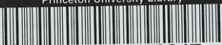

{0}------------------------------------------------

الماء المتغير

- ٢٠١ -

اسماعيل بن بزيح عن الرضا (ع) قال : ماء البئر واسع لا يفسده شىء الا ان يتغير ريحه او طعمه فينزح حتى يذهب الريح ويطيب طعمه لان له مادة (١) .

وبيان ذلك ان المراد من الشىء هو ما من شانه ان ينجس وما يترقب منه التنجيس ، النجس والمتغير بالنجس فى ذلك سواء ، فالعاصم اذاً تغير بكل واحد منهما ينجس ويؤيده اطلاقات ماتقدم من النبوى وغيره خلق الله الماء طهوراً لا ينجسه شىء الا ما غير لونه او طعمه او ريحه (٢) فالحق ما ذكره المشهور من الحكم بالنجاسة فى المقام .

واما الامر الرابع الذى لابد من التكلم فيه فهو اعتبار كون التغير حسيا وعدم كفاية التغير التقديرى فى نجاسة العاصم او ان التقديرى ايضا يوجب النجاسة فيه كلام فى الجملة ويأتى انشاء الله تعالى .

لا اشكال فى ان التغير الدقى العقلى والفلسفى لا يضر بطهارة الماء المعتصم فان كل ما فيه صفة سارية اذا القى فى الماء والمایع لأثر فيه بالدقة العقلية الا انه خارج عن متفاهم العرفى ، والتغير المأخوذ فى لسان الادلة ما يراه العرف تغيراً ويفهم ، فان الاحكام ملقى اليهم فما يعرفه العرف هو المعيار ، فالتغير الدقى خارج عن محل البحث .

واما الخلاف فى المسئلة فهو مبنى على ان التغير طريق الى النجاسة او موضوعى فان كان طريقا يكون التغير التقديرى ايضا طريقا الى النجاسة وان كان موضوعيا فلا يكون التقديرى مضراً بالطهارة .

الظاهر انه موضوعى فان كل عنوان اخذ فى لسان الادلة ظاهر فى الموضوعية على ما يتفاهم العرف - على انه لو كان طريقا لكان اغراً على الجهل ، وذلك فان التغير لو كان طريقا الى ملاقات العاصم مقداراً خاصاً من النجس ليختلف هذا باختلاف

(١) تقدم فى ص ١٩٣ .

(٢) تقدم فى ص ١٩٤ .

{1}------------------------------------------------

-٢٠٢-

ايضاح الحجة في شرح العروة

ج ١

وصف النجس ، مثلا اذا كان الدم شديد الحمرة يغير كراً من الماء اذا كان بمقدار اوقية ، وان كان ضعيف اللون لا يغيره من من الدم ، وهذا الاختلاف يدلنا على ان التغير موضوعي لا طريقي فعلى هذا لابد في الحكم بالنجاسة كون التغير حسيا وعليه المشهور ايضا .

نعم نسب الى العلامة اعلى الله مقامه ان التغير التقديرى ايضا يوجب النجاسة وتبعه في ذلك بعض المتاخرين ايضا .

وتفصيل الكلام في المقام : ان التغير التقديرى يتصور على ثلاث صور - الاولى - التقدير من ناحية المقتضى - والثانية من ناحية الشرط - والثالثة - من ناحية المانع .

الصورة الاولى : كما اذا القى دم ضعيف اللون اردم قليل في الكرم اغيره في الحسن ويقال : ان الدم لو كان قوى اللون او كان كثيراً لغيره .

الصورة الثانية : ما اذا القى ميتة في الكرم في الشتاء وبقيت مدة معينة ولم يغيره ويقال : لو كانت هذه الميتة في هذا الماء في هذه المدة في الصيف لغيره ، في هاتين الصورتين لا يمكن الحكم بالنجاسة فان موضوع النجاسة في الماء المعتصم هو تغيره بصفة النجس مع ملاقاته ، وهذا لم يتحقق في المقام مع ان الموضوع في تمام القضايا لابد ان يكون فعليا .

الصورة الثالثة - ما اذا كان ملونا بلون طاهر ، ثم القى فيه مقدار من الدم و اثر فيه لكن لا يرى أثره لوجود المانع ، فلو كان الماء غير ملون ليرى اثر الدم فيه ، وهذا يحكم بنجاسته ، فان الملاك في الحكم بالنجاسة هو غلبة النجس وهذا محقق في المقام فان الغالب هو النجس وان كان لا يرى لمانع في الماء .

وهذا نظير ما اذا كان المانع خارجيا من ظلمة ونحوها افهل يمكن الحكم بالطهارة لعدم رؤية اثر النجس بظلمة الهواء ، فالملاك في الحكم هو الغلبة فان كان الماء غالبا يحكم بالطهارة وان كان الغالب هو النجس يحكم بالنجاسة .

{2}------------------------------------------------

ج ١

الماء المتغير

- ٢٠٣ -

ويدل على ذلك عدة من الروايات منها صحيحة حريز بن عبدالله عن ابي عبدالله عليه السلام قال : كلما غلب الماء على ريح الجيفة فتوضأ من الماء واشرب فاذا تغير الماء وتغير الطعم فلاتوضأ منه ولا تشرب (١) .

ومنها صحيحة عبدالله بن سنان قال سأل رجل ابا عبدالله عليه السلام وانا حاضر عن غدير أتوه وفيه جيفة فقال : ان كان الماء قاهراً ولا توجد منه الريح فتوضأ (٢) . ومنها صحيحة شهاب بن عبد ربه قال : أتيت ابا عبدالله عليه السلام أسأله فابتداني فقال : ان شئت فسل يا شهاب وان شئت اخبرناك بما جئت له ، قلت : أخبرني قال : جئت تسألني عن الغدير يكون في جانبه الجيفة ، أتوضأ منه اولا ، قال : نعم ، قال : توضأ من الجانب الآخر الا أن يغلب الماء الريح فينتن وجئت تسأل عن الماء الراكد من الكر مما لم يكن فيه تغير او ريح غالبة ، قلت : فما التغير قال : الصفرة فتوضأ منه وكلما غلب كثرة الماء فهو طاهر (٣) .

والحاصل ان التغير قد حصل في المقام والمانع انما هو يمنع من الرؤية والمانع من الرؤية ليس من المطهرات ولا مما يوجب عصمة الماء .

وايضا نظير ماذكرنا ما اذا كان هناك حوضان احدهما مصبوغاً باللون الاحمر دون الآخر والقى في كل واحد منهما كر من الماء ثم القى في كل منهما مقدار معين من الدم وغير الماء ويرى اثره فيما لم يكن مصبوغاً ولم ير الاثر في المصبوغ بالاحمر ، فهل يمكن ان يقال ان ما يرى فيه اثر الدم نجس وما لا يرى فيه الاثر طاهر ، ثم اذا اخرج ماء الحوض المصبوغ الى حوض آخر غير مصبوغ ويرى لون الدم فيه فهل يمكن ان يقال ان اخراج الماء من الحوض الى حوض آخر مما يوجب نجاسته - .

والامر واضح فعلى هذا اطلاق قول الماتن قده : فالتقدير لا يضر ليس في محله ومما ذكرنا يعلم منه ما في بعض ما ذكره قده من الامثلة .

(١) (٢) الوسائل ج ١ ص ١٠٢ ب ٣ من ابواب الماء المطلق ح ١-١١ .

(٣) في المصدر ب ٩ ح ١١ .

{3}------------------------------------------------

-٢٠٢-

ايضاح الحجة في شرح العروة

ج ١

هذا في التغير التقديري ، فلو عكس الامر بان كان عدم التغيير تقديرية يحكم بالنجاسة لتحقق موضوع النجاسة من ملاقات النجس والتغير به كما اذا القى ميتة في الكر في الصيف وبقيت فيه ثلاثة ايام وغيرته ، ويقال انه لو كان هذا في الشتاء لما غيره هذا تمام كلامنا في هذه المسئلة .

(١٠-م) لو تغير الماء بماء الاوصاف المذكورة من اوصاف النجاسة مثل الحرارة والبرودة والرقة والغلظة والخفة والثقيل لم ينجس مالم يصر مضافا التغير في غير الاوصاف الثلاث من الرائحة والطعم واللون على كلام في الاخير وقد تقدم ، هل يوجب النجاسة ام لا .

التغير في غير الاوصاف الثلاث تارة يوجب اضافة الماء كما اذا وقع النجس في الكر وصار الماء في الغلظة على حد لا يصدق عليه الماء هذا خارج عن محل الكلام فانه ينجس بلا خلاف .

واما اذا تغير الكر بالنجس في غير الاوصاف الثلاثة و لم يصر الماء مضافا كما اذا برد البول ثم القى في الكر فصار الماء بارداً ، او سخن البول ثم القى في الكر فصار الماء حاراً وغير ذلك من اقسام التغير فهل يوجب هذا لتغيير نجاسة العاصم ام لا - المعروف و المشهور عدم النجاسة وادعى عليه الاجماع والاجماع ليس بتعبدى لاحتمال استناد المجمعين في ذلك الى الروايات فلابد من ملاحظة الروايات .

مقتضى صحيحة محمد بن اسماعيل بن بزيغ عن الرضا (ع) قال : ماء البئر واسع لا يفسده شىء الا ان يتغير ريحه او طعمه الحديث عدم نجاسة ماء البئر وغيره من اقسام المعتصم في غير تغير الريح والطعم ، وقد الحقتنا بها التغير في اللون ايضا بصحيحة شهاب بن عبد ربه حيث قال فيها قلت : فما التغير قال : الصفرة الحديث والصفرة هو اللون الحاصل من الجيفة وقد دل به عدة من الاخبار الضعاف بالصراحه والاباس بها تأييداً فعلى هذا التغير في غير الاوصاف الثلاثة لا يوجب النجاسة ، واطلاقات التغير تحمل على المقيدات .

{4}------------------------------------------------

ج ١

التغير بغير وصف النجس

-٢٠٥-

(م-١١) لا يعتبر في تنجسه ان يكون التغير بوصف النجس بعينه ، فلو حدث فيه لون او طعم او ريح غير ما بالنجس كما لو اصفر الماء مثلا بوقوع الدم تنجس وكذا لو حدث فيه بوقوع البول او العذرة رائحة اخرى غير رائحتهما فالمناط تغير احد الاوصاف المذكورة بسبب النجاسة وان كان من غير سنخ وصف النجس .

تقدم في المسئلة التاسعة من الماتن قده ان شرط النجاسة ان يكون التغير بوصف النجس حيث قال : وان يكون التغير باوصاف النجاسة الخ وهذا ينافى ما ذكره هنا ولعل هناك قصور في العبارة ، والمراد منه ان يكون التغير بسبب النجاسة مطلقا لا التغير بوصف النجس فقط فعلى هذا يرتفع التنافي .

وكيف كان الخلاف في المسئلة مبنی على ان نجاسة المعتصم بالنجس هل هي بالانتشار والسراية او اعم منه ومن الخاصية اى تأثير النجس في الماء بالخاصية ولا تكون هذه الخاصية في النجس ولا في الماء واذا القى النجس في الماء تحصل هذه الخاصية نظير ما اذا القى النورة في الماء او بالعكس يوجب الحرارة مع ان الحرارة لم تكن لافى الماء ولا في النورة بل هي خاصية تركيبها بالجعل الالهى . والخلاف فيه مبنی على ادعاء انصراف اطلاق الادلة الى اوصاف النجس من الرائحة والطعم واللون كما ذكرت في الاخبار كما ادعاه في الجواهر (١) ولكن الانصراف لا وجه له واطلاق صحيحة ابن بزيع يشمل التغير بالخاصية ايضا .

وقد يقال : ان مقتضى صحيحة شهاب بن عبدربه هو التغير بوصف النجس والمطلقات تحمل على هذا ، وبيانه انه قال قلت : فما التغير قال (ع) : الصفرة والصفرة من صفات النجس فلا بد في الحكم بالنجاسة التغير بالانتشار والسراية ولا يكفي التغير بالخاصية . وفيه ان مورد الرواية هو وقوع الجيفة في الماء ، والغالب في التغير بالجيفة يكون في الرائحة فينتن الماء بها ولون الماء ايضا يكون اصفر ، فان اللحم اذا وقع في الماء يوجب الاصفرار فيه .

(١) الجواهر ج ١ ص ٧٧ .

{5}------------------------------------------------

-٢٠٦-

ايضاح الحجة في شرح العروة

ج ١

مع ان الصفرة ليست من اوصاف الجيفة فيمكن ان يقال ان المستفاد من هذه الصحيحة ايضا التغير مطلقا سواء كان بوصف النجس بالسراية والانتشار او بالخاصية .

(٢ - ١٢) لافرق بين زوال الوصف الاصلي للماء او العارضى فلو كان الماء أحمر او اسود تعارض فوقع فيه البول حتى صار أبيض تنجس ، وكذا اذا زال طعمه العرضى او ريحه العرضى .

كان الكلام في المسئلة السابقة في صفات المتغير وان المراد منها هل هو بالسراية والانتشار او اعم منه ومن الخاصية .

والكلام في هذه المسئلة في صفات المتغير هل هو الاصلى والطبعى او اعم منه ومن العارضى كما اذا وقع مقدار من السكر في الكمر فصار حلواً بالعرض ثم وقع فيه مقدار من البول وغير حلاوته فصار الى طبعه الاول .

والخلاف في هذه المسئلة هو الخلاف في المسئلة السابقة من ادعاء انصراف اطلاقات ادلة التغير الى التغير في الاوصاف الاصلية وعدمه ، والحق أنه لاوجه للانصراف هنا ايضا واطلاق قوله عليه السلام في صحيحة ابن بزيغ : الا ان يتغير يشمل التغير في الاوصاف العرضية ايضا فالصحيح ماذكره الماتن قده .

(٣ - ١٣) لو تغير طرف من الحوض مثلا تنجس فان كان الباقي اقل من الكمر تنجس الجميع ، وان كان بقدر الكمر بقى على الطهارة واذا زال تغير ذلك البعض طهر الجميع ولو لم يحصل الامتزاج على الاقوى .

لو تغير طرف من الحوض بالنجس في أحدا ووصفه تنجس لما تقدم من الروايات واذا كان الباقي اقل من الكمر تنجس الجميع وهذا مما لا كلام فيه فان الباقي قليل متصل بالمتنجس فينجس ، وان كان الباقي بمقدار الكمر او ازيد يبقى الباقي على طهارته وهذا ايضا مما لا اشكال فيه فان العاصم بصرف ملاقات النجس من دون تغير في احد

{6}------------------------------------------------

ج ١

بعض الماء المتغير

-٢٠٧-

اوصافه الثلاثة لا ينجس فضلا عن ملاقاته للمتنجس .

وانما الكلام في البعض المتغير اذا زال تغيره فهل يحكم بطهارته لزوال تغيره واتصاله بالعاصم ، اوان هذا لا يكفي بل يحتاج الى المزج مع العاصم فيه خلاف، المعروف والمشهور الطهارة من دون الاحتياج الى المزج بل لا قائل باعتبار المزج بين المتقدمين الى زمان المحقق قدس سره ولكن المسئلة محل خلاف بين المتاخرين وذهب جمع من الاكابر الى اعتبار المزج كشيخنا الانصاري قدس سره في طهارته وصاحب الجواهر والمستند والحدائق وغيرهم قدس الله اسرارهم واحتياط جمع آخر ككثر المحشين على العروة .

ان تم الدليل على الطهارة بصرف الاتصال من دون المزج فهو والافان قلنا بجريان الاستصحاب في الاحكام الكلية الالهية يحكم بالنجاسة وان لم نقل به فمقتضى قاعدة الطهارة هو الطهارة .

وقد يقال : ان الماء الواحد حكمه واحد بالاجماع، فعلى هذا لا بد اما من الحكم بنجاسة المجموع ولم يقل به أحد ولا يمكن القول به ايضا فانه كان الباقي طاهراً قبل زوال التغير عن البعض وزوال التغير عنه ليس من موجبات نجاسة العاصم ، واما الحكم بطهارة المجموع فهو المطلوب .

وفيه ان هذا الاجماع ليس اجماعاً تعدياً حتى يكشف عن قول المعصوم فعلى هذا يحتمل التبعيض في الحكم كما كان كذلك قبل زوال التغير .

وقد استدل على الطهارة بصرف الاتصال وبدون المزج بعدة روايات منها صحيحة داود بن سرحان قال : قلت لابي عبدالله عليه السلام : ما تقول في ماء الحمام قال : هو بمنزلة الماء الجارى (١)

ومنها رواية بكر بن حبيب عن ابي جعفر عليه السلام قال : ماء الحمام لا بأس به اذا كانت له ماده (٢) .

(١) (٢) الوسائل ج ١ ب ٧ من ابواب الماء المطلق ح ٢٠١ .

{7}------------------------------------------------

-٢٠٨-

ايضاح الحجة في شرح العروة

ج ١

والرواية الاولى صحيحة سنداً ولكن الثانية ضعيفة بيكر بن حبيب لعدم ورود توثيق في حقه ، وبيان الاستدلال : انهما تدلان باطلاقهما على ان ماء الحمام لا يفعل دفعا ورفعا ، والتعدى من ماء الحمام الى غيره من اقسام العاصم اما بالقطع بعدم الفرق بين اقسام العاصم او بالعلة المذكورة في الرواية الثانية من كونه ذامادة والمادة في ماء الحمام جعلى فالكر مثله وفي البئر والعين والجاري اصلى .

وفيه ان ماء الحمام قد يصل اليه يد كافر او نجس آخر ، والاغلب انه يجري الماء من الخزانة الى الحياض الصغار ويجرى منها الى الخارج فلا يصل الى حد التغير فالروايتين في مقام بيان عدم انفعال ماء الحمام بالملاقات كالجاري واما اذا تغير وزال تغيره باى شىء يطهر بالاتصال فقط او مع المزج لانظر للروايتين اليه .

ومثل الروايتين المتقدمتين مارواه محمد بن يعقوب عن الحسين بن محمد عن عبدالله بن عامر عن على بن مهزيار عن محمد بن اسماعيل عن حنان قال : سمعت رجلا يقول لابي عبدالله عليه السلام : انى ادخل الحمام في السحرو فيه الجنب وغير ذلك فاقوم فاغتسل فينتضح على بعدما افرغ من مائهم ، قال : اليس هو جار قلت : بلى قال : لا بأس (٣) سند الرواية لا بأس به فان الحسين بن محمد من مشايخ الكلينى قده وقد اكثر الرواية عنه وهو الحسين بن محمد بن عامر الذى وثقه النجاشى وعبدالله بن عامر عم الحسين بن محمد وثقه النجاشى ايضا وعلى بن مهزيار هو الاهوازى وهو من الاكابر والاعاظم ومحمد بن اسماعيل هو ابن بزيع الثقة وحنان هو ابن سدير الصيرفى ووثقه الشيخ فى الفهرست ولكن عده فى رجاله فى اصحاب الكاظم عليه السلام من الواقفة وكذا الكشى فى رجاله فالسند موثقة باعتبار حنان .

وهذه الرواية رواها الشيخ باسناده عن على بن مهزيار عن محمد بن اسماعيل واسقط حنان ، ولكن الصحيح مافى الكافى فان محمد بن اسماعيل بن بزيع قد ادرك الجواد عليه السلام وروى عنه فلا يمكن ان يروى عن ابي عبدالله عليه السلام بلا واسطة

(٣) الوسائل ج ١ ب ٩ من هذه الابواب ح ٨ .

{8}------------------------------------------------

ج ١

تغير بعض الماء

- ٢٠٩ -

و كيف كان الرواية معتبرة سنداً .

والظاهر انه لا بأس بها دلالة ايضاً فانه لم ينزل فيهما ماء الحمام بمنزلة الجارى حتى يقال ان القدر المتيقن من التنزيل في الدفع بل قال عليه السلام : ليس هو بجار قلت : بلى قال لا بأس ، فتدل الرواية على ان حكم ماء الحمام هو حكم الجارى والجارى اذا تغير بعضه ثم زال تغيره لا يحتاج الى المزج فماء الحمام ايضاً كذلك الا ان التغير في ماء الحمام قلما يتفق ، فالاطلاق لا بأس به .

والعمدة في المقام هو صحيحة محمد بن اسماعيل بن بزيغ عن الرضا عليه السلام قال : ماء البئر واسع لا يفسده شىء الا ان يتغير ريحه او طعمه فينزح حتى يذهب الريح ويطيب طعمه لان له مادة (١) .

بيان ذلك : ان كلمة واسع بمعنى العاصم او بمعنى الكثير وعلى كلا التقديرين المعنى واحد ، والعلة المذكورة فيها وهو قوله عليه السلام : لان له مادة فيها اربع احتمالات الاول ان يرجع الى الصدر وهو قوله : لا يفسده شىء ، والثاني ان يرجع الى كلمة : يذهب ويطيب طعمه والثالث ان يرجع الى كلمة مقدره وهي فيطهر اي يذهب ويطيب طعمه فيطهر لان له مادة - والرابع ان يرجع الى الجميع - قال شيخنا البهائي قده في الحبل المتين ان الرواية مجملة (للاحتمالات المذكورة) فلا يمكن الاستدلال بها (٢) .

والصحيح ان الاحتمال الثاني مقطوع البطلان ، فان هذا امر تكويني خارجي فليس بيانه وظيفة الشارع ، فان كل من له انس بالبئر من البدوى والقروى والمدني يعرف وضوحا ان كلما ينزح من البئر يخرج الماء من المادة شيئاً فشيئاً ويمتزج مع الباقي الى ان يزول الريح ويطيب الطعم ، وهذا لا يحتاج الى البيان ولا سيما فيما كان المبين في مقام التشريع .

فيدور الامر بين المحتملات الثلاث من رجوع التعليل الى الصدر او الى

(١) الوسائل ج ١ ص ١٠٥ ب ٣ من ابواب الماء المطلق ح ١٢ .

(٢) الحبل المتين ص ١١٧ .

{9}------------------------------------------------

-٢١٠-

ايضاح الحجة في شرح العروة

ج ١

كلمة مقدرة او الى الجميع ، ورجوعه الى الصدر وان كان ممكنا الا انه خلاف الظاهر كما بين في الاصول من ان الاستثناء الواقع بعد جمل متعدده اما يرجع الى الجميع او الى الاخيرة فقط ، وهذا لا يختص بالاستثناء بل حكم كل قيد في الكلام هكذا فيبقى الاحتمالان من رجوع القيد الى الجميع - او الى كلمة مقدرة فعلى كلا التقديرين يرجع القيد الى الاخير وهو المقدرة وبهذا يتم الاستدلال فانها تدل على ان طهارة المتغير يحصل بامر من احدهما زوال التغير ، والاخر اتصاله بالمادة ، والمادة تارة تكون اصلية كما في البئر والعين والجاري واخرى جعلية كالكر وماء الحمام ، وهذان الامران قد تحقق في المقام فان المفروض ان التغير قد زال وهو متصل بالمادة الجعلية وهو الكر فلا دليل على اعتبار المزج .

ويؤيد هذا بل يدل عليه ان انفعال ماء البئر وغيره مما يبتلى به عامة الناس ولا سيما في الازمنة السابقة وبالاخص في الحجاز لقلة الماء فيها ومع ذلك لم يتعرض للمزج لا في الروايات ولا في كلمات المتقدمين مع انهم تعرضوا لمسائل نادرة وهذا يكشف عن عدم اعتبار المزج في حصول الطهارة بعد زوال التغير والاتصال بالمادة ولكن مع ذلك كله الاحتياط بالمزج حسن خروجا عن مخالفة من قال بلزومه . ثم انه على فرض اعتبار المزج فهل يعتبر ان يكون على نحو اوجب استهلاك الماء النجس واضمحلاله في الكر كما عليه صاحب المدارك قد ادى الى الامتزاج العرفي والصحيح هو الثاني فانه موضوع عرفي فما يراه العرف مزجاً يكفي ولا يعتبر المزج بالدقة العقلية .

(م - ١٤) اذا وقع النجس في الماء فلم يتغير ثم تغير بعد مدة ، فان علم استناده الى ذلك النجس تنجس والا فلا .

اذا وقع النجس في الماء فقد يكون الماء قليلا وقد يكون كثيراً ، وفي الاول يحكم بالنجاسة مطلقا ، وفي الثاني قد لا يكون النجس موثراً في الماء أصلا وقد يكون موثراً ، فعلى الاول لا شك في طهارته ، وعلى الثاني قد يكون التأثير فعليا

{10}------------------------------------------------

ج ١

التغير بالداخل والخارج

-٢١١-

نظير استناد المعلول الى علته وقد يكون بعد مدة وعلى الاول لا شك في نجاسته ، وانما الكلام في الثاني فهل يحكم بالطهارة او بالنجاسة ، الظاهر الحكم بالنجاسة ، وذلك فان الملاقات قد تحقق والتغير ايضا قد حصل غاية الامر بعد مدة ، والادلة مطلقة بالنسبة الى تاثير النجس سواء كان التاثير فعليا او متاخراً عن الملاقات بمدة وهذا نظير تاثير السم ومن شرب السم يترتب عليه القتل بعد مدة .

هذا فيما اذا علم الاستناد الى النجس واما اذا شك في ذلك فلا يحكم بالنجاسة اما لاستصحاب الطهارة بناء على جريانه في الاحكام الكلية اللبية واما لقاعدة الطهارة بناء على عدم جريان الاستصحاب في الاحكام الكلية .

(م - ١٥) اذا وقعت الميتة خارج الماء ووقع جزء منها في الماء وتغير بسبب المجموع من الداخل والخارج تنجس بخلاف ما اذا كان تمامها خارج الماء اذا وقعت الميتة خارج الماء ووقع جزء منها في الماء وأثر المجموع في تغير الماء ، فهل يمكن الحكم بالنجاسة ام لا ، وقد تقدم في (م - ٩) (١) ان الحكم بالنجاسة هنا مشكل فان ما يوجب نجاسة العاصم أمران ، احدهما ملاقات النجس وهذا تحقق في المقام والثاني تغير الماء المستند الى الملاقى وهذا - لم يتحقق ، فان الملاقى جزء العلة لاتمام العلة فالتغير لم يستند الى الملاقى بل استند اليه والى غيره وهذا لا يوجب النجاسة ومع ذلك الاحتياط في محله - .

(م - ١٦) اذا شك في التغير وعدمه او في كونه للمجاورة او بالملاقات او كونه بالنجاسة او بطاهر لم يحكم بالنجاسة .  
تارة يفرض الكلام فيما اذا لاقى النجس ولكن يشك في حصول التغير وعدمه فالاصل عدم التغير فان الماء كان قبل الملاقات غير متغير وبعد الملاقات نشك في حصوله نستصحب عدمه وهذا واضح .  
واخرى يفرض الكلام فيما اذا تغير الماء ولكن نشك في الملاقات فيجرى اصالة عدم الملاقات وهذا ايضا واضح .

(١) تقدم في ص ١٩٧

{11}------------------------------------------------

-٢١٢-

ايضاح الحجة في شرح العروة

ج ١

وانما الكلام في الفرع الثالث وهو ما اذا لاقى النجس وحصل التغير ايضاً ولكن نشك في ان التغير حصل بالنجس او بطاهر كما اذا وقع مقدار من الدم في الكر ووقع فيه مقدار من اللون الاحمر الطاهر ايضاً ، وتغير لون الماء وشككنا في أن التغير حصل بالنجس او بالطاهر ، الحكم هنا ايضاً الطهارة وانما الكلام في مدرك ذلك هل هو قاعدة الطهارة او استصحاب الطهارة او استصحاب عدم حصول التغير بالنجس . الظاهر أنه لا يجرى شيء مما ذكر في المقام .

اما القاعدة فلا تصل النوبة اليها مع الاصل الموضوعي .  
واما استصحاب الطهارة فانه اصل حكمي ومع الاصل الموضوعي لا تصل النوبة الى الاصل الحكمي فانه لا معنى للشك في الحكم مع احراز الموضوع ولو بالاصل .  
واما عدم جريان استصحاب عدم حصول التغير بالنجس ، فان موضوع النجاسة المأخوذ في لسان الادلة هو الماء اذا تغير بالنجس لا المتغير بالنجس حتى يجرى استصحاب عدم حصول التغير بالنجس .

بل الاصل الجاري في المقام هو استصحاب عدم تغير الماء بالنجس فانه كان الماء ولم يكن متغيراً بالنجس والان كما كان .

فلو فرضنا ان موضوع النجس المأخوذ في لسان الادلة هو المتغير بالنجس ايضاً يجرى الاستصحاب غاية الامر استصحاب العدم الازلي فانه اذا لم يكن المتغير لم يكن التغير مستنداً الى النجس واذا وجد نشك في استناده الى النجس نستصحب عدم استناده اليه .

لا يقال : ان هذا التغير اذا لم يكن لم يكن مستنداً الى النجس والان كما كان بناء على جريان الاستصحاب في الاعداد الازلية ، لكن اذا لم يكن هذا التغير لم يكن مستنداً الى الطاهر ايضاً والان كما كان فالاستصحابان يتعارضان ويتساقطان فتصل النوبة الى قاعدة الطهارة .

فانه يقال : ان موضوع الطهارة ليس المتغير المستند الى الطاهر حتى يجرى فيه الاستصحاب بل موضوع الطهارة هو الماء فان الماء كله طاهر وقال الله تعالى :

{12}------------------------------------------------

ج ١

زوال تغير الماء بنفسه

-٢١٣-

وأنزلنا من السماء ماء طهوراً (١) وغير ذلك من أدلة طهارة الماء .  
ولو فرضنا ان الموضوع في النجاسة هو المتغير بالنجس لالماء اذا تغير ولم  
نقل بجريان الاستصحاب في الاعدام الازلية تصل النوبة الى قاعدة الطهارة .  
فالحكم بالطهارة في المسئلة مما لااشكال فيه ، اما لاستصحاب عدم تغير الماء  
بالنجس كما هو الصحيح ، واما لاستصحاب عدم استناد التغير بالنجس بناء على  
ان الموضوع هو المتغير بالنجس وجريان الاستصحاب بالاعدام - الازلية ، وبناء  
على عدم جريانه فيها بقاعدة الطهارة .  
(م - ١٧) اذا وقع في الماء دم وشيئ طاهر احمر فاحمر بالمجموع لم  
يحكم بنجاسته .

ما ذكره قده هنا مبني على ما تقدم منه في (م - ٩) من ان التغير التقديري  
لايضر مطلقا حتى اذا كان التقدير من جهة المانع .  
ولكن ذكرنا هناك ان التغير التقديري اذا كان من جهة المانع عن الرؤية  
لايمنع من الحكم بالنجاسة ، فان التغير قد تحقق واستند الى النجس ايضا ولكن  
لايرى لمانع .

نعم لو فرضنا أن كل واحد من النجس والشيء الاحمر لايؤثر والمجموع  
بما هو مجموع اثر لم يحكم بالنجاسة لعدم حصول التغير بالنجس ولعل نظره قدس  
سره الى هذا ، واما اذا كان كل واحد منهما مؤثراً ولو أثراً ضعيفاً والمجموع أثر أثراً  
قوياً فيحكم بالنجاسة لحصول التغير بالنجس ولو كان ضعيفاً .

(م - ١٨) الماء المتغير اذا زال تغيره بنفسه من غير اتصاله بالكر او  
الجاري لم يظهر ، نعم الجاري والنابع اذا زال تغيره بنفسه طهر لاتصاله  
بالمادة ، وكذا البعض من الحوض اذا كان الباقي بقدر الكر كما مر .  
الكلام يقع تارة في الماء القليل وأخرى في الكثير ، أما الاول فقد ادعى

(١) سورة الفرقان ٥٠ .

{13}------------------------------------------------

-٢١٤-

ايضاح الحجة في شرح العروة

ج ١

الاجماع على بقائه على النجاسة بعد زوال تغيره بنفسه .  
على أن علة النجاسة في القليل هي الملاقات دون التغير، وهي لم تزل فمادام  
لم يثبت المزول يكون الماء باقياً على نجاسته كما أن الامر كذلك فيما اذا لاقى النجس  
من دون حصول التغير فيه ، وما ذكرنا مقتضى الاطلاقات كما يأتي فالاجماع ليس  
بتعبدى .

واما الكلام في الكثير فيقع الكلام فيه تارة في الاصل العملى واخرى في  
في الادلة الاجتهادية .

واما الاول فقد يقال : ان مقتضى الاستصحاب هو بقائه على نجاسته .  
وقد يستشكل فيه بتغير الموضوع فلايجرى الاستصحاب فانه يعتبر في جريانه  
بقاء الموضوع ، واتحاد موضوع المتيقن والمشكوك .  
ولكن الظاهر ان هذا الاشكال غير وارد فان موضوع النجاسة هو الماء، والتغير  
من الحالات فتغيره لا يضر بجريان الاستصحاب .

نعم جريان الاستصحاب فيه مبني على جريانه في الاحكام الكلية الالهية كما  
عليه المشهور ، واما بناء على عدم جريانه فيها لابتلائه بالمعارض دائما فلا .  
وبيان التعارض ، ان الشك في الحكم انما يكون مسببا عن الشك في سعته  
وضيقه ، وحيث ان الحكم أمر حادث ونشك في حدوثه وجعله لما بعد الزوال  
وعدمه اي نشك في جعله وسيعا - نستصحب عدم جعله لما بعد الزوال وهذا يكون  
معارضا لاستصحاب النجاسة فيتساقطان .

واما الكلام في الادلة الاجتهادية ، فقد قيل بالطهارة بعد زوال التغير بنفسه  
واستدل عليه بعدة روايات - منها - مارواه في العوالى اللثالى عن النبي ﷺ قال:  
اذا بلغ الماء كراً لم يحمل خبثا (١) .

وهذه الرواية رواها محمد بن ادريس الحلى في السرائر ، وقال : - قول

(١) مستدرك الوسائل ج ١ ص ٢٧ ب ٩ من ابواب الماء المطلق ح ٦ .

{14}------------------------------------------------

ج ١

زوال تغير الماء بنفسه

-٢١٥-

الرسول ﷺ المجمع عليه عند المخالف والمؤلف : - اذا بلغ الماء كراً لم يحمل خبثا انتهى (١) .

بيان الاستدلال : أن الرواية كما تدل على ان الكر لا يحمل خبثا دفعا اى لا ينفعل بالملاقات كذلك لا يحمل خبثا رفعا اى يطهر بعد زوال التغير .

وفيه ان الرواية ضعيفة سنداً فلا يمكن الاعتماد عليها ، وادعاء ابن ادريس أنها مجمع عليها عند المخالف والمؤلف غير صحيح ، فان الكتب المعتبرة عند الشيعه خالية عن ذكرها ، وانما ذكرها ابن ابي جمهور الاحسائي (محمد بن علي بن ابراهيم) المتوفى في حدود سنة ٩٠٠ فهو من المتاخرين ، ولا يبعد ان يكون مصدره السرائر لابن ادريس المتوفى سنة ٥٩٨

ثم على فرض صحة ادعاء ابن ادريس من أنه مجمع عليه عند المخالف والمؤلف ، انما يكون مجمع عليه بذكره في الكتب ، وليس كل رواية مذكورة في الكتب صحيحة سنداً .

ثم على فرض التسليم ضعيفة دلالة ، فانها نظير قوله عَلَيْهِ السَّلَامُ اذا كان الماء قدر كر لم ينجسه شىء (٢) .

فان ظاهرها عدم تنجس الكر دفعا وبملاقات النجس ، واما اذا لاقى النجس وتغير تنجس ثم زال التغير فبما ذا يطهر فلا دلالة في الرواية عليه فلا تشمل الرفع . ومن جملة ما استدل على الطهارة ، اطلاقات ادله نجاسة العاصم بالتغير بالنجس فان ظاهر اخذ قيد في الموضوع دخوله في الحكم وجوداً وعدمه فمادام التغير موجوداً يحكم بالنجاسة واذا زال التغير يزول الحكم (النجاسة) ايضا .

كما ان الامر كذلك في كل وصف من الاوصاف اذا اخذ في موضوع حكم كالعدالة حيث اخذت في موضوع جواز التقليد والاقتداء وقبول قوله وغير ذلك

(١) السرائر ص ٨ .

(٢) الوسائل ج ١ ص ١١٧ ب ٩ من ابواب الماء المطلق ح ٢٠١ و ٢٠٥ .

{15}------------------------------------------------

-٢١٦-

ايضاح الحجة في شرح العروة

ج ١

من الاحكام المترتبة على العدالة واذا زالت العدالة زال الحكم وكذلك الفسق اخذ في عدم جواز التقليد والاقتداء والشهادة وغير ذلك والتغير المأخوذ في موضوع النجاسة ايضا كذلك فتدور وجود النجاسة مدار وجود التغير وعدمها بعدمه فاذا زال التغير بنفسه زالت النجاسة ايضا .

وفيه أنه اذا ورد عام ثم ورد عليه مخصص ، فان كان للمخصص اطلاق يؤخذ به عند الشك في الحكم ، وان لم يكن للمخصص اطلاق فهل يستصحب حكم الخاص او يرجع الى عموم العام ، الصحيح انه يرجع الى عموم العام لعدم حجية الاستصحاب عند وجود دليل لفظي كما اذا قال : اكرم العلماء ثم قال لا تكرمهم يوم الجمعة ، وشككنا في وجوب الاكرام يوم السبت يؤخذ بالعموم ويحكم بوجوب الاكرام يوم السبت .

ومقامنا من القسم الاول ، فان عموم طهارة الماء قد خصصت بما له الاطلاق فعند الشك يؤخذ باطلاق المخصص الماء كله طاهر قد خصص بما دل على انه اذا تغير بالنجس ينجس وهذا المخصص له اطلاق بالنسبة الى وجود التغير وزواله ، واذا شككنا بعد زوال التغير بنفسه في حكم الماء انه طاهر او نجس يؤخذ باطلاق المخصص ويحكم بالنجاسة .

ومن جملة ما استدل به على طهارة الماء بعد زوال التغير بنفسه صحيحة محمد بن اسماعيل بن بزيح عن الرضا عليه السلام قال : ماء البئر واسع لا يفسده شيء الا ان يتغير ريحه او طعمه فينزح حتى يذهب الريح ويطيب طعمه لان له مادة (١) .

الاستدلال بجملة : يذهب الريح ويطيب طعمه ، والاستدلال به مبنی على أمرين ، أحدهما ان كلمة حتى للتعليل اي علة للطهارة فكانه قال : فينزح ويطهر بعلة ذهاب الريح وطيب الطعم ، واستعمال كلمة حتى في العلة كثير ومتعارف كما يقال :

(١) الوسائل ج ١ ص ١٠٥ ب ٣ من ابواب الماء المطلق ح ١٢ .

{16}------------------------------------------------

ج ١

زوال تغير الماء بنفسه

-٢١٧-

لارم غريمك حتى يعطيك حقك او ألزم الحمية حتى يذهب مرضك ، او اسلم حتى تسلم وغير ذلك من الموارد والثاني - سراية الحكم من مورد الرواية وهو البئر الى غيره حتى ما لا يكون المادة فيه اصلية كالكر وحينئذ يتم الاستدلال بالرواية فان الطهارة معلولة لزوال التغير في الكثير مطلقا كان فيه مادة اصلية كالبئر والعين والجاري او جعلية كالكر وماء الحمام .

وفيه ان حتى لانتهاء الغاية واستعمالها في غيره نادر يحتاج الى القرينة كمافي الامثلة المتقدمة وفي المقام ليس قرينة على الخلاف .

وحيث أن النزح يختلف مقداره باختلاف النجاسات الواقعة في البئر ولم يكن مقدار النزح معلوماً ، بين الامام (ع) مقداره وان غاية النزح الى حصول زوال التغير فعلى هذا ، حتى غاية للنزح لاعلة للطهارة ، هذا بالنسبة الى الامر الاول .

واما الامر الثاني على فرض تسليم تمامية الامر الاول فلا يمكن التعدى من مورد الرواية الى غيره ، فان ظاهر قوله (ع) : الريح ان اللام فيه للعهد اى ريح ماء البئر وكذا الضمير في قوله (ع) ويطيب طعمه وانه راجع الى ماء البئر ، فلو نتعدى من مورد الرواية الى غيره نتعدى من مورده الى مافيه مادة اصلية كالعين والجاري دون مافيه مادة جعلية كالكر وماء الحمام فلم يتم شىء مما ذكر في وجه الحكم بالطهارة بزوال التغير في نفسه .

فالصحيح هو الحكم بالنجاسة مالم يثبت المزيل لما ذكرنا من انه اذا ورد عام ثم ورد عليه مخصص وكان للمخصص اطلاق يؤخذ باطلاق المخصص عند الشك ويحكم بحكم الخاص ومقامنا من هذا القبيل فان مادل على طهارة الماء ، قد خصص في القليل بملاقات النجس وفي الكثير بالملاقات والتغير فما دام التغير موجوداً لاشك في نجاسته واذا زال التغير بنفسه اى من دون اتصاله بالعاصم فشك في زوال النجاسة وعدمه يؤخذ باطلاق المخصص ويحكم بالنجاسة مادام لم يثبت المزيل .

{17}------------------------------------------------

-٢١٨-

أيضاح الحجة في شرح العروة

ج ١

والمخصص لعمومات مادل على طهارة الماء كثيرة نذكرها بعضها منها  
 صحيحة حريز بن عبدالله عن أبي عبدالله (ع) قال : كلما غلب الماء على ريح الجيفة  
 فتوضأ من الماء وأشرب فاذا تغير الماء وتغير الطعم فلاتوضأ منه ولاتشرب (١) .  
 فقوله (ع) : فاذا تغير الماء وتغير الطعم فلاتوضأ منه ولاتشرب مطلق بالنسبة  
 الى زوال التغير بنفسه وعدمه ، فكما انه مطلق بالنسبة الى اشراق الشمس عليه وعدمه  
 والى عصف الريح عليه وعدمه كذلك بالنسبة الى زوال التغير وعدمه ، فلا يتوضأ  
 منه ولا يشرب الا اذا ثبت المزيل ومنها موثقة سماعة عن ابي عبدالله (ع) قال : سأله  
 عن الرجل يمر بالماء وفيه دابة ميتة قد انتنت قال : اذا كان النتن الغالب على الماء  
 فلاتتوضأ ولاتشرب (٢) .

وغير ذلك من الروايات وهي كثيرة هذا تمام كلامنا في المقام ويقع الكلام  
 في الفصل الاتي انشاء الله تعالى والحمد لله رب العالمين .

(١) (٢) الوسائل ج ١ ص ١٠٢ ب ٣ من ابواب الماء المطلق ح ٦-٦٠ .

{18}------------------------------------------------

# فصل :

الماء الجارى وهو النابع السائل على وجه الارض فوقها أو تحتها  
كالقنوات لاينجس بملاقات النجس مالم يتغير سواء كان كراً أو أقل ، وسواء  
كان بالفوران او بنحو الرشح ، ومثله كل نابع وان كان واقفاً .

الكلام فى المقام يقع تارة فى ناحية الموضوع ، وأخرى فى ناحية الحكم .  
اما الاول - فالمعروف والمشهور ان الماء الجارى ماء نابع جار على الارض  
فوقها أو تحتها كالقنوات كما ذكره الماتن قده .

والكلام انما هو فى أن المعتبر فى صدق الماء الجارى النبع والجريان معاً ،  
او يكفى أحدهما ، والنسبة بينهما أعم من وجه ، النابع غير الجارى كماء العيون ،  
والجارى غير النابع كماء الثلج يقع فى الجبال ويذوب شيئاً فشيئاً باشراق الشمس  
ويجرى على الارض ، ومادة الاجتماع هو الجارى عن نبع أو رشح .

نقل عن ابن أبى عقيل ( وهو الحسن بن على العمانى من قدماء أصحابنا

-٢١٩-

{19}------------------------------------------------

-٢٢٠-

ايضاح الحجة في شرح العروة

ج ١

المعاصر للكليني قدس سرهما) أنه لا يعتبر في الماء الجارى النبع وما هو مقوم لمفهوم الجارى انما هو الجريان سواء كان عن نبع ام لا .

الكلام تارة يفرض في صدق الجارى لغة، واخرى عرفاً واصطلاحاً أما الاول فلا شك في صدق الجارى ولو لم يكن عن نبع بل يصدق الجارى لغة على ما يصب من ابريق ونحوه على الارض وجرى عليها بل كل ماء جار حين الاستعمال لامحالة، ولكن هذا خارج عن محل الكلام قطعاً وليس هذا مراد ابن ابي عقيل (قده) ايضاً . واما الثانى فما يصدق عليه الجارى عرفاً واصطلاحاً ما يكون وصف الجريان وصفاً ملازماً للماء سواء كان عن نبع او رشح او عن مادة ثلجية ، وهذا هو مراد ابن ابي عقيل (قده) وهذا مما لا مناص من الالتزام به لصدق الجارى عليه عرفاً واصطلاحاً ولغة كماء الفرات ونحوه فان أصل ماء الفرات على ما قيل من الجبال التى فيها الثلوج يذوب شيئاً فشيئاً ويجرى ، أفهل يمكن ان يقال أن ماء الفرات ليس بماء جار هذا بالنسبة الى صدق الموضوع وأما حكمه حكم الجارى عن نبع ام لا فيه تفصيل ويأتى انشاء الله تعالى .

وفى مقابل قول ابن ابي عقيل ماعن بعض من انه يعتبر في الماء الجارى ان يكون عن نبع سواء جرى على الارض ام لا كاليون الواقفة .

ولعل نظر القائل الى ان العيون الواقفة في حكم الجارى في عدم الافعال بالملاقات فقط ، والا لا يصدق على ماء العيون الواقفة الجارى لالغة ولا عرفاً فلا يترتب عليه ما يترتب على عنوان الجارى من الاكتفاء بالمرة في الغسل ، هذا بالنسبة الى الموضوع .

واما الحكم فالمعروف والمشهور ان الماء الجارى لا يفعل بالملاقات سواء كان قليلاً او كثيراً ، ونسب الخلاف الى العلامة وغيره قدس سرهم من ان القليل من الجارى يفعل بالملاقات كالقليل من غير الجارى في مقابل الكثير .

{20}------------------------------------------------

ج ١

الماء الجارى

-٢٢١-

واستدل على قول المشهور بعدة روايات - منها - ماعن دعائم الاسلام باسناده عن امير المؤمنين عليه افضل الصلاة والسلام قال فى الماء الجارى يمر بالجيف والعذرة والدم يتوضأ منه ويشرب مالم يتغير اوصافه طعمه ولونه (١) ومنها عن الفقه الرضوى : اعلموا ان كل ماء جار لاينجسه شىء (٢) ومنها ماعن نوادر الراوندى عن على (ع) قال : الماء الجارى لاينجسه شىء (٣) ومثله ماعن الجعفرىات (٤) . هذه الروايات وان كان لا بأس بدلالتها بالاطلاق الا ان كلها ضعاف فلا يمكن الاعتماد عليها .

ومنها صحيحة محمد بن مسلم قال : سألت ابا عبد الله عليه السلام عن الثوب يصيبه البول قال : اغسله فى المركن مرتين فان غسلته فى ماء جار فمرة واحدة (٥) . استدل بها المحقق الهمدانى قدس سره (٦) من وجهين ، احدهما ان الامام عليه السلام سكت عن بيان قلة الماء وكثرته فيستفاد منه تساويهما فى عدم الانفعال بالملاقات ، والثانى - ان المتعارف فى الغسل فى الكثير وضع الثوب فى الماء بخلاف القليل فان فيه يرد الماء على النجس ، وعلى ذلك نفس اطلاق الاكتفاء بالمرة فى الجارى يشمل مالو كان قليلا فالقليل من الجارى ايضا لاينفعل بالملاقات والا لا يكون مطهراً .

وفيه ان استفادة الاطلاق من سكوت الامام (ع) انما يكون فيما اذا احرز كونه البيان فى مقام البيان من جهة الانفعال وعدمه بالملاقات وهذا غير معلوم بل الامام (ع) فى مقام بيان كيفية الغسل فقط من لزوم المرتين فى الغسل فى المركن والاكتفاء بالمرة فى الغسل ، فى الجارى ، والشاهد على ذلك انه (ع) لم يبين فى

(١) مستدرك الوسائل ج ١ ص ٢٥ ب ٣ من ابواب الماء المطلق ح ١ .

(٢) (٣) (٤) فى المصدر ب ٥ من هذه الابواب ح ٦-٤-١ .

(٥) الوسائل ج ٢ ص ١٠٠٢ ب ٢ من ابواب النجاسات ح ١ .

(٦) مصباح الفقيه ج ١ ص ٨ .

{21}------------------------------------------------

-٢٢٢-

ايضاح الحجة في شرح العروة

ج ١

الغسل في المركن ايضا مع انه اذا كان قليلا ينجس بالملاقات قطعا هذا بالنسبة الى الوجه الاول .

واما الوجه الثاني ففيه اولا ان لزوم ورود الماء على النجس محل كلام وثانيا على فرض التسليم لامانع من الالتزام بطهارة المغسول ونجاسة الماء الجارى اذا كان قليلا ، كما ان الامر كذلك في الغسل بالقليل فان المغسول يطهر مع كون الغسالة نجسا ، فالاستدلال بهذه الصحيحة لم يتم .

واستدل ايضا على قول المشهور بعدة روايات وردت في البول في الماء ، وهذه الروايات على طائفتين ، طائفة سئل فيها عن البول في الماء الجارى ، وطائفة اخرى سئل فيها عن الماء الجارى يبال فيه .

اما الطائفة الاولى فهي عدة روايات منها صحيحة ربعي (ابن عبدالله) عن الفضيل (ابن يسار) عن ابي عبدالله (ع) قال : لا باس بان يبول الرجل في الماء الجارى وكره ان يبول في الماء الراكد (١) .

ومنها موثقة عنبسة بن مصعب (الواقفي) قال سألت ابا عبدالله (ع) عن الرجل يبول في الماء الجارى قال لا بأس به اذا كان الماء جاريا (٢) .

ومنها موثقة ابن بكير (وهو عبدالله بن بكير الفطحى) عن ابي عبد الله (ع) قال : لا بأس بالبول في الماء الجارى (٣) .

قيل ان اطلاق هذه الروايات يشمل مالو كان الماء الجارى قليلا - فلا بأس اى لا ينفعل بملاقات البول .

وفيه ان هذه الروايات واردة في مقام بيان عدم البأس بالبول في الماء الجارى حيث كان البول في الماء الراكد مكروها كما في ذيل الرواية الاولى واحتمل كراهته في الجارى ايضا نفى الامام (ع) البأس عنه ، واما بالنسبة الى الانفعال بالملاقات

(١) الوسائل ج ١ ص ١٠٧ ب ٥ من ابواب الماء المطلق ح ١ .

(٢) (٣) الوسائل ج ١ ص ١٠٧ ب ٥ من ابواب الماء المطلق ح ٢-٣ .

{22}------------------------------------------------

ج ١

الماء الجارى

-٢٢٣-

وعدمه فلم يكن الامام (ع) فى مقام بيان ذلك .  
والطائفة الثانية رواية واحدة وهى موثقة سماعة قال : سألته عن الماء الجارى  
يبال فيه قال لا بأس به (١) .

قيل ان السؤال فى هذه الرواية انما هو عن الماء الجارى يبال فيه لاعن البول  
فيه فعدم البأس به يدل على عدم انفعاله بالملاقات ولو كان قليلا .  
وهذا ايضا لا يتم فان مثل هذا السؤال يمكن ان يكون سؤالاً عن الموضوع  
ويمكن ان يكون سؤالاً عن المحمول ، والظاهر ان السؤال فى هذه الرواية سؤال  
عن المحمول وهو البول فى الجارى لا الموضوع وهو الماء الجارى فلا يتم الاستدلال  
والسؤال عن المحمول كثير فى الروايات منها صحيحة عبيدالله بن على الحلبي قال  
سألت ابا عبدالله (ع) عن الرجل يغتسل بغير ازار حيث لا يراه أحد قال لا بأس (٢)  
قوله ( ع ) لا بأس اى لا بأس بالاختسال بغير ازار ولا يرجع السؤال الى  
الموضوع وهو الرجل .

ومنها صحيحة سهل بن اليسع انه سأل عن ابي الحسن الاول عليه السلام عن  
الرجل يصلى النافلة قاعداً وليس به علة فى سفر أو حضر فقال لا بأس به (٣) اى لا بأس  
بصلاة النافلة قاعداً .

فان قيل : ان مثل هذا السؤال ظاهر فى السؤال عن الموضوع الا ان تكون  
قرينة على الخلاف وفى هاتين الروايتين القرينة على الخلاف موجودة ، فانه لا معنى  
لعدم البأس بالرجل فلا بد ان يكون السؤال عن المحمول بخلاف المقام فانه يمكن  
السؤال عن حكم نفس الماء دون حكم البول فيه .

والجواب عنه اولا ان القرينة فى موثقة سماعة ايضا موجودة وهى ذيل الرواية

(١) فى الباب المزبور ح ٤ .

(٢) الوسائل ج ١ ص ٣٧٠ ب ١١ من ابواب آداب الحمام ح ١ .

(٣) الوسائل ج ٤ ص ٦٩٦ ب ٤ من ابواب القيام ح ٢

{23}------------------------------------------------

-٢٢٤-

ايضاح الحجة في شرح العروة

ج ١

حيث قال : وكره ان يبول في الماء الراكد وقلنا انه احتمل السائل كراهة ذلك في الجارى ايضا فلذا سأل عنه ، وثانياً على فرض تسليم عدم القرينة لا اقل من احتمال ذلك واذا جاء الاحتمال بطل الاستدلال .

ومن جملة ما استدل به على قول المشهور صحيحة داود بن سرحان قال : قلت لابي عبدالله (ع) ماتقول في ماء الحمام قال : هو بمنزلة الماء الجارى (١)  
بيان الاستدلال : ان الامام عليه السلام شبه ماء الحمام بالماء الجارى القليل بالخصوص في عدم الانفعال بالملاقات فان ماء الحمام قليل ينجس بالملاقات على القاعدة ، والامام عليه السلام بين ان ماء الحمام لا ينجس بالملاقات كالقليل من الجارى لاتصاله بالمادة .

واستشكل فيه الفقيه الفقيد سيدنا الاستاذ الحكيم قدس سره بان وجه التنزيل غير معلوم اذ يحتمل ان لا يكون هو الاعتصام فيكون مجملا فلا يمكن الاستدلال بها والظاهر ان وجه التنزيل هو الاعتصام في حال الجريان فكما ان الجارى لا يفعل بالملاقات كذلك ماء الحمام حال الجريان فهذا الاشكال غير وارد ، ولكن مع ذلك لا يمكن الاستدلال بهذه الصحيحة وذلك فان تشبيه ماء الحمام بالجارى في القلة غير معلوم فان الامام عليه السلام كان في مقام دفع توهم السائل من مغايرة مافى الحياض الصغار مع مافى المادة والخزانة فيفعل مافى الحياض بالملاقات ، والامام عليه السلام دفعه بان مافى الحياض ومافى المادة والخزانة ماء واحد حال الجريان كما ان الماء الجارى ذيله وصدره ماء واحد فما فى الحياض لا يفعل بالملاقات ، واما كون الجارى قليلا او كثيراً فلانظر اليه .

ويؤيد ما ذكرنا رواية ابن ابي يعفور عن ابي عبدالله عليه السلام قال : قلت : أخبرني عن ماء الحمام يغتسل منه الجنب والصبي واليهودى والنصرانى والمجوسى فقال عليه السلام : ان ماء الحمام كماء النهر يطهر بعضه بعضا (٢) .

(١) الوسائل ج ١ ص ١١١ ب ٧ من ابواب الماء المطلق ح ١ .

(٢) الوسائل ج ١ ص ١١٢ ب ٧ من ابواب الماء المطلق ح ٧ .

{24}------------------------------------------------

ج ١

الماء الجارى

-٢٢٥-

والرواية وان كانت ضعيفة سنداً الا أنها تؤيد المطلب وذلك فان الظاهر من قوله : يطهر ، أنه وصف للماء بما هو ماء لا بما هو متصل بالمادة ، وتطهير الماء بما هو ماء انما يكون فى الكر لافى القليل فلا يشمل القليل ، والحاصل أن شيئاً مما ذكر فى المقام لم يتم .

نعم صحيحة محمد بن اسماعيل بن بزيح تدل على قول المشهور من عدم نجاسة الجارى بملاقات النجس .

قال : ماء البئر واسع لا يفسده شيء الا أن يتغير ريحه أو طعمه فينزح حتى يذهب الريح ويطيب طعمه لان له مادة (١) .

الاستدلال بهذه الصحيحة من وجوه - الاول - أنها تدل على أن ماء البئر مطلقاً قليلاً كان او كثيراً اذا فسد وتغير ثم زال التغير يطهر لاتصاله بالمادة ، فاذا كان الاتصال بالمادة رافعاً للنجاسة فدفعه لها بطريق اولى قطعاً فان الدفع أهون من الرفع على أنه يمكن أن يقال : ان مورد الصحيحة هو القليل فقط ، اما لكون ماء أكثر الآبار قليلاً ، او ان الكثير فى نفسه عاصم ولا يحتاج الى الاتصال بالمادة ، فعلى هذا الجارى أيضاً كذلك ولو كان قليلاً فلا ينفعل بالملاقات ، واذا تغير ثم زال تغيره أيضاً يطهر لاتصاله بالمادة .

الوجه الثانى : ان الصحيحة لو اختصت بالرفع فقط لكان الحكم بالطهارة لغواً ، فانه لو لم تشمل الدفع فلا بد من القول بالنجاسة بصرف الملاقات ثم الحكم بالطهارة فى رتبة متأخرة عن الملاقات بلا فصل زمانى لاتصاله بالمادة ، القول بالنجاسة بالملاقات ثم الحكم بالطهارة بلا فصل زمانى لامعنى له بل لغو بحت ، فعلى هذا لا بد من شمول الصحيحة للدفع أيضاً ، ويتعدى من مورد الصحيحة الى كل ما فيه المادة من ماء العين وماء الحمام والجارى فلا ينفعل بالملاقات ولو كان قليلاً . الوجه الثالث : ان صدر الصحيحة وهو قوله القليل : ماء البئر واسع لا يفسده

(٢) الوسائل ج ١ ص ١٠٥ ب ٣ من هذه الابواب ح ١٢ .

{25}------------------------------------------------

-٢٢٦-

ايضاح الحجة في شرح العروة

ج ١

شيء، تدل باطلاقه على أن القليل من ماء البئر واسع لا يفسده شيء ولا ينفعل بالملاقات لاتصاله بالمادة ، فاذا ثبت أن القليل من ماء البئر لا ينفعل بالملاقات لاتصاله بالمادة يتعدى منه الى غيره ممافيه المادة بعموم العلة فالماء الجارى ايضا لا ينفعل بالملاقات لان له مادة ، فتحصل ان ماذكره المشهور هو الصحيح ، هذا تمام كلامنا في المقام الاول من عدم انفعال الجارى بالملاقات ولو كان قليلا .

والكلام في المقام الثاني في تعارض ادلة عدم انفعال القليل بالملاقات اذا كان له مادة مع ادلة انفعال القليل مطلقاً بالملاقات فان النسبة بينهما أعم من وجه فان مقتضى مفهوم صحيح حتى محمد بن مسلم ومعاوية بن عمار: اذا كان الماء قدر كره لم ينجسه شيء (١) انه اذا لم يكن الماء قدر كره ينجسه شيء مطلقاً سواء كان له مادة ام لم يكن .

ومقتضى قوله (ع) في صحيحة محمد بن اسماعيل بن بزيغ: ماء البئر واسع لا يفسده شيء . . . لان له مادة ، ان الماء اذا كان له مادة لا ينفعل بالملاقات سواء كان كثيراً او قليلا ، والنسبة بينهما عموم من وجه فان القليل الذى لامادة له ينجس بالملاقات بمقتضى اطلاق صحيحتين ، والكثير الذى له مادة لا ينجس بالملاقات بمقتضى اطلاق صحيحة محمد بن اسماعيل بن بزيغ ويتعارضان في القليل الذى له مادة .

فلا بد من العلاج بينهما، فهل هما يتساقطان معاً ولا بد من الرجوع الى عموم فوق او اطلاق فوق ان كان والا فالى الاصول العملية ، او لا يسقطان بل يقدم احدهما على الآخر كما في العام والخاص .

والتحقيق أنه اذا ورد عام وخاص لا اشكال في ان الخاص يقدم على العام فان العرف يرى الخاص بيانا للمراد من العام ، وانه من الاول كان المراد من العام هو الخاص وكان الغاء العام على المخاطب لمصلحة وقبل وصول زمان العمل بالعام

(١) الوسائل ج ١ ص ١١٧ ب ٩ من ابواب الماء المطلق ح ١-٢ .

{26}------------------------------------------------

ج ١

الماء الجارى

-٢٢٧-

يبين مراده الواقعي بالخاص .

وقد يكون العامين من وجه ايضا من هذا القبيل اى يقدم احدهما على الآخر ولا تصل النوبة الى التساقط وهذا وان لم يكن من العام والخاص الا أنه فى نتيجة العام والخاص .

وبیان ذلك: أن العامين من وجه لوقدم أحدهما على الآخر لا يستلزم الغاء العنوان المأخوذ فيه يتعارضان ويتساقطان مثل قوله : اكرم العلماء ولا تكرم الفساق فان من تقديم أحدهما على الآخر لا يلزم المحذور المذكور .

واما اذا استلزم تقديم احدهما على الآخر الغاء العنوان المأخوذ فى الآخر فلا يتساقطان فان هذا المحذور يكون من المرجحات فيقدم هذا على ما لا يلزم من تخصيصه لغوية عنوانه .

ومن هذا القبيل من العامين من وجه كثير فى الروايات منها صحيحة عبدالله بن سنان قال : قال ابو عبدالله (ع) : اغسل ثوبك من بول ما لا يؤكل لحمه (١) .  
وعنه عنه (ع) ايضا قال : اغسل ثوبك من بول كل ما لا يؤكل لحمه (٢) .  
وورد فى صحيحة أبى بصير عن أبى عبدالله (ع) قال : كل شئ يطير فلا بأس ببوله وخرثه (٣) .

والنسبة بينهما اعم من وجه ويتعارضان فى بول وخرث غير مأكول اللحم من الطير ، مقتضى الطائفة الاولى نجاسته ومقتضى الطائفة الثانية طهارته ، فلو قدمت الاولى على الثانية يلزم الغاء عنوان الطير المأخوذ فيها فانه تختص حينئذ بالطير المأكول مع ان الطير المأكول لا خصوصية فيه بل كل حيوان مأكول لحمه لا بأس ببوله وخرثه كما فى صحيحة زرارة انهما (الباقر والصادق عليهما السلام) قالا : لا تغسل ثوبك من بول شئ يؤكل لحمه (٤) .

(١) (٢) الوسائل ج ٢ ص ١٠٠٨ ب ٨ من ابواب النجاسات ح ٣٠٢ .

(٣) الوسائل ج ٢ ص ١٠١٣ ب ١٠ من ابواب النجاسات ح ١ .

(٤) الوسائل ج ٢ ص ١٠١٠ ب ٩ من هذه الابواب ح ٤ .

{27}------------------------------------------------

-٢٢٨-

ايضاح الحجة في شرح العروة

ج ١

بخلاف ما اذا قدمنا الطائفة الثانية على الاولى فانه لا يلزم منه لغوية العنوان المأخوذ فيه وهو ما لا يؤكل لحمه فيختص بما لا يؤكل من غير الطيور، ففي مثل ذلك من العامين من وجه يقدم احدهما على الاخر فلا تصل النوبة الى التساقط والرجوع الى غيرهما .

ومقامنا من هذا القبيل فان اطلاق قوله عليه السلام فى صحيحة محمد بن اسماعيل : ماء البئر واسع لا يفسده شئ . . . لان له مادة يشمل القليل الذى له مادة فلا ينجس بالملاقات .

ومقتضى اطلاق مفهوم أدلة عاصمية الكر نجاسة القليل حتى ما له المادة فيتعارضان فى القليل الذى له مادة ، فلو قدم اطلاق المفهوم على اطلاق الصحيحة يلزم لغوية عنوان البئر المأخوذ فيها فانها حينئذ تختص بالكثير مع ان الكثير لا ينفعل بالملاقات بئراً كان او غير بئر فيكون اخذ عنوان البئر فى الكلام لغوياً بخلاف ما اذا قدم اطلاق الصحيحة على اطلاق المفهوم فانه حينئذ يختص اطلاق المفهوم بالقليل الذى لا مادة له ولا يلزم لغوية القليل المأخوذ فى الكلام فعلى هذا لا بد من تقديم اطلاق الصحيحة صوناً للكلام عن اللغوية، فالنتيجة ان الماء القليل اذا كان له مادة لا ينفعل بالملاقات سواء كان ماء بئر او ماء عين او ماء حمام او ماءاً جارياً، فما ذكره المشهور هو الصحيح .

وقد ذكرنا ان الجارى عرفاً ولغة اعم من ان يكون من مادة ارضية او مادة ثلجية، لكن يفرق بينهما بالنسبة الى الانفعال بالملاقات وعدمه فان كان له مادة ارضية لا ينفعل بالملاقات وان كان له مادة ثلجية ينفعل بالملاقات اذا كان قليلاً، فان دليل عدم انفعال الماء القليل منحصر بما اذا كان له مادة ارضية وهو صحيحة محمد بن اسماعيل بن بزيع الواردة فى البئر والمادة فى البئر ارضيته وسيجىء هذا فى (م-١) واما بالنسبة الى الاحكام الثانوية التى ثبتت للجارى فلا يفرق فيها بينهما كاعتفاء بالمرة فى الغسل، فان هذا ثابت لعنوان الجارى كما فى صحيحة محمد بن مسلم

{28}------------------------------------------------

ج ١

الجاري من غير مادة

-٢٢٩-

قال : سألت اباعبدالله (ع) عن الثوب يصيبه البول قال : اغسله في المرن مرتين فان غسلته في ماء جار فمرة واحدة (١) ومافيه مادة ثلجية يصدق عليه عنوان الجاري لغة وعرفاً واصطلاحاً على ما تقدم فيكفي الغسل مرة واحدة فيه ايضا .  
بقي في المقام شيء وهو أنه هل يكفي كون المادة بالرشح اولابد من كونه بالدفع والفوران .

الظاهر كفاية الرشح أيضاً فان ما يجري بالرشح يصدق عليه ان له مادة ارضية على ان اكثر الابار انما يكون بالرشح فيشمله اطلاق صحيحة محمد بن اسماعيل بن بزيغ .

نقل صاحب الحدائق قدس سره عن والده (قده) أنه لم يكتف بالرشح وكان يعتبر الدفع والفوران فلذا كان قده قائلاً بانفعال اغلب الابار في البلاد بالملاقات فانها كانت بالرشح ثم ان تطهيره يحتاج الى وقوع الكرفيه (٢) .  
ولكن الصحيح ماذكره الماتن قده من كفاية الرشح أيضاً .

(م - ١) الجاري على الارض من غير مادة نابعة اوراشحة اذا لم يكن كراً ينجس بالملاقات ، نعم اذا كان جارياً من الاعلى الى الاسفل لا ينجس أعلاه بملاقات الاسفل للنجاسة وان كان قليلاً .

لادليل لنا دل على أن الجاري لا يفعل بالملاقات مطلقاً كثيراً كان او قليلاً وانما الدليل قام على أن القليل الذي له مادة لا يفعل بالملاقات مطلقاً سواء كان جارياً ام غيره فعلى هذا لو كان الجاري من غير نبع اورشح ينجس بالملاقات اذا لم يكن كراً .  
نعم قد سبق في المسئلة الاولى من الفصل في المياه أنه اذا كان الجريان بقوة ودفع يمنع عن الانفعال بالملاقات كما اذا صب الماء من ابريق على يد كافر فما وصل الى يد الكافر ينجس وما لم يصل طاهراً فان العرف يرى ما اتصل بيد الكافر غير ما لم يصل

(١) الوسائل ج ٢ ص ١٠٠٢ ب ٢ من ابواب النجاسات ح ١ .

(٢) الحدائق ج ١ ص ١٧٢ .

{29}------------------------------------------------

-٢٣٠-

ايضاح الحجة في شرح العروة

ج ١

اليها فيكون الماء متعدداً في نظر العرف فلاتجرى النجاسة من موضوع الى موضوع آخر.

(٣ - ٢) اذا شك في أن له مادة ام لا وكان قليلاً ينجس بالملاقات .

صور المسئلة في المقام ثلاثة - الاولى - ان الماء القليل اذا لم يكن له مادة كما اذا اجتمع ماء مطرو وغيره في مكان ثم شككنا في حدوث المادة له يستصحب عدمها ويحكم بالنجاسة بالملاقات وهذا ظاهر .

- الثانية - أنه اذا كانت له مادة ثم شككنا في انقطاعها وعدمه يستصحب بقاء المادة ويحكم بالطهارة بعد الملاقات لاحراز كونه ذا مادة ولو بالاصل وهذا ايضاً واضح .

- الثالثة - ما ذكره الماتن قده وهو كون المادة مشكوكة من الأول - حكم قده هنا بالنجاسة بالملاقات ، وهذا هو المعروف والمشهور ايضاً وذهب بعض الى الطهارة في المقام .

وجه الطهارة اما استصحاب الطهارة بناء على جريانه في الاحكام الكلية الالهية اوقاعدة الطهارة بناء على عدم جريان الاستصحاب في الاحكام الكلية الالهية فانه يشك في طهارته ونجاسته فيحكم بالطهارة بقاعدتها وانما الكلام في وجه النجاسة كما عليه المشهور مع أنهم قائلون بجريان الاستصحاب في الاحكام الكلية الالهية ذكروا في وجه ذلك وجوها اربعة - الاول - التمسك بالعموم في الشبهات المصداقية للمخصص ، وحكم الاطلاق في أغلب الموارد هو حكم العموم ، وفي المقام دلت المطلقات على انفعال الماء القليل بالملاقات كاطلاق مفهوم ادلة عاصمية الكرمن قوله (ع) : اذا كان الماء قدر كرم لم ينجسه شيء (١) مفهومه اذا لم يكن الماء قدر كرم ينجسه شيء ، ثم قيدت هذه الاطلاقات بصحيحة محمد بن اسماعيل بن بزيغ بغير

(١) الوسائل ج ١ ص ١١٧ ب ٩ من ابواب الماء المطلق ح ١-٢ .

{30}------------------------------------------------

ج ١

الشك في الاتصال بالمادة

-٢٣١-

ما له المادة (١) فإذا شك في مورد انه من مصايدق الخاص ام لا يتمسك بالاطلاق فيحكم بالنجاسة .

لكن هذا الوجه لا يتم وذلك لما بين في الاصول من ان التمسك بالعموم في الشبهات المصداقية لا يمكن فان العام لا يمكن ان يثبت مصداقه وانما يثبت الحكم لمعلوم المصداقية له في حججته، والخاص يوجب اختصاص حجية العام في غير عنوان الخاص وهذا غير معلوم فلا يكون العام حجة في الشبهة المصداقية .

- الوجه الثاني - ان الحكم بالنجاسة في المقام بمقتضى قاعدة المقتضى والمانع فان المقتضى للنجاسة في القليل هو ملاقات النجس وهو موجود والمانع عنها هو كونه ذا مادة وهو مشكوك فينفى بالاصل فيحكم بالنجاسة . وهذا الوجه ايضا لم يتم ، لا بأس بتفصيل الكلام في بيان قاعدة المقتضى والمانع وتمييزها عن قاعدة اليقين والاستصحاب .

فنقول : لا شك في ان صفتي اليقين والشك من المتنافيين ذاتا والتقابل بينهما تقابل العدم والملكية ، فان الشك عبارة عن عدم العلم واليقين في مورد قابل للعلم واليقين ، فلا يمكن ان يتعلقا بشيء واحد من جميع الجهات ، فاذا تعلقا بشيء واحد فلابد فيه من اختلاف في جهة من الجهات .

فان كان متعلقهما متحدين ذاتا ومختلفين زمانا ، واليقين والشك متحدين زمانا فهو مورد الاستصحاب، كما اذا كان احد متيقنا بعدالة زيد يوم الجمعة ثم شك في بقاء تلك العدالة يوم السبت .

فالعدالة متعلق لليقين والشك لكن يوم الجمعة كان متعلقا لليقين ويوم السبت متعلقا للشك (يعنى بحسب البقاء) وزمان اليقين والشك واحد وهو يوم السبت فيحكم ببقاء العدالة يوم السبت ، وهذا هو مجرى الاستصحاب ، ولا يجوز نقض اليقين بالشك هنا بمقتضى الروايات الواردة في المقام منها صحيحة زرارة قال :

(٢) الوسائل ج ١ ص ١٠٥ ب ٣ من هذه الابواب ح ١٢ .

{31}------------------------------------------------

-٢٣٢-

ايضاح الحجة في شرح العروة

ج ١

لاتنقض اليقين ابداً بالشك وانما تنقضه بيقين آخر (١) .

وان كان متعلقهما متحدين ذاتاً وزماناً وكان الاختلاف في زمانى اليقين والشك فهو مورد لقاعدة اليقين ، كما اذا كان احد متيقنا بعدالة زيد يوم الجمعة ثم شك يوم السبت في نفس تلك العدالة وشك في انه كان عادلاً يوم الجمعة ام لا ، وبعبارة اخرى هل كان يقينه بعدالة زيد يوم الجمعة مطابقاً للواقع ام لا ، وهذا الشك يسمى بالشك السارى لسرايته الى اليقين السابق ويزيله وينقضه ، وهنا يرفع اليد عن اليقين السابق بهذا الشك بل يرتفع اليقين بنفسه بهذا الشك .

وان كان متعلق كل واحد من اليقين والشك متغايرين ذاتاً ولكن كان بينهما ربط بان كان كل واحد منهما جزء علة لمعلول واحد وكان زمان اليقين والشك متحداً فهو مورد قاعدة المقتضى والمانع كصب الماء على البشرة وعدم المانع من وصوله اليها ، وهما علة تامة لوصول الماء الى البشرة .

وقاعدة المقتضى والمانع قد عمل بها بعض المتقدمين وبعض المتاخرين الا انه لادليل على اعتبار هذه القاعدة وتفصيل الكلام يطلب من موضعه في الاصول والمعتبر من هذه القواعد الثلاثة هو الاستصحاب فقط .

الوجه الثالث ماذكره المحقق النائينى قدس سره (٢) وهو ما حاصله ان الحكم اذا كان الزامياً او ملزوماً له (كمافى المقام) اذا خصص بعنوان وجودى فلابد من احراز عنوان المخصص ، والا فيحكم بحكم العام ، مثلاً اذا قال المولى لعبده: لا تأذن لاحد ان يدخل دارى الا اصدقائى ، فلا يجوز للعبد ان يأذن لاحد الا لمن احرز انه صديق مولاه والمشكوك لا يجوز له الاذن في دخوله ، اوقال : قسم هذا

(١) الوسائل ج ١ ص ١٧٥ ب ١ من ابواب نواقض الوضوء ح ١ .

(٢) تعرض لذلك استاذنا الاعظم في تقريراته ج ٢ ص ١٩٥ عند تعرض كلام الشهيد قده

من ان الاصل في المطعومات هو الطهارة والحرمة - وتعرض له المحقق الكاظمى ايضا في تقريراته ج ٢ ص ٢٢٩ عند ذكر كلام الشهيد قده من ان الاصل في الحيوان المشكوك هو الطهارة وحرمة لحمه .

{32}------------------------------------------------

ج ١

الشك في الاتصال بالمادة

-٢٣٣-

للفقراء ، فلا يجوز له الاعطاء الالمن احرزانه فقير، وغير ذلك من الموارد .  
 مع أن الشبهات التحريمية المصداقية يرجع فيها الى البراءة باتفاق من  
 الاصولى والاخبارى ، والسر فى عدم الرجوح الى البراءة فى المقام ماذكرنا .  
 وطبق قده هذه الكبرى على المقام فان الادلة انما دلت على انفعال الماء  
 القليل بالملاقات ، واستثنى منه ماله المادة ، فلابد فى الحكم بالطهارة من احراز  
 المادة والافيحكم بالنجاسة بمقتضى العمومات او الاطلاقات .

ماذكره قده ايضا لا يتم، وذلك فان المرجع فى الشبهات التحريمية المصداقية  
 وان كان هو البراءة ، والسر فى عدم الرجوع الى البراءة فى الامثلة المتقدمة ونظائرها  
 ليس ماذكره قده من لزوم احراز القيد الوجودى بل السر فى ذلك جريان الاستصحاب  
 فى المقام ومعه لاتصل النوبة الى البراءة فان الرجوع الى البراءة وظيفة الشاك  
 والاستصحاب رافع للشك فان وصف الصداقة او الفقر من الامور العارضة للانسان،  
 فاذا شك فى ذلك يستصحب عدمه فيتحقق موضوع العام ويثبت حكمه، فهذا الوجه  
 ايضا لم يتم .

الوجه الرابع - هو جريان استصحاب العدم الازلى فى المقام وبيانه أن الماء  
 قبل ان يخلق لم يكن له مادة ، وبعد الخلق نشك فى اتصافه بالمادة وعدمه نستصحب  
 عدمه الازلى ويثبت حكم العام او المطلق وهو النجاسة .

جريان الاستصحاب فى الاعداد الازلية محل كلام بين الاعلام جمع أثبت  
 منهم صاحب الكفاية قدس سره وجمع نفاه منهم المحقق النائينى قده .

قال صاحب الكفاية قده فى بحث العام والخاص (١) : اذا شك ان امرئة  
 تكون قرشية أو غيرها فلا أصل يحرز به انها قرشية او غيرها الا ان اصالة عدم تحقق  
 الانتساب بينها وبين القريش تجدى فى تنقيح أنها ممن لا تحيض الا الى خمسين لان  
 المرئة التى لا يكون بينها وبين القريش انتساب ايضا باقية تحت مادل على ان

(١) الكفاية ج ١ ص ٣٤٦ من طبعة طاهر خوشنويس .

{33}------------------------------------------------

-٢٣٤-

ايضاح الحجة في شرح العروة

ج ١

المرثة انما ترى الحمرة الى خمسين ، والخارج عن تحته هي القرشية انتهى .  
ولكن المحقق النائيني قدس سره قد استشكل فيه (١) وذكر مقدمات ثلاث  
وابتنى عليها اشكاله .

المقدمة الاولى : ان التخصيص متصلا كان او منفصلا ، استثناء كان أم غيره  
يوجب تعنون العام بغير عنوان المخصص ، مثلا اذا قال المولى . اكرم العلماء  
الا الفساق منهم ، اوقال : اكرم العلماء ثم قال بعد ذلك : لا تكرم فساق العلماء ،  
يستفاد منه ان موضوع حكم العام هو العلماء غير الفساق .

هذه المقدمة صحيحة لان المولى الملتفت الى انقسام موضوع حكمه لا يخلو  
حاله في مقام الجعل عن ثلاث ، اما ان يجعل الحكم لموضوعه مع وجود قيده  
لدخل وجوده في الحكم ، كما اذا قال اكرم العالم العادل واما ان يجعل الحكم له  
مع عدم قيده لدخل عدمه في الحكم اولضرر وجوده كما اذا قال : أكرم العلماء  
الا الفساق ، اولا نظر له لا الى وجود القيد ولا الى عدمه لان المصلحة قائمة على  
الطبيعي كما اذا قال : اكرم العلماء ويسمى الاخير مطلقا ، والاوان مقيداً اما بالوجود  
او بالعدم ولا يمكن الاهمال في مقام الجعل ولا يحتمل في حق المولى الملتفت .  
فالنتيجة اذا خصص العام يكون مقيداً بغير عنوان الخاص وبذلك اشار صاحب  
الكفاية قده بقوله (٢) بل بكل عنوان لم يكن ذاك بعنوان الخاص .

المقدمة الثانية : ان الموضوع المركب قد يكون مركبا من امرين مستقلين  
كما اذا قال : اذا جائك زيد وعمرو اكرمها ، فالحكم هنا مبني على مجيئهما ، وقد  
يكون مركبا من معروض وعرض قائم به وفي هذه الصورة قد يكون العرض أمراً  
وجودياً كما اذا قال اكرم العالم العادل وهذا يسمى بالوجود النعتي وفي اصطلاح  
أهل الأدب بمفاد كان الناقصة ، وقد يكون أمراً عدمياً ، كما اذا قال اكرم رجلا غير

(١) أجود التقريبات ج ١ ص ٤٦٥ .

(٢) الكفاية ج ١ ص ٣٤٦ من طبعة طاهر خوشنويس .

{34}------------------------------------------------

ج ١

الشك في الاتصال بالمادة

-٢٣٥-

فاسق ويسمى هذا الوصف بالعدم النعتى وفى اصطلاح أهل الأدب بمفاد ليس الناقصة ولا ثالث .

المقدمة الثالثة : ان التقابل بين الوجود النعتى الذى هو مفاد كان الناقصة وبين العدم النعتى الذى هو مفاد ليس الناقصة انما هو من قبيل تقابل العدم والملكة الذى يشترط فيه وجود الموضوع ، ويمكن ارتفاع المتقابلين بارتفاع موضوعهما ، هذا بخلاف التقابل بين الوجود المحمولى الذى هو مفاد كان التامة وبين العدم المحمولى الذى هو مفاد ليس التامة ، فانه من قبيل تقابل الايجاب والسلب الذى لا يمكن فيه ارتفاع المتقابلين لكونهما معروضين لنفس الماهية .

واستنتج قده من هذه المقدمات الثلاث ان خروج عنوان من تحت العام يستلزم اتصاف العام بغير عنوان الخاص بمقتضى المقدمة الاولى وكون هذا الاتصاف اتصافا بالعدم النعتى الذى هو مفاد كان الناقصة بمقتضى المقدمة الثانية ، ويستحيل تحقق هذا الاتصاف قبل وجود موضوعه بمقتضى المقدمة الثالثة .

فعلى هذا استصحاب العدم الازلى الذى هو مفاد ليس التامة المسمى بالعدم المحمولى لا يستلزم ثبوت العدم النعتى الذى هو مفاد ليس الناقصة الاعلى نحو الاصل المثبت ولا نقول به .

وطبق قده هذه الكبرى على المقام ، وقال : ان مادل على الماء القليل ينفع بالملاقات قيد بما اذا لم يكن له المادة فيكون الموضوع هو الماء القليل الذى لا يكون له المادة على نحو مفاد ليس الناقصة ، وهذا ليس له حالة سابقة ، لان الماء اذا وجد حينما وجد اما وجد مع هذا الوصف العدمى او وجد بغير هذا الوصف ، ولا يقال : انه اذا لم يكن هذا الماء لم يكن الاتصاف بهذا الوصف ايضا ، لانا نقول كما مر من لزوم الموضوع فى الاتصاف كما مر ، واستصحاب ما لا يحتاج الى الموضوع من العدم المحمولى لا يستلزم هذا الاتصاف الاعلى القول بالاصل المثبت للتغاير بين العدمين ولا نقول بحجية الاصل المثبت .

{35}------------------------------------------------

-٢٣٦-

ايضاح الحجة فى شرح العروة

ج ١

ما ذكره قده من المقدمات صحيح الا ان ما استنتج منها من ان تخصيص العام بعنوان خاص يستلزم اتصافه بعدم ذلك العنوان ليس بصحيح، بل لازم التخصيص ان العام لا يتصف بعنوان الخاص وكم فرق بين الاتصاف بشيء وبين عدم الاتصاف بشيء، وما يحتاج الى الموضوع هو الاول لانه معدولة المحمول الذى يحتاج الى الموضوع بخلاف الثانى فانه سلب الاتصاف وهذا قد يكون بانتفاء الموضوع ايضا.

فلو كان الموضوع المأخوذ فى لسان الادلة من قبيل الاتصاف بالعدم يصح ما ذكره قده الا ان الامر ليس كذلك بل المستفاد منها هو عدم الاتصاف بعنوان الخاص كما مر عن صاحب الكفاية قده حيث قال : بل بكل عنوان لم يكن ذلك بعنوان الخاص فعلى هذا يمكن اجراء استصحاب العدم الازلى وادراج فرد المشكوك فى العام . ومسلتنا هذه من هذا القبيل، فان غاية ما يلزم من التخصيص ان لا يكون العام متصفا بعنوان الخاص، وهذا هو السالبة المحصلة دون الموجبة المعدولة، ونقول : الماء الذى لا يكون له المادة موضوع للانفعال بالملاقات و اذا شك فى ماء أنه ذا مادة ام لا فيقال : ان هذا الماء اذا لم يكن ، لم يكن متصلا بالمادة ايضا ، واذا وجد الماء نشك فى اتصافه و اتصاله بالمادة نستصحب العدم الازلى ، فيتحقق موضوع الانفعال بضم الوجدان الى الاصل فان الملاقات وجدانى و عدم الاتصال بالمادة بالاصل فيحكم بالنجاسة كما هو المشهور ايضا .

بقى فى المقام شىء وهو ما اذا كان للماء حالتان سابقتان واشتبه المتقدم بالمتأخر ، كما اذا كان الماء فى زمان ذامادة وفى زمان آخر بلامادة وشكنا فى المتأخر منها ، استصحاب العدم الازلى لا يجرى فى المقام فانه قد تبدل بالوجود قطعاً و اما استصحاب الحالة السابقة فهو اما لا يجرى اصلا لقصور المقتضى كما عليه صاحب الكفاية قده او يجرى فى كل من الطرفين ويتساقطان بالمعارضة، فتصل النوبة الى الاصل الحكمى فيستصحب الطهارة بعد الملاقات ان قلنا بجرى الاستصحاب

{36}------------------------------------------------

ج ١

الشك في الاتصال بالمادة

-٢٣٧-

في الاحكام الكلية الالهية كما عليه المشهور ، والا فيحكم بالطهارة بقاعدتها ، فان هذا ماء يشك في طهارته ونجاسته فيحكم بالطهارة .

ذكر الماتن قده نظير ذلك في المسئلة السابقة من فصل الراكد وحاصله انه اذا غسل الثوب النجس في الماء الذى لا يعلم قلته ولاكثرته يحكم بطهارة الماء وبنجاسة المغسول .

فرق قده بين حكم الماء وحكم المغسول وحكم بطهارة الماء ونجاسة المغسول والوجه في ذلك : ان الماء ان كان قليلا ينجس بالملاقات وان كان كثيرا لا ينجس به فنشك في انفعاله وعدمه فيحكم بطهارته اما باستصحاب الطهارة بناء على جريانه في الاحكام الكلية الالهية ، و اما بقاعدتها بناء على عدم جريان الاستصحاب في الاحكام الكلية .

واما المغسول فنشك في زوال نجاسته بهذا الغسل يستصحب نجاسته لان الماء ان كان كرا يطهر المغسول به و ان كان قليلا لا يطهر فنشك في طهارته ونجاسته يستصحب نجاسته .

والتفريق بين الحكمين بحسب الظاهر لاينافى ما هو الواقع من عدم انفكاك احد الحكمين عن الآخر فانه ان كان الماء كرا يطهر المغسول ايضا وان كان قليلا ينجس الماء ايضا فما ذكره قده حكم ظاهرى وله نظائر في الفقه .

ما ذكره قده مبني على مقدمات - الاولى - انه مبني على عدم جواز - التمسك بالعام في الشبهات المصداقية كما هو الصحيح والا ليحكم بنجاسة الماء ايضا وذلك فان الادلة قد دلت على ان الماء يفعل بالملاقات الا ان يكون كرا او ذامادة واذا شككنا في كريته او كونه ذامادة يتمسك بالعام ويحكم بالنجاسة - الثانية - انه مبني على عدم تمامية قاعدة المقتضى والمانع كما هو الصحيح والا ليحكم بالنجاسة في الماء ايضا ، وذلك فان المقتضى للنجاسة وهو الملاقات موجود والمانع من الانفعال وهو الكر او كونه ذامادة مشكوك يدفع بالاصل فيحكم بنجاسة الماء ايضا .

{37}------------------------------------------------

-٢٣٨-

ايضاح الحجة في شرح العروة

ج ١

الثالثة- أنه مبني على عدم تمامية مقالة المحقق النائيني قده من لزوم احراز القيد في التخصيص بعنوان وجودي ، والاليحكم بنجاسة الماء ايضا ، وذلك فان الادلة دلت على انفعال الماء بالملاقات الا اذا كان كراً او ذامادة ، فاذا لم يحرز الكرية او اتصاله بالمادة يتمسك بالعام او المطلق فيحكم بنجاسة الماء أيضاً .

الرابعة - أنه مبني على عدم جريان الاستصحاب في الاعداد الازلية اصلا كما عليه المحقق النائيني قده (أوان عدم الجريان لمانع كما في مسئلتنا هذه لافي مسئلة النظير التي ذكرها الماتن قده في (م - ٧) من فصل الراكد) والاليحكم بنجاسة الماء ايضا ، لانا اذا شككنا في كريته او كونه ذامادة نستصحب عدمهما الازلي ويثبت أنه قليل بلامادة ولاقى النجس فينفع (وهو الصحيح) .

الخامسة - أنه مبني على اعتبار ورود الماء على النجس في الغسل بالقليل والاليحكم بطهارة المغسول ايضا ، فان المفروض ان الماء طاهر ويحصل الطهارة للمغسول ايضا ، فان المفروض ان الماء طاهر ويحصل الطهارة للمغسول ايضا سواء كان الماء وارداً على النجس او النجس وارداً على الماء فيحكم بطهارة المغسول ايضا . السادسة - انه بناء على اعتبار ورود الماء على النجس يعتبر ان يكون دليل ذلك تعديا وبمقتضى الاخبار ، واما اذا كان دليل الاعتبار عقليا يحكم بنجاسة الماء ايضا وذلك فانه بناء على ذلك كما عليه بعض اذا ورد النجس على الماء القليل ينجس بالملاقات ، والنجس لا يكون مطهراً فيحكم بنجاسة الماء والمغسول معاً .

واما اذا قلنا ان اعتبار ورود الماء على النجس تعدي ويستفاد من الروايات كقوله عليه السلام في صحيحة ابي اسحاق النحوي (ثعلبة بن ميمون) صب عليه الماء مرتين (١) وكذا في صحيحة الحسين بن ابي العلا قال عليه السلام : صب عليه الماء مرتين (٢) .

يتم مذكره قده من الفرق بين حكم الماء وبين حكم المغسول، اما طهارة الماء

(١) (٢) الوسائل ج ٢ ص ١٠٠١ ب ١ من ابواب النجاسات ح ٢-٤ .

{38}------------------------------------------------

ج ١

يعتبر في المادة الدوام

-٢٣٩-

فلان انشك في طهارته ونجاسته يستصحب طهارته بناء على جريان الاستصحاب في الاحكام الكلية الالهية والافبة قاعدة الطهارة، واما نجاسة المغسول فللشك في حصول شرط الطهارة فان الماء لو كان كثيراً ليطهر المغسول به ايضاً ولو كان قليلاً فلا لعدم حصول شرط الغسل بالقليل وهو ورود الماء على النجس فنشك في ذلك فيستصحب نجاسته، هذا تمام كلامنا في هذه المسئلة .

(م - ٣) يعتبر في عدم تنجس الجارى اتصاله بالمادة فلو كانت المادة من فوق تترشح وتتقاطر ، فان كان دون الكر ينجس ، نعم اذا لاقى محل الرشح للنجاسة لاينجس .

اعتبر قده في عدم انفعال القليل من الجارى بالملاقات ، الاتصال بالمادة فلو انقطع عن المادة ينفعل بالملاقات ، والانقطاع تارة يكون بنفسه وهو مامثل له قده في هذه المسئلة من كون المادة من فوق تترشح وتتقاطر فيجتمع في الاسفل واخرى يكون بالعرض وهو مامثل له قده في المسئلة الخامسة كما تأتي وهو أنه اذا اجتمع الطين فمنع من النبع ، ماذكره قده صحيح وتدل عليه صحيحة محمد بن اسماعيل بن بزيغ الواردة في ماء البئر قال : ماء البئر واسع لا يفسده شئء الا ان يتغير ريحه او طعمه فينزح حتى يذهب الريح ويطيب طعمه لان له مادة (١) لا اشكال في أن ماء البئر متصل بالمادة والافلا يذهب الريح ولا يطيب الطعم بالنزح .

(م - ٤) يعتبر في المادة الدوام ، فلو اجتمع الماء من المطر او غيره تحت الارض ويترشح اذا حفرت لا يلحقه حكم الجارى .

لا اشكال في اعتبار الاتصال بالمادة في عدم انفعال الماء القليل بالملاقات حين الملاقات ، ولا يعتبر ازيد من ذلك .

ولكن الشهيد قدس الله نفسه قال في الدروس (٢) : ولا يشترط فيه الكرية على

(١) الوسائل ج ١ ص ١٠٥ ب ٣ من ابواب الماء المطلق ح ١٢ .

(٢) الدروس ص ١٥ .

{39}------------------------------------------------

- ٢٤٠ -

ايضاح الحجة في شرح العروة

ج ١

الاصح نعم يشترط دوام النبع انتهى .

المحتملات في كلامه قده ستة (الاول) مذكره الشهيد الثاني قده في روض الجنان (١) تبعا لعدة ممن تقدم عليه : من أن مراد الشهيد الاول من قوله : يشترط دوام النبع : مالاينقطع نبعه في الفصول الاربعة ، احترازاً عماينقطع في الصيف وينبع في الشتاء كما في بعض العيون والابار .

واعترض عليه صاحب الحدائق قده (٢) بأن هذا خلاف ظواهر الأدلة وتخصيص لعموم الأدلة بمجرد التشهي الخ .

ما اعترض عليه في محله فان قوله (ع) في صحيحة ابن يزيح : لان له مادة يصدق على ماله مادة مادام له مادة ، واذا انقطع المادة يجرى عليه حكم القليل . نقل عن المحقق الثاني (قده) أنه قال : ان اكثر المتأخرين عن الشهيد (قده) ممن لاتحصيل لهم فهموا هذا المعنى من كلامه انتهى (٣) .

مراده قده من قوله : ممن لاتحصيل لهم غير الشهيد الثاني ( قده ) فانه اجل شأنا وارفع درجة من أن يقال في حقه مثل هذه العبارة ، بل الظاهر ان الشهيد الثاني (قده) الف روض الجنان بعد وفات المحقق الثاني (قده) فان المحقق الثاني على بن عبدالعالي العاملي توفى في سنة ٩٤٠ - والشهيد الثاني زين الدين على بن احمد العاملي الجبعي استشهد في سنة ٩٤٦ وان قيل : ان اول مصنفات الشهيد الثاني (قده) الروض وآخرها الروضة الا ان الظاهر تأليفه الروض او كونه مورداً للاستفادة منه كان بعد وفات المحقق الثاني ، وكيف كان مراد المحقق (قده) عدة ممن كانوا قبل الشهيد (قده) ، وبينوا مراد الشهيد الاول (قده) بهذا المعنى .

- الاحتمال الثاني - ما عن المحقق الثاني (قده) من ان المراد من الدوام

(١) روض الجنان ص ١٣٥ .

(٢) الحدائق ج ١ ص ١٩٥ .

(٣) المستمسك ج ١ ص ١٣٨ .

{40}------------------------------------------------

ج ١

يعتبر في المادة الدوام

-٢٤١-

ما يقابل ما ينبع دقيقة ثم ينقطع اخرى وهكذا ، فان مثل هذا اذا لاقى نجسا يحكم بنجاسته فانه لا يعلم ان الملاقات كان في حال النبع او حال الانقطاع .

ما ذكره قده مبني على جواز التمسك بالعموم في الشبهات المصداقية - فان الادلة انما دلت على ان الماء يفعل بالملاقات الا ان يكون كرا ، او ذامادة ، واذا شك في القليل انه ذامادة ام لا يتمسك بالعموم ويحكم بالنجاسة ، وقد مر ان التمسك بالعموم في الشبهات المصداقية غير جائز (١).

- الاحتمال الثالث - ما ذكره صاحب الحدائق (قده) عن بعض الفضلاء المحدثين (٢) وحاصل ما ذكره قده : ان النبع يكون على ثلاثة اوجه - الاول - ان ينبع دائماً كما في العيون الجارية - الثاني - ان ينبع الى حد ويقف فيه ثم كلما اخرج من مائه ينبع بقدره ، وهكذا وهذا كما في الابار - الثالث - ان ينبع مقداراً فلو اخرج مائه لما ينبع بعده الا ان يحضر مقدار حتى يخرج الماء ، واذا افرغ مائه هذا ليحتاج الى حفر جديد وهكذا ، وقال قده : ان مراد الشهيد قده من دوام النبع لاخراج هذا القسم الاخير.

أقول : لا يبعد ان يكون مراد الشهيد ( قده ) هو هذا ، فان هذا الماء يفعل بالملاقات لعدم استمداده من المادة ، فان المادة انما سميت بالمادة لاستمداد المتصل بها منها ، وامتدادها له ، ويدل على ذلك صحيحة ابن بزيح حيث قال : فينزح حتى يذهب الريح ويطيب طعمه لان له مادة ، فلو لم يستمد ماء البشر من المادة كيف يذهب الريح ويطيب الطعم بالنزح . فان الماء المتغير اذا اخرج منه بأي مقدار يبقى الباقي على تغيره مالم يمتزج بغيره من الماء غير المتغير ، فالاستمداد معتبر زائداً على الاتصال بالمادة في العصمة ، والمفروض في المثال أنه لا يستمد من المادة فيفعل بالملاقات فلو كان مراد الشهيد ( قده ) من دوام النبع هو هذا لكان صحيحا الا انه ليس امراً

(١) تقدم في ص ٢٣١ .

(٢) الحدائق ج ١ ص ١٩٦ .

{41}------------------------------------------------

-٢٤٢-

ايضاح الحجة في شرح العروة

ج ١

زايداً على كون القليل ذا مادة .

-الاحتمال الرابع- ان يكون مراده قده من دوام النبع استمراره لاخراج مثل الابار لعدم استمرار النبع فيها ، والا لاغرقت البلاد ، وهذا في نفسه صحيح فان ماء البئر ليس بجار الا انه بالنسبة الى عدم الانفعال لاخصوصية في الجارى فان الراكد من ماء البئر والعين ايضا لاينفعل بالملاقات لاتصاله بالمادة .

الاحتمال الخامس - ان يكون المراد من دوام النبع ، النبع من المادة الارضية لاخراج ما يجتمع من المياه في محل ثم يخرج بترشح في مكان منخفض - فان هذا لاينفعل بالملاقات كما ذكره الماتن (قده) في هذه المسئلة لعدم اتصاله بالمادة الارضية ، فان المستفاد من صحيحة ابن بزيغ عرفاً ما تكون المادة هي الارضية الاصلية ، والمادة الغير الاصلية التي تسمى بالثمد كما في الجواهر (١) اذا لم يكن كراً لاينفعل بالملاقات .

-الاحتمال السادس- ماذكره الماتن قده في المسئلة الاتية وتعرض له انشاء الله هذا تمام كلامنا في محتملات كلام الشهيد (قده) من دوام النبع وقد ظهر ان بعضها ليس بصحيح وبعضها صحيح ولكنه لا يكون قيداً زائداً عما اعتبره المشهور في عصمة القليل من كونه ذا مادة .

(٤-٥) لو انقطع الاتصال بالمادة كما لو اجتمع الطين فمنع من النبع كان حكمه حكم الراكد ، فان ازيل الطين لحقه حكم الجارى وان لم يخرج من المادة شيء فاللازم مجرد الاتصال .

ما ذكره (قده) صحيح فانه اذا انقطع الماء عن المادة بطين ونحوه ولم يكن كراً يلحق بالراكد القليل لاينفعل بالملاقات ، فان العلة في عصمة القليل انما هو الاتصال بالمادة وهذا ليس بمتصل ولو بعروض عارض ، فاذا زال المانع واتصل بالمادة لاينفعل بالملاقات ومراده قده من ان حكمه حكم الجارى هو عدم الانفعال

(١) الجواهر ج ١ ص ٧٣ .

{42}------------------------------------------------

ج ١

تغير بعض الجارى

-٢٤٣-

بالملاقات فقط لا ما يترتب على الجارى بما هو جار وهذا واضح .

(م - ٦) الراكد المتصل بالجارى كالجارى فالحوط المتصل بالنهر

بساقية يلحقه حكمه ، وكذا اطراف النهر وان كان ماؤها واقفا .

الكلام فيه تارة يقع فى الموضوع ، واخرى فى الحكم ، أما الاول : فالراكد ليس بجار لالغة ولا عرفا ولو كان متصلا بالجارى لاعتبار الجريان فى صدق الجارى .  
واما الثانى : فبالنسبة الى عدم الانفعال بالملاقات كما ذكره (قده) لاتصاله بماله مادة ، وأما بالنسبة الى احكام خاصة للجارى بما هو جار كالاكتفاء بالمرة فى الغسل فلا فان هذا الحكم ثابت لما يصدق عليه عنوان الجارى عرفاً واصطلاحاً - كما يدل عليه قوله عليه السلام فى صحيحة محمد بن مسلم : فان غسلته فى ماء جار فمرة واحدة (١) وقلنا أن الراكد المتصل بالجارى لا يصدق عليه الجارى لغة فضلا عن الصدق العرفى فانه اخص من اللغة .

(م - ٧) العيون التى تتبع فى الشتاء مثلاً وتنقطع فى الصيف يلحقها

الحكم فى زمان نبعها .

ما ذكره قده صحيح فان الملاك فى الانفعال وعدمه بكونه ذا مادة وعدمه ، فكلما ثبت أنه له مادة لا يفعل بالملاقات واذا زالت المادة يفعل بالملاقات لقلته وتقدم الكلام فيه فى (م - ٤) فى بيان مراد الشهيد (قده) من اعتبار دوام النبع فى الجارى .

(م - ٨) اذا تغير بعض الجارى دون بعضه الاخر فالطرف المتصل بالمادة

لا ينجس بالملاقاة وان كان قليلاً ، والطرف الاخر حكمه حكم الراكد ان تغير تمام قطر ذلك البعض المتغير ، والا فالمتنجس هو المقدار المتغير فقط لاتصال ما عداه بالمادة .

(١) الوسائل ج ٢ ص ١٠٠٢ ب ٢ من ابواب النجاسات ح ١ .

{43}------------------------------------------------

-٢٢٤-

ايضاح الحجة في شرح العروة

ج ١

اذ تغير بعض الجارى بتمام القطر فالطرف المتصل بالمادة طاهر ولو كان قليلا فان له مادة، والطرف الآخر ان كان كثيراً فهو أيضاً طاهر لعصمته بنفسه، وان كان قليلا ينجس لكونه متصلا بالمتنجس ولامادة له على الفرض .

قال صاحب الجواهر قده (١) : احتمال ان الماء المتغير وان حكمنا بنجاسته لكن لامانع من كونه سبباً لاتصال غير المتغير بالمادة فيصدق عليه حينئذ انه ماء متصل بالمادة فيكون طاهراً في غاية الضعف - الى ان قال : والمسئلة لاتخلو من تأمل .

وقال في وجه التأمل : لانه يمكن ان يقال : ان تغير بعض الجارى لا يخرج البعض الآخر من هذا الاطلاق، وايضاً احتمال الدخول تحت الجارى معارض باحتمال الخروج فيبقى أصل الطهارة سالماً فيحكم عليه حينئذ بالطهارة ، ثم أمر بالتأمل .

وفيه أولاً أنه لا دليل لنا على أن الجارى بما هو جار لا يفعل بالملاقات بل الدليل دل على أن الماء مطلقاً يفعل بالملاقات ثم خصص بادلة عاصمية الكر من قوله : اذا كان الماء قدر كرم ينجسه شىء (٢) وادلة عاصمية ما له مادة من قوله عليه السلام : ماء البئر واسع لا يفسده شىء . . . لان له مادة (٣) .

وذكرنا في الاحتمال الثالث من (م-٤) (٤) ان تسمية المادة بالمادة لاستمداد الماء منها وامتدادها له، فالقليل اذا استمد من المادة لا يفعل ، واما اذا كان بينه وبين المادة حائل فلا يستمد القليل من المادة فيفعل بالملاقات كما مر في (م-٥) والمتغير أيضاً حائل بين القليل والمادة فينجس لاتصاله بالمتنجس .

ثم على فرض تسليم عدم استفادة ذلك من صحيحة ابن بزيغ وشككنا في أن المتغير مانع عن الاتصال ام لا وان هذا القليل ايضا متصل بالمادة ام لا يكون المقام من الشبهة المفهومية للمخصص .

(١) الجواهر ج ١ ص ٨٩ .

(٢) الوسائل ج ١ ص ١١٧ ب ٩ من ابواب الماء المطلق .

(٣) في الباب ٣ من هذه الابواب ح ١٢ .

(٤) تقدم في ص ٢٤١ .

{44}------------------------------------------------

ج ١

تغير بعض الجارى

-٢٤٥-

وفيه خلاف فى أنه هل يستصحب حكم الخاص وهو فى المقام الطهارة ، فان القليل قبل تغير ما هو فاصل بينه وبين ذى المادة كان متصلا بالمادة ، والان نشك فى انفصاله عن ذى المادة وعدمه نستصحب اتصاله بالمادة او يستصحب طهارته او يحكم بالطهارة بقاعدتها ولعل نظر صاحب الجواهر قدس سره الى هذا .

او يرجع فيه بعموم العام ويحكم بالنجاسة وهذا هو الصحيح فان الشك فى سعة مفهوم المخصص وضيقه فيؤول الامر الى الشك فى الاقل والاكثر فى التخصيص والتخصيص بالاقل معلوم والزائد مشكوك فيرجع فيه الى عموم العام ويحكم بنجاسة ما بعد المتغير اذا كان اقل من الكره كما ذكره الماتن (قده) هذا تمام كلامنا فى الماء الجارى وسيجىء الكلام فى فصل الراكد انشاء الله تعالى .

الحمد لله رب العالمين وصلى الله على محمد وآله الطاهرين .

{45}------------------------------------------------

## (فصل في الماء الراكد)

فصل : الراكد بلامادة ان كان دون الكر ينجس بالملاقات من غير فرق بين النجاسات حتى برأس ابرة من الدم الذي لا يدركه الطرف ، سواء كان مجتمعاً او متفرقاً مع اتصالها بالسواقي ، فلو كان هناك حفر متعددة فيها الماء واتصلت بالسواقي ولم يكن المجموع كراً اذا لاقى النجس واحدة منها تنجس الجميع .

وان كان بقدر الكر لاينجس وان كان متفرقاً على الوجه المذكور فلو كان ما في كل حفرة دون الكر وكان المجموع كراً ولاقي واحدة منها النجس لم تنجس لاتصالها بالبقية .

الكلام في المقام يقع في جهات - الاولى - ان الراكد اذا كان كراً لاينفعل بالملاقات مادام لم يتغير في احد اوصافه الثلاثة بالنجس وذلك لادلة خاصة واردة في المقام ، وقد ورد في عدة روايات معتبرة اذا كان الماء قدر كر لم ينجسه شئ ، وغير ذلك من العناوين الدالة على ان الكر لاينفعل بالملاقات (١) .

- الجهة الثانية - في ان الماء اذا كان قليلاً لاينفعل بالملاقات أم لا ، والكلام فيها يقع في مقامين الاول - في المقتضى ، وهو ما دل على انفعال الماء القليل بالملاقات في الجملة - والثاني - في المانع اي في تعارض اداة الانفعال مع ما دل

(١) الوسائل ج ١ ص ١١٧ ب ٩ من ابواب الماء المطلق .

-٢٤٦-

{46}------------------------------------------------

ج ١

الماء الراكد

-٢٤٧-

على عدم الانفعال بالملاقات .

أما الاول فالغرض منه اثبات الانفعال على نحو الموجبة الجزئية في مقابل جمع ممن قال بعدم الانفعال بالملاقات كابن ابي عقيل والفيض الكاشاني وغيرهما قدس الله اسرارهم .

المعروف والمشهور بين الاصحاب هو انفعال الماء القليل بالملاقات بل ادعى عليه الاجماع في كلمات جمع من الاعلام ويدل عليه عدة - من الروايات بالغة حد التواتر ، وقد ذكر شيخنا الانصاري قده في طهارته (١) أنها تبلغ ثلاثمائة رواية ، وما وصل الينا من هذه الروايات وان لم تبلغ هذا الحد ، الا انها كثيرة جداً واردة في ابواب مختلفة ، ولو فرضنا أنها لم تبلغ حد التواتر لكفانا الصحاح والموثقات الموجودة في ايدينا ، والروايات الواردة في المقام مختلفة .

منها مفهوم - ادلة عاصمية الكر ، وقد ورد في عدة روايات صحاح أنه اذا كان الماء قدر كر لم ينجسه شيء ، فان مفهومه يدل على ان الماء اذا لم يكن قدر كر ينجسه شيء في الجملة ، فان نقيض السالبة الكلية الموجبة الجزئية .

منها عدة روايات واردة في نجاسة سؤر الكلب والخنزير كصحيحة محمد بن مسلم عن أبي عبد الله عليه السلام قال : سألته عن الكلب يشرب من الاناء قال : اغسل الاناء (٢) وكصحيحة علي بن جعفر ( عن اخيه ) موسى بن جعفر عليه السلام في حديث قال : وسألته عن خنزير شرب من اناء قال : يغسل سبع مرات (٣) وغير ذلك من الروايات الواردة في هذا الباب ، ومعلوم ان لسان الكلب او الخنزير يصل الماء اولا فينجس الماء به ثم ينجس الاناء به عادة فيحتاج الى الغسل .

ومنها موثقة سماعة قال سألت ابا عبد الله عليه السلام عن رجل معه اناءان فيهما ماء وقع في أحدهما قدر لا يدري أيهما هو وليس يقدر على ماء غيره قال : يهريقهما جميعا

(١) طهارة الشيخ قده ص ٩ .

(٢) (٣) الوسائل ج ١ ص ١٦٢ ب ١ من ابواب الاسئار ح ٣-٢ .

{47}------------------------------------------------

-٢٤٨-

ايضاح الحجة في شرح العروة

ج ١

ويتيمم (١) .

ومنها صحيحة احمد بن محمد بن ابي نصر قال: سألت أبا الحسن عليه السلام عن الرجل يدخل يده في الاناء وهي قذرة ، قال يكفي الاناء (٢) .

ومنها صحيحة على بن جعفر عن اخيه موسى بن جعفر عليه السلام قال : وسألته عن رجل رعف وهو يتوضأ فتقطر قطرة في انائه هل يصلح الوضوء منه قال : لا (٣) . ومنها موثقة عمار بن موسى عن أبي عبدالله عليه السلام قال : وسئل عن ماء شربت منه الدجاجة قال : ان كان في منقارها قذر لم يتوضأ منه ولم يشرب منه (٤) وغير ذلك من الروايات الواردة في ابواب مختلفة ، ويكفينا في المقام ما ذكرنا - هذا بالنسبة الى المقتضى .

المقام الثاني في المانع ، استدل الفيض الكاشاني قده ومن قال بمقالته أيضاً بعدة روايات ، منها - مرسلة المحقق قده في المعتبر قال : قال عليه السلام خلق الله الماء طهوراً لا ينجسه شئى الا ما غيّر لونة او طعمه او ريحه ورواه ابن ادريس مرسلاً في أوائل السرائر ونقل انه متفق على روايته (٥) وقال الفيض الكاشاني : ان هذه الرواية مستفيضة (٦) .

وذكر في المستدرك عن عوالي اللالي عن مجموعة ابن فهد وعن مجموعة المقداد مثله (٧) .

وفيه ان هذه الرواية في جميع مواردها نقلت مرسلاً فلا يمكن الاعتماد عليها ولو فرض كونها مستفيضة ، ثم على فرض تسليم صحة اسنادها انما تدل على عدم

(١) الوسائل ج ١ ص ١١٣ ب ٨ من ابواب الماء المطلق ح ٢ - ٧ .

(٣) في المصدر ذيل ح ١ .

(٤) الوسائل ج ١ ص ١٦٦ ب ٤ من ابواب الاسئار ح ٣ .

(٥) الوسائل : ج ١ ص ١٠١ ب ١ من ابواب الماء المطلق ح ٩ .

(٦) الوافي ج ١ ص ٥ من الجزء الرابع .

(٧) المستدرك ج ١ ص ٢٦ ب ٣ ح ١٠ و ١١ .

{48}------------------------------------------------

ج ١

الماء الراكد

-٢٤٩-

انفعال الماء القليل بالملاقات بالاطلاق ، فيقيد بمادل على الانفعال بالملاقات بالمطابقة .  
ومما ذكرنا يظهر الجواب عما استدلوا به من المطلقات ونذكر بعضا منها ، منها  
صحيحة أبى بصير عن ابى عبدالله عليه السلام انه سأل عن الماء النقيع تبول فيه الدواب ،  
فقال : ان تغير الماء فلا توضأ منه وان لم تغيره ابوالها فتوضأ منه وكذلك الدم اذا  
سال فى الماء واشباهه (١) .

وتقدم أن صدر هذه الرواية محمول على النقية ، والاستشهاد انما هو بذيلها  
وهو قوله عليه السلام : وكذلك الدم اذا سأل فى الماء واشباهه وهو يدل على ان الماء القليل  
لا ينفعل بالملاقات ولو كان ملاقيا للدم واشباهه من النجاسات فالمعيار فى النجاسة  
انما هو بالتغير .

ومنها صحيحة حريز بن عبدالله عن ابى عبدالله عليه السلام قال : كلما غلب الماء على ريح  
الجيفة فتوضأ من الماء واشرب فاذا تغير الماء- وتغير الطعم فلا توضأ منه ولا تشرب (٢) .  
اطلاق الماء فى هذه الصحيحة يشمل القليل والكثير وجعل فيها ملاك النجاسة  
هو التغير دون الملاقات .

ومنها صحيحة ابى خالد القماط أنه سمع أبا عبدالله عليه السلام يقول فى الماء يمر  
به الرجل وهو نقيع فيه الميتة والجيفة ، فقال أبو عبدالله عليه السلام : ان كان الماء قد تغير  
ريحه او طعمه فلا تشرب ولا تتوضأ منه وان لم يتغير ريحه وطعمه فاشرب وتوضأ (٣) .  
لا كلام فى سند الرواية من غير ناحية ابى خالد القماط وهو كنكر او وردان  
وفى البحار قال : ولدتنى أمى فسمتني وردان فدخل عليها والدى فقال سميته كنكر  
الخ (٤) .

وابو خالد القماط هو الكابلى كما صرح به ابن شهر آشوب فى معالم العلماء

(٢٠١) الوسائل ج ١ ص ١٠٣ ب ٣ ح ٣ - ١ .

(٣) الوسائل ج ١ ص ١٠٣ ب ٣ من ابواب الماء المطلق ح ٤ .

(٤) البحار ج ٤٦ ص ٤٦ باب معجزات على بن الحسين (ع) ح ٤٨ .

{49}------------------------------------------------

- ٢٥٠ -

ايضاح الحجة في شرح العروة

ج ١

حيث قال : ابو خالد القماط الكابلي اسمه كنكر (١) .  
وقد وقع ابو خالد الكابلي في أسناد كامل الزيارات فيشملة توثيق ابن قولويه  
في اول كتابه فيكون أبو خالد القماط ثقة فالرواية صحيحة سنداً - وتدل على عدم  
انفعال الماء الا بالتغير ، واطلاق الماء يشمل القليل والكثير فالقليل ايضا لاينفعل  
بالملاقات .

والجواب عنها وان كان كلها صحيحة سنداً الا انها تدل على عدم انفعال القليل  
بالملاقات بالاطلاق فتقيد بما تقدم من الروايات الدالة على انفعال القليل بالملاقات  
صريحاً بمقتضى حمل المطلق على المقيد .

على ان كلمة النقيع الواردة في صحيحة ابي بصير وصحيحة ابي خالد ترشد  
الى ماذكرنا ، فان النقيع عبارة عن محل يجتمع فيه الماء من مطرو غيره في الطرق ،  
ويكون الماء فيه اكثر من كر أو كرين غالباً فلا تشملان القليل .

ويدل على ماذكرنا صحيحة صفوان بن مهران الجمال ، قال : سألت ابا عبد الله  
عَلَيْهِ السَّلَامُ عن الحياض التي ما بين مكة الى المدينة تردها السباع وتلخ فيها الكلاب  
وتشرب منها الحمير ويغتسل فيها الجنب ويتوضأ منها قال : وكم قدر الماء قال :  
الى نصف الساق والى الركبة فقال : توضأ منه . (٢)

فان سؤال الامام عَلَيْهِ السَّلَامُ عن قدر الماء الذي في الطريق لا يكون الا ان يعلم  
مقداره فان كان كراً فلا باس به والا فلا ، وحيث ان الماء في الطريق اذا وصل الى  
نصف الساق او الى الركبة يكون اكثر من كر فقال (ع) توضأ منه فهذه الطائفة من  
الروايات اما لا تدل على عدم انفعال الماء القليل بالملاقات او تدل عليه بالاطلاق  
فيقيد بمادل على الانفعال .

والعمدة في المقام هي الطائفة الثانية التي تدل على عدم انفعال القليل

(١) معالم العلماء : فصل : من عرف بكنيته (٩٦٩) .

(٢) الوسائل ج ١ ص ١١٩ ب ٩ من ابواب الماء المطلق ح ١٢ .

{50}------------------------------------------------

ج ١

الماء الراكد

-٢٥١-

بالملاقات صريحاً .

منها صحيحة محمد بن ميسر قال : سألت أبا عبد الله (ع) عن الرجل الجنب ينتهي الى الماء القليل في الطريق ويريد ان يغتسل منه وليس معه اناء يغرف به ويداه قذرتان ، قال : يضع يده ثم يتوضأ ثم يغتسل هذا مما قال الله عز وجل : ما جعل عليكم في الدين من حرج (١) .

قيل : ان هذه الرواية صحيحة سنداً وصريحة دلالة فانه صرح فيها بان الماء قليل ويداه قذرتان قال (ع) : يضع يده فيه فيعلم منه ان الماء القليل لا يفعل بالملاقات . أجاب عنه جمع منهم صاحب الوسائل قده بان الرواية تحمل على التقية بقرينة ذكر الوضوء مع الغسل ، وهذا ليس من مذهبنا وانما هو من مذهب العامة (ولعل الاستشهاد بالآية الشريفة ايضا يرشد الى هذا) واحتمل قده ايضا ان يكون المراد بالقدر هو الوسخ لالنجاسة .

ولكن هذا الجواب ليس بصحيح فانه يمكن ان يكون المراد من التوضأ بمعناه اللغوي لا الاصطلاحي والتوضأ في اللغة هو التنظيف الذي يسمى بالفارسية (بشست وشو) ، وأيضا الظاهر من القدر هو النجس فحمله على الوسخ خلاف الظاهر ولا قرينة عليه ، فهذا الجواب لا يتم فلابد من جواب آخر والصحيح في الجواب أن يقال : ان لفظ القليل الذي ذكر في الرواية ليس بمعناه الاصطلاحي الذي هو مقابل الكر ، فان القليل في مقابل الكر من مستحدثات الفقهاء رضوان الله عليهم اجمعين ، ولم يثبت أن هذا الاصطلاح كان في عصر الائمة صلوات الله عليهم اجمعين .

بل المراد منه هو القليل في مقابل الكثير ، ومن المعلوم ان كراً من الماء او كرين منه في البر يكون قليلاً في نظر العرف بالنسبة الى المياه الكثيرة في البر فان الغالب في المياه في البر هو الكثرة .

ولفظ القليل كلفظ الشيء يشمل القليل والكثير فيكون الماء بالنسبة الى مافوقه

(١) الوسائل ج ١ ص ١١٣ ب ٨ من هذه الابواب ح ٥ .

{51}------------------------------------------------

-٢٥٢-

ايضاح الحجة في شرح العروة

ج ١

قليلاً وان كان كثيراً في حد نفسه ايضاً .

ولابأس بذكر ماذكره جمع وسمعناه من الاساتذة في المقام وهو أن صاحب الجواهر قدس الله نفسه عرض له الاغماء حين وفاته ثم افاق وقال : جزى الله جعفر بن محمد سلام الله عليهما عنا خير الجزاء .

وسئلوا عنه عن وجه هذا الكلام في هذا الحال، قال : جائت الشياطين وأرادوا أن ياخذوا ايماني وحينئذ حضرت الملائكة وقالوا : تنحوا عن الرجل فان في صدره شيئاً من علم جعفر بن محمد عليهما السلام .

وهو قدس سره مع تبحره وفقاهته بحيث لم ير مثله في الفقاهة ولم يصنف في الفقه مثل كتسابه : جواهر الكلام ، أطلق على علمه شيء ، والوجه فيه أن علمه في مقابل علم جعفر بن محمد عليهما السلام كالقطرة في مقابل البحر وان كان علمه قدە في نفسه كثيراً .

والمقام ايضا كذلك فان الماء الذي يكون في البروان كان كثيراً وكراً او ازيد منه في نفسه ولكنه بالنسبة الى المياه الكثيرة يكون قليلاً فاطلاق القلة عليه بهذه المناسبة ، فعلى هذا لاتدل الرواية على عدم انفعال الماء القليل في مقابل الكثر بالملاقات الا بالاطلاق فتقيد بمادل على انفعال القليل بالملاقات .

ولعل الوجه في سؤال السائل عن حكم هذا الماء مع كونه كثيراً في نفسه هو ما عن العامة من أنهم لا يجوزون الاغتسال في الراكد الا اذا كان الماء عشرة اشبار في عشرة اى الف شبر ، فلذا يقولون بان حمامات الشيعة نجسة فانهم يرون نجاسة غسالة الغسل بل نقل عن أبي حنيفة أنه كان يقول بنجاسة الغسالة في الوضوء ايضاً .

وماذهبوا اليه اوجب السؤال عن حكم هذا الماء وان كان كثيراً في نفسه ولو فرضنا شمول القليل اللغوي للاقل من الكثر ايضا انما يكون هذا بالاطلاق فتقيد بما مر فهذه الصحيحة لاتدل على مدعاهم .

ومما استدل به ايضاً صحيحة زرارة عن أبي عبد الله عليه السلام قال : سألته عن الحبل

{52}------------------------------------------------

ج ١

الماء الراكد

-٢٥٣-

يكون من شعر الخنزير يستقى به الماء من البئر هل يتوضأ من ذلك الماء قال :  
لاباس (١) .

بيان الاستدلال بها أنه يقع الحبل في ماء البئر طبعاً حين الاستقاء منه ثم انه حين الاخراج يتقاطر منه الى ما في الدلو من الماء فقوله الاباس : لاباس يدل على ان الماء القليل لا ينفعل بالملاقات ، وفرض كون الدلو مشتملاً بمقدار كر من الماء بعيد جداً .

والجواب عن ذلك انه لم يفرض في الرواية وقوع الحبل في الماء ولاتقاطر الماء من الحبل الى ما في الدلو ، ولا وقوع شعرا وشعرات من شعر الخنزير من الحبل في ماء الدلو ، غاية الامر تدل الصحيحة على ذلك بالاطلاق فتقيد بمامر من الروايات الدالة على انفعال الماء القليل بالملاقات .

وأما سؤال مثل زرارة عن ذلك فلعله من جهة الحكم التكليفي لاحتمال حرمة استعمال اجزاء غير مأكول اللحم كما عليه بعض ، واحتمال كون فعل الحرام في مقدمات الوضوء مضراً بصحته ، فلذا سأل المعصوم عن ذلك واجابه بعدم البأس فيه ، فهذه الصحيحة ايضا لاتدل على مدعاهم .

ومما استدل به في المقام رواية اخرى لزرارة ايضاً روى الشيخ باسناده عن محمد بن علي بن محبوب عن محمد بن الحسين عن علي بن حديد عن حماد بن عيسى عن حريز عن زرارة عن أبي جعفر (ع) قال : قلت له : رواية من ماء سقطت فيها فارة أو جرذ أو صعوة ميتة ، قال : اذا تفسخ فيها فلا تشرب من مائها ولا تتوضأ وصبها ، وان كان غير متفسخ فاشرب منه وتوضأ واطرح الميتة اذا اخرجتها طرية . وكذلك الجرّة وحب الماء والقربة وأشباه ذلك من اوعية الماء (٢) .

الكلام فيها تارة في سندها واخرى في دلالتها - اما الاول فهو ضعيف بعلي بن

(١) الوسائل ج ١ ص ١٢٥ ب ١٤ من ابواب الماء المطلق ح ٢ .

(٢) الوسائل ج ١ ص ١٠٤ ب ٣ من ابواب الماء المطلق ح ٨ .

{53}------------------------------------------------

-٢٥٤-

أيضاح الحجة في شرح العروة

ج ١

حديد فانه وان وقع في اسناد تفسير القمى وفي اسناد كامل الزيارات وورد فيه مدح بل توثيق في الكشى حيث قال عليه السلام لا بى على بن راشد عليك بعلى بن حديد قلت فآخذ بقوله قال : نعم الخ (١) .

الا ان رواية الكشى ضعيفة وتوثيق على بن ابراهيم وابن قولويه معارض بتضعيف الشيخ له فى عدة موارد من التهذيب والاستبصار فيصبح الرجل مجهول الحال فلا يمكن الاعتماد على روايته .

واما دلالة فقد حمل الشيخ الرواية وغيره من أوعية الماء المذكورة في الرواية على مقدار الكرو والتفسخ على التغير، ولكن كلا الحملين بعيد جداً ولا سيما بملاحظة ذيل الحديث في التهذيب حيث قال : قال ابو جعفر عليه السلام اذا كان الماء اكثر من راوية لم ينجزه شىء تفسخ فيه اولم يتفسخ الا ان يجىء له ريح يغلب على ريح الماء (٢) .

والاولى في الجواب أن يقال على فرض صحة الرواية سنداً ان مضمون الرواية لم يعمل بها أحد حتى ابن ابى عقيل ومن ذهب مذهبه وذلك فانهم فرقوا بين التغير وعدمه في انفعال الماء وعدمه والرواية فرق بين المتفسخ وغير المتفسخ من الميتة وأثبت البأس فيما اذا تفسخ الفارة في الماء ولولم يكن الماء متغيراً فهذه الرواية أيضا لا تدل على مدعاهم .

ومن جملة ما استدلوا به على عدم انفعال الماء القليل بالملاقات مارواه الشيخ قده باسناده عن سعد بن عبدالله عن موسى بن الحسن عن ابى القاسم بن عبدالرحمن بن حماد الكوفى عن بشير عن أبى مريم الانصارى قال : كنت مع أبى عبدالله (ع) في حائط له فحضرت الصلوة فنزح دلواً للوضوء من ركى له فخرج عليه قطعة عذرة

(١) الكشى ترجمة هشام بن الحكم (١٣١) .

(٢) التهذيب ج ١ ص ٤١٢ (١٢٩٨) .

{54}------------------------------------------------

ج ١

الماء الراكد

-٢٥٥-

يابسة فاكفاء رأسه وتوضاء بالباقى (١) .

الكلام فى هذه الرواية تارة فى سندها واخرى فى دلالتها ، اما الاول فى الوسائل الطبعة الحديثة ابوالقاسم بن عبدالرحمن كما ذكرنا ولكن فى الطبعة القديمة والتهذيب ج ١ ص ٤١٦ والاستبصار ج ١ ص ٤٢ ابوالقاسم عبدالرحمن وهو الصحيح وكيف كان .

موسى بن الحسن هو ابن عامر الذى اكثر الرواية عنه سعد بن عبدالله وثقه النجاشى وقال ثقة عين ، وابوالقاسم عبدالرحمن بن حماد عنونه النجاشى بعنوان عبدالرحمن بن ابي حماد ابوالقاسم كوفى صيرفى ، وقال رمى بالضعف والغلو ، وقال ابن الغضائرى أنه ضعيف جداً لا يلتفت اليه فى مذهبه غلو .

لكن المناسب الى الضعف والغلو فى كلام النجاشى غير معلوم فانه لو كان هو ابن الغضائرى لذكره ، واما كتاب ابن الغضائرى لم يثبت كما ذكرناه فى الفوائد الرجالية فضعف الرجل لم يثبت وحيث انه وقع فى اسناد كامل الزيارة فهو ثقة .

وابومريم الانصارى هو عبدالغفار بن القاسم بن قيس وثقه النجاشى واما بشير فهو مجهول بل لم يرد توثيق لمن سمى ببشير فى الرجال نعم بشير الدهان وقع فى أسناد كامل الزيارات فالرواية يسقط عن الاعتبار من جهة بشير .

واما دلالة على فرض تسليم السند أن العذرة اما ظاهرة فى عذرة الانسان كما نقله شيخنا الانصارى قده فى المكاسب عن بعض اهل اللغة ، او يعم السرحين النجس وان هذه اللفظة وضعت لمافيه نتن وقيح كما يعرف ذلك من مرادفها فى لغة الفرس ولا تستعمل هذه فيما يخرج من ماكول اللحم بل يطلق عليه الروث ، فعلى هذا تدل الرواية على عدم انفعال الماء القليل بالملاقات .

وقد اجاب عنه الشيخ فى الاستبصار بحمل العذرة على عذرة ما يؤكل لحمه وحملها صاحب الوسائل تارة على النقية واخرى على كون الدلو كراً وثالثة على ان المراد من الباقى ما بقى فى البئر لافى الدلو وغير ذلك من المحامل ولكن الانصاف

(١) الوسائل ج ١ ص ١١٥ ب ٨ من ابواب الماء المطلق ح ١٢ .

{55}------------------------------------------------

-٢٥٦-

ايضاح الحجة في شرح العروة

ج ١

أن كل ذلك بعيد غاية البعد ، والشيخ قده وكذلك صاحب الوسائل قده أجل شانا من ان لا يلتفتا الى بعدهذه المحامل، وانما ذكر ذلك من باب ان الجمع مهما أمكن أولى من الطرح .

وكيف كان أن الرواية ساقطة عن الاعتبار من جهة ضعف السند وأما دلالة فهي تامة ثم على فرض تسليم السند تكون هذه الرواية معارضة للكثير من الروايات وفيها الصحاح والموثقات كما تقدم بعضها ، ولا شك في تقدم تلك الروايات على هذه فانها كثيرة ومشهورة وهذه نادرة وشاذة فعند المعارضة يؤخذ بالمشهور ويترك الشاذ النادر .

وقد يستدل على عدم انفعال القليل بالملاقات بماورد في عدة روايات بعضها موثقة من قوله ﷺ : الماء يطهّر ولا يطهّر (١) .

ببيان ان الماء لا ينجس حتّى يحتاج الى التطهير وانما النجاسات تطهر بالماء ففيه ما لا يخفى فان الرواية تدل على ان الماء طاهر ومطهر لغيره من المتنجسات وأما غير الماء فلا يطهر الماء اذا تنجس وأين هذا من عدم انفعال الماء بالملاقات ثم على فرض التسليم انما هو بالاطلاق فيقيد بالمقيدات .

فتحصل الى هنا أن ما استدل به للقول بعدم انفعال الماء القليل بالملاقات لم يتم اما سنداً ودلالة أوسداً أودلالة .

بقي الكلام فيما ذكره صاحب الوافي قدس سره من الوجوه الاخر (٢) . منها: أنه لو انفع الماء القليل بالملاقات لما يمكن تطهير شئىء من المتنجسات به فيعلم منه أنه لا ينفعل بالملاقات .

بيان الاستدلال أنه يمكن ان يقرر هذا بوجهين - أحدهما - أنه اذا غسل الشئىء النجس بالماء القليل فاول جزء من الماء يصل الى الشئىء النجس ينفعل ،

(١) الوسائل ج ١ ص ٩٩ ب ١ من ابواب الماء المطلق .

(٢) الوافي ج ١ - الجزء ٤ ص ٥ .

{56}------------------------------------------------

ج ١

الماء الراكد

-٢٥٧-

و كذا الجزء الثاني والثالث وهكذا، والمتنجس لا يكون مطهراً فلو كان القليل ينفع بالملاقات لما يمكن أن يطهر به شيء من المتنجسات وهذا خلاف ضرورة الفقه .

الوجه الثاني : أنه على فرض حصول الطهارة بوصول الماء على المتنجس ينفع الغسالة قبل الانفصال لامحالة فينجس المحل ثانياً بالغسالة، فإن احتمال نجاسة الغسالة بعد الانفصال لا وجه له لأنه إذا كانت الغسالة قبل الانفصال طاهرة لامعنى لنجاستها بعد الانفصال لعدم ملاقاتها نجساً فلا بد من القول بالانفعال قبل الانفصال فينجس المحل ثانياً بها فلا يمكن التطهير بالماء القليل اصلاً، فلا بد من القول بعدم انفعال القليل بالملاقات .

والجواب عن الوجه الأول تارة بمنع الصغرى واخرى بمنع الكبرى أما الأول : فإن ما ذكره (قده) مبني على عدم الفرق بين الوارد والمورود في الغسل بالقليل ، واما اذا قلنا بالفرق بينهما كما عليه السيد المرتضى (قده) فلا ، فانه اذا قلنا باعتبار ورود الماء القليل على النجس في مقام التطهير لالتزم بالانفعال بالملاقات في هذه الصورة، وهذا يكفي في المقام ، فان المقصود انفعال الماء القليل بالملاقات في الجملة وعلى نحو الموجبة الجزئية في مقابل السلب الكلي كما مرت الإشارة اليه فنقول بالانفعال فيما اذا كان الماء موروداً .

ثم على فرض تسليم عدم الفرق بين الوارد والمورود يمكن أن يقال ان المتنجس لا ينجس كما عليه صاحب الكفاية (قده) ويأتي ان شاء الله تعالى عن قريب فعلى هذا لو كان في المحل عين النجس لابد من ازالتها اولا ثم غسل المحل بالماء القليل وحينئذ المحل وان كان متنجساً الا أن المتنجس لا ينجس .

وهذان القولان وان لم نقل بما الا أن الغرض ان حصول الطهارة بالغسل بالماء القليل لا ينافي القول بانفعال الماء القليل بالملاقات في الجملة .

واما منع الكبرى وهي ان كل متنجس لا يطهر على فرض تسليم الصغرى فان

عدم مطهرية المتنجس انما هو فيما اذا كان متنجساً بغير الغسل ، واما اذا كان متنجساً

{57}------------------------------------------------

-٢٥٨-

ايضاح الحجة في شرح العروة

ج ١

بالغسل فلامانع من تحقق الغسل به لاعرفا ولاشرعا ، اما عرفا فان الماء لو كان قدراً قبل الغسل لما ينظّف اليد القدرة وهذا واضح واما اذا تقدر بنفس الغسل ينظف المحل القدر وهذا ايضا واضح .

وأما شرعاً فانه يعتبر طهارة الاحجار في الاستنجاء من غير ناحية الاستنجاء واما اذا تنجس بالاستنجاء يطهر المحل مع أنه متنجس وهذا مما يسلمه الكاشاني قده ايضا هذا بالنسبة الى الوجه الاول .

واما الجواب عن الوجه الثاني فاما ان نقول بالاستثناء هنا بمعنى أن الماء القليل يفعل بالملاقات الا في التطهير كما أن الامر كذلك في ماء الاستنجاء فانه يحكم بطهارته مع ملاقاته عين النجس او المحل المتنجس .

واما ان نقول ان مادل على جواز التطهير بالماء القليل يخصص مادل على تنجيس المتنجس ، وان المتنجس ينجس الا في التطهير بالقليل .

وبعبارة اخرى انه لادليل لنا على ان كل متنجس ينجس على نحو العموم وانما الدليل دل على ان المتنجس بعين النجس ينجس وهو موثقة عمار السابطي انه سأل اباعبدالله عليه السلام عن رجل يجد في انائه فارة وقد توضأ من ذلك الاناء مراراً او اغتسل منه او غسل ثيابه وقد كانت الفارة مسلخة ، فقال : ان كان رآها في الاناء قبل ان يغتسل او يتوضأ او يغسل ثيابه ثم يفعل ذلك بعد مارآها في الاناء فعليه ان يغسل ثيابه ويغسل كل ما اصابه ذلك الماء ويعيد الوضوء والصلاة الحديث (١) .

فان هذا الماء قد تنجس بعين النجس وهي الفارة فينجس كل ما اصابه بخلاف الماء القليل في مقام التطهير بعد زوال العين ان كانت ، فانه يطهر المحل وان كان ينجس بالملاقات ايضا ان كان المغسول متنجسا بعين النجس ولكنه لاينجس المحل لقصور المقتضى من الاول .

ومن جملة مذكره قدس سره أن ادلة انفعال الماء القليل بالملاقات انما

(١) الوسائل ج ١ ص ١٠٦ ب ٤ من ابواب الماء المطلق ح ١ .

{58}------------------------------------------------

ج ١

الماء الراكد

-٢٥٩-

هو مفهوم ادلة عاصمية الكرم من قوله الآية : اذا بلغ الماء قدر كر لم ينجسه شىء (١) مفهومه أنه اذا لم يبلغ الماء قدر كرينجسه شىء .

وادلة عدم انفعال الماء القليل بالملاقات هو المنطوق كما تقدم من الروايات واذا دار الامر بين المفهوم والمنطوق يقدم المنطوق لاقوائية دلالته كما يقدم النص على الظاهر لذلك .

وفيه اولا ان ادلة انفعال الماء القليل بالملاقات لا يختص بالمفهوم بل هو مقتضى منطوق عدة من الروايات وفيها الصحاح والموثقات وقد تقدم بعضها فالتعارض يقع بين المنطوقين ويقدم ماهو اخص وهو مادل على الانفعال كما تقدم . وثانياً على فرض تسليم انحصار دليل الانفعال بالمفهوم ووقوع التنافى بينه وبين المنطوق ايضا يقدم المفهوم فانه اخص وأقوى دلالة مثلا قوله صلى الله عليه وسلم : خلق الله الماء طهوراً لا ينجسه شىء الا ما غير لونه او طعمه او ريحه (٢) مطلق يشمل القليل والكثير ومفهوم قوله الآية : اذا كان الماء قدر كر لم ينجسه شىء (٣) وهو أنه اذا لم يكن الماء قدر كرينجسه شىء مختص بالماء القليل فيقدم المفهوم ويقيد مادل على عدم الانفعال بما اذا كان كراً .

بل التنافى بين المفهوم والمنطوق يرجع الى التنافى بين المنطوقين لامحالة وذلك : فان المفهوم لازم عقلى للمنطوق فلا يمكن ان يرفع اليد عنه الا برفع اليد عن المنطوق ، فعلى ذلك يرجع التعارض بين المفهوم والمنطوق الى تعارض المنطوقين فى الحقيقة فيقدم الاخص منهما .

ومن جملة ماذكره قدس سره : أن الاختلاف فى ادلة الكرامساحى يكشف عن عدم خصوصيته فيه بالنسبة الى عدم الانفعال بالملاقات بل غير الكرامساحى كذلك . وذلك فانه يعلم من اختلاف الروايات الواردة فى الكرامساحى عدم اهتمام

(١) فى المصدر ص ١١٧ ب ٩ من هذه الابواب .

(٢) الوسائل ج ١ ص ١٠١ ب ١ من ابواب الماء المطلق ح ٩ .

(٣) فى المصدر ص ١١٧ ب ٩ من هذه الابواب .

{59}------------------------------------------------

-٢٦٠-

ايضاح الحجة في شرح العروة

ج ١

الشارع له وعدم أهميته عند الشارع ، والالكان على الشارع بيان حد الكبر على نحو التحقيق مع أن الامر لم يكن كذلك فانه ورد في بعض الروايات ان الكبر سبعة وعشرون شبراً ، ويستفاد من بعضها ستة وثلاثون شبراً ومن بعضها ثلاث واربعون شبراً الاثنان شبر ( ويأتي تحقيق ذلك في بحث الكبر المساحي انشاء الله تعالى ) . وهذا يكشف عن عدم الفرق بين الكبر والقليل في عدم الانفعال بالملاقات .

والجواب عن ذلك اولا أنه لو كان الاختلاف في الكبر كاشفاً عن عدم أهميته عند الشارع لكان جميع أبواب الفقه كذلك ، فان الاختلاف في الروايات موجود في جميع أبواب الفقه من الطهارة الى الديات ولازم ذلك عدم اهتمام الشارع بالفقه اصلاً وهذا مقطوع البطلان .

وثانياً لو سلمنا صدور جميع الروايات الكبر المساحي عن المعصومين سلام الله عليهم اجمعين ، بل لوفرضنا وجود مثل هذا الاختلاف في القرآن لما كان الاختلاف مانعاً عن الاستدلال بها ، لانه في مثل هذا الاختلاف يؤخذ بالاقل ويحمل الزايد على الفضيلة والاستحباب فانه لا مانع من كون شيء ذامراتب ، مرتبة لازمة ومرتبة فاضلة وكم له نظير في الفقه كالصلاة التي هي من أهم الفرائض الالهية فانها ذات مراتب كما هو الواضح .

ومقامنا أيضاً كذلك فانا نلتزم بأن الكبر اقل مرتبته وما يكون محققاً للكبر هو سبعة وعشرون شبراً ، وأفضل منه ستة وثلاثون شبراً وأفضل منه ثلاث وأربعون شبراً الاثنان شبر ، وهذا لا محذور فيه أصلاً .

ومن جملة ما ذكره قده : أنه لا شك في قلة الماء في مكة المشرفة والمدينة المنورة ، وكان الاطفال معرضاً للنجاسات ويباشرون المياه بأنفسهم ، فلو كان القليل ينفع بالملاقات لكان على المكلفين السؤال عن كيفية تحفظ الماء القليل عن الانفعال في هاتين البلدتين الشريفتين وجواب الشارع عنه فمن عدم السؤال والجواب يعلم عدم الفرق بين القليل والكثير في عدم الانفعال بالملاقات .

{60}------------------------------------------------

ج ١

الماء الراكد

-٢٦١-

وفيهِ أن وظيفة الشارع بيان الاحكام كبرويا ، وقد بينه في المقام أيضا من أن القليل ينفع بالملاقات ، وأما كيفية تحفظ الماء عن الانفعال فليس بيانها وظيفة للشارع بل الناس هم أعرف بكيفية الحفظ ككيفية حفظ الاموال عن التلف ، وهذا لا يحتاج الى السؤال عن الشارع لكى يحتاج الى الجواب .

ثم ذكر قده ان للقول بانفعال الماء القليل بالملاقات لازم لا يمكن الالتزام به وهو العلم بنجاسة اكثر مافى العالم .

وذلك فان الماء كان قليلا في البلدتين الشريفتين كما ذكرنا وقد لاقاه الاطفال وغيرهم مع نجاسة أياديهم ، ثم يستعملون هذا الماء في الوضوء والغسل وغسل الاوانى والطبخ وغير ذلك من موارد الاستعمالات فيتعدى النجاسة الى الفرش والالبسة وغيرهما فينجس ما في البلدتين الشريفتين من المنقول وغيره .

وحيث ان البلدتين الشريفتين محل ورود الناس من كل جانب وناحية ويستعملون المياه الموجودة فيهما ويباشرون مع أهاليهما فيتنجسون ويرجعون الى بلادهم ويباشرون مع أهالي بلادهم فيتنجس غيرهم ايضا وهكذا - فيتنجس اكثر مافى العالم ، افهل يمكن الالتزام بذلك ، وهذا يكشف عن عدم انفعال الماء القليل بالملاقات .

ما ذكره هنافي الجملة صحيح فانهم يبنون في دورهم مكان المياه في اصل الابنيه وكان من الثوابت من اول البناء الى انهدامه ولا يقع عليه مطر ولا يلقى عليه كر وقد رأينا ذلك في مكة المعظمة في هذا العصر فضلا عن الاعصار السابقة ويجعل عنده آنية يأخذ بها كل من يحتاج الى الماء ، وادعاء العلم باصابة يدقدرة من الاطفال وغيرهم لذلك الماء من اول البناء الى الاخر غير بعيدة .

ولكن مع ذلك كله يمكن الجواب عنه فان هذا مبنى على مقدمتين فلومتا صح ما ذكره قده والافلا ، وكلتا المقدمتين محل كلام بين الاعلام .

المقدمة الاولى: القول بمنجسية المتنجس ايضا كما أن الاعيان النجسة ينجس

{61}------------------------------------------------

-٢٦٢-

ايضاح الحجة في شرح العروة

ج ١

فان لم نقل بهذا القول كمالاً يقول به صاحب الكفاية قده (١) لا يتم ماذكره .  
المقدمة الثانية: القول بان المتنجس بالمتنجس ايضا منجس ولو مع وسائط  
عديدة واما اذا لم نقل به كمالاً يقول به جمع من الاكابر فلا يتم ماذكره قده ولو قلنا ان المتنجس  
منجس ، وكيف كان هذه الاعتبارات العقلية في مقابل النصوص الصريحة في الدلالة  
على انفعال الماء القليل بالملاقات في الجملة اجتهاد في مقابل النص مع أنها خلاف  
الاجماع خلفاعن سلف الامن شذ ، هذا تمام كلامنا في انفعال الماء القليل بالملاقات  
في الجملة .

### في منجسية المتنجس

الجهة الثالثة من الكلام في المقام هو أن المتنجس أيضا منجس ام لا ، وسيأتي  
التعرض له من الماتن قده في (م - ١١) من فصل في كيفية تنجيس المتنجسات ،  
ولكن لا بأس بالتكلم فيه في الجملة لمناسبة في المقام، ونقول:  
ان صاحب الكفاية قدس الله سره ذهب الى عدم منجسية المتنجس حيث قال:  
ان وجه تخصيص الحكم بانه ينجس بملاقات عين النجاسة انه لا اجماع على الانفعال  
بملاقات المتنجس ولا خبر دل عليه خصوصا او عموماً منطوقاً او مفهوماً لاختصاص  
الاخبار الخاصة بعين النجاسة وانسباقها من الشيء في الاخبار العامة كما ادعى في  
خبر : خلق الله الماء فلا يوجب تغيره بالمتنجس نجاسته الخ (٢) .  
وتبعه في ذلك المحقق الاصفهاني الشيخ محمد حسين قدس سره الشريف على  
مانقله سيدنا الاستاذ ادام الله ظله عن درسه .

ولكن المعروف و المشهور ان المتنجس ايضا منجس و استدل على ذلك  
بوجوه - الاول - الاجماع وقد نقله جمع من الاكابر ، ان حصل لاحد من هذا الاجماع

(١) اللعمات المنيرة ص ١٢ .

(٢) اللعمات المنيرة ص ١٢ .

{62}------------------------------------------------

ج ١

الماء الراكد

-٢٦٣-

القطع بان هذا ما حكم به المعصوم فهو والافلابد من التماس دليل آخر ، ولايبعد ان يكون الاجماع عن مدرك فلا يكون حجة فلابد من ملاحظة مدرك المجمعين .

- الوجه الثانى - مفهوم ادلة عاصمية الكر فانه يدل على ان الماء القليل ينجسه شىء ، والشىء كما يصدق بعين النجس كذلك يشمل المتنجس بعين النجس وبعبارة اخرى ان المراد من الشىء ما من شانه ان يتنجس والمتنجس ايضا من شانه أن ينجس .

هذا الوجه ايضا لا يتم ، وذلك فان المفهوم يدل على انه اذا لم يكن الماء كراً ينجسه شىء فى الجملة فان نقيض السالبة الكلية هو الموجبة الجزئية و على هذا يصدق الشىء على فرد من المنجسات لا كل ما من شانه ان ينجس .

فلو لم يكن دليل على ان الكر ايضا يفعل بالتغير بالنجس لقلنا بان القليل اذا تغير بالنجس يفعل ولكن حيث ان الكر ايضا يفعل بالتغير بالنجس فلابد هنا من شىء آخر ينجس القليل دون الكر ، والمتيقن منه هو الاعيان النجسة فان القليل يفعل بملاقاته لاحدى الاعيان النجسة ، وأما المتنجس فلا يدل المفهوم على أنه ايضا ينجس .

- الوجه الثالث - الروايات الواردة عن المعصومين سلام الله عليهم اجمعين فانها تدل باطلاقها على انفعال الماء القليل بملاقات المتنجس ايضا ونتعرض بعضاً منها .

من جملة الروايات صحيحة شهاب بن عبد ربّه عن ابي عبدالله (ع) فى الرجل الجنب يسهو فيغمس يده فى الاناء قبل أن يغسلها انه لا باس اذا لم يكن أصاب يده شىء (١) .

هذه الصحيحة تدل بمفهومها على انه اذا اصاب يده شىء فيه بأس والشىء باطلاقه يشمل المتنجس ايضا .

ومنها صحيحة احمد بن محمد بن ابي نصر قال : سألت ابا الحسن (ع) عن الرجل يدخل يده فى الاناء وهى قذرة قال : يكفى الاناء (٢) .

وهذه الصحيحة ايضا تدل باطلاق منطوقها على انفعال الماء القليل بالملاقات

(١) (٢) الوسائل ج ١ ب ٨ من ابواب الماء المطلق ح ٣-٧

{63}------------------------------------------------

-٢٦٤-

ايضاح الحجة في شرح العروة

ج ١

فانه اذا ازال عين القذر والنجس عن يده بخرقة و نحوها ثم ادخل يده في الاناء يصدق عليه ان يده قدرة .

ومنها موثقة سماعة عن ابي عبدالله ( ع ) قال : اذا اصاب الرجل جنابة فادخل يده في الاناء فلا بأس اذا لم يكن اصاب يده شىء من المنى (١) .  
و مفهوم هذه الموثقة يدل على أنه اذا اصاب يده شىء من المنى فيه بأس واطلاق المفهوم يقتضى البأس فيما اذا لم يكن عين المنى موجودة في يده .  
ومنها موثقة سماعة ايضا قال : سألت عن رجل يمس الطست او الركوة ثم يدخل يده في الاناء قبل ان يفرغ على كفيه قال : يهرق من الماء ثلاث جفنات وان لم يفعل فلا بأس ، وان كانت اصابته جنابة فادخل يده في الماء فلا بأس به ان لم يكن اصاب يده شىء من المنى ، وان كان اصاب يده فادخل يده في الماء قبل ان يفرغ على كفيه فليهرق الماء كله (٢) .

في هذه الموثقة صرح بمفهوم الرواية الاولى لسماعة واطلاقها محكمة وهذه الروايات التي دلت باطلاقها مفهوما ومنطوقا على انفعال الماء القليل بالملاقات سواء لاقى النجس او المتنجس ولامقيد لهذه الاطلاقات الا ماتوهم من رواية ثالثة لسماعة عن أبي بصير عنهم عليهم السلام والرواية هكذا .

محمد بن يعقوب عن علي بن ابراهيم عن ابيه عن عبدالله بن المغيرة عن سماعة عن أبي بصير عنهم عليهم السلام قال: اذا أدخلت يدك في الاناء قبل أن تغسلها فلا بأس الا أن يكون أصابها قذر بول او جنابة ، فان أدخلت يدك في الماء وفيها شىء من ذلك فاهرق ذلك الماء (٣) .

الكلام تارة في سندها واخرى في دلالتها ، اما الاول- فقد يقال : ان عبدالله بن المغيرة مشتركة بين الثقة وغير الثقة فالرواية تسقط عن الاعتبار.

(١) (٢) الوسائل ج ١ ب ٨ من ابواب الماء المطلق ح ٩ - ١٠

(٣) الوسائل ج ١ ص ١١٣ ب ٨ ح ٤ .

{64}------------------------------------------------

ج ١

الماء الراكد

-٢٦٥-

أقول : عبدالله بن المغيرة من اصحاب الاجماع من اصحاب أبى ابراهيم وأبى الحسن الرضا عليهما السلام كما ذكره الكشى ، وقال النجاشى أنه روى عن أبى الحسن موسى عليه السلام وعده الشيخ تارة من اصحاب الكاظم عليه السلام واخرى من اصحاب الرضا (ع)، وعده البرقى من اصحاب الرضا (ع) ممن أدرك أباه الحسن موسى عليه السلام ، فليس فى الرجال من سمى بعبدالله بن المغيرة غير هذا وهو ثقة كما ذكره النجاشى ومن اصحاب الاجماع كما ذكره الكشى وهو لم يدرك الصادق (ع) كما ذكره البرقى من أنه من اصحاب الرضا (ع) ممن أدرك اباه الحسن موسى عليه السلام .

فان ثبت رواية من سمى بعبدالله بن المغيرة عن ابى عبدالله (ع) يكون من سمى بهذا الاسم نفران احدهما ثقة والاخر مجهول الحال، والا فلا، فتكون الرواية معتبرة .

عبدالله بن المغيرة كثير الرواية ورواياته فى الكتب الاربعة تبلغ خمسمائة وتسعين مورداً ولم يرو فى شىء منها عن ابى عبدالله (ع) .

نعم فى الفقيه ج ١ ص ٢٩٦ ح ١٣٥١ - قال : وفى كتاب عبدالله بن المغيرة أن الصادق (ع) قال الخ .

ولكن هذا لم يعلم أنه سمع عن الصادق (ع) ولعله رواها مرسلا ، بل المعلوم ان هذا هو عبدالله بن المغيرة الذى من أصحاب الرضا (ع) ممن أدرك أباه الحسن موسى عليه السلام فان صاحب الكتاب هو هذا، فلو كان غيره وله ايضا كتاب لذكره الشيخ والنجاشى لامحالة وكان كتابه من الكتب المعتبرة المشهورة كما ذكر الصدوق قده فى مقدمة كتابه من ان رواياته مستخرجة من كتب مشهورة .

وايضا فى الفقيه ج ١ ص ٣٤٨ ح ١٥٣٨ : وفى رواية عبدالله بن المغيرة عن الصادق (ع) الخ .

وهذا وان كان له ظهور فى روايته عنه (ع) الا أنه ليس بنص ويحتمل قريباً

{65}------------------------------------------------

-٢٦٦-

ايضاح الحجة في شرح العروة

ج ١

ان تكون هذه مثل الاولى ، فانه لو كان هذا غير المعروف لذكره الشيخ في رجاله فان كتاب من لا يحضره الفقيه كان عنده ومع ذلك لم يعد من رجال الصادق (ع) من يسمى بعبدالله بن المغيرة ثم على فرض التعدد يحمل الاطلاق على من هو المعروف والمشهور وهو صاحب كتاب دون من لم يعرف في الرجال ولم يوجد له رواية . وكيف كان لابأس بسند الرواية وهي موثقة بسماعة فانه واقفي .

وأما الكلام في دلالتها فقد يقال : ان كلمة قدر ظاهرة في عين النجس فيكون المراد من قوله (ع) : فان أدخلت يدك في الماء وفيها شيء من ذلك اي شيء من عين النجس ، فان كلمة ذلك اشارة الى كلمة قدر .

ومفهوم ذلك : أنه اذا لم يكن فيها شيء من عين النجس فلاتهرق الماء ، واطلاق المفهوم يشمل ما لو كانت اليد متنجسا ايضا ، فتدل الرواية باطلاق مفهومها على ان المتنجس لا ينجس فيقيد بها اطلاق ما دل على ان المتنجس متنجس .

ولكن الظاهر ان هذا الاستدلال غير تام ، بيان ذلك : ان كلمة قدر كما تستعمل في عين القدر كذلك تستعمل في المعنى المصدرى وهو القذارة فعلى هذا كما يحتمل ان تكون الاضافة في قوله (ع) قدر بول او جنابة ، اضافة بيانية كخاتم فضة ، ويكون المعنى : القدر الذي هو بول او جنابة (اي المنى) .

كذلك يحتمل ان تكون الاضافة نشوية ويكون المعنى : القذارة التي تنشأ من البول او الجنابة ، فعلى الاحتمال الاول يتم الاطلاق وعلى الثاني تدل الرواية على خلاف المدعى وانها تدل على ان المتنجس ايضا منجس بل الاحتمال الثاني هو المتعين بقرينة ما دل على أن المتنجس ايضا منجس ولا اقل من الاجمال فتسقط عن الاعتبار لاجل الاجمال .

ثم على فرض تسليم تمامية اطلاق هذه الرواية يقع التعارض بين الاطلاقين لا ان هذا يقيد ذلك وحيث ان مقتضى الاطلاق الاول هو المشهور ومقتضى هذا غير مشهور والقائل به نادر وشاذ فيقدم اطلاق ما دل على منجسية المتنجس على هذا الاطلاق

{66}------------------------------------------------

ج ١

الماء الراكد

-٢٤٧-

فتحصل أن المتنجس أيضا منجس بمقتضى الاطلاقات المتقدمة ، هذا فيما اذا كان المتنجس غير الماء او المايع مطلقاً واما اذا كان المتنجس ماء فقد دل على منجسيته صريحاً موثقة عمار بن موسى السابطى عن أبى عبدالله عليه السلام فى اناء مات فيه فارة قال عليه السلام : فعليه ان يغسل ثيابه ويغسل كل ما اصابه ذلك الماء الخ (١) هذا تمام كلامنا فى هذه الجهة .

### منجسية المتنجس مع الواسطة

الجهة الرابعة من الكلام فى المقام فى ان المتنجس بالمتنجس وهو الذى يسمى بالمتنجس مع الواسطة هل هو أيضا منجس ام لا فيه كلام وخلاف بين الاعلام المعروف والمشهور بين المتقدمين هو الاول وقد خالف فى ذلك جمع كثير من المتأخرين .

قال المحقق الهمدانى قدس الله نفسه : لو كان المتنجس منجسا مطلقا كما هو معقد اجماعاتهم المحكية للزم نجاسة جميع مافى أيدى المسلمين وأسواقهم ولتعذر الخروج من عهدة التكليف بالتجنب عن النجس والتالى باطل بشهادة العقل والنقل فكذا المقدم ، ثم بين الملازمة الى ان قال : ومن زعم أن هذه الاسباب لا تؤثر فى حصول القطع لكل أحد بابتلائه فى طول عمره بنجاسة موجبة لتنجس ما فى بيته من الاثاث مع اذعانه بان اجماع العلماء على حكم يوجب القطع بمقالة المعصوم لكونه سببا عاديا لذلك فلا اراه الا مقلداً محضاً لا يقوى على استنتاج المطالب من المبادئ المحسوسة فضلا عن أن يكون من أهل الاستدلال الخ (٢) .

ما ذكره قد صحت فى الجملة وبالنسبة الى الوسائط البعيدة وتقدم بعض الكلام فيه (٣) ويأتى تفصيله فى محله انشاء الله تعالى .

(١) الوسائل ج ١ ص ١٠٦ ب ٤ من ابواب الماء المطلق ح ١ .

(٢) مصباح الفقيه ج ١ ص ٥٧٩ .

(٣) فى ص ١٥ .

{67}------------------------------------------------

-٢٦٨-

إيضاح الحجة في شرح العروة

ج ١

واستدل على القول المشهور بامرين أحدهما الاجماع - وقد نقله السيد بحر العلوم قدس الله نفسه ، حيث قال في منظومته :

وكلمـا بغيره تنجسـا فنجس وحكمه قد اكتسى

وشذ من خالف ممن قد خلف والقول بالتنجيس اجماع السلف (١)

فان تم الاجماع التعبدى فهو والا يتم كما لا يتم ينتهى الامر الى الامر الثانى وهو الروايات وهى عدة روايات نتعرض بعضا منها .

من جملة الروايات مارواه الشيخ باسناده عن سعد عن احمد بن محمد عن ايوب بن نوح عن صفوان بن يحيى عن معاوية بن شريح قال : سأل عذافر أبا عبد الله عليه السلام وأنا عنده عن سؤر السنور والشاة والبقرة والبعير والحمار والفرس والبغل والسباع ، يشرب منه او يتوضأ منه ، فقال : نعم اشرب منه وتوضأ منه ، قال قلت له : الكلب ، قال : لا قلت : أليس هو سبع ، قال : لا والله أنه نجس لا والله انه نجس . وايضا رواه باسناده عن سعد عن احمد عن الحسن بن على بن فضال عن

عبد الله بن بكير عن معاوية بن ميسرة عن ابي عبد الله عليه السلام . (٢)

الكلام فى هذه الرواية تارة فى سندها واخرى فى دلالتها - أما الاول ، فالسند الاول صحيح الى معاوية بن شريح والسند الثانى موثق الى معاوية بن ميسرة ، فان ابن فضال وابن بكير من الفطحية .

وانما الكلام فى معاوية بن شريح ومعاوية بن ميسرة من أنهما نفران او شخص واحد ، واحتمل الاتحاد فان معاوية بن ميسرة هو معاوية ابن ميسرة بن شريح فيكون النسبة الى شريح نسبتا الى الجد ، فتارة ينسب الى أبيه ويقال : معاوية بن ميسرة واخرى الى الجد فيقال : معاوية بن شريح .

ولكن الظاهر أنهما نفران فان الشيخ عنون كل واحد منهما فى الفهرست والى كتاب كل منهما طريق غير الطريق الى كتاب الاخر ، وكذلك الصدوق ذكر طريقه

(١) الدرة النجفية ص ٥١ من طبعة النجف سنة ١٣٧٧ .

(٢) الوسائل ج ١ ص ١٦٣ ب ١ من ابواب الاسثار ح ٦ .

{68}------------------------------------------------

ج ١

الماء الراكد

-٢٦٩-

الى كل واحد منهما ، والطريقان مختلفان ، وهذا يكشف عن تعددهما .  
والذى يسهل الخطب أنه لم يرد توثيق فيهما في الرجال فتقط الرواية عن  
الاعتبار .

وقد يقال : ان من روى عنه صفوان بن يحيى فهو ثقة فعلى هذا يكون السند  
الاول صحيحا فان صفوان بن يحيى روى عن معاوية بن شريح ، والثاني موثق فان  
الحسن بن علي بن فضال روى عن عبدالله بن بكير عن معاوية بن ميسرة وقد أمرنا  
باخذ ما رواه بنى فضال لقوله (ع) : خذوا ما رووا وذروا ما رأوا (١) ولكن شئى  
منهما لا يتم كما ذكرنا في الفوائد الرجالية ، هذا في السند .

واما الدلالة على فرض صحة السند ، فقد يقال : ان الامام (ع) علل عدم جواز  
الشرب والوضوء من سؤر الكلب بكونه نجسا ، و النجس كما يطلق على الاعيان  
النجسة كذلك يطلق على المتنجس فالمتنجس ايضا ينجس ولو كان مع الواسطة .  
وفيه انه يحتمل ان يكون حكم الامام (ع) بكون الكلب نجساً في مقابل ساير  
السباع ، حيث احتمل السائل عدم الفرق بين الكلب وغيره من السباع فلذا قال :  
قلت : اليس هو بسبع قال : لا والله انه نجس الخ ، فعلى هذا لا يتم دلالتها ايضا  
على المدعى كما ان السند ايضا غير تام .

ومنها مارواه الشيخ قده بسنده عن الحسين بن سعيد عن حماد عن حريز عن  
الفضل عن العباس قال سألت ابا عبدالله (ع) عن فضل الهرة و الشاة والبقرة والابل  
والحمار والخيل والبغال والوحش والسباع فلم أترك شيئاً الاسألت عنه ، فقال :  
لاباس به حتى انتهيت الى الكلب فقال : رجس نجس لا تتوضأ بفضله واصبب ذلك  
الماء واغسله بالتراب اول مرة ثم بالماء (٢) .

ما ذكرناه من السند في الوسائل في الطبعة القديمة والحديثة ولكن الصحيح :

(١) الوسائل ج ١٨ ص ١٠٣ ب ١١ من ابواب صفات القاضى ح ١٣ .

(٢) الوسائل ج ١ ص ١٦٣ ب ١ من ابواب الاستار ح ٤ .

{69}------------------------------------------------

-٢٧٠-

ايضاح الحجة في شرح العروة

ج ١

الفضل أبي العباس (وهو البقباق) كما في التهذيب ج ١ ص ٢٢٥ ح ٤٤٦ والاستبصار ج ١ ص ١٩ ح ٤٠ ، فعلى هذا الرواية صحيحة سنداً .

واما الدلالة فالاستدلال بها بعين البيان في الاستدلال بالاولى من ان عدم جواز التوضي بفضل الكلب وسوره من جهة نجاسة الكلب والمتنجس ايضا نجس فينجس ولو كان المتنجس مع الواسطة .

لكن الرواية وان كانت صحيحة سنداً الا أنها لاتدل على المدعى وذلك فان كلمة رجس لاتستعمل الا في شيء خبيث ذاتا ، ويقال له بالفارسية ( پليد وبد ) ولا تستعمل في المتنجسات التي لا خباثة فيها ذاتا ، وكلمة رجس استعملت في الايات ايضا في الخبائث الذاتية كقوله تعالى : انما الخمر والميسر والانصاب ، والازلام رجس من عمل الشيطان (١) .

وكقوله تعالى : فاجتنبوا الرجس من الاوثان (٢) .

على انه لو فرضنا اطلاق الرجس في هذه الرواية على النجس ايضا لا يمكننا التعدى من موردها الى غيره فانه الْإِسْلَامِ امر في المقام بالغسل بالتراب اولا ثم بالماء ، وهذا يختص بنجاسة الكلب فلا يتعدى منه الى ساير النجاسات .

ومن جملة ما استدل به على منجسية المتنجس مع الواسطة صحيحة زرارة الواردة في بيان وضوء رسول الله صلى الله عليه وآله وسلم ، قال : قال ابو جعفر (ع) الا احكي لكم وضوء رسول الله ﷺ فقلنا : بلى ، فدعا بقعب فيه شيء من ماء فوضعه بين يديه ، ثم حسر عن ذراعيه ، ثم غمس فيه كفه اليمنى ، ثم قال : هكذا اذا كانت الكف طاهرة ، ثم غرف ملأها ماء فوضعها على جبهته الحديث (٣) .

قوله (ع) : هكذا - اشارة الى غمس يده في الماء ويدل مفهوم قوله (ع) :

(١) سورة المائدة ٩٠

(٢) سورة الحج ٣٠

(٣) الوسائل ج ١ ص ٢٧٢ ب ١٥ من ابواب الوضوء ح ٢

{70}------------------------------------------------

ج ١

الماء الراكد

-٢٧١-

هكذا - اذا كانت الكف طاهرة ، على انه اذا لم تكن الكف طاهرة لا يجوز ذلك ، وعدم طهارة الكف يشمل بالاطلاق ما اذا كانت الكف - متنجس بالمتنجس ، فالمتنجس مع الواسطة ايضا ينجس .

ولعل هذا أحسن ما قيل واستدل به في المقام ، ولكن مع ذلك للمناقشة في دلالتها مجال وان كانت صحيحة سنداً .

وبيان ذلك : أنه لاخلاف بين الامامية في ان الماء الذي يستعمل في رفع الحدث الاصغر يجوز التوضي به والاغتسال به كما يأتي في الماء المستعمل وكذا يجوز استعماله في رفع الخبث .

ولاخلاف أيضا في ان الماء المستعمل في رفع الحدث الاكبر طاهروان كان بينهم خلاف في جواز استعماله في رفع الحدث والخبث ، ولكن العامة ذهبوا الى نجاسة غسالة الجنابة ، وذهب ابوحنيفة الى ان غسالة الوضوء ايضا نجس .

واما المستعمل في رفع الخبث فلا يجوز استعماله في رفع الحدث مطلقاً او في خصوص رفع الحدث الاصغر كما تدل عليه رواية عبدالله بن سنان عن أبي عبدالله عليه السلام قال: لا باس بان يتوضأ بالماء المستعمل فقال: الماء الذي يغسل به الثوب او يغتسل به الرجل من الجنابة لا يجوز أن يتوضأ منه وأشباهه، واما الذي يتوضأ الرجل به فيغسل به وجهه ويده في شيء نظيف فلا باس أن يأخذه غيره ويتوضأ به (١) .

والرواية واضحة الدلالة على ماذكرنا ولكنها غير معتبرة سنداً من جهة احمد بن هلال .

فعلى هذا عدم جواز الوضوء (في صحيحة زرارة) يمكن ان يكون من باب أنه ماء استعمل في رفع الخبث فانه بادخال يده في الماء يغسل اليد به فيكون غسالة ولو كانت طاهرة ، والغسالة في رفع الخبث لا يتوضأ به حتى لو كانت طاهرة كما في غسالة الاستنجاء .

(١) الوسائل ج ١ ص ١٥٥ ب ٩ من ابواب المضاف والمستعمل ح ١٣

{71}------------------------------------------------

-٢٧٢-

ايضاح الحجة في شرح العروة

ج ١

ويمكن ان يكون عدم جواز الوضوء منه من جهة نجاسته بملاقات اليد النجسة فعلى هذا تصبح الصحيحة مجملة فلا يمكن الاستدلال بها على منجسية المتنجس مع الواسطة ، هكذا قيل .

ولكن الظاهر والمتفاهم العرفي من قوله الْبَلَاءِ : هكذا اذا كانت الكف طاهرة اي غير نجسة ، ومفهومه : اذا لم تكن الكف طاهرة اي كانت نجسة ، فعلى هذا تدل الصحيحة على ان الكف اذا كانت نجسة ينجس الماء سواء كان في اليد عين النجس او متنجسا بعين النجس او متنجسا بالمتنجس ولو مع الواسطة وهنا عدة روايات اخر ايضا وتمام الكلام في محله انشاء الله تعالى .

ثم ان هنا تفصيل بين ما اذا كان الماء مستقراً فيما ينجسه فينفعل به والا فلا ، بلافرق بين ما ينجسه ان يكون متنجسا بلا واسطة او مع الواسطة .

واستدل على ذلك بما رواه محمد بن يعقوب عن الحسين بن محمد ( وهو ابن عامر الثقة ) عن معلى بن محمد عن الوشاء عن حماد بن عثمان عن عمر بن يزيد قال : قلت لابي عبدالله عليه السلام : أغتسل في مغتسل يبال فيه ويغتسل من الجنابة فيقع في الاناء ما ينزومن الارض ، فقال : لا بأس به (١) .

الكلام تارة في سند الرواية واخرى في دلالتها - اما الاول - لا كلام في سند الرواية الا في معلى بن محمد ، وعمر بن يزيد .

اما معلى بن محمد فقد وقع في أسناد كثير من رواة الكتب الاربعة يزيد على سبعة رواية ، وقال النجاشي : انه مضطرب الحديث والمذهب وكتبه قريبة ، وقال ابن الغضائري : يعرف حديثه وينكرو ويروى عن الضعفاء ، ولكن شىء مما ذكر لا يدل على ضعفه ، فان الاضطراب في الحديث معناه أنه يروى ما يعرف وما ينكر ، وأما اضطرابه في المذهب فلا يضر بالوثاقة ، وكذا الرواية عن الضعفاء لا يضر بما يرويه عن الثقات .

وحيث أنه وقع في اسناد تفسير على بن ابراهيم القمي وفي اسناد كامل الزيارات

(١) الوسائل ج ١ ص ١٥٤ ب ٩ من ابواب الماء المضاف والمستعمل ح ٧

{72}------------------------------------------------

ج ١

الماء الراكد

-٢٧٣-

يحكم بوثاقته لما مر مراراً من ان القمى وابن قولويه وثقا كل من وقع فى أسناد رواياتهما فى هذين الكتابين .

واما عمر بن يزيد ، فقد وقع بهذا العنوان فى اسناد كثير من الروايات ايضا تقرب مأتين وخمسين رواية .

وقد عنون تارة بعنوان عمر بن يزيد بن ذبيان وهو لم يثبت وثاقته واخرى بعنوان عمر بن محمد بن يزيد بياع السابرى وثقة النجاشى والشيخ ، والظاهر ان المراد من عمر بن يزيد فى الروايات هو الثانى الثقة وذلك اولا انه المعروف والمشهور وثانيا ان الشيخ عنونه فى الفهرست بعنوان عمر بن يزيد وقال : عمر بن يزيد ثقة له كتاب والمراد به هو عمر بن يزيد بياع السابرى فانه عنونه فى اصحاب الكاظم (ع) وقال : عمر بن يزيد بياع السابرى ثقة له كتاب فيعلم منه ان ماذكره فى الفهرست هو هذا ، لبعد ان يذكر من له كتاب فى الرجال ولم يذكره فى الفهرست ، وقد اكثر الرواية عن عمر بن يزيد فى التهذيبين فظهر ان عمر بن يزيد مسماه خلاف اسمه فهو ثقة فالسند معتبر .

وأماد لالة: فقد يستدل بها على عدم منجسية المتنجس كما عليه صاحب الكفاية بيان انه اذا اصاب الماء الارض النجسة ينجس ولكن لا ينجس الماء الذى وقع فيه واخرى يستدل بها على عدم منجسية المتنجس لخصوص الماء القليل كما عليه المرحوم الميرزا مهدى الخالصى قده (على مانقله سيدنا الاستاذ مدظله العالى) . وثالثة يستدل بها فى المقام من ان مالا يستقر على ما ينجس لا ينفعل وبيانه : ان المحل الذى يبال فيه ويغتسل من الجنابة يكون نجسا لامحالة وتدل الرواية على ان الماء الذى يصيب الارض النجسة ثم ينزوا الى الاناء لا يكون منجسا للماء فيعلم منه انه لم يكن منفعا بالملاقات لعدم استقرار فيما هو منجس .

لكن الامر ليس كذلك فان الارض التى يبال فيها ويغتسل فيها لا يكون كلها نجسة ، فاصابه الماء على الارض ثم نزوه الى الاناء لا يعلم أنه اصاب الموضع

{73}------------------------------------------------

-٢٧٤-

ايضاح الحجة في شرح العروة

ج ١

النجس فيكون نجاسته مشبهة فيحكم بطهارته اما بالاستصحاب او بقاعدة الطهارة فهذا التفصيل لاوجه له .

ثم ان الماتن قدس سره ذكر ان الراكد بلا مادة اذا كان دون الكر ينجس بالملاقات من غير فرق بين النجاسات حتى برأس ابرة من الدم الذي لا يدركه الطرف الخ

هذا اشارة الى خلاف الشيخ الطوسي قدس سره في المبسوط ، حيث قال وحد القليل مانقص عن الكر الذي قدمناه مقداره ، وذلك ينجس بكل نجاسة تحصل فيها قليلة كانت النجاسة او كثيرة تغيرت اوصافها او لم يتغير الا ما لا يمكن التحرز منه مثل رؤس الابر من الدم الخ (١) .

واستند قدس سره في ذلك بمارواه عن محمد بن علي بن محبوب عن محمد بن احمد العلوي عن العمر كى عن علي بن جعفر عن اخيه موسى (ع) قال: سالته عن رجل رعف فامتخط فصار ذلك الدم قطعا صغاراً فاصاب انثاه ، هل يصلح الوضوء منه . قال : ان لم يكن شىء يستبين في الماء فلابأس ، وان كان شيئاً بيناً فلا يتوضأ منه (٢) .

الاحتمالات في هذه الرواية ثلاثة ، الاولى - ماذكره الشيخ قده من الفرق بين صغار الدم وغيره ، وان صغار الدم لا ينجس الماء القليل .

الاحتمال الثالى - ماذهب اليه شيخنا الانصارى قده في طهارته (٣) من كون هذا من اطراف العلم الاجمالى ، فان السائل علم باصابة الدم اما بنفس الاناء او بالماء فيه ، وحيث ان الاناء اذا - أصابه الدم لا اثر له فهو بمنزلة خروج أحد اطراف العلم الاجمالى عن مورد الابتلاء فيكون كالشبهة البدوية في جريان اصالة عدم الملاقات وقاعدة الطهارة .

(١) المبسوط ج ١ ص ٧ من الطبعة الحديثة

(٢) التهذيب ج ١ ص ٤١٢ ح ١٢٩٩ - والاستبصار ج ١ ص ٢٣ - ح ٥٧

(٣) طهارة الشيخ ص ١١

{74}------------------------------------------------

ج ١

الماء الراكد

-٢٧٥-

الاحتمال الثالث - ان يكون من الشبهة البدوية ابتداء وهذا الاحتمال أظهر الاحتمالات في المقام ، وذلك ، فان كلمة الاناء وان يمكن استعماله في الماء الذي فيه ، بعلاقة الظرف والمظروف او بعلاقة الحال والمحل ، الا أنه مجاز يحتاج الى قرينة وهي في المقام مفقودة ، وأما استعماله في الظرف والاناء حقيقة ، واللفظ يحمل على الحقيقة مالم تقم قرينة على الخلاف .

فعلى هذا يكون المعنى : أن الدم اصاب نفس الاناء ولكن يحتمل اصابته الماء الذي فيه ايضاً فلذا سأل السائل عن حكمه عن المعصوم واجاب (ع) بعدم الباس اذا لم يستبن في الماء .

ويؤيد هذا الاحتمال ماذكره الكليني قده فانه بعدما رواه الرواية بعين ماذكره الشيخ قده ثم قال في ذيل الرواية : وسالته عن رجل رعف وهو يتوضأ فتقطر قطرة في انثائه هل يصلح الوضوء منه قال : لا (١) فان في السؤال الاول : اصابة الدم الاناء فنفى عنه البأس وفي الثانية فرض تقطر الدم في الاناء واصابته بما فيه من الماء فاثبت فيه البأس بقوله : لا .

ثم على فرض عدم كون هذا الاحتمال أظهر من بين المحتملات فلا اقل تكون الرواية مجملة فلا يمكن الاستدلال بها على مدعى الشيخ قده .

وقد يقال : ان جريان اصالة عدم الملاقات وقاعدة الطهارة في الشبهات البدوية من الامور الواضحة فكيف خفى ذلك على السائل ، فهذا الاحتمال ساقط . والجواب عن ذلك أن كونهما من الامور الواضحة انما هو في الازمنة المتأخرة واما في زمان السائل فليس بمعلوم ، كيف وقد وقع نظائره في الروايات عن اكابر الرواة مثل زرارة وغيره ، وقد سأل زرارة وقال : قلت له الرجل ينام وهو على وضوء أتوجب الخففة والخففتان عليه الوضوء ، فقال يازرارة قد تنام العين ولا ينام القلب والاذن ، فاذا نامت العين والاذن والقلب وجب الوضوء الحديث (٢) .

(١) الوسائل ج ١ ص ١١٢ ب ٨ من ابواب الماء المطلق ح ١

(٢) الوسائل ج ١ ص ١٧٤ من ابواب نواقض الوضوء ح ١

{75}------------------------------------------------

-٢٧٦-

ايضاح الحجة في شرح العروة

ج ١

حيث احتمل زرارة كون الخفقه والخفقتان من امارات بطلان الوضوء، فلذا  
سأل عنه ، وكذلك في المقام ، احتمل المسائل : ان الشك في الاصابة لعله من امارة  
الانفعال واجاب (ع) بعدم كونه من امارة الانفعال .

ويحتمل ان يكون مراد الشيخ قده من مثل رؤس الابر من الدم في المبسوط  
القطع الصغار من الدم بحيث لا يدركه الطرف كالصغار من التراب اذا صار غباراً  
وهذا ليس له حكم لعدم صدق الملاقات عرفا ، وهذا لا يختص بالدم بل يجرى في  
جميع النجاسات .

ويؤيد ماذكرنا ماذكره الشيخ قده في الاستبصار بعد ذكر الرواية وقال :  
فالوجه في هذا الخبر أن نحمله على انه اذا كان ذلك الدم مثل رأس الابرة التي  
لاتحس ولا تدرك ،

ثم ذكر الماتن قده : أنه لو كان هناك حفر متعددة فيها الماء واتصلت بالسواقي  
ولم يكن المجموع كراً اذا لاقى النجس واحدة منها تنجس الجميع الخ .  
ما ذكره قده رد على مانقل عن صاحب المعالم قده من اعتبار الاجتماع في  
الانفعال بالملاقات ، وهذا لم يعلم له وجه ، فان الادلة مطلقة ولا انصراف لها حتى  
انصرافا بدويا .

والدليل انما دل على انفعال الماء القليل بالملاقات ، والماء القليل لابد أن  
يكون وجوده في الخارج بشكل من الاشكال الهندسية ، وتعدد الاشكال الهندسية  
وتخالفها في الخارج لا يوجب تغير الحكم .

نعم لو كان احد الطرفين غالبا لا ينفل بملاقات الاسفل لان فيه دفع وقوة يكون  
مانعا عن انفعال العالي كما مر مراراً .

(٣ - ١) لافرق في تنجس القليل بين ان يكون وارداً على النجاسة  
او موروداً .

نسب الى السيد المرتضى قدس الله نفسه ، أنه فرق بين كون الماء القليل

{76}------------------------------------------------

ج ١

انفعال الماء القليل

-٢٧٧-

وارداً على النجس فلا ينفعل بالملاقات وبين كونه موروداً فينفعل وذكر في وجه ذلك : أنه لو قلنا بالانفعال حتى فيما اذا كان وارداً على النجس لما يمكن تطهير شيء من المتنجسات بالقليل .

ما ذكره قده ان وافقه الفهم العرفي فهو ، والادلة ايضا توافق ذلك ، فان كل ما ورد في الاعيان النجسة وغيرها من المتنجسات فرض فيها ورود النجس على الماء . واما اذا لم يوافقه العرف كما أنه لا يوافقه ايضا فلا يتم ما ذكره قده فانه اذا قيل : اذا صاب ثوبك دم فاغسله للصلاة ، لا يفرق العرف فيه بين اصابة الدم على الثوب وبين وقوع الثوب في الدم ، فعلى هذا يشكل الفرق بين كون الماء وارداً على النجس وبين كونه موروداً .

بل يمكن استفادة ما ذكرنا من بعض الروايات ايضامنها صحيحة الفضل ابي العباس الواردة في نجاسة سؤر الكلب فقال عليه السلام : رجس نجس لا تتوضأ ، بفضله واصيب ذلك الماء (١) .

فانه عليه السلام لم يعلله بورود الكلب عليه بل علله بانه رجس نجس فيعلم منه ان ملاك النجاسة هو الملاقات كيف ما اتفق .

ومنها رواية الاحول او غيره ، أنه قال لابي عبدالله عليه السلام في حديث الرجل يستنجى فيقع ثوبه في الماء الذي استنجى به ، فقال : لا بأس ، فسكت فقال : أو تدرى لم صار لا بأس به ، قال : قلت : لا والله ، فقال ان الماء اكثر من القدر (٢) حيت ان الامام عليه السلام لم يعلله بان الماء ورد على القدر وانما علله بكثرة الماء .

وغير ذلك من الروايات ، فالصحيح هو عدم الفرق بين الوارد والمورود في تنجس القليل بالملاقات كما هو المعروف والمشهور ايضا .

(١) الوسائل ج ١ ص ١٦٣ ب ١ من ابواب الاستاذ ح ٤

(٢) الوسائل ج ١ ص ١٦١ ب ١٣ من ابواب المضاف والمستعمل ح ٢

{77}------------------------------------------------

-٢٧٨-

أيضاح الحجة في شرح العروة

ج ١

### (حد الكر)

(م-٢) الكر بحسب الوزن الف ومأتار طبل بالعراقي ، وبالمساحة ثلاثة و اربعون شبراً الا ثمن شبر ، فبالمن الشاهي وهو الف ومأتان وثمانون مثقالا يصير اربعة وستين منا الا عشرين مثقالا .

الكر من الماء لا ينفعل بالملاقات لادلة خاصة واردة فيه تدل على عدم انفعاله منطوقا ومفهوما ، وهذا مما لا كلام فيه .

وانما الكلام في تحديد الكر وقد حدد في الاخبار على نحوين - أحدهما بالوزن والاخر بالمساحة .

اما الاول - فقد ورد فيه روايتان احديهما مرسلة ابن ابي عمير روى الشيخ قده باسناده عن محمد بن احمد بن يحيى عن يعقوب بن يزيد عن ابن ابي عمير عن بعض اصحابنا عن ابي عبدالله عليه السلام قال : الكر من الماء الذي لا ينجسه شىء الف وماتار طبل .

ورواه الكليني عن احمد بن ادريس عن محمد بن احمد مثله الا انه اسقط قوله . الذي لا ينجسه شىء (١) .

و هذه المرسلة قد عمل بها المشهور ، قال المحقق قده في المعتبر : وعلى هذه عمل الاصحاب ولاطعن في هذه بطريق الارسال لعمل اصحاب الحديث بمراسيل ابن ابي عمير ، ولو كان ذلك ضعيفا لانجبر بالعمل ، فاني لا اعرف من الاصحاب رداً لها (٢) .

والرواية الثانية صحيحة محمد بن مسلم ، روى الشيخ باسناده عن محمد بن علي بن محبوب عن العباس عن عبدالله بن المغيرة عن ابي ايوب عن محمد بن

(١) الوسائل ج ١ ص ١٢٣ ب ١١ من ابواب الماء المطلق ح ١

(٢) المعتبر ص ١٠

{78}------------------------------------------------

ج ١

الكربالوزن

-٢٧٩-

مسلم عن أبي عبد الله عليه السلام قال : قلت له : الغدير فيه ماء مجتمع قبول فيه الدواب وتلغ فيه الكلاب ويغتسل فيه الجنب ، قال : اذا كان قدر كر لم ينجسه شيء ، والكر ست مأة رطل (١) .

وروى الشيخ باسناده عن ابن أبي عمير قال : روى لي عن عبد الله بن المغيرة يرفعه الى أبي عبد الله عليه السلام : أن الكر ستمائة رطل (٢) .  
وهذه الرواية اما عين صحيحة محمد بن مسلم لرواية عبد الله بن المغيرة واما غيرها موافقة لها .

وكلمة : رطل مشتركة بين الرطل العراقي والرطل المدني والرطل المكي ومقدار الثاني رطل عراقي ونصف كما يدل عليه ماورد في مقدار الصاع في الفطرة عن ابي الحسن (ع) قال : الصاع بستة ارطال بالمدني وتسعة ارطال بالعراقي (٣) . وعلى هذا يدل ايضا مكاتبة علي بن بلال قال كتبت الى الرجل عليه السلام أسأله عن الفطرة وكم تدفع قال : فكتب عليه السلام ستة ارطال من تمر بالمدني وذلك تسعة ارطال بالبغدادي (٤) .

والرطل المكي ضعف العراقي على ما اتفقوا عليه ، واشتراك اللفظ في الاوزان متعارف كالوقية فانها تستعمل في العراق والثاني ربع الاول تقريبا ، وكالمقن تستعمل في الشاهي والتبريزي في لايران والثاني نصف الاول ، وغير ذلك من الاوزان المتعارفة في البلاد وقد سقط اكثر ذلك في اكثر البلاد ، والمتعارف فعلا بين الملل وزن واحد وهو الكيلو غرام ومقداره الف غرام، و ٢١٧ مثقالا صيرفيا وربع مثقال على ما يأتي .

(١) التهذيب ج ١ ص ٤١٤ ح ١٣٠ والاستبصار ج ١ ص ١١ ح ١٧ وذكر في الوسائل صدره في ب ٩ من ابواب الماء المطلق وذيله في ب ١٢ من هذه الابواب .

(٢) الوسائل ج ١ ص ١٢٤ ب ١١ من هذه الابواب ح ٢ .

(٣ و ٤) الوسائل ج ٦ ص ٢٣٦ ب ٧ من ابواب زكاة الفطرة .

{79}------------------------------------------------

-٢٨٠-

ايضاح الحجة في شرح العروة

ج ١

فعلى هذا تكون الروايتان مجملتين لدوران الامر في كل واحد منهما بين الاحتمالات الثلاث .

حمل السيد المرتضى قدس سره وكذلك الصدوق قدس سره المرسلة على الارطال المدنية ، قال الصدوق قدس سره في الفقيه : الكر بالوزن الف وماتا رطل بالمدنى ( ١ ) فعلى هذا يكون الكر عندهم الف وثمانمائة رطل بالعراقي وتسعة مائة رطل بالمكي . وذهب المشهور الى ان الكر الف وماتا رطل بالعراقي ، وهذا يحمل المرسلة على العراقي والصحيحة على المكي وحيث ان الارطال المكية ضعف العراقي فيرتفع التنافي بينهما .

قيل في وجه الجمع بينهما بهذا الوجه : أن الجمع مهما أمكن أولى من الطرح ولكن هذا يكون من الجمع التبرعي وهذا لا أساس له ولا دليل على حجيته والحجة انما هو الظهور العرفي ، فان امكن الجمع العرفي بينهما بذلك فهو والايقع التنافي بينهما على حاله .

وقد يقال في وجه الجمع بينهما : ان عرف السائل مقدم على عرف المتكلم ، وذلك فان المتكلم الحكيم اذا عرف عرف المخاطب والسائل يتكلم معه مع عرفه والا ينافي حكمته . وحيث أن ابن أبي عمير عراقي والمراد من بعض اصحابنا ايضا بعض مشايخه العراقيين فيحمل الف وماتا رطل في كلامه على الارطال العراقية ومحمد بن مسلم طائفي والطائف من توابع مكي فيحمل ستمائة في كلامه على الارطال المكية فيرتفع التنافي بينهما .

وفيه أولا أن تقديم عرف السائل على عرف المتكلم غير ثابت ان لم نقل أن الامر بالعكس وثانيا على فرض تسليم هذا لم يثبت كون محمد بن مسلم طائفيا وان قيل ذلك وقيل ايضا انه كوفي كما في الكشي قال : حدثني محمد بن مسعود قال : سمعت ابا الحسن علي بن الحسن بن علي بن فضال يقول : كان محمد بن مسلم

(١) الفقيه ج ١ ص ٦

{80}------------------------------------------------

ج ١

الكر بالوزن

-٢٨١-

الثقفى كوفيا (١) .

بل ظاهر كلام النجاشى ايضا ذلك حيث قال : أنه وجه اصحابنا بالكوفة (٢)  
على ان مراد ابن أبى عمير من قوله : بعض اصحابنا لم يعلم أنه من الكوفيين فهذا الوجه  
ايضا غير تام .

بل الصحيح فى المقام أن الجمع العرفى بينهما ممكن ، وبيان ذلك : ان  
الروايتين من المرسلة والصحيحة وان كانتا مجملتين فى حد انفسهما لدروان الامر فى  
كل واحد منهما بين الاحتمالات الثلاث ، الا أنه يرفع اجمال كل منهما فى العقد  
الايجابى بنص العقد السلبى من الاخر .

و بيان ذلك ان الصحيحة تدل بالعقد السلبى على ان الكر لا يزيد على ستمائة رطل  
بالمكى لان اكثر احتمالاتها هو ذلك فعلى هذا لا يمكن حمل المرسلة على الارطال  
المدنية فان الف وماتى رطل بالمدنى يصير تسعمائة رطل بالمكى ويزيد على ستمائة  
بثلاث مائة وهذا ينفيه الصحيحة بعقدها السلبى .

ومن هنا يعلم بطلان مذهب اليه السيد المرتضى والصدوق قدهما لانها حملا  
المرسلة على الارطال المدنية كما مر .

وكذا لا يمكن حمل المرسلة على الارطال المكية لانه حينئذ يصير ضعف  
ستمائة وهذا ايضا تنفيه الصحيحة بعقدها السلبى ، فيتعين حمل المرسلة على الارطال  
العراقيه من بين المحتملات .

والمرسلة ايضا تدل بعقدها السلبى على أن الكر لا ينقص عن ألف وماتى رطل  
بالعراقي لان هذا أقل احتمالاتها فعلى هذا لا يمكن حمل الصحيحة على الارطال  
العراقية ولا على الارطال المدنية لان ستمائة اقل من الف وماتى رطل بالعراقي حتى لو  
حملناها على الارطال المدنية لانه حينئذ يصير تسعمائة رطل بالعراقي ، وهذا تنفيه

(١) الكشى ص ١٤٥

(٢) رجال النجاشى ص ٢٤٧

{81}------------------------------------------------

- ٢٨٢ -

ايضاح الحجة في شرح العروة

ج ١

المرسلة بالعقد السلبي فيتعين حمل الصحيحة على الارطال المكية فعلى هذا يرتفع التنافي بينهما .

هذا كله بناء على مبنى المشهور من العمل مع مرسلات ابن ابي عمير معاملة المسندات كما تقدم عن المحقق قده في المعتبر ، واستندوا في ذلك الى مذكره النجاشي من ان اصحابنا يسكنون الى مراسيل ابن ابي عمير (١) .

والى ما ذكره الشيخ قده في العدة : من أنه اذا كان أحد الراويين مسنداً والاخر مرسلاً ، نظر في حال المرسل ، فان كان ممن يعلم أنه لا يرسل الا عن ثقة موثوق به ، فلا ترجيح لخبر غيره على خبره ، ثم عد منهم محمد بن ابي عمير وصفوان بن يحيى واحمد بن محمد بن ابي نصر وغيرهم من الثقات ، وقال : هم الذين عرفوا بانهم لا يروون ولا يرسلون الا عن يوثق به الخ ولكن هذا المبنى غير صحيح كما ذكرناه في الفوائد الرجالية من انهم رووا عن غير الثقة في عدة موارد ، وما ذكره الشيخ قده في العدة اجتهاد منه قده فلذا عدل عن هذا المبنى في التهذيبين في عدة موارد حيث قال : أن مرسلات هؤلاء لا يعارض مسندات آخرين فعلى هذا يسقط المرسلة عن الاعتبار ويبقى صحيحة محمد بن مسلم ، والاحتمالات فيها ثلاث كما مر ، ولكن مع ذلك يمكن حمل الارطال فيها على الارطال المكية حتى توافق مذهب المشهور ايضا ، وذلك بوجوه .

- الاول - هو اتفاق الشيعة (غير السيد والصدوق قدهما) على ان الكرب بحسب الوزن : الف ومأتان رطل بالعراقي ، وهو ستمائة رطل بالمكي .

واتفق الكل على ان ستمائة رطل بالعراقي لا يكون كرا ، واتفق غير السيد والصدوق قدس سرهما على ان ستمائة رطل بالمدني ايضا لا يكون كرا فبهذه القرينة تحمل الصحيحة على الارطال المكية وقد مر ان الرطل المكي ضعف الرطل العراقي فستمائة بالمكي هو الف ومأتان بالعراقي .

- الوجه الثاني - ان الاقوال في الكر المساحي خمسة على ما يأتي انشاء الله

(١) رجال النجاشي ص ٢٥٠

{82}------------------------------------------------

ج ١

الكر بالوزن

-٢٨٣-

ولا ينطبق شيء منها على ستمأة رطل بالعراقي ، فان قول الراوندى بان الكر بحسب المساحة عشرة اشبار ونصف مجمل ، ويحتمل ان يكون مراده ، منها الجمع بين ثلاثة اشبار ونصف في الطول وبينها في العرض والعمق فعلى هذا ينطبق على المشهور في الحد المساحي من كونه اثنين واربعين شبرا وسبعة اثمان شبر ، وهذا يزيد على الف وماتا رطل بالعراقي بكثير .

وأقل الاقوال في الكر المساحي حده سبعة وعشرون شبراً ، ومقدار الماء في هذه المساحة على ما جر به سيدنا الاستاذ الاعظم مد ظله وغيره ، الف وماتا رطل بالعراقي وستمأة رطل بالمكي ، فعلى هذا لابد من حمل الصحيحة بالارطال المكية . - الوجه الثالث - أنه يمكن تأييد حمل الصحيحة على الارطال المكية بصحيحة على بن جعفر عن اخيه (ع) قال : سألته عن جرة ماء فيه ألف رطل ، وقع فيه أوقية بول هل يصلح شربه او الوضوء منه قال : لا يصلح (١) فان المراد من الف رطل في هذه الصحيحة هو الارطال العراقية ، والافلاوجه للحكم بعدم صلاحيته للشرب أو الوضوء منه ، فان الف رطل بالمدني يزيد على الكر فضلا عن ألف رطل بالمكي فهذا يؤيد أن المراد من ستمأة رطل في الصحيحة هو الارطال المكية . ثم انه على فرض عدم امكان حمل الصحيحة على الارطال المكية بالوجوه الثلاثة المتقدمة لامكننا اثبات ما ذهب اليه المشهور من ان الكر هو ألف وماتا رطل بالعراقي بالتمسك بالعموم في الشبهات المصداقية المفهومية .

وبيان ذلك : أن طبيعي الماء ورد عليه طائفتان من الروايات الاولى مادل على أن الماء لا بأس به الا اذا تغير في أحد أوصافه الثلاثة بالنجس ، منها صحيحة حريز بن عبدالله عن أبي عبدالله (ع) قال : كلما غلب الماء على ريح الجيفة فتوضأ من الماء واشرب ، فاذا تغير الماء وتغير الطعم فلا توضأ منه ولا تشرب (٢) .

(١) الوسائل ج ١ ص ١١٦ ب ٨ من ابواب الماء المطلق ح ١٦ .

(٢) الوسائل ج ١ ص ١٠٢ ب ١ من هذه الابواب ح ١

{83}------------------------------------------------

-٢٨٢-

ايضاح الحجة في شرح العروة

ج ١

ومنها رواية العلاء بن الفضيل قال : سألت أبا عبد الله (ع) عن الحياض يبال فيها قال : لا باس اذا غلب لون الماء لون البول (١) وغير ذلك من الروايات الدالة بعدم انفعال الماء بالملاقات الا اذا تغير بالنجس .

الطائفة الثانية من الروايات الواردة على طبيعي الماء : ماورد في أن الماء ينفع بالملاقات ، وهذه الطائفة كثيرة جداً وواردة في أبواب مختلفة ، منها صحيحة شهاب بن عبدربه قال . أتيت أبا عبد الله (ع) أسأله فابتدأني فقال : ان شئت فسئل ياشهاب ، وان شئت أخبرناك بما جئت له ، قال : قلت له : أخبرني جعلت فداك ، قال : جئت تسألني عن الجنب يسهو فيغمر يده في الماء قبل ان يغسلها ، قلت : نعم ، قال : اذا لم يكن أصاب يده شيء فلا باس (٢) .

مفهومها أنه اذا أصاب يده شيء (من المنى) ففيه باس ومنها موثقة عمار بن موسى عن أبي عبد الله (ع) قال : سئل عما تشرب منه الحمامة فقال : كل ما أكل لحمه فتوضأ من سوره واشرب ، وعن ماء شرب منه باز أو صقر أوعقاب فقال : كل شيء من الطير يتوضأ مما يشرب منه الا أن ترى في منقاره دمًا فان رأيت في منقاره دمًا فلا توضأ منه ولا تشرب (٣) وغير ذلك مما دل على انفعال الماء بالملاقات والنسبة بين هاتين الطائفتين التباين ، فان احديهما دلت على عدم الانفعال بالملاقات ، والاخرى دلت على الانفعال بالملاقات فلا بد من العلاج بينهما .

وقد ورد على ما دل على الانفعال بالملاقات مخصص وهو ما دل على أن ماله المادة لا ينفع بالملاقات كصحيحة محمد بن اسماعيل بن بزيغ الواردة في البثر عن الرضا (ع) قال : ماء البثر واسع لا يفسده شيء الا أن يتغير ريحه أو طعمه فينزح حتى يذهب الريح ويطيب طعمه لان له مادة (٤) فينتج أن الماء الذي ليس له مادة

(١) الوسائل ج ١ ص ١٠٢ ب ١ من هذه الابواب ح ٧ .

(٢) الوسائل ج ١ ص ٥٢٩ ب ٤٥ من ابواب الجنابة ح ٢

(٣) الوسائل ج ١ ص ١٦٦ ب ٤ من ابواب الاسثار ح ٢

(٤) الوسائل ج ١ ص ١٠٥ ب ٣ من ابواب الماء المطلق ح ١٢

{84}------------------------------------------------

ج ١

الكر بالوزن

-٢٨٥-

ينفعل بالملاقات فينقلب النسبة بين الطائفتين من التباين الى العموم والخصوص فيكون مادل على الانفعال بالملاقات خاصا ويقدم على ما دل على عدم الانفعال فينتج أن الماء اذا لم يكن له مادة ينفعل بالملاقات .

ثم ورد على مادل على الانفعال بالملاقات مخصص ثان وهو مادل على عاصمية الكر كقوله (ع) : اذا كان الماء قدر كر لم ينجسه شىء (١) .

فيكون الحاصل : أن ما ليس له مادة من الماء ينفعل بالملاقات الا الكر .

ومفهوم الكر مردد بين ستماة رطل بالعراقي ، وستماة رطل بالمدني وستماة رطل بالمكي .

ونقطع بان ما يكون اقل من ستماة رطل بالعراقي ينفعل بالملاقات لان المخصص وهى صحيحة محمد بن مسلم دلت على ان الكر ستماة رطل فلا يشمل الاقل من ستماة رطل بالعراقي .

وايضا نقطع بان ستماة رطل بالمكي لا ينفعل بالملاقات لانه اكثر احتمالات الصحيحة فستماة رطل بالمكي مراد من الصحيحة قطعا .

ولكن نشك في شمول الصحيحة لستماة رطل بالعراقي بل لستماة رطل بالمدني فنتمسك بعموم مادل على انفعال ما ليس له مادة بالملاقات فيحكم بنجاسة ستماة رطل بالعراقي وستماة رطل بالمكي اذا لاقى النجس فالنتيجة هو ما ذهب اليه المشهور من ان الكر ، الف ومأتا رطل بالعراقي فان المتيقن من الصحيحة هو ستماة رطل بالمكي وهو يساوي : الف ومأتا رطل بالعراقي .

وقد يقال : كما ان المخصص المتصل المجمل يسرى اجماله الى العام فيصبح العام أيضا مجملا ولا يمكن التمسك بعمومه ، كذلك اجمال المخصص المنفصل يسرى الى العام فيكون مجملا فلا يمكن التمسك بالعام في المقام .

ولكن الامر ليس كذلك فان المخصص المتصل يعارض انعقاد الظهور للعام

(١) الوسائل ج ١ ص ١١٧ ب ٩ من هذه الابواب ح ١

{85}------------------------------------------------

-٢٨٦-

ايضاح الحجة في شرح العروة

ج ١

في العموم فلا ينعقد له عموم من الاول بخلاف المخصص المنفصل فانه يعارض حجبة العام في العموم لانعقاد ظهوره، فالعام قد انعقد له ظهور واذا كان المخصص مجملا لا يكون حجة في نفسه فيما شك في شموله له فيبقى المشكوك تحت عموم العام وحجيته، وهذا هو المراد من جواز التمسك بالعموم في الشبهة المصداقيه المفهومية للخاص .

فتحصل أن ما ذهب اليه المشهور من أن الكر : ألف وماتارطل بالعراقي هو الصحيح سواء عملنا بمرسلة ابن أبي عمير كما عمل بها المشهور ام لم نعمل وكان الدليل منحصراً بصحيفة محمد بن مسلم ، هذا تمام كلامنا في حد الكر بحسب الوزن

### حد الكر بالمساحة

وأما حد الكر بحسب المساحة فالاقوال فيه خمسة - القول الاول - مناسب الى ابن الجنيد من أنه مائة شبر .

القول الثاني - مانقل عن الراوندي قده من أنه عشرة أشبار ونصف شبر وهذان القولان في حد الافراط والتفريط .

القول الثالث : أنه اثنان وأربعون شبراً وسبعة أثمان شبر ، وهذا القول هو الأشهر بل هو المشهور ، بل ادعى عليه الاجماع كما عن الغنية .

القول الرابع : ستة وثلاثون شبراً ، واختاره صاحب المدارك قده ومال اليه المحقق قده في المعتبر ، واختاره جمع من ارباب الحواشي على العروة .

القول الخامس : أنه سبعة وعشرون شبراً ، وهذا القول مختار القميين وعليه جمع من المتاخرين كالعلامة والمحقق الثاني والشهيد الثاني والمحقق الأردبيلي وشيخنا البهائي وغيرهم قدس الله اسرارهم واختاره جمع كثير من ارباب الحواشي على العروة أيضاً .

أما القول الاول فلم يعلم له وجه اصلا، ولعله قده وافق في ذلك بعض العامة فانه قده وافقهم في كثير من الموارد .

{86}------------------------------------------------

ج ١

الكر بالمساحة

-٢٨٧-

وأما القول الثاني فمراده منه مجمل فلم يعلم أن مراده قده من عشرة أشبار ونصف هو حاصل الضرب او هو حاصل الجمع ، يحتمل احتمالاً بعيداً ان يكون هذا المقدار حاصلاً من ضرب أحد البعدين في الآخر ثم المجتمع في الثالث، مثلاً نفرض أحد البعدين شبران ونصف والآخر شبران والحاصل من ضرب أحدهما في الآخر خمسة أشبار ، ونفرض البعد الثالث شبران وثمن شبر ، فضرب الخمسة فيه يصير عشرة أشبار ونصف وثمن شبر وهذا يزيد على ما ذكره قده بثمن شبر ، ولكن هذا المقدار من المساحة لا يشتمل على كر من الماء ولا ينطبق عليه شيء من الأقوال ولا الأدلة .

ويحتمل ان يكون مراده قده منه هو الحاصل من الجمع بين الأبعاد الثلاثة، وعلى هذا قد ينطبق على القول المشهور وقد لا ينطبق فلو فرضنا كل بعد ثلاثة أشبار ونصف يصير المجموع عشرة أشبار ونصف وهذا وينطبق على القول المشهور ، ولا يبعد ان يكون مراده قده هو هذا ،

ولكن اذا فرضنا الطول ستة أشبار والعرض نصف شبر، والعمق ربع شبر يصير المجموع عشرة ونصف ، وهذا لا ينطبق على المشهور وكيف كان مراده قده مجمل فلا بد من الاضراب عنه .

يبقى في المقام الأقوال الثلاثة الأخيرة ، ولكل قائل وله دليل نتعرض لها انشاء الله تعالى ، وان كان أقوىها هو قول القميين واحوطها هو القول المشهور .

روى الشيخ باسناده عن محمد بن احمد بن يحيى عن ايوب بن نوح عن صفوان عن اسماعيل بن جابر قال : قلت لابى عبدالله (ع) : الماء الذى لا ينجسه شيء قال : ذراعان عمقه في ذراع وشبر سعته (١) .

تمسك بهذه الصحيحة صاحب المدارك قده في اثبات مدعاه من كون الكر ستة وثلاثين شبراً ، قال : ويظهر من المصنف في المعتبر الميل الى العمل بهذه الرواية وهو متجه (٢) .

(١) الوسائل ج ١ ص ١٢١ ب ١٠ من ابواب الماء المطلق ح ١

(٢) المدارك ص ١٦

{87}------------------------------------------------

-٢٨٨-

ايضاح الحجة في شرح العروة

ج ١

وقال المحقق في المعتبر بعد ذكر هذه الرواية : ويحتمل ان يكون قدر ذلك

كراً (١) .

بيان الاستدلال بهذه الصحيحة : ان الذراع عبارة عن شبرين كما ان القدم  
الوارد في اوقات الصلاة عبارة عن الشبر ، والمراد من لقطة السعة هو الطول  
والعرض بقرينة ذكر العمق .

فعلى هذا يكون العمق اربعة اشبار وكل واحد من الطول والعرض ثلاثة  
اشبار ، فالحاصل من ضرب احد البعدين في الآخر ثم المجتمع في الثالث هو ستة  
وثلاثون شبراً .

ولكن الظاهر ان الامر ليس كذلك ، وذلك بوجهين أما الوجه الاول فان  
كلمة : السعة لم يوضع للطول وللعرض بل معناها لغة المساحة فحملها على الطول  
والعرض خلاف الظاهر وان كان العمق مذكوراً في الكلام .

وأما الثاني فان الظاهر من قوله (ع) : في ذراع وشبر سعته أن يكون سعة الماء  
ومساحته بهذا المقدار من كل نقطة يفرض وهذا لا يمكن في شكل من الاشكال الهندسية  
الافى المدور ( كالبئر ) وفيه من أى نقطه فرض يكون السعة على حد سواء فعلى  
هذا لابد من حمل الرواية على ذلك ، وهذا ينطبق على قول القميين .

وبيان ذلك : أن نسبة القطر الى الدائرة الثلث تقريباً ( مسامحة ) فان النسبة  
التحقيقية اما لم يعلم كما قيل او علم ولكن لم يسم باسم خاص .

( وقد حقق في محله ان نسبة القطر الى الدائرة نسبة السبعة الى اثنين وعشرين  
ونصف ، لكن لم يسم هذه النسبة باسم خاص ) .

وحيث ان هذا مما يتسامح فيه عرفاً تسامح العرف فيه وقالوا ان نسبة القطر الى  
الدائرة هو الثلث .

فعلى هذا : قاعدة تحصيل مساحة المدور : أن يضرب نصف الدائرة في نصف

(١) المعتبر ص ١٠

{88}------------------------------------------------

ج ١

الكرب بالمساحة

-٢٨٩-

القطر اى فى الشعاع فان نصف القطر يسمى بالشعاع وحيث أن القطر ذراع وشبر اى ثلاثة اشبار فيكون الدائرة تسعة اشبار فيضرب نصفها وهو اربعة اشبار ونصف فى نصف القطر وهو شبر ونصف شبر يكون الحاصل منه ستة اشبار وثلاثة ارباع شبر ويضرب المجموع فى اربعة اشبار فى العمق يصير المجموع سبعة وعشرين شبراً وهذا هو المطلوب . فعلى هذا الصحيحه تدل على ما ذهب اليه القميون لاعلى ما اختاره صاحب المدارك قده ومال اليه المحقق قده فى المعتبر كما تقدم .

ويدل على ماذكرنا ايضا مارواه محمد بن يعقوب الكلينى قده عن محمد بن يحيى عن احمد بن محمد عن البرقى عن ابن سنان عن اسماعيل بن جابر قال : سألت ابا عبدالله (ع) عن الماء الذى لا ينجسه شىء فقال : كر ، قلت : وما الكر ، قال : ثلاثة اشبار فى ثلاثة اشبار (١) .

الكلام فى هذه الرواية تارة فى سندها واخرى فى دلالتها . أما الاول ، فلا كلام فى السند الا فى ابن سنان ، فان كان المراد منه عبدالله فهو ثقة فيكون السند تاماً ، وان كان محمد وهو ضعيف او لا اقل من عدم ثبوت وثاقته لاختلاف كلمات القوم فى وثاقته وضعفه فتسقط الرواية عن الاعتبار . ذكر الفيض الكاشانى قده فى مقدمة الوافى (٢) فى المقدمة الثالثة ان ابن سنان يطلق على محمد بن سنان وقد يطلق على عبدالله بن سنان ونحن نصح باسم عبدالله حتى لا يشتبه بمحمد .

ثم ذكر هذه الرواية عن الكافى فى كتاب الطهارة (٣) عن عبدالله بن سنان . ويؤيد ماذكره قده مارواه الشيخ قده بسنده عن عبدالله بن سنان فى التهذيب

ج ١ ص ٤٢ والاستبصار ج ١ ص ١٠ .

(١) الوسائل ج ١ ص ١١٨ ب ٩ من ابواب الماء المطلق ح ٧

(٢) الوافى ص ١٥

(٣) طهارة الوافى ص ١٠

{89}------------------------------------------------

-٢٩٠-

ايضاح الحجة في شرح العروة

ج ١

ولعل تطبيق الفيض الكاشاني قده ما في الكافي من ابن سنان على عبدالله بقرينة التصريح بعبدالله في التهذيبين ، ولكن رواها الشيخ بسند آخر في موضع آخر من التهذيب (ج ١ ص ٣٧) وفيه محمد بن سنان .

فان كانت هذه الرواية غير ماصرح فيه بعبدالله كما يؤيده الاختلاف في صدر السند فلاتضر لما نحن فيه من رواية عبدالله بل تؤيده .

واما اذا قلنا بان ابن سنان في الكافي مشترك بين محمد وعبدالله ، وتطبيق الفيض الكاشاني له بعبدالله اجتهاد منه وذكر محمد في موضع من التهذيب وعبدالله في موضعين من التهذيبين لعله اشتباه من الشيخ قده او من النساخ في احد الموضعين فالواقع اما محمد او عبدالله فيكون مردداً بينهما فلايتم السند فتسقط الرواية عن الاعتبار لاشتراكهما بين الحجة وغير الحجة .

بل يمكن استظهار اختصاص ابن سنان في الروايات بمحمد بقرينة ساير الروايات ، وذلك : أن محمد بن سنان روى عن اسماعيل بن جابر في الكتب الاربعة في عشرين مورداً .

وروى عبدالله بن سنان عن اسماعيل بن جابر في خمسة موارد ، ووقع بعنوان ابن سنان عن اسماعيل بن جابر في ستة موارد فرواية محمد بن سنان عن اسماعيل بن جابر اكثر بمراتب عن رواية عبدالله بن سنان عنه فمن هذا يستظهر ان المراد من ابن سنان في هذه الروايات ايضا محمد لا عبدالله فتكون الرواية ضعيفة سنداً .

على ان رواية الشيخ في الاستبصار ضعيفة باحمد بن محمد بن يحيى لعدم ثبوت وثاقته وروايته في موضعين من التهذيب ضعيفة باحمد بن محمد بن الحسن لعدم ثبوت وثاقته ايضا ، فيبقى رواية الكليني وفيه ايضا ابن سنان وهو مشترك بين عبدالله الثقة وبين محمد بن سنان الضيف فالرواية من جهة ضعف السند تسقط عن الاعتبار .  
واما دلالتها على فرض تسليم السند فلا بأس بها ، فانه قال : الكر ثلاثة أشبار في ثلاثة اشبار ولم يذكر فيها العرض ولا الطول ولا العمق ، فيحمل التعريف على المكعب ، لان

{90}------------------------------------------------

ج ١

الكر بالمساحة

- ٢٩١ -

الماء من الاجسام فله أبعاد ثلاثة ، و كان الامام عليه السلام في مقام تحصيل مساحة الابعاد الثلاثة أيضا ، وفي هذا المقام اذا قيل : ثلاثة في ثلاثة او اربعة في اربعة او نحو ذلك ، يفهم منه عرفا الابعاد الثلاثة .

بخلاف ما اذا كان في مقام تحصيل مساحة سطح شىء فانه اذا قيل فيه ثلاثة في ثلاثة يحمل على العرض والطول كما اذا كان في مقام تحصيل مساحة الارض . وحيث ان المقام مقام تحصيل مساحة الابعاد يضرب ثلاثة الطول في ثلاثه العرض يصير تسعة ثم المجتمع في ثلاثة العمق يصير سبعة وعشرين شبراً وهذا هو قول القميين .

ولو فرضنا أن المراد من ثلاثة اشبار في ثلاثة اشبار هو العرض والطول فقط فلابد من القول بثلاثة أشبار في العمق أيضا اما بقرينة ذكر ثلاثة في البعدين ، واما من باب القدر المتيقن ، وذلك فانه لايمكن أقل من ذلك لعدم انطباق ساير الأدلة عليه ولاقاثل به أيضا .

ولاأزيد من أربعة لما ذكرنا فيدور الامر بين الثلاثة والاربعة والثلاثة متيقن والزائد مشكوك ينفي بالاصل ، فدلالة الرواية على قول القميين لا بأس بها فهذه الرواية تؤيد صحيحة اسماعيل بن جابر المتقدمة .

ويدل على ماذكرنا صريحاً ما رواه الصدوق قده في المجالس مرسلا حيث قال : روى : أن الكر هو ما يكون ثلاثة أشبار طولا في ثلاثة أشبار عرضاً في ثلاثة اشبار عمقا (١) وهذه الرواية صريحة الدلالة على ما ذكرنا الا أنها ضعيفة سنداً بالارسال فلا بأس بها تأييداً .

ومما يؤيد قول القميين أيضا رواية زرارة عن أبى جعفر عليه السلام قال : اذا كان الماء أكثر من رواية لم ينجسه شىء تفسخ فيه أولم يتفسخ الا أن يجنىء له ريح تغلب على ريح الماء (٢) .

(١) الوسائل ج ١ ص ١٢٢ ب ١٠ من ابواب الماء المطلق ح ٢

(٢) الوسائل ج ١ ص ١٠٤ ب ٣ من هذه الابواب ح ٩

{91}------------------------------------------------

-٢٩٢-

ايضاح الحجة في شرح العروة

ج ١

الرواية ضعيفة سنداً بعلى بن حديد الواقع في سندها ، وعلى بن حديد وأن وقع في أسناد كامل الزيارات وتفسير القمى وورد في مدحه روايتان ضعيفتان في الكشى الا أن الشيخ ضعفه في عدة موارد من التهذيب والاستبصار فالرواية تسقط عن الاعتبار ، ولكن من باب التأييد لا باس بها .

بيان الدلالة : أن الرواية عبارة عن القربة الكبيرة ، والرواية مطلقة تشمل أقل من ستة وعشرين شبراً وأكثر منها وبمقدارها ونرفع اليد عن الاقل بجميع ما ورد في الكر المساحى لانه لا يكون أقل من سبعة وعشرين شبراً .

فعلى هذا اذا كان الماء في الرواية ستة وعشرين شبراً ، وزيد فيه بشبر واحد يعنى كان ماء أبعاده سبعة وعشرين شبراً يصدق عليه أنه أكثر من رواية فيشمله قوله عليه السلام : اذا كان الماء اكثر من رواية لم ينجسه شىء وجعل ملاك الانفعال هو التغير حيث قال : الا أن يجىء له ريح تغلب على ريح الماء .

فالرواية تدل على نفى اعتبار الزائد من سبعة وعشرين شبراً ، وبالنسبة الى الاقل من ذلك تدفعه جميع الروايات الواردة في الكر المساحى فدلالة الرواية تامة ومن باب التأييد لا باس بها .

وأيضا يؤيد قول القميين مرسلة عبدالله بن المغيرة عن أبى عبدالله عليه السلام قال: الكرم من الماء نحو حبى هذا، وأشار الى حب من تلك الحباب التى تكون بالمدينة (١) . الكلام في هذه الرواية سنداً ودلالة عين الكلام في سابقتها فانها ضعيفة سنداً ولا باس بها دلالة .

وبيان الدلالة أن الحب من الماء يشمل سبعة وعشرين شبراً وأقل وأكثر ، والاقل يرفع اليد عنه بجميع ماورد في الكر المساحى والاكثر يرفع اليد عنه بالاصل ويبقى سبعة وعشرين وهذا هو المدعى .

وأيضا يؤيد قول القميين مرسلة اخرى لعبدالله بن المغيرة عن أبى عبدالله (ع)

(١) الوسائل ج ١ ص ١٢٢ ب ١٠ من ابواب الماء المطلق ح ٧

{92}------------------------------------------------

ج ١

الكر بالمساحة

-٢٩٣-

قال : اذا كان الماء قدر قلتين لم ينجسه شىء ، والقلتان جرّتان ( ١ ) قال الشيخ  
قدس سره : القلة هي الجرة الكبيرة في اللغة .

والكلام فيها هو الكلام في سابقتها سنداً ودلالة ، هذا تمام كلامنا فيما استدل  
به او يمكن ان يستدل به على مذهب القميين من كون الكر المساحي هو سبعة وعشرون  
شبراً .

بقي الكلام في المعارض لما استدل به لمذهب القميين وهو روايتان أحديهما  
ما رواه الكليني قدس سره عن محمد بن يحيى عن احمد بن محمد عن ابن محبوب  
عن الحسن بن صالح الثوري عن ابي عبدالله عليه السلام قال : اذا كان الماء في  
الركي كراً لم ينجسه شىء ، قلت : وكم الكر ، قال ثلاثة اشبار ونصف عمقها في  
ثلاثة اشبار ونصف عرضها ( ٢ ) .

وهذه الرواية رواها الشيخ قده في التهذيب ج ١ ص ٤٠٨ باسناده عن احمد  
بن محمد عن ابن محبوب مثله .

وفي الاستبصار ج ١ ص ٣٣ بعين السند ايضا ولكن فيه ثلاثة اشبار ونصف طولها  
في ثلاثة اشبار ونصف عمقها في ثلاثة اشبار ونصف عرضها .

الكلام في هذه الرواية تارة في سندها واخرى في دلالتها أما الاول فهي ضعيفة  
بالحسن بن صالح الثوري وانه بترى زيدى متروك العمل فيما يختص به كما ذكره الشيخ  
في التهذيبين ، وفي الكشي ( ٣ ) عن ابي عبدالله (ع) قال : لو أن البترية صف واحد  
ما بين المشرق الى المغرب ما اعز الله بهم ديناً ، والبرية هم اصحاب كثير النوى  
وعد منهم الحسن بن صالح بن حى ، فالرواية ساقطة عن الاعتبار .

واما دلالة على فرض تسليم السند ، فما ذكر في الاستبصار صريح في الابعاد

( ١ ) الوسائل ج ١ ص ١٢٣ ب ١٠ من ابواب الماء المطلق ح ٨

( ٢ ) الوسائل ج ١ ص ١١٨ ب ٩ من ابواب الماء المطلق ح ٨

( ٣ ) الكشي ص ٢٠٢ ( ١٠٨ )

{93}------------------------------------------------

-٢٩٤-

ايضاح الحجة في شرح العروة

ج ١

الثلاثة وعلى هذا تدل على ما ذهب اليه المشهور من ان الكر اثنان واربعون شبرا وسبعة اثمان شبر فان الحاصل من ضرب ثلاثة ونصف في مثلها هوائنا عشر وربع وضرب المجتمع في ثلاثة ونصف يصير اثنين واربعين وسبعة أثمان .

٣٥ ضرب در ٣٥ مساوى است با ١٢٢٥

١٢٢٥ ضرب در ٣٥ مساوى است ٤٢٨٧٥

ولكن جملة : وثلاثة أشبار ونصف طولها غير موجودة في الكافي والتهذيب فيحتمل اضافتها في الاستبصار اشتباها من النساخ ، ويؤيد هذا الاحتمال ان النسخة المخطوطة بيد والد الشيخ محمد بن المشهدي صاحب المزار المصححه على نسخة المصنف خالية عن هذه الجملة

فعلى هذا يبقى ذكر البعدين فقط من العمق والارض فلا بد من التكلم على هذا ونقول : ان كلمة العرض المذكورة في الرواية ليس بمعنى العرض في مقابل الطول بل بمعنى السعة كما في قوله تعالى شانه العزيز وجنة عرضها السموات والارض اعدت للمتقين (١) .

فعلى هذا يكون معنى الرواية ثلاثة اشبار ونصف سعتها ، وهذا لا يكون الا في المدور ، لانه لابد أن يكون السعة بهذا المقدار من أى نقطة يفرض وهذا لا يكون الا في المدور ، ويؤيد ما ذكرنا قوله : الركى وهو جمع ركبة وهى البئر، والبئر انما يكون مدوراً لاستحكام هذا الشكل من بين الاشكال الهندسية غير المخروطى فانه أشد استحكاماً ، فلو كان في العالم بئر على غير المدور لكان نادراً فلا يمكن حمل الرواية عليه .

فعلى هذا يضرب نصف القطر في نصف الدائرة ثم المجتمع في ثلاثة ونصف في العمق يصير الحاصل : اثنين وثلاثين شبراً وثمن شبر وربع الثمن ، وذلك لما تقدم (٢)

(١) سورة آل عمران ١٢٧

(٢) تقدم في ص ٢٨٨

{94}------------------------------------------------

ج ١

الكر بالمساحة

-٢٩٥-

من قاعدة تحصيل مساحة المدور من أن نسبة القطر الى الدائرة الثلث تقريبا وحيث ان القطر في المقام ثلاثة أشبار ونصف يكون محيط الدائرة عشرة أشبار ونصف ، وبقاعدة تحصيل مساحة المدور يضرب نصف القطر (وهو الشعاع) وهو شبر وثلاثة ارباع شبر في نصف الدائرة وهو خمسة اشبار وربع يصير الحاصل تسعة أشبار و ثمن شبر ونصف ثمن الشبر ، وبضرب المجموع في ثلاثة ونصف في العمق يكون الحاصل اثنين وثلاثين شبراً و ثمن شبر وربع الثمن، وهذا لا ينطبق على قول صاحب المدارك وهو ستة وثلاثون شبراً فضلاً عن قول المشهور ، وينطبق على قول القميين فانه مشتمل على سبعة وعشرين شبراً مع الزيادة بمقدار خمسة اشبار و ثمن شبر وربع الثمن وهذا المقدار من الزيادة مما لابد منه في مثل الآبار ، لان البئر يحفر وسطها غالبا أزيد من اطرافه ، على ان التراب ايضا يقع في اطرافه و تحريك الدلو أيضا يوجب اجتماع الطين في الاطراف ، كما كان الامر في الحمامات كذلك فانه يقع الكثافات في الاطراف بواسطة الورود والخروج ، فعلى هذا لابد من فرض زيادة بمقدار يشتمل الكر قطعا .

فعلى هذا الرواية تدل على مذهب القميين على فرض صحة سندها والاتكون مؤيدة له .

الرواية الثانية المعارضة لما استدل به على مذهب القميين ما رواه الكليني عن محمد بن يحيى عن احمد بن محمد عن عثمان بن عيسى عن ابن مسكان عن أبي بصير قال : سألت أبا عبد الله (ع) عن الكر من الماء كم يكون، قال : اذا كان الماء ثلاثة أشبار ونصف في مثله ثلاثة أشبار ونصف في عمقه في الارض فذلك الكر من الماء (١) ورواها الشيخ باسناده عن محمد بن يعقوب مثله في الاستبصار (٢) وكذا في التهذيب (٣) الا ان فيه : احمد بن محمد بن يحيى بدل احمد بن محمد .

(١) الوسائل ج ١ ص ١٢٢ ب ١٠ من ابواب الماء المطلق ح ٦ .

(٢) الاستبصار ج ١ ص ١٠ ح ١٣

(٣) التهذيب ج ١ ص ٤٢ ح ١١٦

{95}------------------------------------------------

-٢٩٦-

ايضاح الحجة في شرح العروة

ج ١

الكلام في هذه الرواية تارة في سندها واخرى في دلالتها - اما - الاول فالظاهر انه لا باس به وأنها موثقة بعثمان بن عيسى ، وتفصيل الكلام ان محمد بن يحيى الذى يروى عنه محمد بن يعقوب هو محمد بن يحيى العطار الاشعرى القمى الثقة ، وهو يروى تارة عن احمد بن محمد بن خالد واخرى عن احمد بن محمد بن عيسى فاحمد بن محمد في السند أحدهما ، وكلاهما ثقة .

فيعلم من هذا ان احمد بن محمد بن يحيى الواقع في التهذيب من اشتباه النساخ والصحيح ما في الاستبصار كما في الكافى ، على أن أحمد بن محمد بن يحيى من مشايخ الصدوق قده وهو متاخر وهو ابن محمد بن يحيى شيخ الكلينى ولم يثبت رواية والده عنه ولا روايته عن عثمان بن عيسى بل لا يمكن روايته عنه بحسب الطبقة .

واما عثمان بن عيسى فهو وان كان من الواقفة وكان وكيلا لابى الحسن موسى (ع) وفى يده من ماله (ع) وطلب منه الرضا عليه السلام وأبى ان يعطيه وسخط عليه الرضا (ع) ، الا أن هذا لا ينافى وثاقته وقد وثقه الشيخ فى العدة ووقع فى اسناد كامل الزيارات وتفسير القمى ايضا وقد عده بعض من اصحاب الاجماع فهو ثقة . يبقى الكلام فى السند فى أبى بصير فانه مشترك بين جماعة من حماد بن عبدالله بن أسيد الهروى ، وعبدالله بن محمد ، ويوسف بن الحارث و ليث بن البختري المرادى ، ويحيى بن القاسم الاسدى ، والثلاثة الاولى لم يثبت وثاقتهم ، والاخيران ثقتان فيكون ابو بصير مشتركا بين الثقة وغيرها لكن حيث أنه لم يثبت رواية لواحد من الثلاثة الاولى فى الكتب الاربعة فيدور الامر بين الاخيرين وكل منهما ثقة ، فالسند موثق بعثمان بن عيسى لكونه واقفيا ، واعتراض صاحب المدارك فى السند على مبناه صحيح فانه لا يعمل الا بالصحاح ، ولكن الصحيح حججى قول الثقة ايضا كما عليه المشهور فالسند لا اشكال فيه .

واما الكلام فى دلالتها ، فقد يقال : ان هذه الرواية تدل على قول المشهور

{96}------------------------------------------------

ج ١

الجمع بين تقدير الكروزنأ ومساحة

-٢٩٧-

بتقدير احد البعدين وهو ثلاثة أشبار ونصف ايضا فيكون كل واحد من الابعاد الثلاثة، ثلاثة أشبار ونصف ، وبضرب احد البعدين في الآخر ثم المجتمع في الثالث يصير اثنين واربعين شبراً وسبعة اثمان شبر .

ولكن التقدير خلاف الظاهر ولا قرينة عليه فلا يمكن الالتزام به وقديوجه الرواية على نحو لا يحتاج الى التقدير ، وهو ان الضمير في قوله عليه السلام في مثله يرجع الى المقدار المدلول عليه بقوله : ثلاثة أشبار ونصف يكون المعنى هكذا : اذا كان الماء ثلاثة اشبار ونصف في هذا المقدار من الماء في ثلاثه اشبار ونصف في عمقه في الارض فذلك الكرمن الماء .

وهذا ايضا خلاف الظاهر بل ظاهر الضمير أنه يرجع الى الماء والتأويل بالمقدار خلاف الظاهر.

فعلى هذا تحمل هذه الرواية ايضا على المدور فتكون هذه الرواية مثل رواية الحسن بن صالح الثوري ، فيضرب نصف القطر في نصف الدائرة ثم المجتمع في ثلاثة أشبار ونصف في العمق يصير اثنين وثلاثين شبراً وثمن شبر وربع الثمن تقريبا وهذا ينطبق على قول القميين ومقدار هذه الزيادة في مثل البئر ممالا بد منه كما مر في حديث الحسن بن صالح الثوري ( ١ ) هذا تمام كلامنا في الجمع المساحي .

### الكلام في الجمع بين تقدير الكروزنأ وبينه مساحة

الاحتمالات في المقام اربعة لانه اما يكون الحد الوزني دائما اكثر من الحد المساحي أو بالعكس او يكونان متوافقين دائما او مختلفين فان كان أحدهما أكثر من الآخر دائماً يجعل الاكثر علامة للاقل ، والكر هو الاقل والاكثر علامة تحقق الكرفيه لاشتماله للكر دائماً .

(١) ص ٢٩٣

{97}------------------------------------------------

-٢٩٨-

ايضاح الحجة في شرح العروة

ج ١

وان كان كل منهما موافقا للآخر دائما يمكن ان يجعل كل واحد منهما علامة للآخر لتحقق كل منهما عند تحقق الآخر .

واما اذا كانا متخالفين كما هو كذلك ايضا فلا يمكن جعل أحدهما علامة للآخر لاحتمال عدم اشتماله للآخر .

وحينئذ لابد ان يكون الكر أحد الامرين ، واذا تحقق في الخارج أي منهما فهو كر لصدق أحد العوانين عليه من الوزن او المساحة .

هذا نظير ماورد في وجوب القصر في السفر من خفاء الجدران وخفاء الاذان فاذا تحقق أي منهما يجب القصر ، كما في صحيحة محمد بن مسلم قال : قلت لأبي عبدالله عليه السلام : الرجل يريد السفر (فيخرج) منى بقصر ، قال : اذا تواری من البيوت الحديث (١)

وفي صحيحة عبدالله بن سنان عن أبي عبدالله عليه السلام قال : سأله عن التقصير قال : اذا كنت في الموضع الذي تسمع فيه الاذان فاتم ، واذا كنت في الموضع الذي لا تسمع فيه الاذان فقصر ، واذا قدمت من سفرك فمثل ذلك (٢) .

ولااشكال في أن خفاء الجدران وخفاء الاذان يختلفان فمقتضى الجمع بينهما ان الجامع بينهما وهو أحدهما هو الحد للترخص واذا تحقق أي منهما يصدق عليه أحدهما ، ومقامنا ايضا كذلك وهذا واضح ولااشكال فيه أيضا .

ظهر مما ذكرنا ما في قول المشهور من البعد بل البطلان ، لانهم ذهبوا في الوزن الى أن الكر الف ومأتارطل بالعراقي ، وفي المساحة الى اثنين واربعين شبراً وسبعة أثمان شبر ، ثم جعلوا المساحة علامة للوزن ، وان الكر الواقعي انما هو الوزن ، مع ان هذا الحد من المساحة يزيد على الكر الوزنى بازيد من نصف كرو هذا المقدار من الزيادة في العلامة لاوجه للالتزام به مع امكان جعل العلامة ستة وثلاثين شبراً بل سبعة وعشرين شبراً فان هذا يشمل الف وماتى رطل بالعراقي كما حققه جمع من الاكابر .

(١) (٢) الوسائل ج ٥ ص ٥٠٥ ب ٦ من ابواب صلوة المسافر ج ١-٣ .

{98}------------------------------------------------

ج ١

الجمع بين تقدير الكروزنا ومساحة

-٢٩٩-

ثم ان المراد من الشبر هنا أقل شبر من الاشبار المتعارفة فان الحكم مبنى على الشبر المتعارف في مثل المقام اى فيما اذا لم يكن الحكم متوجهاً الى كل واحد من المكلفين .

بخلاف ما اذا كان الحكم متوجها الى كل واحد من المكلفين كما في غسل الوجه في الوضوء قال الله تعالى : ياأيها الذين آمنوا اذا قمتم الى الصلاة فاغسلوا وجوهكم وأيديكم الى المرافق وامسحوا برؤسكم وارجلكم الى الكعبين آلاية (١) فانه يجب على كل مكلف غسل وجه نفسه وغسل يديه الى المرافق صغيراً كان الوجه واليدين او كبيراً .

ومقامنا نظير حد المسافة لانهاتتقدر بالفرسخ والفرسخ بالميل، والميل بالذراع المتعارف، والذراع بالاصبع المتعارف والاصبع بالشعير المتعارف، والشعير بشعر البرزون المتعارف واذا تحقق هذه المسافة يجب التقصير لكل أحد من المكلفين سواء كان مساويا بذراعه واصبعه ام لم يكن بل كان اقل .

ومقامنا أيضا كذلك فان الاشبار المتعارفة ايضا مختلفة فلا بد من اعتبار أقلها لصدق الشبر المتعارف عليه أيضا .

فعلى ماذكرنا اذا كان الماء بحسب الوزن ألف ومأتى رطل بالعراقي لاينفعل بالملاقات لكونه كرا ولولم يكن بحسب المساحة سبعة وعشرين شبراً وكذا اذا كان بحسب المساحة سبعة وعشرين شبراً لاينفعل بالملاقات لكونه كراً وان لم يكن بحسب الوزن بمقدار الف ومأتى رطل بالعراقي والوجه فيه ماذكرنا من أن الكر أحد الامرين من الوزن والمساحة فكل واحد منهما اذا تحقق يتحقق الكرو ويترتب عليه حكمه من عدم الانفعال وغيره هذا تمام كلامنا في هذه المسئلة .

(١) سورة المائدة ٨

{99}------------------------------------------------

-٣٠٠-

ايضاح الحجة في شرح العروة

ج ١

(م - ٣) الكر بحقة الاسلامبول ، وهى مأتان وثمانون مثقالا ، ماتا حقة واثنان وتسعون حقة ونصف حقة .

تقدم حدالكر بحسب الوزن وهو الف ومأتا رطل بالعراقي وستمأة رطل بالمكي وذكر الماتن قده فى ذيل المسئلة السابقة: أنه بحسب المن الشاهى وهو الف ومأتان وثمانون مثقالا ، يصير اربعة وستين منا الاعشرين مثقالا . ومنه يعلم مقداره بالمن التبريزى أيضا فانه نصف المن الشاهى فيصير مأة وثمانية وعشرين منا الاعشرين مثقالا .

الكر بحب المثقال الصيرفى ٨١٩٠٠ مثقالا ، وكل وزن من الاوزان المتعارفة فى البلاد اذا طبق على هذا المقدار من المثاقل يعلم حاله ، وما ذكره الماتن قده من حقة الاسلامبول والمن الشاهى مطابق لما ذكرنا .

والمهم بيان ان الكر بحسب المثقال الصيرفى واحد وثمانون الفا وتسعمأة مثقال فنقول : تقدم أن الرطل المدنى رطل ونصف بالعراقي (١) وكل رطل بالمدنى مأة وخمسة وتسعون درهما ، كما فى رواية ابراهيم بن محمد الهمدانى ان ابالحسن صاحب العسكر عليه السلام كتب اليه ( فى حديث ) الفطرة عليك - الى ان قال - تدفعه وزنا ستة ارطال برطل المدينة ، والرطل مأة وخمسة وتسعون درهما الخ (٢) فيكون الرطل العراقي ماة وثلاثون درهما ، وهو ثلثا ١٩٥ درهما فيضرب الف وماتارطل فى ماة وثلاثين درهما يصير الحاصل ماة وستة وخمسين الف درهم ، وكل عشرة دراهم سبعة مثاقل شرعية على ما هو المعروف فيكون الكر مأة الف وتسعة الاف ومائتين مثقالا شرعيا وكل مثقال شرعى ثلاثة ارباع مثقال صيرفى ، فاذا نقص من ١٠٩٢٠٠ ربعه وهو ٢٧٣٠٠ يبقى ٨١٩٠٠

واما بحسب الوزن المتعارف بين الملل وهو الكيلو غرام ، فقد اختلف كلمات

(١) تقدم فى ص ٢٧٩

(٢) الوسائل ج ٦ ص ٢٣٧ ب ٧ من ابواب زكاة الفطرة ح ٤ .

{100}------------------------------------------------

ج ١

الأقل من الكرى يجرى عليه حكم القليل

-٣٠١-

الأكابر في تعاليقهم وشروحهم على العروة ، ذكر المرحوم آية الله الأملي انه ٩٦ ر ٣٨٣ كيلو وأقل منه ما ذكره المرحوم آية الله الميلاني وهو ١٦ ر ٣٨٠ وأقل منه ما ذكره سيدنا الاستاذ في التحرير وهو ١٩ ر ٣٧٧ ، وأقل منه ما اختاره سيدنا الاستاذ الاعظم وهو ٣٧٧ كيلو تقريبا ، وأقل منه ما اختاره المرحوم آية الله الحاج الشيخ يوسف الخراساني الحائري وهو ٧٤٠ ر ٣٧٦ كيلو .

أقول : ان هذه الاختلافات انما نشأت من الاختلاف في تطبيق المثقال على الغرام ، ما ذكره سيدنا الاستاذ الاعظم من ان الكرى ٣٧٧ كيلو تقريبا مبني على ان الكيلو ٢١٧ مثقال وربيع فيكون الكرى ٣٧٧ كيلو وهذا ازيد من الكرى بخمسة عشر غرام .

سئل عن بعض الصرافين عن ذلك وقال الكيلو ٢١٦ مثقال و ١٦ حمصة فعلى هذا يكون الكرى ٣٧٨ كيلو .

وسألت أنا عن عدة منهم وقالوا ان الكيلو ٢١٧ مثقال و ٢ حمصة وعلى هذا يكون الكرى ٣٧٧ كيلو و ٦٠ مثقال و ١٠ حمصة والاحتياط حسن على كل حال .

(م - ٤) اذا كان الماء اقل من الكرى ولو بنصف مثقال يجرى عليه

حكم القليل .

ما ذكره قده صحيح لان الماء على ما تقدم ثلاثة أقسام اماله مادة أولا - والثاني اما كرى أولا . و الاول والثاني لا ينفعل بالملاقات ، والثالث ينفعل بالملاقات لادلة خاصة في جميع ذلك وتقدمت ، فاذا علم حد الكرى شرعاً - وزنا ومساحة لابد من تحقيقه خارجا حتى يترتب عليه حكمه من عدم الانفعال ولو كان أقل مما قدره الشارع ولو بمقدار قليل لا يجرى عليه حكم الكرى لعدم صدق الكرى عليه شرعاً ، والتسامح العرفي لا أثر له كما ان الامر في ساير الموارد من حد المسافة وغيرها مما حدده الشارع .

{101}------------------------------------------------

-٣٠٢-

ايضاح الحجة في شرح العروة

ج ١

(٣-٥) اذا لم يتساو سطوح القليل ينجس العالى بملاقات السافل كالعكس ، نعم لو كان جاريا من الاعلى الى الاسفل لاينجس العالى بملاقات السافل من غير فرق بين العلو التسنيمي والتسريحى .

ما ذكره قده صحيح لان أدلة انفعال القليل بالملاقات دلت على انفعاله مطلقا سواء كان الماء فى سطح واحد كما هو مورد الروايات او فى سطحين او اكثر فيشمله اطلالات الادلة .

نعم يعتبر اتصال بعضها ببعض ، فالماء القليل يفعل بالملاقات بلا فرق بين الاشكال الهندسية ، والماء لابد فى الخارج من وقوعه بشكل من الاشكال الهندسية . يستثنى من ذلك ما فيه دفع وقوة فانه لايفعل بالملاقات سواء كان متصلا بالنجس من السافل كما اذا صب الماء من ابريق على يد كافر فما يتصل بيده ينجس دون غيره ، او كان متصلا به من فوق كما فى الفوارة اذا اتصل بالنجس من فوق فلا ينجس منه غير المتصل بالنجس وهذا لايفرق فيه بين كون العلو تسنيميا وبين كونه تسريحا لوجود الدفع والقوة فى كل واحد منهما .

وهذا هو مراد الماتن قده و الا فالماء يجرى بطبعه فى الارض لولا المانع وهذا الجريان لا قوة فيه ولا دفع ، فلذا يفعل القليل الذى يجرى فى النهر اذا لم يكن مادة مع ملاقات احد طرفيه مع النجس .

(٣-٦) اذا جمد بعض ماء الحوض والباقي لا يبلغ كراً ينجس بالملاقات ولا يعصمه ما جمد بل اذا ذاب شيئاً فشيئاً ينجس أيضاً ، وكذا اذا كان هناك ثلج كثير فذاب منه أقل من الكر فانه ينجس بالملاقات ولا يعتصم بما بقى من الثلج .

ما ذكره قده صحيح فان الاحكام المترتبة على الماء من الطهارة والانفعال وغير ذلك انما تجرى على ما يصدق عليه الماء عرفا ، والجامد من الماء والثلج لا يصدق عليه الماء عرفا .

{102}------------------------------------------------

ج ١

الماء المشكوك كريته

- ٣٠٣ -

فعلى هذا لو كان بعض الكر جامداً دون بعض آخر ينفعل غير الجامد بالملاقات لقلته ، ثم اذا ذاب الجامد شيئاً فشيئاً حتى تم الكر من الما فهل يحكم بطهارة الكل او بنجاسته ، هذا يبتنى على المسئلة الاتية فى (م - ١٤) من ان المتمم كراً بحكم الكر فلا ينفعل ويرفع النجاسة عن نفسه ام لا يأتى الكلام فيه انشاء الله تعالى .

(م-٧) الماء المشكوك كريته مع عدم العلم بحالته السابقة فى حكم القليل على الاحوط ، وان كان الاقوى عدم تنجسه بالملاقات ، نعم لا يجرى عليه حكم الكر فلا يطهر ما يحتاج تطهيره الى القاء الكر عليه ، ولا يحكم بطهارة متنجس غسل فيه ، وان علم حالته السابقة يجرى عليه حكم تلك الحالة .

صور المسئلة فى المقام اربعة - الاولى ان يكون الماء كراً ثم شك فى بقائه على كريته فيستصحب كريته ويترتب عليه احكامه من عدم الانفعال بالملاقات وغيره .

الصورة الثانية ان يكون الماء قليلا ثم شك فى حصول الكرية له لاحتمال وقوع مطر ونحوه عليه وصيرورته كراً فهنا ايضا يستصحب حالته السابقة من القلة ويترتب عليه آثار القليل من الانفعال بالملاقات ونحوه .

الصورة الثالثة أن يكون فى زمان كراً وفى زمان آخر قليلا واشتبه المتقدم بالمتأخر ولاقى النجس ، هنا الاستصحابان اما لا يجريان او يتساقطان بالمعارضة على الاختلاف فتصل النوبة الى قاعدة الطهارة للشك فى نجاسته وطهارته فيحكم بطهارته وان لم يترتب عليه حكم الكر .

الصورة الرابعة ما لا يكون له حالة سابقة بان يكون مخلوق الساعة او كان مجهول الحال وشك فى أنه كرام لا ، وهذا هو محل نظر الماتن قدہ فى صدر المسئلة وحكم قدہ بانه فى حكم القليل على الاحوط وان كان الاقوى عدم نجاسته بالملاقات .

والحكم بالطهارة اما لاستصحاب الطهارة بناء على جريانه فى الاحكام الكلية واما بقاعدة الطهارة بناء على عدم جريان الاستصحاب فى الاحكام الكلية الالهية .

{103}------------------------------------------------

-٣٠٢-

ايضاح الحجة في شرح العروة

ج ١

واذا غسل فيه متنجس حكم قده ببقاء نجاسة المغسول مع الحكم بطهارة الماء وذلك لاستصحاب بقاء نجاسته للشك في حصول شرط الغسل فانه ان كان الماء كراً لكفى غسله فيه ، وان كان قليلاً لما يكفي هذا الغسل في طهارته لاعتبار صب الماء القليل على المتنجس وغيره من شرائط الغسل بالقليل ، هذا مبنى السيد قده . واما الاخرون فقد خالفه في ذلك جماعة وحكموا بنجاسة الماء أيضاً لكنه بوجوه مختلفة .

منها التمسك بالعموم في الشبهات المصداقية ببيان ان الادلة دلت على ان الماء الذي ليس له مادة ينفع بالملاقات الا الكر ، وهذا الماء قد لاقى المتنجس ونشك في كريته فيتمسك بعموم مادل على الانفعال فيحكم بنجاسته . وتقدم في المسئلة الثانية من الفصل السابق (فصل في الماء الجارى) وقلنا ان التمسك بالعموم في الشبهات المصداقيه لا يمكن .

ومنها : ان الحكم بالنجاسة لقاعدة المقتضى والمانع بان المقتضى للنجاسة وهو الملاقات موجود ، والمانع عنها وهو الكرية مفقود فيحكم بنجاسة الماء ايضا . وفيه ما تقدم أيضا من عدم الدليل على اعتبار هذه القاعدة لو لم ترجع الى الاستصحاب .

ومنها ما ذكره المحقق النائيني قده من لزوم احراز القيد اذا علق الحكم على عنوان وجودى ، وحيث أن عدم الانفعال معلق على عنوان الكر فلابد من احراز ذلك وهو غير محرز في المقام فيحكم بنجاسة الماء . وقد مر ذلك ايضا وقلنا ان ما ذكره قده خلاف المتفاهم العرفى فشيء من هذه الوجوه لم يتم .

بقى في المقام شيء وهو أنه ان قلنا بجريان الاستصحاب في الاعدام الازلية يحكم بنجاسة الماء ايضا والا فيحكم بطهارته بقاعدتها وحيث أن الماتن قده لا يرى جريان الاستصحاب في الاعدام الازلية حكم بالطهارة ، ولازم القول بجريانه فيه كما

{104}------------------------------------------------

ج ١

الماء المشكوك كريته

-٣٠٥-

هو الصحيح هو الحكم بالنجاسة في الماء ايضا وتقدم تفصيل الكلام في ذلك في المسئلة الثانية من فصل في الماء الجارى .

هذا كله بالنسبة الى الماء المشكوك الكرية والمتنجس المغسول فيه ، واما الماء المتنجس اذا القى هذا الماء المشكوك كريته عليه فظاهر الماتن قده الانفعال مطلقا وذلك فان حكم الماء الواحد واحد فهو اما طاهر او نجس ، وحيث أن الماء الذى القى هذا المشكوك عليه كان نجساً ولم يحرز وقوع الكر عليه فيبقى على نجاسته بالاستصحاب ، وجريان الاستصحاب ، فى الاحكام الجزئية مورد الروايات فيحكم بنجاسة المجموع .

ولكن الظاهر أنه لابد من التفصيل فى المقام ، وذلك فانه تارة يفرض الماء المتنجس قليلا بحيث اذا القى المشكوك الكرية عليه يندك المتنجس فيه ويستهلك فيه ففى هذه الصورة لاوجه للحكم بنجاسة المجموع لعدم بقاء موضوع المتنجس فنشك فى طهارته ونجاسته فيستصحب طهارته او يحكم بطهارته بقاعدتها كما ان الامر كان كذلك فيما اذا غسل فيه متنجس فان الماتن قده حكم بطهارته مطلقا ونحن قلنا بطهارته فى صورة توارد الحالتين المشتبهتين بالتقدم والتاخر .

واخرى يفرض المتنجس كثيراً جداً بحيث اذا القى المشكوك الكرية عليه يندك ويستهلك فيه ، وهنا يحكم بنجاسة المجموع ، اما الماء الاول فلانه كان نجساً ولم يعلم وقوع المطهر عليه فهو باق على نجاسته بحكم الاستصحاب واما الماء المشكوك الكرية فلعدم بقاء موضوع له لاستهلاكه وانعدام موضوعه والحكم فى هاتين الصورتين معلوم وواضح .

وهنا شق ثالث وهو ما اذا القى الماء المشكوك الكرية على الماء المتنجس لايندك هذا فى ذاك ولاذاك فى هذا بل يمتزج احدهما بالآخر كما اذا كان المتنجس بقدر كر .

هذا الماء المجموع حكمه واحد فان كان المشكوك الكرية كراً واقعاً فيطهر

{105}------------------------------------------------

-٣٠٦-

ايضاح الحجة في شرح العروة

ج ١

المتنجس فيكون المجموع طاهراً وان كان قليلا فينجس بالملاقات فنشك في طهارة المجموع ونجاسته فيحكم بالطهارة بقاعدتها .

(٨ - م) الكر المسبوق بالقلة اذا علم ملاقاته للنجاسة ولم يعلم السابق من الملاقات والكرية، ان جهل تاريخيهما او علم تاريخ الكرية حكم بطهارته وان كان الاحوط التجنب ، وان علم تاريخ الملاقات حكم بنجاسته واما القليل المسبوق بالكرية الملاقى لها ، فان جهل التاريخان او علم تاريخ الملاقات حكم فيه بالطهارة مع الاحتياط المذكور ، وان علم تاريخ القلة حكم بنجاسة .

تعرض الماتن قدس الله نفسه في هذه المسئلة لفرعين الاول ما اذا كان الماء قليلا ثم ورد عليه أمران ، الكرية والملاقات، صور المسئلة هنا ثلاث الاولى ما اذا كان تاريخ الكرية والملاقات كلاهما مجهولين - الثانية ما اذا علم تاريخ الكرية دون تاريخ الملاقات. الثالثة ما اذا علم تاريخ الملاقات دون تاريخ الكرية .

اما المسئلة الاولى ، فان قلنا بعدم جريان الاستصحاب في مجهولي التاريخ كما عليه صاحب الكفاية قد لعد احراز اتصال زمان الشك باليقين فاجراء الاستصحاب في مثله يكون من التمسك بالعموم في الشبهات المصداقية وهذا لا يجوز فيحكم بطهارة الماء بقاعدة الطهارة .

وان قلنا بجريانه فيه كما عليه شيخنا الانصارى قدس الله نفسه (١) وتبعه الماتن قدس سره فالاستصحابان يجريان ويتساقطان بالمعارضة ويرجع الى قاعدة الطهارة ايضا ويحكم بطهارة الماء .

ولكن يمكن الخدشة فيه بانه بناء على جريان الاستصحاب في مجهولي التاريخ انما يتعارضان فيما اذا كان لكل واحد منهما اثر شرعي ، وفي المقام لا اثر لاستصحاب عدم الملاقات الى زمان الكرية الا على القول بالاصل المثبت ولا نقول به ، فان عدم الملاقات الى زمان الكرية يلزمه عقلا وقوعه حال الكرية و اللوازم

(٣) الوسائل ج ١ ص ١١٣ ب ٨ ح ٤٠

{106}------------------------------------------------

ج ١

الكر المسبوق بالقلة

-٣٠٧-

العقلية لا يترتب على الاستصحاب ، فيبقى استصحاب عدم حدوث الكرية الى زمان الملاقات بلا معارض فيحكم بنجاسة الماء في مجهولى التاريخ كما عليه جمع من ارباب الحواشى على العروة ايضاً .

واما المسئلة الثانية - وهو اذا كان تاريخ الكرية معلوما دون تاريخ الملاقات فقد حكم السيد قده هنا ايضا بالطهارة ، وذلك مبنى على عدم جريان الاستصحاب فى معلوم التاريخ فيبقى الاصل فى مجهول التاريخ - بلا معارض وهو استصحاب عدم الملاقات الى زمان الكرية فيحكم بالطهارة .

وفيه ايضا ما تقدم من عدم الاثر لاستصحاب عدم الملاقات الى زمان حدوث الكرية فانه من الاصل المثبت، وعلى هذا ان قلنا بعدم جريان الاصل فى معلوم التاريخ تصل النوبة الى قاعدة الطهارة فيحكم بالطهارة بها .

واما اذا قلنا بجريانه فيه كما هو الصحيح و ذلك فان المعلومية انما هو بالنسبة الى عمود الزمان ، واما بالنسبة الى حادوث مجهول آخر فهو ايضا مجهول فتجرى فيه الاصل ويترتب عليه أثره ، و هو استصحاب عدم حدوث الكرية الى زمان الملاقات فيحكم بالنجاسة كما عليه جمع من ارباب الحواشى ايضا .

و أما المسئلة الثالثة - وهو ما اذا كان تاريخ الملاقات معلوماً دون تاريخ الكرية فيحكم السيد قده هنا بالنجاسة وذلك لما مر من عدم جريان الاستصحاب فى معلوم التاريخ فيبقى الاصل فى الطرف الآخر بلا معارض وهو استصحاب عدم حدوث الكرية الى زمان الملاقات ، هذا مبنى السيد قده فى الحكم بالنجاسة هنا . واما بناء على ماذكرنا من جريان الاستصحاب فى معلوم التاريخ ايضاً فالحكم

هو النجاسة ايضا وذلك لما مر من عدم اثر شرعى لاستصحاب عدم الملاقات الى زمان الكرية فيبقى استصحاب عدم حدوث الكرية الى زمان الملاقات بلا معارض فيحكم بالنجاسة ، فظهر أنه على هذا المبنى أن الحكم فى جميع الصور الثلاث هو النجاسة كما عليه جمع من الاكابر .

{107}------------------------------------------------

-٣٠٨-

ايضاح الحجة في شرح العروة

ج ١

الفرع الثاني الذي تعرض له الماتن قده في هذه المسئلة وهو ما اذا كان الماء كراً ولحق عليه القلة والملاقات ، هنا ايضا الصور ثلاث الاولى ما اذا كان تاريخ القلة و الملاقات كلاهما مجهولين ، حكم الماتن قده هنا بالطهارة لسقوط الاستصحابين بالتعارض والرجوع الى قاعدة الطهارة .

واما بناء على ما ذكرنا من عدم جريان الاستصحاب فيما ليس له اثر شرعى فلايجرى استصحاب عدم الملاقات الى زمان حدوث القلة لكونه مثبتاً فيبقى استصحاب عدم حدوث القلة الى زمان الملاقات بلا معارض و النتيجة هو الطهارة ، فالحكم بالطهارة هنا مسلم الا أن المباني مختلفة كما ذكرنا .

الصورة الثانية ما اذا علم تاريخ الملاقات دون تاريخ القلة حكم السيد قده هنا ايضا بالطهارة لعدم جريان الاستصحاب في معلوم التاريخ فيبقى استصحاب عدم حدوث القلة الى زمان الملاقات بلا معارض على مبنى الماتن قده وعلى ما ذكرنا من جريان الاستصحاب في معلوم التاريخ ايضا يحكم بالطهارة فان استصحاب عدم الملاقات الى زمان القلة لا اثر له لانه مثبت فيبقى الاصل في الطرف الاخر بلا معارض ونتيجته الطهارة

الصورة الثالثة ما اذا علم تاريخ القلة ، حكم الماتن قده هنا بالنجاسة لعدم جريان الاستصحاب في معلوم التاريخ ويبقى استصحاب عدم الملاقات الى زمان القلة وهو مقتضى النجاسة .

وفيه ما ذكرنا من أن هذا الاصل مثبت ولا نقول به ، وعلى هذا ان قلنا بجريان الاستصحاب في معلوم التاريخ يحكم بالطهارة باستصحاب عدم حدوث القلة الى زمان الملاقات وان لم نقل به ايضا يحكم بالطهارة بقاعدتها فان هذا الماء نشك في طهارته ونجاسته فهو طاهر

فظهر مما ذكرنا ان الحكم في جميع الصور الثلاث في الفرع الاول هو النجاسة وفي جميع الصور الثلاث في الفرع الثاني هو الطهارة .

{108}------------------------------------------------

ج ١

حدوث الكرية والملاقات في آن واحد

-٣٠٩-

(م - ٩) اذا وجد نجاسة في الكر ولم يعلم أنها وقعت فيه قبل الكرية او بعدها يحكم بطهارته الا اذا علم تاريخ الوقوع.

هذه المسئلة داخلة في الفرع الاول : من المسئلة السابقة فانه قد فرض في تلك المسئلة تارة الجهل بتاريخ الملاقات والكرية وحكم فيه بالطهارة لتساقط الاستصحابين على مبناه قده والرجوع الى قاعدة الطهارة واما اذا علم تاريخ الملاقات حكم فيه بالنجاسة لعدم جريان الاستصحاب في معلوم التاريخ ويبقى استصحاب عدم الكرية الى زمان الملاقات ونتيجته هو النجاسة ، وقدم الكلام فيما ذكره قده ولا يحتاج الى الاعداد .

(م - ١٠) : اذا حدثت الكرية والملاقات في آن واحد حكم بطهارته

وان كان الاحوط الاجتناب

اذا تحققت الكرية والملاقات في آن واحد بلافصل زمانى عرفا بينهما ، بل بلافصل بالدقة العقلية والفلسفية فهل يحكم بالطهارة او يحكم بالنجاسة فيه خلاف مبني على أن المستفاد من الادلة هل هو تقدم الكرية على الملاقات زمانا في عدم الانفعال ام لا بل يكفي فيه تحقق الكرية ولو كان مقارنا للملاقات حقيقة ، الماتن قدس الله نفسه ذهب الى عدم اعتبار التقدم زمانا فلذا حكم بالطهارة ثم احتاط فيه استحبابا ، والامر كما ذكره قده والاحتياط أمر حسن .

ومن اعتبر التقدم الزمانى فاما استند فيه الى امر عقلى او الى امر نقلى أما الاول فهو باطل جزماً لان اعتبار تقدم الموضوع على الحكم كاعتبار تقدم العلة على المعلول فكما يكفي فيه التقدم بالرتبة فكذلك في المقام .

وأما الثاني فلادليل عليه بل مقتضى الاطلاقات عدمه كقوله النبأ اذا كان الماء قدر كر لم ينجسه شىء (١) وقوله النبأ في جواب السؤال عن الماء الذى لا ينجسه شىء : كر (٢) وغير ذلك مما دل على ان الكر لا يفعل بالملاقات فان المستفاد منها

(١) الوسائل ج ١ ص ١١٧ ب ٩ ح ١ - ٢

{109}------------------------------------------------

-٣١٠-

ايضاح الحجّة في شرح العروة

ج ١

أن الكر لا يفعل بالملاقات مطلقا سواء كان الملاقات من أول تحقق الكرية او بعد تحققها فما ذكره الماتن قدّه في محله .

(م - ١١) : اذا كان هناك ماء ان أحدهما كر والاخر قليل ، ولم يعلم أن  
أيهما كر فوقعت نجاسة في أحدهما معينا او غير معين لم يحكم بالنجاسة وان  
كان الاحوط في صورة التعيين الاجتناب

تعرض السيد قدّه في هذه المسئلة لفرعين أحدهما ان يكون هناك ماء ان احدهما  
كر والاخر قليل واشتبه الكر بالقليل ولم يعلم ان أيهما كر ووقع نجس في أحدهما  
غير المعين ، حكم قدّه هنا بالطهارة ، والوجه فيه أن ما هو الكر واقعاً لا يفعل بالملاقات  
فهو طاهر بالوجدان لاقى النجس ام لم يلاق ، وما هو القليل واقعا نشك في ملاقاته  
النجس والاصل عدمه فيحكم بطهارته ايضا فكلا المائين طاهر أحدهما بالوجدان  
والاخر بالتعبد .

بل لو كان القليل معلوما ووقع النجس في غير المعين ايضا يحكم بالطهارة  
وذلك للشك في ملاقات القليل النجس ، وهذا واضح .

الفرع الثاني ما اذا وقعت في أحدهما المعين ، حكم السيد قدّه هنا أيضا بالطهارة  
ثم احتاط فيه وقال : وان كان الاحوط في صورة التعيين الاجتناب ، وما ذكره قدّه  
هنا من الحكم بالطهارة اما بالاستصحاب بناء على جريانه في الاحكام الكلية الالهية  
واما بقاعدة الطهارة بناء على عدم جريان الاستصحاب في الاحكام الكلية .

ولكن الحق ان يفصل في هذا الفرع فان صور المسئلة هنا ثلاث الاولى ما اذا كان

كل من المائين كراً ثم انقلب احدهما الى القلة ولم يعلم أن ما وقع فيه النجس هو القليل  
ام لا فيستصحب كريته ويحكم بطهارته .

الثانية ما اذا كان كل منهما قليلا ثم صار أحدهما كراً ، ولم يعلم أن ما وقع  
فيه النجس هو الكرام لا فيستصحب قلته ويحكم بنجاسته فان الملاقات وجداني  
والقلة بالاستصحاب .

{110}------------------------------------------------

ج ١

كرلم يعلم انه مطلق او مضاف

-٣١١-

الثالثة ان يكون الحالة السابقة في كل منهما مجهولة فان قلنا بجريان الاستصحاب في الاعداد الازلية كما هو الصحيح يحكم بنجاسة الماء فان هذا الماء اذا لم يكن لم يكن متصفا بالكرية واذا وجد نشك في اتصافه بالكرية يستصحب عدمه الازلي فيحكم بالنجاسة ، وأما اذا قلنا بعدم جريانه فيه يحكم بالطهارة للشك في طهارته ونجاسته فيحكم بطهارته بقاعدة الطهارة .

( م - ١٢ ) اذا كان ماء ان أحدهما المعين نجس فوقعت نجاسة لم يعلم

وقوعها في النجس او الطاهر لم يحكم بنجاسة الطاهر

الحكم بعدم نجاسة الطاهر في المقام صحيح الا أن الكلام في وجه ذلك فقد يقال ان ذلك من جهة انحلال العلم الاجمالي بالتفصيل بنجاسة احدهما المعين والشك البدوي في الآخر فيرجع فيه الى استصحاب الطهارة .

ولكن الصحيح ان العلم الاجمالي انما يوجب التنجز فيما اذا كانت الاصول متعارضة في الاطراف ، كما اذا كان هناك اناء ان من الماء ثم وقع في احدهما غير المعين نجس فاستصحاب الطهارة في كل واحد منهما معارض باستصحاب الطهارة في الآخر ويتساقطان فينجز العلم الاجمالي فيجب الاجتناب عن كليهما .

واما اذا لم يكن الاصول في الاطراف متعارضة فلا ينجز العلم الاجمالي فان منجزيته ليست بذاتية له كما في العلم التفصيلي فانه بنفسه منجز - فعلى هذا حيث ان الاصل لا اثر له في النجس المعلوم فلا يجرى فيه ويبقى في الطرف الآخر بلامعارض وهو استصحاب عدم ملاقاته النجس فيحكم بطهارته .

( م- ١٣ ) : اذا كان كرم يعلم أنه مطلق او مضاف فوقعت فيه نجاسة

لم يحكم بنجاسته ، واذا كان كرم ان احدهما مطلق والاخر مضاف وعلم وقوع النجاسة في احدهما ولم يعلم على التعيين يحكم بطهارتهما .

تارة يفرض الكلام فيما اذا كان الكرم مطلقا فشك في تبدله الى الاضافة وحينئذ يستصحب اطلاقه ويحكم بالطهارة .

{111}------------------------------------------------

-٣١٢-

ايضاح الحجة في شرح العروة

ج ١

واخرى يفرض كونه مضافا ثم شك في صيرورته مطلقا وهذا يستصحب اضافته ويحكم بنجاسته ، هاتان الصورتان خارجتان عن مورد كلام الماتن قدس سره .

الصورة الثالثة ماتكون الحالة السابقة مجهولة وهذا هو مورد كلام الماتن قده وتعرض قده في هذه المسئلة لفرعين - الاول - ما اذا كان كرم ولم يعلم أنه مطلق او مضاف فوقعت فيه نجاسة حكم قده هنا بالطهارة والوجه فيه أنه قده قسم الكرم على قسمين قسم يفعل بالملاقات وهو الكرم من غير الماء ، وقسم لا يفعل بالملاقات وهو الكرم من الماء وهذا الكرم نشك في أنه ماء او غير ماء ، فان كان ماء لم يفعل بالملاقات وان كان غير الماء انفعل بالملاقات فنشك في طهارته ونجاسته يحكم بطهارته بالاستصحاب او بقاعدة الطهارة وتقدم الكلام في هذه المسئلة في (م-٥) من فصل في المياه - ماذكره قده مبني على عدم جريان الاستصحاب في الاعداد الازلية، واما بناء على القول بجريانها فيحكم بالنجاسة فان استصحاب عدم اتصاف هذا الماء بالاطلاق يترتب عليه عدم الاطلاق ولاقى النجس بالوجدان فينجس هذا في الفرع الاول .

واما الفرع الثاني وهو ما اذا كان كران احدهما مطلق والاخر مضاف وعلم وقوع النجاسة في احدهما ولم يعلم على التعيين ، حكم قده هنا ايضا بالطهارة .

هذا الفرع عين ماتقدم في (م-١١) والفرق بينهما ان فيما تقدم دار الامر بين الكرم والقليل وفي المقام بين الكرم من الماء والكرم من المضاف وفيما تقدم القليل يفعل بالملاقات وفي المقام المضاف يفعل بالملاقات فالكلام في المقام عين الكلام فيما تقدم .

فان وقع النجس في غير المعين كما هو مورد كلام الماتن قده هنا يحكم بالطهارة للشك في ملاقات المضاف مع النجس فيستصحب عدم ملاقاته له .

وان وقع النجس في احدهما المعين ( فيما لم يحرز الماء من المضاف ) فهذا لم يذكره الماتن قده هنا وذاكره فيما تقدم .

فان كانا مضافين ثم صار احدهما مطلقا يستصحب اضافة ما وقع فيه النجس ويحكم

{112}------------------------------------------------

ج ١

المتمم كراً

-٣١٣-

بنجاسته ، وان كانا مطلقين ثم صار احدهما مضافاً - يستصحب اطلاق ماوقع فيه النجس ويحكم بالطهارة .

وان كانا مجهولي الحال ولم يعلم أنها كانا مطلقين او مضافين فهنا يختلف المباني ، فان قلنا بجريان الاستصحاب في الاعداد الازلية يحكم بنجاسة ماوقع فيه النجس ، وان هذا الكر اذا لم يكن لم يكن متصفاً بالاطلاق والان كما كان في عدم الاتصاف بالاطلاق ولاقى النجس بالوجدان فيحكم بنجاسته بضم الوجدان الى الاصل . وان لم نقل بجريانه فيهما تصل النوبة الى استصحاب الطهارة بناء على جريانه في الاحكام الكلية والافقاعدة الطهارة يحكم بطهارته .

(م-١٤) : القليل النجس المتمم كراً بطاهر او نجس نجس على الاقوى

الاقوال في المسألة ثلاثة ، قول بعدم كفاية تمييز القليل النجس كراً مطلقاً كما ذكره الماتن قده ، ونسب شيخنا الانصاري قدس سره هذا القول الى المشهور (١) وقول بالكفاية مطلقاً سواء تمم بطاهر او بنجس وهذا ما ذهب اليه ابن ادريس في سرائره (٢) ، وقول بالتفصيل بكفاية التمييز كراً بطاهر وعدم كفايته التمييز بنجس وهذا ما نسب الى السيد المرتضى والشيخ قدس سرهما ، ونسب ذلك المحقق الثاني الى اكثر المحققين ،

واستدل لما ذهب اليه السيد المرتضى والشيخ قدهما بوجوه ، الاول أن النجس يندك في الكر ويضمحل فيه ، وهذا لا يفرق فيه بين ان يكون الملاقات بعد تمامية الكرية او قبلها ثم تمم كراً فانه بعدما تحققت الكرية يندك النجس فيه أيضا . وفيه أن هذا مصادرة واضحة لان الكلام في نفس ذلك اي الكلام في أن الكر كما لا يفعل بالملاقات ويندك فيه النجس ، هل الامر كذلك أيضا فيما اذا تمم القليل النجس كراً أم لا ، وبعبارة اخرى أن الكر كما يدفع النجاسة عن نفسه وهل يرفع

(١) طهارة الشيخ قده ص ١٧

(٢) السرائر ص ٨

{113}------------------------------------------------

-٣١٢-

ايضاح الحجة في شرح العروة

ج ١

النجاسة عن نفسه أيضاً أم لا ، وهذه المسئلة ليست من المسائل العقلية حتى يلاحظ وجهها عقلاً بل لابد من ملاحظة الأدلة الشرعية ويرى أنه ماذا يستفاد منها .

الوجه الثاني ما نقله شيخنا الانصاري قدس سره عن السيد المرتضى قدس سره (١) من أنه اتفق الماء على طهارة الكر الموجود فيه عين النجس ولم يعلم أنه وقع فيه قبل تحقق الكرية او بعده ، والوجه فيه ما ذكرنا من عدم الفرق بين الملاقات قبل تحقق الكرية او بعده .

وهذا الوجه أيضاً غير تام وذلك فان حكم المشهور بالطهارة فيه ليس لما ذكر بل بمقتضى الاستصحاب في بعض الصور وبقاعدة الطهارة في بعض اخرى كما مر في (م - ٨) و (م - ٩) تفصيل ذلك .

الوجه الثالث أنه قد يستدل على طهارة المتمم كراً بطاهر بما ورد من الروايات الدالة على أن الكر لا يفعل بالملاقات كقوله عليه السلام : اذا كان الماء قد ركر لم ينجسه شيئاً (٢) وقوله عليه السلام في جواب السؤال عن الماء الذي لا ينجسه شيئاً : كره (٣) وغير ذلك من الروايات .

وقد مر في (م - ١٠) أن سبق الكرية على الملاقات زماناً لا يعتبر في عدم انفعاله ، فاذا تحققت الكرية والملاقات معاً أيضاً لا يفعل .

فعلى هذا اذا تمم القليل النجس كراً بطاهر كان المتمم (بالكسر) طاهراً قبل الملاقات ، وفي زمان الملاقات صار المجموع كراً والكر لا يفعل بالملاقات ولو كان تحقق الكرية حال الملاقات .

وبعبارة اخرى أن هذا الماء المتمم كراً بطاهر حكمه واحد واقعاً وظاهراً ، ولو لم يتم اجماع على أن حكم الماء الواحد واحد وذلك لان التتميم كراً بطاهر ان كان كافياً في الطهارة لكان المجموع طاهراً والالكان المجموع نجساً لان المتمم بالفتح

(١) الرسائل ص ٣١٣ من طبعة رحمة الله .

(٢) (٣) الوسائل ج ١ ص ١١٧ ب ٩ ج ١-٧

{114}------------------------------------------------

ج ١

المتمم كراً

-٣١٥-

كان نجساً والمتمم بالكسر وان كان طاهراً الا انه لاقى النجس فينجس فحكم هذا الماء واحد واقعاً وظاهراً .

وحيث أن الدليل دل على كفاية التتميم كراً في عدم الانفعال وهو اطلاق ادلة عاصمية الكر فيكون المجموع ظاهراً .

ولكن هذا الوجه أيضا لا يتم وذلك فانه فرق بين تحقق الكرية بالملاقات وبين تحققها في زمان العلاقات ، وما تقدم في (م - ١٠) من عدم اعتبار تقدم الكرية على العلاقات انما هو في الثاني دون الاول ومورد الكلام في المقام في الاول وكم فرق بين الامرين .

وتوضيح ذلك : أن عدم اعتبار تقدم الكرية على العلاقات زماناً في عدم الانفعال صحيح كما مر في (م-١٠) الا أنه لابد من تحقق الكرية مع قطع النظر عن العلاقات ، كما اذا كان الماء قليلاً ثم ورد عليه شيئان في آن واحد ، أحدهما ماء طاهر وصار الماء معه كراً ، والاخر النجس وهنا يحكم بطهارة المجموع فانه حين ملاقات النجس صار كراً من غير ناحية العلاقات ، بخلاف ما نحن فيه لان الماء هنا صار كراً بنفس العلاقات ومع قطع النظر عن العلاقات لم يكن كراً .

وبعبارة اخرى أن الكر الطاهر لا ينفعل بالملاقات سواء تحققت الكرية قبل العلاقات او حين العلاقات ، واما النجس المتمم كراً فليس بكر طاهر بل ليس بكر مع قطع النظر عن العلاقات وهذا الدليل على عصمته وطهارته فما استدل به لمذهب السيد قده والشيخ قده وتبعهما جماعة لا يتم شياً منه .

وأما ما ذهب اليه ابن ادريس قده من أن القليل النجس المتمم كراً بطاهر او نجس يرفع النجاسة عن نفسه ، فقد استدل قده على ذلك بما رواه في السرائر (١) من قوله صلى الله عليه وآله وسلم : اذا بلغ الماء كراً لم يحمل خبثاً ، وادعى أن هذه الرواية مجمع عليها عند المخالف والمؤلف .

(١) السرائر ص ٨

{115}------------------------------------------------

-٣١٦-

ايضاح الحجة في شرح العروة

ج ١

بيان الاستدلال بهذه الرواية أنها تدل على الدفع والرفع معاً لأن الخبث نكرة في سياق النفي فيفيد العموم أي أن الكبر لا يحمل خبثاً مطلقاً فإن كان الخبث حاصلاً قبل تحقق الكبرية يرفعه وإن كان بعد تحققها يدفعه ، ومعنى لا يحمل خبثاً لا يتصف بالخبث مطلقاً .

وابن ادريس قد لم يستدل على مدعاه بما ورد من الروايات في باب الكبر مثل قوله الكل : اذا كان الماء قدر كر لم ينجسه شئىء وغير ذلك من الروايات (١) مما دل على عاصمية الكبر ، والوجه في ذلك أن هذه الروايات ظاهرة في الدفع بمقتضى باب التفعيل أي اذا ورد على الكبر نجس لم يحدث فيه نجاسة ، وهذا لا يشمل الرفع بمعنى ان الماء القليل اذا كان نجساً ثم تمم كراً يرفع النجاسة عنه أيضاً ، بخلاف ما استدل به من الرواية فانها عامة تشمل الدفع والرفع معاً كما بيناه . واعترض على ما استدل به ابن ادريس قد المحقق الهمداني قد بأن الرواية لاتعم الرفع حيث قال : ان المتبادر الى الذهن من الرواية أنه اذا بلغ الماء قدر كر لا يتجدد فيه حمل الخبث لا أنه لا يكون حاملاً للخبث ، نظير قولك : اذا بلغ الماء كراً لم يحمل لون الدم ، فان المتبادر منه أن كثرته تعصمه عن الاستقدار لا أنه لو كان قدراً يرفعه عن نفسه الخ (٢) .

وقد ظهر مما ذكرنا أنه لا بأس بدلالة الرواية على المدعى فهذا الايراد غير وارد . وقد يورد على ما استدل به ابن ادريس قد أيضاً بأن الدفع والرفع لا يمكن أن يجتمع في مورد واحد ، وذلك فان الدفع لابد من فرض الطهارة في محله والرفع لابد من فرض النجاسة في محله وهذان لا يجتمعان في محل واحد ولا في كلام واحد ، فعلى هذا لابد اما من حمل الرواية على الدفع فقط فتكون هذه الرواية كساير الروايات الواردة في عاصمية الكبر فلا تدل على المدعى ، واما من حملها على

(١) الوسائل ج ١ ص ١١٧ ب ٩ من ابواب الماء المطلق ح ١ .

(٢) مصباح الفقيه ج ١ ص ٢٣

{116}------------------------------------------------

ج ١

المتمم كراً

-٣١٧-

الرفع فقط حتى تدل على المدعى فيكون مجملاً و المتيقن منه هو الدفع بقرينة  
سائر الروايات .

وهذا الايراد أيضا غير وارد ، فانه انما يرد فيما اذا فرض خارجاً ماء قليلاً  
ثم متم كراً فان هذا لا يمكن ان يجتمع فيه الطهارة والنجاسة معاً ، وهذا ليس بمراد  
بل المراد ان طبعى الكر لا يتصف بالخبث ، والاتصاف بالخبث أعم يشمل الدفع  
والرفع ، ان كان طاهراً لا يقبل النجاسة ويدفعها وان كان نجساً يدفعه عن نفسه ،  
وهذا المعنى له عرفية أيضا كقولهم : الجموح لا يحمل حملاً ، اى اذا كان عليه  
حمل يسقطه ويلقيه ، واذا لم يكن عليه حمل لا يقبله ، والجماع عدم الاتصاف بالحمل  
فظهر مما ذكرنا أنه لا بأس بدلالة الرواية .

وانما الكلام فى سندها وهو غير تام لانها مرسلة ، ولم تجد فى كتبنا من  
المعتبرة وغير المعتبرة ، نعم روى الشيخ مرسلاً ايضا - عنهم عليهم السلام : اذا  
بلغ الماء كراً لم يحمل نجاسة (١) .

وروى ابن أبى جمهور الاحسائى فى عوالى اللثالى عن النبى ﷺ مثل ما ذكره  
ابن ادريس (٢) وروى عنه صلى الله عليه وآله اذا بلغ الماء قلتين لم يحمل خبثاً (٣) .  
وهذه الروايات كلها مرسلات فلا يمكن الاعتماد عليها من جهة ضعف أسنادها  
واما ما ادعاه ابن ادريس من أنها مجمع عليها عند المخالف والمؤلف فليس  
كما ذكره كما قال المحقق قده : كتب الحديث عن الائمة عليهم السلام خالية عنه اصلاً ،  
وأما المخالفون فلم اعرف به عاملاً سوى من يحكى عن ابن حى وهو زيدى منقطع  
المذهب ، وما رأيت أعجب ممن يدعى اجماع المخالف والمؤلف فيما لا يوجد  
الانادر ، فاذا الرواية ساقطة انتهى كلامه رفع مقامه (٤) .

(١) المبسوط ج ١ ص ٧

(٢) المستدرك ج ١ ص ٢٧ ب ٩ من ابواب احكام المياه ح ٦

(٣) مستدرك الوسائل ج ١ ص ٢٧ ب ٩ من ابواب احكام الماء ح ٧

(٤) المعتبر ص ١٢

{117}------------------------------------------------

-٣١٨-

ايضاح الحجة في شرح العروة

ج ١

ما ذكره المحقق قدس سره متين جداً ، وعلى فرض حجية الاجماع المنقول  
أيضا لما يمكن الاعتماد على هذا الاجماع الذى ادعاه ابن ادريس لانكشاف اشتباه  
ناقله كما ظهر من كلام المحقق قدس سره فعلى هذا الحق مذهب اليه المشهور من عدم  
كفاية تميم الكرمطلقا .

ثم على فرض تمامية سند الرواية كما ان دلالتها كانت تامة فهل يمكن العمل  
بها أم لا ، والحق أنه لا ، وذلك لانها معارضة لمادل على انفعال الماء القليل بالملاقات  
بالاعم من وجه ، فان المستفاد من ادلة انفعال الماء القليل بالملاقات أمران ، أحدهما  
الانفعال بالملاقات والثاني بقاء الانفعال الى ان يثبت المزيل سواء تمم كراً أم لا ،  
وهذه الرواية تدل على ان الكرم لا ينفع بالملاقات سواء كان ملاقاته للنجس بعد  
تحقق الكرية وهو الدفع او قبله ثم تمم كراً وهو الرفع فيتعارضان فى المتمم كراً  
ويتساقطان ويرجع الى عموم فوق ان كان والافالى الاصول والقواعد .

وعلى هذا الفرض ان تمم بطاهر يرجع الى عموم فوق وهو مادل على عدم  
انفعال الماء بالملاقات الا اذا تغير فى أحداوصافه الثلاثة وهى عدة روايات (١) فيحكم  
بطهارة المتمم كراً لانه لم يتغير بالملاقات على الفرض والمخصص لهذه العمومات  
وهو مادل على انفعال القليل بالملاقات قد سقط بالمعارضة فيبقى العام على حاله ويحكم  
به على طهارة المتمم كراً بطاهر .

واما اذا تمم بنجس فحيث أن المتمم بالفتح والمتمم بالكسر كان كل منهما  
محكوما بالنجاسة قبل التميم بادلة انفعال القليل بالملاقات ، وبعد التميم مادل على  
طهارة المتمم كراً قد سقط بالمعارضة كما مر بيانه ، وعموم الفوق أيضا لا يشمله لتنافى  
الحكم بالطهارة بعد التميم مع الحكم بالنجاسة قبل التميم مع عدم وقوع المطهر  
عليه ، فتصل النوبة الى الاصول والقواعد .

فبناء على المشهور من جريان الاستصحاب فى الاحكام الكلية الالهية يحكم

(١) الوسائل ج ١ ص ١٠٢ ب ٣ من ابواب الماء المطلق

{118}------------------------------------------------

ج ١

المتمم كراً

-٣١٩-

بنجاسة المجموع باستصحاب النجاسة في كلا الطرفين لعدم تعارضهما .  
واما بناء على عدم جريانه فيها فيحكم على طهارة المجموع بقاعدة الطهارة  
للشك في نجاسة هذا الماء وطهارته .  
هذا تمام كلامنا في المقام ويأتي الكلام في الفصل الاتي في ماء المطهر انشاء  
الله تعالى .

{119}------------------------------------------------

## فصل في ماء المطر

فصل : ماء المطر حال تقاطره من السماء كالجاري فلا ينجس ما لم يتغير وان كان قليلا ، سواء جرى من الميزاب او على وجه الارض ام لا ، بل وان كان قطرات بشرط صدق المطر عليه ، واذا اجتمع في مكان وغسل فيه النجس طهر وان كان قليلا لكن ما دام يتقاطر عليه من السماء .

الكلام في المقام من جهات ، الاولى في عاصمية ماء المطر وعدم انفعاله بالملاقات ، الثانية في أنه مطهر ، الثالثة في كيفية التطهير به .

أما الاولى ، فالمعروف ، والمشهور أن ماء المطر عاصم ولا يفعل بالملاقات كالجاري ، بل ادعى عليه الاجماع ، وهذا في الجملة مما لا اشكال فيه ، وانما الكلام في مدرك ذلك ، والاجماع في المقام ليس بتعبدى بل استند المجمعون في ذلك الى ماورد في المقام من الروايات ، وهي عدة روايات وفيها صحاح .

منها مرسلة الكاهلي (وهو عبدالله بن يحيى ابو محمد الكاهلي) عن أبي عبدالله عليه السلام (في حديث) قال : قلت : يسيل على من ماء المطر أرى فيه التغير ، وأرى فيه آثار القذر فتقطر القطرات على وينتضح على منه والبيت يتوضأ على سطحه فكيف على ثيابنا ، قال : ما بذا بأس لاتغسله كل شيىء يراه ماء المطر فقد طهر (١) .

(١) الوسائل ج ١ ص ١٠٩ ب ٦ من ابواب الماء المطلق ح ٥

-٣٢٠-

{120}------------------------------------------------

ج ١

ماء المطر

-٣٢١-

هذه الرواية لا بأس بدلالتها فان قوله (ع) : كل شئ يراه ماء المطر فقد طهر يدل على أن كل شئ نجس قابل للتطهير اذا يراه ماء المطر فقد طهر ، ولا يعتبر فيه غير صدق عنوان المطر عليه ولو كان قليلا ، نعم لابد من عدم كونه متغيراً بعين النجس وحيث ان المفروض ان ماء المطر اصاب السطح المتنجس ورأى فيه آثار القذر أيضا فعدم الباس حينئذ يدل على عدم انفعاله بالملاقات وهذا من احكام العاصم فدلالة الرواية واضحة ولا اشكال فيه ولكن من جهة الارسال لا يمكن الاعتماد عليها حتى بناء على القول بان جبار ضعف السند بعمل المشهور فانه لم يعلم استناد المشهور عليها في عاصمية ماء المطر لوجود روايات صحاح في المقام واستنادهم في ذلك اليها ، فلابد من ملاحظة تلك الروايات .

منها صحيحة هشام بن الحكم عن ابي عبد الله عليه السلام في ميزابين سالا أحدهما بول والآخر ماء المطر فاختلطا فاصاب ثوب رجل لم يضره ذلك (١) .

ومنها صحيحة هشام بن سالم أنه سأل أبا عبد الله (ع) عن السطح يبال عليه فتصيبه السماء فيكف فيصيب الثوب ، فقال (ع) لا بأس به ما أصابه من الماء أكثر منه (٢)

ومنها صحيحة على بن جعفر عن اخيه موسى (ع) قال : سألت عن البيت يبال على ظهره ويغتسل من الجنابة ثم يصيب المطر أيؤخذ من مائه فيتوضأ به للصلاة ، فقال : اذا جرى فلا بأس به ، قال : وسئله عن الرجل يمرفى ماء المطر وقد صب فيه خمر فاصاب ثوبه هل يصلى فيه قبل ان يغسله ، فقال : لا يغسل ثوبه ولا رجله ويصلى فيه ولا بأس (به) (٣) .

المستفاد من هذه الصحاح أن ماء المطر لا ينفعل بملاقات النجس او المتنجس ولا يعتبر في ذلك ازدياد من صدق المطر عليه نعم يعتبر من كثرته فيما اذا لاقى النجس حتى لا يتغير بالنجس ، وهذا يختلف باختلاف الموارد ، والصحيحة الاولى وان كانت مطلقة في عدم الضرر لكنه لابد من تقييدها بما ذكرنا لمادل على أن العاصم

(١) (٢) (٣) الوسائل ج ١ ص ١٠٩ ب ٦ من ابواب الماء المطلق ح ٤-١-٢

{121}------------------------------------------------

-٣٢٢-

ايضاح الحجة في شرح العروة

ج ١

من الماء ايضا ينجس بالتغير بالنجس كالجاري وماء البئر والكر فماء المطر ايضا كذلك والصحيحة الثانية ايضا تدل على ذلك حيث قال عليه السلام: لا بأس به ما اصابه من الماء اكثر منه حيث جعل ملاك عدم البأس بكثرة الماء فغالبية الماء معتبرة حتى لا يكون متغيراً ، ومورد الصحيحة الاولى ايضا يشهد على ما ذكرنا فان البول الذى يجرى من الميزاب انما يكون بول واحد من صبي او غيره وهو بالنسبة الى ماء المطر الذى يجرى من الميزاب يكون قليلا فيكون الماء غالبا فلذا قال : لا يضره ذلك .

واعتبر بعض فى عاصميته المطرزائداً على صدق عنوان المطر الجريان ايضا وقد نسب الى الشيخ الطوسى ( قدہ ) اعتبار الجريان من الميزاب ونسب الى ابن حمزة اعتبار مطلق الجريان ، ولايبعد ان يكون مراد الشيخ من الجريان من الميزاب هو ايضا مطلق الجريان لعدم خصوصية فى الجريان من الميزاب وذكر الميزاب من باب المثال .

واما اعتبار مطلق الجريان فان كان المراد منه الجريان بالفعل وهو مقطوع العدم فان له لازم لايمكن الالتزام به فانه يلزم عاصمية المطرفى ارض صلبة دون ارض رخوه وارض رملها وان كان المطر شديدا وكثيرا .

وان كان المراد منه الجريان التقديرى بمعنى أنه لو كان على نحو لجرى لولا المانع أى من شأنه أن يجرى ولولم يجر بالفعل لمانع كما نسب ذلك الى المحقق الاردبيلي قدس سره ، أفهل يمكن الالتزام به ام لا ، فلابد من النظر الى الروايات ويرى أنه ماذا يستفاد منها .

أما صحيحة هشام بن سالم فهي خالية عن ذكر الجريان فانه سئل فيها عن السطح يبال عليه فتصيبه السماء فيكف فيصيب الثوب قال : لا بأس به ما اصابه من الماء اكثر منه ، والوكوف هو التقاطر من السقف فلا ذكر فى الرواية من الجريان لا فى السؤال ولا فى الجواب .

واما صحيحة هشام بن الحكم فهي وان كانت مشتملة بذكر السيلان من

{122}------------------------------------------------

ج ١

ماء المطر

-٣٢٣-

الميزابين الا انه فى كلام السائل ، والجواب مطلق وهو قوله عليه السلام لم يضربه ذلك .  
نعم ذكر الجريان فى صحيحة على بن جعفر حيث قال : اذا جرى فلا بأس به  
والمراد منه فى الصحيحة هو الجريان الفعلى لا التقديرى ، وهذا مما لابد منه فى  
مورد الصحيحة ، وذلك فانه فرض فيها البيت يبال على ظهره ويغتسل من الجنابة ،  
والظاهر منه أنه كان السطح معداً لذلك لا أنه بال فيه احد مرة ، فعلى هذا يكون  
السطح محتملا لاجزاء النجس ولا اقل من أثر النجس فان اثر البول يبقى ولو بعديسه  
والتغير باثر النجس ايضا يوجب انفعال العاصم ، بل العادة يقتضى ان تكون الغاية  
ايضا موجودة فى السطح الذى معد للمبال ، فاذا وقع عليه المطر يتغير بالمتنجس  
الذى فيه اثر النجس بل بنفس النجس الموجود فى السطح ، فعلى هذا لابد من كون  
المطر على حد من الكثرة حتى يكون غالباً على النجس وقاهرا عليه لكى لا يتغير ،  
وهذه الصحيحة كصحيحة هشام بن سالم حيث اعتبر فيها كثرة الماء لاجل الغلبة .  
وقد ذكر الجريان ايضا فى صحيحة على بن جعفر فى كتابه عن اخيه موسى عليه السلام  
قال : سألته عن المطر يجرى فى المكان فيه العذرة فيصيب الثوب أيصلى فيه قبل  
أن يغسل قال : اذا جرى به المطر فلا بأس (١) .

والجواب عنه هو الجواب عن صحيحته الاولى فانه فرض فيها المكان الذى  
فيه العذرة فلا بد من كثرة ماء المطر حتى يكون غالبا على النجس فما ذكر فيه الجريان  
يختص بمورده فلا يعم .

ومن جملة ماذكر فيه الجريان رواية قرب الاسناد عن عبدالله بن الحسن عن  
جده على بن جعفر ( عن اخيه عليه السلام ) قال : وسألته عن الكنيف يكون فوق  
البيت فيصيبه المطر فيكف فيصيب الثياب أيصلى فيها قبل ان تغسل قال : اذا جرى  
من ماء المطر فلا بأس (٢) .

هذه الرواية وان كانت ضعيفة سنداً بطريق الحميرى فى قرب الاسناد لعدم

(١) (٢) الوسائل ج ١ ص ١٠٩ ب ٦ من ابواب الماء المطلق ح ٩-٣

{123}------------------------------------------------

-٣٢٤-

ايضاح الحجة في شرح العروة

ج ١

ثبوت وثاقة عبدالله بن الحسن الا انها موجودة في كتاب علي بن جعفر فمن هذه الجهة لابأس بسندها ، واما دلالة فهي اضعف من سابقتها فان قوله (ع) : اذا جرى من ماء المطر فلابأس احترازعما اذا جرى من ماء الكنيف فلابد من كثرة ماء المطر بمقدار يكون غالبا على ماء الكنيف وقاهرا عليه وهذا انما يكون فيما اذا جرى من ماء المطر ، واین هذا من اعتبار الجريان في عاصمية ماء المطر .

فتحصل مما ذكرنا أنه اذا تحقق موضوع المطر عرفا يكفي في عاصميته الا اذا كان في مورد خاص يحتاج الى الغلبة والكثرة باكثر من صدق عنوان المطر ، وهذا يختلف باختلاف الموارد .

بقي في المقام شيء ، وهو ان الماء الذي يجتمع في محل من ماء المطر حكمه حكم المطر مادام متصلا بالمطر النازل من السماء ، وان لم يصدق عليه المطر لانه اسم لما ينزل من السماء حين نزوله ، وذلك لدلالة الروايات المتقدمة باجمعها عليه ، حيث ان الجريان من الميزاب وغيره انما يكون مما اجتمع في السطح أوفى الارض من ماء المطر بعد نزوله وهذا واضح .

وأما اذا انقطع المطر فيكون حكم المجتمع من ماء المطر حكم ساير المياه الراكدة ، فان كان قليلا ينفع بالملاقات وان كان كثيرا وكرا لا ينفع وغير ذلك من أحكام المياه الراكدة ، واحتمال كفاية صدق المطر عليه باعتبار ما كان غير صحيح فان الاحكام تترتب على موضوعاتها المحققة وقلنا ان المطر اسم لماء ينزل من السماء حال نزوله لامطلقا ، كما ان ماء البئر ايضا كذلك ، قوله **إِنْبَاطًا** : ماء البئر واسع لا يفسده شبيه (١) .

انما يشمل ما لو كان الماء في البئر ، واما اذا اخرج الماء من البئر وألقى في مكان آخر لا يترتب عليه حكم ماء البئر باعتبار ما كان فان هذا الصدق انما هو بالعناية والمجاز لا على نحو الحقيقة والامر كما ذكرنا في جميع الموضوعات للاحكام ، هذا

(١) الوسائل ج ١ ص ١٢٥ ب ١٤ من ابواب الماء المطلق ح ١ .

{124}------------------------------------------------

ج ١

ماء المطر

-٣٢٥-

تمام الكلام في الجهة الاولى من عاصمية ماء المطر.

واما الجهة الثانية من الكلام وهي مطهرية ماء المطر فقد يقع الكلام تارة في مطهريته بالنسبة الى الاجسام المتنجسة غير الماء من الظروف والفرش والارض وغيرها واخرى بالنسبة الى الماء المتنجس .

أما الاول فان عملنا بمرسلة الكاهلي فالامر واضح فانها دلت صريحا على مطهرية ماء المطر كل ما اصابه حيث قال : كل شيء يراه ماء المطر فقد طهر .

وان لم نعمل بها فتدل على مطهريته صحيحة هشام بن سالم أنه سأل ابا عبد الله عليه السلام عن السطح يبال عليه فتصيبه السماء فيكف فيصيب الثوب، فقال : لا باس به ما اصابه من الماء أكثر منه (١) بيان ذلك : أن وكوف البيت عبارة عن تقاطره عن السقف وعن داخل السطح ، وهذا كان أمرا شايعا في سالف الزمان حيث كانت الابنية والسقوف من الاخشاب والطين كما هو المرسوم فعلا في اكثر القراء ايضا ، واذا كان السطح وظهر البيت معداً للمبال يتنجس بالبول واذا أمطر السحاب وانقطع المطر يبقى من الماء في ظهر البيت شيئاً عادة ثم يتقاطر من السقف شيئاً فشيئاً ، فلو لم يكن المطر مطهراً لما اصابه من المحل المتنجس كيف يكون التقاطر من السقف طاهراً فمن قوله (ع) : لا باس به ، يستفاد أن المطر مطهر للمحل المتنجس .

وكذا تدل على ماذكرنا صحيحة على بن جعفر في كتابه قال وسألته عن الكنيف يكون فوق البيت فيصيبه المطر فيكف فيصيب الثياب أيصلى فيها قبل أن تغسل قال : اذا جرى من ماء المطر فلا باس (٢) ودلالة هذه الصحيحة أيضا مثل دلالة الصحيحة الاولى ، هذا بالنسبة الى مطهرية ماء المطر للمتنجس من غير الماء .

واما بالنسبة الى مطهريته للماء المتنجس فقد يقال أنه لا دليل لنا من الادلة اللفظية على مطهرية ماء المطر للمتنجس من الماء حتى اذا قلنا باعتبار مرسلة الكاهلي

(١) الوسائل ج ١ ص ١٠٨ ب ٦ من ابواب الماء المطلق ح ١

(٢) الوسائل ج ١ ص ١٠٩ ب ٦ من ابواب الماء المطلق ذيل ح ٣

{125}------------------------------------------------

-٣٢٦-

ايضاح الحجة في شرح العروة

ج ١

وعملنا بها ، وذلك فان المرسلة دلت على طهارة ما يراه المطر ، واذا اصاب المطر الماء المتنجس يصيب سطحه الاعلى واذ انقطع المطر ينفعل السطح الاعلى ببقية الاجزاء فانها كانت باقية على نجاستها لعدم اصابة المطر عليها .

ولو قيل بكفاية صرف اصابة المطر في طهارة المجموع لصح ما نسب الى العلامة اعلى الله مقامه من كفاية اتصال المضاف النجس بالعاصم في طهارته مع أنه لايمكن الالتزام به .

فعلى هذا لو تم الاجماع على مطهرية المطر للماء المتنجس فهو والا فلادليل على ذلك .

أقول : مانسب الى العلامة قده وان لم يمكن المساعدة عليه (١) الا أن مطهرية ماء المطر للماء المتنجس يمكن استفادته من الأدلة اللفظية أيضا .

ويدل على ماذكرنا صحيحة هشام بن الحكم عن أبي عبد الله عليه السلام في ميزابين سالا ، أحدهما بول والاخر ماء المطر فاختلطا فاصاب ثوب رجل لم يضره ذلك (٢) . بيان ذلك أن البول اذا سال من الميزاب ووقع على الارض يتغير الماء الموجود فيها بالبول اولا ثم يزيد الماء من المطر ويمتزج معه ويصير متنجسا به بعد زوال التغير بكثرة الماء ، فلو لم يمكن اصابة المطر كافيا في طهارة هذا الماء المتنجس فكيف حكم الامام عليه السلام بالطهارة مع أنه لم يقع عليه مطهر آخر .

ويمكن استفادة ماذكرنا ايضا من صحيحة محمد بن اسماعيل بن بزيع الواردة في ماء البئر عن الرضا عليه السلام قال ماء البئر واسع لا يفسده شئ الا أن يتغير ريحه أو طعمه فينزح حتى يذهب الريح ويطيب طعمه لان له مادة (٣) . حيث أن المادة لاخصوصية لها غير العصمة ، فالمادة بعاصميتها يطهر ماء

(١) وتقدم الكلام فيه في ص ١٨٧ من بحث الطهارة

(٢) الوسائل ج ١ ص ١٠٩ ب ٦ من ابواب الماء المطلق ح ٤

(٣) الوسائل ج ١ ص ١٠٥ ب ٣ من ابواب الماء المطلق ح ١٢

{126}------------------------------------------------

ج ١

ماء المطر

-٣٢٧-

البئر بعد زوال تغيره ، فكل عاصم كذلك من كر اوجار او مطر والامتزاج أمر آخر وقد مر أنه لادليل على ذلك ، فعلى هذا لانحتاج الى الاجماع فى المقام فان ماء المطر عاصم فى نفسه كما تقدم ومطهر لغيره من المتنجسات القابلة للتطهير سواء كان ماء او غيره .

ذكر الماتن قده فى أول كلامه : ماء المطر حال تقاطره من السماء كالجارى والكلام فيه ان ماء المطر كالجارى فى جميع الاثار اوفى بعضها من عدم الانفعال وغيره .

فان عملنا بمرسلة الكاهلى (١) تكون النسبة بينها وبين مادل على اعتبار التعدد والعصر اعم من وجه فان مادل على اعتبار التعدد والعصر اعم من ماء المطر وغيره ، والمرسلة دلت على مطهرية ماء المطر بصرف الاصابة والرؤية سواء كان مما يعتبر فيه التعدد والعصر ام لا وحيث أن دلالة المرسلة بالعموم الوضعى فانه قال : كل شىء يراه ماء المطر فقد طهر (٢) .

ودلالة مادل على اعتبار التعدد والعصر انما كانت بالاطلاق يقدم ما بالعموم على ما بالاطلاق فان العموم وضعى يكون قرينة على المراد من الاطلاق فانه بتمامية مقدمات الحكمة ومن جملتها عدم البيان والعموم بيان .

واما اذا لم نعمل بالمرسلة فقد يقال بعدم الاحتياج الى التعدد والعصر فى الغسل بماء المطر وذلك فان اعتبار التعدد انما هو فى الغسل بالقليل فلا يعتبر فى الغسل بالعاصم . وكذا يعتبر العصر فى الغسل بالقليل فان الماء القليل ينجس بالملاقات فلا بد من عصر المغسول واخراج الغسالة عنه ثم الغسل بعده والعاصم من الماء لا ينجس بالملاقات فلا يحتاج الى العصر والتعدد فى الغسل بالعاصم أقول : ان اعتبار التعدد وان كان فى الغسل بالقليل الا ان اعتبار العصر ليس لما ذكر من انفعال القليل بالملاقات بل اعتباره

(١) الوسائل ج ١ ص ١٠٩ ب ٦ من ابواب الماء المطلق ح ٥

(٢) الوسائل ج ١ ص ١٠٨ ب ٦ من ابواب الماء المطلق ح ٥

{127}------------------------------------------------

-٣٢٨-

ايضاح الحجة في شرح العروة

ج ١

من جهة تحقق الغسل فان الغسل لا يتحقق الا بالعصر واخراج الغسالة عن المغسول ، كما اذا اهرق كاساً من الماء على ثوب فصار مبتلا به لا يصدق عليه الغسل ، ولا يقال انه غسل فعلى هذا تحقق الغسل يحتاج الى العصر سواء غسل بالقليل او بالكثير . ولكن مع ذلك كله لا يعتبر التعدد والعصر في الغسل بماء المطر ، اما التعدد فلما مر من اختصاص ذلك بالغسل بالقليل ، واما العصر فلما يستفاد من صحيحة هشام بن سالم أنه سأل أبا عبد الله عليه السلام عن السطح يبال عليه فتصيبه السماء فيكف فيصيب الثوب فقال : لا باس به ما اصابه من الماء اكثر منه (١) .

حيث أنه عليه السلام اكتفى في طهارة السطح المتنجس باصابة المطر عليه ، وغلبة الماء لعدم تغيره ، ولم يعتبر الجريان وخروج الماء عن موضع النجس ، فيستفاد منها أن ماء المطر يطهر كل ما اصابه سواء خرج عنه الماء أم لا .

فعلى هذا يكون النسبة بينه وبين ما دل على لزوم العصر الأعم من وجه ، والصحيحة تقدم عليه وذلك فانه اخذ في الصحيحة عنوان السماء والمطر ، فلو قدم ما دل على اعتبار العصر يلزم لغوية عنوان المطر بخلاف العكس وفيما اذا استلزم تقديم احد المتعارضين على الآخر لغوية العنوان المأخوذ فيه يوجب تقديم الآخر حفظاً عن لغوية العنوان المأخوذ فيه وتقدم بيان ذلك في فصل في الماء الجارى (٢) .

هذا بالنسبة الى التعدد والعصر ، واما التعفير فلا بد منه في التطهير بماء المطر أيضا كما يأتي عن الماتن قده في (م - ١١) وذلك فان المستفاد من ادلة عاصمية المطر ومطهريته كفاية اصابة المطر عما يعتبر في الغسل بالماء من التعدد والعصر ، واما الغسل بالتراب فلانظر لهذه الادلة الى هذه الجهة اصلاً فيبقى دليل اعتبار التعفير بلامعارض فلا بد من التعفير فيما يحتاج اليه بالتراب او لائم الغسل بالماء سواء كان ماء مطر او غيره من أقسام المياه .

(١) الوسائل ج ١ ص ١٠٨ ب ٦ من ابواب الماء المطلق ح ١

(٢) ص ٢٢٧

{128}------------------------------------------------

ج ١

لا يعتبر العصر ولا التعدد في التطهير بالمطر

-٣٢٩-

(م-١) الثوب او الفراش النجس اذا تقاطر عليه المطر ونفذ في جميعه طهر ولا يحتاج الى العصر او التعدد واذا وصل الى بعضه دون بعض طهر ما وصل اليه هذا اذا لم يكن فيه عين النجاسة والا فلا يطهر الا اذا تقاطر عليه بعد زوال عينها مذكره قده صحيح وتقدم وجهه فراجع

(م-٢) ألاناء المتروس بماء نجس كالحب والشربة ونحوهما اذا تقاطر عليه طهر مائه وانائه بالمقدار الذي فيه ماء ، وكذا ظهره وأطرافه ان وصل اليه المطر حال التقاطر ولا يعتبر فيه الامتزاج بل ولا وصوله الى تمام سطحه الظاهر وان كان الاحوط ذلك .

لا اشكال في أن المطر يطهر كل ما اصابه وانما الكلام في ان قطرة او قطرتين منه اذا وقع في اناء متروس بماء نجس هل يكفي في طهارته ام لا قيل بالكفاية استناداً الى مرسلة الكاهلي حيث قال : كل شئ يراه ماء المطر فقد طهر .

ولكن هذا لا يمكن المساعدة عليه بل لابد من صدق اصابة المطر عليه عرفا ولا يصدق المطر على القطرة او القطرتين نعم في مثل الماء لا يلزم ان يصيب جميع السطح الاعلى وان كان احوط كما ذكره الماتن قده ، وما ذكرناه في غير الماء أظهر كما اذا كان جسم متنجسا واصاب المطر بعضه يصدق عليه أنه اصابه المطر اهل يمكن ان يقال بطهارة الجميع وبعبارة اخرى ان المطر يطهر ما اصابه بشرط ان يصدق عليه المطر عرفا ومرسلة الكاهلي على فرض العمل بها لا تدل على ازيد من ذلك وهذا واضح .

(م-٣) الارض النجسة تطهر بوصول المطر اليها بشرط ان يكون من السماء ولو باعانة الريح ، واما لو وصل اليها بعد الوقوع على محل آخر كما اذا ترشح بعد الوقوع على مكان فوصل مكانا آخر لا يطهر ، نعم لو جرى على وجه الارض فوصل الى مكان مسقف بالجريان اليه طهر .

تعرض الماتن قده في هذه المسئلة اربعة فروع - الاول - أن الارض النجسة

{129}------------------------------------------------

-٣٣٠-

ايضاح الحجة في شرح العروة

ج ١

تطهر بوقوع المطر عليها مستقيماً وبلا واسطة وهذا مما لا اشكال فيه ومورد الروايات الواردة في المقام .

الثاني - ان المطر اذا اصاب الارض النجسة يكن لامستقيماً بل بواسطة الريح كما اذا كان تحت السقف متنجساً ووصل اليه المطر باعانة الريح وهذا أيضاً يطهر لصدق اصابة المطر عليه عرفاً .

الثالث - اذا امطر السماء على مكان ثم جرى منه الى مكان متنجس وكان الماء متصلاً بما يهطل عليه ، وهذا أيضاً يكفي في الطهارة وان لم يصدق عليه المطر الا أنه بحكمه لاتصاله بالعاصم .

الرابع - ما اذا وقع المطر على مكان ثم ترشح منه الى مكان متنجس وهذا لا يكفي في الطهارة لعدم صدق المطر عليه ولأما بحكمه وهذا أيضاً واضح .

( ٤ - ٣ ) الحوض النجس تحت السماء يطهر بالمطر وكذا اذا كان تحت السقف وكان هناك ثقباً ينزل منها على الحوض بل وكذا اطارته الريح حال تقاطره فوقع في الحوض وكذا اذا جرى من ميزاب فوقع فيه انتهى .

ما ذكره قده من مطهري المطر للحوض النجس تحت السماء تقدم الكلام فيه في اول العنوان في مطهري المطر للماء (١) وقلنا يستفاد ذلك من صحيحة هشام بن الحكم في ميزابين بل من صحيحة ابن بزيغ الواردة في البئر .

واذا كان الحوض تحت السقف ووقع المطر عليه من ثقب فقد تقدم حكمه في المسئلة الثانية في وقوع المطر على الاناء المتروس بماء نجس وهذا أيضاً لا اشكال فيه الا من جهة اعتبار المزج وعدمه وفي هذا كل على مذهبه .

واذا وقع عليه المطر باعانة الريح او بجريان الماء من الميزاب حال تقاطره من السماء فقد تقدم الكلام فيه في المسئلة الثالثة .

(١) تقدم في ص ٣٢٥

{130}------------------------------------------------

ج ١

احكام التطهير بالمطر

-٣٣١-

(م - ٥) اذا تقاطر من السقف لا يكون مطهراً بل وكذا اذا وقع على ورق الشجر ثم وقع على الارض نعم لو لاقى في الهواء شيئاً كورق الشجر او نحوه حال نزوله لا يضر اذا لم يقع عليه ثم منه على الارض فمجرد المرور على الشیء لا يضر .

القطرات التي تتقطر من السقف حال نزول المطر بل بعده اذا لم يكن عين النجس موجودة في السطح طاهرة في نفسها ولكن لا تكون مطهرة لعدم صدق المطر عليها ، نعم لو كان على نحو صدق عليه الجريان وكان متصلاً بما في السطح حال نزول المطر يكون مطهراً باعتبار اتصاله بالعاصم ، وهذا نظير ما لو جرى على وجه الارض ووصل الى مكان متنجس كما تقدم في المسئلة الثالثة .

واما ما وقع على ورق الشجر ثم منه على الارض النجسة فان كان على نحو يصدق عليه المطر كما اذا لم يستقر على الورق فلا اشكال في مطهرته أيضا .  
واما اذا استقر في الورق ثم وقع على الارض بحيث لا يصدق عليه المطر فلا يكون مطهراً لما اصابه .

(م - ٦) اذا تقاطر على عين النجس فترشح منها على شیء آخر لم ينجس اذا لم يكن معه عين النجاسة ولم يكن متغيراً .

ما ذكره قد صحیح فانه لازم عاصمته ماء المطر ، والعاصم لا يفعل بالملاقات الا اذا تغير او كان فيه عين النجاسة وانقطع عن العاصم وهذا واضح .

(م - ٧) اذا كان السطح نجساً فوقع عليه المطر ونفذ وتقاطر من السقف لا يكون القطرات نجسة وان كان عين النجاسة موجودة على السطح ووقع عليها ، لكن بشرط ان يكون ذلك حال تقاطره من السماء ، واما اذا انقطع ثم تقاطر من السقف مع فرض مروره على عين النجس فيكون نجساً ، وكذا الحال اذا جرى من الميزاب بعد وقوعه على السطح النجس .

ما ذكره قد صحیح اما عدم نجاسة القطرات مع كون السطح نجساً او فيه عين

{131}------------------------------------------------

-٣٣٢-

ايضاح الحجة في شرح العروة

ج ١

النجس فقد دلت عليه الروايات كما تقدمت .

واما نجاسته بعد انقطاع المطر ومروره على عين النجس فهو مقتضى انفعال الماء القليل بالملاقات .

( م - ٨ ) اذا تقاطر من السقف النجس يكون طاهراً اذا كان التقاطر حال

نزوله من السماء سواء كان السطح أيضاً نجساً طاهراً

ما ذكره قده صحيح فان القطرات حال نزول المطر متصل بالعاصم فكما ان المطر يطهر السطح النجس كذلك يطهر كل مايصل اليه ماء المطر حال نزوله فالسقف النجس ايضا يطهر بذلك وصحيحة هشام بن سالم وعلى بن جعفر تدلان على ذلك بالاطلاق فان السطح الذى يعد مبالا ربما يرسخ البول فيه وتصل الرطوبة الى السقف واذا تقاطر منه وحكم بعدم البأس يعلم منه ان المطر كما طهر السطح النجس كذلك طهر كل مايصل اليه ماء المطر ، نعم الاحتياط هنا ان يكون المطر غزيراً وتقاطر حال النزول ، واما اذا انقطع ثم تقاطر يحكم بنجاسة القطرات فانه قليل غير متصل بالعاصم فينفعل بالملاقات .

( م - ٩ ) التراب النجس يطهر بنزول المطر عليه اذا وصل الى أعماقه

حتى صار طينا .

يدل على ما ذكره قده مرسلة الصدوق قده قال : سئل يعنى الصادق عليه السلام عن طين المطر يصيب الثوب فيه البول والعذرة والدم فقال : طين المطر لا ينجس (١) .  
وأيضا يدل عليه مرسلة محمد بن اسماعيل عن بعض أصحابنا عن أبي الحسن عليه السلام في طين المطر أنه لا بأس به ان يصيب الثوب ثلاثة ايام الا ان يعلم أنه قد نجسه شئىء بعد المطر الحديث (٢) .

والعمدة في المقام هو صحيحة هشام بن سالم وصحيحة على بن جعفر وقد مربيان الدلالة في المسئلة السابقة .

(١) (٢) الوسائل ج ١ ص ١٠٩ ب ٦ من ابواب الماء المطلق ح ٧-٦

{132}------------------------------------------------

ج ١

طهارة الفراش والاناء النجس بالمطر

-٣٣٣-

(م-١٠) الحصير النجس يطهر بالمطر وكذا الفراش المفروش على الارض ، واذا كانت الارض التي تحتها أيضا نجسة تطهر اذا وصل اليها ، نعم اذا كان الحصير منفصلا عن الارض يشكل طهارتها بنزول المطر عليه اذا تقاطر منه عليها نظير ما مر من الاشكال فيما وقع على ورق الشجر وتقاطر منه على الارض .

طهارة الحصير والفراش النجس بالمطر مما لا اشكال فيه لمرسلة الكاهلي كل شىء يراه ماء المطر فقد طهر ، وصحيحة على بن جعفر وصحيحة هشام بن سالم الدالة على طهارة السطح المتنجس بالمطر تدل على ذلك أيضا لعدم الفرق بين الاجسام ، والعاصم يطهر كل شىء قابل للتطهير .

وكذا يطهر الارض النجسة تحت الفراش بالمطر الواصل اليها كما يطهر السقف النجس بنزول المطر على السطح ووصوله اليه .

واما اذا كان الحصير منفصلا عن الارض وكان تحته نجسا فان وصل ماء المطر اليه يطهر كما اذا مر ماء المطر من فرج الحصير ووصل اليه وان لم يكن كذلك بل تقاطر منه الى الارض كالتقاطر من السقف فلا يطهر الارض النجسه وان كانت القطرات طاهرة .

(م-١١) الاناء النجس يطهر اذا اصاب المطر جميع مواضع النجس

منه نعم اذا كان نجسا بولوغ الكلب يشكل طهارته بدون التعفير لكن بعده اذا نزل عليه المطر يطهر من غير حاجة الى التعدد

طهارة الاناء النجس باصابة المطر مقتضى عاصمية المطر ومطهرته فان كل ما اصابه المطر فقد طهر سواء عملنا بمرسلة الكاهلي ام لا فان الصحاح تدل على ذلك كما تقدم .

واما التعفير في ولوغ الكلب فقد تقدم الكلام فيه (١) وقلنا ان المستفاد من

(١) تقدم في ص ٣٢٨

{133}------------------------------------------------

-٣٣٤-

ايضاح الحجة في شرح العروة

ج ١

ادلة الباب كفاية اصابة المطر للمتنجس في حصول الطهارة وعدم الاحتياج بازيد من ذلك من تعدد الغسل أو العصر، واما التعفير فهو خارج عن الغسل بالماء فلا بد منه قبل الغسل ثم الغسل بالماء باصابة مطر او الغسل بغير المطر هذا تمام كلامنا في هذا الفصل

## فصل في ماء الحمام

فصل : ماء الحمام بمنزلة الجارى بشرط اتصاله بالخزانة ، فالحياض الصغار فيه اذا اتصلت بالخزانة لا تنجس بالملاقات اذا كان ما في الخزانة وحده او مع ما في الحياض بقدر الكر من غير فرق بين تساوى سطحها مع الخزانة او عدمه واذا تنجس ما فيها يطهر بالاتصال بالخزانة بشرط كونها كراً وان كانت أعلى وكان الاتصال بمثل المزمللة .

ويجرى هذا الحكم في غير الحمام أيضا ، فاذا كان في المنبع الاعلى مقدار الكر أو أزيد وكان تحته حوض صغير نجس واتصل بالمنبع بمثل المزمللة يطهر وكذا لو غسل فيه شيىء نجس فانه يطهر مع الاتصال المذكور الكلام في المقام تارة في بيان الموضوع واخرى في بيان الاقوال وثالثة في بيان الحكم ، أما الاول فالمراد من ماء الحمام في الروايات سؤالاً وجواباً هو مياه الحياض الصغار التي كانت متعارفة في سالف الزمان ، وقد كانت في الازمنة المتاخرة ايضاً موجودة في بعض الحمامات ، وكان مائها متصلاً بالخزانة بمثل المزمللة وغيرها . واما الاقوال في المسئلة فهي اربعة ، الاول : القول بخصوصية في ماء الحمام فهو لا يفعل بالملاقات ولولم يكن كراً ، لاما في الحياض ولا ما في المادة ولا في المجموع فان ادة عدم انفعال ماء الحمام بالملاقات اخص مما دل على انفعال القليل بالملاقات فتقدم عليه كما ان الامر في ماء المطر وماء الاستنجاء كذلك ، وهذا ما اختاره صاحب الحدائق ( قده سره ) وقال : والى هذا القول مال جملة من المتأخرين ومتأخريهم (١) .

(١) الحدائق ج ١ ص ٢٠٥

{134}------------------------------------------------

ج ١

ماء الحمام

-٣٣٥-

القول الثاني اعتبار الكرية ولكن مع التفصيل بين الدفع والرفع ففي الاول يكفي الكرية في المجموع وفي الثاني يعتبر الكرية في خصوص المادة وهذا هو الذي اختاره الماتن قده وهو الصحيح .

القول الثالث اعتبار الكرية ايضا لكن مطلقا سواء كان ما في المادة كراً او مجموع ما في الحياض وما في المادة كراً، وهذا مبني على ان ألمتمم كراً طاهراً والماء اذا بلغ كراً لا يحمل خبثاً وقد مر أن هذا لادليل عليه .

القول الرابع اعتبار الكرية أيضا ولكن مع التفصيل بين تساوي السطحين ( من الماده والحوض ) وعدمه وفي الاول يكفي بلوغ ما في المجموع كراً وفي الثاني يعتبر الكرية في خصوص ما في المادة ، وهذا مبني على عدم تقوى السافل بالعالي ، ولعل هنا تفصيل آخر ايضا ولكن العمدة من الاقوال ما ذكرناه .

### واما حكم المسئلة

فهو أن الاختلاف في المقام انما نشأ من اختلاف الانظار في الاستظهار من الروايات ، وتخيل بعض ان السؤال عن ماء الحمام والجواب عنه انما هو لخصوصية فيه ولكن الامر ليس كذلك ، ومنشأ السؤال انما هو ان الاتصال وان كان مساوياً للوحدة بالدقة الفلسفية الا أنه ليس كذلك في نظر العرف فلذا الوصب الماء على موضع قدر او على يد كافر لا يفعل العالي بانفعال السافل ، وكذا لا يستمد السافل من العالي في نظر العرف .

فعلى هذا اتصال ما في الحياض الصغار بما في المادة و الخزانة لا يكفي في الوحدة في نظر العرف ولا يستمد مما في الخزانة في نظرهم فلذا - سئلوا عن حكم ماء الحمام و أجابوهم بانه بمنزلة الماء الجاري او - ماء الحمام لا ينجسه شئ ، او ماء الحمام لا يابس به اذا كانت له مادة ، او ان ماء الحمام كماء النهر يطهر بعضه بعضا وغير ذلك من الاجوبة (١) .

(١) الوسائل ج ١ ص ١١٠ ب ٧ من ابواب الماء المطلق

{135}------------------------------------------------

-٣٣٦-

ايضاح الحجة في شرح العروة

ج ١

فظهر مما ذكرنا أن حكم ماء الحمام ليس بخارج عن حكم مطلق المياه، فان كان قليلا ينفعل بالملاقات ، وان كان كراً لا ينفعل به ، فان كان مجموع ما في الحوض والمادة كراً ولاقى مافى الحوض نجسا اولائم اتصل بمافى الخزانة الحكم بالطهارة هنا مبني على قول بكفاية المتمم كراً في الطهارة وتقدم الكلام فيه .  
وان كان مافى المادة كراً ، وانفعل مافى الحوض بالملاقات ثم اتصل بمافى المادة يطهر اما مطلقا او مع المزج على الخلاف في اعتبار المزج وتقدم في (م-١٣) من فصل في المياه انه لادليل عليه .

وظهر مما ذكرنا ان الحكم لا يختص بماء الحمام لعدم خصوصية فيه بل يجرى في كل ماله مادة كما ذكره الماتن قده والمعيار في اتصال القليل بالكثير ولو بمثل المزملة ولعل أصرح ما في الباب موثقة حنان فان حنان بن لويه وافقى قال : سمعت رجلا يقول لابي عبدالله (ع) : اني ادخل الحمام في السحر وفيه الجنب وغير ذلك فاقوم فاغتسل فينتضح على بعدما افرغ من مائهم قال : ليس هو جار ، قلت : بلى قال : لاباس (١) .

## فصل في ماء البئر

(فصل) ماء البئر النابع بمنزلة الجارى لا ينجس الا بالتغير سواء كان بقدر الكر او اقل ، واذا تغير ثم زال تغيره من قبل نفسه طهر لان له مادة ونزح المقدرات في صورة عدم التغير مستحب ، واما اذا لم يكن له مادة نابعة فيعتبر في عدم تنجسه الكرية وان سمى بئراً كالابار التي يجتمع فيها ماء المطر ولا نبع لها .

لاشكال في ان الماء بجميع أقسامه منها ماء البئر ينجس بالتغير وهذا خارج عن محل الكلام في المقام والكلام في ماء البئر يقع في مقامين - الاول - في أنه ينفعل

(١) الوسائل ج ١ ص ١٥٤ ب ٩ من ابواب الماء المستعمل ح ٨

{136}------------------------------------------------

ج ١

ماء البئر

-٣٣٧-

بالملاقات ام لا - والثاني - على فرض عدم الانفعال هل تحمل ادلة النزح على الوجوب او على الاستحباب او لا على هذا ولا على ذلك .

أما الاول - فعمدة الاقوال فيه ثلاثة ، قول بالانفعال مطلقا ، ذهب اليه اكثر القدماء بل المشهور بينهم ذلك ، بل كاد ان يكون اجماعا كما ذكره الشهيد قدس الله نفسه في الروضة :

القول الثاني هو عدم الانفعال مطلقا ، ذهب اليه اكثر المتاخرين بل هو المشهور بينهم والقول الثالث ، التفصيل بين كون ماء البئر كراً وغيره فينفع بالملاقات في الثاني دون الاول ، وهنا تفصيلات اخر أيضا يرجع بعضها الى التفصيل بين الكبر وعدمه كالتفصيل بين كون ماء البئر ذراعين في ذراعين ونسب ذلك الى الجعفى (محمد بن احمد بن ابراهيم) من قدماء اصحابنا الامامية .

وكيف كان المتبع هو الادلة ، استدل صاحب الحدايق قده لما ذهب اليه المشهور من المتاخرين من عدم الانفعال مطلقا بوجوه ستة (١) عمدتها الاخبار فلابد من ذكر الاخبار الواردة في المقام حتى يرى ماذا يستفاد منها - .

منها صحيحة محمد بن اسماعيل بن بزي عن الرضا عليه السلام قال : ماء البئر واسع لا يفسده شيء الا ان يتغير ريحه او طعمه فينزح حتى يذهب الريح ويطيب طعمه لان له مادة (٢) .

الكلام تارة في سند الرواية واخرى في دلالتها ، أما الاول فقد يقال : ان السند وان كان تاما من جهة وثقة رواة الحديث الا ان الرواية معرض عنها القدماء مع كونها بمرىء منهم ومسمع ، واعراضهم عنها يكشف عن خلل فيها فلا يمكن العمل بها فان اعراض المشهور ولا سيما المتقدمين منهم عن رواية صحيحة سنداً يوجب ضعفها ، ويحصل الاطمینان بخلل فيها .

(١) الحدايق ج ١ ص ٣٥١

(٢) الوسائل ج ١ ص ١٠٥ ب ٣ من ابواب الماء المطلق ح ١٢

{137}------------------------------------------------

-٣٣٨-

ايضاح الحجة في شرح العروة

ج ١

ولكن ما ذكروه لا يتم كبرى وصغرى ، اما الكبرى فان اعراض المشهور عن رواية صحيحة سنداً لا يسقطها عن الحجية كما أن عملهم برواية ضعيفة سنداً لا يوجب حجيتها كما بين في الاصول .

و أما الصغرى على فرض تسليم الكبرى فلعدم ثبوت اعراض المشهور عن هذه الرواية ، فان القدماء بين مأول لها وبين مقدم لساير الروايات عليها .  
 أما الاول كالشيخ قده حيث قال بعد ذكر الرواية : فالمعنى في هذا الخبر أنه لا يفسده شئىء افساداً لا يجوز الانتفاع بشئىء منه الا بعد نزح جميعه الا ما تغيره ، فاما ما لم يتغير فانه ينزح منه مقدار وينتفع بالباقي على ما بيناه في كتاب تهذيب الاحكام (١) ولكن هذا التاويل بارد جداً فان ما تغير أيضاً قابل للانتفاء بعد نزح مقدار كما ذكر في نفس الرواية ، فلذا ذكر المحقق الهمداني قده ما مضمونه : ان هذا المعنى لا يليق على احد من العوام فضلاً عن الامام (ع) (٢) .

و اما الثانى فان كثرة الافراد عندهم من مرجحات باب التعارض كما ذكر ذلك المحقق قدس الله نفسه في ذيل رواية معاوية حيث قال : لانه حديث واحد يعارضه كثير ، والكثرة امارة الرجحان (٣) فالصغرى أيضاً ممنوعة في المقام ، نعم قديتحقق الصغرى في بعض الموارد ، ومن يلتزم بالكبرى يلزمه الالتزام بالصغرى فيه ، منها ماورد في صحيحة زرارة عن أبى جعفر (ع) في الصلاة قال : اذا نسيت الظهر حتى صليت العصر فذكرتها وأنت في الصلاة او بعد فراغك فانوها الاولى ثم صل العصر فانما هي اربع مكان اربع الحديث (٤) .

والاصحاب أعرضوا عنها و أفتوا بان ما أتى به عصراً يقع عصراً ولابد من الاتيان باربع ظهراً بعد ذلك لسقوط اعتبار الترتيب بالنسيان ، وسياتي الكلام من

(١) الاستبصار ج ١ ص ٣٣ و ذكر مثله في التهذيب ج ١ ص ٤٠٩

(٢) مصباح الفقيه ج ١ ص ٣٢

(٣) المعتبر ص ١٣

(٤) الوسائل ج ٣ ص ٢١١ ب ٦٣ من ابواب المواقف ح ١

{138}------------------------------------------------

ج ١

ماء البثر

-٣٣٩-

الماتن قده في فصل في الاوقات اليومية ونوافلها في (م - ٣) .  
 فظهر أن سند الرواية تامة وصحيحة والاصحاب أيضا لم يعرضوا عنها واما  
 دلالتها على المدعى فواضحة فان قوله (ع) : ماء البثر واسع اي عاصم ، فان المراد  
 من كلمة الواسع ليس الكثير والكر بل المراد ان ماء البثر واسع حكما اي عاصم  
 ولا يفعل بالملاقات ولا يفسده شىء لان له مادة .  
 وقد تقدم في (م - ١٣) من فصل في المياه بيان ذلك وقلنا ان الاحتمالات  
 في قوله (ع) : لان له مادة ثلاثة ، اماراجع الى المقدر وهو كلمة : يطهر أى فينزح  
 حتى يذهب الريح ويطيب طعمه فيطهر لان له مادة ، وعلى هذا الاحتمال يشمل الرفع  
 بالمطابقة ، والدفع ايضا بطريق أولى لانه أهون من الرفع .  
 واما راجع الى الصدر وهو كلمة . واسع و حينئذ يشمل الرفع و الدفع  
 بالمطابقة ، اي ماء البثر واسع لان له مادة .  
 واما راجع الى الجميع ، فعلى جميع التقادير تدل الصحيحة على عاصمية ماء  
 البثر فلا يفعل بالملاقات ، واذا تغير ثم زال تغيره بنفسه او بعلاج او بنزح يطهر  
 ايضا لان له مادة ، فالصحيحة تامة سنداً ودلالة .  
 ومنها صحيحه على بن جعفر عن أخيه موسى بن جعفر عليه السلام قال سألته عن بثر  
 ماء وقع فيها زبيل (زنبيل) من عذرة رطبة او يابسة او زنبيل من سرقين أيصلح  
 الوضوء منها قال : لا باس (١) .  
 وهذا الرواية أيضا صحيحة سنداً ودلالة فان عدم البأس مع وقوع العذرة في  
 البثر يدل على عدم انفعال ماء البثر بالملاقات .  
 ومع ذلك استشكل في دلالتها بوجوه - الاول - ان المراد من العذرة مدفوع  
 مأكول اللحم ، فعدم الانفعال من باب عدم المقتضى للنجاسة .  
 وفيه أولا ان العذرة ظاهرة في عذرة الانسان كما نقله شيخنا الانصاري قده عن

(١) الوسائل ج ١ ص ١٢٧ ب ١٤ من ابواب الماء المطلق ح ٨

{139}------------------------------------------------

-٣٤٠-

ايضاح الحجة في شرح العروة

ج ١

بعض اهل اللغة (١) .

وفي العرف انها مساوقة للخرء الذى يكون نتنا فى نفسها فتكون اعم من عذرة الانسان وتشمل عذرة كل حيوان غير ماكول اللحم .  
وثانياً أنه لو كان المراد منها عذرة ماكول اللحم فلا معنى للسؤال ثانياً عن السرقين وهو معرب سركين الذى هو مدفوع ماكول اللحم فهذا الايراد غير وارد الاشكال الثانى - أنه لا يلزم من وقوع زنبيل مشتمل على العذرة فى البشر وقوع العذرة فى ماء البشر أيضاً ، فلم يعلم ان العذرة أيضاً وقعت فى ماء البئر ام لا ، وعلى هذا يكون عدم الباس من باب عدم المقتضى أيضاً للشك فى العلاقات .  
وفيه أولاً ان المراد من قوله : زنبيل من عذرة ، أن المقدار الذى وقع فى البشر هو هذا المقدار وسئل عن حكم هذا وأن ماء البشر ينفعل بهذا ام لا فعدم الباس يدل على عدم انفعاله .

و ثانياً أنه على فرض وقوع زنبيل مشتمل على العذرة فى البشر يصل الماء الى ما فيه من العذرة لامحالة ، لان الزنبيل لا يصنع من حديد ونحوه وانما يعمل من اوراق النخل وخوصه ونحو ذلك كما هو المتعارف الآن أيضاً فعلى هذا ينفذ الماء منه الى ما فيه فعدم الباس حينئذ أيضاً يدل على عدم الانفعال .

الاشكال الثالث - ان المراد من عدم البأس عدمه بعد النزح المقدر فى الروايات لامطلقاً حتى يدل على عدم الانفعال .

وفيه أن هذا خلاف الظاهر ولا قرينة فى الكلام عليه ، ولو فتح باب مثل هذه الاحتمالات لاوجب تاسيس فقه جديد ، والملاك هو اطلاق الصحيحة .

ومنها صحيحة معاوية بن عمار عن أبى عبدالله عليه السلام قال : سمعته يقول لا يغسل الثوب ولا تعاد الصلاة مما وقع فى البشر الا ان ينتن فان انتن غسل

(١) المكاسب فى حرمة بيع العذرة

{140}------------------------------------------------

ج ١

ماء البئر

-٣٤١-

الثوب واعاد الصلاة ونزحت البئر (١) .

لااشكال في دلالة الرواية حيث جعل عليه السلام التغير معيار النجاسة والتعبير بالنتن والرائحة انما هو ان البئر يكون غالبا معرضا لوقوع الحيوانات فيها من الدجاجة والغنم و نحوهما فيتعفن الماء به ، والايمكن تغير مائها في طعمه او لونه أيضا بوقوع دم وغيره فيها ، فالدلالة لابس بها .

وانما الكلام في سندها والسند هكذا : الشيخ المفيد قده عن احمد بن محمد عن أبيه عن محمد بن الحسن الصفار عن احمد بن محمد عن الحسين بن سعيد عن حماد عن معاوية كما في التهذيب ج ٢ ص ٢٣٢ عن معاوية بن عمار كما في الاستبصار ج ١ ص ٣٠ .

واعترض في السند المحقق قده وقال : ان الراوي عن معاوية المذكور (حماد) لانعرفه فلعله غير الثقة ففي الرواة عدة بهذا الاسم منهم الثقة ومنهم غيره الخ (٢) . قال صاحب الحدائق قده : وما اجاب به عنه في المعتبر فضعيف غير معتبر ، فلا ينبغي أن يصغى اليه ولايعرج اليه انتهى (٣) .

وقال صاحب الجواهر قده : ان حماد اذا اطلق فالمبتادر منه انما هو الفرد الكامل المشهور ، والظاهر انه ابن عيسى ، او يقال انه يبقى دائراً بينه وبين حماد بن عثمان الناب وكل منهما في غاية الوثاقة على انه يمكن تعيين الاول برواية الحسين بن سعيد عنه وروايته عن معاوية بن عمار . (٤) .

اقول : ما ذكره صاحب الجواهر قدس الله نفسه متين جداً ، وذلك فان من سمى بحماد وان كان كثيراً في الرجال والرواة الا ان ثلاثة منهم معروف وصاحب كتاب وهم حماد بن ابي طلحة وحماد بن عثمان وحماد بن عيسى وكل واحد منهم

(١) الوسائل ج ١ ص ١٢٧ باب ١٤ من ابواب الماء المطلق ح ١٠

(٢) المعتبر ص ١٣

(٣) الحدائق ج ١ ص ٣٥٥

(٤) الجواهر ج ١ ص ١٩٦

{141}------------------------------------------------

-٣٤٢-

ايضاح الحجة في شرح العروة

ج ١

ثقة الا أنه لم يثبت رواية حماد بن ابي طلحة عن معاوية ولا رواية الحسين بن سعيد عنه. فيدور الامر في المقام بين ابن عثمان وبين ابن عيسى والظاهر ان المراد هو الثاني بقرينة رواية الحسين بن سعيد عنه في عدة موارد وبيان ذلك .

روى بعنوان حماد عن معاوية بن عمار في الكتب الاربعة في (١٩) مورداً وروى عنه الحسين بن سعيد في (١٧) مورداً من تلك الموارد .

وروى بعنوان حماد بن عيسى عن معاوية بن عمار في (٥٤) مورداً وروى عنه الحسين بن سعيد في (٣٠) مورداً منها .

وحماد بن عثمان وان روى عن معاوية بن عمار في موردين الا أنه لم يرو عنه الحسين بن سعيد بل روى عنه محمد بن الوليد .

بقرينة كثرة رواية الحسين بن سعيد بن حماد عن عيسى عن معاوية بن عمار يحمل المطلق على المقيد فيكون المراد منه هو حماد بن عيسى فعلى هذا تكون الرواية تامة سنداً ودلالة .

ومنها صحيحة اخرى لمعاوية بن عمار عن أبي عبدالله (ع) - في الفارة تقع في البئر فيتوضا الرجل منها ويصلى وهو لا يعلم ، أيعيد الصلاة ويغسل ثوبه ، فقال لايعيد الصلاة ولا يغسل ثوبه (١) .

وقوع الفارة في البئر كناية عن موتها فيها كما يقال بالفارسية (موش افتاده بچاه) فيما اذا ماتت فيها ، واحتمال الوضوء والغسل قبل وقوع الفارة فيها ينفيه الفاء الدالة على الترتيب ، فالرواية تامة دلالة كما انها تامة سنداً

ومنها صحيحة ابان بن عثمان عن أبي عبدالله عليه السلام قال سئل عن الفارة تقع في البئر لايعلم بها الا بعد ما يتوضأ منها ، ايعاد الوضوء ، فقال : لا (٢) . ودلالة هذه الصحيحة على المدعى أصرح من سابقتها لانه صرح فيها بالوضوء بعد موت الفارة في البئر .

(١) (٢) الوسائل ج ١ ص ١٢٧ ب ١٤ من أبواب الماء المطلق ح ٩-١١

{142}------------------------------------------------

ج ١

ماء البشر

-٣٤٣-

ومنها موثقة أبى بصير قال : قلت لأبى عبدالله عليه السلام : بئس استقى منها ويتوضأ به وغسل منه الثياب ويعجن به ، ثم علم أنه كان فيهاميت قال : لا باس ولا يغسل منه الثوب ولاتعاده منه الصلاة (١) .

وهذه الرواية موثقة بعبد الكريم بن عمرو فانه واقفى ولكنه ثقة كما ذكره النجاشى والوثاقة لاتنافيها الوقفية ، فالسند تام وكذلك الدلالة فان المراد من الميت اما خصوص ميت الانسانى كما هو الظاهر او الاعم منه ومما له نفس سائلة وان كان يطلق فى غير الانسانى ميتة ، والمفروض فى الرواية أن الميت كان فى البشر قبل استعمال مائها حيث قال : ثم علم انه كان فيهاميت .

فهذه الروايات من الصحاح والموثقة تدل على أن ماء البشر لا يفعل بالملاقات كما عليه المشهور من المتاخرين وهو الصحيح ويدل على ماذكرنا ايضا عدة روايات اخر ويكفينا ماذكرناه .

واما من فصل بين الكر والقليل وذهب الى عدم انفعال ماء البشر بالملاقات اذا كان كراً وبانفعاله اذا كان قليلا فقد استند فى ذلك الى روايتين احديهما موثقة عمار قال : سئل ابو عبدالله عليه السلام عن البشر يقع فيها زبيل عذرة يابسة اورطبة فقال : لا باس اذا كان فيها ماء كثير (٢) .

فقد يقال : ان هذه الموثقة تدل بمنطوقها على عدم انفعال ماء البشر اذا كان كثيراً وكراً وبمفهومها تدل على انفعاله اذا لم يكن كثيراً وكراً فمادل على عدم انفعاله مطلقا يقيد بهذه الموثقة بما اذا كان ماء البشر كثيراً وكراً .

ولكن الامر ليس كذلك فانه لم يثبت من الشارع اصطلاح خاص فى اطلاق الكثير على الكر كما أنه لم يثبت منه اصطلاح خاص فى اطلاق القليل باقل من الكر وقدم بيانه فى فصل فى الراكد فى ذيل صحيحة محمد بن ميسر واطلاق الكثير على الكر والقليل على الاقل منه انما هو من اصطلاحات الفقهاء رضوان الله عليهم اجمعين

(١) (٢) الوسائل ج ١ ب ١٤ من ابواب الماء المطلق ح ٥-١٥

{143}------------------------------------------------

-٣٣٤-

ايضاح الحجة في شرح العروة

ج ١

واما اعتبار الكثرة في الرواية فانما هو باعتبار السؤال عن وقوع زنبيل من عذرة يابسة اورطبة في البئر ، واعتبار الكثرة في مثل ذلك ممالا بدمنه ، فان مقدار زنبيل من العذرة اذا وقع في كر من الماء لتغير فضلا عن القليل فلا بد من كثرة الماء بمقدار حتى لا يتغير بوقوع زنبيل من العذرة فيه ، واين هذا من اعتبار الكرية في ماء البئر في عدم انفعاله بالملاقات فلذا جعل ملاك عدم انفعاله في صحيحة ابن بزيح المتقدمة كونه ذا مادة لا الكثرة ، فهذه الرواية لاتدل على التفصيل .

والرواية الثانية التي استدل بها على التفصيل رواية الحسن بن صالح الثوري عن أبي عبدالله (ع) قال : اذا كان الماء في الركي كرا لم ينجسه شيئا قلت : وكم الكر ، قال : ثلاثة أشبار ونصف عمقها في ثلاثة أشبار ونصف عرضها (١) .

بيان الدلالة : الركي جمع ركية كعطية وهي البئر ، وقوله عليه السلام اذا كان الماء في الركي كرا لم ينجسه شيء مفهومه اذا لم يكن الماء في الركي كرا ينجسه شيء ، فتدل الرواية على التفصيل .

وفيه ان سند الرواية ضعيفة بالحسن بن صالح الثوري كما تقدم في حد الكر المساحي فلا يمكن الاعتماد عليها ثم على فرض تسليم السند لاتتم دلالة فان ضرب ثلاثة ونصف في ثلاثة ونصف في المدور يكون الحاصل منه اثنين وثلاثين شبرا وثمن شبر وربع الثمن كما تقدم ، وهذا لم ينطبق عليه قول في حد الكر المساحي فتسقط عن الاعتبار .

على انه يحتمل أن يكون المراد من الركي المصنع الذي يصنع فوق الارض مدورا اي الحوض المدور ويجعل فيه الماء وذلك بقرينة بيان مساحة الماء بالاشبار فان هذا انما يمكن في غير البئر غالبا بالنسبة الى عامة الناس ولا سيما في الازمنة السابقة وعلى هذا تكون الرواية اجنبية عما نحن فيه ، واطلاق الركي عليه انما هو بالعناية والشبهة فتحصل انه لا دليل على القول بالتفصيل .

(١) الوسائل ج ١ ص ١١٨ ب ٩ ح ٨

{144}------------------------------------------------

ج ١

ماء البئر

-٣٤٥-

### ادلة القول بانفعال ماء البئر بالملاقات

وقد استدل على انفعال ماء البئر بالملاقات بعدة روايات ، وهذه الروايات كثيرة جداً بحيث نقطع بصدور بعضها عن المعصوم سلام الله عليه ، وهذه الروايات على ثلاث طوائف ، طائفة وردت في نزح المقدرات بوقوع نجس في البئر باختلاف النجاسات ، وطائفة اخرى وردت في الاغتسال في البئر ، وطائفة ثالثة وردت في اعتبار الفصل بين البئر والبالوعة . ونذكر بعضا منها .

من الطائفة الاولى رواية زرارة ، قال : قلت لابي عبدالله عليه السلام : بئر قطرت فيها قطرة دم اوخمر ، قال : الدم والخمر والميت ولحم الخنزير في ذلك كله واحد ، ينزح منه عشرون دلوا ، فان غلب الريح نزحت حتى تطيب (١) .

والرواية لاباس بها دلالة ، حيث أن الامام عليه السلام جعل سبب الطهارة في صورة تغير ماء البئر بالنجس النزح الى أن تطيب ، وفي صورة عدم التغير نزح عشرين دلواً فيعلم منه ان ماء البئر ينجس بالملاقات ، وان الامام عليه السلام بين كيفية التطهير . ولكن الرواية ضعيفة سنداً بالبشير الواقع في السند لعدم ثبوت وثاقته ، بل كل من سمى ببشير غير موثق الابشير الدهان لوقوعه في أسناد كامل الزيارات وبشير بن اسماعيل بن عمار فانه من وجوه من روى الحديث كما ذكره النجاشي في ترجمة اسحاق بن عمار .

ومنها موثقة سماعة ، قال : سألت أبا عبدالله عليه السلام عن الفارة تقع في البئر او الطير ، قال : ان ادر كته قبل أن ينتن نزحت منها سبع دلاء ، وان كانت سنوراً او اكبر منه نزحت منها ثلاثين دلواً او اربعين دلواً ، وان أنتن حتى يوجد ريح النتن في الماء نزحت البئر حتى يذهب النتن من الماء (٢) .

هذه الرواية تامة سنداً لكونها موثقة ودلالة بعين ماتقدم في سابقتها .

(١) الوسائل ج ١ ص ١٣٢ ب ١٥ من ابواب الماء المطلق ح ٣

(٢) الوسائل ج ١ ب ١٧ من ابواب الماء المطلق ح ٤

{145}------------------------------------------------

-٣٤٦-

ايضاح الحجة في شرح العروة

ج ١

ومنها ماسئل فيها عما يطهر ماء البثر كما في صحيحة محمد بن اسماعيل بن بزيع قال : كتبت الى رجل اسأله أن يسأل ابا الحسن الرضا عليه السلام عن البثر تكون في المنزل للوضوء فيقطر فيها قطرات من بول اودم او يسقط فيها شيء من عذرة كالبعرة ونحوها ما الذي يطهرها حتى يحل الوضوء منها للصلاة فوقع عليه السلام بخطه : في كتاب ينزح دلاء منها (١)

حيث ان السائل كان في ذهنه نجاسة ماء البثر بملاقات نجس من بول اودم او عذرة ونحوها سئل عما يطهره ، والامام عليه السلام قرر ما في ذهن السائل من نجاسة الماء بملاقات النجس ثم بين أن المطهر هو نزح دلاء .

وأصرح منها صحيحة على بن يقطين عن أبي الحسن موسى بن جعفر عليه السلام قال : سألته عن البثر تقع فيها الحمامة والدجاجة او الكلب او الهرة فقال : يجزيك ان تنزح منها دلاء فان ذلك يطهرها انشاء الله تعالى (٢) .

قوله عليه السلام : يطهرها يدل على ان ماء البثر ينجس بملاقات النجس ومطهره نزح دلاء .

ومنها رواية أبي بصير قال : سألت أبا عبد الله عليه السلام عما يقع في الابار ، فقال : اما الفارة واشباهها فينزح منها سبع دلاء الا أن يتغير الماء فينزح حتى يطيب ، فان سقط فيها كلب فقدرت أن تنزح مائها فافعل ، وكل شيء وقع في البثر ليس له دم مثل العقرب والخنافس واشباه ذلك فلا بأس (٣) فرق في الرواية بين ماله نفس سائلة وبين ما ليس له نفس سائلة وحكم عليه السلام بالانفعال بالملاقات فيما له نفس سائلة دون ما لا نفس له وهنا روايات اخر أيضا تدل على انفعال ماء البثر بالملاقات هذا في الطائفة الاولى من الروايات الدالة على النجاسة .

(١) في الوسائل ب ١٤ من هذه الابواب ح ٢١

(٢) في المصدر ب ١٧ من هذه الابواب ح ٢

(٣) في المصدر ب ١٧ من هذه الابواب ح ١١

{146}------------------------------------------------

ج ١

ماء البثر

-٣٣٧-

ومن الطائفة الثانية صحيحة عبدالله بن أبي يعفور وعنبسة بن مصعب (عنبسة) ناووسى واقف على أبي عبدالله عليه السلام لكنه ثقة لوقوعه في اسناد كامل الزيارات ، والرواية صحيحة من طريق ابن أبي يعفور روى عن أبي عبدالله عليه السلام قال : اذا أتيت البثر وأنت جنب فلم تجد دلواً ولا شيئاً تغرف به فتيمم بالصعيد فان رب الماء رب الصعيد ، ولا تقع في البثر ولا تفسد على القوم مائهم (١) .

بيان الدلالة : أن قوله عليه السلام : لا تفسد اى لا تنجس كمافی قوله عليه السلام في صحيحة محمد بن اسماعيل بن بزيح : ماء البثر واسع لا يفسده شيء (٢) اى لا ينجسه شيء ، على أن التيمم انما يسوغ فيما اذا لم يجد الماء ، فلو كان ماء البثر طاهراً وغير منفعل بوقوع الجنب النجس فيه لا تصل النوبة الى التيمم ، فالرواية تدل على نجاسة ماء البثر بوقوع الجنب النجس فيه .

ومن الطائفة الثالثة صحيحة الفضلاء (زرارة ومحمد بن مسلم وابو بصير) قالوا : قلنا له : بثر يتوضأ منها يجرى البول قريباً منها أينجسها ، قال : فقال : ان كانت البثر في أعلى الوادى والوادى يجرى فيه البول من تحتها فكان بينهما قدر ثلاث أذرع ، او اربعة أذرع لم ينجس ذلك شيء وان كان اقل من ذلك نجسها الخ (٣)

الروايات الواردة في هذا الباب كثيرة تدل على اعتبار الفصل بين البثر والبالوعة من ثلاث اذرع الى اثني عشر ذراعاً باختلاف الارض رخوة وصلبة وسهلا وجبلا وفوقا وسفلا وغير ذلك لا اشكال في أن بعض هذه الطوائف الثلاث تدل على نجاسة ماء البثر بملاقات النجس وان كانت دلالة بعضها غير خالية عن الاشكال وسنشير الى ضعف دلالة بعضها انشاء الله تعالى .

فعلى هذا يقع التعارض بين هذه الطائفة وبين ما دل على طهارة ماء البثر فلا بد من العلاج .

(١) الوسائل ج ١ ص ١٣٠ ب ١٤ من ابواب الماء المطلق ح ٢٢

(٢) الوسائل ج ١ ص ١٢٥ ب ١٤ من ابواب الماء المطلق ح ١

(٣) الوسائل ج ١ ص ١٤٤ ب ٢٤ من ابواب الماء المطلق ح ١

{147}------------------------------------------------

-٣٤٨-

ايضاح الحجة في شرح العروة

ج ١

وقد يجمع بينهما بحمل ما دل على النزح بالوجوب تعبداً مع طهارة الماء ، ولكن هذا الجمع ليس بصحيح ، فان النزح في مواردها ليس من الواجبات في الشريعة المقدسة لاعينا ولا كفاية ، اما الوجوب النفسي فواضح ، واما الوجوب الشرطي فلو كان لكان موافقا للنجاسة ، وان شرط جواز استعمال ماء البئر فيما يشترط فيه الطهارة هو النزح فهذا الوجه ليس بجمع بل يؤكد التعارض بين الطائفتين .

واخرى - يجمع بينهما بحمل ما دل على النزح على الاستحباب وهذا الوجه أيضا لا يتم ، فان ظاهر الامر وان كان هو الوجوب وحمله على الاستحباب يحتاج الى قرينة ولكن هذا انما يكون فيما اذا كان الامر مولويا ، والامر ليس كذلك في المقام فان الامر بالنزح - ارشاد الى النجاسة كما في نظائرها من الامر بغسل الثوب ونحوه فهذا الجمع أيضا لم يتم .

والصحيح في الجمع بينهما أن ما دل على النجاسة على طائفتين طائفة تدل على النجاسة وهذه الطائفة لابد من حملها على التقية فان اكثر العامة قائلون بنجاسة ماء البئر بملاقات النجس على ما قيل وعند تعارض الروايات يؤخذ بما خالف العامة فان فيه الرشاد كما في مقبولة عمر بن حنظلة ، قال عليه السلام : ما خالف العامة ففيه الرشاد (١) .

وفي بعض الروايات أيضا اشارة الى ذلك منها ما تقدم من صحيحة محمد بن اسماعيل بن بزيح حيث سئل فيها عن البئر التي وقع فيها قطرة بول اودم او شئ من عذرة كالبعرة ونحوها ما الذي يطهرها قال عليه السلام (توقيعا) بخطه في كتابي بنزح دلاء (٢) .

فان مثل هذا الجواب لا يناسب مقام المفتي فضلا عن الامام عليه السلام كما اذا سأل عن مقلده عما يطهر الثوب النجس واجاب بقوله : اغسله مع اعتبار التعدد والعصر ،

(١) الوسائل ج ١٨ ص ٧٦ ب ٩ من ابواب صفات القاضي ح ١

(٢) الوسائل ج ١ ص ١٣٠ ب ١٤ من ابواب الماء المطلق ح ٢١

{148}------------------------------------------------

ج ١

ماء البئر

-٣٤٩-

والمقام ايضا كذلك فان الدلاء يصدق على الثلاثة وما فوق مع ان المقدر في النزح مختلف باختلاف النجاسات ، وهذا اصدق شاهد على انه النبيل كان في مقام التقية . ثم على فرض عدم امكان حمل مادل على النجاسة على التقية وبقى التعارض بين الطائفتين على حاله يتساقطان ويرجع الى قاعدة الطهارة ويحكم بالطهارة ، فانه ماء يشك في نجاسته وطهارته فيحكم بالطهارة بقاعدتها .

وطائفة اخرى منها تحمل على النظافه والتبعد عما يتنفر الناس عنه فان طباع الناس يتنفر عما وقع فيه الميتة او الجنب او شبيه من النجاسات .

واكثر ماورد في النزح من هذا القبيل وبه امارة من الروايات أيضا منها صحيحة هارون بن حمزة الغنوي عن ابي عبدالله عليه السلام قال : سألته عن الفارة والعقرب وأشباه ذلك يقع في الماء فيخرج حياً هل يشرب من ذلك الماء ويتوضأ منه قال : يسكب منه ثلاث مرات ، وقليله وكثيره واحدة ثم يشرب منه ويتوضأ منه الخ (١) .

فان الماء في مورد الرواية لم يكن بنجس ومع ذلك أمر عليه السلام بسكب الماء ثلاث مرات ، وذلك فان الناس يستقذر الماء الذي يقع فيه شبيه مما ذكر في الرواية فالامر بالسكب انما هو لاجل رفع التنفر الطبيعي .

ومما يدل على أن ماورد في اعتبار الفصل بين البئر والبالوعة من باب الحفظ على النظافة والتبعد عن الاستقذار الطبيعي صحيحة محمد بن القاسم ( ابن الفضيل ) عن ابي الحسن عليه السلام في البئر يكون بينها وبين الكنيف خمس اذرع او اقل او اكثر يتوضأ منها ، قال ( ع ) ليس يكره من قرب ولابعد ، يتوضأ منها ويغتسل ما لم يتغير الماء (٢) .

هذه الصحيحة صريحة في عدم انفعال ماء البئر بما في البالوعة ولو كانت

(١) الوسائل ج ١ ص ١٣٨ ب ١٩ من ابواب الماء المطلق ح ٥ .

(٢) الوسائل ج ١ ص ١٢٦ ب ١٤ من ابواب الماء المطلق ح ٤

{149}------------------------------------------------

-٣٥٠-

ايضاح الحجة في شرح العروة

ج ١

قريبة منها ، فمنه يعلم أن ماورد في اعتبار الفصل بينهما انما هو لاجل النظافة والتبعد عن الاستقذار .

ومن هذا القبيل ماورد في المنع عن الاغتسال في البئروهي صحيحة عبدالله بن ابي يعفور المتقدمة حيث قال ( ع ) : اذا أتيت البئر وأنت جنب فلم تجد دلواً ولا شيئاً تغرف به فتيمم بالصعيد فان رب الماء رب الصعيد ولا تقع في البئر ولا تفسد على القوم مائهم (١) .

فانه لم يفرض في الرواية نجاسة بدن الجنب ، والغالب ان الجنب يطهر ما نجس من بدنه ولا سيما في الازمنة السابقة حيث كان الماء قليلا فيها ، وان كلمة لا تفسد هنا ليس بمعنى لا تنجس بل فساد الماء لاجل أنه اذا وقع الجنب في البئر يوجب تنفر الناس عنه وربما يوجب اختلاط الماء مع الوحل الموجود تحت الماء ويتغير الماء ويكون غير قابل للشرب والانتفاع منه ، والشاهد على ذلك تعليل الامام عليه السلام بان رب الماء رب الصعيد ونهيه عن افساد الماء على القوم ، فلو كان هذا من جهة نجاسة ماء البئر بملاقاته لبدن الجنب النجس لابد من التعليل لعدم صحة الغسل في البئر لنجاسة الماء لا لافساد الماء على القوم .

فظهر مما ذكرنا ان الصحيح مذهب اليه المتأخرون من عدم انفعال ماء البئر بالملاقات .

بقي في المقام امور لا باس بالتعرض لها - الاول - بناء على انفعال ماء البئر بالملاقات ولزوم نزح المقدر في الطهارة هل يطهر آلات النزح من الدلو والرشا وما جرت العادة بملاقاته للماء حين النزح من ثياب النازح وبدنه بالطبع - ام لا بل لابد من غسل كل ذلك بعد تمام النزح .

قال المحقق قدس سره في المعتبر (٢) : لا تنجس جوانب البئر بما يصيبها

(١) في الباب المزبور ح ٢٢

(١) المعتبر ص ١٩

{150}------------------------------------------------

ج ١

ماء البئر

-٣٥١-

من ماء النزح لان المشقة تلحق به ، وهل يغسل الدلو بعد انتهاء النزح ، الاشبه -  
لا - لانه لو كان نجسا لم يسكت عنه الشرع الخ :

ما ذكره قده متين جداً ، والوجه في ذلك أن المسئلة مما كانت عامة البلوى  
ولم تكن مغفولة عنها عند عامة الناس وقد ورد في ماء البئر روايات كثيرة ولم يتعرض في  
شيء منها لهذه الجهة ، فسكوت المعصومين سلام الله عليهم اجمعين يكشف عن  
طهارة ذلك كله بالتبع .

وقد فصل سيدنا الاستاذ الاعظم مدظله العالى بين النجاسة بالملاقات وبينها  
بالتغير وقال بالطهارة في الاول دون الثانى وذكر في وجه ذلك : ان التغير في ماء  
البئر أمر نادر ، ولم يثبت له السيرة فيه حتى يكشف عن رضا المعصوم عليه السلام  
بالطهارة واما امر الامام عليه السلام بالنزح حتى يذهب الريح ويطيب الطعم كما في عدة  
من الروايات منها صحيحة ابن بزيغ فانه بيان لاحدى طرق التطهير لان طرق  
التطهير متعددة فانه يمكن تطهيره بعلاج ، او بزوال التغير بنفسه ، او بغور الماء في  
البئر ثم خروجه بعد ذلك وغير ذلك من الطرق منها النزح وحيث أن طريق التطهير ليس  
بمنحصر بالنزح يكون حال ماء البئر المتغير كحال ساير المياه النجسة بالتغير كماء  
الحوض اذا تغير بالنجس وان كل ما اصابه ذلك الماء لابد من تطهيره .

أقول ما ذكره مدظله العالى وان كان موافقا للاحتياط ، وهذا حسن على كل  
حال ، ولكن يمكن المناقشة فيه فان غور الماء وزوال التغير بنفسه نادر جداً يحتاج  
الى مدة طويلة ، مع ان الآبار التى معدة لاستفادة الناس في البيوت وغيرها يحتاج  
الى مائها في كل يوم وليلة . وكذا ازالة التغير بالعلاج لم يكن مقدوراً لعامة الناس  
في كل مكان فيبقى طريق التطهير بالنزح ، وهذا امر ممكن لكل واحد وفي كل وقت  
فعلى هذا لوبقى الدلو والرشا على النجاسة ولا سيما اطراف البئر مما اصابه  
من مائها لكان على الشارع بيانه فمن سكوته يعلم طهارة ذلك كله بالتبع والله العالم  
بحقيقة الحال ، والاحتياط حسن على كل حال .

هذا بالنسبة الى ماجرت العادة بملاقاته عند النزح وأما مالا يكون كذلك كما

{151}------------------------------------------------

-٣٥٢-

ايضاح الحجة في شرح العروة

ج ١

اذا اصاب الماء المنزوح بدن مار أولباسه أوشىء آخر فهذا لابد من غسله لعدم جريان العادة فيه فلاتجرى السيرة فيه ، ومقتضى ادلة منجسية المتنجس لزوم غسل ذلك كله .

- الامر الثانى - أنه بناء على انفعال ماء البثر ولزوم تطهيره بالنزح هل يجب نزح المقدار المقدر بالدلو ، او يكفى اخراج هذا المقدار من الماء باى شىء كان كالمكينة ، الظاهر هو التفصيل بين ما يجب نزح الجميع فيه والمتغير وبين غيرهما ويكفى الاخراج باى شىء كان فى الاولين فان المعيار فيه هو اخراج جميع الماء اوزوال التغير وهذا يحصل ولو بمثل المكينة بخلاف الاخير فان النزح بالدلو فيه لعل له خصوصية فلايحصل الغرض الابە ، وحمل الدلو فيه على المقدار خلاف الظاهر .

الامر الثالث - هل المعتبر بناء على لزوم النزح بالدلو هو الدلو المعتاد بذلك البثر أم يكفى مطلق الدلو ولو لم يكن معتاداً بذلك البثر .  
الظاهر عدم الاختصاص ، بل يكفى اقل ما يصدق عليه الدلو عرفا ، نظير ما ذكرناه فى الكر المساحى من كفاية اقل الشبر المتعارف ومايأتى فى الاوقات من اقل ما يصدق عليه القدم المتعارف وغير ذلك وذلك فانه اذا لم يعين الشارع ما اذا كان له افراد كثيرة ومختلفة صغيرة ومتوسطة وكبيرة يكون أمر التطبيق بيد المكلف فيكفى اقل ما يصدق عليه الاسم عرفا ، ومقامنا ايضا من هذا القبيل ، وحيث قلنا بعدم انفعال ماء البثر بالملاقات فالامر أهون .

(م - ١) ماء البثر المتصل بالمادة اذا تنجس بالتغير فطهره بزواله ولو من قبل نفسه فضلا عن نزول المطر عليه او نزحه حتى يزول ، ولا يعتبر خروج ماء من المادة فى ذلك .

اذا تنجس ماء البثر بالتغير ثم نزح منها حتى زال التغير ، لااشكال فى حصول الطهارة به فانه مورد صحيحة ابن بزيغ وغيرها من الروايات ، والوجه فيه أنه كلما

{152}------------------------------------------------

١ ج

كفاية الاتصال بالعاصم مطلقاً

-٣٥٣-

يتزح منها يخرج من المادة شيئا فشيئا ويمتزج بما في البثر حتى يزول التغير ، وهذا يكفي حتى بناء على القول باعتبار المزج .

وكذا لا اشكال في حصول الطهارة فيما اذا زال التغير بنفسه ثم وقع عليه المطر ، فان كلما يراه المطر فقد طهر كما مر .

وانما الخلاف فيما اذا زال التغير بنفسه فهل يطهر الماء من دون خروج الماء من المادة ام لا ، فمن اعتبر المزج ولا يكتفى بصرف الاتصال بالمادة او العاصم بغير المادة يقول ببقاء النجاسة ، ومن يكتفى بصرف الاتصال يقول بالطهارة ، وقد مر ان اعتبار المزج لادليل عليه .

ثم على فرض تسليم لزوم الاعتبار في المقام لا يعتبر بل يكفي صرف الاتصال لاطلاق صحيحة محمد بن اسماعيل بن بزيغ عن الرضا عليه السلام - قال : ماء البثر واسع لا يفسده شيء الا أن يتغير ريحه او طعمه - فينزح حتى يذهب الريح ويطيب طعمه لأن له مادة (١) .

فان المستفاد عرفا من قوله (ع) : فينزح حتى يذهب الريح ويطيب طعمه ، أن النزح مقدمة لزوال الريح والتغير ولا خصوصية فيه في حصول الطهارة ، فالملاك انما هو زوال التغير بأي وجه كان واتصاله بالمادة ، وهو حاصل فيما اذا زال التغير بنفسه أيضا ، فما ذكره الماتن قد هو الصحيح .

(م-٢) الماء الراكد النجس كرا كان او قليلا يطهر بالاتصال بكر طاهر او بالجاري ، او بالنابع الغير الجاري وان لم يحصل الامتزاج على الاقوى وكذا بنزول المطر .

ذهب جماعة الى عدم كفاية الاتصال بالعاصم في رفع النجاسة عن الماء المتنجس واعتبروا زايماً على ذلك المزج أيضا ، وقد تقدم في (م-١٣) من فصل في المياه ، وقلنا انه لادليل على اعتبار المزج بل الدليل على عدم الاعتبار موجود ،

(١) الوسائل ج ١ ص ١٣٦ ب ١٤ من ابواب الماء المطلق ح ٦ ونظيره ح ٧.

{153}------------------------------------------------

-٣٥٢-

ايضاح الحجة في شرح العروة

ج ١

والعمدة هي صحيحة ابن بزيغ كما تقدم بيانه في الفرع السابق .

(٣ - ٤) لافرق بين انحاء الاتصال في حصول التطهير ، فيطهر بمجرد

وان كان الكر المطهر مثلاً اعلى والنجس اسفل ، وعلى هذا فاذا ألقى الكر لايلزم نزول جميعه فلو اتصل ثم انقطع كفى ، نعم اذا كان الكر الطاهر اسفل والماء النجس يجري عليه من فوق لايطهر الفوقاني بهذا الاتصال .

الاتصال بالعاصم يكفي في حصول الطهارة فيما اذا كان السطوح متساوية بلا اشكال فيه ولا كلام من غير جهة اعتبار المزج ، وقد مر انه لا دليل على اعتباره ، وكذا اذا كان سطح العاصم عالياً كما يدل عليه ماورد في ماء الحمام .  
واما اذا كان سطح المتنجس عالياً وجرى الى العاصم فما وصل اليه يطهرون مالم يصل ، لعدم تقوم العالى من السافل كما انه لاينجس العالى باتصاله بالنجس السافل كما اذا اريق الماء من الابريق على يد كافر على ما مر فما ذكره الماتن هو الصحيح .

(٣ - ٤) الكوز المملوء من الماء النجس اذا غمس في الحوض يطهر ولايلزم صب مائه وغسله .

تقدم في المسئلة السابقة ان الماء المتنجس يطهر باتصاله بالكوز لا يحتاج الى المزج على المختار ، والماء النجس في الكوز من مصاديقه واما نفس الكوز المتنجس بالماء النجس فيه فحيث أنه اناء وسيأتي انشاء الله ان الاناء المتنجس يحتاج في تطهيره الى الغسل ثلاث مرات ، اراد الماتن قده هنا ان هذا انما هو بالغسل بالماء القليل ، واما الغسل في الكرفي كفى فيه المرة ، والامر كما ذكره قده .

(٥ - ٤) الماء المتغير اذا القى عليه الكر فزال تغيره به يطهر ، ولا حاجة الى القاء كر آخر بعد زواله لكن بشرط أن يبقى الكر الملقى على حاله من اتصال اجزائه وعدم تغيره ، فلو تغير بعضه قبل زوال تغير النجس ، او

{154}------------------------------------------------

ج ١

طرق ثبوت النجاسة

-٣٥٥-

تفرق بحيث لم يبق مقدار الكرم متصلاً باقياً على حاله تنجس ولم يكف في التطهير، والأولى إزالة التغير أولاً ثم القاء الكرم أو وصله به .  
ما ذكره قده بحسب الكبرى صحيح ، فان المتغير اذا زال تغيره ولاقى كراً طاهراً يطهر .

وانما الكلام في صغرى ذلك ، فانه لو فرض ماء متغير وألقى عليه كرم طاهر يتغير بعض الطاهر لامحالة فينجس الباقى لقلته وملاقاته النجس ، فعلى هذا لابد من كون الطاهر ازيد من كرم بمقدار اذا ألقى على المتغير وزال تغيره بقى من الطاهر بمقدار كرم غير متغير وغير منفصل الاجزاء كما ذكره الماتن قده .  
والحاصل أنه يعتبر في طهارة المتغير زوال تغيره واتصاله بالعاصم سواء زال تغيره قبل الاتصال به او مع الاتصال .

( م - ٤ ) تثبت نجاسة الماء كغيره بالعلم وبالبينة ، وبالعدل الواحد على اشكال لا يترك فيه الاحتياط ، وبقول ذي اليد وان لم يكن عادلاً، ولا تثبت بالظن المطلق على الأقوى .

ذكر الماتن قده في ثبوت النجاسة طرقاً - الاول - العلم - وهذا مما لا كلام فيه ، فان العلم طريق بنفسه الى الواقع ، وان حجيته ذاتية لاتنالها يد الجعل نفياً واثباتاً .

نسب الى الحلبى ( وهو ابو الصلاح تقى بن النجم المعاصر للشيخ الطوسى قدس سرهما ) ان النجاسة تثبت بالظن المطلق أيضاً ، ونسب الى ابن البراج ( وهو القاضى عبدالعزيز بن النحرير المتوفى سنة ٤٨١ ) ان النجاسة لا تثبت الا بالعلم .  
هذان القولان متقابلان وفي حدى الافراط والتفريط ومقابلهما قول المشهور من انها لا تثبت بالظن المطلق وتثبت بالعلم والبينة وبقول ذي اليد وغيرها كمأياتى انشاء الله تعالى .

اما القول الاول فهو مبني على أن اكثر الاحكام ظنى وهذا منها وفيه انه ان كان

{155}------------------------------------------------

-٣٥٦-

ايضاح الحجة في شرح العروة

ج ١

المراد من كون اكثر الاحكام ظنياً أنه لا يعتبر فيها العلم الوجداني فهو مسلم الا انه لا يفيد فيما لم تثبت حجبيته، وان كان المراد ان الظن حجة مطلقاً فهو ممنوع من اصله. نعم لوقلنا بالانسداد وتم مقدماته فله وجه في الجملة ولكن لا ينفح في المقام فان تلك المقدمات لو تمت انما هي في الاحكام فلا تشمل الموضوعات والمقام من الثاني فهذا القول لا يرجع الى محصل .

واما القول الثاني فمستنده عدة روايات منها موثقة عمار عن ابي عبدالله (ع) في حديث قال : كل شئ نظيف حتى تعلم أنه قدر فاذا علمت فقد قدر وما لم تعلم فليس عليك (١)

ومنها موثقة حفص بن غياث عن جعفر عن ابيه عن علي عليه السلام قال : ما ابالي أبول أصابني أوماء اذا لم أعلم (٢) .

ومنها ما عن أبي عبدالله (ع) قال : الماء كله طاهر حتى يعلم أنه قدر (٣) ومنها قوله عليه السلام : كل ماء طاهر الا ما علمت أنه قدر (٤) وغير ذلك مما اخذ فيه العلم (٥) .

ولكن هذا ايضا لا يتم ، فان العلم في مثل هذه الموارد طريقى لاموضوعى فكلما ثبت طريقتيه شرعا من بينة وغيرها تثبت النجاسة به أيضا كما أنه وقع نظير ذلك في غير النجاسة واخذ فيه العلم ايضا ولم يقل فيه احد بعدم ثبوته الا بالعلم كما في صحيحة عبدالله بن سنان قال : قال أبو عبدالله عليه السلام كل شئ فيه حلال وحرام فهو لك حلال ابداً حتى تعرف الحرام منه بعينه فتدعه (٦) .

وفي صحيحة ضريس الكناسي قال : سألت ابا جعفر عليه السلام عن السمن

(١) (٢) الوسائل ج ٢ ص ١٠٥٤ ب ٣٧ من ابواب النجاسات ح ٤-٥

(٣) الوسائل ج ١ ص ١٠٠ ب ١ من ابواب الماء المطلق ح ٥

(٤) الوسائل ج ١ ص ٩٩ ب ١ من ابواب الماء المطلق ح ٢ .

(٥) الوسائل ج ١٦ ص ٤٠٣ ب ٦٤ من ابواب الاطعمة والاشربة ح ٣

(٦) الوسائل ج ١٦ ص ٤٠٣ ح ٢ من هذه الابواب

{156}------------------------------------------------

ج ١

حجية البينة

-٣٥٧-

والجبن نجده فى ارض المشركين بالروم أنأكله ، فقال أما ماعلمت أنه قد خلطه الحرام فلاتأكله ، وأما مالم تعلم فكله حتى تعلم أنه حرام ، (١) وغير ذلك مما اخذ فيه العلم والمعرفة (٢) .

وحاصل الجواب ان العلم الوجدانى فى هذه الموارد طريقى تقوم مقامه الامارات والاصول المحرزة كالاستصحاب ، والا لانسد باب الاجتهاد والاستنباط لقلة العلم الوجدانى فى الاحكام الشرعية جداً .  
فعلى هذا كلما يثبت بالعلم الوجدانى يثبت بالعلم التعبدى والحجة الشرعية ايضا ، فهذان القولان باطلان يبقى القول المشهور .

ثم ان القائل باعتبار العلم الوجدانى فى ثبوت النجاسة أنما يقول به فى الثبوت الابتدائى وأما بقاء فلا ، بل يجرى استصحاب النجاسة عنده أيضا ، كما اذا علم بنجاسة شىء وجداناً ثم شك فى زوالها عنه باصابة مطر او غسل احداو بغير ذلك يحكم بالنجاسة بالاستصحاب ، وجريان هذا الاستصحاب مما اتفق عليه الكل بل عن المحدث الاستر آبادى انه من الضروريات ، والحاصل القائل باعتبار العلم الوجدانى فى ثبوت النجاسة انما يقول به فى الثبوت الابتدائى لامطلقا حتى فى البقاء .

### الكلام فى ثبوت النجاسة بالبينة

لا اشكال فى حجية البينة فى باب القضاء وموارد الخصومات لاجل حسم مادة النزاع ، وفصل الخصومة ، بين الناس فانه لولا ذلك لاختل النظام ويقع الهرج والمرج بين الناس .

ويدل على ذلك صحيحة هشام بن الحكم عن ابي عبدالله عليه السلام قال : قال رسول الله ﷺ : أنما اقضى بينكم بالبينات والايما وبعضكم ألحن بحجته من

(١) الوسائل ج ١٦ ص ٤٠٣ ح ١ من هذه الابواب

(٢) الوسائل ج ١٢ ص ٦٠ ب ٤ من ابواب مايكتسب به ح ٤

{157}------------------------------------------------

-٣٥٨-

ايضاح الحجة في شرح العروة

ج ١

بعض ، فایما رجل قطعت له من مال اخيه شيئاً فانما قطعت له قطعة من النار (١) .  
وهذا المضمون ما عن تفسير العسکری علیه السلام عن امیر المؤمنین ( ع )  
قال : کان رسول الله ﷺ يحكم بين الناس بالبينات والايمان في الدعاوى فكثر  
المطالبات والمظالم ، فقال : أيها الناس انما انابشروا أنتم تختصمون ، ولعل بعضكم  
ألحن بحجته من بعض ، وانما أقضى على نحو ما اسمع منه ، فمن قضيت له من  
حق اخيه بشيء فلا ياخذ به ، فانما أقطع له قطعة من النار (٢) وغير ذلك من الروايات  
الدالة على حجية البينة في باب القضاء .

قيل انه اذا ثبت حجية البينة في باب النزاع والخصومات ففي غيره بطريق  
أولى فلا يحتاج الى دليل خاص .

وفيه ان الاولوية غير ثابتة لاحتمال اختصاص حجيتها باب القضاء لخصوصية  
فيه كما أن اليمين حجة فيه دون غيره ، وعلى هذا لابد من التماس دليل آخر في  
حجيتها مطلقا .

واستدل على حجية البينة مطلقا بالاجماع كما حكاه جماعة ، وهذا يكشف  
عن رضا المعصوم عليه السلام بحجيتها .

وفيه أولا أنه اجماع منقول ولا نقول بحجيته ، وثانيا على فرض التسليم فليس  
هذا الاجماع بتعبدى حتى يكشف عن رضا المعصوم ( ع ) لاحتمال استناد المجمعين  
بالايات والروايات .

ومع ذلك ان الصحيح حجية البينة مطلقا حتى في الموضوعات الخارجية  
للايات والروايات ، وقد مر التعرض لذلك مفصلا في ثبوت العدالة بهافي (م - ٤٤)  
من الاجتهاد والتقليد فلا يحتاج الى الاعداد وسياتي من الماتن قده في احكام النجاسات  
في فصل : طريق ثبوت النجاسة أيضا .

(١) (٢) الوسائل ج ١٨ ص ١٦٩ ب ٢ من ابواب كيفية الحكم ح ١-٣

{158}------------------------------------------------

ج ١

حجية خبر العادل

-٣٥٩-

### في ثبوت النجاسة بخبر العادل

ثبوت النجاسة بخبر العدل مبني على حجية قول العادل في الموضوعات الخارجية لا اشكال في حجية قول العادل بل قول الثقة في الاحكام الشرعية عند المشهور واما حجيته في الموضوعات فهو محل كلام ولعل المشهور على عدم الحجية ومنهم الماتن قده ، وقد ذكر ذلك في عدة موارد منها ما هنا حيث قال : وبالعدل الواحد على اشكال لا يترك فيه الاحتياط - ومنها - ما ياتي في فصل : طريق ثبوت النجاسة حيث قال قده : وفي كفاية العدل الواحد اشكال فلا يترك مراعات الاحتياط ، ومنها ما في فصل يجب القضاء دون الكفارة في الصوم في (م - ٢) حيث قال : ولو شهد عدل واحد بالطلوع او الغروب فالا حوط ترك المفطر عملا بالاحتياط للاشكال في حجية خبر العدل الواحد وعدم حجيته ، الا أن الاحتياط في الغروب الزامي وفي الطلوع استحبابي نظراً للاستصحاب - وغير ذلك من الموارد .

ولكن ذهب جماعة الى حجيته في الموضوعات ايضا ، وهذا هو المختار للسيرة القطعية العقلانية متصلة الى زمن المعصومين سلام الله عليهم اجمعين ولم يردع عنها الشارع .

وما يتوهم ان يكون رادعاً عنها انما هو صحيحة مسعدة بن صدقة عن أبي عبد الله (ع) قال : سمعته يقول : كل شبيء هو لك حلال حتى تعلم أنه حرام بعينه فتدعه من قبل نفسك ، وذلك مثل الثوب يكون عليك قد اشتريته وهو سرقة ، والمملوك عندك لعله حر قد باع نفسه او خدع فبيع قهراً ، أو امرأة تحتك وهي اختك او رضيعتك ، والاشياء كلها على هذا حتى يستبين لك غير ذلك او تقوم به البينة (١) .

وجه دلالة الصحيحة على المنع : هو أن الاشياء في ذيل الرواية جمع معرف باللام وهو يفيد العموم ولا سيما مع التاكيد بكلمة كلها ، فثبوت الخلاف انما

(١) الوسائل ج ١٢ ص ٦٠ ب ٤ من ابواب ما يكتسب به ح ٤

{159}------------------------------------------------

-٣٦٠-

ايضاح الحجة في شرح العروة

ج ١

يكون باحد أمرين - العلم والبينة - لقوله عليه السلام : حتى يستبين لك غير ذلك فان المراد من الاستبانه الاستبانه العلمية - او تقوم به البينة ، فيعلم منه أن قول العدل الواحد لا يكفي في الموضوعات فان مورد الصحيحة هو الموضوعات والامور الخارجية .

ولكن هذا التوهم فاسد ، وذلك فان المراد من البينة انما هو الحجة والدليل وما يتبين به الامر ، وهذا اعم من شهادة عدلين فيشمل شهادة عدل واحد أيضا اذا ثبت حجيته خارجا وقلنا ان السيرة قامت على حجيته .

ثم على فرض تسليم كون المراد من البينة في الرواية هو شهادة عدلين أيضا لاينافي حجية قول العدل الواحد ، وذلك فان مورد الرواية مورد اليد ، وقول العدل الواحد انما يكون حجة فيما لم يعارضه اليد ، وكم فرق بين انحصار الحجية على البينة وبين اثبات الحجية لها ، واثبات شىء لشىء لاينفيه عن آخر ، والمقام من القسم الثاني فان الرواية اثبتت الحجية للبينة على الاطلاق حتى في الموضوعات الخارجية لأنها احصرها عليها ، فظهر ان الرواية ليست برادعة عن السيرة .

ثم انه مع قطع النظر عن السيرة أيضا يمكن اثبات حجية قول العادل مطلقا بادلة اخرى من الايات والروايات ، فان قلنا بان آية النبأ ( ان جائكم فاسق بنبأ فتبينوا ) (١) لها مفهوم فهو ، والا فيمكن الاستدلال ببعض الروايات الواردة في ابواب مختلفة منها ماورد في جواز الاعتماد على اذان المؤذن (٢) حتى على اذان المخالف كما في صحيحة ذريح المحاربي قال : قال لي أبو عبد الله (ع) : صل الجمعة باذان هؤلاء فانهم أشد شىء مواظبة على الوقت (٣) .

ومنها ماورد في عزل الوكيل كما في صحيحة هشام بن سالم عن أبي عبد الله

(١) سورة الحجرات ٦

(٢) الوسائل ج ٤ ص ٦١٨ ب ٣ من ابواب الاذان والاقامة

(٣) في الباب المزبور ح ١

{160}------------------------------------------------

ج ١

حجية قول ذي اليد

-٣٦١-

عليه السلام : قال : ان الوكيل اذا وكل ثم قام عن المجلس فامرہ ماض أبداً ، والوكالة ثابتة حتى يبلغه العزل عن الوكالة بثقة - يبلغه او يشافهم بالعزل عن الوكالة (١) .

ومنها ماورد في ثبوت الوصية بخبر مسلم صادق (٢) وغير ذلك من الروايات ، ولكن العمدة هي السيرة القطعية في المقام .

ومما ذكرنا ظهر ان قول الثقة أيضا حجة في الموضوعات الخارجية كما انه حجة في باب الاحكام ، وذلك لقيام السيرة القطعية على الاعتماد على قول الثقة وان لم يكن عادلا ، بل وان لم يكن مسلما أيضا ولارادع عنها أيضا .

### في ثبوت النجاسة بقول ذي اليد .

اعتبار قول ذي اليد وثبوت النجاسة به مما اتفق عليه الاصحاب كما نقله صاحب الحدايق قده (٣) حيث قال : ظاهر الاصحاب الاتفاق على قبول قول المالك في طهارة ثوبه واناؤه ونحوهما ونجاستها الخ ثم ايدہ او استدل له بعدة روايات فراجع . ولكن العمدة في المقام أيضا هو السيرة القطعية المستمرة الى زمن المعصومين سلام الله عليهم اجمعين القائمة على الاعتماد على قول ذي اليد في ثبوت الطهارة والنجاسة ولم يردع عنها الشارع .

ويمكن تأييد ذلك بما ورد في السوق ، روى محمد بن يعقوب عن خلى بن ابراهيم عن ابيه وعلى بن محمد القاساني جميعاً عن القاسم بن يحيى عن سليمان بن داود عن جعفر بن غياث عن أبي عبد الله (ع) قال : قال له رجل : اذا رأيت شيئا في يدي رجل يجوز لي أن أشهد أنه له ، قال : نعم قال الرجل : اشهد أنه في يده ولا أشهد

(١) الوسائل ج ١٣ ص ٢٨٦ ب ٢ من ابواب احكام الوكالة ح ١

(٢) الوسائل ج ١٣ ص ٤٨٢ ب ٩٧ من ابواب احكام الوصايا ح ١

(٣) الحدايق ج ٥ ص ٢٥٢

{161}------------------------------------------------

-٣٦٢-

ايضاح الحجة في شرح العروة

ج ١

أنه له فلعله لغيره ، فقال ابو عبد الله (ع) : أفيحل الشراء منه ، قال : نعم ، فقال ابو عبد الله (ع) فلعله لغيره فمن ابن جاز لك أن تشتريه ويصير ملكا لك ، ثم تقول بعد الملك : هو لي وتحلف عليه ، ولا يجوز أن تنسبه الى من صار ملكه من قبله اليك ثم قال ابو عبد الله (ع) : لو لم يجز هذا لم يقم للمسلمين سوق (١) .

مذكرنا من السند موافق لما في الوسائل من الطبعة الحديثة والقديمة والكافي

ج ٧ ص ٣٨٧ ب ٩ من كتاب الشهادات ح ١ .

ولكن في الطبعة القديمة من الكافي والمرآة - القاسم بن محمد بن يحيى ولعل القاسم بن يحيى نسبة الى الجد وعن بعض النسخ - القاسم بن محمد ، وهو الصحيح الموافق لما في تفسير على بن ابراهيم روى ابراهيم بن هاشم عن القاسم بن محمد عن سليمان بن داود المنقرى ، فعلى هذا يكون السند موثقة بحفص بن غياث لكونه عاميا وثقه الشيخ في العدة فلا كلام في السند .

واما بيان الدلالة : فانا نعام بنجاسة بعض الالبسة والفرش والاواني والمأكولات والمشروبات وغير ذلك مما كان بيد الناس والانسان نوعا مبتلا بها في الاسواق والبيوت ، ثم يخبرون ذوى الايادي بطهارة هذه الاشياء او بنجاستها ، فلو لم يكن اقوالهم معتبرة في ذلك للزم الاختلال في نظام المسلمين في امور دينهم ودنياهم ، وما يجيب من قبله الاختلال في امور المسلمين ليس بصحيح قطعا ، فلذا قال (ع) : لو لم يجز هذا لم يقم للمسلمين سوق .

وايضا يمكن اثبات حجية قول ذى اليد بما ورد في بيع الدهن النجس من أنه يجب على البائع الاعلان حتى يستصبح تحت السماء (٢) .

وبالجملة حجية قول العدل والثقة وذى اليد مما لا اشكال فيها وعمدة الدليل في ذلك هو السيرة القطعية المستمرة الى زمن المعصومين سلام الله عليهم اجمعين

(١) الوسائل ج ١٨ ص ٢١٥ ب ٢٥ من ابواب كيفية الحكم ح ٢

(٢) الوسائل ج ١٢ ص ٦٦ ب ٦ من ابواب ما يكتسب به .

{162}------------------------------------------------

ج ٢

تعارض خبر ذي اليد مع البينة

-٣٦٣-

واما مطلق الظن فلادليل على اعتباره فان الظن لا يغنى من الحق شيئاً .

(م - ٧) اذا أخبر ذي اليد بنجاسته وقامت البينة على الطهارة قدمت البينة ، واذا تعارض البينتان تساقطا اذا كانت بينة الطهارة مستندة الى العلم وان كانت مستندة الى الاصل تقدم بينة النجاسة .

اذا تعارض البينة مع اليد ، فان كان مدرك اعتبارها هو السيرة فقط يتساقطان بالتعارض ، ان قلنا ان الايات والروايات أيضا تدل على اعتبارها كما هو الصحيح تقدم (١) البينة على اليد عند التعارض كما ذكره الماتن قده .

واذا تعارض البينتان فالصور ثلاث ، فانه تارة يكون مدرك كل من البينتين هو العلم الوجداني ، واخرى هو الاصل و هو الاستصحاب ، وثالثة يكون مدرك أحدهما العلم الوجداني ومدرك الآخر هو الاصل .

في الصورتين الاوليين يتساقطان لعدم شمول ادلة الاعتبار صورة التعارض فان شموله لها يستلزم التناقض ، ولاحدهما المعين دون الآخر يستلزم الترجيح بالامرجح ، واحدهما غير المعين لامصداق له خارجا غير المفهوم ، وهذا مما لا اشكال فيه .  
واما في الصورة الثالثة تقدم مامدركه العلم الوجداني فان الاصل دليل حيث لادليل والعلم الوجداني من اقوى الادلة .

ومما ذكرنا يظهر توضيح مافي المتن ، اما تقدم البينة على قول ذي اليد على أنه مقتضى القاعدة فهو مورد صحيحة مسعدة بن صدقة عن ابي عبدالله (ع) قال : سمعته يقول : كل شئ هو لك حلال حتى تعلم انه حرام بعينه فتدعه من قبل نفسك وذلك مثل الثوب يكون عليك قد اشتريته وهو سرقة ، والمملوك عندك لعله حر قد باع نفسه او خدع فبيع قهراً ، او امرأة تحنك وهي أختك او رضيعتك والاشياء كلها على هذا حتى يستبين لك غير ذلك او تقوم به البينة (٢) .

(١) تقدم في ص ٣٥٧

(٢) الوسائل ج ١٢ ص ٦٠ ب ٤ من ابواب ما يكتسب به ح ٤

{163}------------------------------------------------

-٣٦٤-

ايضاح الحجة في شرح العروة

ج ١

والمستفاد منها أن اليد حجة الا اذا علم خلافها او قامت البينة على خلافها ، وهذا واضح سواء كان المراد من البينة هو البينة الاصطلاحية او الاعم .

واما قوله : اذا تعارض البينتان تساقطا اذا كانت بينة الطهارة مستندة الى العلم فهذا انما هو فيما اذا كانت بينة النجاسة أيضا مستندة الى العلم .

وقوله : وان كانت مستندة الى الاصل تقدم بينة النجاسة وهذا أيضا فيما اذا كانت بينة النجاسة مستندة الى العلم ، واما اذا كان كل منهما مستندة الى الاصل يتساقطان أيضا ، ففي عبارة المتن نحو قصور ولكن المقصود معلوم .

(٨-٤) اذا شهد اثنان بأحد الامرين وشهد اربعة بالآخر يمكن بل لا يبعد تساقط الاثنين بالاثنيين وبقاء الآخرين .

ظاهر مذكره قده أن الاثنين تعارض اثنين من الاربعة ويبقى الاثنان منها على حاله فكانه لم يكن في المقام الاثنين . وهذا نظير التهاثر في الدين ، فاذا كان طلب احدهما اكثر من الآخر يسقط من الاكثر بمقدار الآخر ويبقى الزائد على حاله . ولكن هذا لا يتم فان الاثنين والاربعة في رتبة واحدة وشمول ادلة الاعتبار لهما على حد سواء ، وحيث أن أدلة الاعتبار لاتشمل صورة التعارض فيتساقطان بالمعارضة .

نعم يمكن المساعدة لما ذكره قده فيما اذا كانت البينتان طوليتين بان قامت بينة في كل من الطرفين وتساقطا بالمعارضة ثم قامت بينة اخرى من احد الطرفين فتبقى بلامعارض ولكن هذا خلاف ظاهر المتن .

ويمكن أن يكون نظره قده من تقديم الاربعة على الاثنين من باب ترجيح الاربعة ولو كانا في رتبة واحدة ، فان الكثرة من المرجحات في باب التعارض كما عليه القدماء في تعارض الاخبار وقد تقدم (١) عن المحقق قده : ان الكثرة امارة الرجحان .

(١) تقدم في اوائل فصل في ماء البئر ص ٣٣٨

{164}------------------------------------------------

ج ١

الكرية تثبت بالعلم والبينة

-٣٦٥-

ولكن هذا أيضا لا يتم ، وذلك اولا أنه لا دليل على كون الكثرة من المرجحات في تعارض الاخبار فضلا عن تعارض البينات وثانيا على فرض التسليم يستلزم هذا بقاء الاربعة لا اثنتان منها وهذا أيضا ما في المتن .

نعم اذا اوجبت الكثرة العلم او الاطمینان بخطأ الطرف الآخر او بكذبه سقط الطرف عن الحجية رأساً ولكن هذا ليس من باب التقديم فتحصل مما ذكرنا أن ما ذكره الماتن قد لا يمكن المساعدة عليه .

(م - ٩) الكرية تثبت بالعلم والبينة وفي ثبوتها بقول صاحب اليد

وجه وان كان لا يخلو عن اشكال كما ان في اخبار العدل الواحد أيضا اشكالا .

تقدم الكلام في (م - ٤) ان النجاسة تثبت بالعلم والبينة وبقول ذي اليد وان لم يكن عادلا واستشكل قده في ثبوتها بقول العدل الواحد وذكرنا انها تثبت بقول العدل الواحد بل بقول الثقة أيضا .

وقد استشكل في المقام في ثبوت الكرية بقول صاحب اليد أيضا وجه الاشكال في ذلك أن حجية قول صاحب اليد في ثبوت الطهارة والنجاسة انما هو بالسيرة القطعية المستمرة الى زمن المعصومين سلام الله عليهم أجمعين ولم يردع عنها الشارع ، وقد أيدناه بما ورد في السوق من قوله (ع) : لو لم يجز هذا لم يقم للمسلمين سوق ، وبما ورد في بيع الدهن النجس من وجوب الاعلان على البايع .

وشيء منها لا يجرى في المقام ، أما السيرة فلم يعلم ثبوتها حتى نرى ان الشارع ردعها ام لا بقلة الابتلاء بمثل الكرية والسؤال عنهما فان الحياض الصغار في غير الحمام انما حدثت في الازمنة المتاخرة .

واما التأييدات فهي أيضا لا تجرى في المقام فان عدم قبول قول ذي اليد في ثبوت الكرية لا يستلزم انحلال في امور الدين والدنيا واما وجوب الاعلان فيختص بباب النجاسات فلا يمكن التعدى منها الى غيرها .

وقد يقال بحجية قول ذي اليد في مثل المقام أيضا ، والوجه في ذلك ان

{165}------------------------------------------------

-٣٦٦-

ايضاح الحجة في شرح العروة

ج ١

السيرة العملية وان لم تكن ثابتة لندرة الابتلاء لكن السيرة الارتكازية محققة ، فانه لاريب عند المتشرعة في جواز الاعتماد على خبر ذي اليد في الكرية والنجاسة وغيرهما مما يتعلق بما في اليد من دون فرق بين الجميع ، والسيرة الارتكازية حجة بالعملية (١) وفيه : أن المعتبر في حجية السيرة أمران ، أحدهما تحققها والآخر عدم ردع الشارع عنها .

غاية ما يمكن ان يقال في مثل المقام ان هذه الامور المستحدثة لو كانت في زمن المعصومين عليهم السلام لكانت السيرة قائمة عليها - واما عدم ردع الشارع عنها فلا يعلم من هذه السيرة الارتكازية فعلى هذا الاشكال في ثبوت الكرية بقول ذي اليد في محله (م - ١٠) يحرم شرب الماء النجس الافى الضرورة ، ويجوز سقيه للحيوانات بل ولالاطفال ايضا ويجوز بيعه مع الاعلام .

لاخلاف في عدم جواز استعمال الماء النجس في رفع الحدث والخبث مطلقا سواء كان حال الاختيار أو الاضطرار . وكذا لاخلاف في عدم جواز شربه حال الاختيار بالنسبة الى المكلفين كما أنه لاخلاف في جواز شربه حال الاضطرار ، كل ذلك يستفاد من الروايات أيضا الواردة في أبواب مختلفة من أبواب المياه وغيرها ولا يحتاج الى ذكرها لعدم الخلاف فيما ذكرنا بل لعله يعد من الضروريات .

واما جواز سقيه للحيوانات فهو ايضا مما الاشكال فيه فانها خارجة على دائرة التكليف وان ورد في بعض الروايات كراهة ذلك .

روى الشيخ بسنده عن أبي بصير عن أبي عبد الله عليه السلام قال : سألته عن البهيمة ، البقرة وغيرها ، تسقى او تطعم ما لا يحل للمسلم أكله او شربه ، أيكره ذلك ، قال : نعم يكره ذلك (٢) .

وأما سقيه للمكلفين اي التسبيب اليه فهو غير جائز قطعاً وهو وان لم يعلم

(١) المستمسك ج ١ ص ٢١٥

(٢) الوسائل ج ١٢ ص ٢٤٦ ب ١٠ من ابواب الاشربة المحرمة ح ٥

{166}------------------------------------------------

ج ١

حرمة شرب الماء النجس

-٣٦٧-

بذلك لكنه يقع في الحرام الواقعي فيكون وزره على المسبب ، هذا بالنسبة الى التسبيب .

واما اذا ارتكبه احد بان شرب ماء نجسا او اكل طعاماً نجسامع العلم بالموضوع والحكم يجب النهي عنه مع وجود شرايط النهي عن المنكر ، واما اذا كان غافلا او جاهلا بالموضوع او ناسيا للحكم فلايجب ردعه فانه ليس من المنكر في حقه ، ومن باب الارشاد لالباس به الا أنه لادليل على وجوبه، هذا كله واضح، وانما الكلام والاشكال في سقيه للاطفال والمجانين والجامع من لم يكن مكلفا بعدم جواز شرب ذلك .

وقد يقال : بعدم جواز سقيه لهم ، والوجه فيه : ان الاحكام الشرعية حيث كانت تابعة للمصالح والمفاسد الواقعتين فمن نهى الشارع عن شرب النجس يستكشف ان فيه مفسدة واقعية .

فلايجوز سقيه لغير المكلف من الاطفال والمجانين أيضا لما فيه من المفسدة وفيه انا لنعلم بالمفسدة الامن قبل نهى الشارع ، وحيث انه لانهى في حق غير المكلفين فلاعلم لنا بالمفسدة في حقهم .  
ثم على فرض تسليم المفسدة في حقهم أيضا لنعلم بانها في حد الالزام كما هو كذلك في حق المكلفين ام لا .

فان المحرمات على قسمين ، قسم منها مالايرضى الشارع لتحققه خارجا من أى شخص كان كالزنا واللواط وشرب الخمر ونحوها ، بل لايرضى الشارع في بعض الموارد بتحقيقه خارجا حتى من غير الانسان كالقتل ، فلو اراد حيوان قتل انسان يجب منعه ودفعه .

وقسم آخر منها ليس بهذا الحد من المبغضية فلايرضى الشارع بوقوعه من المكلف فقط دون غيره ، وسقى الماء النجس للحيوان بل لغير المكلف من الانسان من هذا القبيل ، فاذا ارتكبوا بانفسهم لايجب منعهم لعدم كونه منكرًا في

{167}------------------------------------------------

-٣٦٨-

ايضاح الحجة في شرح العروة

ج ١

حقهم بل يجوز سقيهم أيضا لعدم ثبوت المبغوضية المطلقة فيه ، ولكن مع ذلك كله الاحتياط حسن .

واما وجوب الاعلام في جواز بيع الماء النجس فانما هو فيما احتمل استعماله المشتري له فيما يشترط فيه الطهارة والا فلا وجه لوجوب الاعلان كما اذا اشترى لسقي حيوان من دون مباشرة .

هذا تمام كلامنا في هذا الفصل ويقع الكلام في الماء المستعمل انشاء الله تعالى والحمد لله رب العالمين . وقد وقع الفراغ عن ذلك يوم الاثنين ٨ شعبان المعظم سنة ١٤٠٥ من الهجرة النبوية على مهاجرها آلاف الثناء والتحية وانا الاحقر الافقر الى رحمة ربه الغنى محمد بن ملا ابراهيم المظفرى القزوينى عفى الله تعالى عنهما وحشرهما مع مواليهما بحق الحق والنبي المطلق .

{168}------------------------------------------------

# الفهرس

# القسم الاول - الاجتهاد والتقليد

| المسئلة | الموضوع                                                           | الصفحة |
|---------|-------------------------------------------------------------------|--------|
| ١ -     | في وجوب كون المكلف اما مجتهداً أو مقلداً أو محتاطاً               | ٤      |
|         | في الجهات التي لابد من التكلم فيها                                | ٤      |
|         | الجهة الاولى في بيان المراد من المكلف والعبادات والمعاملات        | ٤      |
|         | الجهة الثانية في بيان المراد من الاجتهاد والتقليد والاحتياط       | ٥      |
|         | الجهة الثالثة في ان الامر هل هو منحصر بالثلاثة ام لا              | ٥      |
|         | الجهة الرابعة في بيان المراد من الوجوب في المقام                  | ٦      |
|         | الجهة الخامسة في مدرك لزوم العمل بالطرق الثلاثة                   | ٨      |
|         | الجهة السادسة في ان هذه الامور الثلاثة عرضية او طولية             | ٩      |
| ٢ -     | في جواز العمل بالاحتياط                                           | ١٠     |
|         | فيما استدل به على عدم الجواز                                      | ١٠     |
| ٣ -     | في ان الاحتياط قديكون في الفعل وقد يكون في الترك وقديكون في الجمع | ١٢     |
| ٤ -     | في جواز الاحتياط ولو كان مستلزماً للتكرار                         | ١٣     |
|         | فيما استدل به على عدم الجواز في المقام                            | ١٣     |
| ٥ -     | في مسئلة جواز الاحتياط يجب ان يكون مجتهداً او مقلداً              | ١٤     |
| ٦ -     | في الضروريات واليقينيات لاحاجة الى التقليد                        | ١٤     |

-٣٦٩-

{169}------------------------------------------------

-٣٧٠-

فهرس القسم الاول - الاجتهاد والتقليد

ج ١

| المسئلة | الموضوع                                                                 | الصفحة |
|---------|-------------------------------------------------------------------------|--------|
| ٧ -     | في ان عمل العامى بلاتقليد ولا احتياط باطل                               | ١٥     |
|         | في بيان المراد من البطلان في المقام                                     | ١٥     |
| ٨ -     | في بيان المراد من التقليد                                               | ١٦     |
|         | التقليد في اللغة                                                        | ١٦     |
| ٩ -     | في تقليد الميت ابتداء وبقاء                                             | ١٨     |
|         | الكلام في تقليد الميت ابتداء                                            | ١٨     |
|         | فيما اوجب احداث المذاهب الاربعة                                         | ١٩     |
|         | فيما نسب الى الاخبارى والميرزا القمى من جواز تقليد الميت ابتداء         | ٢٠     |
|         | فيما استدل به على جواز تقليد الميت ابتداء                               | ٢٠     |
|         | فيما استدل به على لزوم تقليد الحى                                       | ٢٢     |
|         | في ذكر الروايات الواردة في المقام                                       | ٢٤     |
|         | في بيان عدم المفهوم في الروايات الافى رواية واحدة                       | ٢٥     |
|         | الكلام في سند التفسير المنسوب الى ابي محمد العسكرى (ع)                  | ٢٥     |
|         | في دليل لزوم تقليد الحى وعدم جواز تقليد الميت ابتداء                    | ٢٦     |
|         | الكلام في جواز البقاء على تقليد الميت                                   | ٢٧     |
|         | فيما استدل به على جواز البقاء                                           | ٢٧     |
|         | في وجه عدم جريان الاستصحاب في الاحكام الكلية الالهيه                    | ٢٨     |
|         | في بيان حكم الصور من العلم بالمخالفة والعلم بالموافقة وعدم العلم بينهما | ٢٨     |
|         | في لزوم الاستناد الى الحجة وعدمه                                        | ٢٨     |
|         | في أن للحجة جهتين : المنجزية والمعذرية                                  | ٢٩     |
|         | القول بجواز البقاء فيما عمل به                                          | ٣٠     |
|         | القول بجواز البقاء فيما كان في ذكره من الفتاوى                          | ٣١     |

{170}------------------------------------------------

ج ١

فهرس القسم الاول - الاجتهاد والتقليد

-٣٧١-

| المسئلة | الموضوع                                                                   | الصفحة |
|---------|---------------------------------------------------------------------------|--------|
| ١٠ -    | اذا عدل عن الميت الى الحى فهل يجوز له العدول الى الميت ام لا              | ٣١     |
| ١١ -    | فى حكم العدول عن الحى الى الحى                                            | ٣١     |
|         | فيما استدل به على الجواز من الاطلاقات والاستصحاب                          | ٣٢     |
|         | فى ان جعل الحجية للجامع بين المتناقضين غير معقول                          | ٣٣     |
|         | فى ان جعل الحجية للجامع بين المتناقضين على نحو الترتب ايضاً غير ممكن      | ٣٣     |
| ١٢ -    | فى وجوب تقليد الاعلم                                                      | ٣٤     |
|         | فى بيان وظيفة العامى فى المقام                                            | ٣٥     |
|         | فيما اذا افتى الاعلم بجواز تقليد غير الاعلم                               | ٣٥     |
|         | فى بيان وظيفة المجتهد                                                     | ٣٦     |
|         | الكلام فيما اذا علم بالمخالفة بين الاعلم وغير الاعلم فى الفتوى            | ٣٦     |
|         | فيما استدل به على جواز تقليد غير الاعلم                                   | ٣٦     |
|         | الاول : الكتاب والسنة                                                     | ٣٦     |
|         | الثانى مقتضى القاعدة فى دوران الامر بين رفع اليد عن اصل الدليل وعن اطلاقه | ٣٦     |
|         | الثالث لزوم العسر فى تحصيل العلم بالاعلم                                  | ٣٧     |
|         | الرابع الروايات الخاصة                                                    | ٣٧     |
|         | الخامس البراءة عن خصوصية قول الاعلم                                       | ٣٨     |
|         | فى بيان المعذرية والمنجزية فى الحجة                                       | ٣٨     |
|         | السادس استصحاب التخيير                                                    | ٣٩     |
|         | السابع التخيير بناء على السببية                                           | ٤٠     |
|         | فى بيان اقسام السببية وانها باطلة بجميع اقسامه                            | ٤٠     |
|         | فيما اذا كان قول غير الاعلم موافقا للاحتياط                               | ٤٣     |
|         | فى وجوب الفحص عن الاعلم                                                   | ٤٣     |

{171}------------------------------------------------

-٣٧٢-

فهرس القسم الاول - الاجتهاد والتقليد

ج ١

| المسئلة | الموضوع                                                  | الصفحة |
|---------|----------------------------------------------------------|--------|
|         | الظن بالاعلمية لا اثر له فيما اذا امكن الاحتياط          | ٤٤     |
|         | في دوران الامر بين التعيين والتخيير في الحجية            | ٤٤     |
|         | فيما اذا شك في المخالفة بين الاعلم وغير الاعلم في الفتوى | ٤٤     |
|         | مقتضى الاصل العملي في المقام                             | ٤٤     |
|         | فيما استدل به على لزوم تقليد الاعلم                      | ٤٥     |
|         | ماورد في توثيق عمر بن حنظلة ويزيد بن خليفة               | ٤٥     |
|         | الاستدلال بما في عهد على ( ع ) الى مالك الاشتر           | ٤٦     |
|         | الاستدلال بعدة روايات اخر                                | ٤٦     |
|         | فيما استدل به على جواز تقليد غير الاعلم                  | ٤٧     |
|         | في ان التمسك بالعموم في الشبهات المصداقية غير جائز       | ٤٧     |
|         | في عدم جواز التمسك بالعموم قبل الفحص عن المخصص           | ٤٨     |
|         | في ان لزوم الفحص انما هو في الشبهة الحكمية دون الموضوعية | ٤٨     |
|         | فيما اذا كان المجتهدان متساويين في الفضيله               | ٥٠     |
|         | فيما اذا كان احدهما اورع من الآخر                        | ٥٠     |
|         | فيما استدل به على تقديم قول الاورع                       | ٥١     |
| ١٤ -    | اذا لم يكن للاعلم فتوى في مورد يجوز الاخذ من غيره        | ٥١     |
| ١٥ -    | في عدم جواز البقاء على تقليد الميت في مسئلة جواز البقاء  | ٥٢     |
| ١٦ -    | في ان عمل الجاهل المقصر باطل                             | ٥٣     |
|         | في بيان المراد من القاصر والمقصر                         | ٥٣     |
|         | في امكان قصد القربة من المقصر دون الجزم بالنية           | ٥٤     |
|         | في ثمرة القول بالطريقية والسببية                         | ٥٤     |
| ١٧ -    | في بيان المراد من الاعلم                                 | ٥٥     |

{172}------------------------------------------------

-٣٧٣-

فهرس القسم الاول - الاجتهاد والتقليد

ج ١

| المسئلة | الموضوع                                               | الصفحة |
|---------|-------------------------------------------------------|--------|
| ١٨ -    | في لزوم تقديم الافضل على المفضول                      | ٥٥     |
| ١٩ -    | في عدم جواز تقليد غير المجتهد وان كان من اهل العلم    | ٥٦     |
| ٢٠ -    | في حرمة الافتاء على غير المجتهد                       | ٥٦     |
| ٢١ -    | فيما يعرف به اجتهاد المجتهد                           | ٥٧     |
| ٢٢ -    | فيما اذا لم يمكن تحصيل العلم بالاعلمية                | ٥٨     |
| ٢٣ -    | فيما يشترط في المجتهد                                 | ٥٩     |
| ٢٤ -    | في بيان وظيفة العامي عند فقد بعض ما يعتبر في المجتهد  | ٥٩     |
| ٢٥ -    | في اعتبار البلوغ في المجتهد                           | ٦٠     |
| ٢٦ -    | في اعتبار العقل                                       | ٦٣     |
| ٢٧ -    | في اعتبار الايمان                                     | ٦٤     |
| ٢٨ -    | في اعتبار العدالة                                     | ٦٦     |
| ٢٩ -    | في اعتبار الرجولية                                    | ٦٧     |
| ٣٠ -    | في اعتبار الحرية على قول                              | ٦٩     |
| ٣١ -    | في اعتبار الاجتهاد المطلق                             | ٧٠     |
| ٣٢ -    | في اعتبار الحياة والاعلمية                            | ٧١     |
| ٣٣ -    | في اعتبار طهارة المولد                                | ٧١     |
| ٣٤ -    | في بيان معنى العدالة وما تثبت به                      | ٧٣     |
| ٣٥ -    | في ذكر الاقوال في معنى العدالة                        | ٧٣     |
| ٣٦ -    | الصحيح في معنى العدالة                                | ٧٣     |
| ٣٧ -    | في ان للعدالة مراتب                                   | ٧٤     |
| ٣٨ -    | في القول بان العدالة ملكة نفسانية وذكر ادلة هذا القول | ٧٦     |
| ٣٩ -    | الاستدلال بصحيحة عبدالله بن ابي يعفور                 | ٧٨     |

{173}------------------------------------------------

-٣٧٤-

فهرس القسم الاول - الاجتهاد والتقليد

ج ١

| المسئلة | الموضوع                                                               | الصفحة |
|---------|-----------------------------------------------------------------------|--------|
|         | في ان تعريف الامام <small>عليه السلام</small> تعريف منطقي او عرفي     | ٨٠     |
|         | في ان ارتكاب الصغيرة هل هو مضر بالعدالة ام لا                         | ٨١     |
|         | في ان ما ينافي المروة هل هو مضر بالعدالة ام لا                        | ٨٣     |
| ٢٤ -    | فيما يوجب العدول من مجتهد الى مجتهد آخر                               | ٨٥     |
|         | ما يعتبر في المجتهد على ثلاثة اقسام                                   | ٨٥     |
| ٢٥ -    | اذا قلد من لم يكن جامعا للشرائط ومضى عليه مدة كان كمن لم يقلد         | ٨٦     |
| ٢٦ -    | فيمن قلد من يحرم البقاء على التقليد الميت فمات ثم قلد من يجوز         | ٨٧     |
| ٢٧ -    | في وجوب العلم باجزاء العبادات و شرائطها وموانعها                      | ٨٨     |
|         | الكلام في وجوب التعلم                                                 | ٨٨     |
|         | ما ورد في المقام من ان العبد يؤتى يوم القيمة ويقال له هلا تعلمت       | ٨٩     |
|         | في ان وجوب التعلم تارة يكون لاحراز الامثال واخرى للقدرة عليه          | ٨٩     |
| ٢٨ -    | في وجوب تعلم مسائل الشك والسهو                                        | ٩١     |
|         | في ان تارك تعلم احكام الشك والسهو فاسق ام لا                          | ٩٢     |
| ٢٩ -    | في وجوب التقليد في الواجبات والمحرمات والمستحبات والمكروهات والمباحات | ٩٤     |
| ٣٠ -    | في دوران الامر بين الوجوب وغير الحرمة وبالعكس                         | ٩٤     |
| ٣١ -    | فيما اذا تبدل رأى المجتهد                                             | ٩٥     |
| ٣٢ -    | فيما اذا عدل المجتهد عن الفتوى الى التوقف                             | ٩٥     |
| ٣٣ -    | فيما اذا كان مجتهدان متساويين في الفضيلة                              | ٩٦     |
| ٣٤ -    | فيما اذا قلد من يقول بحرمة العدول حتى الى الاعلم                      | ٩٧     |
| ٣٥ -    | اذا قلد شخصا بتخيل انه زيد فبان عمرواً                                | ٩٨     |

{174}------------------------------------------------

ج ١

فهرس القسم الاول - الاجتهاد والتقليد

-٣٧٥-

| المسئلة | الموضوع                                                                  | الصفحة |
|---------|--------------------------------------------------------------------------|--------|
|         | في ان التخلف ان كان من اختلاف الداعي فلا يضر بالصحة دون ما اذا كان       |        |
|         | من باب التقييد                                                           | ٩٨     |
|         | في ان التقييد يفرض في ثلاث موارد                                         | ٩٩     |
|         | الاول التقييد فيما اذا كان القصد مقوما له (العناوين القصدية)             | ٩٩     |
|         | الثاني التقييد في الاعتبارات                                             | ٩٩     |
|         | في ان التقييد في الجزئي غير معقول فلابد في مثله من ارجاع القيد الى       |        |
|         | احد امرين على نحو مانعة الخلو: الالتزام والزام الغير                     | ١٠٠    |
|         | الثالث في الامور التكوينية الخارجية                                      | ١٠١    |
|         | ٣٦ - في بيان طرق العلم بفتوى المجتهد                                     | ١٠٢    |
|         | ٣٧ - في الموارد التي يجب العدول من مجتهد الى مجتهد آخر                   | ١٠٣    |
|         | ٣٨ - فيما اذا كان الاعلم منحصراً في شخصين ولم يمكن التعيين               | ١٠٤    |
|         | ٣٩ - في الشك في موت المجتهد أو في تبدل رأيه أو في عروض ما يوجب           |        |
|         | عدم جواز تقليده ويجرى فيها الاستصحاب                                     | ١٠٤    |
|         | ٤٠ - فيما اذا علم انه كان في عباداته بلاتقليد مدة من الزمان              | ١٠٤    |
|         | صور المسئلة ثلاثة وبيان مقدار القضاء                                     | ١٠٤    |
|         | الصورة الثالثة ما لم يعلم الموافقة ولا المخالفة                          | ١٠٦    |
|         | الكلام في سند رواية الحسين بن أبي العلاء                                 | ١٠٦    |
|         | في اعتبار الذكر حال العمل في جريان قاعدة الفراغ                          | ١٠٧    |
|         | ٤١ - فيما اذا علم ان اعماله السابقة كانت مع التقليد وشك في صحته          | ١٠٨    |
|         | ٤٢ - فيما اذا قلد مجتهداً ثم شك في أنه جامع للشرائط أم لا وجب عليه الفحص | ١٠٨    |
|         | ٤٣ - فيمن ليس أهلاً للفتوى يحرم عليه الافتاء وكذا من ليس أهلاً للقضاء    | ١٠٨    |
|         | ما يدل على حرمة الافتاء لغير المجتهد من الكتاب                           | ١٠٩    |

{175}------------------------------------------------

-٣٧٦-

فهرس القسم الاول - الاجتهاد والتقليد

ج ١

| المسئلة | الموضوع                                                                     | الصفحة |
|---------|-----------------------------------------------------------------------------|--------|
|         | مايدل على ذلك من السنة                                                      | ١٠٩    |
|         | فيما اذا كان عدم الاهلية للفتوى من غير جهة الاجتهاد                         | ١٠٩    |
|         | فيما دل على حرمة القضاء لغير الاهل                                          | ١١٠    |
|         | في عدم نفوذ حكم غير الاهل من القضاة                                         | ١١١    |
|         | في عدم جواز الترافع عنده                                                    | ١١١    |
|         | في حرمة اخذ المال بحكمه تكليفا                                              | ١١٢    |
|         | في حكم المأخوذ بحكمه وضعاً وأنه هل يكون ملكاً له أم لا                      | ١١٢    |
|         | اذا كان استنقاذ الحق منحصراً بالترافع عنده                                  | ١١٤    |
| ٤٣ -    | في اعتبار العدالة في المفتى والقاضي                                         | ١١٤    |
|         | فيما يثبت به العدالة - من جملته : حسن الظاهر                                | ١١٥    |
|         | في أنه هل يعتبر في اعتبار الامارات عدم الظن بالخلاف أم لا                   | ١١٦    |
|         | يثبت العدالة بالعلم والوثوق والاطمينان                                      | ١١٧    |
|         | الكلام في حجية البينة في باب القضاء                                         | ١١٧    |
|         | الكلام في حجية البينة مطلقاً حتى في الموضوعات الخارجية                      | ١١٧    |
|         | الكلام في وثاقة مسعدة بن صدقة                                               | ١١٩    |
| ٤٥ -    | فيما اذا مضت مدة من بلوغه وشك بعد ذلك في أن أعماله كانت عن تقليد صحيح أم لا | ١٢٠    |
|         | في الفرق بين هذه المسئلة و(م ٤١)                                            | ١٢٠    |
| ٤٦ -    | في وجوب تقليد الاعلم في مسئلة وجوب تقليد الاعلم وعدم وجوبه                  | ١٢١    |
|         | اذا قلد الاعلم وهو افتى بجواز تقليد غير الاعلم يجوز ذلك ام لا               | ١٢١    |
| ٤٧ -    | اذا كان أحد المجتهدين أعلم في العبادات مثلا والاخر أعلم في المعاملات        |        |
|         | يجب تقليد الاعلم في كل مورد                                                 | ١٢٢    |

{176}------------------------------------------------

-٣٧٧-

فهرس القسم الاول - الاجتهاد والتقليد

ج ١

| المسئلة | الموضوع                                                                                                                                           | الصفحة |
|---------|---------------------------------------------------------------------------------------------------------------------------------------------------|--------|
|         | اذا استلزم التبعيض بطلان عمل لا يجوز ذلك                                                                                                          | ١٢٢    |
|         | ٤٨ - اذا نقل شخص فتوى المجتهد خطأ أو أخطأ المجتهد في بيان فتواه يجب عليهما الاعلام                                                                | ١٢٢    |
|         | في بيان موجبات الاعلام                                                                                                                            | ١٢٣    |
|         | ٤٩ - اذا اتفق في اثناء الصلاة مسئلة لا يعلم حكمها                                                                                                 | ١٢٤    |
|         | ٥٠ - في وجوب الاحتياط على العامى في زمان الفحص                                                                                                    | ١٢٥    |
|         | ٥١ - في أن المأذون والوكيل ينعزل بموت المجتهد دون المنصوب من قبله                                                                                 | ١٢٥    |
|         | في ان النصب على قسمين قسم من قبله وقسم آخر من قبل الامام (ع)                                                                                      | ١٢٦    |
|         | ٥٢ - اذا بقى على تقليد الميت من دون أن يقلد الحى كمن عمل بغير تقليد                                                                               | ١٢٧    |
|         | ٥٣ - اذا قلد مجتهداً وعمل بفتاواه ثم مات ذلك المجتهد وقلد حياً وكان فتاوى الحى خلاف فتاوى الميت فهل يحكم بصحة الاعمال السابقة مطلقاً أو فيه تفصيل | ١٢٧    |
|         | مقتضى القاعدة في المقام                                                                                                                           | ١٢٨    |
|         | في بيان حكم الفروع التى تعرض الماتن قده في هذه المسئلة                                                                                            | ١٢٩    |
|         | ٥٤ - في أن الوكيل أو الوصى يجب العمل على طبق فتوى مجتهد الموكل او الموصى                                                                          | ١٣٠    |
|         | الكلام في فعل الولى والمتبرع والاجير من قبلهما                                                                                                    | ١٣٠    |
|         | الكلام في وظيفة الوكيل والوصى والنائب                                                                                                             | ١٣١    |
|         | ما يعتبر في الفاعل لابد من مراعات كل فاعل وظيفة نفسه                                                                                              | ١٣٢    |
|         | ٥٥ - فيما اذا راى احد المتبايعين صحة المعاملة والاخر يرى فساده يحكم بالفساد                                                                       | ١٣٢    |

{177}------------------------------------------------

-٣٧٨-

فهرس القسم الاول - الاجتهاد والتقليد

ج ١

| المسئلة | الموضوع                                                                  | الصفحة |
|---------|--------------------------------------------------------------------------|--------|
|         | في أن الشئ الواحد حكمه واحد واقعا فهل يكون كذلك في مقام الاثبات          |        |
|         | أيضاً أم لا                                                              | ١٣٢    |
|         | في أن التلازم الواقعي لا يستلزم التلازم في مقام الاثبات وذكر بعض الامثلة |        |
|         | في المقام                                                                | ١٣٢    |
| ٥٦ -    | في أن تعيين الحاكم بيد المدعى                                            | ١٣٣    |
|         | في لزوم الرجوع الى الاعلم من المجتهدين في الشبهة الحكمية                 | ١٣٣    |
|         | في الشبهات الموضوعية تعيين الحاكم بيد المدعى                             | ١٣٣    |
|         | في اعتبار الاعلمية النسبية في القاضي المنصوب                             | ١٣٤    |
|         | في عدم اعتبار الاعلمية في قاضي التحكيم                                   | ١٣٥    |
| ٥٧ -    | في عدم جواز نقض حكم الحاكم ولولمجتهد آخر الا اذا تبين خطأه               | ١٣٥    |
| ٥٨ -    | في حكم ما اذا نقل ناقل الفتوى ثم تبدل رأى المجتهد                        | ١٣٧    |
| ٥٩ -    | في حكم تعارض النقلين او البيتين اوغيرهما                                 | ١٣٧    |
| ٦٠ -    | في عروض مسئلة لايعلم حكمها                                               | ١٣٨    |
|         | في أنه قسم هذه المسئلة الى قسمين                                         | ١٣٨    |
|         | في انسداد الكبير والصغير                                                 | ١٣٩    |
| ٦١ -    | في أنه اذا قلد مجتهداً ثم مات وقلد غيره ثم مات فهل يجب البقاء على        |        |
|         | تقليد الاول أو الثاني                                                    | ١٣٩    |
| ٦٢ -    | في أن التقليد باى شىء يتحقق                                              | ١٤٠    |
| ٦٣ -    | في جواز الرجوع الى الغير فى احتياطات الاعلم                              | ١٤١    |
| ٦٤ -    | في أن الاحتياط اما وجوبى أو استحبابى                                     | ١٤١    |
|         | في أن جواز الرجوع الى الغير فى الاحتياط الوجوبى دون الاستحبابى           | ١٤١    |
| ٦٥ -    | في صورة تساوى المجتهدين يتخير بين تقليد أيهما شاء                        | ١٤٢    |

{178}------------------------------------------------

ج ١

فهرس القسم الاول - الاجتهاد والتقليد

-٣٧٩-

| المسئلة | الموضوع                                                                       | الصفحة |
|---------|-------------------------------------------------------------------------------|--------|
|         | في أن التبعيض انما هو فيما اذا لم يقطع ببطلان العمل                           | ١٤٢    |
|         | في حكم التبعيض في احكام العمل الواحد                                          | ١٤٢    |
|         | ٦٦ - في ان تشخيص موارد الاحتياط عسر على المكلف                                | ١٤٣    |
|         | ٦٧ - في بيان محل التقليد ومورده                                               | ١٤٤    |
|         | في عدم جواز التقليد في أصول الدين وكذا في أصول الفقه                          | ١٤٤    |
|         | في عدم جواز التقليد في مبادئ الاستنباط                                        | ١٤٥    |
|         | في حكم الموضوعات بالنسبة الى جواز التقليد فيها وعدم جوازه                     | ١٤٦    |
|         | ٦٨ - في عدم اعتبار الاعلمية في الامور التي راجع الى المجتهد الافى التقليد     | ١٤٦    |
|         | ٦٩ - فيما اذا تبدل رأى المجتهد هل يجب عليه الاعلام ام لا                      | ١٤٧    |
|         | ٧٠ - في عدم جواز اجراء الاصول في الشبهات الحكيمة للمقلد دون الشبهات الموضوعية | ١٤٨    |
|         | ٧١ - المجتهد الغير العادل او مجهول الحال لا يجوز تقليده                       | ١٤٨    |
|         | ٧٢ - في أن الظن بفتوى المجتهد لا يكفي في جواز العمل                           | ١٤٩    |

{179}------------------------------------------------

# الفهرس القسم الثاني - مباحث المياه

| المسئلة | الموضوع                                                               | الصفحة |
|---------|-----------------------------------------------------------------------|--------|
|         | الماء اما مطلق او مضاف                                                | ١٥٠    |
|         | المطلق أقسام الجارى والنابع غير الجارى والبئر والمطر والكر والقليل    | ١٥٠    |
|         | المایع على ثلاثه اقسام                                                | ١٥٠    |
|         | فى أن المقسم بين المطلق والمضاف مايعم المجاز                          | ١٥١    |
|         | فى أن الماء طاهر فى نفسه ومطهر لغيره                                  | ١٥١    |
|         | الاستدلال على ذلك بآية : وانزلنا من السماء ماء طهوراً                 | ١٥١    |
|         | الاشكال الاول على هذا الاستدلال مع جوابه                              | ١٥١    |
|         | الاشكال الثانى على هذا الاستدلال مع جوابه                             | ١٥٢    |
|         | الاشكال الثالث مع جوابه                                               | ١٥٣    |
|         | الاشكال الرابع مع جوابه                                               | ١٥٤    |
|         | الاستدلال على المدعى بآية : وينزل عليكم من السماء ماء ليطهركم به      | ١٥٤    |
|         | الاشكال الاول على هذا الاستدلال مع جوابه                              | ١٥٤    |
|         | الاشكال الثانى                                                        | ١٥٤    |
|         | الاستدلال بآية : ياأيها الذين آمنوا اذاقمتم الى الصلاة فاغسلوا وجوهكم | ١٥٥    |
|         | وايديكم الى المرافق الاية                                             | ١٥٥    |

-٣٨٠-

{180}------------------------------------------------

-٣٨١-

فهرس القسم الثاني - مباحث المياه

ج ١

| المسئلة | الموضوع                                                                             | الصفحة |
|---------|-------------------------------------------------------------------------------------|--------|
|         | الاستدلال بالسنة                                                                    | ١٥٦    |
|         | في ذكر عدة من الروايات                                                              | ١٥٦    |
|         | في ذكر عدة من الروايات الدالة على ان الماء مطهر من الخبث                            | ١٥٦    |
|         | الكلام في تقسيم المياه                                                              | ١٥٨    |
| ١ -     | في ان المضاف طاهر في نفسه ولكنه غير مطهر من الحدث ولا من الخبث                      | ١٥٩    |
|         | فيما دل على ان المضاف طاهر في نفسه                                                  | ١٦٠    |
|         | الكلام في ان المضاف غير مطهر من الحدث                                               | ١٦٠    |
|         | فيما نسب الى الصدوق قده من جواز التوضي بماء الورد                                   | ١٦٠    |
|         | فيما استدل به على عدم مطهرية المضاف من الحدث                                        | ١٦١    |
|         | في ذكر ما استدل به على مذهب الصدوق                                                  | ١٦٢    |
|         | في ان سهل بن زياد الادمي ضعيف                                                       | ١٦٢    |
|         | الكلام في توجيهات رواية يونس                                                        | ١٦٣    |
|         | في ان ماء الورد على ثلاثة اقسام                                                     | ١٦٤    |
|         | فيما دل على أن المطهر من الحدث انما هو الماء والتراب                                | ١٦٤    |
|         | فيما نسب الى ابن ابي عقيل : الحسن بن علي العماني من جواز الوضوء بالنبيذ حال الضرورة | ١٦٥    |
|         | الاستدلال على مذهب ابن ابي عقيل برواية عبدالله بن المغيرة                           | ١٦٥    |
|         | في توجيه الرواية مع جوابه                                                           | ١٦٥    |
|         | الكلام في سند رواية عبدالله بن المغيرة                                              | ١٦٦    |
|         | الكلام في عدم كون المضاف مطهراً من الخبث                                            | ١٦٧    |
|         | في ان الاجسام الطاهرة هل تتنجس بملاقات النجس ام لا                                  | ١٦٧    |
|         | في نقل كلام المحدث الكاشاني في المقام                                               | ١٦٨    |

{181}------------------------------------------------

-٣٨٢-

فهرس القسم الثاني - مباحث المياه

ج ١

| المسئلة | الموضوع                                                                                  | الصفحة |
|---------|------------------------------------------------------------------------------------------|--------|
|         | في ان الامر بالغسل قد ورد في عدة موارد في غير الثوب والبدن ايضا                          | ١٦٩    |
|         | في ذكر رواية تدل على ان كل شيء اصابه النجس يتنجس ولا بد من غسله                          | ١٦٩    |
|         | فيما نسب الى السيد المرتضى والشيخ المفيد وابن ابي عقيل قدهم من ان المضاف ايضا يرفع الخبث | ١٧٠    |
|         | في ذكر الروايات الدالة على ان الغسل لا يتحقق الا بالماء                                  | ١٧٠    |
|         | استدل على مذهب السيد بأمور                                                               | ١٧٢    |
|         | الاول الاطلاقات الواردة في الروايات مع جوابه                                             | ١٧٢    |
|         | الامر الثاني : الاجماع مع جوابه                                                          | ١٧٣    |
|         | الامر الثالث : قوله تعالى : وثيابك فطهر مع جوابه                                         | ١٧٤    |
|         | الامر الرابع : الروايات الواردة في خصوص المقام مع جوابه                                  | ١٧٥    |
|         | في ذكر المعارض لتلك الروايات                                                             | ١٧٧    |
|         | الكلام في انفعال المضاف بالملاقات                                                        | ١٧٨    |
|         | الكلام فيه في مقامين الاول في انه هل يفعل بالملاقات ام لا                                | ١٧٨    |
|         | في ذكر الروايات الواردة في ذلك                                                           | ١٧٨    |
|         | الكلام في المقام الثاني في انه هل يختص ذلك بالقليل او يعم الكثير ايضا                    | ١٨٠    |
|         | في مقتضى القاعدة في المقام                                                               | ١٨١    |
|         | فيما اذا كان الماء جاريا من العالي الى السافل ولاقى سافله النجاسة                        | ١٨١    |
|         | الملاك في الانفعال وعدمه وحدة الموضوع وتعدده في نظر العرف                                | ١٨١    |
|         | ٢ - الماء المطلق لا يخرج عن اطلاقه بالتصعيد                                              | ١٨٢    |
|         | في ذكر بعض الامور من التصعيد والاستحالة والانقلاب والاستهلاك                             | ١٨٢    |
|         | ٤٣ - في بيان معنى كل واحد منها                                                           | ١٨٣    |
|         | ٥ - فيما اذا شك في مايع انه مضاف او مطلق                                                 | ١٨٤    |

{182}------------------------------------------------

-٣٨٣-

فهرس القسم الثاني - مباحث المياه

ج ١

| المسئلة                                                                | الموضوع                                                               | الصفحة |
|------------------------------------------------------------------------|-----------------------------------------------------------------------|--------|
|                                                                        | الشبهة الموضوعية. والشبهة المفهومية، والشبهة من جهة نوارد الحالتين    | ١٨٤    |
| ٦- المضاف النجس يطهر بالتصعيد والاستهلاك في الكر او الجارى             |                                                                       | ١٨٦    |
|                                                                        | في اقسام الاستهلاك وبيان حكم كل واحد                                  | ١٨٦    |
|                                                                        | مانسب الى العلامة قده من ان المضاف المتنجس اذا اتصل بالعاصم يطهر      | ١٨٧    |
|                                                                        | فيما استدل لما نسب الى العلامة قده من الروايات مع جوابه               | ١٨٧    |
| ٧ - فيما اذا القى المضاف النجس في الكر فخرج عن الاطلاق الى الاضافة     |                                                                       | ١٨٩    |
|                                                                        | فيما اذا تحقق الاستهلاك والاضافة دفعة واحدة                           | ١٨٩    |
|                                                                        | في ان صور المسئلة ثلاث                                                | ١٨٩    |
|                                                                        | في بيان عدم امكان تحقق الاستهلاك والاضافة في آن واحد                  | ١٩٠    |
| ٨ - في جواز البدار وعدمه في التيمم                                     |                                                                       | ١٩١    |
| ٩ - في ان الماء المطلق باقسامه ينجس اذا تغير في احد اوصافه الثلاثة (من |                                                                       |        |
|                                                                        | الطعم والرائحة واللون) بملاقات النجس                                  | ١٩٢    |
|                                                                        | التعرض في هذه المسئلة لامور اربعة                                     | ١٩٢    |
|                                                                        | الامر الاول في اقسام الماء بالنسبة الى الانفعال وعدمه                 | ١٩٢    |
|                                                                        | الامر الثاني ان الماء ينجس اذا تغير في احد اوصافه الثلاثة بالنجس سواء |        |
|                                                                        | كان كراً اوذا مادة                                                    | ١٩٣    |
|                                                                        | في ذكر الروايات في المقام وهي على ثلاث طوائف                          | ١٩٣    |
|                                                                        | في بيان الخلاف في التغير باللون وانه ينجس الماء به ايضاً ام لا        | ١٩٤    |
|                                                                        | في ذكر الروايات الدالة على ان التغير باللون ايضا ينجس                 | ١٩٤    |
|                                                                        | في ان التغير الموجب للنجاسة انما هو مع الملاقات لامطلقا               | ١٩٦    |
|                                                                        | فيما اذا لاقى الكر جزء من النجس وغيره جزئه الغير الملاقى              | ١٩٦    |

{183}------------------------------------------------

-٣٨٢-

فهرس القسم الثاني - مباحث المياه

ج ١

| المسئلة | الموضوع                                                            | الصفحة |
|---------|--------------------------------------------------------------------|--------|
|         | فيما اذا وقع بعض اجزاء النجس في الكر دون بعضه وائر المجموع         |        |
|         | في تغيره                                                           | ١٩٧    |
|         | الامر الثالث في أن التغير الذي يوجب النجاسة يعتبر ان يكون باجزائه  |        |
|         | النجس وبوصفه لا باجزاء المتنجس                                     | ١٩٧    |
|         | فيما نسب الى الشيخ الطوسى قده من الحكم بالنجاسة فيما اذا تغير      |        |
|         | العاصم بصفة المتنجس ايضاً                                          | ١٩٨    |
|         | فيما اذا تغير الكربوصف النجس من دون ملاقات عين النجس               | ١٩٩    |
|         | الامر الرابع في ان التغير الذي يوجب نجاسة العاصم لابد من كونه      |        |
|         | حسيا لا تقديريا                                                    | ٢٠١    |
|         | في عدم الاعتبار بالتغير الدقي العقلى                               | ٢٠١    |
|         | في ان الخلاف في المسئلة مبنى على ان التغير طريقى او موضوعى         | ٢٠١    |
|         | فيما نسب الى العلامة قده من ان التغير التقديرى ايضا يوجب النجاسة   | ٢٠٢    |
|         | في ان التغير التقديرى تارة من ناحية المقتضى واخرى من ناحية الشرط   |        |
|         | وثالثة من ناحية المانع                                             | ٢٠٢    |
|         | في ان المعيار في الحكم بالنجاسة هو غلبة النجس على الماء            | ٢٠٢    |
|         | في ان عدم التغير اذا كان تقديريا يحكم بالنجاسة                     | ٢٠٤    |
| ١٠ -    | فيما اذا تغير الماء في غير اوصافه الثلاثة من اللون والرائحة والطعم | ٢٠٤    |
| ١١ -    | في ان الاعتبار في تنجس العاصم بتغيره بالنجس ولو كان من غير         |        |
|         | سنخ وصف النجس                                                      | ٢٠٥    |
|         | في بيان التنافى بين ما ذكره الماتن قده في هذه المسئلة وبين ما ذكره |        |
|         | في المسئلة التاسعة مع دفعه                                         | ٢٠٥    |

{184}------------------------------------------------

ج ١

فهرس القسم الثاني - مباحث المياه

-٣٨٥-

| المسئلة | الموضوع                                                                      | الصفحة |
|---------|------------------------------------------------------------------------------|--------|
|         | في ان الخلاف مبني على ان نجاسة العاصم بالنجس بالسراية والانتشار              |        |
|         | اواعم منه ومن الخاصية                                                        | ٢٠٥    |
| ١٢ -    | في عدم الفرق بين زوال الوصف الاصلي للماء وبين العرضي                         | ٢٠٦    |
| ١٣ -    | فيما اذا تغير بعض الحوض دون بعض وكان الباقي كراً وزال التغير                 |        |
|         | فهل يحكم بالطهارة او يحتاج الى المزج في الحكم بالطهارة                       | ٢٠٦    |
|         | في مقتضى الاصل العملي في المقام                                              | ٢٠٧    |
|         | في مقتضى الادلة الاجتهادية                                                   | ٢٠٧    |
| ١٤ -    | فيما اذا وقع النجس في الكرولم يتغير ثم تغير بعد مدة                          | ٢١٠    |
| ١٥ -    | فيما اذا وقعت الميتة خارج الماء ووقع جزء منها في الماء وتغير بسبب المجموع    | ٢١١    |
| ١٦ -    | فيما اذا شك في التغير او شك في الملاقات او شك في ان التغير بالنجس او بالطاهر | ٢١١    |
|         | في دليل الحكم بالطهارة في المسئلة                                            | ٢١٢    |
| ١٧ -    | فيما اذا وقع في العاصم دم وشيء طاهر احمر فأحمر بالمجموع                      | ٢١٣    |
| ١٨ -    | فيما اذا زال التغير بنفسه من دون اتصال بالعاصم يحكم ببقاء النجاسة            | ٢١٣    |
|         | الكلام في القليل ووجه بقائه على النجاسة بعد زوال التغير                      | ٢١٣    |
|         | الكلام في الكثير بمقتضى الاصل العملي                                         | ٢١٤    |
|         | في وجه عدم جريان الاستصحاب في الاحكام الكلية الالهية                         | ٢١٤    |
|         | الكلام في مقتضى الادلة الاجتهادية                                            | ٢١٤    |
|         | في ان أخذ كل قيد في الموضوع دخله في الحكم وجوداً وعدماً                      | ٢١٥    |
|         | في انه اذا دار الامر بين الرجوع الى العام او الى المخصص يؤخذ                 |        |
|         | باطلاق المخصص ان كان له اطلاق والافيرجع الى عموم العام                       | ٢١٦    |
|         | في ان كلمة : حتى في صحيحة ابن بزيغ للتعليل او لانتهاء الغاية                 | ٢١٧    |
|         | في ذكر بعض المخصصات الذي له اطلاق                                            | ٢١٨    |

{185}------------------------------------------------

## فهرس القسم الثاني - مباحث المياه

| المسئلة | الموضوع | الصفحة |
|---------|---------|--------|
|---------|---------|--------|

### فصل في الماء الجارى

|                                                                                                                           |     |
|---------------------------------------------------------------------------------------------------------------------------|-----|
| فصل في الماء الجارى                                                                                                       | ٢١٩ |
| الكلام في ناحية الموضوع                                                                                                   | ٢١٩ |
| تعريف الماء الجارى على المشهور                                                                                            | ٢١٩ |
| في نقل كلام ابن ابي عقيل في تعريف الجارى                                                                                  | ٢١٩ |
| تحقيق المطلب                                                                                                              | ٢٢٠ |
| في بيان حكم الجارى                                                                                                        | ٢٢٠ |
| في ذكر ادلة قول المشهور من ان الماء الجارى لا ينفعل بالملاقات مطلقا                                                       | ٢٢١ |
| في الاستدلال بصحيحة محمد بن مسلم : فان غسلته في ماء جار فمرة واحدة                                                        | ٢٢١ |
| في الاستدلال بعدة روايات وردت في البول في الماء الجارى                                                                    | ٢٢٢ |
| في أن السؤال تارة يكون عن الموضوع واخرى عن المحمول                                                                        | ٢٢٣ |
| في الاستدلال بصحيحة داود بن سرحان                                                                                         | ٢٢٤ |
| في الاستدلال بصحيحة محمد بن اسماعيل بن بزيغ                                                                               | ٢٢٥ |
| في بيان التعارض بين مادل على انفعال القليل بالملاقات وبين مادل على ان القليل الذى له مادة لا ينفعل بالملاقات ودفع التعارض | ٢٢٦ |
| في بيان أن الاعم من وجه قد يقدم أحدهما على الآخر، وهو ما لو قدم                                                           |     |

-٣٨٦-

{186}------------------------------------------------

ج ١

فهرس القسم الثاني - مباحث المياه

-٣٨٧-

| المسئلة | الموضوع                                                                    | الصفحة |
|---------|----------------------------------------------------------------------------|--------|
|         | احدهما على الاخر يستلزم لغوية العنوان المأخوذ فيه                          | ٢٢٧    |
|         | في ان الجارى ينفعل بالملاقات اذا كان قليلا فيما اذا لم يكن له مادة ارضيه   | ٢٢٨    |
|         | في حكم الجارى مطلقا بالنسبة الى الاحكام الثانوية                           | ٢٢٨    |
|         | في كفاية الرشح فى الجارى ايضا                                              | ٢٢٩    |
| ١ -     | في ان الجارى اذا لم يكن عن مادة نابعة اوراشحة ولم يكن كراً ينفعل بالملاقات | ٢٢٩    |
| ٢ -     | فيما اذا شك قى أن له مادة ام لا وكان قليلا ينفعل بالملاقات                 | ٢٣٠    |
|         | في ان صور المسئلة ثلاثة                                                    | ٢٣٠    |
|         | الكلام فى وجه الطهارة فى الصورة الثالثة                                    | ٢٣٠    |
|         | الكلام فى وجه النجاسة فى هذه الصورة كما عليه المشهور                       | ٢٣٠    |
|         | الوجه الاول : التمسك بالعموم فى الشبهات المصداقية للمخصص                   | ٢٣٠    |
|         | الوجه الثانى التمسك بمقتضى قاعدة المقتضى والمانع                           | ٢٣١    |
|         | في بيان قاعدة المقتضى والمانع ، وقاعدة اليقين والاستصحاب                   | ٢٣١    |
|         | الوجه الثالث ما ذكره المحقق النائينى قده                                   | ٢٣٢    |
|         | الوجه الرابع جريان الاستصحاب فى الاعدام الازلية                            | ٢٣٣    |
|         | ذكر كلام صاحب الكفاية قده فى جريان الاستصحاب فى الاعدام الازلية            | ٢٣٣    |
|         | استشكال المحقق النائينى فى جريان الاستصحاب فى الاعدام الازلية              |        |
|         | وابتنائه على مقدمات ثلاث                                                   | ٢٣٤    |
|         | في رد ما ذكره المحقق النائينى قده                                          | ٢٣٦    |
|         | فيما اذا كان للماء حالتان سابقتان                                          | ٢٣٦    |
|         | في ذكر نظير المسئلة من الماتن قده من الفرق بين حكم الماء المشكوك           |        |
|         | الكرية وبين حكم الثوب النجس الذى غسل فيه                                   | ٢٣٧    |

{187}------------------------------------------------

-٣٨٨-

فهرس القسم الثاني - مباحث المياه

ج ١

| المسئلة | الموضوع                                                | الصفحة |
|---------|--------------------------------------------------------|--------|
|         | ما ذكره مبنى على مقدمات ستة                            | ٢٣٧    |
|         | المقدمة الاولى والثانية                                | ٢٣٧    |
|         | بقية المقدمات                                          | ٢٣٨    |
| ٣ -     | في اعتبار الاتصال بالمادة في عدم تنجس الجارى           | ٢٣٩    |
|         | في ان الانقطاع عن المادة قديكون بنفسه وآخر يكون بالعرض | ٢٣٩    |
| ٤ -     | في اعتبار الدوام في المادة                             | ٢٣٩    |
|         | الشهيد قده اعتبر دوام النبع في عدم الانفعال            | ٢٣٩    |
|         | المحتملات في كلامه قده ستة                             | ٢٤٠    |
|         | الاول ما ذكره الشهيد الثاني قده في الروض               | ٢٤٠    |
|         | في نقل كلام المحقق الثاني قده                          | ٢٤٠    |
|         | الاحتمال الثاني ما ذكره المحقق الثاني قده              | ٢٤٠    |
|         | الاحتمال الثالث مانقله صاحب الحقائق قده عن بعض الفضلاء | ٢٤١    |
|         | في ان المادة انما سمى مادة لاستمداد منها وامتدادها له  | ٢٤١    |
|         | الاحتمال الرابع والخامس                                | ٢٤٢    |
|         | المادة غير الاصلية تسمى بالتمد                         | ٢٤٢    |
|         | الاحتمال السادس                                        | ٢٤٢    |
| ٥ -     | في حكم ما انقطع الاتصال بالمادة                        | ٢٤٢    |
| ٦ -     | في ان المتصل بالجارى كالجارى                           | ٢٤٣    |
|         | الكلام تارة في الموضوع واخرى في الحكم                  | ٢٤٣    |
| ٧ -     | في حكم العيون التى تنبع في الشتاء وتنقطع في الصيف      | ٢٤٣    |
| ٨ -     | فيما اذا تغير بعض الجارى دون بعض                       | ٢٤٣    |
|         | في نقل كلام عن صاحب الجواهر قده                        | ٢٤٤    |
|         | فيما اذا شك في سعة مفهوم المخصص وضيقه                  | ٢٤٥    |

{188}------------------------------------------------

## فهرس القسم الثاني - مباحث المياه

| المسئلة | الموضوع | الصفحة |
|---------|---------|--------|
|---------|---------|--------|

### فصل الماء في الرائد

|                                                                      |     |
|----------------------------------------------------------------------|-----|
| في أن القليل ان لم يكن مادة ينفعل بالملاقات                          | ٢٢٦ |
| الجهة الاولى من الكلام في ان الكر لا ينفعل بالملاقات                 | ٢٢٦ |
| الجهة الثانية في ان القليل ينفعل بالملاقات في الجملة                 | ٢٢٦ |
| الكلام في مقتضى الانفعال                                             | ٢٢٦ |
| في ذكر مادل على ذلك من الروايات                                      | ٢٢٧ |
| المقام الثاني في المانع عن الانفعال                                  | ٢٢٨ |
| في ذكر ما دل على ذلك من الروايات                                     | ٢٢٨ |
| في وثاقة ابي خالد القماط                                             | ٢٢٩ |
| في الجواب عما استدل به على عدم انفعال الماء القليل بالملاقات         | ٢٥٠ |
| في ذكر الطائفة الثانية مما دل صريحاً على عدم انفعال القليل بالملاقات | ٢٥٠ |
| في ذكر قصة عجيبة لصاحب الجواهر قدس الله نفسه                         | ٢٥٢ |
| في عدم ثبوت وثاقة على بن حديد                                        | ٢٥٣ |
| في الوجوه التي ذكرها الكاشاني قده في عدم انفعال القليل بالملاقات     | ٢٥٦ |
| الوجه الاول مع جوابه                                                 | ٢٥٦ |

-٣٨٩-

{189}------------------------------------------------

-٣٩٠-

فهرس القسم الثاني - مباحث المياه

ج ١

| المسئلة | الموضوع                                                         | الصفحة |
|---------|-----------------------------------------------------------------|--------|
|         | الوجه الثاني مع جوابه                                           | ٢٥٧    |
|         | الوجه الثالث مع جوابه                                           | ٢٥٨    |
|         | الوجه الرابع مع جوابه                                           | ٢٥٩    |
|         | الوجه الخامس مع جوابه                                           | ٢٦٠    |
|         | الكلام في منجسية المنجس                                         | ٢٦٢    |
|         | في الوجه الاول والثاني في ان المتنجس منجس                       | ٢٦٢    |
|         | الوجه الثالث                                                    | ٢٦٣    |
|         | في ان عبدالله بن المغيرة غير مشتركة بين الثقة وغير الثقة        | ٢٦٤    |
|         | الكلام في منجسية المتنجس مع الواسطة                             | ٢٦٧    |
|         | فيما استدل به لذلك من الاجماع والروايات                         | ٢٦٨    |
|         | في ان معاوية بن شريح ومعاوية بن ميسرة نفران او شخص واحد         | ٢٦٨    |
|         | في التفصيل بين ما يستقر فيه الماء وعدمه في المنجسيه             | ٢٧٠    |
|         | في وثاقة معلى بن محمد                                           | ٢٧٢    |
|         | الكلام في تعيين عمر بن يزيد الواقع في اثناء الروايات            | ٢٧٣    |
|         | في أن الماء القليل ينفع بالملاقات ولولاقي بمثل رأس ابرة من الدم | ٢٧٤    |
|         | في عدم اعتبار الاجتماع في الماء القليل في الانفعال بالملاقات    | ٢٧٦    |
|         | ١ - في عدم الفرق في انفعال القليل بالملاقات بين الوارد والمورود | ٢٧٦    |
|         | ٢ - في حد الكر                                                  | ٢٧٨    |
|         | في حد الكر وزناً                                                | ٢٧٨    |
|         | في ذكر الروايات والاقوال                                        | ٢٧٨    |
|         | في الجمع بين الروايات بوجوه                                     | ٢٨٠    |
|         | في جواز التمسك بالعام في الشبهة المصداقية المفهومية             | ٢٨٣    |

{190}------------------------------------------------

ج ١

فهرس القسم الثاني - مباحث المياه

-٣٩١-

| المسئلة | الموضوع                                                               | الصفحة |
|---------|-----------------------------------------------------------------------|--------|
|         | فيما دل على ان الماء لاينفعل بالملاقات الا اذا تغير بالنجس            | ٢٨٣    |
|         | فيما دل على انفعال الماء بالملاقات                                    | ٢٨٤    |
|         | في العلاج بين الطائفتين                                               | ٢٨٤    |
|         | حد الكر بالمساحة                                                      | ٢٨٦    |
|         | في ان الاقوال في المسئلة خمسة                                         | ٢٨٦    |
|         | في ذكر الادلة على الاقوال                                             | ٢٨٦    |
|         | فيما دل على قول القميين من أن الكر سبعة وعشرين شبراً                  | ٢٨٧    |
|         | في ذكر المعارض                                                        | ٢٩٣    |
|         | ما استدل لمذهب المشهور ضعيفة سنداً ودلالة                             | ٢٩٣    |
|         | الكلام في رواية استدل بها على مذهب القميين سنداً ودلالة               | ٢٩٥    |
|         | في الجمع بين تقدير الكر وزنا ومساحة                                   | ٢٩٧    |
|         | المراد من الشبر هو اقل شبر من الاشبار المتعارفة                       | ٢٩٩    |
| ٣ -     | في تقدير الكربحقة الاسلامبول                                          | ٣٠٠    |
|         | في أن الكر بحسب المثقال ٨١٩٠٠ مثقال                                   | ٣٠٠    |
|         | في تقدير الكربحسب الكيلوغرام                                          | ٣٠٠    |
| ٤ -     | في أن الماء اذا كان اقل من الكر ولو بنصف مثقال ينفعل بالملاقات        | ٣٠١    |
| ٥ -     | في عدم الفرق بين سطوح القليل في الانفعال بالملاقات                    | ٣٠٢    |
| ٦ -     | فيما اذا جمد بعض الحوض                                                | ٣٠٢    |
| ٧ -     | في حكم الماء المشكوك الكرية اذا لاقى نجسا                             | ٣٠٣    |
|         | في حكم المتنجس المغسول في الماء المشكوك الكرية                        | ٣٠٤    |
|         | في حكم الماء المتنجس اذا لاقى عليه هذا الماء المشكوك الكرية           | ٣٠٥    |
| ٨ -     | في الكر المسبوق بالقلة اذا لاقى النجس ولم يعلم تاريخ الكرية والملاقات | ٣٠٦    |

{191}------------------------------------------------

-٣٩٢-

فهرس القسم الثاني - مباحث المياه

ج ١

| المسئلة | الموضوع                                                                | الصفحة |
|---------|------------------------------------------------------------------------|--------|
|         | في ان صور المسئلة ثلاثة في الفرع الاول                                 | ٣٠٦    |
|         | الفرع الثاني وفيه ايضا صور ثلاث                                        | ٣٠٨    |
| ٩ -     | فيما اذا وجد في الكرنجاسة ولم يعلم انها وقعت فيه قبل الكرية او بعدها   | ٣٠٩    |
| ١٠ -    | فيما اذا حدثت الكرية والملاقات في آن واحد                              | ٣٠٩    |
| ١١ -    | اذا كان ماء آن احدهما كروالاخر قليل فوقعت نجاسة في غير المعين          | ٣١٠    |
| ١٢ -    | اذا كان ماء آن احدهما المعين نجس فوقعت نجاسة في غير المعين             | ٣١١    |
| ١٣ -    | فيما اذا كان كرو لم يعلم أنه مطلق او مضاف                              | ٣١١    |
| ١٤ -    | في المتمم كراً بطاهر او نجس نجس                                        | ٣١٣    |
|         | في أن الاقوال في المسئلة ثلاثة                                         | ٣١٣    |
|         | فيما استدل لمذهب السيد والشيخ من ان المتمم بطاهر طاهر                  | ٣١٣    |
|         | فيما استدل لمذهب ابن ادريس من ان المتمم كراً مطلقاً طاهر               | ٣١٥    |
|         | الاعتراض بما استدل به ابن ادريس ودفعه                                  | ٣١٥    |
|         | في ذكر الروايات الدالة على ما ادعاه ابن ادريس وان كلها ضعاف            | ٣١٦    |
|         | مقتضى القاعدة في المقام على فرض تمامية ما ادعاه ابن ادريس سنداً ودلالة | ٣١٨    |

{192}------------------------------------------------

## فهرس القسم الثاني - مباحث المياه

| المسئلة | الموضوع | الصفحة |
|---------|---------|--------|
|---------|---------|--------|

### فصل في ماء المطر

|                                                           |     |
|-----------------------------------------------------------|-----|
| الجهة الاولى من الكلام في عاصمية ماء المطر                | ٣٢٠ |
| مرسلة الكاهلي                                             | ٣٢٠ |
| في ذكر صحاح واردة في المقام                               | ٣٢١ |
| في أنه هل يعتبر في عاصمية ماء المطر الجريان ام لا         | ٣٢٢ |
| في حكم المجتمع من ماء المطر                               | ٤٢٤ |
| الجهة الثانية من الكلام في مطهرية ماء المطر               | ٣٢٥ |
| في مطهريته للماء المتنجس                                  | ٣٢٥ |
| في أن ماء المطر حال نزوله كالجارى في جميع الاثار ام لا    | ٣٢٧ |
| في لزوم التعفير فيما يحتاج اليه في الغسل بماء المطر أيضاً | ٣٢٨ |
| ١ - في كيفية غسل الثوب والفراش النجس بماء المطر           | ٣٢٩ |
| ٢ - في غسل الاناء المتروس بماء نجس بماء المطر             | ٣٢٩ |
| ٣ - في طهارة الارض النجسة بوصول المطر اليها               | ٣٢٩ |
| ٤ - في طهارة الحوض النجس بوقوع المطر عليه                 | ٣٣٠ |
| ٥ - التقاطر من السطح ونحوه لا يكون مطهراً                 | ٣٣١ |

-٣٩٣-

{193}------------------------------------------------

-٣٩٤-

فهرس القسم الثاني - مباحث المياه

ج ١

| المسئلة | الموضوع                                                                 | الصفحة |
|---------|-------------------------------------------------------------------------|--------|
| ٦ -     | في ان الترشح من تقاطر المطر على عين النجس لا بأس به                     | ٣٣١    |
| ٧ -     | في حكم التقاطر من السقف مع وجود عين النجس في السطح                      | ٣٣١    |
| ٨ -     | في ان التقاطر من السقف النجس ظاهر اذا كان حال نزول المطر                | ٣٣٢    |
| ٩ -     | في طهارة التراب النجس بالمطر اذا صار طينا                               | ٣٣٢    |
| ١٠ -    | في حصول الطهارة للحصير النجس والفرش والمفروش على الارض بوصول المطر اليه | ٣٣٣    |
| ١١ -    | في ان الاناء النجس يطهر باصابة المطر عليه                               | ٣٣٣    |

{194}------------------------------------------------

## فهرس القسم الثاني - مباحث المياه

| المسئلة                  | الموضوع                                               | الصفحة |
|--------------------------|-------------------------------------------------------|--------|
| <b>فصل في ماء الحمام</b> |                                                       |        |
|                          | فصل في ماء الحمام                                     | ٣٣٢    |
|                          | في ان ماء الحمام بمنزلة الجارى                        | ٣٣٢    |
|                          | الكلام في بيان الموضوع                                | ٣٣٢    |
|                          | في ذكر الاقوال في المسئلة                             | ٣٣٢    |
|                          | في حكم المسئلة                                        | ٣٣٥    |
| <b>فصل في ماء البئر</b>  |                                                       |        |
|                          | فصل في ماء البئر                                      | ٣٣٦    |
|                          | في ان ماء البئر يفعل بالملاقات ام لا                  | ٣٣٧    |
|                          | في ذكر الاقوال في المسئلة                             | ٣٣٧    |
|                          | الروايات الواردة في المقام منها صحيحة ابن بزيح        | ٣٣٧    |
|                          | هل اعراض المشهور عن رواية صحيحة يسقطها عن الحجة ام لا | ٣٣٨    |
|                          | منها صحيحة على بن جعفر <small>عليه السلام</small>     | ٣٣٩    |
|                          | في الايرادات على دلالة الصحيحة مع جوابها              | ٣٣٩    |
|                          | منها صحيحة معاوية بن عمار والكلام في سندها            | ٣٤٠    |

-٣٩٥-

{195}------------------------------------------------

-٣٩٦-

فهرس القسم الثاني - مباحث المياه

ج ١

| المسئلة | الموضوع                                                             | الصفحة |
|---------|---------------------------------------------------------------------|--------|
|         | منها صحيحة اخرى لمعاوية بن عمار                                     | ٣٤٢    |
|         | منها صحيحة ابان بن عثمان                                            | ٣٤٢    |
|         | منها موثقة ابى بصير                                                 | ٣٤٣    |
|         | القول بالتفصيل بين كون ماء البثر كراً وعدمه                         | ٣٤٣    |
|         | واستدل له بروايتين احدهما موثقة عمار مع الجواب عنه                  | ٣٤٣    |
|         | فى ان لفظ الكثير فى الروايات ليس بمعنى الكر كما ان لفظ القليل فيها  |        |
|         | ليس بمعنى اقل من الكر وانما هو من اصطلاح الفقهاء                    | ٣٤٣    |
|         | الرواية الثانية رواية الحسن بن صالح الثورى                          | ٣٤٤    |
|         | فى ادلة القول بانفعال ماء البثر بالملاقات                           | ٣٤٥    |
|         | الروايات الواردة فى المقام على ثلاث طوائف                           | ٣٤٥    |
|         | فى ذكر الطائفة الاولى منها                                          | ٣٤٥    |
|         | فى ذكر الطائفة الثانية والثالثة                                     | ٣٤٧    |
|         | فى الجمع بين مادل على طهارة ماء البثروبين مادل على نجاسته بالملاقات | ٣٤٨    |
|         | فى أنه بناء على نجاسة ماء البثر بالملاقات ولزوم النزح فى حصول       |        |
|         | الطهارة هل يطهر آلات النزح أيضاً بالطبع ام لا                       | ٣٥٠    |
|         | فى أنه بناء على لزوم النزح المقدر يجب النزح بالدلو اويكفى اخراج     |        |
|         | مقدار الماء أيضاً                                                   | ٣٥٢    |
|         | فى انه بناء على لزوم النزح بالدلو هو الدلو المعتاد بذلك البثر ام لا | ٣٥٢    |
| ١ -     | فى ان ماء البثر اذا تنجس بالتغير فطهره بزوال التغير                 | ٣٥٢    |
| ٢ -     | فى ان الماء المتنجس يطهر باتصاله بالعاصم من غير احتياج الى المزج    | ٣٥٣    |
| ٣ -     | فى ان الاتصال بالعاصم يكفي فى الطهارة اذا كان السطحين متساويين      |        |
|         | او سطح العاصم عاليا                                                 | ٣٥٤    |

{196}------------------------------------------------

ج ١

فهرس القسم الثاني - مباحث المياه

-٣٩٧-

| المسئلة | الموضوع                                                         | الصفحة |
|---------|-----------------------------------------------------------------|--------|
| ٤ -     | في ان الكوز المملو من الماء النجس يكفي في طهارته الغمس في الحوض | ٣٥٢    |
| ٥ -     | في ان الماء المتغير اذا القى عليه الكر فزال تغيره به يطهر       | ٣٥٢    |
| ٦ -     | في بيان طرق ثبوت النجاسة                                        | ٣٥٥    |
|         | في ان النجاسة لا تثبت بالظن المطلق                              | ٣٥٥    |
|         | في عدم اعتبار خصوص العلم الوجداني في ثبوت النجاسة               | ٣٥٧    |
|         | الكلام في ثبوت النجاسة بالبينة                                  | ٣٥٧    |
|         | الكلام في ثبوت النجاسة بخبر العادل                              | ٣٥٩    |
|         | في ثبوت النجاسة بقول الثقه                                      | ٣٥٩    |
|         | الكلام في ثبوت النجاسة بقول ذي اليد                             | ٣٦١    |
| ٧ -     | في تعارض قول ذي اليد مع البينة                                  | ٣٦٣    |
| ٨ -     | في تعارض شهادة اثنين مع شهادة اربعة                             | ٣٦٢    |
| ٩ -     | في بيان طرق ثبوت الكرية                                         | ٣٦٥    |
| ١٠ -    | في حرمة شرب الماء النجس                                         | ٣٦٦    |

{197}------------------------------------------------

## أخطاء الجزء الاول من كتاب ايضاح الحجة

| الصفحة السطر الغلط   | الصحيح          | الصفحة السطر الغلط | الصحيح     |
|----------------------|-----------------|--------------------|------------|
| ٦ ٢٣ ص ٧٧            | ص ٨٩            | ٤٩ ١ بيات          | بيان       |
| ٨ ٢٠ وفتواه برأيه    | برأيه وفتواه    | ٥٣ ٩ التهاوت       | التهاون    |
| ١٠ ٢١ الوسائل        | الوسائل         | ٥٧ ٨ من اشياء      | من الشياع  |
| ١٢ ٢ اوثق            | اوثق، واجماع    | ٧٤ ١٦ عهره         | عمره       |
|                      | المنقول غير حجة | ٨٣ ٢٣ معررفا       | معروفا     |
| ١٤ ١٤ عن مسئلة       | أن مسئلة        | ٨٧ ٢ او الرأى      | او لرأى    |
| ١٦ ١١ يمكن او        | او بوجيه        | ٨٨ ٧ المنجز        | منجر       |
|                      | بوجوبه          | ٩٤ ١١ محرم         | محرم       |
| ٢٧ ٦ عمل بهما        | عمل بها         | ١١٣ ٤ للحاكم       | الحاكم     |
| ٢٧ ١٤ وهذا الوجوه    | وهذه الوجوه     | ١١٦ ١٤ يستلشفون    | يستكشفون   |
| ٢٧ ٢٠ لايفرقوق       | لايفرقون        | ١١٩ ١٢ و ١٣ تبرى   | بترى       |
| ٢٨ ١٧ ويتساقطان      | ويتساقطان       | ١٢٠ ١٨ القاعدة     | قاعدة      |
| ٢٩ ١٦ فللواقع        | للواقع          | ١٢١ ١٨ لادليل      | دل دليل    |
| ٣١ ١٧ فى جواز البقاء | فى جواز البقاء  | ١٣٤ ٢٠ القضاءة     | القضاوة    |
| ٣٣ ١٦ وظيفتها        | وظيفتها         | ١٣٦ ١ او نفذت      | او نفذت    |
| ٤٢ ٣ لايبخالط        | لايبخالف        | ١٣٦ ١٧ الحق بحجة   | ألحن بحجته |
| ٤٨ ٢٣ ص ٨١           | ص ٢٣٥           | ١٤٠ ٢٠ فان كانت    | فان كان    |

-٣٩٨-

{198}------------------------------------------------

-٣٩٩-

أخطاء الجزء الاول من كتاب ايضاح الحجة

ج ١

| الصفحة السطر الغلط          | الصحيح        | الصفحة السطر الغلط     | الصحيح            |
|-----------------------------|---------------|------------------------|-------------------|
| ١٤١ ١٠ الرجوع               | والرجوع       | ٢٥٦ ٢ ذكر              | ذكرا              |
| ١٤٢ ١ أن                    | في أن         | ٢٥٧ ٢٠ بما             | بهما              |
| ١٤٧ ١٧ بكون                 | يكون          | ٢٦٣ ٥ ان يتنجس         | ان ينجس           |
| ١٤٧ ٢١ للجهد                | للجهل         | ٢٦٧ ٢٣ ص ١٥            | ص ٢٦١             |
| ١٥٥ ٣ منهما                 | منها          | ٢٦٩ ٢ فتقط             | فتسقط             |
| ١٥٩ ١٩ احكامه               | أحكاما        | ٢٧٢ ١٧ من رواة         | من روايات         |
| ١٦٠ ١٤ ذكروا                | ذكر           | ٢٧٣ ٦ وثقة             | وثقه              |
| ١٦٢ ١٧ وكنيه                | وكنية         | ٢٧٣ ٢١ لعدم استقرار    | لعدم استقراره     |
| ١٦٤ ١٧ في هذه               | في هذا        | ٢٧٣ ٢٣ فاصابه          | فاصابة            |
| ١٦٥ ١٣ نبيذ                 | بنبيذ         | ٢٧٦ ١٩ غالبا           | عاليا             |
| ١٧٢ ٩ بربن معاوية           | بريدبن معاوية | ٢٧٧ ١٢ واصيب           | واصبب             |
| ١٨٢ ٥ لوخرج                 | لو مزج        | ٢٧٩ ١٥ تستعمل في       |                   |
| ١٨٢ ٧ بالمسئلتين            | وبالمسئلتين   | العراق                 | تستعمل في البقالي |
| ١٨٥ ٢٢ اولا بذاك            | ولا بذاك      |                        | والعطاري في       |
| ١٨٦ ١ للاحراز               | لاحراز        |                        | العراقي           |
| ٢٠٢ ١١ الحسن                | الحسن         | ٢٧٩ ١٦ لايران          | ايران             |
| ٢٠٧ ٧ واحتياط               | واحتاط        | ٢٨٢ ١١ القواعد         | الفوائد           |
| ٢٠٩ ١٣ ويطيب                | الريح ويطيب   | ٢٨٨ ٤ لقطه             | لفظة              |
| ٢٣٦ ٢٠ منها                 | منهما         | ٢٩٠ ١٢ ان محمد         | لان محمد          |
| ٢٣٨ ١٢ فان المفروض ان الماء |               | ٢٩٢ ٥ الرواية          | الرواية           |
| طاهر ويحصل الطهارة          |               | » ٨ »                  | »                 |
| للمغسول ايضا . زايد         |               | ٢٩٣ ١٨ والبرية         | والبترية          |
| ٢٤١ ١١ ان يحضر              | أن يحفر       | ٢٩٤ ٥٧ فارسي نوشته شده |                   |
| ٢٤٣ ١٢ تتبع                 | تنبع          | ٢٩٤ ١٠ والارض          | والعرض            |

{199}------------------------------------------------

-٤٠٠-

أخطاء الجزء الاول من كتاب ايضاح الحجة

ج ١

| الصفحة السطر الغلط | الصحيح        | الصفحة السطر الغلط               | الصحيح |
|--------------------|---------------|----------------------------------|--------|
| ٤٩٨ ٩ منى          | متى           | ٣٣٩ ١٨ وهذا الرواية وهذه الرواية |        |
| ٣٠٢ ١٦ يكن مادة    | يكن له مادة   | ٣٤٢ ١٠ بن حماد عن عن حماد بن     |        |
| ٣٠٣ ٢ من الما      | من الماء      | ٣٤٦ ٤ فى كتاب فى كتابى           |        |
| ٣٠٦ ٢٤ (٣) الوسائل | (١) الرسائل ص | ٣٥٢ ٩ فيه لعل لعل                |        |
| ج ١ ص ١١٣ ب ٨ ح ٤  | ٣٨٨ فى الامر  | ٣٦٠ ١٣ أحصرها انحصرها            |        |
|                    | السابع        | ٣٦٣ ١٢ لها لهما                  |        |
| ٣١٣ ٣ انها         | أنهما         | ٣٦٥ ٣ مافى المتن خلاف مافى المتن |        |
| ٣١٣ ٧ كفايته       | كفاية         | ٣٦٥ ١٨ عنهما عنها                |        |
| ٣١٤ ٤ الماء        | العلماء       | ٣٦٨ ٤ استعماله استعمال           |        |
| ٣١٩ ٤ المطهر       | المطر         | ٣٧٩ ١١ الحكيمة الحكمة            |        |
| ٣٢٣ ٦ محتملا       | متحملا        | ٣٨٠ ٤ ثلاثه ثلاثة                |        |
| ٣٣٠ ٣ يكن          | لكن           | ٣٨٣ ٢ نوارد توارد                |        |
| ٣٣٧ ١٨ القدماء     | عند القدماء   |                                  |        |

{200}------------------------------------------------

{201}------------------------------------------------

{202}------------------------------------------------

The logo is an oval-shaped emblem. At the top, a small rectangular box contains the text "VETVS & TESTA-NOVVM MENTVM" above an open book. Below this is a shield with a chevron. A ribbon wraps around the bottom of the shield, bearing the motto "DEI-SVB-NVMINE-VIGET". Below the shield, the words "PRINCETON UNIVERSITY LIBRARY" are printed in a serif font, stacked in three lines. The entire logo is dark brown on a light cream background.

Princeton University Library logo featuring a shield with a book and a chevron, surrounded by the text 'PRINCETON UNIVERSITY LIBRARY' and the motto 'DEI-SVB-NVMINE-VIGET'.

{203}------------------------------------------------

Princeton University Library

A standard 1D barcode with vertical black bars of varying widths on a white background, used for library identification.

Barcode

32101 055570947