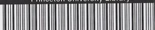
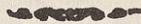
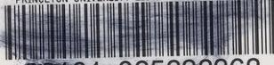

{0}------------------------------------------------

من مؤلفات فضلكلام عبد الله بن باز

# تعليمات العمرة الأولى

للدكتور

عبد الله بن باز

أول طبعة

{1}------------------------------------------------

Daftar  
inv. # 73/1/1016

{2}------------------------------------------------

Princeton University Library

A standard 1D barcode with the text 'Princeton University Library' above it and the number '32101 060160981' below it.

Barcode

32101 060160981

## Princeton University Library

This book is due on the latest date  
stamped below. Please return or re-  
new by this date.

|  |  |
|--|--|
|  |  |
|--|--|

{3}------------------------------------------------

{4}------------------------------------------------

{5}------------------------------------------------

{6}------------------------------------------------

Makārim Shīrāzī

# تعليقات على العروة الوثقى

لاقل خدمة العلم

ناصر مكارم الشيرازي

الطبعة الاولى  
١ ذى الحجة الحرام  
١٤٠٢

من منشورات  
مدرسة الامام امير المؤمنين (ع)  
قم

Decorative separator line

المطبعة العلمية - قم

{7}------------------------------------------------

RECAP  
(Arab)

BP174

.M34

mujallad 1

## هذا الكتاب

لا يتضمن تعاليق وفتاوى صرفة ، بل سوف يجد

الباحث الكريم في خلالها المامات نافعة ، واشارات

دقيقة ، الى ادلة كثير من المسائل الفقهية الهامة مع

رعاية الاختصار .

{8}------------------------------------------------

PRINCETON UNIVERSITY LIBRARY

PAIR&gt;

Barcode graphic

32101 025232362

1503 9400034752 P

### بِسْمِ اللَّهِ الرَّحْمَنِ الرَّحِيمِ

(التعليقة)

(رقم المسألة والمتن)

### فصل في التقليد

١ - (ومعاملاته) \* بل ويجب عليه التقليد في ساير اعماله ايضا فانه لا خصوصية للعبادة والمعاملة بعد عمومية التكليف نعم لو كانت المعاملة بمعناها الاعم شملت الجميع .

٢ - (الاقوى جواز \* ولكن جعله طريقاً للوصول الى جميع احكام الشرع مع العمل بالاحتياط) امكان الوصول اليه من طريق الاجتهاد او التقليد مرغوب عنه قطعاً .

٣ - (امكن الاجتهاد \* ولكن قد عرفت ان اتخاذ الاحتياط كطريقة في جميع اعماله مرغوب عنه قطعاً غير معهود في لسان الشارع وفي اعصار ائمة اهل البيت عليهم السلام وانما كان الاحتياط عندهم في موارد خاصة ، او اذا لم يمكنهم الوصول الى الحكم من طريق الاجتهاد او التقليد .

٤ - (عمل العامى بلا تقليد \* ولكن بطلانه حكم ظاهرى فلو انكشف له الواقع قطعاً

-٣-

{9}------------------------------------------------

-٢-

في التقليد

(التعليقة)

(رقم المسألة والمتن)

ولا احتياط باطل) او اجتهاداً وكان مطابقاً له كان صحيحاً وكذا اذا وافق فتوى من يقلده .

٨- (التقليد هو الالتزام) \* بل هو الاستناد العملي الى قول المجتهد فلا يكفى فيه مجرد الالتزام قلباً ، او مع اخذ الفتوى ، او اخذ الرسالة بانياً على العمل ولكن الاحكام الشرعية لا تدور مدار هذا العنوان ، لعدم ورودها في الكتاب ولا السنة الا في رواية ضعيفة ، بل الادلة تدل مطابقة او التزاماً على « حججة قول المجتهد للعامى » مع قيودها الآتية .

٩ - (جواز البقاء) \* بمعنى كونه كسالحى فيجب تقليده اذا كان اعلم الى غير ذلك من الاحكام و يكفى فى البقاء مجرد اخذ الفتوى عنه بقصد العمل خروجاً عن ادلة حرمة تقليد الميت ابتداءاً لو قلنا به .

٩- (تقليد الميت ابتداءاً) \* لادليل عليه يعتد به ودعوى الاجماع فى مثل هذه المسائل ممنوعة نعم كثيراً ما يكون الاحياء اعلم من الاموات لتلاحق الافكار جيلاً بعد جيل ، هذا مضافاً الى انه رمز حيوة المذهب وتحركه فى جميع شئونه فالاحوط ترك تقليد الميت ابتداءاً .

١٢ - ( يجب تقليد) \* بل يجب على الاقوى اذا علم تفصيلاً بمخالفة فتواه لغيره او اجمالاً فى محل الابتلاء اما فى غير ذلك يجوز تقليد غير الاعلم لجريان سيرة العقلاء عليه بلا اشكال وعلى هذا الادليل على وجوب الفحص عنه الا فى الصورتين المذكورتين .

١٣ - ( يتخير بينهما ) \* اذا علم باختلافهما فى الفتوى فى محل الابتلاء يؤخذ باحوطهما من غير مراعات الاورعية و اذا لم يكن احدهما

{10}------------------------------------------------

في التقليد

-٥-

| (رقم المسألة والمتن)             | (التعليقة)                                                                                                                                                                                                                                                         |
|----------------------------------|--------------------------------------------------------------------------------------------------------------------------------------------------------------------------------------------------------------------------------------------------------------------|
|                                  | احوط يتخير .                                                                                                                                                                                                                                                       |
| ١٤ - (اذا لم يكن للاعلم فتوى) | * او لم يعلم بفتواه .                                                                                                                                                                                                                                              |
| ١٦ - (وان كان مطابقاً للواقع) | * لاشك في صحته اذا وافق الواقع اما لعدم اعتبار قصد القربة في العمل ، اولحصوله منه كما قد يتفق من بعض العوام ، لان التقليد كالا جتهاد طريق محض ، هذا اذ اعلم الواقع والا فطريقه رأى المجتهد الذي يجب عليه تقليده فعلا فانه المنجز عليه حتى بالنسبة الى حكم القضاء . |
| ١٨ -- (عدم تقليد المفضول)     | * لا اشكال فسي جواز تقليده حينئذ وبذلك جرت سيرة العملاء التي هي اقوى الادلة في ابواب التقليد .                                                                                                                                                                     |
| ١٩ -- (التقليد)                  | * او الاحتياط طبق ما مر ” .                                                                                                                                                                                                                                        |
| ٢١ -- (من يحتمل اعلميته)         | * ولكن هذا كله اذا علم بمخالفتهما في الفتوى ولم يكن احدهما موافقاً للاحتياط ففي صورة عدم العلم يجوز الاخذ بفتوى ايهما شاء وفي صورة العلم مع كون واحد منهما احوط يأخذ به على الاحوط .                                                                               |
| ٢٢ -- (يشترط في المجتهد امور) | * بعض هذه الامور لادليل عليه ما عدا دعوى الاجماع الساقط عن الاعتبار في المقام وبعضها بديهى الاعتبار وبعضها ثابت بالدليل ولكن الاحوط اعتبار الجميع وقد مر ” الكلام بالنسبة الى الحيوة والاعلمية .                                                                   |
| ٢٢ -- (فللعوام ان يقلدوه)     | * لادليل على اعتبار ازدياد من العدالة لو لم نقل بكفاية الوثاقة والظاهر ان ما في الخبر طريق الى العدالة او الوثاقة مضافاً الى ان الخبر ليس ناظراً الى التقليد المصطلح بل الى                                                                                        |

{11}------------------------------------------------

-- ٦ --

في التقليد

(رقم المسألة والمتن)

(التعليقة)

رجوع الجاهل الى العالم فيما يحصل له الاطمینان كيف وهو وارد في اصول الدين .

٢٣ -- (العدالة عبارة عن ملكة)

\* اعتبار الملكة في العدالة قابل للاشكال بل العادل من لم ير عنه امر مخالف للشرع وحسن ظاهره مع المعاشرة له في الجملة واعتبار ازيد من ذلك مع مخالفته لظاهر روايات الباب يوجب تعطيل الشهادات ومثلها اللهم الا ان يقال انه ملازم لبعض مراتب الملكة، والعجب من بعضهم حيث اكثر القيود في مفهوم العدالة بحيث لا يوجد معه في بلد كبير الاقليل من الافراد يتصفون بها، ولم يعلم بان ذلك يوجب تعطيل الحقوق والشهادات في الحكومة الاسلامية اذا كانت .

٢٨ -- (مسائل الشك والسهو)

\* او تعلم طريق الاحتياط منها . \* الا فيما يستقل به عقله او قامت الضرورة عليه او قطع به من اى طريق .

٢٩ -- (أو العاديات)

\* بل يجب عليه اذا كان الشبهة قبل الفحص وكذا في الصورة التالية يجب تركه كذلك .

٣٠ -- (يجوز له ان ياتى به)

\* قد مر في المسألة الثالثة عشرة لزوم الاحتياط عند العلم باختلافهما فيما هو محل الابتلاء واما الاورعية فلا دليل على اعتباره وان كان الاحوط رعايتها .

٣٣ -- (تقليد ايهما شاء)

\* بـل الاقوى فيرجع الى قوله فان كان يوجب العدول فيعدل والا فيجوز له البقاء على السابق استناداً الى قول اللاحق .

٣٤ -- (فالا حوط العدول)

\* بـل وان اختلفا و لكن في موارد يجوز تقليدهما وحق

٣٥ -- (كانا متساويين)

{12}------------------------------------------------

في التقليد

-٧-

| (رقم المسألة والمتن)     | (التعليقة)                                                                                                                                                                                                                                                                                                                                                                                                  |
|--------------------------|-------------------------------------------------------------------------------------------------------------------------------------------------------------------------------------------------------------------------------------------------------------------------------------------------------------------------------------------------------------------------------------------------------------|
| في الفضيلة)              | العبارة ان يقول « ان كان تقليد كل واحد منهما جائزاً له » .                                                                                                                                                                                                                                                                                                                                                  |
| ٣٥- (على وجه التقييد)    | * واى اثر للتقييد فى هذه الموارد فلا اشكال فى صحة اعماله اذا جاز له تقليده .                                                                                                                                                                                                                                                                                                                                |
| ٣٦ - (مأمونة من الغلط)   | * حسب العادة والا اى كتاب مأمون من الغلط مطلقاً.                                                                                                                                                                                                                                                                                                                                                            |
| ٣٧ - (وجب على الاحوط)    | * بل الاقوى فى موارد العلم بالاختلاف كما مر فى المسألة (١٢) لافى غيرها و كذلك الشق الثانى .                                                                                                                                                                                                                                                                                                                 |
| ٣٨ - (كان مخيراً بينهما) | * بل اذا علم بالاختلاف بينهما فيما هو محل الابتلاء يجب عليه الاحتياط والا يتخير بينهما واذا لم يمكنه الاحتياط اخذ بقول من يرجح اعلميته عنده .                                                                                                                                                                                                                                                               |
| ٤٠ - (بالقدر المتيقن)    | * هو بعيد فى المقصر لعدم الامن من العقوبة ولكن فى القاصر الذى رجع الى التقليد عند امكانه يجوز له الاكتفاء بالقدر المتيقن .                                                                                                                                                                                                                                                                                  |
| ٤٢ - (وجب عليه الفحص)    | * اذا لم يفحص من اول امره والا يجوز له الاستصحاب.                                                                                                                                                                                                                                                                                                                                                           |
| ٤٦ - (ان يقلد الاعلم)    | * لافائدة فى ذكر هذه المسألة لان العامى لا يقلد احداً فى هذه المسألة والالزم الدور بل يرجع اولا الى عقله وصرافة ذهنه فان دعاه الى تقليد الاعلم يقلده وان فهم من بناء العقلاء اعم منه رجع اليه نعم اذا قلد من قلد وافتى له بغيره وجب له العمل به وان كان بخلاف ما فهمه اولا نظراً الى قيام دليل شرعى عليه والانصاف ان عقل العامى والعالم يحكم بوجوب تقليد الاعلم عند وجدان الخلاف والعلم به فلو افتى المجتهد |

{13}------------------------------------------------

-٨-

في التقليد

| (رقم المسألة والمتن)              | (التعليقة)                                                                                                                                                                                             |
|-----------------------------------|--------------------------------------------------------------------------------------------------------------------------------------------------------------------------------------------------------|
|                                   | (فرضاً) بعدم وجوب تقليده حينئذ لا يمكن للعامى تقليده فيه.                                                                                                                                              |
| ٤٧ -- (فالاحوط)                   | * بل الاقوى عند العلم بالمخالفة كما مر وكذا ما بعده .                                                                                                                                                  |
| ٤٩ -- (على احد الطرفين)           | لو كان احدهما مطابقاً للاحتياط او ارجح بحسب ظنه يبنى عليه                                                                                                                                              |
| ٤٩ -- (بقصدان يسأل)               | * هذا القصد لا اثر له فى الحكم .                                                                                                                                                                       |
| ٥٠ -- (يحتاط فى اعماله)           | * واذا كان من يصلح تقليده بين شخصين او اكثر جاز له الاخلط باحوط اقوالهم .                                                                                                                           |
| ٥٣ -- (المجتهد الثانى)            | * والعمدة فيه ان دليل حجية الثانى لا يدل الا على حجيته فى الحال والمستقبل واما بالنسبة الى الاعمال الماضية فلا لانصرافها عنه ولا يبعد استناد الاجماع المدعى ايضا اليه .                          |
| ٥٣ -- (فى الحلية والحرمة)      | * بل هواشبه شىء بالعقود والايقاعات لانه ذبحها استناداً الى الفتوى السابق وبقاء الذبيحة كبقاء مورد العقد ولكن لا يترك الاحتياط بترك اكله .                                                        |
| ٥٤ -- (تقليد الموكل)              | * بل لا ينبغى الشك فى ان الموكل والوصى يعملان بنظرهما فى ذلك فانهما مأموران بالنتيجة واما طريق الوصول اليهما فهو موكل الى تشخيصهما الا اذا عين الموكل والوصى طريقاً خاصاً فانه يجب عليهما ذلك |
| ٥٥ -- (لا يصح)                    | * بل يصح بالنسبة اليه والتقوم بالطرفين لا يمنعه لانه حاصل بنظره فى مقام الظاهر                                                                                                                      |
| ٥٦ -- (مختار المدعى عليه اعلم) | * على الاحوط                                                                                                                                                                                           |
| ٥٧ -- (اذا تبين خطأه)             | * تبينا قطعيا فى النتيجة او طريق الوصول اليهاى موازين الحكم والاجتهاد                                                                                                                               |

{14}------------------------------------------------

في التقليد

-٩-

| (رقم المسألة والمتن)    | (التعليقة)                                                                                                                                               |
|-------------------------|----------------------------------------------------------------------------------------------------------------------------------------------------------|
| ٥٩ - (تساقطا)           | * الا اذا حصل الوثوق باحدهما دون الآخر وكذلك في تعارض النقل مع السماع وما بعده وما ذكره في المتن مبني على الغالب                                         |
| ٦٠ -- (يجب ذلك)         | * قد عرفت ان وجوب تقليد الاعلم مختص بصورة العلم بالاختلاف فلو لم يعلم به جاز الاخذ بغيره وان علم وجب هنا التأخير او الاحتياط                             |
| ٦٠ - (بقول المشهور)     | * بين الاموات وقدم حكم الاحياء                                                                                                                           |
| ٦٠ -- (او القضاء)       | * الا قوى عدم وجوب الاعادة و القضاء لعدم دليل على حرمة تقليد الميت و الحال هذه وادلة التقليد عام الا ان يثبت التخصيص وهو منتف هنا                        |
| ٦٠ - (اوثق الاموات)     | * والحكم فيه كالحكم في الرجوع الى المشهور من عدم وجوب الاعادة والقضاء لعين مامر من الدليل بخلاف العمل بالظن المبني على الانسداد                          |
| ٦١ -- (الظاهر الثاني)   | * فان التقليد الثاني وقع صحيحاً بحسب ظاهر حكم الشرع وادلة الحجية بالنسبة الى التقليد الثالث يجعله حجة فعلا و لااطلاق فيها الى ماسبق حكم الشرع فيه بالصحة |
| ٦٢ - (اخذ الرسالة)      | * قد عرفت ان التقليد هو الاستناد العملي الى فتوى المجتهد كما عرفت ان البقاء لا يدور مدار عنوان التقليد بل يكفي فيه اخذ الفتوى بقصد العمل                 |
| ٦٥ -- (يتخير بين تقليد) | * بل قد عرفت وجوب الاحتياط مع العلم باختلافها في محل الابتلاء                                                                                            |
| ٦٥ -- (استحباب الجلسة)  | * هذا الفرض وشبهه منتف على ما اخترناه من وجوب                                                                                                            |

{15}------------------------------------------------

-١٠-

في التقليد

(رقم المسألة والمتن)

(التعليقة)

الاحتياط عند العلم بالمخالفة نعم في العمل الواحد اذا لم يعلم المخالفة يجوز اخذ بعض احكامه من واحد وبعضها من آخر ٦٦ - (عسر على العامى) \* بل غير ممكن الا على من له احاطة علمية بالمسائل و الاقوال وشيء من الاصول والفقه الاستدلالي وقد عرفت ان الاحتياط التام في جميع المسائل لادليل على رجحانه بل امر مرغوب عنه شرعاً

٦٧ - (اصول الفقه) \* لافرق بينه وبين غيرها من المسائل بعد كون ادلة التقليد وعمدتها بناء العقلاء - عاماً كيف وشرائط حججية قول المجتهد من المسائل الاصولية ويجوز التقليد فيها وان كان اصل حججته غير قابل للتقليد وهكذا الكلام في المسائل اللغوية والادبية ٦٧ - (العرفية) \* الموضوعات المستنبطة كالوطن و المعدن و الغناء و

شبهها يجوز التقليد فيها باعتبار حكمها الشرعي بل الاقوى جواز التقليد في تعيين حدود هذه الموضوعات بحسب متفاهم العرف اذا كان محتاجاً الى لطف قريحة و كان العامى ممن لا يقدر عليه و ما يقال من عدم جواز التقليد في الموضوعات كلام لا اصل له كيف و كثير من فروع هذا الكتاب من هذا القبيل ٦٨ - (نعم الاحوط) \* لا يترك لاسيما عند العلم بالاختلاف فيما هو محل الابتلاء ٦٩ - (عدم الوجوب) \* في اطلاقه اشكال فانه قد يكون الفتوى السابقة موجباً لضرر مالي او شبهه على المقلد وفي هذا الحال لا يبعد وجوب الاعلام

٧٠ - (جواز الاجراء) \* ولكن مع علمه بشرائطها ومعرفة السببي والمسببي وغير ذلك من احكامها

{16}------------------------------------------------

في المياه

- ١١ -

| (رقم المسألة والمتن) | (التعليقة)                                                                   |
|----------------------|------------------------------------------------------------------------------|
| ٧١ - (موثوقاً به)    | * على الاحوط وقدمر الكلام فيه وكذا فيما بعده                                 |
| ٧٢ - (من الناقل)     | * بل الحق ان مجرد الظن في باب الالفاظ ايضا غير حجة والمدار على الظهور العرفي |

### فصل في المياه

- ١ - ( من الخبث ) \* في عدم مطهرية مثل الجلاب واشباهه من المايعات المضافة اشكال لكون الطهارة و النجاسة امرين عرفيين لاتعبد بين وعدم دليل يعتد به على خصوص الماء لكن لا يترك الاحتياط بترك التطهير بها .
- ١ - (مقدار الف كر) \* الحق عدم سراية النجاسة بجميعها اذا كان كثيراً لا يرى العرف سراية القذارة اليها نعم يجتنب موضع الملاقة واطرافه القريبة .
- ١ - ( الى السافل ) \* بل وكلما فيه الدفع المانع عن السراية عرفاً مثل الفوارة وشبهها .
- ٢ - ( يصير مضافاً ) \* بشرط صدق المضاف على المصعد عرفاً .
- ٣ - (مضاف) \* بشرط صدق عنوانه عليه
- ٥ - ( اخذ بها ) \* اذا كان الشك في الموضوع الخارجى لافى مفهوم الماء المطلق والمضاف وحدوده ما لعدم جريان الاستصحاب فى مثلها
- ٥ - ( لاحتمال كونه ) \* فيه اشكال والاحوط الاجتناب .
- ٧ - ( لكنه مشكل) \* تصوير الصورة الاولى فى الخارج ممكن بسهولة فقد ينقلب المطلق مضافاً بالقاء المضاف فيه ثم يغلب الماء عليه ويوجب استهلاكه وفناء عنوانه لقوته عليه وتصوير الثانية ايضا

{17}------------------------------------------------

-١٢-

في المياه

(رقم المسألة والمتن)

(التعليقة)

ممكن بمعنى فناء عنوان المضاف الملقى في الماء في حال  
ايجاد عنوان مضاف آخر كما اذا القى فيه بعض الادوية  
فانحلت في الماء وقلبه الى موضوع آخر ولكن لا شك في  
الحكم عليه بالنجاسة لان الاستهلاك لابد ان يكون في الماء  
المطلق بان يبقى بعده على عنوان الماء ولو آناً ما ولا وجه  
لعدم تنجسه.

٨ - (على الاحوط) \* بل على الاقوى وتعليله دليل له لالاحتياط

٩ - (لاوصاف النجس) \* م-ع عين النجس ايضا بحيث يصدق عليه انه متغير

بوقوع النجس فيه والافلادليل على نجاسة الماء

٩ - (لم ينجس) \* لاينبغي الاشكال في نجاسة الماء حينئذ لاتحاد المناط

عرفاً ولان الحكم بنجاسة الماء المتغير عرفي قبل ان يكون  
شرعياً كيف وقد غلب عليه النجاسة فكيف يكون رافعاً  
للنجاسة ومن الواضح ان وجود المانع من ظهور هذا  
التغير لا يمنع عن هذا الحكم والفرق بينه وبين الصورة التالية  
واضح.

٩ - (وهكذا) \* والحكم بالنجاسة في هذه الصورة ايضا قوى لما عرفت.

١٠ - (مالم يصير مضافاً) \* في هذه الصورة اذا كانت غلبة الوصف كاشفة عن غلبة

النجاسة في انظار العرف كان الحكم بالطهارة مشكلاً جداً  
لما عرفت سابقاً من ان المدار في اذهان العرف على غلبة  
النجاسة على الماء وقماهرته فلا يكون مطهراً عندهم ايضا  
والطهارة والمطهرية امران عرفيان قبل ان يكونا شرعيين.

١١ - (وصف النجس) \* ولكن عد من مراحل اوصاف النجاسة فلو فرض تغير الماء

{18}------------------------------------------------

في المياه

- ١٣ -

| (رقم المسألة والمتن) | (التعليقة)                                                                                                                                                     |
|----------------------|----------------------------------------------------------------------------------------------------------------------------------------------------------------|
|                      | برائحة طيبة بعد وقوع النجاسة فيه اشكل الحكم بنجاسته ولكن الظاهر انه مجرد فرض                                                                                   |
| ١٢ - (العرضي)        | * مجرد زوال ريحه العرضي غير كاف في الحكم بالنجاسة الا اذا كان دليلا على غلبة النجاسة على الماء فالا حوط ح الاجتناب                                             |
| ١٣ - (على الاقوى)    | * بل الاقوى اعتبار الامتزاج في تطهير الماء مطلقا                                                                                                               |
| ١٥ - (تنجس)          | * اذا كان عمدة الاستناد الى ما وقع في الماء فلو كان شيء يسير منه في الماء وكان الخارج هو المؤثر القوي لم يحكم بالنجاسة والا كفت المجاورة                       |
| ١٧ - (بنجاسته)       | * هذا اذا لم يستند التغير ولو ببعض مراتبه الى وقوع النجس                                                                                                       |
| ١٨ - (لم يطهر)       | * على الاحوط فمان الحكم بالنجاسة عند التغير لو كان بارتكاز العرف امكن الحكم بالطهارة عند زواله بعد عدم حجية الاستصحاب في امثال المقام من الشبهات الحكمية عندنا |
| ١٨ - (بنفسه طهر)     | * بشرط الامتزاج وكذا فيما بعده                                                                                                                                 |

### فصل - الماء الجاري

- فصل - (بنحو الرشح) \* اذا صدق عليه ان له مادة
- ٢ - (بالملاقات) \* اذا كان حالته السابقة عدم المادة له بحيث امكن استصحابه والافهو مشكل
- ٣ - (بالمادة) \* اتصالا عرفياً بحيث يصدق ان هذا الماء له مادة وان لم يكن متصلا بالدقة بل التقاطر لو كان كثيراً بحيث يصدق ان للماء مادة كفى على الظاهر
- ٣ - (لا ينجس) \* اطلاقه لا يخلو عن اشكال لعدم صدق المادة على منبع

{19}------------------------------------------------

-١٢-

في المياه

| (رقم المسألة والمتن) | (التعليقة) |
|----------------------|------------|
|----------------------|------------|

الرشح اذا كان ضعيفاً

٤ - (لا يلحقه) \* بل يلحقه اذا صدق عليه عرفاً ان له مادة فـان كثيراً من

الابار والعيون او جميعها كذلك

٥ - (كالجاري) \* اذا كان من قبيل اطراف النهرواما مثل الحوض المتصل

به بساقية فلا يصدق عليه الماء الجاري الا ان مدار الحكم هو  
ما كان له مادة وهو صادق عليه

٧ - (تنبع) \* وكذا الانهار التي تجرى من ذوبان الثلج في الربيع وامثاله

### فصل - الماء الراكد بالامادة

فصل - (بالملاقات) \* وان كان يظهر من كثير من الروايات عدم انفعاله بغير

غلبة النجاسة عليه و يؤيده فهم العرف في معنى النجاسة و  
الطهارة عرفاً بعد العلم بكونها معنيين عرفيين والماء مطهر  
عندهم مالم يغلّب عليه النجاسة الا ان مخالفة الاصحاب وغير  
واحد من الروايات يمنع الاخذ بها فلا يترك الاحتياط  
بالاجتناب عنه

» (لا يدركه الطرف) \* على الاحوط

فصل - (تنجس الجميع) \* بل ينجس ما وقع فيه النجس دون البواقى اذا كانت

السواقى بحيث لا يسرى النجاسة اليها عرفاً لعدم الدليل على  
نجاسته .

» (على الوجه المذكور) \* الا ما وقع فيه النجس فان الاحوط الاجتناب عنه الا اذا

كان من قبيل ماله المادة

٢ - (واربعون شبراً) \* على الاحوط فانه المتيقن بعد تعارض الادلة في المقام

وليعلم ان الاشبار المتعارفة مختلفة جداً ولا معنى للقول بان

{20}------------------------------------------------

في المياه

-١٥-

| (رقم المسألة والمتن)    | (التعليقة)                                                                                                                                                                                                                                                                                                 |
|-------------------------|------------------------------------------------------------------------------------------------------------------------------------------------------------------------------------------------------------------------------------------------------------------------------------------------------------|
|                         | المعتبر اقلها بعد كون مقياس كل احد شبره وقد حاسبنا فوجدنا بعض الاشبار المتعارفة القصيرة يكون وزن شبر مكعب من الماء يقرب ٩/٢٥ كيلو والمتوسطة ١٠/٥ والكبيرة يقرب ١٤ كيلو والعجب ان كل واحد منها يقرب بحسب الوزن احد التقديرات الواردة في الاحاديث من ٤٣ شبراً او ٣٦ شبراً و ٢٧ شبراً ولعل سر الاختلاف هو ذلك |
| ٣ - (ونصف حقة)          | * ومقدار الكبر بحسب المثقال الصيرفي هو ٨١٩٠٠ مثقال                                                                                                                                                                                                                                                         |
| ٤ - (حكم القليل)        | * على الاحوط ولكن اثبات ذلك مع تفاوت المثاقيل متعذر                                                                                                                                                                                                                                                        |
| ٥ - (من الثلج)          | * الا اذا صدق عليه الماء الجارى الذى له مادة                                                                                                                                                                                                                                                               |
| ٧ - (على الاحوط)        | * لا يترك                                                                                                                                                                                                                                                                                                  |
| ٨ - (حكم بنجاسته)       | * لا وجه للحكم بالنجاسة لان استصحاب عدم الملاقات قبل القلة لا تثبت الملاقاة بعدها                                                                                                                                                                                                                          |
| ١٠ - (الاجتناب)         | * فيما اذا لم يكن من قبيل القليل الطاهر المتمم كراً بنجس فانه لا يخلو عن اشكال لعدم صدق ملاقاة النجاسة للكر عرفاً واما في غيره فلا اشكال فيه .                                                                                                                                                             |
| ١١ - (بالنجاسة)         | * لا يترك الاحتياط بالاجتناب لاسيما اذا كانت الحالة السابقة فيها القلة .                                                                                                                                                                                                                                   |
| ١٣ - (لم يحكم بالنجاسة) | * لا يترك الاحتياط بالاجتناب في هذه الصورة دون الصورة الاتية لاسيما اذا كانت حالته السابقة الاضافة .                                                                                                                                                                                                       |

### فصل في ماء المطر حال تقاطره من السماء

فصل - (كالجاري) \* في عدم انفعاله بالملاقاة وكونه مطهراً .

{21}------------------------------------------------

-١٦-

في المياه

### (رقم المسألة والمتن)

#### (التعليقة)

- فصل - ( صدق المطر \* ولكن الظاهر عدم صدقه على القطرات بل لا يصدق غالبا عليه ) اودائماً على ما لا يجرى في الارض الصلبة ولا اقل من الشك في صدقه عليه فاعتبار الجريان وان لم يدل عليه دليل من اخبار الباب ولكن يمكن اعتباره في الصدق عرفاً .
- ١- (لا يحتاج الى العصر) \* الظاهر اعتبار خروج الغسالة منه لاعتباره في مرتكز العرف والظاهر ان الشارع امضاه في هذا الباب .
- ٢ - (الامتزاج) \* الظاهر اعتبار الامتزاج ووصول الماء الطاهر الى اجزاء الماء النجس كأنما يغسل به .
- ٣ - (لا يطهر) \* الا اذا اجتمع فيه شرايط الغسل بالماء القليل .
- ٤ - (بالمطر) \* بشرط الامتزاج ووصول الماء الطاهر الى اجزاء النجس كأنما يغسل به وهكذا هو المرتكز للعرف في ابواب الطهارة والشارع قررهم عليه ولم يدل دليل على ازيد منه والعجب منه ومن غيره من الحكم بالطهارة بوقوع قطرات عليه ولو باطارة الريح كان فيه اثر كهربائي وانه امر تعبدى .
- ٥ - (على الارض) \* على الاحوط وان كان الحكم بكونه من مصاديق ماء المطر قريباً فتأمل .
- ٦ - (ولم يكن متغيراً) \* لا يخلو من اشكال .
- ٧ - (ووقع عليها) \* اذا علم بوقوعه على عين النجس ففيه اشكال كما مر في المسألة السابقة لعدم قيام دليل عليه معتمد به .
- ٨ -- (يكون طاهراً) \* في اول ما تقطر منه اشكال نعم اذا غسل بالقطرات الاولى كان ما يتقاطر بعده طاهراً .
- ٩ -- (حتى صار طيناً) \* بشرط وصول الماء اليه لا مجرد الرطوبة .

{22}------------------------------------------------

فى المياه

-١٧-

| (رقم المسألة والمتن) | (التعليقة) |
|----------------------|------------|
|----------------------|------------|

١٠- (اذا وصل اليها) \* اذا وصل اليها الماء ومر منها و كذلك يطهر اذا كان منفصلا بهذا الشرط .

١١ - (النجس منه) \* وزال عنه الغسالة .

١١ -- (الى التعدد) \* سيأتى الكلام فيه فى باب الولوغ انشاء الله .

### فصل : ماء الحمام بمنزلة الجارى

فصل -- (بمنزلة الجارى) \* يعنى عاصم مطهر .

فصل -- ( اتصاله \* اتصالا عرفياً و ان كان الماء ينقطع عند وصوله قرب بالخزانة) الحياض لاطلاق الادلة .

### فصل : ماء البئر النابع بمنزلة الجارى

فصل -- (من قبل نفسه طهر) \* بل يشترط فيه الامتزاج بما يخرج من المادة .

فصل - (مستحب) \* تنزها عن القذارة العرفية المحتملة او التغيرات المحتملة

الحاصلة فى بعض انحاء البئر دون بعض ، الذى ترتفع بالنزح

١ -- (من المادة فى ذلك) \* بل يشترط خروجه و امتزاجه به وقد مر ان طهارته

باتصاله بالمادة ليس امراً تعبدياً بل امر عرفى حاصل من غسل

الماء بالماء وتطهير بعضه بعضاً .

٢ - (على الاقوى) \* بل اللازم هو الامتزاج كما مر و هو امر عرفى كما قد

عرفت لا تعبدى فى امثال هذه الابواب مما تكون بعيدة عن

التعبد والعجب منهم انهم سلكوا فى ابواب الطهارات مسلك

العبادات وشبهها من الامور التعبدية فانحرف كثير من احكامها

عن طورها ونشأ فيها امور عجيبة مثل طهارة الماء الكثير

النجس بمجرد اتصاله بماء عاصم وغيره من اشباهه .

{23}------------------------------------------------

-١٨-

في المياه

(رقم المسألة والمتن)

(التعليقة)

- ٣ - (ثم انقطع كفى) \* بشرط الامتزاج وكونه اكثر من الكر بهذا المقدار على الاحوط .
- ٤ - (صب مائه وغسله) \* لا يطهر الكوز ولا مافيه من الماء والحكم بطهارته كما هو ظاهر العبارة وطهارة مائه بالملازمة عجيب .
- ٥ - (عدم تغيره) \* ويعتبر مضافاً الى ذلك ان يكون اكثر من الكر بمقدار يحصل الامتزاج .
- ٦ - (بالعدل الواحد) \* اذا حصل منه الوثوق بل يكفي قول الثقة لاستقرار سيرة العقلاء ودلالة غير واحد من الاخبار عليه ولا تنافيه مفهوم رواية مسعدة وشبهها لورودها في قبال اليد وشبهها لافي مقابل الاصل لما فيما نحن فيه فلا اشكال في المسألة .
- ٦ - (وبقول ذي اليد) \* اذا لم يكن متهماً كما يدل عليه بناء العقلاء وغير واحد مما ورد في ابواب العصير العنبى .
- ٧ - (قدمت البينة) \* اذا كانت مستندة الى العلم واما اذا كانت مستندة الى الاصل فلا تكون اقوى من الاصل فيقدم عليها قول ذي اليد اذا كان مستنداً الى العلم .
- ٧ - (بيننة النجاسة) \* وهو مبني على كون مستند النجاسة العلم غالباً والا فلو كانت بيننة النجاسة مستندة الى الاصل كانت كما قبلها .
- ٨ - (وبقاء الآخرين) \* لا يخلو عن اشكال فلا يترك في مثله جانب الاحتياط وان كان الارجح في النظر ماذكره في المتن .
- ٩ - (عن اشكال) \* الاشكال فيه ضعيف اذا لم يكن متهما لما عرفت في المسألة السادسة .
- ٩ - (ايضاً اشكالا) \* قد عرفت في المسألة السادسة كفايته اذا حصل منه الوثوق

{24}------------------------------------------------

في المياه

-١٩-

| (رقم المسألة والمتن) | (التعليقة) |
|----------------------|------------|
|----------------------|------------|

بل كفاية قول الثقة ولو لم يكن عدلا .

١٠ - (بل وللاطفال) \* مشكل جداً بل لعل ظهور اطلاقاات عدم الانتفاع به في الماء والمرق والدهن دليل على العدم .

### فصل - الماء المستعمل في الوضوء ظاهر

فصل-- (ويرفع الخبث) \* لادليل على جواز رفع الخبث به ولايستفاد من روايات الباب الا العفو عن ملاقيه ولعله للتسهيل على العباد ودفع الحرج

فصل - (الاحوط الاجتناب) \* بل الاقوى والعمدة فيه الارتكاز العرفي فانه قاض بحمل الماء للنجاسة الموجودة في المحل وانه بحكم المحل قبل غسله به .

٢ - (لابأس به) \* بحيث يستهلك فيهما لعدم دلالة الاطلاقاات على ازيد منه

٢ - (بحيث يتميز) \* ذكر هذا الشرط عجيب فانه قلما يتفق ان لا يكون فيه اجزاء متمايزة اذا كان المراد منه الماء الذي يقع على الارض فيقع فيه الثوب مثلا كما هو مورد الروايات فلا ينبغي الشك في ان ملاقيه ظاهر باطلاق روايات الباب الا اذا لاقى الثوب مثلا عين النجاسة ومع هذا الشرط اي مورد يبقى لهذا الحكم؟

٦ - (فمع الاعتياد) \* فعلا او شأناً كما اذا اعد ذلك ولم يستمر بعد

٧ - (بالطهارة) \* مشكل جداً لان الترخيص لابد من اثباته في امثال هذه المقامات على احتمال قوى

٨-- (كخزانة الحمام) \* او كالظروف الكبار المسمى بـ «وان» في عصرنا المتصلة بما في الانابيب وان لم تكن بمقدار الكر كما هو واضح

١٠ - (ونحوها) \* قد مر ذكر هذا الحكم في المسألة الثامنة فلا وجه لاعادته

{25}------------------------------------------------

- ٢٠ -

في المياه

| (رقم المسألة والمتن) | (التعليقة) |
|----------------------|------------|
|----------------------|------------|

١٣ -- (مراعات \* والاحتياط فيه ضعيف جداً  
الاحتياط اولى)

### **فصل : الماء المشكوك نجاسته ظاهر**

فصل - (محكوم \* مشكل لاحتمال انقلاب الاصل الاولى فى باب الاموال  
بالاباحة) ببناء العقلاء و شبهه الا ان يكون فيه امارات الحلية كالمياه

الموجودة فى الغدران فى الصحارى

١ -- (كواحد فى الف) \* فى كون هذا العدد دائماً من غير المحصور تامل بل المدار  
فيه ان يبلغ العدد حداً لا يعتنى باحتمال الحرام فيه العقلاء وهذا  
يختلف باختلاف المقامات

٢ -- (واحداً فى ألف) \* قد مر المعيار فيه المسألة السابقة

٢ -- (الشبهة البدوية \* اذا كان الاحتمال ضعيفاً لا يعتنى به العقلاء كما مر ولم يكن  
ايضاً) هناك منشأ شك آخر

٣ -- (والوضوء به) \* لا يترك الاحتياط بالجمع لاحتمال كونه مصداقاً لواجد الماء  
ولانه من قبيل الشك فى القدرة

٤ -- (او مغصوب) \* اذا لم يكن هناك اصل يمنعه عن التصرف فيه كما هو كثير  
فى باب الاموال

٥ -- (الاحوط الاجتناب) \* الا اذا كان جميع الاطراف مسبوقة بالنجاسة ثم علم طهارة  
بعضها فان استصحاب النجاسة جارية فى الجميع فيحكم  
بنجاسة ملاقيها

٧ -- (فى المشتبهين) \* المشتبهين من حيث النجاسة

١٠ -- (ووضوئه) \* مشكل جداً فلا يترك الاحتياط بالوضوء او الغسل بغيره عند

{26}------------------------------------------------

في النجاسات

-٢١-

| (رقم المسألة والتمن) | (التعليقة) |
|----------------------|------------|
|----------------------|------------|

وجدانه وعند عدمه يتيمم

١١ - (قاعدة الفراغ) \* بل لو جرت القاعدة اشكل الامر من جهة العلم الاجمالي بنجاسة يده وبطلان وضوئه او نجاسة الاناء الباقي

### فصل: سؤر نجس العين

فصل - (والكافر) \* سياتي الكلام انشاء الله تعالى في الكافر في باب النجاسات

وانه لادليل على نجاستهم

فصل - (على قول) \* استثناء الهرة من الكراهة لا يخلو عن ضعف لتعليل طهارة

سؤرها بانها من السباع في عدة من الاخبار وللتصريح بالتنزه عنه في رواية ابن مسكان فما دل على عدم البأس به ناظراً الى عدم الحرمة ظاهراً

فصل - (والحمير) \* لم نجد عليه دليلاً الا مفهوم قوله : اما الابل والبقر والغنم

فلا بأس الواردة في رواية ٥٣ من ابواب الاسئار في حديث سماعة بعد السؤال عن شرب سؤر الدواب

فصل - (الحائض المتهمة) \* المستفاد من روايات الباب ان الشرب من سؤرها ليس مكروها مطلقاً وانما يكره الوضوء منه اذا كانت متهمة بل ظاهرها حرمة الوضوء منه حينئذ فراجع

فصل - (مطلق المتهمة) \* لم اجد دليلاً له يعتد به وقد عرفت الاشكال في الحائض

### فصل - في النجاسات

فصل - (دم سائل) \* لم نجد دليلاً على اعتبار الدم السائل في نجاستها بل الظاهر من اطلاق الادلة ان كل ماله لحم فبوله نجس نعم لما لم

{27}------------------------------------------------

- ٢٢ -

في النجاسات

(رقم المسألة والمتن)

(التعليقة)

يكن اطلاق في الغائط امكن الاقتصار على موضع الاجماع وهو ماله دم سائل ولادليل على الملازمة بين البول والغائط دائماً .

فصل - (اوعارضياً) \* على الاحوط في العارضى لاحتمال انصراف الاطلاقات الى ما لا يؤكل لحمه بالذات فتأمل

فصل - (ليس له دم \* قدعرفت انه لادليل على طهارة بوله بل الاطلاقات شاهدة على نجاسته لعدم دليل على التقييد بخصوص ماله دم سائل نعم مالا لحم له يعتد به خارج عنها

#### ١- (لايوجب النجاسة)\* مقتضى القاعدة المستفادة من الارتكاز العرفي في النجاسات

التي هي قذارات عرفية امضاهاالشرع عدم الفرق بين الظاهر والباطن فما صدر من بعضهم من عدم نجاستها ما دامت في الباطن عجيب وهو نوع تحريف في الحقايق العرفية وكذلك لافرق بين الملاقاة في الباطن او الظاهر سواء كان المتلاقيان من الباطن او احدهما من الخارج والاخر من الباطن او كلاهما من الخارج (في الصور الاربع) مالم يقم دليل على خلافه نعم و رد روايات في حب القرع والديدان الخارجة عن المصلى (باب ٥ من ابواب نواقض الوضوء ) مشعرة بطهارتها لكنها قاصرة السند او الدلالة وكذا ورد في باب طهارة المذى وشبهه وطهارة بصاق شارب الخمر ما قد يستشم منها خلاف ماذكرنا ولكن المجموع قابلة للحمل على طهارة البواطن بزوالعين النجاسة وعلى فرض دلالتها بشكل التعدى عنها فالاحوط لو لم يكن اقوى الاجتناب عن النوى وشبهها

{28}------------------------------------------------

في النجاسات

- ٢٣ -

| (رقم المسألة والمتن)                                                                                                                                                                                                                                                                      | (التعليقه) |
|-------------------------------------------------------------------------------------------------------------------------------------------------------------------------------------------------------------------------------------------------------------------------------------------|------------|
| واجراء حكم الملاقات في الظاهر على الملاقاة في الباطن                                                                                                                                                                                                                                      |            |
| ١ - (ولم يعلم) * ولكن الظاهر انه مجرد فرض                                                                                                                                                                                                                                                 |            |
| ٣ - (بمقتضى الاصل) * وهو اصالة عدم التذكية فيما اذا شك في قبوله للتذكية اما اذا علم بقبوله لها فاصالة الحل محكم ولكن في النفس من اصالة الحل في المقام شيء لاحتمال انصرافها عما كان غالب انواعها محرمة فحينئذ ينقلب الاصل فتأمل وكذا الكلام في الشبهات الموضوعية فالاحوط الاجتناب مطلقاً . |            |
| ٣ - (دماً سائلاً) * قد عرفت انه لادليل على اعتبار سيلان الدم فراجع                                                                                                                                                                                                                        |            |
| ٤ - (دمها سائل) * قد عرفت الاشكال في اعتبار سيلان الدم ولكن الظاهر طهارة فضلة الحية وغيرها مما ليس له دم سائل لعدم الدليل هذا في الفضلة لا البول فانه نجس مطلقاً من محرم اللحم غير الطير .                                                                                                |            |
| الثالث - (له دم سائل) * لادليل على العموم الا الاجماع وحاله في هذه المقامات معلوم ولكن لا يترك الاحتياط لاسيما في حرام اللحم وظاهر غير واحد من الروايات طهارة كل ما يخرج من حلال اللحم ولكن الاحوط ما ذكرنا                                                                               |            |
| الثالث - (والودى) * ويظهر من روايات الباب وغيره ان المذى ما يخرج عقيب الشهوة عند الملاعبة وشبهها والودى ما يخرج عقيب البول والوذى ما يخرج من الادواء                                                                                                                                      |            |
| الرابع - (ماله دم سائل) * المعروف ان المراد منه هو ما يخرج بقوة عند قطع اوداجه ولكن لادليل عليه يعتد به ولعل المراد منه السيلان العرفي وفي بعض روايات الباب مجرد ماله الدم                                                                                                                |            |

{29}------------------------------------------------

- ٢٢ -

في النجاسات

| (رقم المسألة والمتن)                                                                                                                                                                                                      | (التعليقة) |
|---------------------------------------------------------------------------------------------------------------------------------------------------------------------------------------------------------------------------|------------|
| 
الرابع -- (والعظم) * العظم مما فيه الروح قطعاً ولادليل على استثنائه يعتد به بل المذكور في روايات الباب مالا روح فيه او ما ينفصل عن الميت وشبه ذلك وقد ذكر عظام الفيل في مصححة زرارة ولعل المراد منه العاج والانياب
 |            |
| 
الرابع -- (القشر الاعلى) * وان كان ناعماً لاطلاق الدليل
                                                                                                                                                            |            |
| 
الرابع -- (اونتف) * اذا لم يكن فيه من اجزاء بدن الميتة شيء
                                                                                                                                                         |            |
| 
الرابع -- (الانفحة) * هي مما فيه الروح ولكن استثنيت بالخصوص في الاخبار هذا اذا كان المراد منه نفس الكرش من صغار الحيوان ولكن ان كان المراد به ما فيه اللبن فحاله اوضح
                                              |            |
| 
الرابع -- (مأكول اللحم) * لا يترك الاحتياط فيه لما في اطلاق دليله من الاشكال
                                                                                                                                       |            |
| 
الرابع -- (الملاقى للميتة) * على الاحوط واطلاق دليل طهارته ينفيه فتأمل
                                                                                                                                             |            |
| 
٢ -- (البدانة عن الحي) * على النحو المتعارف المعهود
                                                                                                                                                                |            |
| 
٢ -- (من يد المسلم) * بل هو محكوم بالطهارة اذا كان مشكوكاً ولو اخذ من يد الكافر .
                                                                                                                                  |            |
| 
٥ -- (المراد من الميتة) * لادليل عليه فالاقوى طهارة ما لا يصدق عليه عرفاً عنوان الميتة كالمذبوح بغير الشرائط الشرعية وان كان الاحوط الاجتناب
                                                                       |            |
| 
٦ -- (من يد المسلم) * وان كان مسبوقاً بيد الكافر اوسوقهم واحتمل احراز المسلم للتذكية احتمالا عقلا ثياً هذا بناءاً على نجاسة غير المذكى
                                                                             |            |
| 
٧ -- (محكوم بالنجاسة) * اذا علم كونه ميتة اى مات حتف انفه والافالحكم بالنجاسة ممنوع لعدم الدليل على ان غير المذكى بالشرائط الشرعية نجس ولكن جواز الصلوة فيه وحلية الاكل مشروطتان بالتذكية الشرعية
                  |            |

{30}------------------------------------------------

في النجاسات

-٢٥-

| (رقم المسألة والمتن) | (التعليقة)                                                                                                                                                                              |
|----------------------|-----------------------------------------------------------------------------------------------------------------------------------------------------------------------------------------|
| ٩ - (في البيض)       | * والاقوى الطهارة في كليهما بشرط عدمولوج الروح والمراد منه هو الروح الحيواني الفاعل للحركة والحس اماالروح النباتي الذي هو مبدء النمو والتغذية فهو موجود فيه من اول امره                 |
| ١٠ - (قبل الغسل)     | * لايتوك في ميت الانسان لما ورد من الامر به في موردليس رطباً عادة                                                                                                                       |
| ١٢ - (يوجب النجاسة)  | * بشرط صدق اسم الميت عليه .                                                                                                                                                             |
| ١٣ - (مع الطفل)      | * لادليل على نجاسة شيء منها اذا لم يتلطخ بالدم ماعداماكان جزءاً من بدن الام فالحكم بالطهارة قوى .                                                                                       |
| ١٤ - (متصلا به طاهر) | * يعني ماجرى فيه الروح الحيواني .                                                                                                                                                       |
| ١٧ - (او مسلم)       | * هذا مبني على طهارة عظم الميت المسلم وقد عرفت ان العظام ممافيه الروح ولادليل على طهارتها اذا كانت ميتة واما بالنسبة الى الحيوان مع احتمال النذكية لايبث عنوان الميتة فهو طاهر كما مر . |
| ١٩ - (بيع الميتة)    | * لكن في شمول هذا العنوان لمثل الجلد المتخذ من الميتة تأمل وان كان الاحوط الاجتناب .                                                                                                    |
| الخامس - (ماله نفس)  | * والمراد به هنا مايخرج دمه بدفع وقوة عند فرى أوداجه                                                                                                                                    |
| سائلة)               | والافمجرد السيلان يكون في دم السمك وشبهه اذا قطع شيء من بدنه مما لا يكون نجساً بالاجماع .                                                                                               |
| الخامس - (فانه طاهر) | * حتى اذا كان في الاجزاء المحرمة لعدم قيام عموم على نجاسة الدم مطلقاً .                                                                                                                 |
| الخامس - (لرد النفس) | * رد النفس لايرد الدم الا في ريته لافي تمام جوفه وهو واضح                                                                                                                               |

{31}------------------------------------------------

-٢٦-

في النجاسات

| (رقم المسألة والمتن)                                                                                                                                                                                                                      | (التعليقة) |
|-------------------------------------------------------------------------------------------------------------------------------------------------------------------------------------------------------------------------------------------|------------|
| الخامس - (كان نجساً) * مجرد كون رأس الذبيحة في مكان عال لا اثر له الا اذا لم يخرج الدم منه بقدر المتعارف .                                                                                                                                |            |
| ١ - (نجسة) * على الاحوط فيه وفيما بعده .                                                                                                                                                                                                  |            |
| ٣ - (دمانجس) * لا دليل عليه نعم اذا صب عليه دواء فغير لونه محكوم بالنجاسة .                                                                                                                                                               |            |
| ٥ - (لا يخلو عن اشكال) * لا ينبغي الاشكال فيه لعدم عموم على نجاسة الدم .                                                                                                                                                                  |            |
| ٦ - (لا يخلو عن وجه) * وهو الاقوى .                                                                                                                                                                                                       |            |
| ٧ - (بالاستصحاب) * بناء على نجاسته اذا كان في الباطن ولكنه في مورد الدم ومثله مما لا يكون قدارته عرفية لادليل عليه فالحكم بالنجاسة هنا مشكل الا اذا كان الشك من جهة الشك في خروج الدم بالمقدار المتعارف فلا يترك الاحتياط بالاجتناب عنه . |            |
| ٨ - (لا يجب عليه * الا اذا كان سهلا جداً فلا يبعد وجوبه . الاستعلام)                                                                                                                                                                   |            |
| ١٢ - (الاجتناب عنه) * والا قوى عدمه كما عرفت آنفاً .                                                                                                                                                                                      |            |
| ١٣ - (جواز بلعه) * اذا لم يكن متعمداً لذلك بقصد شرب الدم .                                                                                                                                                                                |            |
| ١٣ - (والاولى) * بل الاحوط .                                                                                                                                                                                                              |            |
| ١٤ - (تنجس) * اذا لم يعد مع ذلك من البواطن والا لادليل على نجاسته                                                                                                                                                                         |            |
| ١٤ - (اويغتسل) * ويحتاط بالتيمم ايضاً .                                                                                                                                                                                                   |            |
| ١٤ - (كذلك غالبا) * غلبته غير معلومة بل لعل الغالب كونه دماً ولكن مجرد احتمال كونه لحماً كاف في الطهارة .                                                                                                                                 |            |
| السادس والسابع - * و كان شيئاً كالبرزخ بينهما لا اذا كان نوعاً مبايناً جديداً (الحيوانات الطاهرة) فلا يترك الاحتياط حينئذ ولكن كثير من الصور التي ذكرها                                                                                   |            |

{32}------------------------------------------------

في النجاسات

-٢٧-

| (رقم المسألة والمتن) | (التعليقة) |
|----------------------|------------|
|----------------------|------------|

مجرد فرض لاواقعية لها .

الثامن - (الكافر) \* لادليل على نجاسة الكفار اما الكتابى ظاهر كثير من الروايات المعتبرة طهارتهم ذاتاً وان نجاستهم عرضية وظاهر بعض آيات الكتاب العزيز ايضا ذلك ويظهر من غير واحد من الروايات استحباب التنزه مما فى ايديهم اجتناباً عما يكون فيهم غالباً من النجاسات العرضية وبها يجمع بين مادل على الطهارة وما يظهر منه النجاسة ووجوب الاجتناب واما غير الكتابى فهو ايضا لادليل على نجاسته ايضا من غير فرق بين اقسامه وان لم يدل دليل على طهارته لخروجه عن سياق الاخبار جميعاً فيؤخذ فيه باصالة الطهارة فيهم الا ان الاحتياط فى غير موارد الضرورة لاينبغى تركه والاجماع المدعى فى المقام حاله معلوم .

الثامن - (والاحوط) \* استحبابا

الثامن - (فالولد تابع له) \* اذا كان الام مسلمة لاتخلو المسئلة من اشكال .

١ - (او طرفين) \* اما اذا بلغ وقبل الاسلام فلاينبغى الشك فى كونه مصداقا لعنوان المسلم والمؤمن ويدخل الجنة لاطلاقات الادلة مع حكم العقل وما قد يستدل به على خلافه فلادلالة فيها واما الصغير فهو ملحق بالمسلمين بقاعدة التبعية المعمولة بين العقلاء .

١ - (كما مر) \* قد مر " الاشكال فيما اذا كان الام وحدها مسلمة لاحتمال الالحاق بالاب تبعا .

٢ - (والنواصب) \* على الاحوط فيها جميعاً

{33}------------------------------------------------

-٢٨-

في النجاسات

| (رقم المسألة والمتن)                                                                                                                                                                                                                                                                                                                                                                                                                                                                                                                                                                                                                                                                                                                                             | (التعليقة) |
|------------------------------------------------------------------------------------------------------------------------------------------------------------------------------------------------------------------------------------------------------------------------------------------------------------------------------------------------------------------------------------------------------------------------------------------------------------------------------------------------------------------------------------------------------------------------------------------------------------------------------------------------------------------------------------------------------------------------------------------------------------------|------------|
| 
٢ - (باحكام الاسلام) * وعقايده المسلمين على مبنى القوم وعلى المختار فالامر ظاهر
 
التاسع - (الخمر) * على الاحوط وجوباً
 
التاسع - (بالعرض) * اذا كان مايعه مما يوجب الاسكار بشر به ويصدق عليه المايع المسكر فالاحوط الاجتناب عنه دون ما لايسكر بشر به بل بتدخينه او مثل ذلك
                                                                                                                                                                                                                                                                                                                                                                                                                                                                     |            |
| 
١ - (او بنفسه) * العصير لا يغلى عادة الا بالنار واما النشيش الحاصل بنفسه اوفى مقابل الشمس فهو امر آخر لاربط له بالغليان الحاصل من النار فانه من مقدمات انقلا به مسكراً وقد ذكر اهل ان المواد الحلوة تنجذب بالمواد المخمّرية وهى خليات حيه ثم يحصل منه المواد الكحولية وغاز الكربن وهذا الغاز هو الذى يوجب النشيش وهو المسمى بغليان الخمر (جوشش مى) ومنه يظهر ان الغليان بنفسه يوجب الاسكار ويجرى عليه جميع احكام الخمر ولا يطهره الثلثان واما الغليان بالنار يوجب الحرمة لالنجاسة ويطهر بذهاب الثلثين وكأن الحكمة من تحريمه ان العصير المتخذ للشرب مدة مديدة اذالم يذهب ثلثاه ينقلب خمراً تدريجاً فحرمه الشرع مطلقاً حماية للحمى واما اذا ذهب ثلثاه فلاينقلب مسكراً لان من شرائط التخمير وجود كمية وافرة من الماء ومنه يظهر النظر فى ساير ماذكره فى المتن
 |            |
| 
١ - (أو بالشمس أو بالهواء)
 
* الاحوط عدم كفاية غير النار وان كان لا يخلو من وجه يعلم مما ذكرنا
                                                                                                                                                                                                                                                                                                                                                                                                                                                                                                                                                                                                                                                      |            |
| 
١ - (كان حراماً) * لادليل على حرمته والغاء الخصوصية منه ممنوع ووجهه
                                                                                                                                                                                                                                                                                                                                                                                                                                                                                                                                                                                                                                                                                       |            |

{34}------------------------------------------------

في النجاسات

-٢٩-

| (رقم المسألة والمتن)    | (التعليقة)                                                                                                                                                                                                                                                                                      |
|-------------------------|-------------------------------------------------------------------------------------------------------------------------------------------------------------------------------------------------------------------------------------------------------------------------------------------------|
|                         | يعلم مما مر .                                                                                                                                                                                                                                                                                   |
| ١ -- (عدم حرمتها) *     | بل الاحوط لولم يكن الاقوى حرمة شرب عصيرهما قبل ذهاب الثلثين ولكن لاوجه لنجاستهما                                                                                                                                                                                                                |
| العشر -- (الفقاع) *     | لااشكال في حرمته وحكمه من حيث النجاسة كالخمر                                                                                                                                                                                                                                                    |
| العشر -- (خفيا) *       | المعروف بين اهل الخبرة ان فيه مادة الكحولية بين ٢- ٥ في المأة .                                                                                                                                                                                                                                 |
| العشر -- (الا اذا كان * | او صدق عليه اسم الفقاع مسكراً)                                                                                                                                                                                                                                                                  |
| الحادي عشر -- (عرق *    | لادليل على نجاسته فالاقوى طهارته ولكن الاحوط الاجتناب الجنب من الحرام) عن الصلوة في الثوب اذا كان عرق الجنابة من الحرام موجوداً ومنه يظهر حكم المسائل الاتية                                                                                                                                    |
| الحادي عشر -- بل *      | بل الاحوط لاحتمال انصراف الاطلاقات الى غيره (الاقوى)                                                                                                                                                                                                                                            |
| ١ -- (قبل تمامه نجس) *  | قد عرفت انه ظاهر فلايجب الغسل كما ذكره                                                                                                                                                                                                                                                          |
| الثاني عشر -- (مطلق *   | هذا الاحتياط في مطلق المسوخ ضعيف جداً لعدم دليل المسوخات) * عليه مطلقاً وفي غيره ايضاً لايجلو عن ضعف لعدم امكان استظهار النجاسة من غالب ادلتها بل قد يستفاد من بعضها ان الاجتناب منها من جهة السم او القذارة العرفية وعلى كل حال فالحكم ماذكره من الطهارة في الجميع لدلالة روايات عديدة عليها . |
| ٣ -- (غسالة الحمام) *   | الاحوط لولم يكن الاقوى عدم جواز الاغتسال منها ولا غسل النجس بها للنهي الصريح عنه في غير واحد من الروايات                                                                                                                                                                                        |

{35}------------------------------------------------

-٣٠-

في النجاسات

(رقم المسألة والمتن)

(التعليقة)

مع انه مما يستقذر منه عرفاً ولا يرى مطهراً عندهم وقد عرفت  
ان الطهارة و النجاسة أمران عرفيان قبل ان يكونا شرعيين  
فكيف يمكن التطهير بماء ليس في العرف مطهراً - والمراد  
به ما يجتمع في البئر المعد لجمع الغسالات وشبهه

### فصل: طريق ثبوت النجاسة او التنجيس

فصل - (العدل الواحد \* والاقوى حجتيه بل وكذلك حججة قول الثقة  
اشكال)

- ١ - (والنجاسة) \* اي لا يجب عليه تحصيل العلم بالطهارة ولا اثر لعلمه بالنجاسة  
٢ - (كفى في ثبوتها) \* اذا حكيا عن واقعة واحدة على الاحوط بان يخبر كل واحد  
منهما بوقوع قطرة بول فيه ولكن اختلفا في صفة البول وكيفيته  
فما ذكره في المثال لا يخلو عن الاشكال  
٧ - (فيجب الاجتناب \* اذا كان «المخبر به» شيء واحد على الاحوط  
عنهما)

- ٨ - (وجوب الاجتناب) \* اذا اخبرا عن واقعة واحدة واختلفا في زمانه على الاحوط  
٩ - عدم الكفاية \* بل الاحوط الاجتناب نعم لو كان اختلافهما هنا ايضا راجعاً  
الى خصوصيات واقعة واحدة كان الاقوى هو الحكم بالنجاسة  
١٠ - (لو اخبر المولى) \* لا وجه له و كانه وقع الاشتباه منه قدس سره بين اليد الدالة  
على الملك واليد المعتبرة هنا التي ملاكها التصرف

- ١١ - (نقدم عليه) \* اذا كانت مستندة الى العلم فلو كانت مستندة الى الاصل فلا  
تكون اقوى من الاصل فيقدم قول ذي اليد عليه اذا كان مستنداً  
الى العلم .

{36}------------------------------------------------

في النجاسات

-٣١-

(التعليقة)

(رقم المسألة والمتن)

- ١٢- (بل مسلماً او كافراً) \* فيمن لايؤمن بالطهارة والنجاسة اشكال ظاهر  
١٣- (اذا كان مراهقاً) \* اذا حصل الوثوق منه والاففيه اشكال  
١٤- (بالنجاسة) \* مالم يكن متهماً في اخباره بان يريد اخراج الملك عن  
يد المشتري مثلاً بهذا الخبر

### فصل: كيفية تنجس المتنجسات

فصل - (لكن الاحوط \* لا يترك هذا الاحتياط للنصوص العديدة الامرة به  
غسل)

فصل - (والمضاف \* يعنى وان كان كثيراً ولكن الماء المضاف وساير المايعات  
مطلقاً) كالزيت والنفط وغيرها اذا بلغ في الكثرة حداً لا يستقدر عرفاً  
بمجرد شيء قليل من النجس يشكل الحكم بنجاسته لعدم  
دليل عليه قطعاً بعد كون النجاسة وسرايتها من الامور العرفية  
وقد امضاها الشرع وان ذكر لها خصوصيات

فصل - (رطوبة مسرية) \* مع عدم جريانها وسيلانه بحيث يسرى الى ساير اجزائه  
فصل - (والسراية) \* المدار في التنجس على السراية العرفية و التفاوت بين  
الاتصال قبل الملاقاة وبعدها انما هو في ذلك فانه اذا انفصل ثم  
اتصل انتقل اجزاء مائية من احدهما الى الآخر بالوجدان  
وهي توجب النجاسة وليس كذلك عند الاتصال

- ٢- (في طهارة الحيوانات) \* اذ اعلمنا بزواله وعند الشك فالاحوط الاجتناب واستصحابه  
وان كان مثبتاً الا انه يحتمل فيه خفاء الواسطة كالمسألة السابقة  
٣- (والمناط في الجمود) \* بل المدار على السراية العرفية لا غير

{37}------------------------------------------------

-٣٢-

في النجاسات

| (رقم المسألة والمتن)   | (التعليقة)                                                                                                                                                                                                                                                                                                                                                                                                                                    |
|------------------------|-----------------------------------------------------------------------------------------------------------------------------------------------------------------------------------------------------------------------------------------------------------------------------------------------------------------------------------------------------------------------------------------------------------------------------------------------|
| ٤- مع جريان العرق)     | * او اتصاله الموجب للسراية عرفاً                                                                                                                                                                                                                                                                                                                                                                                                              |
| ٥- (تنجس)              | * هذا اذا لم يخرج منه الماء متدافعاً بان كان سطح الماء الواقف مساوياً لسطح الماء في الابر يق او كالمساوى له والا لايزال متدافعاً فلاينجس                                                                                                                                                                                                                                                                                                      |
| ٩-- (ولو بنجاسة اخرى)  | * ولكن تشتد نجاسته اذا كان الثاني اقوى نجاسة                                                                                                                                                                                                                                                                                                                                                                                                  |
| ٩- (بعد تنجسه بالدم)   | * ولكن قد عرفت اشتداد نجاسته بذلك                                                                                                                                                                                                                                                                                                                                                                                                             |
| ١٠-- (اجراء حكم الاشد) | * بل يجوز اجراء حكم الاخف لان النجاسة ذات مراتب كما عرفت والقدر الثابت مرحلة الاخف والاشد منفي بحكم الاستصحاب وليس هنا موضع التمسك باستصحاب الكلى بعد ما عرفت                                                                                                                                                                                                                                                                                 |
| ١١-- (ان المتنجس منجس) | * كما ان المتنجس بالمتنجس ايضا منجس اما ما بعده فلا دليل عليه وبعبارة اخرى المتنجس منجس بواسطة اسطتين لا اكثر فاذا اصاب الماء المتنجس اناءاً وجب الاجتناب عن الاناء كما يجب الاجتناب عما يلاقى الاناء واما اكثر من ذلك فلا ، هذا غاية ما يستفاد من مجموع مما ورد في الباب من الاخبار المختلفة وهو موافق لارتكاز العرف في باب سراية النجاسة اجمالا فانهم لا يستقذرون ما يلاقى المتنجس ولو بعشر واسطة كما هو ظاهر كما انه لا اجماع فيما عدا ذلك |
| ١١-- (الثاني)          | * لا يترك الاحتياط فيه                                                                                                                                                                                                                                                                                                                                                                                                                        |
| ١٢- (بالرطوبة أصلا)    | * كانه فرض غير واقع فلذا يستقذر اهل العرف مثل هذا الجسم اذا انغمس في البول مثلا                                                                                                                                                                                                                                                                                                                                                               |
| ١٣- (لا توجب التنجيس)  | * قدم في المسألة الاولى من نجاسة البول والغائط انه لا فرق                                                                                                                                                                                                                                                                                                                                                                                     |

{38}------------------------------------------------

في النجاسات

-٣٣-

(رقم المسألة والمتن)

(التعليقة)

في احكام النجاسة بين الظاهر والباطن على الاحوط لولا الاقوى

### فصل - يشترط في صحة الصلاة ازالة النجاسة

فصل -- (عدم التستر به) \* مجرد كون ساتره غيره لا يكفي في صدق عدم التستر به بل الظاهر اعتبار جمعه حوله بحيث يقال في العرف انه بمنزلة اللباس له ومنه يظهر انه اذا لم يصدق التستر والتلبس به يشكل الصلوة عارياً تحته

» (موضع السجود) \* على الاحوط

٢- (مطلقا على الاحوط) \* اذا كان من توابع بدنه ولباسه وشبهه لا بأس به

٣- (فيجب على كل احد) \* نعم ما دامت في المسجد تكتب له السيئة لانه من فعله

٤- (مع سعة وقتها) \* منافاة الصلوة بحسب المتعارف لفورية الازالة قابل للتأمل

٤- (مسجد آخر) \* اوفى محل آخر غير المسجد

٦ -- (لكنه أحوط) \* لا يترك هذا الاحتياط لعموم جنبوا مساجدكم النجاسة

٧- (تخريب شىء منه) \* اذا كان شيئاً يسيراً

٧- (وتعمير الخراب) \* لا يترك الاحتياط برده على ما كان لا اقل

٨ -- (وجب تطهيره) \* ولكن لا يشمل هذا مثل العباء المتنجس الذي يفرشه المصلى

ثم يأخذه بعد ما صلى

٩- (بعد الخراب جاز) \* الاقوى عدم الجواز الا اذا دخل في عنوان تعمير المسجد

وفي صورة الابقاء لا يترك الاحتياط بتطهير ظاهره داخلا و

خارجاً اذا امكن ولم يكن فيه ضرر كثير على المسجد

١٠- (صار خراباً) \* مع صدق عنوانه عليه عرفاً

١٢ - (من قوة) \* بل الاحوط ضمانه

{39}------------------------------------------------

-٣٤-

في النجاسات

| (رقم المسألة والمتن)                                                                                                                                                                 | (التعليقة) |
|--------------------------------------------------------------------------------------------------------------------------------------------------------------------------------------|------------|
| ١٣ - (وجعل داراً) * وغير هيئة المسجد وبناثه                                                                                                                                          |            |
| ١٣ - (والاظهر) * بل الاظهر جواز تنجيسه وعدم وجوب تطهيره ولكن لا ينبغي ترك الاحتياط فيهما                                                                                             |            |
| ١٤ - (وجب المبادرة) * الافى المسجد الحرام ومسجد النبی ﷺ                                                                                                                              |            |
| ١٤ - (بل وجوبه) * اللازم ملاحظة قاعدة الاهم والمهم هنا والمقامات مختلفة                                                                                                              |            |
| ١٥ - (اشكال) * اذا لم يكن هتكاً لحرمات الله لادليل على تحريمه                                                                                                                        |            |
| ١٦ - (وحرمة التنجيس) * يمكن جعل بعض الارض مسجداً وبعضها خارجاً عنه ولكن فى عرفية جعل بعض البنيان مسجداً و بعضها خارجاً اشكال قوى بل لايبعد ان يكون تابعاً للارض فى الوقف             |            |
| ١٦ - (لوشك فى ذلك) * الا اذا كان ظاهر حاله كونه من المسجد ففى مثل البلاد التى تكون الصحن من المسجد لابد من الاحتياط واما البلاد التى يتعارف خلافه فلايجب الاحتياط فيها               |            |
| ١٨ - (عاماً او خاصاً) * لعل مراده العمومية والخصوصية من حيث كونه مسجد البلد او القبلة او السوق والا لا يصح وقف مسجد على قوم دون آخرين بحيث لا تصح صلوتهم فيه ولم يعهد ذلك فى الاسلام |            |
| ١٩ - (الظاهر العدم) * بل الظاهر وجوبه اذا علم بقيامه بامر التطهير بل ولو احتمل فانه من قبيل القيام بتحصيل المأمور به بالتسبيب                                                        |            |
| ٢٠ - (حرمة التنجيس) * اذا استلزم الهتك او شيئا ينافى الوقف والافلا دليل عليه فلا فرق بين التنجيس والازالة                                                                            |            |
| ٢١ - (بقصد الاهانة) * مجرد قصد الاهانة لا يكفى فى صدقها العرفى بل لابد ان يكون بحيث يصدق عنوانها عرفاً مع ذلك                                                                        |            |
| ٢٢ - (بالمركب النجس) * على الاقوى فيما يوجب الهتك وعلى الاحوط فى غيره                                                                                                                |            |

{40}------------------------------------------------

في النجاسات

-٣٥-

| (رقم المسألة والمتن)     | (التعليقة)                                                                                                                   |
|--------------------------|------------------------------------------------------------------------------------------------------------------------------|
| ٢٢ - (وجب محوه)          | * او تطهيره ان امكن                                                                                                          |
| ٢٣ - (اخذ منه)           | * لادليل على وجوب الاخذ وحرمة الاعطاء مالم يلزم هتك واهانة ، واذا احتمل الاهتداء به يكون راجحاً او واجباً                    |
| ٢٤ - (العين النجسة)      | * اذا استلزم هتكه كما هو الغالب                                                                                              |
| ٢٥ - (عن التربة)         | * اذا كان موجباً للهتك وكذا فيما بعده                                                                                        |
| الحسينية                 |                                                                                                                              |
| ٢٥ - (وصنعت عليه)        | * صدق التربة بمجرد ذلك محل تأمل                                                                                              |
| ٢٦ - (فالاحوط)           | * لا يترك                                                                                                                    |
| ٢٧ - (بتطهيره)           | * بل الحاصل بتنجيسه ولو بلحاظ وجوب تطهيره شرعاً                                                                              |
| ٢٨ - (اذا لم يكن لغيره)  | * قد عرفت انه اذا كان لغيره يضمن النقص الحاصل بالتنجيس لا المال الذي يصرف في تطهيره                                          |
| ٢٨ - (كما قيل)           | * هذا الاحتمال ضعيف واضعف منه ما بعده                                                                                        |
| ٢٩ - (بغير اذنه اشكال)   | * بل غير جائز قطعاً واما في الصورة التي استثناها فلاشك في وجوبه                                                              |
| ٣١ - (للاستعمال المحرم)  | * على الاحوط وفيه كلام ياتى في محله انشاء الله في ان مجرد القصد موجب للحرمة او المدار على صدق الاعانة عرفاً مضافاً الى القصد |
| ٣١ - (كالميتة)           | * بل والخمر والكلب غير الكلاب المعروفة وعلى الاحوط في العذرات                                                                |
| ٣٢ - (يشترط فيه الطهارة) | * على الاحوط                                                                                                                 |
| ٣٢ - (قابلا للتطهير)     | * لم يعلم وجه صحيح لهذا التقييد                                                                                              |
| ٣٣ - (فالاقوى)           | * لاقوة فيه بل لا يترك الاحتياط لما عرفت في المسالة العاشرة                                                                  |

{41}------------------------------------------------

-٣٦-

في النجاسات

| (رقم المسألة والمتن) | (التعليقة) |
|----------------------|------------|
|----------------------|------------|

من ماء البثر من المياه

٣٤ - (لا يخلو عن قوة) \* في القوة اشكال ولكن لا يترك الاحتياط

٣٤ - (بل وكذا) \* عطفه عليه وتشبيهه بما سبق لا وجه له كما اشار اليه في ذيل

المسألة

٣٥ - (بل لا يخلو) \* في القوة اشكال ولكن لا يترك الاحتياط كما مر مثله في

عن قوة المسائل السابقة

### فصل : اذا صلى في النجس بطلت صلاته

فصل - (اذا كان) \* اذا كان الجاهل قاصراً احتمل عدم الاعداد ولكن الاحوط

عن جهل الاعداد واما اذا ركن الى اجتهاد او تقليدو كان مخطئاً فلا شك

في صحة عمله لما ذكرنا في محله من اجزاء الاوامر الظاهرية

فصل - (الاحوط الانمام) \* لا يترك مع تحصيل الشرط ان امكن

» (أو التبديل) \* اونزع ثوب النجس والاكتفاء بماتحتته

» (يتمها بعدهما) \* بل بعد احدهما او النزع ان امكن

١ - (كجاهله) \* على الاحوط في القاصر والاقوى في المقصر لما عرفت

٢ - (او على الارض) \* اذا كانت خارجة عن محل ابتلائه والالم يجوز للعلم الاجمالي

٢ - (في شيء من ذلك) \* بناء على جواز الدخول في الصلوة مع الشك في العفو

وسياتى الكلام فيه

٨ - (والاحوط تطهير \* لا يترك

البدن)

٨ - (لا يبعد ترجيحه) \* الظاهر ان المقامات مختلفة ففي بعضها يرجح هذا و في

بعضها يرجح آخر حسبما يقضيه ذوق الشرع

٩ - (بين الاخف والاشد) \* على الاحوط

{42}------------------------------------------------

في النجاسات

-٣٧-

| (رقم المسألة والمتن)  | (التعليقة)                                                                                                                                                                                       |
|-----------------------|--------------------------------------------------------------------------------------------------------------------------------------------------------------------------------------------------|
| ٩ - (ومتعده)          | * ان كان المراد من تعدد العنوان تعدد عنوان المانع كدوران الامر بين دم الحيوان المحلل والمحرم فهو واضح واما ان كان تعدد عنوان النجس كالبول والدم معا في مقابل البول فقط فهو غير ظاهر وان كان احوط |
| ٩ - (وجبت)            | * على الاحوط في بعض فروضه وعلى الاقوى في بعضها الاخر وهو ما كان كثيراً جداً                                                                                                                      |
| ١٠ - (تعين رفع الخبث) | * تعينه غير ثابت ومجرد كون الطهارة الحدثية ممالها بدل لا يكفي في ذلك بعد كون البدل اضطرارياً وكون المسألة من صغريات التزاحم .                                                                    |
| » - (والاولى)         | * لا يترك                                                                                                                                                                                        |
| ١١ - (لا يجب عليه)    | * هذه المسألة مبنية على جواز البدار اما القضاء فلا اشكال في عدم وجوبه                                                                                                                            |
| ١١ - (استأنف)         | * على القول بجواز البدار له التطهير او التبديل والتمام                                                                                                                                           |
| ١٢ - (من الطاهر)      | * ان كان الاضطرار في تمام الوقت فلا اشكال والا كان الحكم مبنيّاً على جواز البدار                                                                                                                 |
| ١٣ - (وان كانت احوط)  | * هذا الاحتياط ضعيف                                                                                                                                                                              |

### فصل فيما يعفى عنه في الصلاة

|                  |                                                                                                               |
|------------------|---------------------------------------------------------------------------------------------------------------|
| فصل - (بلامشقة)  | * بل المعتبر وجود المشقة الشخصية الموجودة في الجروح والقروح معمولاً لا يزيد منه فانه منصرف اطلاق روايات الباب |
| » - (نعم يجب)    | * على الاحوط                                                                                                  |
| ٣ - (يعفى عن دم) | * كون البواسير من القروح محل تأمل وكذا عموم الدليل                                                            |

{43}------------------------------------------------

-٣٨-

في النجاسات

(التعليقة)

(رقم المسألة والمتن)

- للقروح الباطنة فلا يترك الاحتياط في جميع ذلك
- ٦ - (فالا حوط) \* لولا الاقوى فان المنع اذا كان من طبع الشىء لابد فى ثبوت العفو والجواز من دليل و كانه قاعدة عقلائية
- الثانى - (كان فى البدن) \* مشكل فى البدن لاختصاص جميع روايات الباب بالثوب و دعوى الاولوية ممنوعة و الاجماع لو ثبت لا يكفى فى امثال المقام
- » (عدا الدماء الثلاثة) \* على الاحوط
- الثانى - (فالا حوط) \* لا يترك .
- ١ - (فدم واحد) \* فى الثوب الغليظ جداً اشكال ظاهر
- ٢ - (بقاء العفو) \* اذا جفت الرطوبة واذا بقيت فلا يبعد ان يكون بحكم المحمول المتنفس
- ٢ - (عدم العفو) \* بل الاقوى على فرض عدم الاستهلاك .
- ٣ - (على العفو) \* مشكل جداً وقد عرفت ان عنوان العفو يحتاج الى الاثبات و كذا فى صورة الشك فى بلوغه مقدار الدرهم .
- ٨ - (فلا يترك الاحتياط) \* الا اذا لم تكن الثانية اشد من الاولى و زالت بعد فالقول بالعفو حينئذ قوى .
- الرابع - (ففيه اشكال) \* والاقوى جواز الصلوة معه.
- » (فان الاحوط) \* يجوز ترك هذا الاحتياط فى غير اجزاء مالا يؤكل لحمه او فى غير ما يقع على الثوب والبدن من الاعيان النجسة كما اذا هبت الريح ونشرت على ثوبه او بدنه اجزاء العذرة اليابسة وشبهها
- الخامس - (مع النجاسة) \* اى مع البول
- » (باطلة) \* يمكن القول بصحة ماصلتها قبل آخر يومها وبطلان ما بعده

{44}------------------------------------------------

في المطهرات

-٣٩-

| (رقم المسألة والمتن) | (التعليقة) |
|----------------------|------------|
|----------------------|------------|

- ولكن لا يترك الاحتياط باعادة الجميع مع ترك الغسل مرة لاسيما مع بنائها من اول الامر على تركه .
- « (وان كان الاحوط) \* لا يترك اذا كان تحصيل ثوب آخر سهلا .
- ٢ - (من تواتر بوله) \* الا اذا لزم الحرج فانه مما يعفى عنه .

### فصل في المطهرات

فصل (في اثناء الاستعمال) \* باحد اوصاف النجاسة كما مر في باب المياه اما صيرورته كذلك بالاستعمال اعنى بعد غسله به فلا يضر .

« (والعصر) \* لا يشترط العصر لافى القليل ولا لافى الكثير لعدم اعتباره في مفهوم الغسل وعدم قيام دليل آخر عليه نعم يعتبر زوال الغسالة فلو صب عليه الماء بحيث اخرج غسالته من غير عصر كفى وان بقى فيه ماء آخر .

١ - (الاجزاء الصغار) \* بحسب نظر العرف لا بالدقة العقلية او الاستدلالات الواهية كعدم انتقال العرض .

٢ - (حال العصر) \* على الاحوط

٢ - (نفوذ الماء) \* مجرد نفوذ الماء فيه غير كاف في الطهارة في الكثير بل لابد من خروج الغسالة ولو بتحريكه في الماء او بغلبة الماء الطاهر عليه

٢ - (محكوم بالطهارة) \* مشكل لما عرفت آنفاً

٢ - (ايضاً كذلك) \* الا انه لو تغير في المحل باوصاف النجاسة اوجب نجاسة محله .

٣ - (على الاقوى) \* قد عرفت في بحث المياه عدم الدليل على جواز التطهير به

{45}------------------------------------------------

-٤٠-

في المطهرات

| (رقم المسألة والمتن)  | (التعليقة)                                                                                                                                                                                                                                 |
|-----------------------|--------------------------------------------------------------------------------------------------------------------------------------------------------------------------------------------------------------------------------------------|
| ٣ - (بطهارتها)        | * لكن الحق كما مر في فصل المياه نجاستها وانها بحكم المحل قبل انفصال الغسالة وانها حاملة للنجاسة بارتكاز العرف                                                                                                                              |
| ٤ - (او البدن)        | وغيرهما                                                                                                                                                                                                                                    |
| ٤ - (بالماء القليل)   | * اما في الكثير وشبهه من الجارى وماء المطر وماء الحمام فيكفي مرة واحدة على الاقوى                                                                                                                                                          |
| ٤ - (المزيلة لها)     | * بل يكفي ، لاطلاق دليل الغسل و لما ذكرنا في محله ان القذارات ليست اموراً اختراعية في الشرع بل هي موجودة في الخارج عند اهل العرف وطريق رفعها ما هو المتداول بينهم الا ان يصرح الشرع بخلافه ومن الواضح انهم يحكمون بالطهارة بالغسلة المزيلة |
| ٥ - (التعفير)         | * والاولى ان يقال الغسل بالتراب كما في الحديث                                                                                                                                                                                              |
| ٥ - (والاولى أن يطرح) | * هذا احتمال ضعيف والمعتبر صدق الغسل بالتراب الحاصل باضافة الماء اليه ثم ذهاب اثره بالماء مثل الغسل بالصابون وغيره .                                                                                                                       |
| ٥ - (يكفي الرمل)      | * الظاهر عدم كفايته                                                                                                                                                                                                                        |
| ٥ - (من الولوغ)       | * لا يدور الحكم مدار الولوغ بل يدور - كما ورد في النص - مدار فضل مائه اذا شرب من الاناء ويلحق به اللطخ عرفاً بل الاحوط الحاق لعاب فمه به واللازم غسله ثلاثاً بعد التراب جمعاً بين الحكمين                                                  |
| ٥ - (بل الاحوط)       | * يجوز تركه ومع رعايته فاللازم غسله ثلاثاً بالماء المطلق ايضاً .                                                                                                                                                                           |
| ٦ - (عدم وجوبه)       | * بل الاحتياط فيه ضعيف لعدم صدق عنوان الكلب عليه                                                                                                                                                                                           |

{46}------------------------------------------------

في المطهرات

-٤١-

| (رقم المسألة والمتن)     | (التعليقة)                                               |
|--------------------------|----------------------------------------------------------|
| وبطلان القياس            |                                                          |
| ٧ - (كفاية الثلاث) *     | ويعتبر فيه الدلك الا ان يزول بدونه كما ورد في الموثق     |
| ٩ - (كفاية جعل التراب) * | مع شيء من الماء                                          |
| ٩ - (لا يمكن فيه)        | * مع فرض امكان شرب الكلب منه اولطعه وحينئذ فالاحوط       |
| ذلك)                     | بقائه على النجاسة وان كان عدم اعتباره فيه لا يخلو من وجه |
| ١٠ - (في غير الظروف) *   | ليس عنوان الظرف ولا الاناء في الرواية التي هي مدرك       |
| الحكم                    | انما المعتبر صدق فضل مائه ولكن القدر المتيقن منه         |
| الظروف                   | ويبعد شموله لمثل القرابة ولكن لا يترك الاحتياط فيه       |
| لاحتمال الغاء            | الخصوصية                                                 |
| ١٥ - (كفاية المرة)       | * لا يدور الحكم مدار صدق عنوان الضعف بل الاناء الذي      |
| هو                       | اخص منه واما عند الشك فالاقوى التعدد في الشبهة           |
| المصداقية                | كما ان الاحوط ذلك في الشبهة المفهومية                    |
| ١٦ - (لابد من عصره) *    | قد عرفت امكان خروج الغسالة منه بتداوم صب الماء           |
| عليه                     | من غير عصر وشبهه .                                       |
| ١٦ - (انفصال الغسالة) *  | بل يعتبر في الجملة بحيث يصدق الغسل عليه                  |
| ١٦ - (نفوذ الماء)        | * بحيث يغلب عليها ويصدق معه الغسل وكذا في البول          |
| النافذ                   | فيه                                                      |
| ١٦ - (بالكثير يطهر)      | * بل يعتبر فيها الغلبة والمزج نعم يستفاد من روايات غسل   |
| اواني                    | الخمر وطهارة اعماقها بغسل ظاهرها بالتبع ولا يبعد         |
| ذلك                      | في تطهير الاواني من النجاسات كلها الا انه لا ينبغي ترك   |
| الاحتياط .               |                                                          |
| ١٧ - (على الاحوط) *      | استحباباً                                                |

{47}------------------------------------------------

-٤٢-

في المطهرات

| (رقم المسألة والمتن) | (التعليقة) |
|----------------------|------------|
|----------------------|------------|

١٧ - (ان يكون في \* الاحوط الاشراط بذلك .  
الحولين)

١٧ - (في لحوق الحكم) \* على الاحوط فيه وفيما بعده .

١٩ - (وان كان \* بل بعيد لاسيما اذا كان كثيراً .  
غير بعيد)

٢٠ - (الماء النجس) \* بالشرط المذكور في المسئلة السادسة عشرة

٢٠ -- (هو الاحوط) \* لا يترك اذا صدق عليه الاناء

٢١ -- (من الثلاث) \* على الاحوط

٢٢ -- (الماء النجس) \* ويغلب على النجس ويصدق معه الغسل ولكن كل ذلك  
مجرد فرض غالباً بحيث لا يسقط اللحم عن قابلية الانتفاع  
٢٣ - (الى اعماقه) \* بالشرط المذكور في المسئلة التي قبلها وكذا في التطهير  
بالقليل .

٢٤ - (جميع اجزائه) \* بالشرط الماضى في المسئلة السابقة ولكن كل ذلك مجرد  
فرض مع عدم سقوطها عن الانتفاع لاسيما فى الجبن لان  
وصول الاجزاء المائية ( لا الرطوبة ) مع وصف اطلاقها  
وغلبيتها على النجس مشكل فيها جداً  
٢٥ - (لا يخلو عن \* لا اشكال فيه وانفصال الغسالة امر عرفى ، ملاكه ذهب  
اشكال) الماء القذر المغسول به

٢٧ -- (لا يخرج منه) \* يعنى لا يبقى منه الا لونه

٢٧ - (كما مر سابقاً) \* مر حكمه في المسئلة الثانية

٢٨ -- (الفورية) \* قد عرفت الاشكال فى اصل وجوب العصر وان المدار  
خروج الماء المستقذر ولو بكثرة ورود الماء عليه وبناءاً على

{48}------------------------------------------------

في المطهرات

-٤٣-

(رقم المسألة والمتن)

(التعليقة)

ذلك يجوز اخراجه ولو بعد حين

٣٠- (في الماء الكثير) \* وان رسب فيه النجس يجب غلبة الماء الطاهر عليه

٣١- (ظاهره وباطنه) \* لادليل عليه فيسقط ما فرع عليه فان السراية غير معلوم او معلوم العدم

٣٢ - (قبل الاذابة) \* مر حكمه في المسألة السابقة

٣٣ - (ثلاث مراة) \* في صدق الانية عليها اشكال وان كان الاحوط معاملتها معها

٣٤ - (كل مرة) \* اي في اخراج غسالة واحدة اذا اخرجها مرات واما في الغسالات المتعددة لا ينبغي الشك في وجوب تطهيرها الا ان يغسل معها .

٣٥ - (ويلزم المبادرة) \* لادليل على وجوبه بعد صدق الغسل مع اخراج غسالتها بعد حين .

٣٦ - (بالماء القليل) \* ولكن لايجب تطهيرها الامرة واحدة في غير البول لعدم صدق الاناء عليه قطعاً .

٣٧ -- (الى العصر) \* قد عرفت ان العصر لا اصل له والملاك اخراج الماء القدر منه عرفاً فلو كان الشعر خفيفاً خرج منه ولو كان كثيفاً يحتاج الى تداوم الماء او العصر وبالجملة احالة هذه الامور الى العرف اولى لانها ليست اموراً تعبدية ولا يوجب كثرة البحث عنها الا وسوسة وبعداً .

٣٩ - (الى طاهر منفصل) \* في اطلاقه تأمل وان كان احوط

٤٠ - (بالمضمضة) \* اذا غلب الماء على جميع اجزائه يظهر ظاهره وباطنه والا فظاهره فقط

{49}------------------------------------------------

-٤٤-

في المطهرات

(التعليقة)

(رقم المسألة والمتن)

٤٠ -- (بذلك الدم) \* قد عرفت ان النجاسات قذارات عرفية امضاها الشرع لافرق فيها بين الداخل والخارج وكذا في السراية وسائر احكامها على الاحوط لولا الاقوى (راجع المسألة الاولى من نجاسة البول والغائط)

٤١ - (لايجب غسله \* اذا كان مثل المر كرن وان كان من قبيل الاناء وجب ثلاث مرات)

الثاني - (عشر خطوة) \* المذكور في النص يخالفه من جهتين من جهة ذكر الذراع دون الخطوة ومن جهة ذكر او نحوه بعده فاللازم ان يقال خمسة عشر ذراعاً او نحو ذلك

الثاني - (اشكال) \* بل الاقوى عدمه لعدم اطلاق في الادلة وكذا ما بعده الثاني -- (وجه قوى) \* لايترك الاحتياط فيه وفيما بعده وان كان الطهارة لا يخلو من وجه نظراً الى عموم تعليل ان الارض يطهر بعضها بعضاً بل يجري هذا الوجه في اسفل العربات والسيارات وجميع النجاسات الحاصلة من الحركة على الارض

الثاني -- (التي لاتتميز) \* اي مالا يزول عادة الا بالماء

الثاني -- (في ماء \* بل كما في الاستنجاء بالاحجار كما حكى عن بعض النسخ الاستنجاء)

الثاني -- (اعتبار زوالها) \* لاوجه لامثال هذه الاحتياطات بعدم اعرفت من عدم زوالها عادة الا بالماء وكذا ما بعده فيما هو المتعارف

١ -- (بطهارته بالتبع) \* هذا قول ضعيف والاقوى عدم الطهارة

٢ - (اصابع الرجل \* فيما تعارف تنجسه بالمشي لااشكال في طهارته وفيما لايتعارف

اشكال) لااشكال في عدم طهارته

{50}------------------------------------------------

في المطهرات

-٢٥-

| (رقم المسألة والمتن)                                                           | (التعليقة)                                                                                             |
|--------------------------------------------------------------------------------|--------------------------------------------------------------------------------------------------------|
| ٣ - (كفاية المسح)                                                              | * مشكل الا ان يقال بكفاية مطلق زوال اثره بالمسح على الاجزاء الارضية وهو لا يقول به                     |
| ٥ - (كفاية المشى)                                                              | * كيف يكفي المشى وهو لا يعلم باصابة باطن قدمه الارض فالظاهر بقائه على النجاسة واستصحاب عدم الحایل مثبت |
| ٦ - (بمطهریته ایضاً)                                                           | * بل الاقوى عدم مطهریته لما عرفت فی المسألة السابقة                                                    |
| الثالث - (الارض وغيرها)                                                     | * فی مطهریتها لغير الارض والسطح اشكال                                                                  |
| الثالث - (والبواری)                                                            | * لادلیل علیه و کذا بالنسبة الى السفينة وغيرها من المنقولات                                            |
| الثالث - (على الارض اشكال)                                                  | * بل الاقوى عدمه .                                                                                     |
| ١ - (كذلك باطنها)                                                              | * فيه اشكال                                                                                            |
| ٢ - (على الارض)                                                                | * ای التی هی جزئها عرفاً                                                                               |
| ٣ - (وكذا المسمار)                                                             | * قد عرفت الاشكال فی امثالها                                                                           |
| ٤ - (على عدمه)                                                                 | * والا قوی عدم الطهارة لكونه من المصادیق الواضحة للاصل المثبت .                                     |
| ٧ - (باشراق الشمس)                                                             | * قدمر الاشكال فی طهارة الحصير وشبهه وكذا الجدار                                                       |
| الرابع - (الى صورة * مقيداً بان يراه العرف امراً آخر متولداً منه لانه نفسه وقد | اخري)                                                                                                  |
| تغير اوصافه                                                                    |                                                                                                        |
| الرابع - (تأمل)                                                                | * بل منع ، واوضح منه ما ذكره بعده                                                                      |
| الرابع - (لا يحكم                                                              | * لا يخلو عن اشكال بعد عدم جريان الاستصحاب ولشك                                                        |
| بالطهارة)                                                                      | فی بقاء موضوعه .                                                                                       |
| الخامس ١ (انقلب خلا)                                                           | * الظاهر كما يقول اهل الخبرة انه لا يكون خلا الا بعد                                                   |

{51}------------------------------------------------

-٤٦-

في المطهرات

(التعليقة)

(رقم المسألة والمتن)

التخمير فالسكر الموجود في العنب وشبهه يتخمر اولاً ثم ينقلب خلا ثم اعلم ان اطلاق الادلة يدل على ان النجاسة الحاصلة من ناحية الظروف المعدة للتخمر التي يلقى فيها العنب وشبهه ترتفع بالانقلاب كما انه قد عرفت في مبحث النجاسات ان نجاسة الخمر مبنية على الاحتياط الوجوبي .

٤-(بمجرد الوقوع فيه) \* لكن الظاهر انه مجرد فرض وعلى فرضه لا ريب انه يكون بعد الملاقات

٥-(بصيرورته خمراً) \* ويؤيده ان اجزاء العصير او العنب المنقلب خمراً لا تكون كلها في آن واحد عادة فينقلب بعضها خمراً ويتنجس الباقى به  
٧-(يحكم بطهارته) \* لا يحكم بطهارة الدم بل ينعدم بنظر العرف فهو من قبيل انتفاء الحكم بانتفاء موضوعه .

السادس -- (بالنار او \* في غير النار اشكال

(بالشمس)

السادس -- (بين \* قد عرفت في مبحث النجاسات ان الغليان الحاصل بالنار المذكورات) لاربط له بالغليان الحاصل بالهواء او الشمس والثاني هو النشيش والاشتداد الاسكارى الذى يجعله خمراً دون الاول  
السادس-(او بالساحة) \* الكيل يرجع الى المساحة فهما شئ واحد والثلثان باعتباره قبل الوزن لان الذاهب الاجزاء المائية التى هي اخف من العصير قطعاً والتخيير بينهما من قبيل التخيير بين الاقل والاكثر وهو غير معقول والحق كفاية المساحة .

السادس-(خبر العدل \* قد عرفت كفايته سابقاً بل وكفايته خبر الثقة .

(الواحد اشكال)

{52}------------------------------------------------

في المطهرات

-٤٧-

| (رقم المسألة والمتن)                                                                                                                              | (التعليقة)                                                                                                              |
|---------------------------------------------------------------------------------------------------------------------------------------------------|-------------------------------------------------------------------------------------------------------------------------|
| ١- بذهاب ثلثيه والالات * مر الاشكال في الطهارة بالهواء كما أنه لا وجه لطهارة المحل التي لا تنفك فيه عادتاً .                                      |                                                                                                                         |
| ٢ - (حراماً ونجساً) * قد مر ان الادلة لا تشمل العنب .                                                                                             |                                                                                                                         |
| ٣ - (يشكل طهارته) * بل لا يطهر بناءاً على نجاسة العصير ولكن عرفت ان الاقوى عدمها .                                                                |                                                                                                                         |
| ٣- (لا يخلو عن اشكال) * الفرق ظاهر فان العصير في هذه الصورة تصير بعد النجاسة العرضية نجساً بالذات ثم ترتفع كلتاهما بالتثليث بخلاف الصورة الاولى . |                                                                                                                         |
| ٤ - (لا ينجس)                                                                                                                                     | * الاولى ان يقول لا يحرم .                                                                                              |
| ٥ - (لا يحرم)                                                                                                                                     | * الاحوط لولا الاقوى حرمة شربهما بعد الغليان وقبل ذهاب الثلثين ولكنهما طاهران .                                         |
| ٨ - (او نحو ذلك)                                                                                                                                  | * الاحوط لو لا الاقوى عدم جواز غير نفس العنب والتمر وما يكون معها عادة او ما يجعل فيه للعلاج .                          |
| ٩ - (اذا غلى)                                                                                                                                     | * لا وجه للحرمة او النجاسة فيه واحتمال صدق العصير عليه عجيب وعوده خلا اعجب كما يعلم بمراجعة اهله                        |
| ١٠ - (عصير التمر)                                                                                                                                 | اى ما يخرج من نفسه بلا اضافة ماء اليه .                                                                                 |
| السابع - (اسند اليه)                                                                                                                              | * وكذا اذا شك أنه منه او من البق فانه يحكم بطهارته اما لو شك في ان الدم الذي مصه صار جزءاً لبدنه اولا، فانه يشكل طهارته |
| الثامن - (لبدن الكافر)                                                                                                                            | * قد عرفت انه لا دليل على نجاسة الكفار مطلقا وان كان الاحتياط لا ينبغي تركه في غير مورد الضرورة .                       |
| الثامن - (هو الاقوى)                                                                                                                              | * لا قوة فيه                                                                                                            |

{53}------------------------------------------------

-٤٨-

في المطهرات

(التعليقة)

(رقم المسألة والمتن)

- ١ - (بعد التوبة) \* والاموال التي اكتسبها بعد الارتداد وقبل التوبة ايضا .
- ٢ - (بالمخالفة) \* على الاحوط .
- ٣ - ('الممانعة منه) \* الممانعة من اجراء حكم الحاكم مشكل ولكن له الفرار من اقامة الدعوى عليه وشبهه .
- التاسع - (ببدنه كمامر) \* على القول بنجاسة الكفار وكذا الذى بعده هذا مضافاً الى ان فى كفاية اسلام غير الاب اشكالا وكذا الاشكال فى الاسير
- التاسع - (الات تغسيل) \* لا يخفى ان طهارة الالات وشبهها ليست من باب التبعية .
- الميت) بل من باب غسلها مع شرايطه ضمناً
- التاسع - (حكم التبعية) \* الا فى اطراف البشر .
- التاسع - (على القول) \* لكن عرفت انه لا ينجس عند المصنف وعندنا بنجاسته)
- التاسع - (يد الغاسل) قد عرفت ان هذا وشبهه ليست من باب التبعية بل من التطهير ضمناً بشرائطه
- التاسع - (ونحوهما) \* تقدم آنفاً فى بحث الانقلاب الاشكال فى ذلك كالخشب)
- العاشر - (هذا الوجه) \* بل بعيد جداً لما عرفت فى مبحث النجاسات انها امور عرفية امضاها الشارع مع شرايط وقيود ومن الواضح انه لاتفاوت فى الاستقدار العرفى بين الباطن والظاهر وكذا بالنسبة الى الملاقات والعجب انهم يعاملون معها معاملة الامور التعبدية المحضة نعم اهل العرف يفرقون بين تطهير الظاهر والباطن فيرون ازالة النجاسة كافية فى دفع الاستقدار عن الباطن غالباً .

{54}------------------------------------------------

في المطهرات

- ٤٩ -

| (رقم المسألة والمتن)                                                       | (التعليقة) |
|----------------------------------------------------------------------------|------------|
| ٢- (من الباطن) * مشكل نعم في الوضوء لا يجب غسله وكذا مطبق الجفنين          |            |
| الحادي عشر (والاحوط * بل الاقوى والظاهر انه طريق الى سقوط آثار النجاسة     |            |
| مع زوال الاسم) وان لم يعرفها العرف                                         |            |
| الحادي عشر -- (وفي * الخمسة هي الاقوى والسبعة شاذة                         |            |
| البطة الى خمسة)                                                            |            |
| الثاني عشر -- (حجر * والمراد به كما سيأتي انشاء الله كل جسم قالع حجراً كان |            |
| او غيره . الاستنجاء)                                                       |            |
| الثالث عشر -- (فانه * اطلاق المطر عليه لا يصح على المختار من عدم نجاسة     |            |
| المطهر) الدم بالخصوص ما دام في الباطن ولا بناء على مختاره من               |            |
| التوقف فيه .                                                               |            |
| الرابع عشر -- * اطلاق المطهر عليه ايضا لا يخلو عن مسامحة الا بالتوجيه      |            |
| (المنصوصة)                                                                 |            |
| الخامس عشر -- (على * مشكل فلا يترك الاحتياط                                |            |
| الاقوى)                                                                    |            |
| السابع عشر (الموجود * بل قد عرفت في بحث المياه ان مجرده ايضا لا يكفي الا   |            |
| في المادة) بشرط الامتزاج على الاقوى                                        |            |
| الثامن عشر -- (علمه * يكفي احتماله من باب انه مسلم                         |            |
| بكون ذلك)                                                                  |            |
| الثامن عشر -- (حمل * بناءاً على كون مثبتات الامارات حجة مطلقاً والا فهو من |            |
| فعل المسلم) باب اخبار ذي اليد عملاً واحسن منهما ان القدر المعلوم من        |            |
| السيرة التي هي العمدة في هذا الحكم هذه الصورة .                            |            |

{55}------------------------------------------------

-٥٠-

في المطهرات

| (رقم المسألة والمتن) | (التعليقة) |
|----------------------|------------|
|----------------------|------------|

الثامن عشر -- (علمه \* يكفي احتمال في ذلك  
باشتراط)

الثامن عشر -- (صبياً \* الأقوى عدم اعتباره كما يشهد به السيرة  
مميزاً وجهان)

الثامن عشر -- (الظاهر \* لا يخلو من اشكال  
الحاق الظلمة)

الثامن عشر -- (الامور \* قد عرفت ان في بعضها الآخر مسامحة  
المذكورة)

١ - بالماء المضاف) \* قد عرفت نفي البعد عن الغسل بمثل الجلاب ونحوه ولكن  
لا يترك الاحتياط فيه .

١ - (بالكر الحار) \* لكنه لم يستبعد المصنف طهارته اذا غلى مقداراً من الزمان  
في المسألة ١٩ من المطهرات وان اخترنا عدمه

٢ - (فيه الطهارة) \* يعني غير الصلوة وشبهها

٤ - (قابل للتذكية) \* الا الفأرة وشبهها من الحشرات فان فيها اشكالا

٥ - (يستحب غسل \* بعض هذه الاحكام مبني على قاعدة التسامح وحيث لا تتم  
الملاقى) عندنا يؤتى بها جاءاً

### فصل - اذا علم نجاسة شيء يحكم ببقائها

فصل - (اخبار الوكيل) \* ان كان ذا اليد فهو داخل فيما سبق وان لم يكن فلا دليل  
على حجته قوله

فصل - (لكنه مشكل) \* قد عرفت ان الأقوى كفايته

١ - (اذا تعارض \* وخصوصيات احكام تعارضهما موكول الى محله و كذا

{56}------------------------------------------------

في المطهرات

-٥١-

| (رقم المسألة والمتن) | (التعليقة)                                              |
|----------------------|---------------------------------------------------------|
| البينتان)            | تعارض البينة مع غيرها                                   |
| ٢ - (حكم عليهما      | * فيه اشكال لعدم شمول ادلة الاستصحاب لمثله ولولم يلزم   |
| بالنجاسة)            | منه مخالفة عملية فلا يحكم بنجاسة الملاقى لواحد منهما    |
| ٢ - (وكرر الصلاة)    | * ولم يكن له غيرهما او كان له غرض عقلائي ف-ى الصلوة     |
|                      | فيهما بالتكرار                                          |
| ٣ - (على انها طارية) | * الا ان يكون هناك قرائن ظنية تدل على انها طارية فحينئذ |
|                      | يشكل البناء على الطهارة                                 |
| ٤ - (فلا يلزم الغسل) | * بل يلزم عليه ذلك                                      |

### فصل - في حكم الاوانى

- فصل - (ما يشترط فيه \* قد مر من المصنف ومنافى المسألة ٣١ من احكام النجاسات  
الطهارة) جواز الانتفاع بها مطلقاً فى غير ما يشترط فيه الطهارة و منه  
يظهر الكلام فيما لانفس له
- فصل - (مع العلم باطل) \* على الاحوط كما سيأتى فى محله
- ١ - (مالم يعلم) \* بناءاً على نجاسة الكفار وقد مر الكلام فيه
- ١ - (من الجلود) \* قد مر ان المذبوح بغير الشرايط الشرعية ليس ميتة على  
الاقوى فالمشكوك ايضا محكوم بالطهارة وكذلك غير الجلود  
من اجزاء الحيوان نعم حلية الاكل والصلوة فيه يتوقفان على  
التذكية الشرعية
- ٢ - (نجاسة باطنها) \* اذا لم تسر النجاسة الى ظاهرها
- ٣ - (اللتزئين) \* على الاحوط فيه وفى الاقتناء وكذا البيع والشراء والصياغة
- ٣ - (المشاهد المشرفة) \* لادليل عليه اذا لم يكن فيه اسراف ولكن لا يبعد كراهته.

{57}------------------------------------------------

-٥٢-

في المطهرات

(التعليقة)

(رقم المسألة والمتن)

والاولى تركه فى جميع معابد المسلمين

٥- (بل الاحوط ذلك) \* يجوز ترك هذا الاحتياط

٨- (والجدران بهما) \* ولكن اذا لم يكن مصداقاً للاسراف ولعل من الاسراف

كون الذهب و الفضة فى السرير والسرج واللجام التى ورد

النهى عنها فى غير واحد من النصوص وكذا ما اشبه . ذلك

مما يغتر بها المتفرون فى كل عصر .

٩- (وظرف الغالية) \* لا يترك الاحتياط فيه وفيما بعده

٩ -- (محكوم بالبرائة) \* وكون الشبهة مفهومية لا تمنع من الرجوع الى البرائة كما

توهم اذا كان المقلد قادراً على تحقيق معنى هذه اللغة بمقدار

اللازم .

١٠- (حرمة الاكل \* بل الظاهر حرمة استعماله بالافراغ واما حرمة اكل هذا

الطعام بعده فوراً او مع فصل طريل لادليل عليه وكذا الشاي

والشرب)

من سماور الذهب والفضة فالاستعمال قد يكون بالاكل والشرب

وقد يكون بغيرهما ومنه يظهر النظر فيما ذكره بعده

١٠- (افطر على حرام) \* الكلام فيه يأتى فى احكام الصوم انشاء الله

١١- (عاصيان) \* عصيان الامر ليس من باب المعونة على الاثم ولا من باب

الفعل تسببياً حتى يستشكل فيه - كما توهم -- بل من باب ان

الامر بالمنكر منكر كما يستفاد من الروايات

١١- (استعمالا لهما) \* وفيه اشكال ظاهر

١٣ -- (اغسل منهما \* فيه اشكال وان كان احوط يعلم وجهه مما سيأتى انشاء الله

فى شرايط الوضوء وكذلك حبال جعلهما محلا للغسالة

(بطل)

ومصباً لماء الوضوء والغسل

{58}------------------------------------------------

في التخلي

-٥٣-

| (رقم المسألة والمتن)  | (التعليقة)                                              |
|-----------------------|---------------------------------------------------------|
| ١٣ -- (فالا قوى       | * الاقوى الصحة مع الاغتراف                              |
| ايضاً البطلان)        |                                                         |
| ١٣ - (لو لم يقصد)     | * مجرد القصد وعدمه غير كاف بل لابد من الصدق العرفي      |
|                       | للاستعمال سواء كان بوضوئه او بالصب اللازم من الوضوء     |
| ١٤ -- (على صدق        | * مضافاً الى انه قلما يكون الذهب الموجود في ايدى الناس  |
| الاسم)                | خالصاً فلو اعتبر الخلوص انحصار في الفرد النادر          |
| ١٥- (او الموضوع صح)   | * فيما كان الجاهل معذوراً                               |
| ١٦ - (والفيروزج)      | * الا اذا كان اسرافاً كما هو الغالب في امثال هذه الامور |
| ١٧ - (بما صنع منه)    | * اما الذهب الابيض فهو مشكل لكونه قسماً من الذهب        |
|                       | حقيقة عند اهل العرف وان فارق غيره في الصفات كان موجوداً |
|                       | في زمن الشارع ام لم يكن فتأمل                           |
| ٢٠ -- (من احدهما)     | * على الاحوط كما عرفت وكذا وجوب الكسر في المسألة        |
|                       | الاتية والنهي                                           |
| ٢١-- (يجوز له كسرهما) | * جواز كسر الغير محل اشكال                              |

### فصل - في احكام التخلي

- ١ - (ولو كان مجنوناً) \* اذا كان مميزاً كما لعله الغالب
- ١ - (دون الحجم) \* سيأتي في بحث لباس المصلي الاشكال في بعض صور المسألة .
- ١ - (ستر اللون) \* بل الاقوى وجوب ستر الشبح وان لم يميز اللون و بين ماذكره المصنف هنا وفي باب لباس المصلي اختلاف لا يخفى على الناظر

{59}------------------------------------------------

-٥٢-

في المطهرات

| (رقم المسألة والمتن)                                                                                                                                                                                                                                                                       | (التعليقة) |
|--------------------------------------------------------------------------------------------------------------------------------------------------------------------------------------------------------------------------------------------------------------------------------------------|------------|
| ٤ - (الى عورتهما) * الصحيح عورتها                                                                                                                                                                                                                                                          |            |
| ٥ - (ولا الشعر) * بل الاحوط سترها                                                                                                                                                                                                                                                          |            |
| ٩ - (لا يجوز الرقوف) * على الاحوط                                                                                                                                                                                                                                                          |            |
| ١١ - (فلا يجوز النظر) * على الاحوط                                                                                                                                                                                                                                                         |            |
| ١٢ - (في كونه عورة) * قد يقال بحرمة النظر الى كليهما للعلم الاجمالي وقد يقال بانحلال هذا العلم بالنسبة الى الاجنبى ( لا المحارم ) بالعلم التفصيلى بحرمة النظر الى ما يوافق عورة نفسه لانه اما عورة او بدن اجنبى وجواز النظر الى ما يخالفه ولكن لا يترك الاحتياط مطلقاً اذا صدق عليه عنوانه |            |
| ١٣ - ( الاحوط لا يترك الاستدبار )                                                                                                                                                                                                                                                          |            |
| ١٤ - (العمل بالظن) * اذا كان فى التأخير محذور او كان الظن المعتبر فى القبلة كما سيأتى فى بابها                                                                                                                                                                                             |            |
| ١٤ - (بين الجهات) * يعنى عند الضرورة و الاحوط مع ذلك اختيار الاستدبار كما عرفت                                                                                                                                                                                                             |            |
| ١٥ - (الاحوط ترك اقعاد)                                                                                                                                                                                                                                                                    |            |
| ١٥ - (عدم وجوب بل الاحوط البيان)                                                                                                                                                                                                                                                           |            |
| ١٧ - (الاقوى عدم نعم عند تخليه على النحو المتعارف فالواجب عليه رعاية الوجوب)                                                                                                                                                                                                               | ذلك        |

{60}------------------------------------------------

-٥٥-

في التخلي

| (رقم المسألة والمتن)   | (التعليقة)                                                |
|------------------------|-----------------------------------------------------------|
| ١٨ -- (الى جميع        | * بل ولا الى نصف الدائرة                                  |
| الاطراف)               |                                                           |
| ١٨ -- (وان كان الاحوط) | * لا يترك مطلقاً                                          |
| ١٩ -- (فالاحتياط)      | * يجوز ترك هذا الاحتياط                                   |
| ٢٠ -- (الغير النافذ)   | * بل في النافذ ايضاً اذا كان مضرراً بالمارة               |
| ٢١ -- (والركبتان)      | * لا يعتبر الركبتان فانهما غالباً منحرفان في تلك الحالة   |
| ٢٢ -- (كفاية جريان     | * مشكل جداً بعدم انعلم من عدم كاشفيته اصلا عن كيفية الوقف |
| العادة)                | غالباً بل مستند الى عدم المبالاة                          |

### فصل - في الاستنجاء

- فصل -- (والجمع بينهما \* لا يخلو عن اشكال  
أكمل)
- فصل - (وان حصل \* على الاحوط  
البقاء بالاقل)
- فصل - (ولو من الاصابع) \* فيه اشكال
- « (لاقى البشرة) \* بل وان لم يكن لاقاها على الاحوط
- « - (بالمعنى الاول) \* يعنى ما لا يزول عادة الا بالماء
- ١ -- (والروث) \* الحكم بالنسبة الى حرمة الاستنجاء تكليفاً بالعظم والروث
- هو الاحوط كما ان الاحوط عدم الكفاية بهما وضعاً
- ٥ - (في صورة الاعتياد) \* بعيد لا لان القاء -دة لاتشمل غير الصلاة ولا لان المحل
- يختص بالمحل الشرعى فان التحقيق عموميتها بل لانها تجرى
- فيما اذا كان اصل الاثيان بالعمل محرزاً ولكن شك في اثيانه

{61}------------------------------------------------

-- ٥٦ --

في المطهرات

(رقم المسألة والمتن)

(التعليقة)

صحيحاً وعدمه كما حررناه في القواعد الفقهية

٦ -- (بنى على عدمه) \* لا وجه للبناء على عدمه اذا كان الاحتمال عقلا ثبياً معتدلاً به

وكان على فرض وجوده مما لا يزول الا بالدلك

٨ -- (ويطهر المحل) \* لا وجه لطهارته مع فرض عدم مطهرية العظم والروث كما

هو الاحوط واحتمال كونه منهما

### فصل في الاستبراء

فصل - (والاولى) \* ولكن الظاهر كفاية عصر الذكومن اصله الى رأسه ثلاث

مرات باى نحو كان ومادون اصله الى المقعد لادليل على

لزومه .

فصل - (ثم يضع سبابته) \* المذكور في كلماتهم عكسه وهو الموافق للطبعة الاولى

ولكن قد عرفت عدم لزوم شىء منها .

فصل - (في المجرى) \* تأثير طول المدة في العلم بعدم بقاء شىء محل تأمل واشكال

٥ - (بنى على الصحة) \* مالم يكن امارة ظنية على الخلاف .

٨ - (فلا يجب عليه) \* بل الاحوط الجمع بينهما لان ظاهر الادلة الحاكمة على

البلل بانه بول هو ما اذا تردد امره بين البول والرطوبات

الطاهرة لاهو والمنى .

٨ - ( فلا يبعد جواز \* بل يقوى ذلك ، لانه محال العلم الاجمالى ولظاهر بعض

الاكتفاء) الروايات .

### فصل في مستحبات التخلي ومكروهاته

فصل - ( في مستحبات \* لا مانع من العمل بها وان لم نقف على دليل على بعضها

التخلي ومكروهاته) كما ان المذكور من المستحبات او المكروهات في روايات

{62}------------------------------------------------

في المطهرات

-٥٧-

(التعليقة)

(رقم المسألة والمتن)

الباب اكثر من هذا فراجع .

- ١- (وقد يكون واجباً) \* يعنى وجوباً مقدماً وكذلك مذكروه فى المستحب .  
٣ - (ثم اكلها) لم اجد دليلاً معتبراً عليه فراجع ولو كان فهو من باب التأكيد  
على عدم الاسراف والاتلاف .

### فصل في موجبات الوضوء ونواقضه

فصل - ( على حسب \* بل منع لعدم الدليل عليه .  
المتعارف اشكال)

فصل - (كان من المعدة) \* او المتكونة فى الامعاء .

فصل -- ( اولم يكن من \* ولا من الامعاء ولعل نفخ الشيطان بمعنى وساوسه التى  
المعدة) يوجد فى النفس

فصل -- (والسمع \* والمعتبر غلبته على العقل بحيث لا يفهم والسمع والبصر  
البصر) طريقان اليه فاذا ذهب الاحساس بها ذهب العقل ونام الدماغ

والمستفاد من غير واحد من الاخبار انه بنفسه ليس بناقض  
بل من جهة استرخاء الاعضاء وغلبة خروج الحدث او امكانه  
ولعل الظاهر انه من قبيل الحكمة لا العلة فلا يدور الامر مداره  
عدماً كما ان الظاهر ان المقام من قبيل تقديم الظاهر على الاصل

فصل (كل ما زال العقل) \* لا يمكن المساعدة عليه ودعوى الاجماع عليه موهونة  
فى امثال المقام نعم فى مثل الاغماء او السكر الذى يذهب  
العقل (اعنى الحس) بحيث لا يسمع الصوت وشبهه امكن  
الحاقه بالنوم لعموم التعليل وفى غيره لادليل عليه

فصل (والمتوسطة) \* سيأتى انشاء الله حكمه كما سيأتى الكلام انشاء الله فى

{63}------------------------------------------------

- ٥٨ -

في الوضوء

| (رقم المسألة والمتن) | (التعليقة) |
|----------------------|------------|
|----------------------|------------|

### حدث الحيض والنفاس

- ٣ - (صاروماً) \* اذا صدق عليه الدم لم يصدق عليه البول فانهما مفهومان مختلفان فلاوجه لايجاب الوضوء والظاهر انه مجرد فرض
- ٤ - (لايجب عليه ثانياً) \* اذا قصد الامر الفعلى المتوجه اليه

### فصل في غايات الوضوءات

- فصل - (كالاكل) \* لم يثبت ذلك على اطلاقه
- » (ان قلنا به) \* لادليل على استحبابه النفسى ولاعلى صحة نذره عدا الكون على الطهارة
- » (على الاحوط) \* سيأتى الكلام فيه انشاء الله
- » (لمس كتابة القرآن) \* الاحوط هنا ان يتوضأ للكون على الطهارة اولا حدى غاياته الاخر ثم المس لعدم الدليل على كونه من غاياته بل الدليل على حرمة المس بدونه
- » (ويلحق به اسماء الله) \* لادليل عليه الا الفحوى الممنوع هنا هذا مضافاً الى انها كانت مكتوبة على كثير من الدراهم او الدنانير فى اعصارهم (ع) ولم يسمع النهى عن مسها الامتطهراً ولكن الادب يقتضى عدم مسها الامتطهراً على الاحوط استحباباً كما ان الظاهر عدم حرمة مس بدن الامام (ع) او مصافحته غير متوضى لعدم وروده
- ١ - (اطلاقه تامل) \* يعنى اطلاقه بحيث يشمل صورة كونه متوضياً لعدم الدليل على كون ابطال الوضوء راجحاً وان توضأ بعده
- ٢ - (غير المشروط) \* مع كونه شرطاً فى كماله ، هذا و ليس المراد من النذر بالوضوء المذكور انه لا يقرء القرآن اذا كان محدثاً فانه ليس براجح

{64}------------------------------------------------

في الوضوء

-٥٩-

(رقم المسألة والمتن)

(التعليقة)

- بل مرجوح بل المراد انه اذا اراد قرائته يتوضى له .
- الرابع (ربما يستشكل) \* بل قد عرفت انه ممنوع لعدم الدليل على استحباب ماعدا الكون على الطهارة
- ٣ - (والاحوط ترك \* لا يترك هذا الاحتياط فيما اذا كان الشعر مسترسلا واما اذا المس) كان قصيراً تابعاً للبدن فالاقوى الحرمة
- ٧ - (بل والحرف) \* يعنى الجزء الممسوس اذا كان فى ضمن سورة او آية لا الجزء المجرد لعدم صدق القرآن عليه
- ٧ -- (ولا يكتب) \* اذالم يعد حرفاً غلطاً اضافياً خارجاً عن القرآن
- ٨ - (او نصف الكلمة) \* صدق القرآن على بعض الحروف المقصودة محل تأمل
- ٩ - (قصد الكاتب) \* مجرد قصد الكاتب غير مفيد مالم يصدق عليه القرآن عرفاً فلو كتب السماء او الارض او الشيطان بقصد القرآنية لا مانع من مسه مالم يقع فى جملة تدل على كونه من القرآن او من القرائن الاخر كما ان العكس بالعكس
- ١٠ -- (ثم الوضوء) \* بل يحرم ابقائه على بدنه عند كونه محدثاً
- ١١ - (احمى على النار) \* لا يحرم مالم يظهر اثره لعدم صدق القرآن عليه الا بالقوة
- ١٣ - (احوطه الترك) \* لا يجب الاحتياط فيه لعدم كونه من مس الخطوط
- ١٤ - (عدم الحرمة) \* بل الاحوط لو لم يكن الاقوى حرمته لانه يحدث تحت اصبعه الخط القرآنى فيمسه
- ١٤ - (فالظاهر حرمته) \* لا يخلو عن اشكال لاسيما اذا كان المكتوب عليه غافلاً ولم يكن بامرہ وارادته هذا اذا كان يبقى اثره ولو فى وقت قصير والافلا اشكال فى الجواز
- ١٥ - (لمسهم) \* ولكن اعطائهم القرآن اذالم يعلم بمسهم لا اشكال فيه وان

{65}------------------------------------------------

-٦٠-

في الوضوء

(التعليقة)

(رقم المسألة والمتن)

علم بمسهم لها اذا لم يلزم الهتك لعدم دليل على الحرمة

١٦ - (تعليقه وحمله) \* على تأمل فيه

١٧ - (في اسم الله تعالى) \* قد عرفت في اول المسألة الاشكال فيه

١٨ - (مع عدم الرطوبة) \* اذا لم يلزم الهتك عرفاً فقد يلزم في بعض مصاديقه

١٩ - (لا يجوز) \* اذا لزم المس قبل محوه

للمحدث اكله

### فصل في الوضوءات المستحبة

١ - (الاحوط قصد احداها) \* قد عرفت ان الاقوى استحبابه للكون على الطهارة لا اقل وان

نفس الوضوء لا دليل على استحبابه

٢ - (ليس شرطاً في) \* يأتي حكمه في محله انشاء الله

(صحته)

٢ - (التهيؤ للصلاة) \* لا دليل عليه يعتد به فاللازم اتيانه قبل الوقت بقصد الكون

على الطهارة

٢ - (دخول المساجد) \* وهو ايضاً لا يخلو عن اشكال فالاحوط الوضوء بقصد غاية

اخرى وكذا ما بعده

٢ - (صلاة الاموات) \* الاحوط عدم تركه لامكان صدق الصلاة عليه

٢ - (زيارة اهل القبور) \* رجاء

٢ - (او حمله) \* الاحوط ان يقصد الرجاء فيه ولمس حواشيه وكتابته

٢ - (من الله تعالى) \* فيه وفي بعض ماسياتي الى آخر هذا القسم اشكال لعدم

دليل يعتد به عليها فالاحوط قصد الرجاء او مع قصد غاية اخرى

مثل الكون على الطهارة

{66}------------------------------------------------

في الوضوء

-٦١-

| (رقم المسألة والمتن) | (التعليقة)                                                                                                                                                       |
|----------------------|------------------------------------------------------------------------------------------------------------------------------------------------------------------|
| ٢- (استحبابه نفساً)  | * قدم عدم قوته                                                                                                                                                   |
| ٢- (والظاهر جوازه)   | * اطلاقه لا يخلو عن تأمل نعم تجديده لكل صلوة لا مانع منه                                                                                                         |
| ٢- (فلامور)          | * بعضها لادليل عليه يعتد به فالاولى فعلها بقصد الرجاء                                                                                                            |
| ٣- (المشروطة به)     | * الافيمامر الاشكال فيه من جهة عدم قيام دليل على الاستحباب الا اذا قصد الكون على الطهارة معها                                                                 |
| ٣- (فيما قصد الاجله) | * على الاحوط في بعضها                                                                                                                                            |
| ٣- (لم يتوضأ)        | * التقييد هو ان يكون الباعث له فعلا هو الامر الخاص لغفلته عن غيره اولامر آخر وان كان على فرض التوجه يتجدد له داع الى غيره فليس الملاك فيه ما ذكره في المتن |
| ٤- (على وجه التقييد) | * لا اثر للتقييد اذا قصد امتثال الامر بالوضوء                                                                                                                    |
| ٥- (فانه يبطل)       | * اذا قصد امتثال الامر بالوضوء فلا اثر لمثل هذه القيود والانصاف انها فروض نادرة ينبغي الضرب عليها                                                             |
| ٦- (بالوجوب)         | * يجوز له قصد الغاية المستحبة ويتصف عمله بالاستحباب                                                                                                              |
| والاستحباب من        | اذا لم يكن له داع الى الواجب فلو توضأ لقراءة القرآن                                                                                                              |
| جهتين)               | في سعة الوقت كان مستحباً لعدم كونه بصدد الصلاة فعلا ولاينافى ذلك وجوبه للصلوة الراجبة وان لم يحدث جاز له فعل الواجب بعده                                   |

### فصل - في بعض مستحبات الوضوء ومكر وهاته

فصل (الاول ان يكون) \* بعض هذه الامور مثل المد والاستياك والمضمضة  
والاستنشاق وغيرها وان كان ثابتاً بالدليل الوافي الا انه لم يقم  
على بعضها الاخر دليل يعتد به فالاولى فعلها بقصد الرجاء

{67}------------------------------------------------

-٦٢-

في الوضوء

(التعليقة)

(رقم المسألة والمتن)

والتسامح في ادلة السنن لم يثبت عندنا

فصل (بأي شئ كان) \* ومنها الاستياك بالمساويك المتداولة اليوم بلا اشكال  
 فصل (الوجه واليدين) \* في جوازه تأمل جداً لدلالة كثير من روايات الباب على  
 مرتين) اعتبار المرة في الوضوء والروايات الدالة على المرتين مبهمة  
 قليله قابلة للحمل على التقية ومحامل اخر فلا يترك الاحتياط  
 بغسل الاعضاء مرة واحدة واحوط منه ان يكون كل واحد  
 بغرفة واحدة مملوثة تؤدي به الاسباع كما فعل رسول الله (ص)  
 وان كان الاقوى جواز اكثر من غرفة اذا لم يتم غسل العضو  
 فصل (أعلى كل عضو) \* اذا كان الصب بقصد الغسل الواجب في الوضوء لابد  
 ان يكون من الاعلى

### فصل- في مكر وهاته

فصل (كان يصب الماء) \* وفيها ايضا مالا دليل عليه يعتد به فلا بد من فعلها رجاء  
 في يده)  
 فصل (والماء الآجن) \* لا ينبغي ترك الاحتياط فيه وفيما قبله

### فصل- في افعال الوضوء

فصل (عن المتعارف) \* لا اشكال في وجوب غسل الوجه سواء كان كبيراً وصغيراً  
 وحده في الافراد المتعارفة ما ذكر في المتن فمن خرج  
 وجهه او اصابعه من المتعارف فلا بد له ان يغسل الاعضاء التي  
 يغسلها الفرد المتعارف لانه يغسل بعض وجهه او يغسل وجهه  
 وما زاد والظاهر ان مراد الماتن ايضا ليس الاهذا

{68}------------------------------------------------

في الوضوء

-٦٣-

| (رقم المسألة والمتن)   | (التعليقة)                                                                                                                                                                                             |
|------------------------|--------------------------------------------------------------------------------------------------------------------------------------------------------------------------------------------------------|
| فصل (الى جزء آخر) *    | والاولى ايكال حده الى العرف فانه من المفاهيم الواضحة فى العرف                                                                                                                                       |
| فصل (اذا صدق الغسل) *  | ولكن صدق الغسل بدون الجريان بعيد غالباً .                                                                                                                                                              |
| فصل (على المحل) *      | اى الشعر المانع من وصول الماء الى البشرة بمجرد اجرائه وامرار اليد عليه بل يحتاج الى مزيد دقة وتبطين                                                                                                 |
| ١- (يجب ادخال شىء) *   | ليس هذا وجوباً شرعياً ولا عقلياً وان اشتهر بينهم بل امر قهرى الزامى من باب انه لا يمكن عادة غسل الحد الواجب الا ومعه شىء من اطرافه                                                               |
| ٢- (فى الطول)          | * اذا كان طويلاً جداً والافالاحوط غسله                                                                                                                                                                 |
| ٨- (رأس ابرة)          | * على الاحوط                                                                                                                                                                                           |
| ٨- (من الوسخ)          | * يعنى ما يمنع من وصول الماء تحته                                                                                                                                                                      |
| ٩- (فى اصل وجوده) *    | لا يكفى مجرد الاحتمال الضعيف الحاصل لكل واحد بل لابد ان يكون منشأ عقلاني                                                                                                                            |
| ١٠- (من باب المقدمة) * | قد عرفت الكلام فيه فى غسل الوجه                                                                                                                                                                        |
| ١٠- (ومن قطعت          | * الصحيح من فوق المرفق كما فى بعض النسخ                                                                                                                                                                |
| يده من المرفق)         |                                                                                                                                                                                                        |
| ١١- (وجب غسلها ايضا) * | لا يترك الاحتياط فيه وفيما بعده بل وفى المسح بكليهما ان كانتا اصليتين                                                                                                                               |
| ١٢- (من الظاهر)        | * الظاهر ان ما تحته ليس من الباطن غالباً ولذا لا ينبغي الشك فى وجوب غسله اذا لم يكن عليه وسخ كما انه لا يجب غسله اذا لم يزد الوسخ على المتعارف والذى يسهل الخطب وصول الماء الى ما تحته غالباً |

{69}------------------------------------------------

-٤٢-

في الوضوء

| (رقم المسألة والمتن)                                                                                                                   | (التعليقة) |
|----------------------------------------------------------------------------------------------------------------------------------------|------------|
| ١٤ -- (تلك الجلدة) * لاينبغي الشك في عدم وجوب قطعه لغسل محل القطع اما لو ستر البدن بذلك اللحم الزائد فلاينبغي الشك في وجوب غسل ما تحته |            |
| ١٥ -- (الاحوط الايصال) * لايترك واجراء الاستصحاب هنا ممنوع لانه من قبيل الشبهة المفهومية غالباً                                        |            |
| ١٦ -- (يجب غسل * كل ذلك مع عدم خوف الضرر ما تحتها)                                                                                     |            |
| ١٩ -- (القطع بالغسل) * او يحصل ولكن من اسباب خاصة زائداً على المتعارف                                                                  |            |
| ٢١ -- (حال الاخراج * بل بجريان الماء الموجود عليه بعد خروجه من الماء من الماء)                                                         |            |
| ٢١ -- (باليدي اليمنى) * الاحوط ان يكون كذلك مطلقاً وعدم الاكتفاء بما يبقى من اليمنى بعد غسله                                           |            |
| ٢٢ -- (بقصد غسله) * ان صدق عليه الغسل عرفاً ولكنه مشكل وكذا ما بعده                                                                    |            |
| ٢٣ -- (فلايجزى غيره) * الوارد في روايات الباب وكلمات الاصحاب هو مقدم الرأس ويقابله مؤخره ووسطه وجانباه ولعله اقل من الربع              |            |
| ٢٣ -- (فوق الجبهة) * كون الناصية بهذا المعنى غير ثابت بل لعل المعروف تفسيره بشعر مقدم الرأس منطبق على عنوان المقدم                     |            |
| ٢٣ -- (أو أقل) * يشكل الاقل من الاصبع                                                                                                  |            |
| ٢٣ -- (بطول اصبع) * لادليل على افضليته وروايات الاصبع غير دالة عليه لامكان حملها على ارادة الجنس او الاصبع عرضاً -- ولكنه احوط         |            |
| ٢٣ -- (الى الاسفل) * واحوط منه مسح تمام الناصية وان زادت على المقدار المذكور                                                           |            |
| ٢٣ -- (حد الرأس) * المعتبر صدق المسح على مقدم الرأس الاعم من البشرة                                                                    |            |

{70}------------------------------------------------

في الوضوء

-٦٥-

| (رقم المسألة والمتن)  | (التعليقة)                                                                                        |
|-----------------------|---------------------------------------------------------------------------------------------------|
|                       | والشعر والظاهر عدم اعتبار ما ذكره في المتن نعم لو جمع شعره من الاطراف على مقدمه لايجوز المسح عليه |
| ٢٣ - (على المانع)     | * سيأتي الكلام انشاء الله في مبحث العجائز                                                         |
| ٢٣ - (بالاصابع)       | * لايتترك الاحتياط فيه                                                                            |
| ٢٤ - (الى الكعبين)    | * على الاحوط في الاستيعاب طولا                                                                    |
| ٢٤ - (على المشهور)    | * وهو الاقوى                                                                                      |
| ٢٤ - (اواقل)          | * يشكل الاقل                                                                                      |
| ٢٤ - (والافضل)        | * بل الاحوط                                                                                       |
| ٢٤ - (ظهر القدم)      | * بتمام الكف                                                                                      |
| ٢٤ - (على اليسرى)     | * لايتترك وكذا مابعده                                                                             |
| ٢٤ - (وبين البشرة)    | * اذا كان الشعر القليل كما هو المتعارف يمسح عليه والا كان الاحوط ما ذكره                          |
| ٢٥ - (في الكف)        | * لايتترك هذا الاحتياط                                                                            |
| ٢٥ - (كالمسترسل)      | * هذا الاحتياط ضعيف جداً                                                                          |
|                       | (منها)                                                                                            |
| ٢٥ - (ان الاقوى)      | * قد عرفت عدم القوة فيه                                                                           |
| ٢٦ (بواسطة الماسح)    | * ولعله من قبيل توضيح الواضحات                                                                    |
| ٢٩ (وان حصل به الغسل) | * وهو فرد نادر لا يخلو من اشكال                                                                   |
| ٣٠ (فلو عكس بطل)      | * على الاحوط                                                                                      |
| ٣١ (والاحوط المسح)    | * هذا الاحتياط ضعيف جداً للعلم بعدم اعتبار الجفاف في الماسح                                       |
| ٣٥ (في رفعها مطلقا)   | * اذالم يكن مظنة لظهور الحال وعود المحذور                                                         |
| ٣٦ (في صحة الوضوء)    | * اقواه عدم الصحة لالان ترك التقية حرام و موجب لالقاء                                             |

{71}------------------------------------------------

-٦٦-

في الوضوء

| (رقم المسألة والمتن)                                                                                                                               | (التعليقة)                                                                                                                                         |
|----------------------------------------------------------------------------------------------------------------------------------------------------|----------------------------------------------------------------------------------------------------------------------------------------------------|
| اشكال)                                                                                                                                             | النفس في التهلكة حتى يقال بعض مواردها ليس مصداقاً له بل لان المستفاد من ادلتها انه بحكم البدل عن الواجب الواقعي (وقد اوضحناه في القواعد الفقهية) . |
| ٣٩- (في صحة وضوئه * لااشكال في البطلان لان الاعتقاد ليس له موضوعية .                                                                               | اشكال)                                                                                                                                             |
| ٤٠- (فالا حوط تعينه) * لا يترك .                                                                                                                   |                                                                                                                                                    |
| ٤١- (عدم وجوب * بل لا يترك الاحتياط بالاعادة مطلقاً .                                                                                              | اعادته)                                                                                                                                            |
| ٤٢- (في صحة وضوئه * لااشكال في صحته اذا كان من مصاديق ما يؤدى به التقية ،                                                                          | اشكال)                                                                                                                                             |
| ولزوم كونها على وفق مذهب من يتقيه مما الادليل عليه فيجوز العمل على وفق مذهب الشافعية اذا كان بين اتباع مذهب الحنفيين وبالعكس ، اذا ادت به التقية . |                                                                                                                                                    |
| ٤٣- (غسلة واحدة) * ملاكه تمامية الغسل عرفاً وعدم تماميته ومجرد النية غير كافية                                                                     |                                                                                                                                                    |
| ٤٣- (المستحب ثانية) * قدمر انه لادليل على استحباب الغسل الثانى يعتد به                                                                             |                                                                                                                                                    |
| فالا حوط تركه .                                                                                                                                    |                                                                                                                                                    |
| ٤٤- (فلو صب على * لا بقصد الوضوء بل بداع آخر .                                                                                                     | الاسفل)                                                                                                                                            |
| ٤٥- (مكروه) * قديكون حراماً .                                                                                                                      |                                                                                                                                                    |
| ٤٥- (بمقدار مد) * مر الكلام فيه في فصل مستحبات الوضوء .                                                                                            |                                                                                                                                                    |
| ٤٨- (بشكل) * اوامر يده بعد ذلك وان لم يصب عليها الماء                                                                                              |                                                                                                                                                    |
| ٤٩- (حتى الخنصر منها) * لا يخلو عن اشكال                                                                                                           |                                                                                                                                                    |

{72}------------------------------------------------

-٦٧-

في الوضوء

(رقم المسألة والمتن)

(التعليقة)

### فصل - في شرائط الوضوء

فصل -- (تمام الغسل) \* اى مسمى الغسل الواجب

فصل -- (بقصد الازالة \* على الاحوط والوضوء)

فصل -- (باخراجه) \* يعنى كان قصد الوضوء بعد حصول الطهارة والا لا يعتبر النية فى الطهارة عن الخبث

٢ - (نعم الاحوط) \* استحباباً

٣ - (بقصد الوضوء) \* صدق الغسل بمجرد تحريك العضو تحت الماء لا يخلو عن اشكال فالاحوط ان يخرج من الماء فيجرى الماء عليه او يمر يده عليه

٣ -- (من الماء) \* وجريان الماء الباقي عليه

الثالث -- (الى البشرة) \* هذا ليس شرطاً زائداً فى الحقيقة بل المعتبر غسل الاعضاء الثالث (يجب الفحص) \* اذا كان له منشأ عقلايى زائداً على الاحتمال الموجود فى حق كل احد

الثالث - (بعدمه) \* بل المعتبر الاطمینان ويكفى ذلك فى الصورة الاتية اعنى العلم بوجود المانع أيضاً

الرابع -- (مباحاً) \* على الاحوط فيه وفى المسائل الاتية وسياتى لنا كلام فى امثاله فى باب الصلوة ولكن على كل حال لا تعتبر اباحة مكان الوضوء ولا الفضاء الواقع فيه

الرابع (فيجب تفريغه) \* وجوباً شرعيا او عقليا وان كان يجرى عليه حكم المعصية والعقاب فى بعض الصور

٤ -- (واما فى الغصب) \* من الكلام فيه فى المسائل السابقة و لا يترك الاحتياط فى

{73}------------------------------------------------

--٦٨--

في الوضوء

| (رقم المسألة والمتن)                                                                                        | (التعليقة)                                                                                                                                     |
|-------------------------------------------------------------------------------------------------------------|------------------------------------------------------------------------------------------------------------------------------------------------|
| الجاهل بالحكم عن تقصير والغاصب الناسي                                                                       |                                                                                                                                                |
| ٦-- (اوشاهد حال قطعي) * اوظني معتبر كماسيأتي في مكان المصلي من قبيل الفنادق والحمامات                       |                                                                                                                                                |
| ٧ - (والشرب) * وغيرهما مما جرت السيرة عليه                                                                  |                                                                                                                                                |
| ٧-- (من الانهار الكبار) * بل الصغار ايضا اذا جرت السيرة على الانتفاع بها بمثل ذلك كما هو المعمول في اقطارنا |                                                                                                                                                |
| ٧ -- (بل يمكن)                                                                                              | * الاقوى انه يبقى على ما كان من الجواز .                                                                                                       |
| ٧ -- (بتبعيته)                                                                                              | * الا اذا كان تصرفهم فيه كتصرف احد من الناس غير بانين على غصب الغاصب بل غير راضين به                                                           |
| ٨ -- (لغيرهم)                                                                                               | * الا اذا كان ممن يلحق بهم كالضيوف .                                                                                                           |
| ٨ - (جريان العادة)                                                                                          | * مجرد جريان عادة العوام غير كافية وكم لهم من عادات غير مشروعه في مثل ذلك بل المعتبر كشف العمل عن حجة شرعية                                    |
| ٩ -- (في الشق)                                                                                              | * الاقوى الجواز لغير الغاصب ومن تبعه وكذا الاشكال في اخذ الماء منه والوضوء في مكان آخر                                                         |
| ١٠ - (اشكال)                                                                                                | * الاشكال فيه كمامر في المسألة السابقة وهذه الجمودات بعيدة عن مذاق الفقه بعد ثبوت هذا الحق بين العقلاء ولا اثر عندهم لتغيير مجرى النهر وغيره . |
| ١١ - (على المصلين فيه)                                                                                      | * او لم يعلم ولكن كان ظاهر الحال كذلك، بل في صورة الشك وعدم ظهور الحال ايضا لا يجوز لان الجواز هو الذي يحتاج الى دليل                          |
| ١٢ - (الوضوء منه)                                                                                           | * اذا عد الوضوء تصرفاً فيه                                                                                                                     |
| ١٣ - (مشكل)                                                                                                 | * قد عرفت انه لا اشكال فيه وان مثل هذا لا يعد تصرفاً عرفاً                                                                                     |

{74}------------------------------------------------

في الوضوء

-٦٩-

| (رقم المسألة والمتن)                                                                   | (التعليقة)                                                                          |
|----------------------------------------------------------------------------------------|-------------------------------------------------------------------------------------|
|                                                                                        | كماسياتي في باب مكان المصلي                                                         |
| ١٢ - (فهو باطل)                                                                        | * على الاحوط                                                                        |
| ١٥ - (المحتاج اليها * لادليل على بطلانه ومثله لا يعد تصرفاً باطل)                      |                                                                                     |
| ١٧ - كان باقيا على * لا يخلو عن اشكال لاسيما اذا كان المكان معداً لحيازة مثله اباحته   | بل الاقوى الملكية في هذه الصورة بمجرد وقوعه فيه لان القصد الضمني موجود فيها وهو كاف |
| ١٨ - (فالظاهر صحته) * اذالم يوجب تصرفاً زائداً على الاحوط                              |                                                                                     |
| ١٩ - (كان قابلاً لذلك) * لكنه مجرد فرض                                                 |                                                                                     |
| ١٩ - (تالفاً) * اذا كان قليلاً جداً بالنسبة الى ما في الحوض                            |                                                                                     |
| ١٩ - (الخامس والابطل) * على الاحوط                                                     |                                                                                     |
| ١٩ - (الخامس يجوز * لكنه مجرد فرض غالباً ولو تحقق هذا الفرض صح الوضوء ذلك)             |                                                                                     |
| ١٩ (الخامس واجب) * لا يتوقف الحكم على الوجوب بل يكفي جوازه                             |                                                                                     |
| ١٩ - (الخامس جهلاً) * جهلاً بالموضوع او الحكم اذا كان قاصراً                           |                                                                                     |
| ٢٠ - (السادس - الشرط * تقدم الكلام فيه في مبحث الماء المستعمل وان مطهرية ماء السادس)   | الاستنجاء حتى بالنسبة الى الخبث ممنوع                                               |
| ٢٠ - (السابع باطل) * على اشكال في بعض صوره وان كان احوط                                |                                                                                     |
| ٢٠ - (السابع او التيمم) * يعني الاحتياط بالاعادة اذا ارتفع المانع والتيمم اذا لم يرتفع |                                                                                     |
| ٢٠ - (الثامن ولور كعة) * او بعض الركعة                                                 |                                                                                     |
| ٢٠ - (الثامن على نحو * على الاحوط                                                      |                                                                                     |
|                                                                                        | التقييد)                                                                            |

{75}------------------------------------------------

-٧٠-

في الوضوء

| (رقم المسألة والمتن) | (التعليقة)                                                                                                                                                                                                                                                                                            |
|----------------------|-------------------------------------------------------------------------------------------------------------------------------------------------------------------------------------------------------------------------------------------------------------------------------------------------------|
| ٢٠ (الثامن صح)       | * اذا كان له صارف عن التيمم الواجب عليه على الاحوط وكذا في الفرض الاتى                                                                                                                                                                                                                                |
| ٢١- (التاسع لاجرائه) | * ان كان الصب على الاعضاء جزءاً من الغسل دخل في اصل المأمور به لا المقدمات اما لو لم يقصد بالصب الوضوء بل باجرائه بنفسه فهو وان كان من المقدمات الا ان صدق الغسل بمجرد اجراء الماء الموجود مشكل وهو كمن خرج من الماء غير قاصد للوضوء ثم بداله ذلك فامر يده على الماء الموجود واجراه من ناحية الى اخرى |
| ٢٣ -- (ان يستنيب)    | * اى يستعين                                                                                                                                                                                                                                                                                           |
| ٢٣ - (واليد آلة)     | * تعليقه لا يخلو عن ضعف لكن اصل الحكم صحيح                                                                                                                                                                                                                                                            |
| ٢٣ -- (ويمسح بها)    | * والاحوط ضم التيمم اليه حينئذ                                                                                                                                                                                                                                                                        |
| ٢٣ - العاشر (ثم)     | * بتقديم اليمنى على اليسرى على الاحوط                                                                                                                                                                                                                                                                 |
| (الرجلين)            |                                                                                                                                                                                                                                                                                                       |
| ٢٣ - العاشر (على)    | * اذا كان خطأً في التطبيق كما هو الغالب فلا وجه للفساد هذا الوجه                                                                                                                                                                                                                                      |
| ٢٣ - الحادي عشر (في) | * الظاهر كما يظهر بالدقة في النصوص ايضا ان الملاك فيه التتابع العرفي والجفاف دليل على عدمه في العادة فلو تتابع وجف لحرارة الهواء او الريح الشديد صح كما انه لو فصل فصلا طويلا ولم يجف لرطوبة كثيرة في الهواء بطل                                                                                      |
| ٢٣- الحادي عشر (الى) | * اى الوجوب التكليفى لا الوضعى و لكنه ضعيف جداً وجوب الموالاة ( يخالف ظهور الاوامر والنواهي الواردة في ابواب الاجزاء والشرائط في جميع ابواب الفقه                                                                                                                                                     |

{76}------------------------------------------------

في الوضوء

-٧١-

| (رقم المسألة والمتن)               | (التعليقة)                                                                                                                                                                                                                                                                                 |
|------------------------------------|--------------------------------------------------------------------------------------------------------------------------------------------------------------------------------------------------------------------------------------------------------------------------------------------|
| ٢٤ - (واستأنف الصلاة)              | * بشرط حصول الموالات العرفية كما مرّ                                                                                                                                                                                                                                                       |
| ٢٧ - (كفايتها اشكال)               | * اذا حصلت الموالات عرفاً لا اشكال فيه والابطل بلا اشكال                                                                                                                                                                                                                                   |
| ٢٧ - الثاني عشر (امر الله تعالى)   | * لا يعتبر في العبادة قصد الامر و انما المعتبر فعل ما يكون منتهى الخضوع ذاتاً او بجعل الشارع بقصد التقرب اليه تعالى ولكن حيث لا يكون التقرب الا بفعل ما يكون محبوباً ولا يعلم المحبوبية في غير العبادات الذاتية الامن الامر ذكروا قصد الامر فالمعتبر في الواقع هو قصد التقرب اليه بالعبادة |
| ٢٧ - الثاني عشر (من النار)         | * او الوصول الى ثواب واجر دنيوى والنجاة من مكروه كذلك وهو ادناها                                                                                                                                                                                                                           |
| ٢٧ - الثاني عشر (قبل فوات المولات) | * وبعيد ما اتى به فاقداً للنية                                                                                                                                                                                                                                                             |
| ٢٧ - الثاني عشر (او التقييد)       | * قد عرفت انه لا يعتبر في صحة العبادة ازيد من كونه محبوباً في الواقع و اتيانه بقصد التقرب الى الله وهذا المعنى حاصل في المقام و امثاله و لا دليل على ازيد منه فكل ما عداه تكلفات وتعسفات لا وجه لها فلا اثر للتقييد في شيء من العبادات                                                     |
| ٢٨ - (ولا قصد الغاية)              | * بل الاقوى اعتبارها و الاقل من قصد الكون على الطهارة لعدم الدليل على محبوبية نفس افعال الوضوء                                                                                                                                                                                             |
| ٢٨ - (النذرى ايضاً)                | * فان اداء النذر من العناوين القصدية                                                                                                                                                                                                                                                       |
| ٢٨ - (صحيحاً)                      | * بشرط قصد غاية من غاياته                                                                                                                                                                                                                                                                  |
| ٢٨ - الثالث عشر (تبعاً)            | * المراد منه هو الاستقلال في التأثير بالقوة لا بالفعل و الالم يكن للرياء دخلاً في حصول العمل لا كلاً و لا جزءاً فالمراد                                                                                                                                                                    |

{77}------------------------------------------------

-٧٢-

في الوضوء

(رقم المسألة والمتن)

(التعليقة)

ان التأثير بالفعل لكليهما وان كان القرابة كافية باستقلالها والرياء ليس كذلك في الفرض وكذا الكلام في قوله كلاهما مستقلا

٢٨- الثالث عشر (على \* بل الاحوط

(الاقوى)

٢٨ - الثالث عشر \* كانه من قبيل النقل بالمعنى لا بعين الالفاظ

(لغيرى)

٢٨ - الثالث عشر

(واما العجب)

\* وهوان يرى نفسه خارجاً عن حد التقصير في العبادة مقرباً عند الله غير مقصر فيما هو وظيفته او يرى عمله كثيراً وذنبه قليلاً وقد عد في غير واحد من الروايات من المهلكات والاعجاب مانع عن الازدياد والكمال ولكنه لادليل على ابطاله للعبادة .

٢٨ - الثالث عشر

(واما السمعة)

\* السمعة ان يعمل عملاً يريد ان يسمع به الناس كما ان الرياء يريد به اراثة الناس وهما في الحقيقة تنشآن من مبدء واحد .

٢٨ -- الثالث عشر

(وتعليم الغير)

\* هذا اذا لم يقصد بتعليمه الغير وجه الله والا كان داخلاً في قصد القرابة بعلمه وبتعليمه

٢٨ - (الثالث عشر

مستقلين صح)

\* اذا كان تمام العلة في انبعاثه للعمل بالفعل وجه الله صح عمله وان كان بالقوة له داع مستقل آخر اوداع تبعى كذلك والا فلا وهكذا الضمائم المباحة فالمراد من استقلالهما استقلال نية القرابة بالفعل ونية الضميمة بالقوة يعنى لو لم يكن له داعى القرابة يعلمه قطعاً بذلك الداعى .

٢٨ -- ( الثالث عشر \* اذا اتحد عنوان الحرام مع العبادة خارجاً كأن يريد بعمله

{78}------------------------------------------------

في الوضوء

-٧٣-

| (رقم المسألة والمتن)                                                  | (التعليقة)                                               |
|-----------------------------------------------------------------------|----------------------------------------------------------|
| فيكون باطلا (                                                         | ايذاء الناس و كان مصداقا له .                            |
| ٢٨ -- ( الثالث عشر * وعدم تحقق قادح آخر                               |                                                          |
| الموالات صح)                                                          |                                                          |
| ٢٨ -- ( الثالث عشر * على الاحوط كمامر                                 |                                                          |
| في الابطال)                                                           |                                                          |
| ٢٩ -- (ليس بمبطل) *                                                   | بل ليس رياء في الحقيقة وان كان مذموماً                   |
| ٣١ -- (لمس المصحف) *                                                  | انعقاد مثل هذا النذر غير معلوم                           |
| ٣١ -- (و كان اداءاً)                                                  | يعنى كافياً ولا معنى للاداء في كثير منها غير هذا .       |
| ٣١ -- (ان الامر متعدد) *                                              | بل الملاكات متعددة ولكن الامر الفعلي واحد مؤ كد لعدم     |
| امكان تعدد الامر مع وحدة الماهية من جميع الجهات كما                   |                                                          |
| انه لا ينبغي الاشكال في وحدة ماهية الوضوء فلا وقع لبحث                |                                                          |
| التداخل هنا .                                                         |                                                          |
| ٣١ -- ( احدهما عن * قد عرفت أنه لادليل على رجحان افعال الوضوء بل لابد |                                                          |
| الآخر                                                                 | ان يكون للكون على الطهارة لا اقل ومن المعلوم انه لا يكون |
| النذر مشرعاً فحينئذ لا ينعقد النذر لدخول المسجد .                     |                                                          |
| ٣١ -- (يدخل المسجد * المندورح هو قراءة القرآن ودخول المسجد مع وصف     |                                                          |
| متوضئاً)                                                              | الطهارة لانفس الطهارة فلو كانت حاصلة فهو والا يلزم عليه  |
| مقدمة .                                                               |                                                          |
| ٣٢ -- (بالوجوب) *                                                     | اتصاف وضوء واحد بعضه بالوجوب وبعض اجزائه بالاستحباب      |
| غير ثابت ولكن لما كان دخول الوقت لا ينافي بقاء ملاك                   |                                                          |
| الاستحباب يصح له اتمامه بقصد هذا الملاك كما انه بعد دخوله             |                                                          |
| يجوز ان يشرع فيه بقصد هذا الملاك كالكون على الطهارة                   |                                                          |

{79}------------------------------------------------

-٧٢-

في الضوء

(رقم المسألة والمتن)

(التعليقة)

٣٣ - (من اجتماعهما) \* ان كان مراده وجود ملاكهما فيه فهو حق لاريب فيه وان اراد اتصاف ماهية واحدة بوصفي الوجوب والاستحباب فعلا فلا يجوز قطعا بل هو متصف بالوجوب فعلا لانه اقوى الملاكين ولكن اذا لم يرد فعل الواجب لا يقصد الوجوب الغائي بل يقصد الوجوب الوصفي كما اشار في المتن وقد عرفت ان نية الوجه غير لازمة .

٣٤ - (ولو زاد عليه بطل) \* على الاحوط .

٣٤ - (يمكن الحكم) \* الاقوى صحته كما مر منه في الشرط السابع والتعليل الذي ذكره ضعف بل لا قصور في اطلاقات الضوء بالنسبة الى مفروض المسألة .

٣٥ - (لا يبطل وضوئه) \* بل الاحوط الاعداد ، وان كان في الاثناء الاتمام ثم الاعداد .

٣٦ - (وكذا الزوجة) \* الاقوى صحة وضوئها والاجير وان اثما بتفويت الحق فان الامر بالشيء لا يقتضى النهي عن ضده الخاص بل الامر في العبد كذلك على اشكال

٣٧ - (مشتبهة بالبول) \* راجع احكام الاستبراء

٣٧ - (حتى يحكم ببقائه) \* التعليل باطل كما ذكرنا في محله بل العلة في عدم جريان استصحاب الحدث ان ظاهر ادلته هو كون الشك في مقدار عمر المتيقن بحسب اجزاء الزمان لا في مبدأ حدوثه كما فيما نحن بصده .

٣٧ - (جهل تاريخ \* كانه من سهو القلم فان اتصال زمان الحدث المعلوم (الضوء) بالشك واضح .

{80}------------------------------------------------

في الوضوء

-٧٥-

| (رقم المسألة والمتن)   | (التعليقة)                                                                                                                         |
|------------------------|------------------------------------------------------------------------------------------------------------------------------------|
| ٣٨- (في المتقدم منهما) | * لا تجرى القاعدة في شيء من الحالتين فان مجراها -- كما ذكر في محله -- ما اذا حدث الشك بعد الفراغ فالاقوى الاعادة او القضاء فيهما . |
| ٣٩ -- (صادف الحدث)     | * اذا نوى الامر الواقعي كما تقدم . صح)                                                                                          |
| ٣٩ -- (الفراغ فيها)    | بنائاً على اطلاق القاعدة وعدم لزوم احتمال الذكر حين الفعل ولكنه محل الكلام .                                                       |
| ٤٠- (للصلوات الاتية)   | * الا اذا علم تاريخ الوضوء الثاني فيستصحب كما مر قريباً                                                                            |
| ٤٠ - (هو الاظهر)       | * بالشرط الذي مر في المسألة السابقة                                                                                                |
| ٤١ - (يجب الوضوء)      | * الا اذا علم تاريخ الوضوء الثاني كما مر للصلوات)                                                                               |
| ٤١ - (والاحوط)         | * لا يترك                                                                                                                          |
| ٤٢ - (الاقوى عدم       | * اذا كانت النافلة من النوافل الموظفة التي يوجب اتيانها سقوط امرها والا فيجرى القاعدة في الواجبة دون النافلة جريانها)           |
| ٤٤ -- (بالنسبة اليها)  | * الا اذا كان له امر موظف خاص ولو استحباباً يسقط بفعلها كما في بعض الليالي او الايام                                               |
| ٤٥ - (بعد الدخول)      | * لا يعتبر الدخول في عمل آخر ولا الفصل الطويل بل المعتبر الانصراف عن العمل وعنوان الاتمام كما ذكره الاصحاب                         |
| ٤٧ -- (لكن الاحوط)     | * لا يترك                                                                                                                          |
| ٤٨-- (الظاهر الصحة)    | * وان كان مثل هذه الفروض نادرة                                                                                                     |
| ٥٠ -- (اذا شك)         | * وكان له منشأ عقلائي لا الاحتمالات الموجودة في حق كل احد التي لا يعتنى بها العقلاء                                                |

{81}------------------------------------------------

-٧٦-

في الوضوء

| (رقم المسألة والمتن)                                                                                             | (التعليقة) |
|------------------------------------------------------------------------------------------------------------------|------------|
| ٥٠ - (او الظن بعدمه) * بل الاطمینان ، ومجرد الظن غير كاف                                                         |            |
| ٥٢ -- (بالاتصال) * والامتزاج                                                                                     |            |
| ٥٢ -- (مع الرطوبة) * الا اذا غسلت الاعضاء النجسة بالتوضي فتطهر                                                   |            |
| ٥٣ - (والاحوط) * لا يترك                                                                                         |            |
| ٥٥ -- (لكن الاحوط * لا يترك لان الغسلة الثانية لادليل على جوازها كما عرفت اعادة الوضوء) في بحث مستحبات الوضوء |            |

### **فصل - في احكام الجبائر**

|                                                                               |                                                                                                                                                       |
|-------------------------------------------------------------------------------|-------------------------------------------------------------------------------------------------------------------------------------------------------|
| فصل - (في الماء حتى * كما ورد في موثقة عمار ولولاها امكن الاشكال فيه من يصل)  | جهة صدق الغسل او حصول الترتيب المعتبر                                                                                                                 |
| فصل - (وغسل اطرافه * لا يجب هذا الاحتياط في الجرح المكشوف ووضع خرقة)          |                                                                                                                                                       |
| فصل -- (الاحوط ضم * هذا الاحتياط غير واجب التيمم)                             |                                                                                                                                                       |
| فصل -- (وضم اليه على الاحوط التيمم)                                           |                                                                                                                                                       |
| فصل - (ان كانت * وجوب المسح على الجبيرة وان كان مشهوراً بين الاصحاب           | الان ظاهر بعض الاخبار الصحيحة جواز تركه فحمل الاخبار الدالة على فعله على الاستحباب قريب لا دافع له ولكن لا ينبغي ترك الاحتياط وهكذا في المسائل الاتية |
| فصل -- (عدم تعين * بل ظاهرها تعين المسح عليه وان جرى عليه الماء بالمسح المسح) | (قلنا بوجوبه او استحبابه)                                                                                                                             |

{82}------------------------------------------------

-٧٧-

في التخلي

| (رقم المسألة والمتن)                                                                                                                                                                  | (التعليقة) |
|---------------------------------------------------------------------------------------------------------------------------------------------------------------------------------------|------------|
| فصل -- (والاحوط * هذا الاحتياط ضعيف الجمع)                                                                                                                                         |            |
| فصل -- (خرقة طاهرة * بحيث عد جزءاً من الجبيرة وهذا الحكم كما مر استحبابي عليها)                                                                                                    |            |
| فصل -- (غسل الاطراف * ضم التيمم اليه احتياط مستحب كما مر والتيمم)                                                                                                                  |            |
| ٢ -- (الاحكام المذكورة) * اذا كان في موضع المسح اما اذا كان في موضع الغسل فالاحوط ضم التيمم اليه                                                                                   |            |
| ٣ -- (الى المفصل) * بل الى قبّة القدم والاحوط استحباباً المسح عليها وعلى الجبيرة معاً                                                                                              |            |
| ٥ -- (او المسح) * كل في محله: المسح في محل المسح والغسل كذلك .                                                                                                                        |            |
| ٦ -- (لكن الاحوط) * يجوز ترك هذا الاحتياط .                                                                                                                                           |            |
| ٨ -- (ثم التيمم) * يجوز ترك التيمم ويكفي غسل الممكن والمسح على الجبيرة احتياطاً .                                                                                                  |            |
| ٩ -- (فالحكم هو التيمم) * بل الحكم هو الوضوء اذا كان ذلك في ناحية من بعض الاعضاء واذا كان في عضو يحتاط بالجمع بين الوضوء والجبيرة والتيمم وان كان في جميع الاعضاء يكفي التيمم . |            |
| ١٠ -- (فالمتعين التيمم) * الحكم فيه كالمسئلة السابقة .                                                                                                                                |            |
| ١١ -- (وبين التيمم) * الحكم فيه كالمسئلة السابقة بل اذا كان الضرر للعين فقط يجوز غسل ماحوله من غير حاجة الى الجبيرة .                                                              |            |
| ١٢ -- (جمع بين الجبيرة * والظاهر جواز الاكتفاء بالوضوء . والتيمم)                                                                                                                  |            |

{83}------------------------------------------------

-٧٨-

في الوضوء

| (رقم المسألة والمتن)                                   | (التعليقة)                                                |
|--------------------------------------------------------|-----------------------------------------------------------|
| ١٤ - (ضم التميم ايضا) *                                | يجوز ترك هذا الاحتياط .                                   |
| ١٥ - (لا يجوز المسح *                                  | اما عدم جواز تكليفا فممالا كلام فيه واما وضعاً فالاحوط    |
| عليه)                                                  | ذلك.                                                      |
| ١٦ - (استرضاء المالك *                                 | لا يترك                                                   |
| ايضاً اولا)                                            |                                                           |
| ١٧ - (على غسل اطرافه) *                                | قدمر كفاية الوضوء في امثال المقام                         |
| ١٨ - (ان احتمل البرء) *                                | واذا لم يخف ضرراً من كشفها ومشاهدة حالها واختبارها        |
| ولم يكن شاقاً لم يبعد وجوبه                            |                                                           |
| ١٨ - (لا يجب الاعداء)                                  | * بل الاحوط الاعداء .                                     |
| ١٩ - (العدول الى                                       | * بل الاحوط الجمع ان امكن                                 |
| التميم)                                                |                                                           |
| ٢٠ - (صار كالجلد)                                      | * ان كان كالجلد كان بحكمه لا بحكم الجبيرة واما ان لم      |
| يكن كالجلد بل استحال الى شىء غير الدم فالامر كما ذكره  |                                                           |
| ٢٠ - (يضع عليه)                                        | * على الاحوط                                              |
| ٢١ - (الى جزء آخر) *                                   | بما يسمى غسلا عرفاً                                       |
| ٢٢ - (على الجبيرة)                                     | * بل وان كان جسماً دسماً يمد من الجبيرة                   |
| دسومة)                                                 |                                                           |
| ٢٣ - (حكم الجرح)                                       | * لا يبعد وجوب الوضوء عليه بنحو ما مر في الجبيرة مع رعاية |
| المسئلة الثانية من هذا الباب ولكن لا يترك الاحتياط بضم |                                                           |
| التميم .                                               |                                                           |
| ٢٤ - (يجوز الغسل)                                      | * قد عرفت ان المتعين المسح جرى عليه الماء او لم يجر .     |
| ٢٤ - (ان يصير شبيهاً) *                                | موضعفه                                                    |

{84}------------------------------------------------

في الوضوء

-٧٩-

| (رقم المسألة والمتن)                                                                                                                 | (التعليقة) |
|--------------------------------------------------------------------------------------------------------------------------------------|------------|
| ٢٦ -- (لايكفى مجرد) * بل يكفى المسح الموجب لتاثر الممسوح على النحو المتعارف وكذا فيما بعده                                           |            |
| ٢٦ -- (امرار الماسح) * على الاحوط هذا ولكن هذه الفروق لا ترجع الى محصل فانها ليست من احكام المسح فى الجبيرة بل من الاحكام المبدل منه |            |
| ٢٨ -- (الغسل ترتيباً) * الاحوط الغسل ترتيباً مهما امكن                                                                               |            |
| ٢٨ -- (فالاحوط المسح لا يترك تحت الماء)                                                                                              |            |
| ٣١ -- (وان كان فى الوقت) * بل الظاهر وجوبه حينئذ لعدم اطلاق فى الادلة يدل على جواز البدار له كما انه يجب عليه الوضوء للصلوات الاتية  |            |
| ٣٣ -- (والاحوط الاعداد * لا يترك فى الصورة الاولى فقط فى الجميع)                                                                     |            |
| ٣٤ -- الاحوط الجمع * اذا كان فى الشبهات الموضوعية وامافى الشبهات الحكميه بينهما) فيجوز له الرجوع الى الاجتهاد او التقليد             |            |

### فصل فى حكم دائم الحدث

|                                                                       |  |
|-----------------------------------------------------------------------|--|
| فصل -- (الا انه لا يزيد) * بل مرة وفى الزائد عليها اشكال              |  |
| فصل -- (يضع الماء * على الاحوط الى جنبه)                              |  |
| فصل -- (لكن الاحوط * يجوز ترك هذا الاحتياط ان يصلى)                   |  |
| فصل -- (يتوضأ * على الاحوط وان كان لا يبعد ان يجمع بين الصلوتين بوضوء |  |

{85}------------------------------------------------

-٨٠-

في الاغسال

| (رقم المسألة والمتن)       | (التعليقة)                                                                                                  |
|----------------------------|-------------------------------------------------------------------------------------------------------------|
| لكل صلاة)                  | واحد ، و اما النوافل مثل صلوة الليل مما يكون تكرار الوضوء لكل ركعتين منها عسراً فيجوز له اتيانها بوضوء واحد |
| فصل- (صلوات عديدة) *       | بل الحكم فيه مامر في سابقه                                                                                  |
| ١- (يجب عليه المبادرة) *   | على الاحوط                                                                                                  |
| ٢- (وان كان الاحوط) *      | بل الاحوط ترك هذا الاحتياط                                                                                  |
| ٢- (لكل ركعتين منها) *     | بل قد عرفت كفاية وضوء واحد لنافلة كل فريضة                                                                  |
| ٣- (والاحوط غسل) *         | يجوز ترك هذا الاحتياط في المسلوس والمبطون الا اذا امكن فعل شيء من الصلوة طاهراً                             |
| ٤- (والبطن اشكال) *        | الظاهر انه لا يجب الا في الفرض الذي ذكره من جهة الصلوة واما من باب وجوب حفظ النفس ودفع الضرر فهو امر آخر    |
| ٥- (لكن الا قوى عدم وجوبه) | * لا قرة فيه                                                                                                |
| ٨- (الاحوط الجمع بينها)    | * لا وجه لهذه الاحتياطات ولا ينبغي ذكرها وصرف الوقت فيها بعد وضوح الادلة                                    |

### فصل - في الاغسال

|                       |                                                                                                                |
|-----------------------|----------------------------------------------------------------------------------------------------------------|
| فصل - (غسل الزيارة) * | في موارد ثبت استحبابه                                                                                          |
| ١ - (منجزاً)          | * وهذا امر نادر مخالف لطبيعة هذا العمل لان هذا الغسل مقدمة للزيارة لا ان الزيارة مقدمة له ولكن لونذر ناذر كذلك |
| ١- (الغسل فقط)        | فالحكم كما ذكره في المتن                                                                                       |
|                       | * اذالم يكن نذره الغسل بداعي التوصل ولو قصد كذلك اشكل صحة نذره                                                 |

{86}------------------------------------------------

-٨١-

في الغسل

(التعليقة)

(رقم المسألة والمتن)

١-(فعليه كفارة واحدة) \* اذا ترك الزيارة لايبعد تعدد الكفارة لان غسله لايتصف حينئذ بغسل الزيارة فيكون قدخالف النذرين

### فصل - في غسل الجنابة

فصل -- (بمقدار \* على الاحوط

رأس ابرة)

فصل -- (عدم الاستبراء\* اذا كانت الجنابة بالانزال

بالبول)

فصل--(اختبر بالصفات)\* المعتبر في الرجال الشهوة والدفق وفي النساء الشهوة فقط

ولكن ليعلم ان الشهوة هنا ليست مجرد اللذة الحاصلة عند كل

ملاعبة بل الهيجان الخاص الحاصل عند الانزال وهي حالة

خاصة لانفك عن الدفق في الرجال الافى المريض واما الفتور

فتكون معها غالباً فلو انفك منه لم يضرب بحكمها هذا هو الذى

يستفاد من مجموع روايات الباب ويوافقها الاعتبار .

فصل - (او الدبر) \* ثبوت الحكم فى الادخال فى غير قبل المرأة احوط ولا

يكتفى به فى الصلوة بل يضم اليه الوضوء

فصل - (والميت) \* فيه اشكال ولكنه احوط

فصل - (فانهما يجنبان) \* على الاحوط

فصل--(محدثاً بالاصغر) \* والا اغتسل

فصل--(موجب للجنابة) \* على الاحوط نحو ما عرفت

١ - (مختصاً به) \* لايرك فى هذه الصورة

١ - (الغسل ايضاً) \* لاستصحاب الطهارة السابقة ومايقال بتعارضه مع استصحاب

{87}------------------------------------------------

-٨٢-

في الغسل

(رقم المسألة والمتن)

(التعليقة)

الجنابة المعلومه حال خروج المني فاسد لعدم حجيه مثل هذا الاستصحاب كما ذكرنا في محله

٣ - (وان كان) \* بل وفي الشك ايضاً

(الاحوط فيه)

٣ -- (كان مسبوقاً) \* وان كان متوضاءاً يغتسل فقط

(بالاصغر)

٤ - (لا يجوز لاحدهما) \* فيه اشكال ولكنه احوط وكذا فيما بعدها من المسائل المشابهة لها

٤ -- (لعدم العلم) \* اي لانه لا يعلم ببطلان صلوته او صلوة امامه و الا فالعلم

الاجمالي حاصل بعدم جواز الاقتداء بواحد من الآخرين

ولكن لما كانت العمدة في دليل البطلان هنا انصراف اطلاقا

الجماعة عن صورة العلم ببطلان صلوته او صلوة امامه واقعاً

كان الحق مع الماتن لعدم الانصراف هنا

٥ - (بصورة الدم) \* اذا صدق عليه هذا العنوان عرفاً والافلاموجب للغسل

٧ - (وان لم يتضرر) \* خوف الضرر موجود غالباً ولكن على فرض الامن منه

لا يبعد وجوب الحبس

٨ -- (اجناب نفسه) \* اي بمباشرة اهله وشبهه

٨ - (اذا كان بعد) \* على الاحوط حتى فيما قبل الوقت

(دخول الوقت)

١١ - (الجنابة غير جابز) \* بناءاً على كون تحريمه ذاتياً ولكنه لا يخلو عن بعد

فصل - فيما يتوقف على الغسل

فصل - (دون المندوب) \* يأتي في محله ان شاء الله

{88}------------------------------------------------

في الغسل

-٨٣-

|                      |            |
|----------------------|------------|
| (رقم المسألة والمتن) | (التعليقة) |
|----------------------|------------|

### فصل - فيما يحرم على الجنب

فصل - (مس خط \* على الاحوط فيه وفي مس أسماء الله المصحف)

فصل - (يخرج من آخر) \* او يحتمل مثلاً فيخرج غير متيمم

فصل - (والمشاهد \* على الاحوط كالمساجد)

فصل - (مطلق \* لادليل على حرمته بل الظاهر جوازه الوصف فيها)

١ - (زمان الغسل فيهما) \* ان قلنا بجواز الغسل في المسجد

١ - (والنفساء) \* اذا انقطع دمهما والاوجب الخروج فوراً

٢ - (بخروجها عنها) \* لا يترك الاحتياط فيها

٤ - (علم خروجه منه) \* بل المدار على ظهور الحال في كونها جزءاً من المسجد عرفاً وعدمه ولعله يختلف في الاقطار والبلاد

٥ - (حم السجدة) \* بل هي الآية ١٩ من الم السجدة ولكن الحكم سواء وفي دعاء الكميل جزء آخر من هذه السورة أيضاً وان كان بعض الآية وهو قوله من الجنة والناس اجمعين

٦ - (جاهلاً بجنابة نفسه) \* لادليل على حرمة شيء منها

٧ - (لا يستحق اجرة) \* الاحوط اداء اجرة المثل اليه، اجرة مثل العمل على فرض الدخول

٧ - (لكونه حراماً) \* الكنس على فرض الدخول ليس حراماً انما الحرام هو الدخول فالاقوى استحقاقه الاجرة

{89}------------------------------------------------

-٨٤-

في الغسل

| (التعليقة)                                                                                                                                                                                                | (رقم المسألة والمتن)     |
|-----------------------------------------------------------------------------------------------------------------------------------------------------------------------------------------------------------|--------------------------|
| * الجهل بموضوع الجنابة او حكمه جهلا يوجب العذر لكن تعليله فاسد بل لانه على فرض الجهل قادر على الوفاء بالاجارة شرعاً وعقلاً فتصح ومن هنا يظهر الاشكال فيما ذكره بقوله : نعم لو استأجره                     | ٧- (لو كان الاجير جاهلا) |
| ٧ - (ولو مع الجهل) * لاوجه للفساد مع الجهل اذا كان عذراً وكذا بالنسبة الى قرائة العزائم اذا كان فيها منفعة محللة                                                                                          |                          |
| * تقدم جواز دخول المساجد -- غير المسجدين -- لاخذ شىء منها فلايجب التيمم وعلى فرض عدم جوازه يمكن الاشكال فى مشروعية التيمم بقصد هذه الغاية للزوم الدور اللهم الا ان يكون دخول المساجد مستحباً لاى حاجة كان | ٨ -- (ان يتيمم)          |
| * بل يجوز له ذلك لجواز دخول المسجد لكليهما ظاهراً ولادليل على حرمة استيجار الجنب الواقعى لذلك مع عدم تنجز الحكم فى حقه وكذلك بالنسبة الى قرائة العزائم اذا كان لها منفعة محللة فى هذا الحال               | ٩ - (لايجوز له)          |

### **فصل - فيما يكره على الجنب**

- فصل -- (والاستنشاق) \* ليس فى الاخبار اثر من الاستنشاق بل فيها غسل الوجه الذى لم يتعرض له
- فصل -- (اشد كراهة) \* فيه وفيما قبله اشكال ولكنه احوط
- فصل -- (الا ان يتوضأ) \* لكنه يوجب تخفيف الكراهة لا ارتفاعها
- فصل -- (التدهين) \* على الاحوط فيه وفيما بعده الى آخر المكروهات

{90}------------------------------------------------

-٨٥-

في الغسل

(التعليقة)

(رقم المسألة والمتن)

### فصل - غسل الجنابة مستحب نفسي

فصل -- (مستحب نفسي) \* لادليل على استحباب نفس الافعال بل الدليل قائم على استحبابه لرفع الجنابة او للكون على الطهارة

فصل - (مع العلم) \* يشكل فيه الخلاف مع العلم به بلا تشريع الا ان يكون مثل نية البيع في البيع في الربوى الذى يعلم بطلانه عند الشرع لكونه صحيحاً عند اهل العرف وبعض العقلاء او شبه ذلك

فصل -- (الامر الوجوبى) \* قد عرفت فى مباحث الوضوء انه لا يعتبر فى صحة العبادة او الندبى) قصد الامر بل المعتبر اتيانه بقصد التقرب الى الله تعالى

فصل -- (مثل اللحية) \* لا يترك الاحتياط بغسل الشعر ايضاً

فصل -- (الاولى الترتيب) \* لادليل يعتد به على وجوب الترتيب بين الاعضاء لخلو كثير من الروايات البيانية منه بل ظهورها فى خلافه لاسيما بالنسبة الى الجانبين والاجماع المدعى غير ثابت ولو ثبت لا يمكن الاعتماد عليه فى امثال المقام فيحمل ماورد من تقديم الرأس على غيره على الاستحباب ولم يرد فى تقديم اليمين على اليسار شىء حتى يقال باستحبابه الا فى غسل الميت ولعله لخصوصية فيه كما لا يخفى على المتأمل مع خلو بعضها منه ايضاً فالاقوى عدم اعتبار الترتيب فى غسل الجنابة لكن لا يقدم غير الرأس عليه ولكن الاحوط رعاية ماذكره المشهور ومنه يظهر حال المسائل الاتية.

فصل (دفعة واحدة عرفية) \* لا يعتبر الدفعة العقلية او العرفية فيه بل المعتبر صدق الارتماس والاغتماس وما ورد فى الروايات من قيد الوحدة

{91}------------------------------------------------

-٨٦-

في الغسل

(رقم المسألة والمتن)

(التعليقة)

انما هو في مقابل التعدد يعني لا يجب اكثر من ارتماس واحد  
فعلى هذا استقرار رجله على الارض قبل ان يدخل تمام بدنه  
لا يضر.

فصل-(كفى على الاقوى)\* لا يخلو عن اشكال للاشكال في صدق الارتماس حدوثاً  
الذي هو ظاهر الدليل .

فصل-(غسل ذلك الجزء \* على الاحوط في بعض موارده  
فقط)

فصل(من سائر الاغسال) \* سيأتي الكلام في غسل الميت انشاء الله  
فصل (بخلاف ساير \* الاقوى كفاية كل غسل واجبة او مستحبة ( اذا كان استحبابه  
الاغسال) ثابتاً بالدليل المعتبر) عن الوضوء وان كان الاحوط في غير  
الجنابة الوضوء

١-(افضل من الارتماسى)\* لم تثبت افضليته

٢-(و حال الاحرام) \* بناء على حرمة الارتماس على الصائم

٣-(و كذا لو حرك بدنه) \* مشكل

٤-(يتصور على وجهين) \* قد عرفت ان المدار على صدق الارتماس والانغماس وهو  
امر تدريجي الحصول عادتا و تمامه يكون باستيعاب تمام  
البدن فليس فيه وجهان بل وجه واحد فقط

٥-(الخبث والحدث) \* على الاحوط

٦-(بعد الفحص) \* ولا تضر الاحتمالات التي ليس لها منشأ عقلائي كما مر  
في الوضوء

٧-(يجب غسله) \* على الاحوط وما ذكره من الدليل غير خال من الاشكال.

٧-(لا يجب غسله) \* الاحوط غسله لانه شبيه بالشبهة المفهومية و الشك في

{92}------------------------------------------------

-٨٧-

في الغسل

| (التعليقة)                                                                                                                                                                             | (رقم المسألة والمتن) |
|----------------------------------------------------------------------------------------------------------------------------------------------------------------------------------------|----------------------|
| حدود مفهوم موضوع الحكم، الذي لايجرى فيه الاستصحاب                                                                                                                                      |                      |
| ٨-- (فانه يجب) *على الاحوط                                                                                                                                                             |                      |
| ١٠ (العدول عن الترتيب) * يشكل العدول عن الترتيبي الى الارتماسى لان غسل رأسه مثلا قد حصل وانما عليه غسل الباقى الا ان يقصد بالارتماس غسل الباقى وقد عرفت انه لايجب الترتيب بين الجانبين |                      |
| ١١- (من المستعمل) قد مر فى بحث الغسالة ان مثله لا يكون من المستعمل و كذا ما بعده اذا استهلك فيه و كذا الكر الذى اغتسل فيه مراراً                                                       |                      |
| ١٢- (مامر من الشرائط) * بعض هذه الشرائط محل اشكال ولكنها احوط كما مر فى الوضوء فى بعض المباحث السابقة                                                                                  |                      |
| ١٢- (وماعدا الاباحة) * وعدم الضرر                                                                                                                                                      |                      |
| ١٥-- (وان كان على وجه التقييد) * قدمر فى باب الوضوء انه لايعتبر فى العبادة سوى قصد التقرب الىه تعالى و انه لااثر لمثل هذه التقييدات فان قصد التقرب حاصل على كل حال                     |                      |
| ١٦-- (فغسله باطل) * على الاحوط لما مر من الكلام فى حكم الغصب فى هذه الابواب فى الوضوء و سيأتى فى مكان المصلى الاشارة اليه ايضا ان شاء الله                                             |                      |
| ١٨-- (او الاباحة) * او كان الغسل فى الحوض متعارفاً فى ذلك البلاد ولم يمنع عنه الواقف                                                                                                   |                      |
| ١٩- (والغسل فيه) * بل لا يجوز اذا كان التسبيل للشرب كما هو الغالب فى البلاد بل و اذا شككنا ايضا                                                                                        |                      |
| ٢٠- (باطل) * اذا كان الغسل متحداً مع التصرف فى المئزر او علة له فالاحوط الاعداد                                                                                                        |                      |

{93}------------------------------------------------

-٨٨-

في الغسل

(رقم المسألة والمتن)

(التعليقة)

- ٢٢- (اوصوم غيره) \* من الصيام التي لا يجوز افطارها اما غيرها فلا كلام فيها  
 ٢٢- (بطلاً معاً) \* على الاحوط  
 ٢٢- (وان كان آثماً) \* راجع محله  
 ٢٢- (صح غسله) \* ان كان مراده الحركة تحت الماء نحو الخروج فقد عرفت الاشكال في كفايته في الغسل ارتماسياً او ترتيباً وان كان مراده الحركة من داخل الماء الى خارجه فليس هذا ارتماساً بطلاً اشكال ويصح الغسل معه بجريان بقايا الماء على بدنه بالنسبة الى رأسه ثم سائر اعضائه ومنه تعرف مواقع الاشكال في كلامه .

### فصل- في مستحبات غسل الجنابة

- فصل - (وهي امور) \* بعضها خل عن الدليل ولكن لا مانع من الاتيان بهار جاء  
 ٢- (لماسياً تى) \* على الاحوط فى البلل المشتبة.  
 ٣- (فيجب الغسل) \* على الاحوط ولا يجب عليه الوضوء  
 ٤- (مع عدم الامرين) \* الظاهر زيادة لفظ العدم لانه مع عدمهما يدخل في الصورة الاولى التي مر ان فيها الغسل  
 ٣- (يجب الاحتياط) \* الا اذا كانت الحالة السابقة الحدث الاصغر فيكفي الوضوء  
 ٣- (بالوضوء والغسل) \* ان كان متطهراً كما مر آنفاً  
 ٣- (لا شيء عليه) \* يعنى على المتطهر بعد الاستبراء  
 ٤- (فيجب عليه الغسل) \* على الاحوط كما مر ولا يجب الوضوء  
 ٦- (اما بول او منى) \* و كانت متطهرة  
 ٨- الاقوى عدم بطلانه \* لا يترك الاحتياط بالاستيناف والوضوء بعده ولا وجه لاتمامه ثم اعادته.  
 ٨- (على وجه الآنية) \* قد عرفت الاشكال فيه عند الكلام في المسألة الرابعة

{94}------------------------------------------------

في الغسل

-٨٩-

(التعليقة)

(رقم المسألة والمتن)

- ٨ (الحدث في اثنائه) \* لكن يمكن فيه المقارنة وحكمه حكم الاثناء
- ٩ (فالا قوى عدم بطلانه) \* بل الاحوط اعادته
- ٩ (يجب الوضوء بعده) \* قدم الاشكال في وجوب الوضوء عليه
- ١٠- (لا يبعد البطلان) \* البطلان هو الاحوط وان كان للصحة مع استحباب الاعداد وجه وكذلك ما بعده
- ١١- (او في شرطه) \* على الاحوط
- ١١ (وان كان الاحوط) \* لا يترك
- ١١- (غسل الايسر) \* قد عرفت انه لا يجب الترتيب بين الجانبين ولا بينهما والرأس بل المعتبر عدم تقدمهما على غسل الرأس
- ١١ (كان معتاد الموالات) \* مجرد الاعتياد غير كاف ولكن اذا خرج من العمل بعنوان انه قد اتمه ثم شك بعد ذلك فيه لا يعتنى بشكه لصدق المضي عليه
- ١٢- (الاستيناف) \* بل يجب عليه غسل الجانبين فقط
- ١٣- (للرأس والرقبة) \* على الاحوط ولا تبعد الكفاية لانه حقيقة الغسل واحد وان كان كيفيته مختلفة
- ١٤ (لكن الاحوط) \* لا يترك
- ١٥ (والاوجب الوضوء) \* قد عرفت ان سائر الاغسال ايضا تكفي عن الوضوء وان كان الاحوط فيها الوضوء
- ١٥ (غير غسل الجنابة) \* لا يخلو عن اشكال
- ١٧ (عدم تحقق الاخر) \* لكنه مجرد فرض وعلى هذا الفرض لا اثر لمثل هذه النية فان كفاية غسل عن غيره، من الاحكام، ولا اثر لنيته في ترتب الحكم ومنه يظهر انه لا ينبغي الاشكال في صحة نفسه ايضا وظاهر الادلة كونها حقايق متعددة ولذا ورد في صحيحة زرارة

{95}------------------------------------------------

- ٩٠ -

في الحيض

(رقم المسألة والمتن)

(التعليقة)

التي هي الاصل في المسألة : «اذا اجتمعت عليك حقوق »  
وان الاجزاء من باب التداخل بحكم الشرع ومنه يظهر ايضا  
انه ليس للمكلف البناء على عدم التداخل ولا اثر لهذا البناء  
وليس في اختياره

### فصل - في الحيض

فصل (ستين سنة في) \* ولكن في صدق القرشية على نساء السادة المنتسبات الى  
القرشية  
اهل البيت (ع) في زماننا وامثالهن اشكالا قويا لان نسبتهن  
وان كانت تنتهي الى قريش لكن لاتصدق القرشية ولا ينطبق  
هذا العنوان عليهن كما انه لا تصدق عنوان العرب عليهن  
بعد نشئتهن به في غيرهن وانسلا كهن في الطوائف والقبائل  
الاخرى من الترك والديلم والكرد والفرس وغير ذلك ولا قل  
من انصراف الاطلاقات منهن لاسيما مع العلم بان هذا الحكم  
ليس امراً تعدياً بل لصفة في القبيلة ومن الواضح اضمحلال  
الصفات بعد النشوء في اقوام آخرين نسلا بعد نسل فالاقوى  
جريان حكم الخمسين في حق هؤلاء نعم طائفة قريش  
الموجودون في الحجاز المسمون بهذا العنوان لو كان هناك  
طائفة كذلك محكومة بحكم الستين على مذهب المشهور  
ولادخل لهذا الحكم بعنوان السيادة

فصل (يلحقها حكم غيرها) \* فيه اشكال قوى لعدم وجود اصل يثبت حاله بعد عدم  
حجية اصالة العدم الازلي فتحتاط

١ (يحكم بحيضيته) \* فيه اشكال فانه اذا كان بصفات الحيض و صدق عليه  
الحائض عرفاً امكن شمول الادلة له و حمل التحديد على

{96}------------------------------------------------

في الحيض

-٩١-

| (رقم المسألة والمتن)           | (التعليقة)                                                                                                                                                                                                           |
|--------------------------------|----------------------------------------------------------------------------------------------------------------------------------------------------------------------------------------------------------------------|
|                                | 
الغالب او على الحكم الظاهري عند الشك فلا يجري عند العلم بوجود الموضوع عرفاً فلا يترك الاحتياط
                                                                                                                 |
| ٣- (او بعدها)                  | 
* الحق في المسألة التفصيل فان كانت ذات العادة تجعله صيفا وقت عادتها والا فان كان الدم كثيراً فيه صفات دم الحيض يكون حيضاً والا فلا وبه يجمع بين اخبار الباب
                                                   |
| ٤ (في جريان احكام الحيض اشكال) | 
* الاقوى اجراء احكام الحائض عليها لما ورد في روايات عديدة في الباب ١٧ من ابواب الحيض من الوسائل من ان ذلك كان مرتكزاً حتى في ذهن الرواة ان ملاك الطهر نقاء فضاء الفرج من الدم بحيث لا يمكن حمله على آخر الحيض
 |
| ٥ -- (والا فيحكم)              | 
* فيه تفصيل ياتي في المسائل الاتية انشاء الله
                                                                                                                                                                 |
| ٥ (مراعات الاحتياط الاولى)     | 
* بل لعله لازم لعدم وجود اصل او قاعدة مبين لحاله
                                                                                                                                                              |
| ٥ (باطراف الفرج)               | 
* بل يلحق به كلما كان مثلها لعدم كونه امراً تعديا
                                                                                                                                                             |
| ٥ (بعدم الحيضية)               | 
* اذا كانت الحالة السابقة الطهر والافتحاط و ان كان فيها صفات دم الحيض تحتاط على كل حال
                                                                                                                        |
| ٦ (اعتبروا التوالي)            | 
* وهو الظاهر من الادلة
                                                                                                                                                                                        |
| ٦ (وهو محل اشكال)              | 
* لا ينبغي الاشكال في عدم كفايته
                                                                                                                                                                              |
| ٦ (استمرار الدم)               | 
* وهو الاقوى
                                                                                                                                                                                                  |
| ٦ (استمرار العرفي)             | 
* ان كان مراده العرفي المسامحي فلا دليل عليه
                                                                                                                                                                  |
| ٧ (اي مضى عشرة)                | 
* في العبارة اشكال وحقها ان يقال «اي عدم كون الطهر اقل من عشرة»
                                                                                                                                               |
| ٧ (المتوسط ايضاً حيض)          | 
* بل الطهر المتوسط طهر وان كان اقل من عشرة فان ذلك حد مابين الحيضتين كما يظهر من غير واحد من الروايات
                                                                                                         |

{97}------------------------------------------------

-٩٢-

في الحيض

| (التعليقة)                                                                                                                                                      | (رقم المسألة والمتن)           |
|-----------------------------------------------------------------------------------------------------------------------------------------------------------------|--------------------------------|
| * فيه اشكال فلا يترك الاحتياط                                                                                                                                   | ١٠ (حكم الاولى)                |
| * الاحتياط انما هو في الفرض الاول واما في الفرض الثاني فتنقلب العادة                                                                                            | ١١ (فالعمل بالاحتياط اولى)  |
| * بل الثاني لكن بناء على ان النقاء بين ايام الحيض طهر كما هو الحق يجعل اليوم الخامس في المثال طهراً                                                             | ١٣ - (الظاهر الاول)            |
| * اذا كانت متعارفة فبالمقدار الذي يتعارف غالباً بين النساء لا يضر                                                                                               | ١٤ - (الزيادة يسيرة لا تضر)    |
| * لا اشكال فيه بناء على ما ذكرنا ولا يجب مراعاة هذا الاحتياط والى متى الاشكال والاحتياط بالجمع مع ان كثرته يوجب بعد الناس عن الدين                              | ١٤ - (لا يخلو عن اشكال)        |
| * ويتعارف من النساء وليعلم ان المراد بالتقدم والتأخر هو تقدم اول رؤية الدم وتأخره بان كان شروعه قبل عادته بيومين او بعد اول يوم عادته بيومين مثلاً              | ١٥ - (على وجه يصدق عليه)       |
| * بل تعمل عمل المستحاضة وان رأت ثلاثة او ازيد لعدم حجية قاعدة الامكان عندنا وعدم قيام الدليل عليها في غير ذات الصفات                                            | ١٥ - (فتحتاط)                  |
| * اذا كان بصفاته والا تعمل عمل المستحاضة الا ان لا ترى في الشهر غيره فتحتاط هذا اذا لم يكن التقدم والتأخر بما هو متعارف بين النساء والا فقد عرفت انه يكون حيضاً | ١٦ - (تجعله حيضاً)             |
| * بمقدار يتعارف فيه التقدم بين النساء                                                                                                                           | ١٧ - (اذا رأت قبل العادة)      |
| * قد عرفت انه بحكم الطهر على الاقوى فالاحتياط مستحب ولكنه بالجمع بين تروك الحائض واعمال الطاهر لا اعمال                                                         | ١٨ - (في النقاء المتخلل تحتاط) |

{98}------------------------------------------------

في الحيض

-٩٣-

| (رقم المسألة والمتن)                | (التعليقة)                                                                                                                                                                                                                                                                                                                                                                                                                                                                                                                                                                                                                                        |
|-------------------------------------|---------------------------------------------------------------------------------------------------------------------------------------------------------------------------------------------------------------------------------------------------------------------------------------------------------------------------------------------------------------------------------------------------------------------------------------------------------------------------------------------------------------------------------------------------------------------------------------------------------------------------------------------------|
| المستحاضة وما في المتن من سبق القلم |                                                                                                                                                                                                                                                                                                                                                                                                                                                                                                                                                                                                                                                   |
| ١٨ - (عن العشرة)                    | * و كان النقاء اقل من العشرة                                                                                                                                                                                                                                                                                                                                                                                                                                                                                                                                                                                                                      |
| ١٨ - (جعلت ما في العادة حيضاً)      | * الاقوى في حكم المسألة بناء على المختار من كون النقاء المتخلخل طهراً ملاحظة مجموع الدمين، فان كان بقدر العشرة فالمجموع حيض وان كان ازيد منها فان كان احدهما في العادة كان حيضاً والاخر استحاضة وان لم يكن شيء منهما في العادة فما كان واجداً للصفات كان حيضاً وان كانا جامعين للصفات فالاول حيض وتتمها الى العشرة من الاخر وان كان بعض احدهما في العادة و كان التقدم والتأخر بما هو المتعارف تجعلها حيضاً وتحسب المتقدم والمتأخر أيضاً بمقدار العادة وان كان بعض كل واحد في العادة مع كون ما في الطرف الاول ثلاثة اوازيد جعلت الطرفين حيضاً والنقاء بحكم الطهر وتتم العدد من الاخر مع رعاية الاحتياط فيه بالجمع بين تروك الحايض واعمال المستحاضة |
| ٢٠ - (فالمجموع حيض)                 | اذا كان بصفاته                                                                                                                                                                                                                                                                                                                                                                                                                                                                                                                                                                                                                                    |
| ٢٠ - (ازيد من الوقت)                | * لعل مراده من الزيادة في الوقت رؤيته مرتين في شهر ولكن يأتي حكمه في المسألة الاتية ولا يتصور الزيادة في الوقت غير هذا                                                                                                                                                                                                                                                                                                                                                                                                                                                                                                                            |
| ٢١ - (للعدد والوقت)                 | * موافقتهما للوقت غير ممكن وما في بعض الحواشي انه يتصور في العادة المركبة غير صحيح لان عادته في ذلك الشهر بخصوصه ليس الا احدهما فلا يتصور الموافقة الا له                                                                                                                                                                                                                                                                                                                                                                                                                                                                                         |

{99}------------------------------------------------

-٩٢-

في الحيض

| (رقم المسألة والمتن)                                                                                                                             | (التعليقة)                                                                                                                                              |
|--------------------------------------------------------------------------------------------------------------------------------------------------|---------------------------------------------------------------------------------------------------------------------------------------------------------|
| ٢٢ - (بصفة الحيض * قد عرفت انه احتياط غير واجب حيضاً وتحتاط)                                                                                  |                                                                                                                                                         |
| ٢٢ -- (وتحتاط في * لايجب هذا الاحتياط ايضا ال اخرى)                                                                                           |                                                                                                                                                         |
| ٢٢ -- (تجعل احدهما * على الاحوط حيضاً)                                                                                                        |                                                                                                                                                         |
| ٢٢ - (في الاخرى) * استحباباً                                                                                                                     |                                                                                                                                                         |
| ٢٣ - (بترك العبادة * ظاهر الادلة الوجوب ولايبعد وجوبه بيوم ان ظهر الحال والا فباكثر الى ان تنتهي الى العشرة لان مفهوم الاستظهار استحباباً) |                                                                                                                                                         |
|                                                                                                                                                  | وغايته ظهور الحال اما بانقطاع الدم او بالاطمينان بانه يتجاوز عن العشرة وهو طريق الجمع بين اخباره ولو قيل بالتخيير فلا اقل ان اختيار ما ذكرنا احوط |
| ٢٥ -- (على اشكال) * لااشكال فيه بل قد عرفت انها لو علمت العود لاثر له في حكم النقاء لان النقاء المتخلل طهر                                    |                                                                                                                                                         |
| ٢٧ -- (فالاحوط الغسل) * والجمع بين اعمال الطاهر وتروك الحائض                                                                                     |                                                                                                                                                         |
| ٢٧ -- (بالنقاء) * ولو بمضى العشرة                                                                                                                |                                                                                                                                                         |

### فصل - في حكم تجاوز الدم على العشرة

- ١ - (والافلا يبعد) \* بعيد والاقوى ترجيح العادة على الصفات
- ١ - (واجد للصفات) \* ومع التعارض لايترك الاحتياط في واجدى الصفات مع  
تكميل واحد منهما بعدد ايام الاقارب
- ١ - (الى اقاربها) \* ولكن لو كان الدم ذات الوان مع فقد الشرطين تجعل

{100}------------------------------------------------

-- ٩٥ --

في الحيض

| (رقم المسألة والمتن)     | (التعليقة)                                                                                                                                                                                                                                                                                                                                                                                                                                                                                                                                                                                                                                                                                                                                            |
|--------------------------|-------------------------------------------------------------------------------------------------------------------------------------------------------------------------------------------------------------------------------------------------------------------------------------------------------------------------------------------------------------------------------------------------------------------------------------------------------------------------------------------------------------------------------------------------------------------------------------------------------------------------------------------------------------------------------------------------------------------------------------------------------|
| ١ -- (ترجع الى الروايات) | 
الايام فيما فيه الصفات وتكمله من غيره على الاحوط
 
* لايبعد التخيير بين الثلاث والعشرة ولكن لا يترك الاحتياط باختيار السبعة في كل شهر والروايات اشارة الى مرسلة يونس المعتبرة الدالة على الستة او السبعة وموثقتى ابن بكير الدالة على الاخذ بالثلاثة في كل شهر ما عدا الاول فانه الى العشرة ولعله من باب الاستظهار ومضمرة سماعة الدالة على التخيير بين الثلاثة الى العشرة والحكم بالتخيير بين هذه الروايات ليس من باب الجمع الدلالى للتهافت بينها فلا بد من ان يكون من جهة حكم التعارض ولكنه مخالف لما ذكروه في محله من ان التخيير فيه في المسألة الاصولية فالاولى اختيار رواية سماعة ولكن حيث ان الاخذ بالثلاثة دائماً لعله مخالف للمعلوم غالباً فالاحوط الاخذ بالسبعة التى هي مقتضى رواية يونس الموافق لكثير من طباع النساء والله العالم
 |
| ١ -- (تختار السبع)       | * لا يترك                                                                                                                                                                                                                                                                                                                                                                                                                                                                                                                                                                                                                                                                                                                                             |
| ٣ -- (الاحوط)            | * لولا الاقوى                                                                                                                                                                                                                                                                                                                                                                                                                                                                                                                                                                                                                                                                                                                                         |
| ٥ -- (من الصلوات)        | * على الاحوط                                                                                                                                                                                                                                                                                                                                                                                                                                                                                                                                                                                                                                                                                                                                          |
| ٦ -- (الى الاقارب)       | 
* بل ترجع الى التمييز اولا ثم الى الاقارب ثم الى العدد وهو السبعة على الاحوط
                                                                                                                                                                                                                                                                                                                                                                                                                                                                                                                                                                                                                                                                   |
| ٧ -- (على الاحوط)        | * لو لم يكن الاقوى                                                                                                                                                                                                                                                                                                                                                                                                                                                                                                                                                                                                                                                                                                                                    |
| ٩ -- (الثلاثة الاولى)    | 
* بل مجموع الدمين مالم يزد على العشرة وما بينهما استحاضة ولو زاد المجموع على العشرة ترجع الى الاقارب ثم تأخذ بالعدد وهو السبعة على الاحوط اذا لم يكن لها عادة
                                                                                                                                                                                                                                                                                                                                                                                                                                                                                                                                                                                  |
| ١١ (في جميع العشرة)      | * قد مرّ اعتبار التوالى فى الثلاثة الاولى فهي هنا بحكم                                                                                                                                                                                                                                                                                                                                                                                                                                                                                                                                                                                                                                                                                                |

{101}------------------------------------------------

- ٩٦ -

في الحيض

(التعليقة)

(رقم المسألة والمتن)

- فاقدة التمييز من الرجوع الى الارقاب ثم العدد
- ١٢ - ( يكفى واحدة \* بل يكفى الكثرة واللون كما ورد في رواية يونس او الحرارة  
منها) كما ورد في رواية معاوية بن عمار او مجموع الصفات  
كما ورد في روايات اخر او ما يعرف دم الحيض به عرفا
- ١٣ ( فترجع الى التخيير) \* بل قد عرفت انه لا يترك الاحتياط باختيار السبعة
- ١٥ - ( تتخير ) \* قد عرفت في المسالة الثالثة ان الاحوط لولا الاقوى اختيار  
العدد في اول رؤية الدم
- ١٦ ( في القضاء او الاعادة) \* على الاحوط

### فصل - في احكام الحائض

- فصل - ( احدها يحرم) \* ولادليل على كون حرمتها ذاتية و القدر المتيقن الحرمة  
التشريعية
- فصل - الثانية ( مس \* على الاحوط فيه وفيما بعده وفي مس كتابة القرآن  
اسم الله)
- فصل - الثالث ( الاحوط) \* ولكن الاقوى عدم تحريم غير آيات السجدة
- فصل - السادس ( كسائر \* على الاحوط  
المساجد)
- فصل - السادس ( تتيمم \* لا وجه للتيمم هنا اصلا نعم اذا دخل المسجد سهواً وانقطع  
وتخرج) دمها هناك تيممت وخرجت .
- ١ - ( الفحص) الا اذا كان سهلا جداً
- ٢ - ( او سمعت) \* على الاحوط
- ٢ - ( كذا يجوز لها) \* الاحوط تركه

{102}------------------------------------------------

في الحيض

-٩٧-

| (رقم المسألة والمتن)           | (التعليقة)                                                                         |
|--------------------------------|------------------------------------------------------------------------------------|
| ٣ - السابع (محل اشكال)         | * اقواه الجواز مع كراهة شديدة بل هو اشد كراهة منه في غير هذا الحال                 |
| ٤ - (بانها طاهر)               | * الا اذا كانت متهمة في دعواها                                                     |
| ٥ - (اذا تحيضت)                | * قد عرفت ان تحيضها في زمان الاستظهار قطعي ليس باختيارها                           |
| الثامن - (وجوب الكفارة)        | * الاقوى استحباب الكفارة ولكن لا ينبغي ترك الاحتياط ومنه يظهر حال المسائل الاتية   |
| الثامن - (كفارتها ثلاثة امداد) | * لم يدل عليه دليل معتد به فلا يجب ولكنه احوط وكذا ماذكره في المبعضة وغيرها        |
| الثامن - (ان كانت مطاوعة)      | * وان كان يحرم عليها المطاوعة                                                      |
| الثامن - (وهو الحرمة)          | * لو قلنا بالوجوب يجب على الجاهل بالحكم عن تقصير لا عن قصور                        |
| ٧ - (لكنه احوط)                | * قد عرفت حكمه آنفاً                                                               |
| ١٠ - (او ميتة)                 | * على الاحوط عند من يقول بوجوبها                                                   |
| ١١ - (في ثبوت الكفارة)         | * لادليل عليه لعدم صدق عناوين الادلة                                               |
| ١٢ - (بالعجز عنها)             | * بل ظاهر بعض ادلتها - على القول بالوجوب - هو السقوط لو عجز                        |
| ١٥ - (وجبت الكفارة)            | * على الاحوط على القول بالوجوب في اصل الكفارة                                      |
| ١٦ - (يسمع قولها)              | * ما لم تكن متهمة كما عرفت                                                         |
| ١٧ - (يجوز اعطاء)              | * بل لو وجد النقد الراثج كذلك كان هو الاحوط والا وجبت او استحبت القيمة على القولين |

{103}------------------------------------------------

-- ٩٨ --

في الحيض

| (رقم المسألة والمتن)          | (التعليقة)                                                                                                                   |
|-------------------------------|------------------------------------------------------------------------------------------------------------------------------|
| ١٨ - (على ستة)                | * بل على سبعة او عشرة لعدم ما يدل على الستة                                                                                  |
| ١٩ - (بعد التكفير)            | * مشكل ولكنه احوط والامر سهل بعد كون اصل الحكم استحبابياً عندنا                                                              |
| ٢٠ - (لادليل عليه)            | * المعروف ان النفاس حيض احتبس بل ادعى الاجماع بالحقاقها بها في جميع الاحكام الا ما استثنى وسيأتي ان شاء الله المختار في محله |
| التاسع -- (ولو دبراً)         | * على الاحوط                                                                                                                 |
| التاسع -- (وكان زوجها غائباً) | * ولكن طلاق الغائب مشروط ببعض الشرائط المذكورة في محله                                                                       |
| ٢٢ - (صح)                     | * مع حصول قصد الانشاء منه                                                                                                    |
| ٢٣ -- (الى التمييز)           | * على الاحوط لو لم يكن الاقوى                                                                                                |
| ٢٣ -- (او التخيير)            | * قد مر ان الاحوط اختيار السبع دائماً فليس الامر موكولا الى اختيارها                                                         |
| ٢٣ - (فاختارت التحيض بطل)     | * مشكل على فرض تخييرها وكذا ما بعده                                                                                          |
| ٢٤ -- (مالم تغتسل)            | * على الاحوط في بعض والاقوى في بعض آخر                                                                                       |
| ٢٥ - (مستحب نفسي)             | * قد مر انه لادليل على استحباب نفس الافعال بل يستحب لرفع حدث الحيض والكون على الطهارة                                        |
| ٢٥ -- (يجب معه الوضوء)        | * قد عرفت عدم وجوب الوضوء معه وان كان احوط كما ان الاحوط ان يكون قبله                                                        |
| ٢٦ -- (كالصلاة ونحوها)        | * مر في المسئلة السابقة عدم وجوب الوضوء                                                                                      |

{104}------------------------------------------------

في الحيض

- ٩٩ -

| (رقم المسألة والمتن)                | (التعليقة)                                                                                                 |
|-------------------------------------|------------------------------------------------------------------------------------------------------------|
| ٢٧ -- (ايضاً تيمم)                  | * مر عدم وجوب الوضوء فلا يجب التيمم بدلا عنه                                                               |
| ٣٠ -- (لا يبطل تيممها)              | * سيأتي الكلام فيه ان شاء الله في مبحث التيمم                                                              |
| الحادي عشر -- (صوم شهر رمضان وغيره) | * على الاحوط                                                                                               |
| الحادي عشر -- (بل الاقوى)           | * القوة محل اشكال ولكنه احوط                                                                               |
| ٣١ -- (وان كان الاحوط القضاء)       | * لا يترك وما ذكره بعده يجوز تركه                                                                          |
| ٣٢ -- (وجب عليها الاداء)            | * على الاحوط وفي غير واحد من اخبار الباب ما يدل على ان الملاك مضى وقت الفضيلة                              |
| ٣٢ -- (وان كان الاحوط)              | * لا يترك                                                                                                  |
| ٣٢ -- (بل الاحوط)                   | * هذا الاحتياط ضعيف جداً                                                                                   |
| ٣٢ -- (برفع الرأس منها)             | * لا يخفى انه فرض نادر بسان يمضى الوقت بمجرد رفع الرأس من السجدة الثانية وعدمه بعدمه قلما يمكن لاحد تشخيصه |
| ٣٣ -- (تحصيل الشرائط)               | * بل مقدار تحصيل الطهارة كما عرفت على الاحوط                                                               |
| ٣٤ -- (وجب عليها)                   | * قد عرفت ان اصل المسألة مبنية على الاحتياط                                                                |
| ٤٠ -- (مخيرة بين الجهات)            | * قد ذكرنا في مبحث القبلة ان الاقوى في المتحير التخيير دائماً وكفاية صلاة واحدة                            |
| ٤١ -- (والخرقة)                     | * لعله مستفاد من لفظ التحشى في بعض الروايات لكن فيه تأمل، او من مذاق الشرع وادلة النظافة العامة            |
| ٤١ -- (كل صلاة موقتة)               | * لادليل عليه                                                                                              |
| ٤١ -- (تقعد في مصلاها)              | * او موضع طاهر                                                                                             |

{105}------------------------------------------------

-١٠٠-

في الاستحاضة

| (رقم المسألة والمتن) | (التعليقة) |
|----------------------|------------|
|----------------------|------------|

٤١ - (والصلاة على \* ان قلنا بدخوله في ذكر الله الوارد في روايات الباب  
النبي)

٤١ - (وقراءة القرآن) \* والاولى ان يكون بمقدار صلاتها كما ورد في بعض

روايات الباب وكلمات الاصحاب

٤١ - (في غير هذا \* كراهة ما عدا آيات السجدة عليها محل اشكال كما مرفى  
الوقت) باب الجنب ايضا

٤١ - (تتيمم بدلا عنه) \* رجاءاً لعدم دليل واف عليه

٤١ - (بدلية القيام) \* لاوجه للبدلية فان بعض روايات الباب مطلقة وكثير منها  
مقيدة بالجلوس، قلنا بالتقييد ام لا

٤٢ - (من سبع آيات) \* فيه اشكال

٤٢ - (والاحرم) على الاحوط

### فصل - في الاستحاضة

فصل - (والغسل) \* في بعض اقسامها

فصل - (رأس ابرة) \* على الاحوط

فصل -- (بل الاحوط) \* بل الاقوى

فصل - (المسمى) \* لاخصوصية للعاذل

بالعاذل)

فصل -- (بصفة الحيض) \* كما اذا كان اقل من الثلاثة واكثر من العشرة ولو كان

بالصفات

فصل -- (لم يحكم) \* وكذا بنفاسيته

بحيضيته)

{106}------------------------------------------------

في الاستحاضة

- ١٠١ -

| (رقم المسألة والمتن)     | (التعليقة)                                                                                                                                                                                                                                                                                                                                                                                                                                                                                                                                                                                                                                                                              |
|--------------------------|-----------------------------------------------------------------------------------------------------------------------------------------------------------------------------------------------------------------------------------------------------------------------------------------------------------------------------------------------------------------------------------------------------------------------------------------------------------------------------------------------------------------------------------------------------------------------------------------------------------------------------------------------------------------------------------------|
| فصل - (من غيرها)         | * وكان ظاهر حالها السلامة من القروح وشبهها فهو استحاضة على الأقوى                                                                                                                                                                                                                                                                                                                                                                                                                                                                                                                                                                                                                       |
| ١ - (ثلاثة اقسام)        | * الحق كما يظهر بعد الغور في مجموع روايات الباب ان المستحاضة على قسمين لا غير، احدهما ما اذا ثقب دمها الكرسف اى جاز منه وسال فحكمها الاغسال الثلاثة فقط من غير حاجة الى الوضوء وان لم يتجاوزه سواء تلوث ظاهره او انغمس فيه فعليها لكل صلوة وضوء على الأقوى اذا صلت الصلوات بالتفريق في اوقات فضيلتها وعلى الاحوط اذا جمع بين الصلوتين في وقت واحد نعم يستحب في القسم الثاني من المستحاضة غسل واحد لكل يوم والاولى ان يكون قبل الغداة اذا كانت ترى دمًا احمر واذا كانت ترى صفرة فلا يستحب الغسل كما انه لادليل على وجوب تغيير القطنة والخرقة نعم يجب عليها المنع من سرايته الى ساير المواضع ويحتمل ما ذكرناه كلمات غير واحد من اساطين الفن ومنه يظهر مواقع الاشكال والنظر في كلمات المتن |
| ١ - (لكل ركعة منها وضوء) | * لادليل على وجوبه بان تأتي باثنين وعشرين وضوءًا في كل يوم وليلة لمن يصلى النوافل بل ظاهر روايات الباب كفاية وضوء واحد للصلوات التي يؤتى به في وقت واحد من الفريضة والنافلة او نوافل الليل مثلاً                                                                                                                                                                                                                                                                                                                                                                                                                                                                                        |
| ٣ -- (ان تغتسل قبلها)    | * لكن يعيدها بعد الفجر على الاحوط                                                                                                                                                                                                                                                                                                                                                                                                                                                                                                                                                                                                                                                       |
| ٤ - (بالقدر المتيقن)     | * اى تحتاط بماتتيقن بالبرائة على كل حال                                                                                                                                                                                                                                                                                                                                                                                                                                                                                                                                                                                                                                                 |
| ٥ - (ولو نافلة)          | * قد عرفت الاشكال فيه في المسألة الاولى كما انه قد عرفت                                                                                                                                                                                                                                                                                                                                                                                                                                                                                                                                                                                                                                 |

{107}------------------------------------------------

-١٠٢-

في الاستحاضة

(رقم المسألة والمتن)

(التعليقة)

عدم وجوب تغيير القطنة و الخرقة اذا كان على النحو  
المتعارف وكذا في المسائل الاتية

٨ - (في الصلاة) \* وكذا انتظار الجماعة بالمقدار المعمول

٩ - (مما يحبس الدم) \* والغرض حبس الدم باى نحو كان

٩ - (بل الاحوط) \* لا وجه لاعادة الغسل بعد ظهور روايات الباب في ان هذا

الشرط للصلوة خاصة ، كما انه لا وجه لاحتياط الصائمة

٩ - (بعد الغسل) \* وحينه ايضا

١٠ - (تأخيرها) \* قد عرفت الاشكال في تقديمها و لو قدمها تتوضأ لصلوة

الليل ايضا على الاحوط وتحتاط باعادة الغسل بعد الفجر

١١ - (به للصلوة) \* قد عرفت الاشكال فيه في المسألة السابقة

١٢ - (وان كان) \* لا يترك الاحتياط بغسل العشائين من الليلة الماضية (لارواية

ابن مهزيار لانها مع ابهامها من هذه الجهة غير خالية عن بعض

الاشكالات التى لا يمكن الذب عنها بل لما يستفاد من غير واحد

من روايات ابواب المستحاضة انها اذا لم تصح منها الصلاة

كانت بحكم الحائض فتأمل

١٣ - (ذلك الوقت) \* على الاحوط وكذا ما بعده

١٤ - (او مع الغسل) \* على اختلاف حالات المستحاضة من القليلة والكثيرة

١٤ - (استأنفت) \* بعد اتمامها على الاحوط وكذا ماذكره من الحكم بالاعادة

في الصورة التالية وهكذا في صورة الشك

١٥ - (وانت به ايضا) \* قد عرفت ان المتوسطة لا حاجة لها الى الغسل وان الاستحاضة

قسمان قليلة وكثيرة فهذا الفرض منفي على مختارنا

١٥ - (عن الغسل) \* قد عرفت عدم وجوب الوضوء مع الغسل

(والوضوء)

{108}------------------------------------------------

في الاستحاضة

- ١٠٣ -

| (رقم المسألة والمتن)     | (التعليقة)                                                                                                                                            |
|--------------------------|-------------------------------------------------------------------------------------------------------------------------------------------------------|
| ١٥ - (استمرت)            | * على الاحوط                                                                                                                                          |
| ١٥ - (يكفى الوضوء)       | * على تفصيل مر فى اصل حكم المستحاضة                                                                                                                   |
| ١٦ - (من حين الشروع)     | * بمعنى انقطاعه قبل الاخذ فى الغسل ولو آناً ما                                                                                                        |
| ١٧ - (على الاحوط)        | * يجوز ترك هذا الاحتياط بالنسبة الى النوافل اليومية فان الظاهر كفاية وضوء الفريضة عنها وكذا يكفى وضوء واحد لمثل صلوة الليل التى يؤتى به فى وقت واحد . |
| ١٧ - (لكل مس)            | * فى كون المس غاية للوضوء اشكال .                                                                                                                     |
| ١٨ - (و المتوسطة)        | * قد عرفت ان المتوسطة داخلة فى القليلة .                                                                                                              |
| ١٨ - (مس كتابة القرآن)   | * فى المس اشكال الا اذا كان عند اوقات صلوتها .                                                                                                        |
| ١٨ - (تغيير القطنة)      | * قد عرفت انه لا دليل على وجوب تغيير القطنة                                                                                                           |
| ١٨ - (مستقلا على الاحوط) | * اذا لم تغتسل لصلوة قبلها يجب عليها الغسل على الاقوى وان غسلت فلا يجب .                                                                              |
| ١٨ - (على الوضوء والغسل) | * قد عرفت كفاية الغسل عن الوضوء .                                                                                                                     |
| ١٨ - (على الاحوط)        | * لا يجب التكرار اذا كان فى وقت واحد                                                                                                                  |
| ١٩ - (لكنه مشكل)         | * لا اشكال فيه بعد ما عرفت انها بحكم الطاهرة ولكن الاحوط تجديد الوضوء لها .                                                                           |
| ٢٠ - (تفعل لليومية)      | * اذا لم تفعل لليومية و الا لا يجب عليها غسل آخر سواء فى الوقت او فى غيرها نعم الاحوط الغسل لها                                                       |
| ٢١ - (على الاقوى)        | * قد عرفت فى مبحث الجنابة ان الاحوط الاستيناف مع الوضوء بعده                                                                                          |

{109}------------------------------------------------

-١٠٢-

في النفاس

(رقم المسألة والمتن)

(التعليقة)

٢٢- (غسلا واحداً لهما) \* لكن تنوى الاحتياط بالنسبة الى ما اتت به من غسل الاستحاضة ويشكل اتمامه ثم استينافه للاخر.

٢٢ - (غسل المتوسطة) \* قد عرفت انه لا غسل للمتوسطة الامستحبا في بعض الصور وكذا في المسألة الاتية

٢٣ - (قد يجب) \* الوجوب غير معلوم ولكنه احوط فانه يمكن ان يقال انه ليس اسوء حالا من مستمرة الدم.

٢٣ - (ايضاً فعشرة) \* قد عرفت كفاية الغسل عن الوضوء في الكثيرة وانه لا يجب الغسل في المتوسطة وان تكرار الوضوء في القليلة عند الجمع بين الصلوتين مبنى على الاحتياط

### فصل- في النفاس

فصل (عشرة ايام) \* في غير ذات العادة واما فيها فسيجىء حكمها  
فصل (ولو كان مضغة) \* بل تحتاط فيه وفي العلقة بل وفي النطفة ايضاً فتجمع فيه بين اعمال الطاهرة وتروك الحائض.

فصل (لا يلزم الفحص \* الا اذا كان سهلاً جداً كما في جميع موارد الشبهات الموضوعية به ايضاً)

فصل (فهو حيض) \* قد عرفت عدم تمامية قاعدة الامكان عتدنا فهذا الدم محكوم بالاستحاضة اذا لم يكن فيه صفات الحيض على تفصيل تقدم في بابه .

فصل (لكن الاحوط) \* لا يترك

١ - (اكثره عشرة ايام) \* اذا انقطع الدم على العشرة اولم تكن ذا عادة عددية في حيضها ، والانأخذ بعادتها كما سيجىء ان شاء الله .

{110}------------------------------------------------

في النفاس

- ١٠٥ -

| (رقم المسألة والمتن)       | (التعليقة)                                                                                                                                                                                                                          |
|----------------------------|-------------------------------------------------------------------------------------------------------------------------------------------------------------------------------------------------------------------------------------|
| ١ - ( وان طالت )           | * لا يخلو عن اشكال فلا يترك الاحتياط فيه .                                                                                                                                                                                          |
| ٢ - ( او البعض الاخير )    | * اذا كان مستنداً الى الولادة وكذا ما سياتى .                                                                                                                                                                                       |
| ٢ - ( تحتاط )              | * النقاء المتخلل طهر كما عرفت في احكام الحائض                                                                                                                                                                                       |
| ٢ - ( اخذت بعادتها )       | * يعنى من حيث العدد                                                                                                                                                                                                                 |
| ٣ - ( وان كان الاحوط )     | * لا يترك الى العشرة اما ما بعدها فيستحب الاحتياط .                                                                                                                                                                                 |
| ٣ - ( الى العشرة )         | * ظاهر اخبار الاخذ بالعادة في النفاس هي مستمرة الدم و اما غيرها فلا تعرض لها فيها الا ان يؤخذ بالملاك و الغاء الخصوصية وحيث انه خفى فلا يترك الاحتياط فيها بالجمع بين تروك الحائض واعمال المستحاضة فيما بعد عدد العادة الى العشرة . |
| ٣ - ( فلانفاس لها )        | * قد عرفت الاشكال فيه آنفاً .                                                                                                                                                                                                       |
| ٤ - ( الاقوى عدم اعتباره ) | * قد عرفت الاشكال فيه و لزوم الاحتياط في صدر البحث                                                                                                                                                                                  |
| ٤ - ( في الحيض المتأخر )   | * بل هو الاقوى                                                                                                                                                                                                                      |
| ٥ - ( كما مر )             | * مر الاشكال فيه في المسألة الاولى فلا يترك الاحتياط وكذا فيما لو خرج قطعة قطعة اذا طال الزمان ، وقد عرفت ان النقاء طهر مطلقاً .                                                                                                    |
| ٦ - ( نفاس مستقل )         | * اطلاق الادلة وشمولها لكل واحد منهما مستقلاً مشكلاً بعد ندرة التوأمين و ندرة الفصل الطويل بينهما وعدم كون الاطلاقات بصدد البيان من هذه الجهة ، وبعد كون النفاس حيزاً محتسباً على المشهور ، و الظاهر انه احتباس واحد ،              |

{111}------------------------------------------------

- ١٠٦ -

في غسل مس الميت

(رقم المسألة والمتن)

(التعليقة)

كان الولد واحداً او اثنين او ازيد فالاحوط الجمع بين تروك  
الحائض واعمال المستحاضة بعد العشر الاول والنقاء المتخلل  
طهر كما عرفت .

٧ - (مضى ايام العادة) \* يعنى عدد ايامها

٨ - (فى ايام العادة) \* يعنى وقت العادة فلاينا فى مامر

٩ -- (فى الحيض) \* اى عدد ايام العادة كما هو ظاهر

٩ -- (يستحب لها) \* قد عرفت فى باب الحيض ان ظاهر ادلة الاستظهار الوجوب  
وكذا هنا وانها تسنطهر بيوم ان ظهر حالها والافبالاكثر حتى  
يبلغ العشرة

١٠ -- (مس كتابة  
القرآن) \* قدم الاشكال فيها وفى بعض ما بعدها فى الحيض فهنا بطريق  
اولى ولكنها احوط

١٠ -- (الاقوى عدمه) \* لاقوة فيه اذا قلنا فى الحائض بالوجوب ولكن قد عرفت  
استحباب الكفارة هناك

١١ - (لا يغنى عن  
الوضوء) \* قد عرفت ان الاغسال جميعها تغنى عن الوضوء و ان كان  
الاحوط استحباباً فى غير الجنابة الوضوء

### فصل - فى غسل مس الميت

فصل - (كفاية التيمم) \* مشكل فلا يترك الاحتياط لان عموم آثار التيمم حتى مثل  
هذا الاثر غير معلوم

١ - (كالعظم) \* قد ذكرنا فى مبحث النجاسات الاشكال فى كون العظم  
محالا تحله الحياة

١ - (وكذا مس الشعر) \* كلاهما محل تأمل فلا يترك الاحتياط فيهما بل صدق المس

{112}------------------------------------------------

في غسل مس الميت

-١٠٧-

| (رقم المسألة والمتن)                                                                                                                                                                                                                                                                                                                                                       | (التعليقة) |
|----------------------------------------------------------------------------------------------------------------------------------------------------------------------------------------------------------------------------------------------------------------------------------------------------------------------------------------------------------------------------|------------|
| في بعض موارده واضح                                                                                                                                                                                                                                                                                                                                                         |            |
| ٢ - (للغسل اشكال) * اقواه عدم الوجوب الا اذا صدق على مسه مس الميت وهو بعيد في العظم المجرد غير المتصل بالميت .                                                                                                                                                                                                                                                             |            |
| ٢ - (لحم معتدبه) * لا يجب الغسل الا اذا صدق عليه عنوان القطعة حيا كان او ميتا                                                                                                                                                                                                                                                                                              |            |
| ٣ -- (أنه كان شهيدا) * لا يخلو من اشكال والاحوط الغسل                                                                                                                                                                                                                                                                                                                      |            |
| ٣ - (او كان شعره) * قد عرفت الكلام في الشعر في صدر المسألة                                                                                                                                                                                                                                                                                                                 |            |
| ٣ -- (او قبله) * اذا كان تاريخ المس معلوما والغسل مجهولا والا لا يجب                                                                                                                                                                                                                                                                                                       |            |
| ٣ -- (مس العظام) * قد عرفت عدم وجوب الغسل في مس العظام المجردة وان علم انها من الميت الذي لم يغسل                                                                                                                                                                                                                                                                          |            |
| ٤ - (في وجوبه اشكال) * الاقوى انه كملاقى الشبهة المحصورة الذي لا يجب الاحتياط فيه                                                                                                                                                                                                                                                                                          |            |
| ٧ - (وهو احوط) * الظاهر عدم وجوب هذا الاحتياط لان القطعة المبانة بحكم الميت بمقتضى النص فيجرى فيه ما يجرى في الميت من الشرائط                                                                                                                                                                                                                                              |            |
| ٨ - (اشكال) * اقواه عدم شمول الاطلاقات له لاسيما مع كونه قبل البرودة في الغالب والفرق بين عدم برده ذاتا وعدم برده لكسب الحرارة من الام غير واضح هذا مضافا الى ان لازم كونها محدثة بهذا المس استمرار حدثه مادام في رحمه والفرق بين الرحم وباطن الفرج محل تامل اللهم الا ان يقال انه لا يخلو عادة عن مماسة لبعض الظاهر (و كذا الفرض الانى) وعدم مماستها لغير الباطن مجرد فرض |            |
| ١٣ -- (بجلدة مثلا) * في المتصل بمجرد الجلدة اشكال اذا مات العضو وبرد                                                                                                                                                                                                                                                                                                       |            |

{113}------------------------------------------------

- ١٠٨ -

في احكام الاموات

(رقم المسألة والمتن)

(التعليقة)

فلا يترك الاحتياط

- ١٤ - (مع غسله) \* قد عرفت كفاية كل غسل عن الوضوء  
١٥ - (الا انه يفتقر) \* قد عرفت في المسألة السابقة عدم الحاجة الى الوضوء  
١٨ - (لا يضر بصحته) \* بل الاحوط اعادته مع الوضوء بعده كما مر في بحث الجنابة  
٢٠ - (في ميت الانسان) \* لا يترك الاحتياط في ميت الانسان

### فصل - في احكام الاموات

- فصل - (من الامور القلبية)  
فصل - (ترك العود اليها)  
فصل - (ما ذكره امير المؤمنين عليه السلام)  
١ - (مع الامكان)  
٢ - (اذا كان)  
٣ - (عليها اميناً)
- \* و داخلة تحت الاختيار من طريق مقدماتها كالتدبر في عواقب المعصية ومضارها وآثارها في الدنيا والاخرة  
\* العزم على الترك من لوازم الندم بمعناه المستقر في النفس لا ما يكون كالعارض الزائل فورا ، وذكرها في شرائط التوبة اشارة الى لزوم تحقق هذه المرتبة من الندم  
\* فيما حكاه الرضى (قده) في اواخر نهج البلاغة و حاصله الندم و العزم و اداء حقوق الله وحقوق الناس الذى ضيعها بالمعصية وذوب اللحم الذى نبت في المعصية وتبديله بمانبت في الطاعة و اذاقة النفس الم الطاعة بمقدار ما ذقت حلاوة المعصية  
\* انما يجب اداء الحقوق ورد الامانات وغيرها اذا لم يعلم من صاحبها الرضا بايداعها غيره ، او كان فورياً او اذا لم يطعن بالوصية والاشهاد ، و الا يكون مخيراً بين الاداء او الوصية او الاشهاد.

- \* حكم هذه المسئلة يأتي في محالها ان شاء الله  
\* اذا لم يكن اعطائه بيده صرفه في غير وجهه المشروع والا

{114}------------------------------------------------

في آداب المريض

-١٠٩-

(رقم المسأله والمتن)

(التعليقة)

فلا يجوز ولو كان هو نفسه من مصاديق الخيرات او مثلها جاز  
٤ - (الى الفقراء) \* لا خصوصية لها بل اذا اوصى لاى شخص كان المال ماله  
واعطائه بيد الخائن مشكل، فقيراً كان الموصى له او غنيا .

### فصل - في آداب المريض

فصل - (وهى امور) \* استحب اب اكثرها معلوم بالدليل القطعى ولكن لعل  
بعضها لا يمكن اتمامه بغير التسامح فى ادلة السنن وقد ذكر فى  
محله عدم تماميتها فيؤتى بها رجاء .

فصل - (الثامن بدونها) \* بل لو خاف الضرر بدونها وجب ولا يجب الانتظار الى  
حد اليأس .

فصل التاسع (ما يحتمل) \* بل قد يجب  
(الضرر)

فصل - الثانى عشر \* بل قد يجب اذا كان تركه تضييعاً لهم كما عرفت آنفا .  
(يجعل عليه ناظراً)

فصل - الثالث عشر \* يعنى فى وجوه الخير لا مطلقاً  
(مؤسراً)

فصل - الرابع عشر \* بل قد يجب كما عرفت  
(امر وصيته)

### فصل - في عيادة المريض

فصل - (من المستحبات) \* اصل العيادة وان كانت مستحبة قطعاً ولكن يؤتى بما ذكره  
المؤكدة) من الآداب بقصد الرجاء وان كان ثبوت بعضها مما لا ريب فيه

{115}------------------------------------------------

- ١١٠ -

فيما يتعلق بالمحتضر

(رقم المسألة والمتن)

(التعليقة)

### **فصل - فيما يتعلق بالمحتضر**

فصل - الاول (لا يخلو \* وجوبه محل تأمل ولكن لا يترك الاحتياط

عن قوة)

فصل -- الاول (ويجب \* لادليل على وجوبه

ان يكون)

فصل - الاول (والاحوط \* وجوب هذا الاحتياط ممنوع بل يكفي كونه تجاه القبلة

مراعاة الاستقبال) الى ما بعد الموت في الجملة وكذا حين الغسل استحباباً .

فصل -- الاول (فالاولى) \* بل الاحوط .

فصل -- الاول ( الى \* يعنى في اماكن تكون قبلتها نحو الجنوب

المشرق)

فصل -- الثانى (يستحب \* بعض هذه الامور مسلم وبعضها لعله يحتاج الى ادلة التسامح

تلقينه) وحيث لاتتم عندنا فيؤتى بها رجاءاً .

### **فصل - في المستحبات بعد الموت**

فصل -- (وهي امور) \* يؤتى بها رجاءاً لما مر آنفاً

فصل - (لا خراج له) \* وليكن ذلك على يد اهل الخبرة والاطباء الماهرين ان

امكن .

### **فصل - في المكروهات**

فصل -- (في المكروهات) \* يؤتى بها رجاءاً لما مر وان كان بعضها واضحاً

{116}------------------------------------------------

في تجهيز الميت

-١١١-

(رقم المسألة والمتن)

(التعليقة)

### فصل - لا يحرم كراهة الموت

فصل -- (لحفظه) \* نعم لو كان الفرار الى غير ذلك المكان سبباً لشيوعه وتلف النفوس حرم بل على حكام الشرع منع الناس حينئذ من ذلك  
فصل -- (يكره الفرار منه) \* هكذا في مرسلة ابان الاحمر ولكن ظاهره التحريم وفي مصححة على بن جعفر الواردة في الوباء هذا الحكم مقيد بمسجده الذي يصلي فيه فتأمل .

### فصل الاعمال الواجبة في تجهيز الميت

فصل -- (نعم يجب) \* بمعنى ان الولي اولى من جميع الناس بالقيام بامر له فله ان يقوم بها او يأذن غيره فهو من قبيل الحق له لا عليه .  
فصل -- (اجباره) \* لا وجه لاجباره فانه يسقط حقه بالامتناع وقد عرفت ان اولويته نوع حق له لا عليه فلا حاجة الى اذن الحاكم ولا المرتبة المتأخرة ايضا .

- ١- (شاهد الحال القطعي) \* او الظنى الذى يعتمد عليه العقلاء
- ٢- (بنية الوجوب) \* مشكل فالاحوط ان ياتى به بقصد الرجاء
- ٣- (وجوب المبادرة) \* الا ما يعتمد عليه العقلاء كما اذا كان الميت بين اناس من المسلمين مهتمين بامر الدين .
- ٤- (عادلا او فاسقاً) \* الا اذا كان فيه امارات البطلان والتهمة فان الاعتماد على قاعدة الصحة فيها مشكل كما ذكرنا في القواعد الفقهية .
- ٥- (لا يبعد كفايتها) \* لا دليل على الكفاية فالاحوط لو الاقوى عدم الاكتفاء به

{117}------------------------------------------------

في مراتب الاولياء

-١١٢-

(التعليقة)

(رقم المسألة والمتن)

### فصل- في مراتب الاولياء

- ١ - (ثم الحاكم) \* فيه اشكال ظاهر فان الرجوع الى الحاكم وشبهه انما هو فيما كان هناك مال اوحق بلا صاحب، لامثل ما نحن بصدده مما لايزيده الا كلفة وضيقاً، فالاقوى عدم وجوب الاستيذان منه، ولامن عدول المؤمنين واطلاق الرواية او معاقد الاجماعات منصرفه منه (راجع احكام ضمان الجريرة والمولى المعتق).
- ٢ - (الذكور مقدمون على الارث) \* فيه وفي بعض آخر من الاحكام المذكورة في هذه المسألة نظر لعدم قيام دليل عليه فالاحوط الاشتراك في الولاية فيما ليس فيه اولوية في الارث.
- ٣ - (فالولاية للاناث) \* قد عرفت اشتراكها مع الذكور في طبقتها على الاحوط
- ٣ - (اذا لم يكونوا بالغين) \* بل الاحوط في غير البالغ الاستيذان من وليه، ولكن الاقوى عدم ثبوت ولاية للصبي، ولاللغائب.
- ٤ - (لكن الاحوط) \* بل الاقوى اشتراكهما.
- ٥ - (لا يخلو عن قرة) \* بل هو الاقوى.
- ٦ - (تقدم الاسن) \* احتمالا ضعيفا لضعف دليله.
- ٧ (لكن الاقوى صحتها) \* (بناء على نفوذ مثل هذه الوصايا) وادلة نفوذها مقدمة على ادلة الولاية لانصرافها الى نفى ولاية الغير لانفي ولاية الميت على نفسه. ويؤيده ان هذا الحكم معروف بين العقلاء في الجملة ولا يرونه مزاحماً لحق الميت
- ١٠ - (الاكتفاء بقوله) \* اذا كان ذا اليد بالنسبة الى الميت او بمنزلته
- ١١ - (الولى أو غيره) يعنى باذن الولى

{118}------------------------------------------------

في غسل الميت

-١١٣-

(التعليقة)

(رقم المسألة والمتن)

- ١١ -- (قصد القربة) \* و لكن حصول القربة مع الاكراه مشكل الا اذا توهم انه لا يمكنه الفعل بلا قصد القربة فقصدها
- ١٢ -- (ترتيب الاولياء) \* قد عرفت الاشكال في غير واحد منها في المسائل السابقة

### فصل - في تغسيل الميت

- فصل -- (اثنا عشرياً او \* ولا يعتنى بالتشكيك فيه من غير واحد بعد ما جرت السيرة غيره) القطعية المستمرة عليه ، الحاكية عن الوجوب هنا ، مع ما هو المعلوم من المعاملة معهم في جميع الاحكام معاملة الاسلام ، ولذا لم يقع السؤال عنه في روايات الباب ، مع السؤال عن حكم الكافر ، مع شدة الابتلاء به
- فصل -- (تابع لآسره) \* مشكل ولكنه احوط
- فصل -- (لقبط دار الكفر) \* مشكل ولكنه موافق للاحتياط
- فصل -- (اربعة اشهر) \* بل لا يبعد الحكم به اذا استوى خلقه ولوقبل تمام الاربعة
- فصل -- (بل يلف في \* لا دليل على وجوب اللف ولكنه احوط خرقة)

### فصل - يجب في الغسل نية القربة

- فصل - (كفاية نية \* هذا مبني على لزوم الاخطار في النية واما على القول واحدة) بكفاية الداعي كما هو الاقوى لامعنى للوحدة والتعدد

### فصل - يجب المماثلة

- فصل - احدها (الطفل \* بل يقل عن ثلاث سنوات على الاحوط الذي لا يزيد)

{119}------------------------------------------------

- ١١٤ -

في غسل الميت

(رقم المسألة والمتن)

(التعليقة)

فصل - الثاني (ويجوز \* لا يترك الاحتياط بترك النظر لكل منهما)

فصل - الثاني (والمطلقة \* لا يخلو من اشكال لاحتمال انصراف ادلة التنزيل الى حال الحياة وامكان الرجوع، فالاحوط ترك تغسيل المطلقة كذلك الرجعية)

فصل - الثاني (بعد \* يعنى كان التغسيل بعدها او بعد الزواج ومثل هذا الفرض انقضاء العدة) ممكن في زماننا

فصل - الثالث (بل \* بل الاقوى عدم اعتبار كونه من وراء الثياب نعم يستر عورته والاقوى) ولكن لا يترك الاحتياط بفقد المماثل

فصل - الرابع (امته \* لا يترك ايضا)

١ - (من ثلاث سنين) \* بل اقل من ثلاث على الاحوط

١ - (فالاحوط) \* الاقوى هو التخيير لانصراف ادلة اعتبار المماثلة الى صورة حرمة النظر لغير المماثل المفقود هنا والاحوط ان يكون من وراء الثياب

٢ - (من الرجل والمرأة) \* الاقوى التخيير لعين ما مر في المسألة السابقة ( راجع مبحث النظر الى المشكوك من اول بحث النكاح)

٣ - (والامر الدينوى) \* على الاحوط وان كان الاقوى عدم اعتبار الازيد مما يلازم امر الكافر

٣ - (وبدن الميت تعين) \* قد عرفت في محله طهارة اهل الكتاب فلا يحتاج الى ما ذكره

٣ - (بعد ذلك اعاد) \* لا تجب الاعداد لاطلاق الدليل واجزاء الامر

٣ - (في المخالف \* لادليل على ما ذكره من بطلان تغسيل المخالف بل ظاهر

{120}------------------------------------------------

في غسل الميت

- ١١٥ -

| (رقم المسألة والمتن)                | (التعليقة)                                                                                                                        |
|-------------------------------------|-----------------------------------------------------------------------------------------------------------------------------------|
| فكذلك)                              | ما ورد في الكافر صحة تغسيل كل مسلم                                                                                                |
| ٤ - (لكن الاحوط)                    | * ترك هذا الاحتياط احوط                                                                                                           |
| ٥ - (انني عشرياً)                   | * قد عرفت عدم اعتباره آنفاً                                                                                                       |
| ٥ - (عباداته على الاحوط)         | * لا يترك                                                                                                                         |
| ٥ - (ان يكون عارفاً)                | * لكن مع الشك يحمل فعله على الصحة                                                                                                 |
| <b>فصل - في الشهيد ومن سقط غسله</b> |                                                                                                                                   |
| فصل - (بيضة الاسلام)                | * والمعيار صدق القتل في سبيل الله                                                                                                 |
| فصل - (واجباً عليهم)                | * لا وجه لهذا الشرط                                                                                                               |
| فصل - (من المعركة)                  | * بل المعتبر ان لا يدركه المسلمون بعد تمام الحرب وبه رمق                                                                          |
| فصل - الثانية (من الأمر)            | * بل من المأمور ولكن مجرد امر الأمر أيضاً نية منه اذا كان بداعي القرية كما هو كذلك في مثل المقام عادة .                           |
| ٦ - (فلا يبعد)                      | * بعيد جداً                                                                                                                       |
| ٦ - (يجوز نزعها)                    | * بل يجب فانه اذا جاز وجب لكونه سرفاً الا اذا كان بحيث لا يبعد اسرافاً .                                                          |
| ٦ - (لا يخلو عن اشكال)              | * لا اشكال فيه اذا لم يصدق عليه عنوان الثياب                                                                                      |
| ٦ - (بتمام الخبر)                   | * لضعف سنده مع صدق الثياب على بعضها كالسراويل                                                                                     |
| ٦ - (والاحوط عدم نزع)               | * بل الاقوى دوران الامر مدار هذا العنوان .                                                                                        |
| ٨ - (فالا حوط تغسيله)               | * بل الاقوى اذا كان عليه امارات الشهادة انه بحكم الشهيد                                                                           |
| ١٠ - (بالتغسيل)                     | * محل كلامه غير الشهيد فان الشهيد لا غسل له ثم ان الامر هنا وان كان دائراً بين الواجب والحرام الا ان اهمية الواجب يوجب الاحتياط . |

{121}------------------------------------------------

-١١٦-

في غسل الميت

| (رقم المسألة والمتن)                                                                                                                                                                                                                   | (التعليقة) |
|----------------------------------------------------------------------------------------------------------------------------------------------------------------------------------------------------------------------------------------|------------|
| ١٠ - (لا يجب شيء) * الا ان يكون عليه امارة الاسلام ولو بأن يكون في دار الاسلام من ذلك                                                                                                                                                  |            |
| ١٠ - (بالعمل بها) * يشكل العمل بها والالتزام بلوازمها .                                                                                                                                                                                |            |
| ١٠ - (كونه مسلماً) * كونه احوط محل اشكال فان ظاهر الادلة حرمة غسل الكافر ودفنه .                                                                                                                                                       |            |
| ١٢ - (بل تلف في خرقة) * على الاحوط فيه وفي الدفن هذا اذا لم يكن شيئاً يسيراً                                                                                                                                                           |            |
| ١٢ - (كان غير الصدر) * على الاحوط فيه وفي اللف تغسل)                                                                                                                                                                                   |            |
| ١٢ - (بعض الصدر) * هذا الحكم موافق للاحتياط وكذا حكم عظم الصدر مجرداً .                                                                                                                                                                |            |
| ١٢ - (ويجب حنوطها) * اذا بقى مواضع الحنوط                                                                                                                                                                                              |            |
| ١٣ - (جميع الاعمال) * على الاحوط في الحنوط                                                                                                                                                                                             |            |
| ١٤ - من الرجل والمرأة * الحق فيه التخيير كما عرفت في اشباهه ( راجع الفرد المشكوك في باب الرؤية في النكاح)                                                                                                                              |            |
| <b>فصل - في كيفية غسل الميت</b>                                                                                                                                                                                                        |            |
| فصل (وبعده الايسر) * قد عرفت عدم وجوب الترتيب بين الجانبين في غسل الجنابة ولكن لا يترك الاحتياط هنا بالترتيب في الغسل الترتيبي                                                                                                         |            |
| فصل (على الاحوط) * الاقوى كفايته                                                                                                                                                                                                       |            |
| ٢ - (بوجب اضافته) * بل الاقوى كفايته ولو خرج عن الاطلاق لصراحة بعض اخبار الباب من التعبير بالرغوة او غسله بالسدر واطلاق بعضها الآخر ولا ينافيه قوله بماء وسدر في بعضها كما لا يخفى ويجوز لتسهيل الامر على الغاسل غسله بشيء من السدر ثم |            |

{122}------------------------------------------------

في غسل الميت

-١١٧-

| (رقم المسألة والمتن)   | (التعليقة)                                                                                                                                                                         |
|------------------------|------------------------------------------------------------------------------------------------------------------------------------------------------------------------------------|
|                        | افاضة الماء عليه او غمسه في الماء وكذا الكافور                                                                                                                                     |
| ٣ - (ان يكون قبله)     | * بل ظاهر اخبار الباب تعينه                                                                                                                                                        |
| ٤ - (حسن مستحس)        | * رجاءاً                                                                                                                                                                           |
| ٥ - (ونوى بالاول)      | * لا وجه لهذه النية                                                                                                                                                                |
| ٦ - (في التيمم الثالث) | * او احد الاولين                                                                                                                                                                   |
| ٧ - (في الغسل الاول)   | * الافى الصورة الاولى وفي فقد الخليطين فحينئذ يصرفه في الغسل الاخير واما عند عدم وجود الخليطين فالاحوط ادخال شىء من الكافور ايضاً بحيث يصدق كلاهما ولا يترك الاحتياط بالتيمم ايضاً |
| ٧ - (ويحتمل ان يجب)    | * بل هو الاظهر                                                                                                                                                                     |
| ٨ - (ثلاثة تيممات)     | * ولكن ان امكن الغسل بمجرد صب المياه الثلاثة عليه وجب                                                                                                                              |
| ٩ - (الا ان يكون)      | * بناء على حل الطيب بعد الطواف مطلقاً و لكن فيه كلام وسيأتي المختار انشاء الله في محله                                                                                             |
| ١٠ - (يجب الاعداد)     | * على الاحوط                                                                                                                                                                       |
| ١١ - (ان امكن)         | * لا وجه له يعتد به وليعلم ان الحى يكون مقابلاً للميت حال التيمم                                                                                                                   |
| ١١ - (الاحوط التعدد)   | * لا يترك                                                                                                                                                                          |
| ١٢ - (وان كان احوط)    | * لا يترك خصوصاً في الغسل بماء القراح عند تعذر الخليطين المبنى على قاعدة الميسور                                                                                                   |

### فصل - في شرايط الغسل

فصل (وهي امور) \* بعضها ليس من الشرايط بل من المقدمات الخارجية كازالة الحواجز

{123}------------------------------------------------

-١١٨-

في غسل الميت

| (رقم المسألة والمتن)                                                      | (التعليقة)                |
|---------------------------------------------------------------------------|---------------------------|
| فصل (بل الاحوط) * استحباباً                                               |                           |
| فصل (الخامس اباحة * على الاحوط فيه وفيما بعده لمامر عليك من الاشكال في    | هذا الحكم في جميع الابواب |
| الماء)                                                                    |                           |
| ١ - (قيل انه افضل) * وهو الاقوى                                           |                           |
| ٢ - (غسل الميت فقط) * ولكن في الحديث انه يغسل غسلاً واحداً يجزى عن كليهما |                           |
| ٣ - (وان كان احوط) * لا يترك                                              |                           |
| ٥ - (وحب نبشه) * يأتي في احكام النبش انه لا دليل على وجوبه                |                           |
| ٦ - (صح الغسل) * كفاية ذلك في القرابة مشكل                                |                           |
| ٨ - (بعد وضعه في القبر) * وقبل طمه بالتراب                                |                           |
| ٩ - (الاحوط غسله) * هذا الاحتياط ضعيف جداً                                |                           |

### فصل - في آداب غسل الميت

|                                                                       |                                                      |
|-----------------------------------------------------------------------|------------------------------------------------------|
| فصل (وهي امور) * استحباب بعضها مبني على التسامح في ادلة السنن وحيث    |                                                      |
| لم يثبت عندنا يؤتى بها رجاء وكذا الكلام في مكروهاته .                 |                                                      |
| فصل - الثالث * لكن في الحديث الامر به بعد غسله وفيه تأمل              |                                                      |
| (استلزم فتقه)                                                         |                                                      |
| فصل - السادس (ان * قد عرفت في المسالة الاولى من شرايط غسل الميت ان    | الافضل ان يكون من وراء الثياب ولو كان المغسل مماثلاً |
| يكون عارياً)                                                          |                                                      |
| فصل - السابع (ستر * بل الاحوط عدم تركه مطلقاً)                        |                                                      |
| (عورته)                                                               |                                                      |
| فصل - الحادي عشر * بلا ملامسة اما بلف الخرقة على يده او بصب الماء فقط |                                                      |
| (غسل فرجه)                                                            |                                                      |

{124}------------------------------------------------

-١١٩-

في التكفين

(التعليقة)

(رقم المسأله والمتن)

فصل - التاسع عشر \* ظاهر الاخبار كون ذلك قبل الشروع في الغسل الاول (الاولين)

### فصل - في مكر وهات الغسل

فصل-السادس (وترك \* لا يترك الثلاثة قبله)

فصل-التاسع (او مطلقا) \* بل الاحوط تركه

فصل - العاشر (حين \* بل هو مشكل لاستلزامه الهنك غالباً التغسيل)

١ - (في كفنه) \* على الاحوط

٣ - (لا يجوز تحنيط \* يأتي الكلام فيه وفيما بعده في محله انشاء الله المحرم)

### فصل - في تكفين الميت

فصل (الى الركبة) \* او ما يصدق عليه المثزر هذا ولكن الظاهر من اخبار الباب في طريقة التكفين ان يبدأ بالقميص اولا ثم بالمثزر ثم باللفافة وهذا مخالف لما يظهر من المتن وغيره فيكون تكفينه من قبيل الاتزار فوق القميص .

فصل (الى القدم) \* المستفاد من رواية عمار التي هي المستند في المقام تغطية الصدر والرجلين به لامنه الى القدم .

فصل (الى نصف الساق) \* او ما يصدق عليه هذا العنوان (القميص)

فصل (والا فضل الى \* دليله غير ظاهر .

(القدم)

{125}------------------------------------------------

-١٢٠-

في التكفين

(رقم المسألة والمتن)

(التعليقة)

- فصل (الازار) \* والاولى التعبير باللفافة كما في الاخبار فان الازار كثيراً ما يطلق على المثزر .
- فصل (من الورثة) \* الظاهر جواز ماهو المتعارف من الواجب
- فصل (ان لم يمكن فثوبا) \* يعنى قميصاً .
- ٢- (وان كان الاحوط) \* لا وجه لهذا الاحتياط يعتد به .
- ٣- (وجب نزعه) \* انما يجب ذلك على المباشر لا غيره .
- ٤- (طفلا او امرئة) \* على الاحوط فيه وفيما بعده من المذهب ومالا يؤكل .
- ٥- (تقديم النجس) \* تقديم غير المأكول اقوى وفي الدوران بين النجس والحرير لا يبعد التخيير
- ٥- (يقدم الحرير) \* بل يقدم غير المأكول
- ٧- (بعد الوضع في القبر) \* اى قبل طمه
- ٨- (مطبعة او ناشزة) \* على الاحوط فيه وفي غيره ممن لا تجب نفقته .
- ٨- (كذا المطلقة) \* بناء على ماهو المعروف من كونها بحكم الزوجة الرجعية)
- ٩- (عدم محجورية) \* فيه اشكال بناء على وجوب اجراء انفاقاته على الحاكم من الزوج)
- ٩- (بالوصية) \* اذا عمل بالوصية .
- ١١- (فينزع منها) \* نزعه منها مشكل جداً سواء كان وجوب الكفن عليه من قبيل الدين او من قبيل وجوب الفعل عليه فعلى الدين يكون وفاء وعلى الثاني يكون اداء للتكليف وعلى كل حال لا يمكن ارجاعه ولو قلنا بعدم خروجه عن ملكه .
- ١٣- (يدفن عارياً) \* لا يترك الاحتياط بانفاق الكفن عليه اذا كان من واجبى النفقة

{126}------------------------------------------------

-١٢١-

في التكفين

(التعليقة)

(رقم المسألة والمتن)

١٧- (وان كان احوط) \* لا يترك

١٨- (فعلى زوجها) \* على الاقوى في كفنها والاحوط في ساير مؤنها

١٩- (من سائر المؤن) \* في غير الكفن اشكال و الاحوط اخذها من سهم الكبار باجازتهم .

٢٠- (على ما هو اقل قيمة) \* بل يجوز المتعارف منه وقد عرفت الكلام في ساير المؤن

٢٠- (هتك لحرمة \* هذا مجرد فرض .

(الميت)

٢٢- (عدم وجوبه على \* الاحوط وجوبه وما ذكره من التعليل للعدم ضعيف

(المسلمين)

### فصل - في مستحبات الكفن

فصل - (وهي امور) \* وحيث لم يقم دليل على بعضها يوتى بهار جاء و كذا ماذكره

في بقية المستحبات و كذا المكروهات

### فصل - في بقية المستحبات

فصل - (قيمته ألفا دينار) \* روى في الوسائل الفان وخمسمائة دينار راجع ١٨ر٨ من

ابواب التكفين هذا ولم يثبت صحة الحديث ولا يترك الاحتياط

بترك امثال هذه القيم في الاكفان، واستحباب اجادته المستفاد

من اخبار كثيرة لا يكون دليلا على مثله .

فصل - (ماعداء الحبرة) \* على وزن عنبه ضرب من برود تصنع باليمن

فصل الحادي عشر (ان \* على وجه يأمن التلويث

يكتب على كفنه

فصل - (بالاصبع من \* كل ذلك مما يرجى منها تخفيف العذاب ولكن النجاة في

{127}------------------------------------------------

-١٢٢-

في الحنوط

| (التعليقة)            | (رقم المسألة والمتن) |
|-----------------------|----------------------|
| الايمان والعمل الصالح | غير مداد)            |

### فصل - في الحنوط

|                                                                                                                                                          |                            |
|----------------------------------------------------------------------------------------------------------------------------------------------------------|----------------------------|
| الحنوط كرسول كل طيب يخلط للميت - كمافي اللغة فتفسيره بالمسح غير صحيح بل هو تفسير للتحنيط                                                                 | فصل (وهو مسح الكافور)      |
| والاحوط وضع شيء منه بعد مسحها عليها                                                                                                                      | فصل (على المساجد السبعة)   |
| لادليل على هذا الاحتياط                                                                                                                                  | فصل (والاحوط ان يكون)      |
| وهو نخره ، ومغانبه هي اباطه وانتهاء فخذة كما قيل وحينئذ يكون ذكر ابطيه معه من التكرار                                                                    | فصل (ولبته)                |
| اي ظهر كفيه كمافي موثقة سماعة (الحديث ٢ من الباب ١٥ من ابواب التكفين) واستحباب بعض ماذكره غير ثابت فيؤتى بها رجاءاً كما ان الاولى عدم ترك المفاصل كلها . | فصل - (وكفيه)              |
| الاحوط ان لا يكون بعده .                                                                                                                                 | فصل - ( قبل التكفين وبعده) |
| على الاحوط                                                                                                                                               | فصل - ( ان يكون مسحوقاً)   |

١- (قبل اتيانه بالطواف) \* سيأتي حكمه في محله انشاء الله وكذا ما بعده .

٢ - (ان يباشره الصبي) \* الاحوط ترك مباشرة الصبي له .

٣- (خمس الحمصة) \* بل سبع مثاقيل فقط ويحكى عن بعض النسخ انه ضرب على الزائد .

{128}------------------------------------------------

- ١٢٣ -

في صلاة الميت

| (رقم المسألة والمتن)                                              | (التعليقة) |
|-------------------------------------------------------------------|------------|
| ٣ - (واقل الفضل * يؤتى به وبما بعده بقصد الرجاء مثقال شرعي)       |            |
| ٤ - (بل الاحوط تركه) * هذا الاحتياط لا يترك                       |            |
| ٥ - (يكره ادخال الكافور) * يؤتى به وبما بعده رجاءاً لما مر مراراً |            |
| ١١ - (يبدأ في التحنيط) * على الاحوط فيه وفيما بعده من المسألة ١٢  |            |

### **فصل - في الجريدتين**

فصل (مع لميت صغيراً) \* على الاحوط في الصغير

١ - (فمن السدر) \* على الاحوط فيه وفيما بعده

١ - (والافمن الخلاف) \* نوع من انواع الشجر المسمى في الفارسية بـ (بيد)

٣ - (الاولى ان تكون) \* بعض ما في المسألة والمسائل التي تليه الى آخر مسائل الجريدة مبنية على التسامح في ادلة السنن وقد مر مراراً عدم تماميتها فيؤتى بها رجاءاً .

### **فصل - في التشييع**

فصل - (يستحب لا ولياء \* هذه المستحبات والمكروهات ايضا يؤتى بها رجاءاً كما مر الميت) في المسالة السابقة .

### **فصل - في الصلاة في الميت**

فصل - ( بلغوا ست \* على الاحوط فيما دون البلوغ . سنين)

فصل - ( اقل من ست \* مشكل جداً نعم يجوز الاتيان به رجاء سنين)

{129}------------------------------------------------

-١٢٢-

في صلاة الميت

| (رقم المسألة والمتن)                                                          | (التعليقة) |
|-------------------------------------------------------------------------------|------------|
| فصل-(يحتمل كونه منه)* مشكل ولكنه موافق للاحتياط                               |            |
| ١ --(ان يكون المصلى* على الاحوط                                               |            |
| (مؤمنا)                                                                       |            |
| ٥ - ( ينوى كل منهم* هذا اذا لم يعلم بفراغ آخر قبله والا فينوى الرجاء          |            |
| (الوجوب)                                                                      |            |
| ٦ --(او كان بعض الصدر)* على الاحوط فيه وفي عظم الصدر مجرداً                   |            |
| ٨ -- (من الجميع على* قد مرفى المسألة من بحيث مراتب الاولياء ان الاقوى         |            |
| (الاحوط) عنده وعندنا وجوب الاستيذان من الجميع فلا يصح ما فرغ                  |            |
| عليه .                                                                        |            |
| ١٠ -(اذن الولي له) * بل عدم المسع منه                                         |            |
| ١٠ -(بسبب الوصية)* على الاحوط وسقوطه غير بعيد .                               |            |
| ١١ -(بل الاظهر) * وعمدة الدليل فيه الاطلاق المقامي لاشتراط جميع               |            |
| ذلك في الجماعة في اليومية (حتى عدم كونه ولد الزنا على                         |            |
| (الاحوط)                                                                      |            |
| ١٣ -(من المأمومين* اذا لم يعلم بان الامام يتم قبله -- كما مر مثله .           |            |
| (الوجوب)                                                                      |            |
| ١٤ -(بل الاحوط) * لا يترك                                                     |            |
| ١٥ -(فرادى وجماعة)* لا تخلوا الجماعة عن اشكال كما سياتى انشاء الله في المسألة |            |
| ٤٥ من شرائط لباس المصلى                                                       |            |
| ١٨ -(العدول من امام* لا دليل عليه                                             |            |
| (الى امام العدول)                                                             |            |
| ١٨ -(العدول من* من دون ان ينوى ذلك من اول الامر والا فهو مشكل                 |            |

{130}------------------------------------------------

في صلاة الميت

-١٢٥-

(التعليقة)

(رقم المسألة والمتن)

الجماعة الى الانفراد)

- ١٩ - (لكن الاحوط) \* الاحتياط هنا مخالف للاحتياط وتعليله غير كاف ولونوى البقاء على الجماعة ينوى رجاء .  
٢٠ - (من غير دعاء) \* ينوى به الرجاء وكذا مابعده .

### فصل - في كيفية صلاة الميت

- فصل - (بعد الاولى) \* هذا الترتيب مجزوموافق للاحتياط واحوط منه ان ياتى بجميع الاذكار والادعية بعد كل من التكبيرات الاربع  
١ - (كون الميت منافقا) \* فانه يجوز فيه اربع تكبيرات  
٢ - (بشرط اشتمال \* قد عرفت انه جائز موافق للاحتياط واما تعيينه غير ثابت الاول)  
٣ - (بالفارسية ونحوها) \* لا يخلو عن اشكال  
٥ - (يجوز ذلك) \* غير خالية عن الاشكال لانه غير معهود في العربية الصحيحة  
٦ - (وان كان الاحتياط \* لا يترك هذا الاحتياط اولى)

### فصل - في شرايط صلاة الميت

- فصل - (وهي امور) \* بعض ماذكره مبني على الاحتياط ولادليل على غير واحد منها الاعدم المعهوديه وكفاية هذا الدليل مشكل .  
فصل - الرابع (فلا \* ذكر هذا الشرط مع الغنى عنه بالشرط الخامس او السادس من تصحح على الغالب) باب ذكر الاخص بعد الاعم مضافا الى كونه منصوصا في الفتاوى وبعض النصوص  
فصل - السادس عشر - \* ولكن مر في المسالة الثالثة من الفصل السابق انه يوضع (حجرا ولبنة) في القبر ثم يغطى عورته.

{131}------------------------------------------------

-١٢٦-

في صلاة الميت

| (رقم المسألة والمتن)    | (التعليقة)                                                                        |
|-------------------------|-----------------------------------------------------------------------------------|
| ١ - (وستر العورة)       | لا يترك الاحتياط بالستر                                                           |
| ١ - (وان كان الاحوط)    | * لاموجب لهذا الاحتياط وكذا مابعده الا ما يوجب انمحاء صورة هذه الصلوة             |
| ٢ - (فالا حوط الجمع)    | * والاقوى كفاية الجلوس                                                            |
| ٣ - (الى اربع جهات)     | * الاقوى انه يكفي واحدة .                                                         |
| ٤ - (وجب الاعداد)       | * على الاحوط                                                                      |
| ٩ - (وان تمكن من الماء) | * لادليل عليه يعتمد به                                                            |
| ١٠ - (عدم البطلان به)   | * الا ان يوجب انمحاء صورتها في نظر المتشرعة                                       |
| ١١ - (ايضاً محل اشكال)  | * لا اشكال في صحة صلواته بالنسبة الى نفسه كما اذا صلى عليه مع غيره فرادى او جماعة |
| ١٢ - (وجوب الاعداد)     | * بل الاحوط و كذا ما بعده و اختيار المصنف هنا : في اشكاله في المسالة السابقة      |
| ١٤ - (او اجتهاده)       | * فيه اشكال والاحوط الاعداد لان الاجزاء في امثال المقام لا يجب)                   |
| ١٥ - (ثلاثة ايام)       | * ظاهر كلام الاصحاب والنصوص عدم جواز مافوق الثلاثة لا وجوب الثلاثة                |
| ١٦ - (سواء اتحد المصلى) | * مشروعته من المصلى الواحد اذا لم يصل على اهل الفضل تامل                          |
| ١٧ - (حال الصلاة عليه)  | * على الاحوط                                                                      |
|                         | مقلوباً                                                                           |
| ١٧ - (بعد يوم وليلة)    | * في اليوم والليلة مسلم وفيما بعده احتياط لا يترك                                 |
| ١٨ - (على قبره)         | * اذا لم يدرك الصلوة عليه                                                         |

{132}------------------------------------------------

في الدفن

-١٢٧-

| (رقم المسألة والمتن)                                                                                                             | (التعليقة) |
|----------------------------------------------------------------------------------------------------------------------------------|------------|
| ٢٠ - (في وقت فضيلة * فيه اشكال الفريضة)                                                                                       |            |
| ٢٠ - (يقدم الدفن وتقضى * في كثير من صوره محل تأمل الفريضة)                                                                    |            |
| ٢١ - (على الاحوط) * بل الاقوى لان العبادات توقيفية ومنافاته لارتكاز اهل الشرع وان كان ذكراً ودعاء الا انه عمل اجنبى عن الصلوة |            |
| ٢٢ - (هناك ميتان) * او اموات من جنس واحد او متعدد .                                                                              |            |
| ٢٣ - (بنحو التشريك) * ينوى بما اتى به قبلاً رجاءً لان انقطاعه بمجرد نية القطع غير ثابت .                                      |            |
| ٢٣ - ( التشريك في * فيه اشكال والاحوط ترك هذا النحو التكبيرات الباقية)                                                        |            |
| ٢٣ - (على الثانى بعد * هذا هو المتعين القطع)                                                                                  |            |

٢٣ (قلة الزمان في القطع) \* ولكن مران القطع بمجرد نية القطع غير ثابت

### فصل - في آداب الصلاة على الميت

فصل - (وهي امور) \* بعضها مبني على قاعدة التسامح وقد عرفت غير مرة عدم  
تماميتها فيؤتى بها رجاء  
فصل - الاول (بل مطلقاً) \* قد عرفت عدم الدليل عليه

### فصل - في الدفن

فصل - (لابأس بهما) \* بل يجب  
فصل - (لكن الاحوط) \* لا يترك

{133}------------------------------------------------

-١٢٨-

في الدفن

(رقم المسألة والمتن)

(التعليقة)

١- (رأسه الى المغرب) \* في الاماكن التي تكون قبلتها نحو الجنوب او ما يقارنه  
١ - (يمكن فيه ذلك) \* لادليل عليه وقاعدة الميسور لا تشمل امثال المقام وان كان

الاحوط استحبابا ذلك

٢ - (والاحوط مع \* لا يترك هذا الاحتياط وكذا ما يقوم مقام الخابية مما يمنع  
الامكان) عن وصول حيوانات الماء الى الجسد ويحفظه منها وشبهها

٣ - (ل لا يخلو عن قوة) \* قوته محل اشكال لعدم شمول النصوص وان كان احوط  
٨ - (تحصيل العلم) \* لا يعتبر العلم بالقبلة بل يعتبر في المقام ما يعتبر في احرازها  
للصلوة لا ازيد

٩ - (الاحوط اجراء \* قد مر منه في اول فصل غسل الميت ان ولد الزنا من  
احكام المسلم) المسلم بحكمه من دون تقييده بالاحتياط

١٠ - (لا يجوز دفن \* على الاحوط فيه وفيما بعده  
المسلم)

١٠ - (في مقبرة \* وقديقال بوجوب دفنهما في مكان آخر مستقل من الفريقين  
المسلمين)

المدعى الذي لا اطلاق له بعد فرض قبول اصله

١٢ - (في قبر الغير) \* في حرمته اذا لم يلزم النبش وكانت الارض مباحة اشكال

١٣ - (الشعر والسن \* الحكم في هذه الاشياء مبني على الاحتياط  
والظفر)

١٣ - (يستحب دفنها) \* رجاءاً فيه وفيما بعده

١٥ - (فالمحارم من \* المطلعون على هذه الامور كما هو ظاهر  
الرجال)

١٥ - (جنبها الايسر) \* اذا كان اصلح والا فلادليل عليه

١٥ - (حتى يقضى) \* المراد انه لا يجوز حفظ واحد معين منهما باعدام الآخر

{134}------------------------------------------------

في الدفن

-١٢٩-

(رقم المسألة والمتن)

(التعليقة)

### فصل - في مستحباب الدفن

فصل - (وهي امور) \* بعض هذه الامور الاربعة لا دليل عليه يعتد به وبعضها مستند الى اخبار غير معتبرة لا يتم امرها الا من باب التسامح في ادلة السنن وقد مر عدم تماميته عندنا فيؤتى بها رجاءاً

### فصل - في مكروهات الدفن

فصل - (وهي ايضا امور) \* يجرى في هذا الفصل ما ذكرنا في الفصل السابق  
فصل - الاول (على \* لا يترك الاحتياط فيه  
سرير واحد)

فصل - السادس (وان \* كما هو ظاهر الخبر  
قبل بالاطلاق)

فصل - العاشر (اتخاذ \* سيأتي في مبحث مكان المصلى ان ما دل على النهي عن  
المقبرة مسجداً) اتخاذ القبر مسجداً لعله بمعنى السجدة عليه بقصد الاحترام  
او العبادة لا الصلوة عنده

الفصل الثالث عشر \* اذا لم يلزم منه هتك المؤمن والافاشكاله ظاهر  
(البول و الغائط في  
المقابر )

الفصل - السادس عشر \* من الاشكال فيه آنفا  
(هتك حرمة الميت )

الفصل - الحادي \* لا ينبغي الاشكال في عدم جواز ووجهه ظاهر وما ذكره  
والعشرون (وان استحسانات لا يمكن اثبات حكم شرعي بها .  
استلزم فساد الميت )

{135}------------------------------------------------

- ١٣٠ -

في الدفن

(رقم المسألة والمتن)

(التعليقة)

١- (يعذب ببكاء اهله) \* يمكن ان يكون المراد منه ايذائه بسبب البكاء و حينئذ لا يكون منافياً للآية فتأمل.

٢- (على الويل والثبور) \* على الاحوط و كذا فيما بعده

٣- (لا يجوز اللطم و...) \* على الاقوى اذا اوجب ضرراً و الافعل على الاحوط

٣ - (والاحوط تركه) \* والجواز هو الاقوى

٤ - (في خدشها وجهها) \* على الاحوط في الجميع و كذا المسألة الاتية

٥ - ( فالظاهر جوازه ) \* لا يترك الاحتياط بتركه

٥- (والعلماء والصلحاء) \* وغيرهم ممن يعتنى بشأنهم و بقبورهم

٥ - ( اذا كان الميت \* لكن جواز الدفن في السرداب منوط بصدق الدفن ولا في سرداب ) يكون ذلك الافى بعض صوره

٥ - (لا يكون من النبش) \* في اطلاقه اشكال بل قد يكون نبشاً و هتكاً و كذا ما بعده

٧ - الاول ( فانه يجب \* الا اذا كان في نبشه مفسدة اهم من مفسدة التصرف في مال نبشه) الغير بغير اذنه كما قد يتفق.

٧- الاول بوصيته من الاول \* اذا كان الوصية بمثله عقلانياً ولم يزد على الثلث

٧ - الثاني ( فيجوز نبشه) \* لادليل على وجوب هذه الامور بعد الدفن لظهور الادلة

فيما قبله والاستصحاب في الشبهات الحكمية غير مرضى عندنا

لا سيما اذا تعارض مع ادلة حرمة النبش والهتك نعم اذا لم

يستلزم الهتك جاز ذلك من دون ان يكون واجباً نعم لا يترك

الاحتياط بتغيير وضعه في القبر لو وضعه على غير الوجه الشرعي

اذا لم يوجب هتكه .

٧ - السادس (والاماكن \* فيه اشكال لا يترك الاحتياط بالترك مطلقاً

المعظمة على الاقوى)

{136}------------------------------------------------

في الدفن

-١٣١-

(التعليقة)

(رقم المسألة والمتن)

٧. (لا يصدق عليه النبش) \* مشكل جداً

٧ - الثامن (بغير اذن \* الاقوى عدم الجواز

الولى)

٧ - التاسع (اذا اوصى \* لا اثر للوصية بعد انتفاء الموضوع

مدفنه)

٧ - الثاني عشر (اذا \* مجرد الوصية لا اثر له اذا كان النبش موجبا للهتك فانها لا يتعلق

أوصى بنبشه) بالحرام وبدونه جائز بلا حاجة الى الوصية .

٧ - الثاني عشر (هناك \* فيه تامل واشكال والهتك ثابت بطبيعة الامر الا ما استثنى .

رجحان شرعى)

٩ - الثاني عشر (الا \* لا يبعد عدم كون الاجماع هنا تعديا بل مستند الى ما هو

الاجماع) المغروس في اذهان اهل الشرع وغيرهم من انتهاك الحرمه به

٨ - (تخريب آثار القبور) \* اذا كانت الاثار مستحدثة في ارض مباحة يشكل تخريبها،

نعم مجرد تخريب القبر اذا لم يبن عليه اثر ودفن ميت آخر فيه

او بدونه لا مانع له في مفروض المسألة وفي الموقوفة تابع

لكيفية وقفها .

٩ - (فالا حوط عدم نبشه \* اذا كان في بلد الاسلام

١٠ - (فله ان يطالب) \* الا اذا كان الضرر والهتك الناشى من النبش على الميت

المسلم اقوى مما يحصل ببقائه على صاحب الارض

١١ - (فانه يجوز له \* مشكل جداً وما ذكره من الفرق بينهما غير وجيه

الرجوع)

١٣ - (و الاحوط \* لو لم يكن اقوى

الاستيدان)

{137}------------------------------------------------

-١٣٢-

في الاغسال

| (رقم المسألة والمتن) | (التعليقة) |
|----------------------|------------|
|----------------------|------------|

- ١٣ - (وان كان احوط) \* لا يترك  
 ١٥ - (يستحب الدفن \* هذه المسألة وما بعدها مستحبات يؤتى بها رجاءاً  
 فيها)  
 ١٦ - (ينبغي للمؤمن) \* استحبابه غير معلوم لاسيما بعنوان حكم عام

### فصل - في الاغسال المندوبة

فصل - (وبعضهم الى مأة) \* لكن المشهورة منها - كما في الجواهر - ثمانية وعشرون  
 غسلاً .

فصل - ( واتم وضوء \* وفي بعضها وضوء الفريضة  
 النافلة)

١ - (والاحوط فيما بعد \* لا يترك  
 الزوال)

١ - (لا في ليلة) \* بل لا يترك الاحتياط بذلك لظهور غير واحد من الاخبار  
 في ذلك .

٢ - (بل ليلة الجمعة) \* الاحوط ان ياتى به رجاء في الليل .

٢ - (اعواز الماء) \* او مانع آخر

٢ - (يستحب اعادته) \* مشكل الارجاء و كذا ما بعده

٣ - (يستحب ان يقول) \* بعنوان مطلق الذكرو الدعا .

٤ - (للصبي المميز) \* بناءاً على شرعية عبادات الصبي كما هو الحق .

٢ - (الى الرجال آكد) \* اطلاقه غير معلوم

٢ - (تركه للنساء) \* اطلاقه غير ثابت

٦ - (فلا يبعد جواز تقديمه) \* بل هو قوي كما مر

{138}------------------------------------------------

-١٣٣-

في الاغسال

| (رقم المسألة والمتن)   | (التعليقة)                                                                                                                                                                                                                                                                     |
|------------------------|--------------------------------------------------------------------------------------------------------------------------------------------------------------------------------------------------------------------------------------------------------------------------------|
| ٩- (كما هو الاقوى) *   | كونه اقوى غير ثابت                                                                                                                                                                                                                                                             |
| ١١- (فلا يبعد الصحة) * | قد عرفت في مباحث الوضوء انه لا يعتبر في العبادة عدا كون اتيانه بقصد التقرب اليه تعالى وهذا المعنى حاصل في امثال المقام فلا اشكال في الصحة من هذه الجهة ولكن لا يبعد كون الاداء والقضاء من العناوين القصدية هذا واما اذا كان من باب الخطاء في التطبيق فلا ينبغى الكلام في الصحة |
| ١٢- (يصح التيمم) *     | يأتي انشاء الله في المسالة ١٠ من فصل احكام التيمم                                                                                                                                                                                                                              |
| ١٣- الثانيه (ليالي) *  | حيث لا دليل على جميع هذه عدا روايات لا يتم حجيتها شهر رمضان) الا بالتسامح في ادلة السنن الغير الثابت عندنا فيؤتى بهار جاء                                                                                                                                                      |
| ١٧- (بعنوان التداخل) * | فيه اشكال                                                                                                                                                                                                                                                                      |
| الثالث - (ويحتمل)      | * وهو الظاهر من اطلاق الادلة بعد عدم الدليل على التقييد الى الغروب)                                                                                                                                                                                                            |
| الثالث- (ويستحب في)    | * يؤتى بهار جاء لمامر مراراً وكذا غسل ليلة الفطر                                                                                                                                                                                                                               |
| غسل عيد الفطر)         |                                                                                                                                                                                                                                                                                |
| السادس- (غسل ايام من)  | * يؤتى به وبما بعده الى آخر الاغسال رجاء لما عرفت                                                                                                                                                                                                                              |
| رجب)                   |                                                                                                                                                                                                                                                                                |

### فصل - في الاغسال المكانية

فصل- (وهي الغسل) \* بعضها ثابت بالدليل المعتبر و بعضها لا يتم الا بالتسامح  
 لدخول حرم مكة) في ادلة السنن الذي مر الاشكال فيه مراراً  
 فصل - (ولا يبعد) \* فيه اشكال  
 استحبابها)

{139}------------------------------------------------

- ١٣٤ -

في الاغسال

(رقم المسألة والمتن)

(التعليقة)

### فصل - في الاغسال الفعلية

- فصل - (مر أنها قسمان) \* الكلام في هذه أيضاً كمامر في المكانية  
 فصل العشرون (تحصيل) \* دلالة على الغسل بمعناه العبادي محل تامل واشكال  
 النشاط لصلاة الليل  
 فصل - الخامس (وان \* لا يترك  
 كان الاحوط عدم تركه)  
 فصل - السادس (كما عن \* جداً للتشبيه بغسل جنابة المرء ولكن يحتمل ان يكون  
 صاحب الحدائق بعيد) من قبيل غسل التوبة  
 ٢ -- (وبالعكس \* فيه اشكال  
 من قوة)  
 ٢ - (الى آخر العمر) \* في اطلاقه تامل وان كان احوط  
 ٣ -- (من النوم على \* بل الاحوط  
 الاقوى)  
 ٤ - (لانكفي عن \* قد عرفت في مبحث غسل الجنابة ان الاغسال جميعها تكفي  
 الوضوء) عن الوضوء حتى الاغسال المستحبة اذا ثبت استحبابها  
 بالدليل المعتبر لا بمثل التسامح في ادلة السنن  
 ٥ - (كون التداخل \* ان كان المراد من التداخل كفاية مانوى عن الجميع فهو  
 قهريا) ثابت كمامر في المسالة ١٥ من مستحبات غسل الجنابة  
 ٧ - (عند عدم التمكن \* ياتى حكمه في ابحاث التيمم ان شاء الله  
 منه)

{140}------------------------------------------------

في التيمم

-١٣٥-

| (رقم المسألة والمتن) | (التعليقة) |
|----------------------|------------|
|----------------------|------------|

### فصل - في التيمم

- فصل (يسوغه العجز) \* بمعناه الأعم من العذر  
 فصل (غلوة منهم) \* عن المجلسى فى بعض كتبه تحديده بماتين خطوة و عن بعضهم أنها جزء من خمسة وعشرين جزء من الفرسخ وهما قريان والظاهر أن الرامى المتعارف لا يتجاوز منه .
- فصل (فوق المقدار) \* الآن يكون بمقدار لا يصدق معه وجدان الماء وهو فى محله  
 فصل (بحد الاطمینان) \* الاطمینان بمنزلة العلم عند العقلا ، بل هو علم عرفى وغالب موارد اليقين العرفى منه و اليقين الذى لا يوجد معه احتمال ضعيف قليل
- ١ - (بالعدل الواحد \* قد مر ان الاقوى هو الاكتفاء به وكذا بالنسبة الى وجود الماء اشكال)
- ٢ - (بوجوده فى الازيد) \* بمقدار يصدق الوجدان و اولى منه اذا علم
- ٣ - (أمينا موثقا) \* يحصل من قوله الاطمینان على الاحوط الآن يكون عادلا
- ٤ - (فالا حوط الاعداد) \* اذا احتمل تجدد الماء فى ذلك المكان لامع العلم بعدم تغيير فى الوضع الموجود
- ١١ - (القضاء او الاعداد) \* لا يترك الاحتياط بالقضاء والاعداد لاحتمال كون العلم وعدم الوجدان هنا طريقياً ويؤيده ما ورد فى الناسى وجود الماء

١٢ - (لا يبعد صحة \* بل بعيد لما عرفت

صلاته)

١٣ - (لا يجوز له ابطاله) \* مع عدم العسر والحرج

{141}------------------------------------------------

-١٣٦-

في التيمم

| (رقم المسألة والمتن)            | (التعليقة)                                                                                                                                                                                                                                                                                        |
|---------------------------------|---------------------------------------------------------------------------------------------------------------------------------------------------------------------------------------------------------------------------------------------------------------------------------------------------|
| ١٣ - (وان كان الاحوط القضاء) | * هذا الاحتياط مستحب                                                                                                                                                                                                                                                                              |
| ١٧ - (بلا منة)                  | * تبلغ حد الحرج                                                                                                                                                                                                                                                                                   |
| السادس - (يكون تحمله شاقاً)  | * اى حرجياً                                                                                                                                                                                                                                                                                       |
| ١٨ - (فلا يبعد الصحة)           | * بل لادليل على صحته وقد ذكرنا في القواعد الفقهية ان ما هو المعروف بين بعض اعلام المتاخرين من ان نفى الحرج من باب الرخصة لا العزيمة مما لا يوافق الادلة كما ذكرنا ان الجارى في ابواب العبادات هو نفى الحرج لانفى الضرر وقد استوفينا الكلام فيهما في كتابنا القواعد الفقهية (فراجع) |
| ١٨ - (الاعزيمة)                 | * قد عرفت ضعفه                                                                                                                                                                                                                                                                                    |
| ١٩ - (صح تيممه وصلوته)       | * وهو مبني على كون الاعتقاد او الخوف هنا موضوعياً وفيه اشكال فلا يترك الاحتياط بالاعادة ومنه يظهر الاشكال في الصورة الثانية ولزوم الاحتياط فيها                                                                                                                                             |
| ١٩ - (وان تبين عدمه)            | * يأتي في هاتين الصورتين ايضا ما مر " فلا يترك الاحتياط فيهما ايضا                                                                                                                                                                                                                             |
| ٢٠ - (فالاولى الجمع)            | * لا اولية فيه بل لا يجوز مع القاء النفس في التهلكة او الضرر وقول بعض العلماء كبعض نصوص الباب لابد من حملها على محامل معقولة موافقة للكتاب والسنة المسلمة والعقل                                                                                                                            |
| ٢١ - (بالحدث الاصغر)            | * اذا لم يلزم منه حرج                                                                                                                                                                                                                                                                             |
| ٢١ - الخامس                     | * احتمال * احتمال معتد به                                                                                                                                                                                                                                                                         |

{142}------------------------------------------------

- ١٣٧ -

في التيمم

| (رقم المسألة والمتن)                                                            | (التعليقة)                                                |
|---------------------------------------------------------------------------------|-----------------------------------------------------------|
|                                                                                 | يوجب الخوف)                                               |
| ٢١ - الخامس (فلا * فيه اشكال ظاهر والانتقال الى التيمم هنا قوى                  |                                                           |
|                                                                                 | يسوغ التيمم)                                              |
| ٢١ - (وان كان الظاهر * الظهور محل اشكال                                         |                                                           |
|                                                                                 | جوازه)                                                    |
| ٢١ - (ولا يجب مثل * قد عرفت الكلام فيه وكذا الفرض الاتى                         |                                                           |
|                                                                                 | تلف النفس)                                                |
| ٢٢ - (اشرابه الماء * لا يخلو عن اشكال                                           |                                                           |
|                                                                                 | المتنجس)                                                  |
| ٢٢ - (ليشربه الطفل) * الان يكون من قبيل التسبيب عرفاً فيأتي فيه الاشكال المتقدم |                                                           |
|                                                                                 | وكذا بالنسبة الى الكبير                                   |
| ٢٢ - (لا يجب منعه) * اى من الماء الطاهر ليبقى لوضوئه                            |                                                           |
| ٢٢ - السادس (والاولى * بل لا يترك الاحتياط لان مجرد جعل البدل لا يدل على ان     |                                                           |
|                                                                                 | ان يرفع)                                                  |
|                                                                                 | غيره اهم منه لامكان كون مقدار التفاوت بين البدل والمبدل   |
|                                                                                 | اهم في نظر الشارع من حفظ الاخر والنص المشار اليه لا       |
|                                                                                 | دلالة فيه                                                 |
| ٢٢ - السادس (حينئذ * يظهر الاشكال فيه مما مر مضافاً الى انه من قبيل مسألة       |                                                           |
|                                                                                 | بطل)                                                      |
|                                                                                 | الضد وعدم وجود الامر غير مضر كما ذكره في باب الترتب فتأمل |
| ٢٢ - السادس (مع * سيأتي الكلام فيه ان شاء الله                                  |                                                           |
|                                                                                 | ان الاقوى)                                                |
| ٢٣ - (بل لا يبعد تقديم * بل هو المتيقن لما عرفت ان الترجيح في اصل المسألة       |                                                           |
|                                                                                 | غير معلوم فكيف بفرعه                                      |
|                                                                                 | الثاني)                                                   |

{143}------------------------------------------------

-١٣٨-

في التيمم

| (رقم المسألة والمتن) | (التعليقة) |
|----------------------|------------|
|----------------------|------------|

٢٣- (لا يخلو ما ذكره \* لكن لا يترك الاحتياط بصرف الماء اولا في رفع الخبث من وجه) ثم التيمم

٢٤ - (في تقديم ايهما \* الاقوى وجوب تقديم الصلوة مع الوضوء لوقلنا ببطلان اشكال) صلوة فاقد الطهورين

٢٥ - (لا يخلو عن \* اشكال ضعيف اشكال)

٢٥ -- (ايهما اشكال) \* الظاهر ان تقديم القبلة متعين عند الدوران

٢٥ -- السابع (مراعاة \* ولكن عمدة الدليل عليه هو صحيحة زرارة الواردة في الطهارة المائية) المسافر الطالب للسوء وانه اذا خاف فوات الوقت فلتيمم بالغاء خصوصية المورد او اطلاقها واما مسألة الدوران فهي فرع مشروعية لتيمم هنا وهي اول الكلام

٢٦ -- (احتياطاً شديداً) \* لا يترك

٢٧ -- (والفرق بين \* بل الفرق بينهما ان الاستصحاب يجري في الاولى للشك الصورتين) في مقدار الزمان ولا يجري في الثانية للعلم بمقداره والشك في كفايته والاستصحاب في الاولى حاكم على ادلة الخوف

٢٩ -- (الامر المتوجه اليه) \* قد عرفت مراراً ان المصحح للعبادة ليس قصد الامر بل المعتبر اتيانه بقصد التقرب الى الله و كونه محبوباً له

٣٠ -- (لابد من تجديد \* لا وجه لتجديد التيمم بعد استمرار العذر ولو في مصداق التيمم لها) آخر بل وكذا لوفقد الماء قبل زمان يسع للطهارة

٣١ -- (لا يستباح \* بل يستباح في تلك الحالة لان التيمم احد الطهورين بالتيمم) والتراب بمنزلة الماء كما في الحديث فاذا حصلت الطهارة

ولو في حين لا وجه لعدم جواز الغايات الاخر

{144}------------------------------------------------

في التيمم

- ١٣٩ -

| (رقم المسألة والمتن)                                                                           | (التعليقة)                                                  |
|------------------------------------------------------------------------------------------------|-------------------------------------------------------------|
| ٣٣ -- (الموقنة اشكال) * الاشكال ضعيف جداً                                                      |                                                             |
| ٣٤ - (لعدم الامر به) * قد مر مراراً ان قصد الامر لا يعتبر بل يكفي مجرد قصد القربة وهو حاصل هنا |                                                             |
| ٣٤ - (الكون على                                                                                | * قصد الطهارة معتبر في جميع الموارد و بها يتوصل الى         |
| الطهارة)                                                                                       | الغايات الاخر                                               |
| ٣٥ - (الدخول في                                                                                | * قد تقدم في مبحث احكام الجنب ان مشروعية هذا التيمم         |
| المسجد)                                                                                        | محل اشكال اللهم الا ان يكون دخول المساجد مستحباً            |
|                                                                                                | مطلقاً والاحوط ان يتم بقصد غاية اخرى ثم يدخل المسجد         |
| ٣٥ - (كما لا يخفى)                                                                             | * فان وجوده في زمان يوجب عدمه في زمان آخر لاذك              |
|                                                                                                | الزمان بعينه                                                |
| ٣٦ -- (فيتم من دثاره)                                                                          | * وفي هذه الصورة ايضاً يأتي به بقصد الرجاء على الاحوط       |
|                                                                                                | لضعف مستند وانجباره في المستحبات بعمل المشهور               |
|                                                                                                | مشكل بعد بناء كثير منهم على المسامحة في اسناد الاحاديث فيها |
| <b>فصل - فيما يصح التيمم به</b>                                                                |                                                             |
| فصل (فلا يجوز على                                                                              | * بل على الاحوط وكذا في الطين المطبوخ                       |
| الاقوى                                                                                         |                                                             |
| فصل - (مما فيه غبار) * بل عليه غبار وان لم يكن كذلك فالاحوط ان يضرب عليه                       |                                                             |
|                                                                                                | حتى يظهر غباره فيتيمم به .                                  |
| فصل - (ما غباره اكثر) * لادليل على وجوب هذا الاحتياط                                           |                                                             |
| فصل -- ( وان كان * لا يترك                                                                     |                                                             |
| الاحوط                                                                                         |                                                             |

{145}------------------------------------------------

-١٤٠-

في التيمم

(رقم المسألة والمتن)

(التعليقة)

- فصل - (حكم بوجوب \* لاوجه للتيمم بالثلج او الجمد ولكن الاحوط امرارهما التيمم بهما) على الاعضاء اذا لم يكن هناك خوف الضرر
- ٣ - (بطين الرأس) \* اذا صدق عليه وجه الارض وكذا في حجر النار وما بعده ففي بعض ذلك يختلف التسمية ظاهرا في البلدان .
- ٤ - (يجب ازالته) \* بل على الاحوط اذا ستر جميع يده اما بدونه فلا اشكال في جواز التيمم معه بل الواجب ان لا يمسحه بحيث لا يكون فيه علوق

٤ - ( ازالته بالغسل \* بل منع اشكال)

- ١٠ - (ما غباره أزيد) \* تقدم انه لا دليل عليه
- ١١ - (والتراب الندى) \* اذا كان فيه علوق
- ١٣ - (يلصق باليد) \* اللازم ايكاله على العرف

### فصل - في شرايط ما يتمم به

- فصل - ( كان فاقد \* لكن الاحوط حينئذ التيمم به واداء صلوته ثم قضائها وفي الطهورين) الغبار يعتبر طهارته لا طهارة محله من اللباس واللبدة وغيرهما
- فصل - (ويشترط ايضا \* على الاحوط فيه وفيما بعده الامكان المتيمم فانه لاوجه اباحته) لاعتبار الاباحة فيه .
- فصل مع الجهل او النسيان \* ويستثنى من ذلك نسيان الغاصب الذي هو غير معذور فيه
- ١ - (بعد استعمالا) \* لا يخلو عن اشكال وان كان احوط .
- ٣ - (كون احدهما \* اطلاق المضاف على التراب غير معمول مضافاً)

{146}------------------------------------------------

في التيمم

- ١٤١ -

| (رقم المسألة والمتن)                                                                       | (التعليقة)                                                                                                                                                                                                                                                                                                                                                                                          |
|--------------------------------------------------------------------------------------------|-----------------------------------------------------------------------------------------------------------------------------------------------------------------------------------------------------------------------------------------------------------------------------------------------------------------------------------------------------------------------------------------------------|
| ٣ - (مع الانحصار * و لكن يتيمم اولا ويزيل غباره ثم يتوضاء ويجففه قبل الجمع)                | الصلوة على الاحوط لانه لواخره حصل له العلم الاجمالي بنجاسة اعضاء التيمم او ترابه                                                                                                                                                                                                                                                                                                                    |
| ٥ - (فينتقل الى المرتبة * لاوجه للانتقال الى المرتبة اللاحقة مع احتمال كونه ترابا اللاحقة) | و التكليف بالواقع الا ان يكون هناك اصل يحرز به عدم كونه ترابا فلهذا يجب الجمع بين التيمم به والمرتبة اللاحقة مالم يحرز العدم                                                                                                                                                                                                                                                                        |
| ٦ - (على اشكال)                                                                            | * وهذا الاشكال ضعيف والواجب على المحبوس عدم الحركة في ذلك المكان الابمقدار الضرورة والاظن احدا يلتزم به وهذا دليل على عدم عد مثل هذه الحركات تصرفا زائدا عرفا وتعمق بعض الفقهاء في امثال ذلك غير جار على مذاق اهل العرف نعم اتلاف الماء بالوضوء تصرف قطعافالحق انه يتيمم وتصيح صلوته ولاقضاء لها ولو كان الماء مباحا جاز له الوضوء فيه لعين ماذكرو قد ذكرنا في مباحث الغصب ماله نفع تام في المقام . |
| ٧ - (بالمرتبة المتأخرة) *                                                                  | اي في كلتا الصورتين .                                                                                                                                                                                                                                                                                                                                                                               |
| ٨ - (يستحب ان يكون) *                                                                      | بل يجب مهما امكن لظهور الآية لاسيما بقرينة ماورد في تفسيرها واستحباب النفض لاينافيه لبقاء شيء فيه عادة .                                                                                                                                                                                                                                                                                            |
| ٩ - (لبعدها عن النجاسة) *                                                                  | مضافا الى كونها من النظافة العرفية المرغوب فيها شرعا قطعاً .                                                                                                                                                                                                                                                                                                                                        |
| ١٠ - (يكره التيمم)                                                                         | * يجتنب عنها رجاءاً لعدم دليل واف في بعضها .                                                                                                                                                                                                                                                                                                                                                        |

{147}------------------------------------------------

-١٢٢-

في التيمم

(رقم المسألة والمتن)

(التعليقة)

### فصل - في كيفية التيمم

فصل - (الاول فلايكفى \* على الاحوط

الوضع)

فصل - (الثاني الجبينين) \* الجمع بين الجبهة والجبينين احتياط لا يترك و الاحوط  
استحباباً مسح تمام الوجه .

فصل - (الثاني على \* المعتبر صدق المسح بكفيه ولا يعتبر استيعاب الماسح بل  
المجموع) المعتبر استيعاب الممسوح

فصل - (الثاني فلايجب \* بل لايمكن عادة الا بالمسح مرارا عديدة  
المسح)

فصل - ( النية مقارنة \* اما حدوثاً او بقاءاً من قبل كما مر في الوضوء .  
لضرب اليدين)

فصل - ( قصد رفع \* بل لابد من قصد الكون على الطهارة على الاقل لما عرفت  
الحدث) في الوضوء

فصل - (الابتداء بالاعلى) \* على الاحوط

٤- فصل (طهارة الماسح \* على الاحوط في كليهما  
الممسوح)

٥ - ( وان لم يمكن \* ولا وضعها عليه والا كان مقدماً  
الضرب)

٧ - ( وجب تطهيره ) \* قد عرفت انه احتياط

٨ - ( ثم مسح ظهرها \* والاحوط الجمع بينه وبين التيمم بالذراع بدل اليد المقطوعة  
بالارض) مع اليد الموجودة

{148}------------------------------------------------

في التيمم

-١٢٣-

| (رقم المسأله والتمن)    | (التعليقة)                                                                                                                                                                                                            |
|-------------------------|-----------------------------------------------------------------------------------------------------------------------------------------------------------------------------------------------------------------------|
| ٨- (والاحوط والاستنابة) | * هذا الاحتياط ضعيف                                                                                                                                                                                                   |
| ٨- (والاحوط مع الامكان) | * هذا الاحتياط ايضا ضعيف بل اللازم عليه التيمم بذراعيه فانه ميسوره عرفاً لاغير ومعه لايجب الاستنابة                                                                                                                   |
| ١١- (المبدل منه)        | * بل لايجب قصد البدلية لخلو الادلة عنه بل يكفي قصد رفع الحدث الاصغر او الاكبر (الجنابة او الحيض اوغيرهما) عند التعدد بعد كونه رافعاً على الاقوى مادام العذر باقيا وعلى القول عدبانه مبيح ايضا يمكن التعيين بنحو آخر . |
| ١٢ (لايجب تعيينها)      | * ولكن قصد الغاية على كل حال لازم لعدم الدليل على استحبابه نفسياً كالوضوء .                                                                                                                                           |
| ١٣- (على وجه التقييد)   | * قد عرفت في مباحث النية في الوضوء ان الملاك في صحة العباده كونها محبوبة في الواقع واتباعها بقصد التقرب الى الله ولا يعتبر ازيد من ذلك وهذا حاصل في امثال المقام ولا اثر للتقييد وغيره .                              |
| ١٤- (فقصد البدلية)      | * قد عرفت انه لايعتبر في صحة التيمم قصد البدلية ففي مفروض البحث اذا قصد القرابة كان صحيحا ولا اثر للتقييد                                                                                                             |
| ١٦- (بلا فصل)           | * او مع فصل قليل لا يضر بالموالاة العرفية                                                                                                                                                                             |
| ١٨- (وان كان الاحوط)    | * ماذكروه ليس احوط بل الاحوط ان ياتى بالجميع بضربة ماذكروه) واحدة ياتى بالمسح على الكفين بضربة اخرى                                                                                                                   |
| فصل - (غاية الاحتياط)   | * هذا ضعيف جداً .                                                                                                                                                                                                     |
| ١٩- (بعد الفراغ منه)    | * الملاك في الفراغ منه بالنسبة الى الجزير الاخير هو الانصراف عن العمل ولو لم يدخل في غيره او لم يمض زمن طويل وقد ذكرنا ذلك في مبحث الوضوء ايضا .                                                                      |

{149}------------------------------------------------

-١٣٤-

في احكام التيمم

| (رقم المسألة والمتن)                                             | (التعليقة) |
|------------------------------------------------------------------|------------|
| ١٩ - (نكن الاحوط) * لا يترك                                      |            |
| ١٩ - ( ما لم يقم عن * بل ما لم ينصرف عن عمله كمامر مكانه)        |            |
| ٢٠ - (مع العلم والعمد * وفي العلم والعمد بعيد على الاحوط كما مر) |            |

### فصل - في احكام التيمم

- ١ - (لصلاة القضاء) \* فيه كلام ياتي في المسألة السادسة
- ٣ - (يجب الصبر) \* على الاحوط
- ٣ - (يجب التأخير) \* على الاحوط كما عرفت سابقاً
- ٤ - (مع العلم بزواله) \* اورجائه على الاحوط
- ٧ - (صحت صلاته) \* اذا كان له عذر سوغ للتيمم غير ضيق الوقت والافعليه الاعداد كما مر في المسوغات
- ٨ - (لاجل الزمان ومنعه) \* لا يترك الاحتياط بالاعداد
- ٨ - الخامس (لاجل) \* قد مر في المسالة ٢٤ من مسائل التيمم انه لا يترك هذا الاحتياط وبالاعداد في هذا الفرض .
- ٩ - (مرانه لا يجوز) \* بل يجوز الغايات الاخر كما مر سابقا و اما التيمم لصلوة الميت او للنوم فلا يترك الاحتياط فيهما
- ١٠ - ( و الوضوء \* بناءا على مشروعيته التجديدي)
- ١٠ - (محل اشكال) \* لا ينبغي الاشكال فيه بعد عموم الادلة فلا اشكال في الاكتفاء به لما يشترط فيه الطهارة

{150}------------------------------------------------

في الغسل

-١٢٥-

| (رقم المسألة والمتن)   | (التعليقة)                                                                                                                    |
|------------------------|-------------------------------------------------------------------------------------------------------------------------------|
| ١١ -- (الى الوضوء)     | * قد عرفت سابقاً كفاية ساير الاغسال ايضاً عن الوضوء فيكفي تيمم واحد في الجميع                                                 |
| ١٢ - (المتقدمة)        | * في المسألة الثامنة                                                                                                          |
| ١٣ - (العذر)           | * قد عرفت في المسألة ٣٠ من المسوغات انه اذا تجدد العذر لايجب تجديد التيمم                                                     |
| ١٣ - (بطلانه)          | * بل الاقوى ذلك                                                                                                               |
| ١٤ - (بطل تيممه)       | * الاحوط الاتمام ثم الاعادة مع الوضوء                                                                                         |
| ١٥ - (بطل)             | * فيه تامل                                                                                                                    |
| ١٥ - (قبل تمام الدفن)  | * اى قبل تحقق عنوان الدفن                                                                                                     |
| ١٦ -- (بعد الر كوع)    | * وكذا قبل الر كوع                                                                                                            |
| ١٨ - (اشكال لمامر)     | * اشكال ضعيف لانه لا ينبغي الشك في ان لزوم الطهارة في جميع الصلوة والطهارة ليست امراً نسبياً وكذا الحكم في العدول             |
| ١٩ - (اشكال)           | * هذا الاشكال ضعيف جداً فلا يلزم الاحتياط                                                                                     |
| ٢٠ -- (الصحة باقيه)    | * مشكل لانصراف الاطلاقات من هذه الصورة                                                                                        |
| ٢١ - (تيمم تيممين)     | * قد عرفت عدم وجوب تيممين عليها وكفاية تيمم واحد بدل الغسل في جميع الموارد فلا يبقى محل للفروع التي ذكرها بعده                |
| ٢٢ - (بطل تيممهم اجمع) | * اذا تمكن كل واحد منهم من الوضوء او الغسل ولو سبق اليه واحد بطل تيممه فقط ولو تشاحوا فيه و لم يقدر احدهم عليه لم يبطل تيممهم |
| ٢٣ -- (عن الوضوء)      | * قد عرفت كفاية الغسل والتيمم الذى بدل منه عن الوضوء مطلقا                                                                    |
| ٢٤ - (الحديث الاصغر)   | * بل الاحوط تيمم واحد بقصد مافى الذمة اذا لم يجد الماء                                                                        |

{151}------------------------------------------------

-١٤٦-

في الغسل

| (رقم المسألة والمتن)        | (التعليقة)                                                                                                                              |
|-----------------------------|-----------------------------------------------------------------------------------------------------------------------------------------|
|                             | مطلقا ولو وجد بقدر الوضوء يجمع بين التيمم بدل الغسل مع الوضوء                                                                           |
| ٢٤ - (توضأ ايضا)            | * قد عرفت مراراً كفاية كل غسل عن الوضوء                                                                                                 |
| ٢٥ - (بدل عنه)              | * قد عرفت عدم وجوبه مطلقا                                                                                                               |
| ٢٦ - (لو قصد معيناً)        | * بمعنى انه قصد الامر الواقعي بعنوانه اجمالا ولكن اشتبه في تطبيقه على عنوان خاص من عناوين الاغسال                                       |
| ٢٧ - (تعين صرفه لنفسه)      | * على الاحوط فيه وفيما بعده                                                                                                             |
| ٢٨ - (امكان الوضوء)         | * على الاحوط                                                                                                                            |
| ٢٩ -- (ممن وظيفته التيمم)   | * وكذا غيره من ذوي الاعذار                                                                                                              |
| ٣٠ - (الى الغايات الآخر)    | * بطلانها بالنسبة الى الغايات الاخر مشكل                                                                                                |
| ٣٠ - (الابالمكث وجب)        | * قد مر حكم هذه المسألة في المسألة ٨ مما يحرم على الجنب وان التيمم لهذه الغاية لا يخلو عن اشكال الا ان يقال باستحباب دخول المساجد مطلقا |
| ٣١ - (ويتميم للحديث)        | * بعد صرف الماء في رفع الخبث على الاحوط كما مر في السادس من مسوغات التيمم                                                               |
| ٣٣ - (بكفاية القرآن ان وجب) | * بل يتميم لغاية اخرى من الغايات حينئذ على الاحوط وكذا مابعده                                                                           |
| ٣٤ - (على المتعارف لا يبعد) | * بعيد جداً لان المأمور به مسح الجبهة لا غير                                                                                            |

{152}------------------------------------------------

في الغسل

-١٤٧-

| (رقم المسأله والتمن)                                                               | (التعليقة)                                                                                                                   |
|------------------------------------------------------------------------------------|------------------------------------------------------------------------------------------------------------------------------|
| ٣٥ -- (بعض مواضع * وكان له منشأ عقلائي التيمم)                                     |                                                                                                                              |
| ٣٥ -- (او الظن بالعدم) * المعتبر هو الاطمینان لامجرد الظن                          |                                                                                                                              |
| ٣٦ -- (الاحوط * بناء على المختار من كفاية تيمم واحد بقصدها في الذمة تيمم ثالث)     | لا وجه لهذا الاحتياط                                                                                                         |
| ٣٧ -- (حال الوضوء * اذا كان في ظاهر البدن فان بعض النقوش قد يكون تحت او الغسل)     | الجلد لا يصدق عليه المس عرفاً                                                                                                |
| ٣٧ -- (الابمسه فيدور * فرض بعيد جداً وفي هذا الفرض الاحوط التيمم او لا بقصد الامر) | بعض غاياته ثم الوضوء او الغسل هذا اذا لم يكن في مواضع المسح في التيمم والا فيجوز له الوضوء او الغسل ولا وجه للنيابة والجبيرة |

{153}------------------------------------------------

{154}------------------------------------------------

## كتاب الصلاة

{155}------------------------------------------------

{156}------------------------------------------------

## كتاب الصلاة

(التعليقة)

(رقم المسألة والمتن)

كتاب الصلاة - (لم ينظر \* ولعل حكمتها انها الربط بين الخلق والخالق فان صحت  
في بقية عمله) وسلمت حصلت له القربة والاخلاص في ساير اعماله فتقبل والا  
فسدت اعماله بفقدان روح الاخلاص .

كتاب الصلاة - (ذخ \* لانقطاع العصمة ما بينه وبين ربه التي بها يقبل اعماله ويقوى  
في النار) ايمانه

كتاب الصلاة (مادمت \* وقد ذكرها بعد المعرفة : قال اني عبدالله آتاني الكتاب  
حياً) الخ . . . .

كتاب الصلاة \* ولا ينافي اشتمال الحجة والعمرة على صلوة الطواف فان  
المراد منه الصلوة اليومية

كتاب الصلاة - (تنهى \* ولا يخفى ان كل صلوة بمقدار اشتمالها على روح الصلوة  
عن المنكر والفحشاء) وهو ذكر الله تنهى عن مرحلة من الفحشاء والمنكر فمن اداها  
تامة وكانت صلوته كصلوة أولياء الله نهاه عن جميعها والانهاه  
بمقدار ما اشتملت عليه من حقيقتها

-١٥١-

{157}------------------------------------------------

- ١٥٢ -

في الصلوة

(رقم المسألة والمتن)

(التعليقة)

### فصل - في اعداد الفرائض ونوافلها

فصل - (ومنها) \* عند اجتماع شرايطها وسيأتى ان شاء الله انه واجب عينى

الجمعة) عند حضور الامام وتخييرى فى غيبته

فصل - (اربعة وثلاثون \* ولكن المستفاد من غير واحد من الروايات انها ثلث

واربعون وان الركعتين المسماتين بالوتيرة زيادة فى الخمسين (ركعة)

ليكمل بهما العدد بازاء كل ركعة من الفريضة ركعتان من

النافلة وانهما بدل الوتر فى آخر الليل يؤتى بها احتياطاً وان

رسول الله ﷺ لم يكن يصليهما كما يظهر ايضاً من رواية

رجاء بن ابي ضحاك المصاحب للرضا عليه السلام انه لم يكن يصليهما

فى طريقه الى خراسان حتى عند اتمامه الصلوة فهما ليستا

فى عداد ساير النوافل وان كانتا موظفتين

فصل - (يجوز فيهما) \* مشكل جداً وما دل على جوازه لا يقاوم ما يعارضه

(القيام)

فصل - (تسمى بالوتيرة) \* كان هذه التسمية مأخوذة من كلام الفقهاء نظراً الى ما

ذكرنا فى التعليقة السابقة

فصل - (ركعة واحدة) \* واطلق اسم الوتر على مجموع الركعات الثلث فى كثير

من روايات الباب

فصل - (على الاقوى) \* لاقوة فيه بل الاقوى جوازها حتى فى السفر

١ - (حتى الشفع) \* مشكل والاحوط تركه

٢ - (استحباب الغفيلة) \* لم يقم على استحباب الغفيلة بهذا الوجه دليل معتبر، وقد

ذكرنا فى محله ان ما هو المعروف من التسامح فى ادلة السنن

{158}------------------------------------------------

في الصلوة

-١٥٣-

| (رقم المسألة والمتن) | (التعليقة) |
|----------------------|------------|
|----------------------|------------|

غير مرضى عندنا، فاللازم الاتيان بهذه الصلوة الخاصة بقصد الرجاء بل المستفاد من دليله على فرض صحته انها نوع من صلوة الحاجة نعم يستفاد من روايات عديدة استحباب التنفل في ساعة الغفلة وهو ما بين المغرب والعشاء بر كعتين مطلقاً

٢ - (صلوة الوصية) \* الدليل على استحبابه ايضاً ضعيف فيؤتى بها رجاءاً

٣ - (والاولى) \* بل لا يترك الاحتياط فيه لقوة ادلته

٤ - (كل مرة ركعة) \* لا يخلو عن اشكال لاحتمال اتيان ركعتين متصلتين جالسا تعدان بر كعة كما تشير اليه روايات نافلة العشاء فراجع

### فصل - في اوقات اليومية ونوافلها

فصل -- (دون المغرب \* لاحاجة الى هذا التوضيح

من اوله)

فصل - (والاقوى أن \* لاقوة فيه لاختصاص ادلة امتداد وقت العشائين بالمعذور وللمخالفته لقوله تعالى الى غسق الليل المحمول على العامد جمعاً العامد)

بينه وبين ما دل على البقاء للمعذور فهو فيما بعد النصف قضاء

فصل - (مثل الشاخص) \* الاحوط لولم يكن الاقوى ان وقته هو ما يسع لاداء الصلوة مع شرايطها

فصل -- (ولكن لا يبعد) \* لا يخلو عن بعد ، لاستقرار سيرة النبي ﷺ والائمة على التفكيك بين الصلوتين الانادراً

فصل -- (حدوث الحمرة \* لادليل عليه يعتد به بل ظاهر الاخبار تحديده بتنور السماء في المشرق) وتجلله بالصبح واضافته

١ - (كمكة في بعض \* وكذا كل بلد يكون عرضه اقل من الميل الاعظم للشمس الاوقات)

{159}------------------------------------------------

-١٥٤-

في الصلوة

(رقم المسألة والمتن)

(التعليقة)

١- (واجه نقطة الجنوب) \* في القطر الشمالي للارض وفي البلاد التي يكون عرضها اكثر من الميل الاعظم للشمس واما في جنوب خط الاستواء يكون بميل الشمس الى الحاجب الايسر اذا واجه نقطة الشمال وكذا الحال في البلاد الشمالية لخط الاستواء اذا كان عرضها اقل من الميل الاعظم عند ميلها الى الشمال

١- (هذا التحديد تقريبي) \* بالنسبة الى اول الوقت لانه لا يكون الا بعد مضى زمان واما بالنسبة الى اصل دخوله فتحقيقي لما عرفت

١ - (بالدائرة الهندية) \* انما يعرف بالدائرة الهندية خط نصف النهار ويعرف الزوال بميل الظل عن هذا الخط الى جانب الشرق

١ - (ويعرف المغرب \* الاقوى كفاية استتار القرص وفاقاً لكثير من قدماء الاصحاب بذهاب الحمرة) والمنأخرين واكثر روايات الباب، وان زوال الحمرة امارة خارجية لمن لا يقدر على رؤية الشمس لحاجب من الجبل او الشجر او الجدران كما هو الغالب لمن كان في نفس البلد وهذا ظاهر جل اخبار الباب وكثير من فتاوى الاصحاب ومع ذلك الاحتياط مطلوب

١- (نصف ما بين غروب \* ويدل عليه مضافاً الى ما ورد في غير واحد من الروايات الشمس وطلوعها) (الباب ٥٥ من ابواب المواقيت) انه المفهوم منه في عرفنا المتحد مع عرف الشارع، لاصالة عدم النقل واطلاق الليل على ما بين غروب الشمس وطلوع الفجر في عرف الشرع واللغة لا يمنع ذلك كما لا يمنع اطلاق اليوم على ما بين طلوع الفجر وغروب الشمس عن كون نصف النهار نصف ما بين طلوع الشمس وغروبها، ومما يؤيد قوياً هذا المعنى ان آخر

{160}------------------------------------------------

في الصلوة

-١٥٥-

(رقم المسألة والمتن)

(التعليقة)

وقت صلوة المغرب والعشاء هو غسق الليل وفسر في روايات متعددة بان غسق الليل انتصافه مع ما نعلم بان الغسق شدة الظلمة كما فسر في اللغة وشدة ظلمة الليل هو انتصاف ما بين غروب الشمس وطلوعها ومع ذلك فلا يترك الاحتياط لامكان الخدشة في بعض ما مر بضعف السند وكون الباقي لا يتجاوز عن التأييد القوى

١ - (كالقبطية البيضاء) \* وهي ثياب رقاق تتخذ بمصر منسوب اليهم... وسوري على وزن موسى موضع بالعراق وكانه كان نهرها صافياً جداً

٢ - (لاحتمال احتساب) \* وهو احتمال ضعيف كما سيأتي  
العصر)

٣ - (في الوقت المختص) \* وهو الاقوى  
بطلت)

٣ - (من العشاء بطلت) \* كونه مشهوراً غير ثابت ولكنه وجيه وان كان الاحوط  
الائتمام ثم الاعادة

٣ - (في النص الصحيح) \* النص معرض عنها كما اعترف به قدس سره فالعمل به  
مشكل بل لم يعرف القائل به الا نادراً

٣ - (او المختص) \* لا دليل على جواز العدول في الوقت المختص لانصراف  
ادلتها الى ما يصح من غير ناحية الترتيب

٣ - (والمشترك) \* قد عرفت الاشكال فيه آنفاً

٣ - (فلا يختص باحدها) \* بل اللازم الاتيان بالظهر لانفهام الترتيب هنا من اطلاق  
الادلة بمعونة ارتكاز المتشرعة

٤ - (يجب المبادرة) \* على الاحوط لاحتمال اختصاص دليل الوقت المختص  
الى المغرب) بما اذا لم يؤد صاحبة الوقت ولكن لا يترك الاحتياط بعدم

{161}------------------------------------------------

-١٥٦-

في الصلوة

(التعليقة)

(رقم المسألة والمتن)

قصد خصوص الاداء او القضاء بل ينوى ما في ذمته

ع- (فالظاهر أنه يعدل بها) \* العدول هنا محل اشكال لان القدر المتيقن من ادلتها هو

ما اذا كان منشأه النسيان لا تبدل العنوان اللهم الا ان يقال

بالغاء الخصوصية عرفاً ومع ذلك لا يترك الاحتياط

٧ - ويكفي (اي في) \* «التفريق» و«الجمع» هنا ليسا على ما يفهم من معناه مالغة

التفريق بين الصلوتين) حتى يكفي مسمى التفريق بل اشارة الى ما كان متعارفاً في

مسماه الخارج من لدن عصر النبي ﷺ الى اعصار ائمة اهل البيت

عليهم السلام من فعل كل صلوة في وقتها الاستحبابي عندنا والوجوبي

عند الجمهور ، فلا يكفي مسمى التفريق قطعاً والعجب من

الماتن والمحشين قدس الله اسرارهم كيف غفلوا عن ذلك

مع ما فيه من الوضوح لمن راجع الروايات المتضافرة

الواردة في الباب ، وما استقر عليه فعل النبي ﷺ والائمة

عليهم السلام ولم يخرجوا عنه الا نادراً لبيان التوسعة على الامة او

لبعض الاعذار

٨- (عرفت نفي البعد) \* وقد عرفت بعده

٩- (في وقت الاجزاء) \* ولكن لا شك في تقديم وقت الفضيلة ولو تأخر عن اول

وقت الاجزاء

١٠- (حال الظلمة) \* اي ظلمة السماء والارض وان كان الافق مسفراً كالقبطية

البيضاء

### فصل- في اوقات الرواتب

١ - (على الاقوى) \* لا قوة فيه

{162}------------------------------------------------

في الصلوة

-١٥٧-

| (رقم المسألة والمتن)                                                                                                                                                          | (التعليقة) |
|-------------------------------------------------------------------------------------------------------------------------------------------------------------------------------|------------|
| ٣ - (والاولى تفريقها) * واحسن منه ان يأتى الست ركعات بكرة وست ركعات عند ارتفاع الشمس وركعتين عند الزوال وست ركعات بعد الفريضة                                                 |            |
| ٥ - (والاولى كونها) * بل الاحوط                                                                                                                                               |            |
| ٦ - (قبل الفجر) * بل يجوز تقديمه عليه بعنوان الاداء سواء دستها في صلاة الليل ام لا. والمدار على صدق عنوان التقديم ، اما لو دستها في صلاة الليل يجوز ، ولو من نصف الليل اوقبله |            |
| ٨ - (ما بين نصفه والفجر * على الاحوط ويظهر من غير واحد من روايات الباب الثاني) جوازه قبل نصف الليل مطلقا فتأمل                                                                |            |
| ٨ - (القريب من الفجر) * المعلوم أفضليته الركعات الثلاث الاخيرة في هذا الوقت اما غيره فلادليل عليه                                                                             |            |
| ٩ - (لا الاداء) * ظاهر الادلة كونها أداء في هذا الحال                                                                                                                         |            |
| ١٢ - (أتم ما في يده) * فيه اشكال                                                                                                                                              |            |
| ١٣ - (تعجيلها) * بمعنى استحباب فعلها في اول وقت فضيلتها كمامر                                                                                                                 |            |
| ١٣- الثالث (في المتيمم) * رعاية للاحتياط المستحب                                                                                                                              |            |
| ١٣- السادس (او نحو * مما يكون اهم من التعجيل ولكن ما ذكره على اطلاقه، ذلك) محل تأمل                                                                                           |            |
| ١٣- الحادي عشر (تأخير * قد مر أن التعجيل المستحب ، هو فعل كل صلاة في اول العصر الى المثل) وقت فضيلتها واول وقت فضيلة العصر ، من الذراعين                                      |            |
| ١٤ - (تقديمها على * اذا لم يوجب فوات وقت الفضيلة والافيه اشكال نعم في الحواضر) فائتة اليوم ، من صلاة او صلاتين لا يترك الاحتياط بالتقديم .                                    |            |

{163}------------------------------------------------

-١٥٨-

في الصلوة

(رقم المسألة والمتن)

(التعليقة)

١٥ -- (لتعلم اجزاء \* اذا لم يقدر على الاحتياط

الصلوة وشرائطها)

١٥ -- (مع غلبة الاتفاق) \* بل مع العلم به اجمالا او تفصيلا ، ولا وجه للتزلزل بعد بنائه

على امتثال المولى ، ولا دليل على وجوب نية الجزم كما

اعترف به بقاء

١٥ -- (كازالة النجاسة \* قد مر في احكام المسجد ، ان الفورية بهذا المقدار غير

عن المسجد) ثابت . وكذا بالنسبة الى أداء الدين

١٧ -- (على القول \* الاقوى عدم جوازا على هذا القول مطلقا ، لان النافلة لا

بالممنع) تخرج عن هذا العنوان بعروض الوجوب

١٨ -- (بعد العصر \* ليس في النوافل المرتبة ما يكون بعد العصر والصبح الاعلى

او الصبح) القول بامتداد وقت النافلة الى آخر وقت الاجزاء

١٨ -- (ذوات الاسباب) \* فيه اشكال لعدم الدليل عليه .

١٨ -- (في خمسة اوقات) \* وهو الاقوى عندى

١٨ -- (فلا يكره اتمامها) \* فيه اشكال وانصراف الادلة منه غير معلوم .

### فصل - في احكام الاوقات

١ -- (ولا يكفي الظن لغير \* الانصاف كفاية الظن القوي في مثل صلوة الظهر والعصر

ذوى الاعذار) بل وغيرهما فان طرق معرفة الزوال المذكورة في الروايات

و فتاوى الاصحاب لا يحصل منها اكثر من الظن فان ظل

الجدار او الشاخص المتعارف غير المبنى على الدقة وكذا

ميل الشمس الى الحاجب الايمن لمن واجه الجنوب او

القبلة التي لا تثبت غالبا الا بالظن وكذا الاقدام الواردة في

رواية ٣/١١ من ابواب المواقيت من الوسائل لا يحصل منها

{164}------------------------------------------------

في الصلوة

-١٥٩-

(رقم المسألة والمتن)

(التعليقة)

ازيد مما ذكرنا، لاسيما مع ملاحظة تعليل جواز التعويل على  
اذانهم بانهم اشد مواظبة للوقت وغير ذلك من القرانين

١- (اذان العارف العدل) \* بل مطلق الثقة في الوقت وان لم يكن ثقة في غيره  
١- (فمحل اشكال) \* قد مر في ابحاث الطهارة والنجاسة حجية قول الثقة مطلقا  
٢- (فلا يترك الاحتياط) \* بل الاقوى وجوب الاعداد لعدم مشمول رواية ابن رباح  
بالاعداد) الذى هو المعتمد في مسألة دخول الوقت في الاثناء له  
والقاعدة تقتضى فسادها

٣- (على الاحوط) \* بل الاقوى كما مر في المسألة السابعة  
٤- (فلا يبعد كفاية الظن) \* قد عرفت كفاية الظن القوى حتى لمن يقدر على العلم  
فكيف بمن لا يقدر لاسيما مع ما ورد صريحاً في هذا المقام  
في باب الصوم من جواز التعويل عليه لعدم امكان التفكيك  
بينهما في عرف المتشرعة فهل يجوز ان يقال لواحد يجوز  
لك افطار الصيام ولا يجوز لك صلوة المغرب

٧- (وجبت الاعداد) \* على الاحوط

٧- (لا يحكم بالصحة) \* مجرد ما ذكره من التعليل غير كاف لورود مثله فيمن  
مطلقاً) صلى ثم شك في الطهارة فانه يحكم بصحة ما مضى منه وعليه  
الطهارة لما بقى ولكن يمكن التعليل بان المتيقن من القاعدة  
ما اذا علم بتوجه التكليف وهنا غير ثابت فتأمل والاحوط  
في هذه الصورة الاعداد

٨- (المختص بالاولى) \* مر الاشكال في العدول في الوقت المختص واللازم الاعداد

٨- (بنى على انها) \* قد عرفت عدم جواز العدول بعد الفراغ  
(الاولى)

{165}------------------------------------------------

-١٦٠-

في احكام التيمم

(التعليقة)

(رقم المسألة والمتن)

- ٨- (المختص بالمغرب) \* فيه اشكال ظاهر الا ان يقع بعض العشاء في الوقت  
المشترك كمن يصلي تماماً
- ٩ - (فتذكر في الاثناء \* بل ما لم يدخل في الركعة الرابعة فان العدول فيما اذا قام  
اليها لادليل عليه ايضاً بعد عدم شمول رواياته له وكونه  
على خلاف الاصل وكون بعض رواياتها التي يمكن  
الاستدلال به على العموم مخدوش السند
- ١٠ - (كانت احتياطية \* الا اذا كان منشاء الاحتياط في كليهما واحداً  
ايضاً)
- ١١ - (ادراك الجماعة) \* سيأتي انشاء الله في مبحث الجماعة
- ١١ - (بل يستحب في \* بل قد يجب لو قلنا بوجوب تقديم فائتة اليوم او شبهة  
سعة الوقت)
- ١٢ - (جواز العدول) \* اذا لم يأت بشيء من الاجزاء حينئذ بل ليس عدولا هنا  
والافيه اشكال نعم في الاجزاء غير الاركان يمكن القول  
بجواز اعادتها وصحة الصلوة لمقتضى لاتعاد على اشكال
- ١٤ - (والاقوى الاول) \* في الحايض وشبهها فان الحكم بقضائها معلق في الادلة  
على تفريطها وتوانيها وهو لا يصدق بغير ذلك واما في غيرها  
فلا يترك الاحتياط لاحتمال صدق الفوت فيها بمجرد ادراك  
الوقت بمقدار نفس الصلوة وان لم يدرك الطهارة وغيرها.
- ١٦ - (او يتخير وجوه) \* اقواها الاول كما مر في المسألة الثالثة من الاوقات والمعجب  
انه رجح التخخير هناك ولم يرجح هنا ثم ان احتمال تعيين  
الثانية لا وجه له اصلا بل الامر يدور بين الاولى والتخخير  
والاقوى هو الاول كما عرفت .

{166}------------------------------------------------

في القبلة

-١٦١-

(رقم المسألة والمتن)

(التعليقة)

١٧- (فالاقوى كفابتها) \* لاينبغي ترك الاحتياط وان قلنا بشرعية عبادات الصبي كما هو الاقوى .

١٨- (تبطل على الاقوى) \* بل على الاحوط لان الامر بالشيء وان لم يقتض النهي عن ضده الخاص الا ان التقرب بالضد اذا لم يكن له صارف عن نفس الواجب الا الاشتغال به لا يخلو عن اشكال كما يظهر بمراجعة العقلاء فيما بين الموالي والعبيد

٢٠- (قاعدة التجاوز) \* جريانها لا يخلو عن وجه لما ورد في النص من اجرائها بالنسبة الى الاذان اذا دخل في الاقامة وفيها اذا دخل في الصلاة وهل ترتب العصر على الظهر اقل منها فتأمل

### فصل - في القبلة

فصل (من تخوم الارض \* القدر المعلوم جواز الصلوة في السراديب اوفوق الجبل الى عنان السماء) اوفي الطائرة او نحو ذلك مستقبلا لامتداد البيت من الطرفين اما كونه كذلك حتى في الخط الممتد الخارج من الجانب الاخر من الارض او الممتد الى السماء حتى يصح الصلوة الى هذا الخط في مثل كرة القمر فلادليل عليه بل الدليل على خلافه ويلزم منه مالا يلتزم به احد ظاهراً

فصل (المحاذاة تتسع) \* المحاذاة العقلية الحاصلة باتصال الخط العمود على وسط الجبهة او مقاديم البدن بالكعبة لا تختلف بالقرب والبعد، ولكن المحاذاة العرفية تختلف فان الزاوية اليسيرة لا ينافيها مع البعد وينافيها مع القرب ، وان شئت ادق من هذا قلت المحاذاة لا تتسع مع البعد بل يتسع ما يحاذي فان الزاوية اليسيرة

{167}------------------------------------------------

-١٦٢-

في القبلة

(رقم المسألة والمتن)

(التعليقة)

لا تؤثر في سعة المحاذي في القريب ولكن يحدث ضلعاً  
طويلاً مع البعد كما لا يخفى

فصل -- (الاجرام البعيدة) \* الاجرام البعيدة كالاينجم ونحوها لها عرض عريض اوسع  
من طول الصف الطويل فيمكن المحاذات الحقيقي في مجموع  
الصف وهذا المثال منه عجيب

فصل -- (الى ما ذكرنا) \* فالتفاوت بين القريب او البعيد ليس في المستقبل بل في  
كيفية الاستقبال فانه في القريب المحسوس ادق وفي البعيد  
اوسع واعم

فصل -- (فلاوجه له) \* والحاصل ان المحاذاة العقلية غير معتبرة كما ان المحاذاة  
المسامحية غير كافية والمعتبر ، الدقي العرفي  
فصل -- (تحصيل العلم) \* لااشكال فيه اذا كان عن مباديء حسية  
(اشكال)

فصل -- (تكرار الصلاة) \* لاوجه لتكرار الصلوة بل يعمل باجتهاده فيها اذا كانت البينة  
مستندة الى الاجتهاد كما انه لااشكال في العمل بها اذا كانت  
مستندة الى الحسن

فصل -- (الى اربع) \* والاقوى كفاية الصلوة الى جهة واحدة ولا يجب الى اربع  
جهات (جهات)

١ -- (ارتفاعه وانخفاضه) \* وطريق معرفة ارتفاع الجدي وانخفاضه ان يكون الفرقدان  
اي الجدي (كو كبان في ذنب الدب الاصغر خلف الجدي) فوقه في  
حالة الانخفاض وتحتة في عكسه

١ - (والاولى) \* كل ذلك وشبهها مستندة الى ما ذكره اهل الهيئة ويمكن  
الركون اليها اذا افاد الظن والاولى في اعصارنا متابعة ما

{168}------------------------------------------------

في القبلة

-١٦٣-

| (رقم المسألة والمتن)       | (التعليقة)                                                                                                                                                                                                               |
|----------------------------|--------------------------------------------------------------------------------------------------------------------------------------------------------------------------------------------------------------------------|
|                            | ذكره المتأخرون و المعاصرون في انحراف البلاد فانه ادق واضبط ويمكن الركون في ذلك الى البوصلة فانها من الاسباب المورثة للظن غالباً بل قديكون الظن الحاصل منه اقوى من غيرها ولكن لابد ان تكون الالة سليمة غير معيبة |
| ١ - (الشمس لاهل العراق) | * فاذا واجه الانسان نقطة الجنوب وكانت الشمس على حاجبه الايمن كانت الشمس مواجهة للقبلة                                                                                                                                 |
| ١ -- (على اليمين)          | * في النسخة غلط بل اللازم جعل المشرق على اليسار                                                                                                                                                                          |
| ١ - (كان مفيداً للعلم)     | * لوقلنا بأنه لا يعمل بالحكم الظاهري ولا بعلمه العادي بل بعلمه المكنون دائماً                                                                                                                                         |
| ١ - (افاد العلم)           | * يأتي فيه ما مر في محرابه الْإِشْكَالِ                                                                                                                                                                       |
| ١ - (اذا لم يعلم بناؤها)   | * بل ولم يظن بخلافه                                                                                                                                                                                                      |
| ٢ - (مع امكان الاقوى)      | * بل يكفي مسمى الاجتهاد والتحري والا لم يجز الاعتماد بمساجد المسلمين وغيرها لامكان تأكيد الظن الحاصل منها بتتبع ساير الامارات مع انه خلاف السيرة                                                                   |
| ٢ - (فلو أخبر عدل)         | * يعني من طريق الحدس اما لو كان حسياً فلا يبعد تقديمه على غيره                                                                                                                                                        |
| ٣ -- (الى الغير)           | * اذا لم يمكنه الاجتهاد بمثل البوصلة وغيرها                                                                                                                                                                              |
| ٤ - (تحصيل الاقوى)         | * قد عرفت الاشكال فيه في المسألة الثانية                                                                                                                                                                                 |
| ٥ - (تكرار الصلاة)         | * لاوجه لتكرار الصلوة اذا كان اجتهاده متيناً متقناً فهل بنى قبلة المسلمين الاعلى هذه الاجتهادات من اول الامر غالباً                                                                                                   |
| ٦ -- (تكرير الصلاة)        | * قد مر الاشكال فيه في صدر البحث في القبلة وكذا الكلام في ذيل هذه المسألة                                                                                                                                             |

{169}------------------------------------------------

- ١٦٤ -

في القبلة

| (رقم المسألة والمتن)             | (التعليقة)                                                                                                                          |
|----------------------------------|-------------------------------------------------------------------------------------------------------------------------------------|
| ٦ - (بكر وفيهما)                 | * لادليل معتد به على حجية الظن هنا فاجراء حكم المتحير لولم يكن هنا اقوى فلا اقل من انه احوط                                      |
| ٨ - (الاقوى وجوبها)              | * بل الاحوط ذلك                                                                                                                     |
| ١١ - (الى اربع جهات)             | * على الاحوط وقد مر الاشكال فيه                                                                                                     |
| ١١ - (خطوط متقابلات)             | * منصرف النصوص هو المتقابلات العرفية فلو قلنا بوجوب الاربع يشكل الاكتفاء بغيرها                                                  |
| ١٤ - (بقصدها في الذمة)           | * بل بقصدها يجب اتيانها بحسب حكم الشرع اولا فان كلتيهما تكون في الذمة                                                            |
| ١٥ - (بين اليمين واليسار كفى) | * كفايته غير معلومة فان التوسعة تخص حال السهو وامثاله لاحال العلم والاحتياط ، والالزم الاكتفاء بالثلاث عند التحير كما هو ظاهر |
| ١٦ - (الى الجهات)                | * لو قلنا به                                                                                                                        |
| ١٦ - (والذبح والنحر)             | * بل الاحوط تأخيرهما لولا الحاجة والضرورة                                                                                           |
| ١٦ - (والاحوط القرعة)            | * ليس هنا محل القرعة فان محلها مالا طريق الى حل المشكل حتى من الاصول وحتى اصالة التخيير كما حققناه في محله                       |

### فصل - فيما يستقبل له

فصل - (بل وسجدتي \* على الاحوط  
السهو)

فصل - (لا في حال \* عدم اعتبار القبلة في حال المشي في الاسفار لا اشكال فيه  
المشي او الركوب) واما في الحضر فلا دليل عليه الا رواية الحسين بن مختار  
وهو وان كان محلا للكلام الا انه لا يبعد صحة روايته مع

{170}------------------------------------------------

في الستر

-١٦٥-

| (رقم المسألة والمتن)                   | (التعليقة)                                                                                                                                                           |
|----------------------------------------|----------------------------------------------------------------------------------------------------------------------------------------------------------------------|
| اطلاق كلمات القوم وغير ذلك من المؤيدات |                                                                                                                                                                      |
| ١ -- (حتى اصابع رجليه)                 | * لادليل عليه ، بل الدليل على خلافه ، وكذلك فى رأس الر كبتين فيكفى مجرد صدق استقبال المصلى ، بل سيرة المسلمين جارية غالباً فى عدم رعاية هذه الامور فى استقبال القبلة |
| ١ - (كهيئة المدفون)                    | * الكلام فى هذا وما بعده سيأتى انشاء الله فى ابواب القيام                                                                                                            |
| ١ - (الثانى فى حال الاحتضار)           | * الكلام فى هذا الى الخامس مروسياً فى محله انشاء الله                                                                                                                |
| ٢ - (أو الغائط)                        | * لا يخلو عن اشكال وان كان هو الاحوط                                                                                                                                 |
| ٣ -- (حال الجلوس مطلقاً)               | * حالها وما بعدها بناء على التسامح فى ادلة السنن ظاهر والا فلابد ان يكون بعنوان الرجاء                                                                               |

### فصل - فى احكام الخلل فى القبلة

- ١ -- (الى اليمين واليسار) \* عدم وجوب الاعداد فيهما (اليمين واليسار) مطلقاً لا يخلو عن قوة ولكن الاحوط ما ذكره
- ١ -- (فالظاهر وجوب \* الاقوى انهم بحكم المجتهد المخطئ فيجرى فيهم التفصيل الاعداد) المتقدم
- ٢ -- (اذا ذبح او نحر) \* سيأتى حكمه فى محله
- ٣ -- (استقبال الميت) \* مضى حكمه فى محله

### فصل - فى الستر والساتر

- ١ - (وان كان احوط) \* اذا كانت من الزينة الباطنة فالظاهر وجوب ستر جميعها بمقتضى ظاهر آية الحجاب

{171}------------------------------------------------

-١٦٦-

في الستر

(رقم المسألة والمتن)

(التعليقة)

٣- (الطين ونحوهما) \* بشرط صدق الستر عرفاً وسيأتي في المسألة الاتية انشاء الله ان صدقه في بعض الموارد مشكل

الثاني - (والاحوط \* بل الاقوى فانه اذا رأى الشبح لم يصدق الستر عرفا ستر الشبح)

الثاني - (فلا يجب ستره) \* في بعض صورة اشكال كما اذا خاط مثلاً كيساً بحجم الالة من جميع جوانبه وما اشبه ذلك

الثاني - (يغسل في \* لا وجه لتخصيصه به بل المدار ما يواري المقنعة والخمار الوضوء) عادة

الثاني - (من باب \* على الاحوط وقد ذكرنا في محله ان ما يتسامح فيه عرفاً (لا من باب عدم المبالاة بل من باب ان سيرتهم على عدم الدقة العقلية) لا يبعد جوازه تركه

٤ - (واللسان) \* ذكره من قبيل توضيح الواضح

٤- (الموصول بشعرها) \* بشرط ان لا يسترها الخمر والمقانع والاففيها اشكال

٥- (لم تبطل الصلاة) \* في بعض صور المسألة اشكال بل منع وهذا اذا كان المقارنات المحرمة منافية عرفاً لمقام التقرب بحيث لم يعد معه العبد متقرباً اليه بالعمل وان لم يتحد مع المحرم عقلاً

٧- (في جميع ماذكر) \* اصل المسألة اجماعى ولم نتعرض لجزئياته لخروجه عن محل الابتلاء

٨- (المبادرة الى الستر) \* الاحوط اعادتها للصلوة ان كان الوقت باقياً

٩- (الاحوط فيها ايضاً) \* لا يترك فيها وفي سجدة التلاوة

١١- (الى زمان معتد به) \* لا يترك في خصوص هذه الصورة

١٢- (الاحوط الاول) \* لا يترك هذا الاحتياط واجراء البراءة في هذه الفروض

{172}------------------------------------------------

في الستر

-١٦٧-

| (رقم المسألة والمتن)                                                                                                                                                                                                                                                                                                                                                                                                                                                                                                                                                                                                                              | (التعليقة)                                                                                                                                                               |
|---------------------------------------------------------------------------------------------------------------------------------------------------------------------------------------------------------------------------------------------------------------------------------------------------------------------------------------------------------------------------------------------------------------------------------------------------------------------------------------------------------------------------------------------------------------------------------------------------------------------------------------------------|--------------------------------------------------------------------------------------------------------------------------------------------------------------------------|
| ١٥ -- (ولو بيده)                                                                                                                                                                                                                                                                                                                                                                                                                                                                                                                                                                                                                                  | النادرة مشكل كما ذكرنا في محله                                                                                                                                           |
| ١٦ -- (بالاليتين)                                                                                                                                                                                                                                                                                                                                                                                                                                                                                                                                                                                                                                 | * كفاية الستر باليد ومثلها لادليل عليه * وان كان الاحوط والاولى عدم الاكتفاء به عند الامكان                                                                           |
| <b>فصل - في شرائط لباس المصلى</b>                                                                                                                                                                                                                                                                                                                                                                                                                                                                                                                                                                                                                 |                                                                                                                                                                          |
| 
فصل -- (الثاني الاباحة) * لادليل على اشتراط اباحة اللباس في صحة الصلوة ساتراً كان او غيره ولذا لم يرد به نص مع انه مما يعم به البلوى واستقر فتاوى العامة على العدم ولو كان شرطاً لم يترك في كلمات ائمة اهل البيت <small>عليهم السلام</small> مع مزاولة اصحابهم بالمخالفين ومعاشرتهم لهم وعموم البلوى وفتوى فضل بن شاذان بالصحة معروفة وهو من خواص اصحاب الرضا <small>عليه السلام</small> و لذا اختار الصحة في غير الساتر كثير من الاصحاب بل وتردد في الساتر اكابر منهم كصاحب الجواهر وصاحب الحدايق وما يستدل على الفساد بالادلة العقليه غير تامة كما ذكرناه في الاصول ولكن لا يترك الاحتياط مطلقا في الساتر وغيره لمافيه من المفاسد الاخرى
 |                                                                                                                                                                          |
| فصل -- (الاحوط البطلان)                                                                                                                                                                                                                                                                                                                                                                                                                                                                                                                                                                                                                           | * الظاهر هو البطلان في خصوص المقصر دون غيره (على فرض القول به في اصل المسألة)                                                                                            |
| فصل - (بالنسبة الى الغاصب)                                                                                                                                                                                                                                                                                                                                                                                                                                                                                                                                                                                                                        | * الظاهر البطلان بالنسبة الى الغاصب لان تصرفاته في هذا الحال مما يوجب عقوبته بلا اشكال نعم الغاصب النائب لا يبعد اغتفار نسيانه (هذا كله على فرض القول به في اصل المسألة) |
| ١ - (بان يكون مرهوناً)                                                                                                                                                                                                                                                                                                                                                                                                                                                                                                                                                                                                                            | * منافاة الرهن للتصرف مطلقا قابل للتأمل وان كان في مثل اللباس غير بعيد                                                                                                   |

{173}------------------------------------------------

١٦٨-

في الستر

(رقم المسألة والمتن)

(التعليقة)

- ٢ -- (لا يترك في هذه \* بل الاقوى في هذه الصورة البطلان على القول به في اصل الصورة) المسألة .
- ٣ -- (وان كان الاولى) \* بل الاحوط
- ٤ -- (مع بقاء الغصبية) \* قد يستشكل في بقاء الغصبية والحال هذه ولكن الانصاف عدم منافات حلية التصرفات الصلوتية مع حرمة ساير التصرفات .
- ٥ - (شيئاً يسيراً) \* حال المحمول في عدم فساد الصلوة به اوضح من غيره لان مثل هذه الحركات لا تعد تصرفاً عرفياً الا بالتعسف والتكلف والجمود .
- ٦ -- (لحفظ المغصوب) \* في غير الغاصب ، اما بالنسبة اليه فهو كالمتوسط في ارض مغصوبة الذي يجرى على خروجه حكم الحرمة من حيث المبغوضة وان لم يكن فيه بعث فعلى .
- ٧ -- (نزعه فوراً) \* لا وجه للفورية اذا لم يكن ساتراً ولم يتحرك فعلا بحركة صلوتية كمافي حال القراثة .
- ٨ -- (ولا يبعد ما ذكرناه) \* فان الانشاء ليس مجرد فرض و شبه ذلك ، بل البناء على العمل بلوازمه في الجملة مما يعتبر في قصد الانشاء جداً والافهه بالهزل اشبه ويؤيده ماورد في روايات الباب .
- الثالث -- (مما ميته \* على الاحوط فيما ليس نجساً لان اطلاق اخبار الميتة نجسة اولا) وشمولها للمقام قابل للشك
- الثالث (كما ان الاحوط) \* استحباباً
- ١٠ -- (اللحم او الشحم او \* الاقوى ان النجاسة تختص بمامات حتف انفه او قطع عن الجلد الماخوذ من الحي ، و اما ما ذبح بغير الشرايط الشرعية ، فليس نجساً لعدم الدليل عليه ، بل الدليل على خلافه فما يؤخذ عن يد الكافر يد الكافر)

{174}------------------------------------------------

في الستر

-١٦٩-

| (رقم المسألة والمتن)                                                                                                                                                                                                                                                                                                                                                                                                                                                                                                                                                                                                                                                     | (التعليقة)                                                                                                                               |
|--------------------------------------------------------------------------------------------------------------------------------------------------------------------------------------------------------------------------------------------------------------------------------------------------------------------------------------------------------------------------------------------------------------------------------------------------------------------------------------------------------------------------------------------------------------------------------------------------------------------------------------------------------------------------|------------------------------------------------------------------------------------------------------------------------------------------|
| 
وما اشبهه محكوم بالطهارة مالم يعلم انه متية واما عدم جواز الصلوة في غير المذكي مع الشرايط فلا اشكال فيه اذا كان مقطوعاً واذا شك في التذكية وعدمها فالظاهر جواز الصلوة بل جواز الاكل خلافاً لما اشتهر بين المتأخرين والمعاصرين وذلك لان اصالة عدم التذكية وان كان يثبت عدم جواز الصلوة فيه وحرمة اكله الا ان هناك روايات كثيرة واردة في باب ٥٠ من النجاسات و ٦١ من ابواب لباس المصلى وفي الاطعمة المباحة وفي الاطعمة المحرقة تدل على ان اصالة الحلية هي المحكمة هنا وما يستشعر منها المعارضة محمولة على الاستحباب كما لا يخفى الا ان يكون امارة على الحرمة فيقدم عليها ولا يبعد ان يكون المأخوذ من يد الكافر او من بلاد الكفر امارة على الحرمة لا النجاسة كما عرفت
 |                                                                                                                                          |
| 
١٠ - (في غير سوق المسلمين)
                                                                                                                                                                                                                                                                                                                                                                                                                                                                                                                                                                                                                                        | 
* الاقوى جواز الصلوة فيه وكذا المطروح في ارض المسلمين الذي ليس عليه اثر الاستعمال نعم لو كان مجهول الحال في سوق الكفار اشكل الحكم
 |
| 
١١ - (وان لم يكن ملبوساً)
                                                                                                                                                                                                                                                                                                                                                                                                                                                                                                                                                                                                                                         | 
* على الاحوط
                                                                                                                      |
| 
١٢ - (لم تعجب الاعداء) * قدم احكام المسألة في ابواب النجاسات الرابع - (او محمولاً) * لا يخلو من اشكال في المحمول بل الجواز في بعض صوره الذي يأتي قوى وان كان الاحوط الترك
                                                                                                                                                                                                                                                                                                                                                                                                                                                                                         | 
الرابع - (كالسمك * على الاحوط الحرام اكله)
                                                                                        |

{175}------------------------------------------------

-١٧٠-

في الستر

| (رقم المسألة والمتن)   | (التعليقة)                                                                                                                                                                                                                                                                                                                                                             |
|------------------------|------------------------------------------------------------------------------------------------------------------------------------------------------------------------------------------------------------------------------------------------------------------------------------------------------------------------------------------------------------------------|
| ١٤ - (ونحوها من فضلات) | * كون الشمع والعسل من فضلات النحل غير معلوم فالجواز فيها يكون اظهر                                                                                                                                                                                                                                                                                                     |
| ١٤ - (جزء من الحيوان)  | * كونه جزء من الحيوان قوى                                                                                                                                                                                                                                                                                                                                              |
| ١٥ - (بل المنع قوى)    | * القوة ممنوعة ولكن لا يترك الاحتياط من غير فرق بين الساتر وغيره                                                                                                                                                                                                                                                                                                       |
| ١٦ - (هي في جيبه)      | * لادليل عليه ولاعلى ما قبله فالجواز قوى وان كان الاحوط الترك                                                                                                                                                                                                                                                                                                          |
| ١٧ - (الخبز الخالص)    | * في كون الجلود والابوار التي تسمى في زماننا خبزا هو الخبز المعروف في عصر الائمة (ع) اشكال ظاهر كما لا يخفى لمن راجعها بل لعل تلك الحيوانات التي كانت كثيرة في تلك الاعصار قد انقرضت في عصرنا ولم يبق منها الاقليل كما هو حال كثير من الحيوانات على مر الدهور وعلى كل حال لا يمكن الاعتماد على ما يسمى خبزا في عصرنا من جهة الصغرى وان كان الحكم من ناحية الكبرى مسلما |
| ١٧ - (وكذا السنجاب)    | * لا يترك الاحتياط بالترك                                                                                                                                                                                                                                                                                                                                              |
| ١٧ - (على الاقوى)      | * او الاحوط في بعضها                                                                                                                                                                                                                                                                                                                                                   |
| ٢٠ - (او بالعرض)       | * بل الظاهر الفرق بينه وبين غيره فيجوز فيما يحرم بالعرض                                                                                                                                                                                                                                                                                                                |
| الخامس (خالصاً)        | * يصدق عليه اسم الذهب                                                                                                                                                                                                                                                                                                                                                  |
| او ممزوجاً             |                                                                                                                                                                                                                                                                                                                                                                        |
| الخامس (لبس الذهب)     | * في صدقه في المموه وشبهه اشكال ظاهر لان مجرد وجود ماء الذهب على شيء لا يكفي في صدق عنوانه عليه بل يراه العرف من قبيل اللون والعرض                                                                                                                                                                                                                                     |

{176}------------------------------------------------

في الستر

-١٧١-

| (رقم المسألة والتمن)                                            | (التعليقة)                                                                                                                                                    |
|-----------------------------------------------------------------|---------------------------------------------------------------------------------------------------------------------------------------------------------------|
| الخامس (بشد الاسنان به)                                      | * ولكن تلبس الاسنان الظاهرة ، بالذهب مما يصدق التزيين به مشكل بل لعل المنع اقوى لكن لابأس به حال الضرورة                                                      |
| الخامس (والخنجر)                                                | * يجوز في المحلى بالذهب وان اطلق عليه اسم اللبس اما ما كان نفسه او قرابة من الذهب فانه مشكل لان المتيقن من دليل الاستثناء غيره .                              |
| الخامس (فلا يحرم عليه * بل يجوز تسبيب المكلفين للبسه عليه لبسه) |                                                                                                                                                               |
| ٢٥- (لابأس بافتراش الذهب)                                    | * الاحوط لولا الاقوى الترك من جهة صدق الاسراف غالباً                                                                                                          |
| السادس (في حال الحرب)                                        | * في جواز لبسه في الحروب في هذه الازمنه اشكال لعدم اطلاق في الادلة بعد ما كان متعارفا في تلك الاعصار لغايات مفقودة عندنا                                      |
| السادس (الخنثى المشكل)                                       | * اذا لم يحصل له علم اجمالى بين هذا التكليف والتكاليف المختصة بالنساء ولو لغفلته من ذلك ولا يجب على الفقيه رفع غفلته ولاله النيابة عنه في تشخيص هذه الموضوعات |
| السادس (لابأس بالكف به)                                      | * بل الاحوط ترك الكف وهو الحواشي الا ما كان قليلاً كالاعلام                                                                                                   |
| ٢٦- (ونحو ذلك)                                                  | * الا اذا صدق عليه اللبس كما اذا تدثر به جالسا او قائماً او شبه ذلك                                                                                           |
| ٢٨- (من الحرير)                                                 | * فيه وفيما بعده اشكال والاحوط ترك الجميع الا اذا كان قليلاً لا يصدق عليه لبس الحرير او الصلوة فيه                                                            |
| ٢٩- (فلا يجوز لبسه)                                             | * محل تأمل واشكال لان منصرف الاطلاقات غيره وهو لبسه                                                                                                           |

{177}------------------------------------------------

-١٧٢-

في الستر

(رقم المسألة والمتن)

(التعليقة)

على النحو المتعارف لأمثل هذا

٣١- (خلاف العادة) \* اذا كان تركه مما فيه العسر والحرج

٣١- (حينئذ) \* اذا لم يقدر على تركه بمقدار الصلوة من دون عسر وحرج

٣٣- (في الانخراج عن \* بل سيأتي انه لو شك في صدق المحوضة وعدمها جاز لبسه  
الصدق) والصلوة فيه٣٨- (انحصر في غير \* الاقوى وجوب الصلوة فيه في جميع ماذكر الافى المغصوب  
المأكول) فلا يصلى عاريا الا في مورد الغصب

٤٠- (وتصح صلاته فيه) \* مشكل والاحوط تركه

٤٢- (يحرم لبس لباس \* لايبعد ان يكون المراد به ان يلبس لباساً يشهرة بالعبادة  
الشهرة) رياءاً كما كان دأب كثير من المتزهدين او المتصوفة في تلك

الاعصار حتى انهم كانوا ينكرون على الائمة عليهم السلام لباسهم  
ويدل عليه عطفه على شهرة العبادة في خبر بحار الانوار (ج  
١٥ صفحه ٨٧) والخبر المروى في مشكاة الانوار كذلك  
(المستدرك ج ١ ص ٢٠٨) ويساعده اخبار كثيرة آخر وردت  
في ابواب الملابس وغيرها ولا اقل من الشك فلا يمكن القول  
بازيد منها وليس فيها اطلاق يشمل كل شهرة فان مجرد الشهرة  
بمعناها اللغوي مما لا يمكن القول بحرمته وعدم مساعدة بعض  
اخبار الباب للمعنى الذي ذكرنا لا يضرنا بعد ضعف سندها  
نعم لايبعد الحكم بحرمة ما يوجب الهتك وان لم يكن شهرة  
رياء أيضاً

٤٢- (او بالعكس مثلاً) \* وقد ظهر مما ذكرنا عدم صحة التفسير الذي ذكره مضافاً  
الى ان الخروج عن الزى اعم من الشهرة مضافاً الى ان ذلك قد

{178}------------------------------------------------

في الستر

-١٧٣-

(رقم المسألة والمتن)

(التعليقة)

يكون واجبا للامام وغيره

٤٢ (بالنساء وبالعكس) \* لادليل عليه نعيد به لافى مجلس الرجال ولافى لبس النساء  
اللهم الا ان يترتب عليه مفاسد اخر فيحرم من ذاك الباب  
وعلى القول به لا فرق بين المدة اليسيرة او الطويلة للاطلاق

٤٢- (ترك الصلاة فيهما) \* لا وجه للاحتياط في غير الساتر نعم هو اولى  
٤٣- (فان وجد الطين) \* الطين الساتر للبشرة مع حجم العورة في الجملة لما قد عرفت  
من ان مع ظهور الحجم كله لا يكون الستر حاصلا وان سترت  
البشرة كلها ومنه يظهر ان الوحل لا يحصل به الستر المعتبر  
غالبا او دائما هذا والذي يستفاد من اطلاق الاخبار عدم وجوب  
التستر بهذه الامور لانه من البعيد عدم وجود شىء منها في مورد  
اخبار العراة

٤٣ - ( صلى صلاة \* ولكن يشكل الاكتفاء به والاحوط الصلوة مومياً .  
المختار)

٤٣- (فالا حوط تكرار \* بل اللازم صلوته بالايماء بالتفصيل الذى ذكره  
الصلاة)

٤٣- (وينحنى للركوع \* لادليل عليه مع اطلاق الاخبار  
والسجود)

٤٣ - (يرفع ما يسجد \* اطلاق اخبار الباب ينفيه  
عليه)

٤٥ - ( قائمين صلاة \* الاحوط هنا ترك الجماعة والصلوة فرادى قائما مومياً  
المختار)

٤٦ - (بل الاقوى) \* فى قوته اشكال ولكنه احوط

{179}------------------------------------------------

-١٧٢-

في الستر

| (رقم المسألة والمتن)  | (التعليقة)                                            |
|-----------------------|-------------------------------------------------------|
| ٤٧ -- (يصلى عاريا) *  | قد عرفت ان الاقوى وجوب الصلوة في غير المغصوب          |
|                       | اذا انحصر الثوب فيه فراجع المسألة ٣٨                  |
| ٤٧ -- (صلى صلاتين) *  | على الاحوط لما ذكرنا في محله من ان وجوب الاحتياط      |
|                       | بتكرار العبادة قابل للبحث                             |
| ٤٩ -- (او مغصوباً)    | * في المغصوب اشكال واضح لان المدار في الفساد عندهم    |
|                       | هو التحرك بحركات الصلوة وقدمر ماعندنا في اصل المسألة  |
|                       | في بحث اباحة الساتر .                                 |
| ٤٩ -- (يصدق انه لابس) | * ليس المدار في الجميع على اللبس كما لا يخفى و لكن    |
|                       | لا يترك الاحتياط بترك الصلوة في مثل هذا الثوب في جميع |
|                       | فروض المسألة ماعـد المغصوب الذي لا يتحرك بحركات       |
|                       | الصلوة .                                              |

### فصل - فيما يكره من اللباس حال الصلاة

|                       |                                                      |
|-----------------------|------------------------------------------------------|
| فصل - (وهي امور)      | * يتركها رجاء ولا اختصاص لكثير منها بحال الصلوة      |
| السادس - (في العمامة) | * لم نجد دليلا على استحباب التحنك حال الصلوة بخصوصها |
| الثاني والعشرون       | * قد عرفت ان الاحوط تركه                             |
| (السنجاب)             |                                                      |
| السادس والعشرون       | * بل الاحوط تركه                                     |
| (بالدباغ)             |                                                      |

### فصل - فيما يستحب من اللباس

فصل - (وهي ايضا امور) \* يؤتى بها رجاء

{180}------------------------------------------------

في الاغسال

-١٧٥-

| (رقم المسألة والمتن) | (التعليقة) |
|----------------------|------------|
|----------------------|------------|

احدها - (مع التحنك) \* قدمر الكلام فيه في الفصل السابق .

### فصل - في مكان المصلى

فصل - (ولو بوسائط) \* اذا صدق على الاستقرار التصرف عرفاً  
 فصل احدها - (الصلوة) \* لا يخلو عن اشكال لعدم الدليل عليه يعتد به بعد عدم صدق  
 في المكان المغصوب التصرف الزائد بالصلوة فيه غالباً ولذا لم يمنعوا من الصلوة  
 المختار للمحبوس في المكان المغصوب هذا مضافاً الى عدم باطلة  
 ورود المنع عنه في شيء من الاخبار والاثار مع انه ليس من  
 الواضحات عقلاً ولذا اختار فقهاء العامة عدم الفساد فلو كان  
 من الواضحات لما كان كذلك مع ما يظهر من كلام فضل بن  
 شاذان من اشتهار عدم البطلان به في عصر الائمة عليهم الصلوة  
 والسلام وما استدل به على البطلان من الاجماع والدليل العقلي  
 قابل للمنع صغرى وكبرى ولكن لا يترك الاحتياط فيه ومنه  
 يعلم حال الفروع الاتية

فصل - احدها \* بناء على منعه عن مطلق التصرف وان لم يكن منافيا لحق  
 (كحق الرهن) المرتهن فتأمل

فصل - احدها (وحق) \* ولكن المعتبر فيه من حيث الكمية والكيفية ماهو المتعارف  
 (السبق) في كل مكان من الامكنة العامة بحسبه

فصل - احدهما (او) \* هذا بالنسبة الى غير الغاصب واما نسيانه موجب للبطلان  
 (ناسياً) لوقلنا به في اصل المسألة

٢ - (تبطل الصلاة عليه) \* اذا صدق التصرف عرفاً وكذا بالنسبة الى الفضاء

٢ - (بطلت في) \* هذا لا يناسب ماذكروه في حكم المحبوس  
 (الصورتين)

{181}------------------------------------------------

-١٧٤-

في التيمم

| (رقم المسألة والمتن)       | (التعليقة)                                                                                                                                                                                                                                                                                                          |
|----------------------------|---------------------------------------------------------------------------------------------------------------------------------------------------------------------------------------------------------------------------------------------------------------------------------------------------------------------|
| ٣ - (بعد تصرفاً في السقف)  | * لا يدور الامر مدار صدق التصرف بل يدور مدار اتحاد الصلوة مع عنوان مبغوض ، والظاهر ان هذا حاصل على مبنى القوم كما ان ما ذكره بعضهم من التفرقة بين التصرف والانتفاع هنا كلام شعري فان التصرف في كل شيء بحسبه ولا يعتبر فيه الاتصال بالجسم كما ان ما افاده في المتن من الفرق بين صورة الانتفاع به وعدمه مما لا وجه له |
| ٤ -- (على الدابة المغصوبة) | * فيه نظر حتى على مبنى القوم                                                                                                                                                                                                                                                                                        |
| ٥ - (على ذلك اللوح)        | * في اطلاق نظر حتى على مبنى القوم                                                                                                                                                                                                                                                                                   |
| ٧ - (بعد تالفا)            | * بل وان لم يعد الخيط تالفاً لعدم صدق التصرف فيه غالبا                                                                                                                                                                                                                                                              |
| ٨ - (على الوجه المتعارف)   | * لاشك انه يلزم التصرف الزائد في صلوة المختار ولا سيما مع مقدماته مثل الوضوء او التيمم وقول المشهور بجواز صلواته المختار يناقض ما ذكروه في اصل المسألة من عد هذه الحركات تصرفا حراما ولعمري ان مثل هذا دليل على ما ذكرنا من عدم عدّها تصرفا عرفا ، والا اشكل الامر في طهارته وكان من قبيل فاقد الطهورين             |
| ٨ - (كما هو الغالب)        | * ظاهره ان الغالب عدم لزوم التصرف الزائد من ان الواقع خلافه                                                                                                                                                                                                                                                         |
| ٨ -- (المضطر الى الصلاة)   | * الفرق بينه وبين المحبوس انه مضطر الى الكون وهذا مضطر الى الصلوة كما في بعض موارد التقية                                                                                                                                                                                                                           |
| ٩ - (والاصح)               | بناءاً على عدم حرمة التجري او كونه امراً قلبياً كما قيل والا بطلت على مبنى القوم                                                                                                                                                                                                                                    |

{182}------------------------------------------------

في التيمم

-١٧٧-

| (رقم المسألة والمتن)         | (التعليقة)                                                                                                                                                                                                                                                                                                                                                      |
|------------------------------|-----------------------------------------------------------------------------------------------------------------------------------------------------------------------------------------------------------------------------------------------------------------------------------------------------------------------------------------------------------------|
| ١٠ - (في الجاهل المقصر)   | * بل حكمه حكم العامد فيبطل صلواته على مبنى القوم                                                                                                                                                                                                                                                                                                                |
| ١١ - (الى الحاكم الشرعى)  | * بناءاً على وجوب الرجوع فى امر المجهول المالك الى الحاكم                                                                                                                                                                                                                                                                                                       |
| ١٢ - (من الاجر)              | * اذا كان الصلوة فيها تصرفاً فى تلك الالات .                                                                                                                                                                                                                                                                                                                    |
| ١٣ - (أو الخمس فضولياً)   | * الاحوط رعاية احكام الفضولى مضافا الى الانتقال الى المشترى بلا حاجة الى اجازة الحاكم ، بالنسبة الى الخمس واما بالنسبة الى الزكاة فيجرى فيه احكام الفضولى فقط .                                                                                                                                                                                                 |
| ١٣ -- (يجب عليه ان يشتوى) | * بل يجب عليه اداء العوض الى الحاكم واما الاشتراء فقد وقع .                                                                                                                                                                                                                                                                                                     |
| ١٥ - (ولا لغيرهم التصرف)  | * بل يجوز لهم باذن الولى والورثة لعدم انتقاله الى الديان قطعاً فيحتمل بقائه على ملك الميت او انتقاله الى الورثة مع كونه متعلقاً لحق الديان ولم يثبت واحد منها بعد عدم جريان الاستصحاب فى الشبهات الحكمية عندنا فاذن الولى والورثة كاف وكونه متعلقاً لحق الديان ليس مانعاً لان القدر المتيقن من هذا الحق كونه بحيث لا يجوز التصرفات المزاحمة لاداء الدين لاغير . |
| ١٥ -- (الغير المستغرق)*      | الظاهر جوازه فى غير المستغرق باذن الورثة والسيرة جارية عليه مضافاً الى ما سبق ولا اثر لرضا الديان .                                                                                                                                                                                                                                                             |
| ١٥ - (أو نحو ذلك)            | * حال الصغير والقاصر حال غيره من الشركاء فلا يجوز التصرف من دون رعاية حقهم نعم قديكون بعض التصرفات كتجهيز الميت بما يليق بحاله وعزائه كذلك غبطة للصغير                                                                                                                                                                                                          |

{183}------------------------------------------------

-١٧٨-

في الستر

| (رقم المسألة والمتن)         | (التعليقة)                                                                                                                                                                                                                                                                                                           |
|------------------------------|----------------------------------------------------------------------------------------------------------------------------------------------------------------------------------------------------------------------------------------------------------------------------------------------------------------------|
|                              | فيجوز باذن وليهوهكذا مااشبهه .                                                                                                                                                                                                                                                                                       |
| ١٦ - (بل يكفى الظن) *        | بل يكفى الظهور المعتبر عند العقلا، حصل الظن الشخصى منه ام لا .                                                                                                                                                                                                                                                       |
| ١٦- (من العلم بالرضا) *      | الظاهر كفاية الرضا التقديرى ايضا وذلك مثل ان يكون غافلا او نائماً او كان بحيث اذا توجه الى الموضوع كان راضياً و كذلك اذا اشتبه فى العنوان كما اذا تخيل صديقه عدوه فمنعه فانه لاشك فى جواز تصرفه اما اذا كان بحيث لو علم العنوان الواقعى منعه ولكن لوبين له منافع ذلك لاجازه فمثل هذا الرضا التقديرى غير مفيد قطعاً . |
| ١٦ - (الظن الغير الحاصل منه) | * الحق ان هذه الظواهر حجة كظواهر الالفاظ وعليه بناء العقلاء فى اعمالهم                                                                                                                                                                                                                                               |
| ١٧ - (اتساعاً عظيماً)        | * بل وان لم يكن عظيما ولم يتعسر الاجتناب عنه بل كان من الاراضى غير المحصورة التى جرت السيرة باجتيازها والتصرف فيها بالجلوس والاكل وشبهها .                                                                                                                                                                           |
| ١٧- (وان كان الاحوط)         | * لا يترك الاحتياط فى هذه الصورة للشك فى شمول السيرة لها                                                                                                                                                                                                                                                             |
| ١٨ - (والصديق)               | * الذى يتعارف بين الناس مثله فى حقه .                                                                                                                                                                                                                                                                                |
| ١٩ - (قضاؤها ايضا)           | * على الاحوط                                                                                                                                                                                                                                                                                                         |
| ١٩ - (بل الاحوط القضاء)      | * احتياطاً استحبابياً لان التوبة ترفع المبعدية المزاحمة للصلوة على الفرض .                                                                                                                                                                                                                                           |
| ٢٠- (وان كان احوط)           | * لا وجه للاحتياط .                                                                                                                                                                                                                                                                                                  |
| ٢١ - (بل الاقوى وجوب القطع)  | * لا قوة فيه عند فرض عدم الضرر العظيم و لكن لا يترك الاحتياط فيه وفيما قبله .                                                                                                                                                                                                                                        |

{184}------------------------------------------------

في الاغسال

-١٧٩-

| (رقم المسألة والمتن) | (التعليقة) |
|----------------------|------------|
|----------------------|------------|

٢٣ - (فالظاهر وجوب \* بل الاحوط الجمع بينهما ان امكن .

(الصلاة)

الثاني - (كونه قاراً) \* لا يعتبر الاستقرار في المكان اذا امكنه فعل الصلوة تام الاجزاء والشرايط في حال الحركة كما في السفينة وغيرها فياتي به كذلك ولو اختياراً لعدم دليل معتبر عليه كما سياتي منه ايضاً .

٢٤ - (اذا انحرفت عنها) \* اذا كان الانحراف كثيراً جداً يشكل هذا الحكم

٢٥ - (ما كان مثلها) \* على الاحوط لعدم دليل عليه يعتد به اذا امكنه فعل الصلوة تامة

الثالث -- (لا يجوز \* بل يجوز رجاء ومع عدم عروض المانع يصح .

(الشروع)

السادس -- (ان يكون \* عده من الشرايط مما لا وجه له .

(مما يمكن)

السابع -- (مقدماً على قبر \* لا يضر التقدم ولا المساوات مالم يلزم الهتك كما هو كذلك

المعصوم) غالباً نعم لا يبعد كراهة ذلك .

الثامن -- (الى الثوب \* لا وجه لعده من الشرايط لمكان المصلى بل يرجع الى

والبدن) شرطية طهارة اللباس والبدن .

الثامن - (مكان الجبهة) \* سياتي الكلام فيه وفيما عدا مكان الجبهة في احكام السجدة

انشاء الله .

التاسع - (بأزيد من \* سيأتي الكلام فيه انشاء الله هناك ايضاً

اربع اصابع)

العاشر - (بذراع اليد \* بل الاقوى ذلك و المعتبر مطلق التقدم واختلاف لسان

على الاحوط) الروايات في الحقيقة من قبيل ذكر الامثلة في ذلك فيكفي حتى

{185}------------------------------------------------

في مسجد الجبهة

-١٨٠-

| (رقم المسألة والمتن)                                                                                          | (التعليقة)                                                                                    |
|---------------------------------------------------------------------------------------------------------------|-----------------------------------------------------------------------------------------------|
| مقدار الشبر فلا يكون دليلا على الكراهة وليست ناظرة الى البعد عن اليمين واليسار بل ناظر الى التقدم في الموقف . |                                                                                               |
| العاشر - (والاولى                                                                                             | * بل الاحوط وان كان وجود الكوة او بعض الخرق غير مضر ظاهراً                                    |
| في الحائل)                                                                                                    |                                                                                               |
| العاشر - (عشرة اذرع)                                                                                          | * لكن في وجود المصداق له خارجاً تامل                                                          |
| ٢٦ - (بالغين او غير                                                                                           | * على الاحوط                                                                                  |
| بالغين)                                                                                                       |                                                                                               |
| ٣٠ - (قبال كل ركن)                                                                                            | * اي في كل زاوية كما ورد من فعل النبي ﷺ واما الصلاة النافلة على سطح الكعبة فجوازها غير ثابت   |
| <b>فصل - في مسجد الجبهة</b>                                                                                   |                                                                                               |
| فصل - (يجوز على                                                                                               | * بالشرط الذي يأتي في المسألة ٢٢                                                              |
| القرطاس)                                                                                                      |                                                                                               |
| فصل - (والعقيق)                                                                                               | * يجوز على الاحجار ولو سمى معدناً والظاهر ان العقيق منها فانه حجر وكذلك المرمر وشبهه          |
| فصل - (والفحم)                                                                                                | * على الاحوط                                                                                  |
| فصل -- (اذا لم تكن                                                                                            | * من الكلام فيه                                                                               |
| من المعادن)                                                                                                   |                                                                                               |
| ١ - (لا يجوز السجود)                                                                                          | * بل يجوز السجود عليها وعلى ما يسمى بالاسمنت                                                  |
| ٢ - (لا يخلو عن قوة)                                                                                          | * لا قوة فيه ولكنه لا يترك الاحتياط فيه                                                       |
| ٣ - (لا يجوز السجدة)                                                                                          | * على الاحوط                                                                                  |
| ٤ -- (على الترياك                                                                                             | * لا اشكال في جوازه لانه ليس من المأكول في العادة ولا من المشروب بالمعنى الظاهر في الروايات . |
| اشكال)                                                                                                        |                                                                                               |

{186}------------------------------------------------

في مسح مسجد الجبهة

-١٨١-

| (رقم المسألة والمتن)        | (التعليقة)                                                                                                                    |
|-----------------------------|-------------------------------------------------------------------------------------------------------------------------------|
| ٧ - (الجوز واللوز)          | * على الاحوط فيهما                                                                                                            |
| ٧ - (بعد الانفصال)          | * فيه وفيما بعده اشكال                                                                                                        |
| ٨ - (يجوز)                  | * فيه ايضا اشكال فلا يترك الاحتياط                                                                                            |
| ٩ - (نوى التمر)             | * فيه ايضا اشكال ينشأ من عدة من المأكول بالتببع                                                                               |
| ١٠ - (بعد اليبس)            | * مشكل في كلتا الحالتين نعم في ورقه الذى لا يعتاد اكله كالاوراق الضخمة لا اشكال فيها مطلقا                                    |
| ١١ - (بعض البلدان)          | * على الاحوط دون بعض                                                                                                          |
| ١٧ - (المتخذ من الخوض)      | * لا يترك الاحتياط فيهما                                                                                                      |
| ١٨ - (الاحوط ترك السجود)    | * بل هو الاقوى وهو الذى يسمى بالكنف عندنا يعمل منه الاثواب ويكفى فى المنع مجرد الاستعداد القريب ولا يعتبر الفعلية وكذلك القطن |
| ٢٠ - (من الملابس المتعارفة) | * فيه اشكال                                                                                                                   |
| ٢١ - (على اشكال)            | * لا يترك الاحتياط فيها فانها من المأكول تبعا                                                                                 |
| ٢٢ - (وان كان متخذاً)       | * بل اذا لم يعلم اتخاذه منها ففي المشكوك ايضا جائز وهذا هو القدر المتيقن من روايات الباب                                      |
| ٢٢ - (شىء من النورة)        | * قد عرفت فى اول البحث فى مسجد الجبهة جوازها على النورة                                                                       |
| ٢٣ - (سجد على المعادن)      | * وان لم يجدها سجد على غيرها من البساط وشبهه ولا ينتقل الى ظهر الكف الا اذا لم يتمكن من غيره على الاحوط كمن                   |

{187}------------------------------------------------

-١٨٢-

في مسجد الجبهة

(التعليقة)

(رقم المسألة والمتن)

كان في الرمضاء لا يجد غيرها ويخاف ان يسجد عليها أحرق وجهه ويظهر من روايات الباب ان العذر هنا اوسع دائرة من المواضع الاخرفان مجرد عدم التمكن من السجود على الرمضاء مع امكان تبريد شيء منه بتأخير الصلوة او صب الماء عليه او مثل ذلك لا يعد عذراً في ساير المقامات، ولكنها هنا عذر

٢٤ - (تمكين الجبهة \* على الاحوط  
عليه)

٢٤ - (من غير اعتماد) \* بل يومى للسجود هنا

٢٥ - (الجلوس لهما) \* اذا لم يكن حرجا كمن يعمل فى الابار وكان فى ثيابه  
فحينئذ كان السجود على الارض واجبا وفى غيره الحرج  
العرفى ثابت فلا وجه للاحتياط لاهنا ولا هناك

٢٥ -- (صححت صلاته) \* لا يخلو الحكم بصحته عن اشكال

٢٦ - (الى الارضين) \* كما فى حديث المصباح وغيره

(السبع)

٢٧ -- (قطعها فى سعة) \* مشكل جداً بل يتمها ويعيد على الاحوط لما قد عرفت من  
الوقت) ان امر العذر فى ما يصح السجود عليه واسع كما يظهر من

رواية الرمضاء وشبهها

٢٧ - (او ظهر الكف) \* وقد عرفت ان ظهر الكف ينحصر بما لا يوجد شيء غيره  
مطلقا على الاحوط

٢٨ - (ان امكن) \* اذا لم يناف هيئة الصلوة

٢٨ -- (فى السعة) \* قد عرفت انه يتم ويعيد على الاحوط

{188}------------------------------------------------

في الامكنة المكروهة

-١٨٣-

(رقم المسألة والمتن)

(التعليقة)

### فصل- في الامكنة المكروهة

فصل- (وهي مواضع) \* بعضها وان كان محلا للتأمل الا انه لابأس بالعمل بهار جاء  
فصل- (بيت المسكر) \* و في الحديث بيت فيه خمر او مسكر والفرق واضح الا  
ان يقال بشمول الملاك

فصل- (الارض السبخة) \* ولكن في كثير من اخبار الباب ان علة الكراهة عدم استواء  
الارض وعدم تمكن الجبهة فيها فلو استويت زالت الكراهة  
فتامـل

فصل -- (أعطان الابل) \* وهي مباركها ومحل توقفها بقرينة ماورد في روايات الباب  
وان قيل انها تختص في اللغة بمباركها عند الماء  
فصل-- (ومرابض الغنم) \* لادليل على الكراهة فيها لاسيما مع التصريح في الروايات  
بنفي البأس فيها

فصل- (الرابع والعشرون) \* ولكن لا يجوز السجدة على القبر بقصد الاحترام رلو على  
المقابر) قبر المعصوم عليه السلام وكذلك لا يجوز الصلوة الى القبر اي قبر  
كان بقصد الاحترام والظاهر ان هذا هو المراد من جعله قبلة  
كما ورد النهي عنه في النصوص كما ان المراد باتخاذ القبر  
مسجداً لعله السجدة عليه بقصد الاحترام او عبادة القبر وقد  
ورد النهي عنه في روايات العامة والخاصة فمجرد الصلوة  
عند قبورهم عليهم السلام اذا كان الله تبارك وتعالى لاغير وان كان  
القبر قدامه لااشكال فيها ابداً فليس عبادة للقبر كما هو واضح  
ولا يكون القبر قبلة يصلى اليه ولا مسجداً كما هو ظاهر وجواز  
الصلوة عند القبور مشهور بين العامة والخاصة ولا يخالف فيه

{189}------------------------------------------------

--١٨٣--

في الامكنة المكروهة

| (رقم المسألة والمتن) | (التعليقة) |
|----------------------|------------|
|----------------------|------------|

الا الجنابلة وشاذ منا

فصل--التاسع والشعرون\* ورد في بعض الروايات ان الملائكة لا تدخل بيتاً فيه جنب  
(بيت فيه جنب) ولعل دليله ذلك ولكن سندها ضعيف

الواحد والثلاثون \* لم يثبت  
(اذا كان قدامه ورد)

١ -- (كسائر مساجد \* وكذلك يجوز جعلها مسجداً  
المسلمين)

٣ - (وان علم بعدم \* على الاحوط  
المرور)

٣ - (فيها عود) \* الاولى ان يكون منصوباً في الارض

٣ - (والتوجه الى \* وحجز للمكان من ان يمر بين يديه شيء يمنعه من  
الخالق) حضور قلبه .

٤ - (ألف الف صلاة) \* وقد ورد في بعض الروايات ما يخالفها ولكن يرجى هذا  
الثواب فيها وفيما بعدها

٣ - (بيت الخزانة في \* ولكن خروجهن الى المساجد اذا كان لتحصيل علم واجب  
البيت) او مستحب واجب او مستحب اذا لم يكن لهن "سبيل الله  
في غيرها

٥ - (بل هي افضل) \* من بعض المساجد

٥- (الاحياء منهم ايضاً) \* يؤتى بذلك رجاءاً وكذلك بعض ما سيأتي من المستحبات  
الى آخر الفضل

١١- (مع صلاة شخص \* على الاحوط ويحتمل الاكتفاء بالنية وجعله معرضاً لذلك  
واحد)

{190}------------------------------------------------

-١٨٥-

في بعض احكام المسجد حرمة

| (رقم المسأله والمتن) | (التعليقة)                                                                                        |
|----------------------|---------------------------------------------------------------------------------------------------|
| ١٢ - (السطح فقط      | * هذا وماقبله لا يخلو عن اشكال ولكن تخصيص بعض الغرفات بالمسجدية دون بعض لامنعه فيه                |
| ١٢ - (على الاقوى)    | * فيه اشكال بل منعه نعم يمكن جعل مكان خاص محل عبادة لطائفة دون اخرى ولكن لايجرى عليه احكام المسجد |

### **فصل - في بعض احكام المسجد**

فصل - الاول ( يحرم \* لادليل على حرمته مالم يكن فيه اسراف او جهة اخرى زخرفته) ولكن لايبعد كراهته والاحوط والاولى ان تكون المساجد وان كانت عظيمة خالية عن زخرف الدنيا وزبرجها مذكرة للاخرة داعية الى الزهادة وذكر الله تعالى

فصل-الثاني (او تعمير \* ويقدم الصرف فيه على الصرف في غيره مسجد آخر)

فصل-- الثالث (ولو \* قد مر في احكام النجاسة ان منافاة الصلوة المتعارفة للفورية صلى مع السعة اثم) المعتبرة في الازالة محل اشكال

فصل--الثالث (النجاسة \* قد مر ان الاحوط ترك ادخال عين النجاسة غير المتعدية الغير المتعدية) الا اذا كانت تابعة للبدن واللباس ولايوجب الهتك

١-(في ساير المقامات) \* على الاحوط

١-- (اخراج الحصى) \* ولاغيره من اجزائه الا ماينكس

١-(الى ذلك المسجد \* المسجد الاول مقدم على الاحوط او مسجد آخر)

الخامس - (على \* بل هو الاقوى لانه مناف لوقفه حتى انه يشكل مع الشرط الاحوط) من الواقف

{191}------------------------------------------------

- ١٨٦ -

في بعض احكام المسجد حرمه

(رقم المسألة والمتن)

(التعليقة)

السابع - ( يستحب \* بعض ما يلى من المستحبات والمكروهات مبنى على الاسراج ) المسامحة فى ادلة السنن

الحادي عشر - ( لجدرانها \* وهو ما يسمى فى الفارسية « كنگره و دندانه » مثل قصور شرفاً ) الملوك ومقابله الجم

الحادي عشر - ( محاريب \* فى تعبيره مسامحة والصحيح داخلة فى الحايط اى حائط داخلة ) يحيط بالمحراب كالمقاصير التى احدثها الجبارون خوفاً

من الناس

الثانى عشر - ( وتمكين \* الذين يخاف من تلويثهم له او ينافى تمكينهم لوضع المسجد

الاطفال ) واحترامه والمصلين واما من اريد بهم تعليم معالم الاسلام

والتمرين الغير المزاحمين فلاريب فى استحبابه ولا يصح منعهم

ولا سيما فى هذه الاعصار التى غلب على اهلها الفساد فى

العقيدة والعمل وليس لهم ملجاء الا المساجد

الثانى عشر - ( وعمل \* بل لو زاحم المصلين او كان منافياً لوضع المسجد عرفاً

الصنایع ) كان حراماً

٢ - ( صلاتها فى \* ولكن فى كثير من الاوقات يترتب عليها عنوان او عناوين

المسجد ) مرجحة لابد من رعايتها

٣ - ( فى المنازل ) \* هذا الحكم وان كان مشهوراً الا انه لا دليل عليه على اطلاقه

ولعله خاص بما كان له دخل فى تمام الاخلاص والا لا يبعد

رجحان اتيانها فى المساجد لا سيما المساجد الاربعة

{192}------------------------------------------------

في الاذان والاقامة

-١٨٧-

| (رقم المسألة والمتن) | (التعليقة) |
|----------------------|------------|
|----------------------|------------|

### فصل - في الاذان والاقامة

فصل (عدم ترك الاقامة \* ولكن الاقوى استحبابها ايضا كالاذان

للرجال)

فصل (الصلوة ثلاث \* يؤتى بها رجاءاً لاسيما في غير العيدين وغير الجماعة

مرات)

فصل (نعم يستحب \* هذه المستحبات يؤتى بها رجاءاً لبناء غالبها او جميعها على

الاذان)

قاعدة التسامح غير المقبولة عندنا

فصل (من الغول \* كانه لدفع الخيال والا لاغول كما في الحديث

فصل (الاذان قسمان \* لادليل على مشروعية الاذان للاعلام مجرداً عن صلوة

جماعة يدعى الناس اليها او لصلوة فرادى نفسه فمن اذن

من غير هاتين يأتي به رجاءاً والاحوط فعل الصلوة بعده فالاذان

قسم واحد لاغير

فصل (ليست جزءاً منهما) \* ولكن لابأس بذكره تيمناً لا بقصد الجزئية والاحوط ان

يكون على وجه لا يحسبه السامع جزءاً بتغيير عدده او كيفيته

اوغير ذلك

فصل (من كل فصل منهما) \* لا يخلو عن اشكال

فصل (بالاذان فقط) \* لم نعثر على دليل يدل عليه

فصل (لا يكون غناً) \* لادليل على الكراهة

فصل (والا فيحرم) \* قد ذكرنا في محله ان المحرم نوع خاص من الغنا

فصل (من الفصول) \* بل لا يجوز اذا كان بقصد الاذان

١- (يسقط الاذان في \* الاحوط سقوط الاذان في جميع موارد الجمع على نحو

{193}------------------------------------------------

-١٨٨-

في الاذان والاقامة

| (رقم المسألة والمتن)       | (التعليقة)                                                                                                                                                                                                                    |
|----------------------------|-------------------------------------------------------------------------------------------------------------------------------------------------------------------------------------------------------------------------------|
| موارد)                     | العزيمة لعدم الدليل على مشروعيته في هذا الحال بعدما كان منصرف النصوص هو حال التفريق المعمول في تلك الاعصار مضافاً الى اشعار النصوص الواردة في الموارد الخاصة اودلالتهما والحكمة في مشروعية الاذان غير موجودة هنا ايضاً        |
| ١- (ويتحقق التفريق) *      | لا ينبغي الشك في ان المراد بالتفريق في مقابل الجمع هو فعل كل صلوة في وقت فضيلتها على ما كان في الصدر الاول وعلى ما هو معمول اليوم بين اهل السنة والحمل على معناه العرفي بعد هذه المعهورية عجيب والنصوص الخاصة تؤيد هذا المعنى |
| ٢ - (لاينأ كد الاذان) *    | بل الاحوط تركه اذا جمع                                                                                                                                                                                                        |
| ٣ - (للصلاة منفرداً) *     | فيه اشكال والاحوط ان يأتي به رجاءاً وكذا الاشكال فيمن لم يدخل تلك الجماعة مع امكانه                                                                                                                                           |
| ٣- (على وجه الرخصة) *      | الاحوط تركهما                                                                                                                                                                                                                 |
| الثالث (مع البعد كثيراً) * | بحيث لا يعدان مكاناً واحداً                                                                                                                                                                                                   |
| السادس (السقوط على) *      | قد عرفت الاشكال فيه                                                                                                                                                                                                           |
| وجه الرخصة)                |                                                                                                                                                                                                                               |
| الثالث (يأتي بالبقية) *    | فيه اشكال                                                                                                                                                                                                                     |
| الرابع (يكتفي)             | اذا اراد به اذان الصلاة ايضاً نعم يكفي من باب سماع بحكايتهما)                                                                                                                                                                 |
| ٤ - (اذان الاعلام)         | قد عرفت عدم ثبوت اذان الاعلام                                                                                                                                                                                                 |
| ٤ - (مكروهاً)              | اي مستحباً غير مؤكد                                                                                                                                                                                                           |
| ٤ - (حكاية الاقامة) *      | لا يخلو من اشكال فالاحوط ان يأتي به رجاءاً                                                                                                                                                                                    |
| ٥ - (والاولى تبديل) *      | لم يقم عليه دليل يعتد به                                                                                                                                                                                                      |

{194}------------------------------------------------

في الاذان والاقامة

-١٨٩-

| (رقم المسألة والمتن)                                                                  | (التعليقة) |
|---------------------------------------------------------------------------------------|------------|
| ٥) (يجوز حكاية الاذان) * الاحوط تركه حينئذ والاقبال على الصلاة للشك في اطلاق الادلة . |            |
| ٨ - ( وراء المسافر) * لم يدل دليل على تشريعه .                                        |            |
| ٩ - (الظاهر عدم الفرق) * الظاهر عدم شمول الادلة لاذان المرثة الا للممرأة .            |            |
| ١٠ - (وله وجه) * وهو المتيقن من الادلة المعتبرة في المقام .                           |            |

### فصل - في شرايط الاذان والاقامة

- فصل (واما اذان الاعلام) \* قد عرفت عدم قيام الدليل على نوع آخر من الاذان يسمى اعلاماً
- فصل (تعيين الصلاة) \* لادليل على اعتباره ولاما ذكره بعده والقربة حاصلة بدونه
- فصل (الايما) \* على الاحوط
- فصل ( اذان المميز \* الاقامة لانهلوم اشكال .
- واقامته )
- فصل ( والاحوط عدم \* بل الاقوى
- الاعتداد)
- فصل (وكذا اقامتهن) \* والظاهر عدم اجزائهما الا للنساء
- فصل السادس ( قبل \* لابقصد اعلام دخول الوقت لعدم دخوله ولابقصد الصلوة لعدم شروعهابل للتهيؤ وقيام الناس ولو كان فيه مزاحمة لهم
- كان الاحوط تركه .
- ١ - (في الفصل اللاحق) \* الاحوط لاعادة .

### فصل في مستحبات الاذان والاقامة

- فصل (الاول الاستقبال) \* بل لا يترك الاحتياط في الاقامة

{195}------------------------------------------------

-١٩٠-

في واجبات الصلوة

| (رقم المسألة والمتن)     | (التعليقة)                                                   |
|--------------------------|--------------------------------------------------------------|
| فصل الثاني (القيام)      | بل الاقوى اعتباره فيه                                        |
| فصل الثالث (أواخر)       | * ماذكره في السادس ومايليه الى المسألة الثالثة يؤتى بهار جاء |
| فصولهما                  | لبناء بعضها على قاعدة التسامح غير الثابتة عندنا              |
| ٤ - (لتداركهما)          | * على الاحوط كما سيأتي                                       |
| ٥ - (لايرجع لونسى)       | * على الاحوط                                                 |
| ٥ - (الاكتفاء باحدهما)   | * الاكتفاء بالاذان وحده مشكل                                 |
| ٦ - (لاحوط الاعداد فيها) | * لا يترك هذا الاحتياط وكذا في المرتد                        |
| ٨ - (اعادها)             | * الحكم بالاعادة هنا مناف مع ما ذكره في المسألة السادسة      |
|                          | ولا يترك الاحتياط في المقامين                                |
| ٨ - (نعم يستحب فيه)      | * لادليل عليه                                                |
| ٩ - (بقصدها)             | * من دون قصد القرابة                                         |
| ٩ - (واما اذان الاعلام)  | * قد عرفت انه لم يثبت تشريع اذان آخر غير اذان الصلوة         |

### فصل - في واجبات الصلاة

فصل - ( والخمسة \* يأتي حكمه في محله  
الاولى)

### فصل - في النية

فصل - الخامس \* قصد المعاوضة مع الله بالعبادات قلما يتفق من اى عابد  
(فيشكل صحته) وماورد في القرآن والحديث مما يوهم ذلك فالمراد منها  
نوع من المجاز والتشبيه كما لا يخفى على العارف باساليب  
الكلام

{196}------------------------------------------------

-١٩١-

في واجبات الصلوة

(رقم المسألة والمتن)

(التعليقة)

١- (اذا كان ماعليه فعلا \* اى متعددا بحسب النوع كالظهر والعصر متعدداً)

٢- (لايجب قصد الاداء) \* الاحوط قصد الاداء والقضاء لانهما من العناوين القصدية التى تتنوع الافعال بها وتقوم بها الملاكات المطلوبة وان كان لا يخلو عن اشكال

٢- (على وجه التقييد) \* قد عرفت فى مباحث الوضوء انه لا اثر للتقييد فى مثل الوجوب والندب نعم اذا كان العنوان من العناوين القصدية يكون التقييد بالمخالف مخلا .

٣- (ان يعدل الى التمام) \* هذا العدول لا ينافى عدم كون القصر والاتمام من العناوين القصدية لان المراد منه العدول فى النية والعمل بما يقتضيه خارجا من تقصير الصلاة او اتمامها .

٣ - (فالظاهر الصحة) \* هذا اذا لم يكن الاتمام من جهة السهو كان ينوى القصر فيسهو فيسلم على الثانية من غير التفات وقصد فان هذا ليس فعلا اختياريا فى الحقيقة

٣- (نعم لو نوى القصر) \* وكذلك اذا لم يعين احدهما حين الشروع

٤- (ترك التلفظ بالنية) \* لا يترك هذا الاحتياط

٨ - الثانى ( سواء كانا \* المراد بالاستقلال هو استقلال كل منهما بالقوة والا ففى مستقلين) محل الكلام كل منهما مؤثر فعلا مع غيره .

٨ - الثالث (وان كان \* الاحوط التدارك والاتمام ثم الاعداد . محل التدارك باقيا)

٨ - الرابع (باطل على \* بل على الاحوط الاقوى)

{197}------------------------------------------------

-١٩٢-

في واجبات الصلوة

| (رقم المسألة والمتن)                                                                                                                                                              | (التعليقة)                       |
|-----------------------------------------------------------------------------------------------------------------------------------------------------------------------------------|----------------------------------|
| ٨- الخامس (وهذا ايضاً * فان هذه الخصوصية وشبهها متحدة مع العمل خارجاً باطل على الاقوى)                                                                                            |                                  |
| ٨ - التاسع (كالتحنك * وان كان في المثال مناقشة لما ذكرنا في محله انه لادليل على حال الصلاة)                                                                                       | استحباب التحنك بالخصوص حل الصلاة |
| ٨ -- العاشر (أن يراه * وقد ذكر معاني العجب في بحث الوضوء و انه لايبطل الناس)                                                                                                      | العبادة                          |
| ٨ -- العاشر (بترك * اذالم يسر الى العبادة الاضداد)                                                                                                                                |                                  |
| ٩ - (على أنه فعل كذا) * بل ليس من مصاديق الرياء حقيقة                                                                                                                             |                                  |
| ١٠- (بخلاف المقارن) * لا فرق بينهما و قد عرفت معاني العجب في مبحث النية من الوضوء                                                                                                 |                                  |
| ١١- (فالاقوى الصحة) * هذا اذا كان المؤثر بالفعل هو داعي القرابة واما استقلال الآخر فهو بالقوة يعنى لو لم يكن له داعي القرابة لاثر الآخر مستقلاً وحينئذ لااشكال في الصحة والافيشكل |                                  |
| ١٣ -- (الذكر المطلق * بمعنى ان اصل الذكر بقصد القرابة ورفع الصوت بقصد الاعلام الغير)                                                                                              | الاعلام                          |
| ١٤- (بنا على الداعي) * وهو الاقوى                                                                                                                                                 |                                  |
| ١٩ -- (فالاحوط الانمام * الا اذا علم بعدم اتيانه بالظهر اوشك فيه فانه ينوى به الظهر والاعادة)                                                                                     | ولاتجب الاعادة                   |
| ١٩ -- (بنى على انه * وهو مشكل جداً والتمسك بقاعدة التجاوز هنا غير معلوم نواها)                                                                                                    |                                  |
| افراغ الذمة ثم الشك في الاخلال ببعض مايعتبر فيه                                                                                                                                   |                                  |

{198}------------------------------------------------

في واجبات الصلوة

-١٩٣-

| (رقم المسألة والمتن)             | (التعليقة)                                                                                                                       |
|----------------------------------|----------------------------------------------------------------------------------------------------------------------------------|
| ٢٠ - احدها (بقاء محل العدول)     | * لا يخلو عن اشكال والاحوط الاتمام ثم الاعداد                                                                                    |
| ٢٠ - الثاني (يعدل اليها)         | * في خصوص المترتبتين كالظهرين والعشائين واما في غيرها فلادليل على جواز العدول                                                    |
| ٢٠ - الثالث (على وجه الجواز)     | * بناء على القول بعدم المضايقة وعدم ترتب الحاضرة على الفائتة و سيأتي الكلام فيهما وفي المترتبتين و انه لايجب الترتيب الا فيهما . |
| ٢٠ - الرابع (يعدل عن تلك الصورة) | * (يأتي انشاء الله في احكام القرائة)                                                                                             |
| ٢٠ - السادس (كما هو الاقوى)      | * (مشكل كما سيأتي الكلام فيه في باب الجماعة)                                                                                     |
| ٢٠ - السابع (عرض للاول عارض)     | * (يأتي في باب الجماعة انشاء الله) وذكره في اقسام العدول من باب التوسعة وكذا بعض الفروع الاتية                                   |
| ٢٠ - التاسع (بعدما قصدها)        | ولم يصل صلاة رباعية                                                                                                              |
| ٢٥ - (لا يبعد صحتها على النية)   | * بعيد والاحوط الاعداد                                                                                                           |
| ٢٦ - (وهكذا)                     | * قد عرفت عدم الدليل على جواز العدول في الفواتت الا في المرتبتين                                                                 |
| ٢٧ - (قد مر سابقاً)              | * قد عرفت في مبحث المواقيت ان هذا الحديث معرض عنها فلا يصح العمل بها ولم يعرف القائل بمضمونها الانادراً لا يمتد به               |

{199}------------------------------------------------

-١٩٢-

في تكبيرة الاحرام

(رقم المسألة والمتن)

(التعليقة)

- ٢٨ -- (في ابتداء النية) \* لا فرق على المختار بين النية في ابتداء الامر وفي حال العدول فانها عبارة عن الداعي الحاصل في الحالتين
- ٢٩ -- (فالظاهر انه يعدل \* سيأتي في المسألة ٤٧ من صلاة المسافر ان ظاهر الأدلة الى القصر) كون القصر وظيفة من كان تمام صلاته في السفر فلا يترك الاحتياط في جميع صور هذه المسألة وكذا في عكسها

### فصل - في تكبيرة الاحرام

- فصل (كما ان زيادتها \* لادليل على البطلان في صورة السهو وان كان احوط كذلك)
- فصل (فالاحوط اتمام \* هذا الاحتياط استحبابي يجوز تركه و البناء على صحة
- الاولى) الصلاة
- فصل (والاحوط \* لا يترك
- عدم وصلها)
- ١ - (وان كان الاقوى \* الاقوى عدم صحته
- الصحة)
- ٢ - (والاستقرار) \* المعتبر هو الاستقرار في مقابل المشي في صلاة الفريضة والافقد عرفت في مبحث مكان المصلى صحة الصلاة في مثل السفينة وغيرها في حال الحركة اذا امكنه فعل الواجبات جميعاً
- ٣ - (وان كان احوط) \* لا يترك
- ٤ - (وأشار اليها) \* باصبعه او غيره مما يكون متعارفاً عندهم لبيان مقاصدهم فان لهم لساناً خاصاً بهم ، مبني على الاشارة يعرفه العارفون به

{200}------------------------------------------------

-١٩٥-

في القيام تكبيرة الاحرام

| (رقم المسألة والمتن)   | (التعليقة)                                                                                                                              |
|------------------------|-----------------------------------------------------------------------------------------------------------------------------------------|
| ١٠ - (بل نية الاحرام   | * ظاهر كثير من اخبار الباب الافتتاح بالجميع ولكن لا يترك بالجميع ايضا) الاحتياط بالاخيرة و الاتيان بالبقية رجاء لمخالفة كثير من الاصحاب |
| ١١ - (أن يأتى بها      | * كونه احوط مع ما فيه من الترديد فى النية محل اشكال بقصد أنه)                                                                           |
| ١٢ - (ويستحب ايضا      | * يأتى بهذا وما بعده بقصد الرجاء ان يقول)                                                                                               |
| ١٣ - (أن يجهر بتكبيرة  | * ظاهر روايات الباب الاجهار بواحدة من السبع مطلقا والاحرام) و لكن كونه تكبيرة الاحرام هو احوط لولم يكن الاظهر                           |
| ١٤ - (نعم ينبغي ضم     | * بقصد الرجاء أصابعهما)                                                                                                                 |
| ١٤ - (جواز العكس)      | * دليله غير واضح                                                                                                                        |
| ١٥ - (انما هو على      | * بل هو احداطراف التخيير و كونه افضل محل تأمل الافضلية)                                                                                 |
| ١٥ - (بل لا يبعد جواز) | * فيه ايضا تأمل                                                                                                                         |
| ١٦ - (بنى على العدم)   | * بل يبنى على الصحة لان قاعدة الصحة لا تتوقف على الدخول فى الغير بل يكفى فيها الفراغ عن العمل                                           |
| ١٦ - او تكبير الركوع)  | * يعنى لم يعلم انه اتى بالقراءة ام لا وهو فى المحل فيأتى بها                                                                            |

### فصل - في القيام

فصل (وحال تكبير \* بمعنى انه يجوز تركه بترك القنوت و تكبير الركوع  
الركوع) لا باتيان القنوت جالسا كما سيأتى

{201}------------------------------------------------

-١٩٦-

في القيام

| (رقم المسأله والمتن) | (التعليقة)                                                  |
|----------------------|-------------------------------------------------------------|
| ٢ - (لكن الاحوط) *   | بل الأقوى                                                   |
| ٣ - (للزيادة)        | * بل الاحوط الا تمام ثم الاعادة                             |
| ٤ - (صحت صلاته)      | * بشرط الركوع عن قيام                                       |
| ٤ - (فالا حوط)       | * بل الأقوى كما مر                                          |
| (الاستيناف)          |                                                             |
| ٧ - (بعد الوصول)     | * اذا احرز عنوان الركوع وهو لا يتصور بلا قيام قبله على      |
|                      | الي حده)                                                    |
| ٧ - (ولو قبل الدخول) | * لا يخلو عن اشكال                                          |
|                      | فيه)                                                        |
| ٨ - (الانتصاب)       | * قد عرفت في مكان المصلى ان الاستقرار بمعنى عدم حركة        |
|                      | محل القيام من سفينة او شبهها غير واجب اما بالمعنى المقابل   |
|                      | للمشي وشبهه واجب                                            |
| ٨ - (وان كان الأقوى) | * مشكل جدا وكذا ما بعده                                     |
| ١٠ - (لكن الاحوط)    | * لا يترك                                                   |
| ١٤ - (أومع التفريج)  | * اذا صدق عليه القيام                                       |
| (الفاحش بين الرجلين) |                                                             |
| ١٤ - (قدما عليه)     | * اذا لم يصدق على التفريج القيام قدم الاعتماد عليه واما ترك |
|                      | الاستقرار فتقديمه عليه في جميع الصور ممنوع                  |
| ١٤ - (قدم ترك)       | * في اطلاقه اشكال وكذا اذا دار الامر بين ترك الاستقلال      |
|                      | وترك الاستقرار                                              |
| ١٥ - (ما كان منه)    | * صدق القيام عليه ممنوع                                     |
| (بصورة الركوع)       |                                                             |

{202}------------------------------------------------

في القيام

-١٩٧-

| (رقم المسألة والمتن)             | (التعليقة)                                                                                                                |
|----------------------------------|---------------------------------------------------------------------------------------------------------------------------|
| ١٥ - (والسجود بما أمكن)          | * في الصلاة جالساً يجب الركوع والسجود لو أمكن والافالاحوط الانحناء بمقدار الامكان                                      |
| ١٥ - (على غمضها للر كوع)         | * على الاحوط                                                                                                              |
| ١٥ - (السجود عليه على الجبهة)    | * الاحوط بل الاقوى وضع جبهته على ما يصح السجود ان امكنه ولو بعد رفعه بما يسمى بعض مراتب السجود وميسوره                 |
| ١٥ - (الايماء بالمساجد)          | * لادليل عليه بل قديقال لامعنى معقول له                                                                                   |
| ١٦ - (وانحنى لهما)               | * لادليل عليه الا اذا صدق عليه الميسور في خصوص الركوع                                                                     |
| ١٦ - (على جبهته ان أمكن)         | * تقدم انه لو أمكنه وضع الجبهة عليه كان مقدماً                                                                            |
| ١٧ - (فالا حوط تكرار الصلاة)     | * واذا كان حرجاً عليه يقدم الثاني وكذا عند ضيق الوقت                                                                      |
| ٢٠ - (اذا قدر على القيام)        | * وعند الضيق او الحرج يقدم الثاني                                                                                         |
| ٢٠ - (لا يبعد وجوب تقديم الجلوس) | * هو بعيد بل يجب عليه القيام الى ان يحصل له العجز                                                                         |
| ٢١ - (قدم المشى)                 | * هذا اذا لم يقدر في حال الركوب على صلاة المختار                                                                          |
| على الركوب                       | كراكب السفينة والافقد عرفت انه صحيح حتى في حال الاختيار                                                                   |
| ٢٢ - (وجب التأخير)               | * على الاحوط                                                                                                              |
| ٢٣ - (جاز له الجلوس)             | * بل هو واجب عليه اذا كان الضرر ضرراً هاماً                                                                               |
| ٢٧ - (لكن الاحوط القيام)         | * لا يترك هذا الاحتياط وكذا الاحتياط بالاعادة فيما لو ترك القيام في تكبيرة الاحرام او القيام بالركوع وكان الوقت واسعاً |

{203}------------------------------------------------

-١٩٨-

في القيام

| (رقم المسألة والمتن)                                                     | (التعليقة)                                                |
|--------------------------------------------------------------------------|-----------------------------------------------------------|
| ٢٩ - (يجب الاستقرار) * قد عرفت المراد من الاستقرار الواجب في مكان المصلى |                                                           |
| ٢٩ - (والاذكار)                                                          | * على الاحوط                                              |
|                                                                          | (المستحبة)                                                |
| ٢٩ - (حال النهوض)                                                        | * يأتي في محله                                            |
|                                                                          | (للقيام)                                                  |
| ٣٠ - (على جبهته)                                                         | * مر ان الاحوط وضع الجبهة على ما يصح السجود عليه ان       |
|                                                                          | امكن ثم ان لم يمكن وضعه على جبهته                         |
|                                                                          | (كما مر)                                                  |
| ٣١ - (جلوس القرفصاء)                                                     | * فيه اشكال                                               |
| ٣١ - (ان يتورك)                                                          | * يأتي في باب التشهد                                      |
| ٣٢ - (يستحب في حال)                                                      | * اكثرها مذكورة في مصححتي زرارة وحماد ولكن بعضها          |
|                                                                          | حال عن دليل معتبر فيؤتى به رجاء لكنها مناسبة للخشوع       |
|                                                                          | والخضوع بقول مطلق                                         |
| فصل - (وسورة كاملة)                                                      | * على الاحوط وتدل روايات كثيرة على خلافه وافتى بها        |
|                                                                          | غيرها                                                     |
|                                                                          | جمع من الاصحاب وحمل جميعها على التقية مشكل .              |
| فصل - (ان قرأها ثانيًا)                                                  | * بل وان لم يقرئها فان فعلها قبل الحمد بقصد الجزئية زيادة |
|                                                                          | عمدية .                                                   |
| ١ - (وسجد سجدتي)                                                         | * على الاحوط فيه وفيما بعده وان كان الاقوى عدم الوجوب     |
|                                                                          | (السهو مرتين)                                             |
| ٢ - (بطلت صلاته)                                                         | * اذا رجع قصده الى عدم قصد امتثال الامر الصلاتي .         |
| ٢ - (ركعة من الوقت)                                                      | * مشكل جداً لعدم قصد الامر القضائي وهو من العناوين        |
|                                                                          | ايضاً                                                     |
|                                                                          | القصدية على الاحوط                                        |
| ٣ - (سور العزائم)                                                        | * اخبار الباب في ذلك مختلفة جداً وما ذكره هو الاحوط       |

{204}------------------------------------------------

في القيام

-١٩٩-

| (رقم المسألة والمتن)                                                                                                                                                                                                               | (التعليقة)                                                     |
|------------------------------------------------------------------------------------------------------------------------------------------------------------------------------------------------------------------------------------|----------------------------------------------------------------|
| (الفريضة)                                                                                                                                                                                                                          | فلو قرأها عمداً يسجد ثم يقوم ويعيد الحمد ويتم الصلاة ثم يعيدها |
| ٣ - (الى ما بعد آية * والاحوط هنا ايضا العدول الى غيرها واتمام الصلاة السجدة) واعادتها                                                                                                                                             |                                                                |
| ٣ - (قد تجاوز النصف) * الا انه حينئذ يعيد الصلاة بعد الاتمام على الاحوط                                                                                                                                                            |                                                                |
| ٣ - (الايماء الى السجدة * لامجال للتخيير بل يأتي بالسجدة ثم يتم الصلاة ويعيد اوالان يان بها)                                                                                                                                       | وكذلك في الشق الاتي                                            |
| ٣ - (ليس عليه اعادة * لا يترك الاحتياط باعادة الصلاة في هذه الصورة الصلاة)                                                                                                                                                         |                                                                |
| ٤ - (بطلت صلاته) * يظهر حكم هذه المسألة مما مر في المسألة السابقة                                                                                                                                                                  |                                                                |
| ٥ - (على وجه تعداد * لما ذكره وجه اذا كان هناك امر مطلق في مقابله المطلوب لا التقييد)                                                                                                                                              |                                                                |
| ٩ - (مع البسملة بينهما) * بناءاً على وجوب سورة كاملة في كل ركعة وقد عرفت انه احتياط                                                                                                                                                |                                                                |
| ١١ - (وجب اعادة * الاقوى كفايته وعدم وجوب اعادة البسملة البسملة)                                                                                                                                                                   |                                                                |
| ١٢ -- (لاى سورة اراد) * لا اثر للنية في تعيين البسملة بل تتعين بما يؤتى بعدها من السور فلا وجه لاعادتها وان شئت فقس هذا على الكتابة فهل ترى من نفسك انك اذا كتبت البسملة بقصد سورة ثم عدلت واردت كتابة غيره ان تمحوها وتكتب غيرها؟ |                                                                |
| ١٥ - (يعين غيرها) * قد عرفت انه لا اثر للنية في تعيين البسملة بل تتعين بما يؤتى بعدها .                                                                                                                                            |                                                                |

{205}------------------------------------------------

-٢٠٠-

في القراءة

(التعليقة)

(رقم المسألة والمتن)

١٦ - (ولو بالبسملة) \* قد عرفت الاشكال فيه آنفا

١٦ - (في خصوص \* بل الاحوط الاقتصار على صلوة الجمعة لايوم الجمعة مطلقا  
يوم الجمعة)

١٨- (يجوز العدول من \* فيه اشكال  
سورة)

١٩ - (فان الظاهر جواز \* مشكل جداً للزوم الرجحان في متعلق النذر على المشهور  
العدول) وفي الفرض ليس كذلك فيبطل نذره نعم الاحوط الاعداد  
بعده مع تلك السورة .

٢٠- (في صلاة الجمعة) \* لا يترك الجهر فيها

٢٠- (ايضاً على الاقوى) \* اذا صلاها اربعا او صلاها قصرا في الجماعة اما في السفر  
اذا صلاها فرادى لا يخلو غن اشكال

٢١- (للحمد والسورة) \* الاحوط ترك الجهر في غير الجماعة

٢٢- (وان كان الاحوط) \* لا يترك في العامد بترك السؤال

٢٥ - ( فالاحوط \* يجوز ترك هذا الاحتياط  
اخفاته)

٢٥- (عليهن الاخفات \* على الاحوط  
كالرجال)

٢٦ - ( بعدم ظهور \* ولكن في كون المبحوح الذي يسمعه القريب وغيره مع  
جوهره) عدم وجود جوهر الصوت فيه من الاخفات اشكال ظاهر

٢٩ - ( اقرب اليه من \* كمن كان اذنه متصلا بفم المصلى .  
سمعه)

٣٠ - ( بما يتوهمه) \* بل بما معموله عند النطق